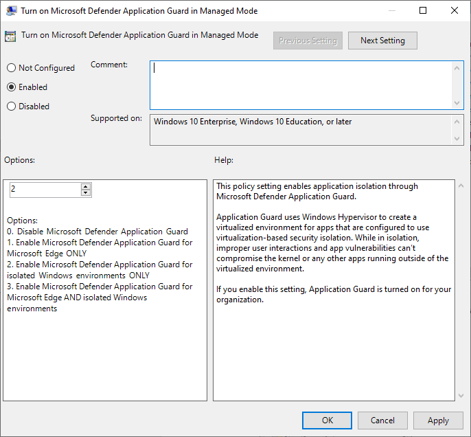

# <a name="application-guard-for-office-for-admins"></a><span data-ttu-id="88f96-105">Application Guard para Office para administradores</span><span class="sxs-lookup"><span data-stu-id="88f96-105">Application Guard for Office for admins</span></span>

<span data-ttu-id="88f96-106">**Aplica-se a:** Word, Excel e PowerPoint para Microsoft 365, Windows 10 Enterprise</span><span class="sxs-lookup"><span data-stu-id="88f96-106">**Applies to:** Word, Excel, and PowerPoint for Microsoft 365, Windows 10 Enterprise</span></span>

<span data-ttu-id="88f96-107">O Microsoft Defender Application Guard para Office (Application Guard para Office) ajuda a evitar que arquivos não confiáveis acessem recursos confiáveis, mantendo sua empresa segura contra ataques novos e emergentes.</span><span class="sxs-lookup"><span data-stu-id="88f96-107">Microsoft Defender Application Guard for Office (Application Guard for Office) helps prevent untrusted files from accessing trusted resources, keeping your enterprise safe from new and emerging attacks.</span></span> <span data-ttu-id="88f96-108">Este artigo orienta os administradores sobre como configurar dispositivos para uma visualização do Application Guard para Office.</span><span class="sxs-lookup"><span data-stu-id="88f96-108">This article walks admins through setting up devices for a preview of Application Guard for Office.</span></span> <span data-ttu-id="88f96-109">Ele fornece informações sobre os requisitos do sistema e as etapas de instalação para habilitar o Application Guard para Office em um dispositivo.</span><span class="sxs-lookup"><span data-stu-id="88f96-109">It provides information about system requirements and installation steps to enable Application Guard for Office on a device.</span></span>

## <a name="prerequisites"></a><span data-ttu-id="88f96-110">Pré-requisitos</span><span class="sxs-lookup"><span data-stu-id="88f96-110">Prerequisites</span></span>

### <a name="minimum-hardware-requirements"></a><span data-ttu-id="88f96-111">Requisitos mínimos de hardware</span><span class="sxs-lookup"><span data-stu-id="88f96-111">Minimum hardware requirements</span></span>

* <span data-ttu-id="88f96-112">**CPU**: 64 bits, 4 núcleos (físico ou virtual), extensões de virtualização (Intel VT-x OU AMD-V), Core i5 equivalente ou superior recomendado</span><span class="sxs-lookup"><span data-stu-id="88f96-112">**CPU**: 64-bit, 4 cores (physical or virtual), virtualization extensions   (Intel VT-x OR AMD-V), Core i5 equivalent or higher recommended</span></span>
* <span data-ttu-id="88f96-113">**Memória física**: 8 GB de RAM</span><span class="sxs-lookup"><span data-stu-id="88f96-113">**Physical memory**: 8-GB RAM</span></span>
* <span data-ttu-id="88f96-114">**Disco rígido**: 10 GB de espaço livre na unidade do sistema (SSD recomendado)</span><span class="sxs-lookup"><span data-stu-id="88f96-114">**Hard disk**: 10 GB of free space on the system drive (SSD recommended)</span></span>

### <a name="minimum-software-requirements"></a><span data-ttu-id="88f96-115">Requisitos mínimos de software</span><span class="sxs-lookup"><span data-stu-id="88f96-115">Minimum software requirements</span></span>

* <span data-ttu-id="88f96-116">**Windows 10**: windows 10 Enterprise edition, client build versão 2004 (20H1) build 19041 ou posterior</span><span class="sxs-lookup"><span data-stu-id="88f96-116">**Windows 10**: Windows 10 Enterprise edition, Client Build version 2004 (20H1) build 19041 or later</span></span>
* <span data-ttu-id="88f96-117">**Office**: Office Current Channel Build versão 2011 16.0.13530.10000 ou posterior.</span><span class="sxs-lookup"><span data-stu-id="88f96-117">**Office**: Office Current Channel Build version 2011 16.0.13530.10000 or later.</span></span> <span data-ttu-id="88f96-118">Há suporte para versões de 32 bits e 64 bits do Office.</span><span class="sxs-lookup"><span data-stu-id="88f96-118">Both 32-bit and 64-bit versions of Office are supported.</span></span>
* <span data-ttu-id="88f96-119">**Pacote de atualização**: atualização cumulativa de segurança mensal do Windows 10 [KB4571756](https://support.microsoft.com/help/4571756/windows-10-update-KB4571756)</span><span class="sxs-lookup"><span data-stu-id="88f96-119">**Update package**: Windows 10 cumulative monthly security update [KB4571756](https://support.microsoft.com/help/4571756/windows-10-update-KB4571756)</span></span>

<span data-ttu-id="88f96-120">Para requisitos detalhados do sistema, consulte [os requisitos do sistema para o Microsoft Defender Application Guard.](https://docs.microsoft.com/windows/security/threat-protection/microsoft-defender-application-guard/reqs-md-app-guard)</span><span class="sxs-lookup"><span data-stu-id="88f96-120">For detailed system requirements, refer to [System requirements for Microsoft Defender Application Guard](https://docs.microsoft.com/windows/security/threat-protection/microsoft-defender-application-guard/reqs-md-app-guard).</span></span> <span data-ttu-id="88f96-121">Para saber mais sobre os canais de atualização do Office, confira [Visão geral dos canais de atualização do Microsoft 365.](https://docs.microsoft.com/deployoffice/overview-update-channels)</span><span class="sxs-lookup"><span data-stu-id="88f96-121">To learn more about Office update channels, see [Overview of update channels for Microsoft 365](https://docs.microsoft.com/deployoffice/overview-update-channels).</span></span>

### <a name="licensing-requirements"></a><span data-ttu-id="88f96-122">Requisitos de licença</span><span class="sxs-lookup"><span data-stu-id="88f96-122">Licensing requirements</span></span>

* <span data-ttu-id="88f96-123">Microsoft 365 E5 ou Microsoft 365 E5 Security</span><span class="sxs-lookup"><span data-stu-id="88f96-123">Microsoft 365 E5 or Microsoft 365 E5 Security</span></span>

## <a name="deploy-application-guard-for-office"></a><span data-ttu-id="88f96-124">Implantar o Application Guard para Office</span><span class="sxs-lookup"><span data-stu-id="88f96-124">Deploy Application Guard for Office</span></span>

### <a name="enable-application-guard-for-office"></a><span data-ttu-id="88f96-125">Habilitar o Application Guard para Office</span><span class="sxs-lookup"><span data-stu-id="88f96-125">Enable Application Guard for Office</span></span>

1. <span data-ttu-id="88f96-126">Baixe e instale **atualizações de segurança mensais cumulativas do Windows 10 KB4571756.**</span><span class="sxs-lookup"><span data-stu-id="88f96-126">Download and install **Windows 10 cumulative monthly security updates KB4571756**.</span></span>

2. <span data-ttu-id="88f96-127">Selecione **o Microsoft Defender Application Guard** em Recursos do Windows e selecione **OK.**</span><span class="sxs-lookup"><span data-stu-id="88f96-127">Select **Microsoft Defender Application Guard** under Windows Features and  select **OK**.</span></span> <span data-ttu-id="88f96-128">A habilitação do recurso Application Guard solicitará uma reinicialização do sistema.</span><span class="sxs-lookup"><span data-stu-id="88f96-128">Enabling the Application Guard feature will prompt a system reboot.</span></span> <span data-ttu-id="88f96-129">Você pode optar por reiniciar agora ou após a etapa 3.</span><span class="sxs-lookup"><span data-stu-id="88f96-129">You can choose to reboot now or after step 3.</span></span>

   

   <span data-ttu-id="88f96-131">O recurso também pode ser habilitado executando o seguinte comando do PowerShell como administrador:</span><span class="sxs-lookup"><span data-stu-id="88f96-131">The feature can also be enabled by running the following PowerShell command as administrator:</span></span>

   ```powershell
   Enable-WindowsOptionalFeature -online -FeatureName Windows-Defender-ApplicationGuard
   ```

3. <span data-ttu-id="88f96-132">Procure o **Microsoft Defender Application Guard no Modo** Gerenciado, uma política de grupo nos Modelos Administrativos de Configuração do Computador dos Componentes do Windows Microsoft Defender Application **\\ \\ \\ Guard.**</span><span class="sxs-lookup"><span data-stu-id="88f96-132">Search for **Microsoft Defender Application Guard in Managed Mode**, a group policy in **Computer Configuration\\Administrative Templates\\Windows Components\\Microsoft Defender Application Guard**.</span></span> <span data-ttu-id="88f96-133">A turn on this policy by setting the value under Options as **2** or **3**, and then selecting **OK** or **Apply**.</span><span class="sxs-lookup"><span data-stu-id="88f96-133">Turn on this policy by setting the value under Options as **2** or **3**, and then selecting **OK** or **Apply**.</span></span>

   

   <span data-ttu-id="88f96-135">Em vez disso, você pode definir a política CSP correspondente:</span><span class="sxs-lookup"><span data-stu-id="88f96-135">Instead, you can set the corresponding CSP policy:</span></span>

   > <span data-ttu-id="88f96-136">OMA-URI: **./Device/Vendor/MSFT/WindowsDefenderApplicationGuard/Settings/AllowWindowsDefenderApplicationGuard**</span><span class="sxs-lookup"><span data-stu-id="88f96-136">OMA-URI: **./Device/Vendor/MSFT/WindowsDefenderApplicationGuard/Settings/AllowWindowsDefenderApplicationGuard**</span></span> <br> <span data-ttu-id="88f96-137">Tipo de dados: **Inteiro**</span><span class="sxs-lookup"><span data-stu-id="88f96-137">Data type: **Integer**</span></span> <br> <span data-ttu-id="88f96-138">Valor: **2**</span><span class="sxs-lookup"><span data-stu-id="88f96-138">Value: **2**</span></span>

4. <span data-ttu-id="88f96-139">Reinicie o sistema.</span><span class="sxs-lookup"><span data-stu-id="88f96-139">Restart the system.</span></span>

### <a name="set-diagnostics--feedback-to-send-full-data"></a><span data-ttu-id="88f96-140">Definir Comentários & diagnóstico para enviar dados completos</span><span class="sxs-lookup"><span data-stu-id="88f96-140">Set Diagnostics & feedback to send full data</span></span>

<span data-ttu-id="88f96-141">Esta etapa garante que os dados necessários para identificar e corrigir problemas estão atingindo a Microsoft.</span><span class="sxs-lookup"><span data-stu-id="88f96-141">This step ensures that the data necessary to identify and fix problems is reaching Microsoft.</span></span> <span data-ttu-id="88f96-142">Siga estas etapas para habilitar o diagnóstico em seu dispositivo Windows:</span><span class="sxs-lookup"><span data-stu-id="88f96-142">Follow these steps to enable diagnostics on your Windows device:</span></span>

1. <span data-ttu-id="88f96-143">Abra **Configurações** no menu Iniciar.</span><span class="sxs-lookup"><span data-stu-id="88f96-143">Open **Settings** from the Start menu.</span></span>

   

2. <span data-ttu-id="88f96-145">Em **Configurações do Windows,** selecione **Privacidade.**</span><span class="sxs-lookup"><span data-stu-id="88f96-145">On **Windows Settings**, select **Privacy**.</span></span>

   

3. <span data-ttu-id="88f96-147">Em Privacidade, selecione **Diagnósticos & comentários** e selecione **Dados de diagnóstico opcionais.**</span><span class="sxs-lookup"><span data-stu-id="88f96-147">Under Privacy, select **Diagnostics & feedback** and select **Optional diagnostic data**.</span></span>

   

<span data-ttu-id="88f96-149">Para obter mais informações sobre como definir as configurações de diagnóstico do Windows, consulte [a configuração de dados de diagnóstico do Windows em sua organização.](https://docs.microsoft.com/windows/privacy/configure-windows-diagnostic-data-in-your-organization#enterprise-management)</span><span class="sxs-lookup"><span data-stu-id="88f96-149">For more on configuring Windows diagnostic settings, refer to [Configuring Windows diagnostic data in your organization](https://docs.microsoft.com/windows/privacy/configure-windows-diagnostic-data-in-your-organization#enterprise-management).</span></span>

### <a name="confirm-that-application-guard-for-office-is-enabled-and-working"></a><span data-ttu-id="88f96-150">Confirmar se o Application Guard para Office está habilitado e funcionando</span><span class="sxs-lookup"><span data-stu-id="88f96-150">Confirm that Application Guard for Office is enabled and working</span></span>

<span data-ttu-id="88f96-151">Antes de confirmar se o Application Guard para Office está habilitado, iniciar o Word, o Excel ou o PowerPoint em um dispositivo onde as políticas foram implantadas.</span><span class="sxs-lookup"><span data-stu-id="88f96-151">Before confirming that Application Guard for Office is enabled, launch Word, Excel, or PowerPoint on a device where the policies have been deployed.</span></span> <span data-ttu-id="88f96-152">Certifique-se de que o Office está ativado.</span><span class="sxs-lookup"><span data-stu-id="88f96-152">Make sure Office is activated.</span></span> <span data-ttu-id="88f96-153">Talvez seja necessário usar sua identidade de trabalho para ativar o produto do Office primeiro.</span><span class="sxs-lookup"><span data-stu-id="88f96-153">You may need to use your work identity to activate the Office product first.</span></span>

<span data-ttu-id="88f96-154">Para confirmar se o Application Guard para Office está habilitado, abra o Word, o Excel ou o PowerPoint e abra um documento não falso.</span><span class="sxs-lookup"><span data-stu-id="88f96-154">To confirm that Application Guard for Office is enabled, launch Word, Excel, or PowerPoint, and then open an untrusted document.</span></span> <span data-ttu-id="88f96-155">Por exemplo, você pode abrir um documento que foi baixado da Internet ou um anexo de email de alguém de fora da sua organização.</span><span class="sxs-lookup"><span data-stu-id="88f96-155">For example, you can open a document that was downloaded from the internet or an email attachment from someone outside your organization.</span></span>

<span data-ttu-id="88f96-156">Quando abrir pela primeira vez um arquivo não falso, você poderá ver uma tela inicial do Office como o exemplo a seguir.</span><span class="sxs-lookup"><span data-stu-id="88f96-156">When you first open an untrusted file, you may see an Office splash screen like the following example.</span></span> <span data-ttu-id="88f96-157">Ele pode ser exibido por algum tempo enquanto o Application Guard para Office está sendo ativado e o arquivo está sendo aberto.</span><span class="sxs-lookup"><span data-stu-id="88f96-157">It might be displayed for some time while Application Guard for Office is being activated and the file is being opened.</span></span> <span data-ttu-id="88f96-158">As aberturas subsequentes de arquivos não confianças devem ser mais rápidas.</span><span class="sxs-lookup"><span data-stu-id="88f96-158">Subsequent openings of untrusted files should be faster.</span></span>


<span data-ttu-id="88f96-160">Ao ser aberto, o arquivo deve exibir alguns indicadores visuais de que o arquivo foi aberto dentro do Application Guard para Office:</span><span class="sxs-lookup"><span data-stu-id="88f96-160">Upon being opened, the file should display a few visual indicators that the file was opened inside Application Guard for Office:</span></span>

* <span data-ttu-id="88f96-161">Um callout na faixa de opções</span><span class="sxs-lookup"><span data-stu-id="88f96-161">A callout in the ribbon</span></span>

  

* <span data-ttu-id="88f96-163">O ícone do aplicativo com um escudo na barra de tarefas</span><span class="sxs-lookup"><span data-stu-id="88f96-163">The application icon with a shield in the taskbar</span></span>

  

## <a name="configure-application-guard-for-office"></a><span data-ttu-id="88f96-165">Configurar o Application Guard para Office</span><span class="sxs-lookup"><span data-stu-id="88f96-165">Configure Application Guard for Office</span></span>

<span data-ttu-id="88f96-166">O Office oferece suporte às seguintes políticas para permitir que você configure os recursos do Application Guard para Office.</span><span class="sxs-lookup"><span data-stu-id="88f96-166">Office supports the following policies to enable you to configure the capabilities of Application Guard for Office.</span></span> <span data-ttu-id="88f96-167">Essas políticas podem ser configuradas por meio de políticas de grupo ou por meio do serviço de política de nuvem do Office.</span><span class="sxs-lookup"><span data-stu-id="88f96-167">These policies can be configured through Group policies or through the Office cloud policy service.</span></span>

> [!NOTE]
> <span data-ttu-id="88f96-168">Configurar essas políticas pode desabilitar algumas funcionalidades para arquivos abertos no Application Guard para Office.</span><span class="sxs-lookup"><span data-stu-id="88f96-168">Configuring these policies can disable some functionalities for files opened in Application Guard for Office.</span></span>

|<span data-ttu-id="88f96-169">Política</span><span class="sxs-lookup"><span data-stu-id="88f96-169">Policy</span></span>|<span data-ttu-id="88f96-170">Descrição</span><span class="sxs-lookup"><span data-stu-id="88f96-170">Description</span></span>|
|---|---|
|<span data-ttu-id="88f96-171">Não usar o Application Guard para Office</span><span class="sxs-lookup"><span data-stu-id="88f96-171">Don't use Application Guard for Office</span></span>|<span data-ttu-id="88f96-172">A habilitação dessa política força o Word, o Excel e o PowerPoint a usar o contêiner de isolamento do Protected View em vez do Application Guard para Office.</span><span class="sxs-lookup"><span data-stu-id="88f96-172">Enabling this policy will force Word, Excel, and PowerPoint to use the Protected View isolation container instead of Application Guard for Office.</span></span> <span data-ttu-id="88f96-173">Essa política pode ser usada para desabilitar temporariamente o Application Guard para Office quando há problemas ao deixá-lo habilitado para o Microsoft Edge.</span><span class="sxs-lookup"><span data-stu-id="88f96-173">This policy can be used to temporarily disable Application Guard for Office when there are issues in leaving it enabled for Microsoft Edge.</span></span>|
|<span data-ttu-id="88f96-174">Configurar o Application Guard para pré-criação de contêiner do Office</span><span class="sxs-lookup"><span data-stu-id="88f96-174">Configure Application Guard for Office container pre-creation</span></span>|<span data-ttu-id="88f96-175">Essa política determina se o contêiner do Application Guard para Office, para isolar arquivos não-não-confiança, é pré-criado para melhorar o desempenho em tempo de execução.</span><span class="sxs-lookup"><span data-stu-id="88f96-175">This policy determines if the Application Guard for Office container, for isolating untrusted files, is pre-created for improved run-time performance.</span></span> <span data-ttu-id="88f96-176">Se você habilitar essa configuração, poderá especificar o número de dias para continuar pré-criar um contêiner ou permitir que a heurística do Office crie o contêiner previamente.</span><span class="sxs-lookup"><span data-stu-id="88f96-176">If you enable this setting, you can specify the number of days to continue pre-creating a container or let the Office built-in heuristic pre-create the container.</span></span>
|<span data-ttu-id="88f96-177">Não permitir copiar/colar para documentos do Office abertos no Application Guard para Office</span><span class="sxs-lookup"><span data-stu-id="88f96-177">Don't allow copy/paste for Office documents opened in Application Guard for Office</span></span>|<span data-ttu-id="88f96-178">Habilenciar essa política impedirá que um usuário copie e paste o conteúdo de um documento aberto no Application Guard for Office para um documento aberto fora dele.</span><span class="sxs-lookup"><span data-stu-id="88f96-178">Enabling this policy will prevent a user from copying and pasting content from a document opened in Application Guard for Office to a document opened outside of it.</span></span>|
|<span data-ttu-id="88f96-179">Desabilitar a aceleração de hardware no Application Guard para Office</span><span class="sxs-lookup"><span data-stu-id="88f96-179">Disable hardware acceleration in Application Guard for Office</span></span>|<span data-ttu-id="88f96-180">Essa política controla se o Application Guard para Office usa aceleração de hardware para renderizar elementos gráficos.</span><span class="sxs-lookup"><span data-stu-id="88f96-180">This policy controls whether Application Guard for Office uses hardware acceleration to render graphics.</span></span> <span data-ttu-id="88f96-181">Se você habilitar essa configuração, o Application Guard para Office usará a renderização baseada em software (CPU) e não carregará drivers gráficos de terceiros nem interagirá com nenhum hardware gráfico conectado.</span><span class="sxs-lookup"><span data-stu-id="88f96-181">If you enable this setting, Application Guard for Office uses software-based (CPU) rendering and won't load any third-party graphics drivers or interact with any connected graphics hardware.</span></span>
|<span data-ttu-id="88f96-182">Desabilitar a proteção de tipos de arquivo sem suporte no Application Guard para Office</span><span class="sxs-lookup"><span data-stu-id="88f96-182">Disable unsupported file types protection in Application Guard for Office</span></span>|<span data-ttu-id="88f96-183">Essa política controla se o Application Guard para Office bloqueará a abertura de tipos de arquivo sem suporte ou se habilita o redirecionamento para o Modo de Exibição Protegido.</span><span class="sxs-lookup"><span data-stu-id="88f96-183">This policy controls whether Application Guard for Office will block unsupported file types from being opened or if it will enable the redirection to Protected View.</span></span>
|<span data-ttu-id="88f96-184">Desativar o acesso à câmera e ao microfone para documentos abertos no Application Guard para Office</span><span class="sxs-lookup"><span data-stu-id="88f96-184">Turn off camera and microphone access for documents opened in Application Guard for Office</span></span>|<span data-ttu-id="88f96-185">A habilitação dessa política removerá o acesso do Office à câmera e ao microfone dentro do Application Guard para Office.</span><span class="sxs-lookup"><span data-stu-id="88f96-185">Enabling this policy will remove Office access to the camera and microphone inside Application Guard for Office.</span></span>|
|<span data-ttu-id="88f96-186">Restringir a impressão de documentos abertos no Application Guard para Office</span><span class="sxs-lookup"><span data-stu-id="88f96-186">Restrict printing from documents opened in Application Guard for Office</span></span>|<span data-ttu-id="88f96-187">A habilitação dessa política limitará as impressoras que um usuário pode imprimir a partir de um arquivo aberto no Application Guard para Office.</span><span class="sxs-lookup"><span data-stu-id="88f96-187">Enabling this policy will limit the printers that a user can print to from a file opened in Application Guard for Office.</span></span> <span data-ttu-id="88f96-188">Por exemplo, você pode usar essa política para restringir os usuários a imprimir somente em PDF.</span><span class="sxs-lookup"><span data-stu-id="88f96-188">For example, you can use this policy to restrict users to only print to PDF.</span></span>|
|<span data-ttu-id="88f96-189">Impedir que os usuários removam o Application Guard para proteção do Office em arquivos</span><span class="sxs-lookup"><span data-stu-id="88f96-189">Prevent users from removing Application Guard for Office protection on files</span></span>|<span data-ttu-id="88f96-190">A habilitação dessa política removerá a opção (dentro da experiência do aplicativo do Office) para desabilitar o Application Guard para Proteção do Office ou abrir um arquivo fora do Application Guard para Office.</span><span class="sxs-lookup"><span data-stu-id="88f96-190">Enabling this policy will remove the option (within the Office application experience) to disable Application Guard for Office protection or to open a file outside Application Guard for Office.</span></span> <p> <span data-ttu-id="88f96-191">**Observação:** Os usuários ainda podem ignorar essa política removendo manualmente a propriedade mark-of-the-web do arquivo ou movendo um documento para um local confiável.</span><span class="sxs-lookup"><span data-stu-id="88f96-191">**Note:** Users can still bypass this policy by manually removing the mark-of-the-web property from the file or by moving a document to a Trusted location.</span></span>|
|

> [!NOTE]
> <span data-ttu-id="88f96-192">As políticas a seguir exigirão que o usuário saia e entre novamente no Windows para entrar em vigor:</span><span class="sxs-lookup"><span data-stu-id="88f96-192">The following policies will require the user to sign out and sign in again to Windows to take effect:</span></span>
>
> * <span data-ttu-id="88f96-193">Desabilitar copiar/colar para documentos abertos no Application Guard para Office</span><span class="sxs-lookup"><span data-stu-id="88f96-193">Disable copy/paste for documents opened in Application Guard for Office</span></span>
> * <span data-ttu-id="88f96-194">Restringir a impressão de documentos abertos no Application Guard para Office</span><span class="sxs-lookup"><span data-stu-id="88f96-194">Restrict printing for documents opened in Application Guard for Office</span></span>
> * <span data-ttu-id="88f96-195">Desativar o acesso de câmera e microfone a documentos abertos no Application Guard para Office</span><span class="sxs-lookup"><span data-stu-id="88f96-195">Turn off camera and mic access to documents opened in Application Guard for Office</span></span>

## <a name="submit-feedback"></a><span data-ttu-id="88f96-196">Enviar comentários</span><span class="sxs-lookup"><span data-stu-id="88f96-196">Submit feedback</span></span>

### <a name="submit-feedback-via-feedback-hub"></a><span data-ttu-id="88f96-197">Enviar comentários por meio do Hub de Feedback</span><span class="sxs-lookup"><span data-stu-id="88f96-197">Submit feedback via Feedback Hub</span></span>

<span data-ttu-id="88f96-198">Se você encontrar problemas ao iniciar o Application Guard para Office, é incentivado a enviar seus comentários por meio do Hub de Feedback:</span><span class="sxs-lookup"><span data-stu-id="88f96-198">If you encounter any issues when launching Application Guard for Office, you're encouraged to submit your feedback via Feedback Hub:</span></span>

1. <span data-ttu-id="88f96-199">Abra o **aplicativo Hub de Feedback** e entre.</span><span class="sxs-lookup"><span data-stu-id="88f96-199">Open the **Feedback Hub app** and sign in.</span></span>

2. <span data-ttu-id="88f96-200">Se você receber uma caixa de diálogo de erro ao iniciar o Application Guard, selecione Relatar para a **Microsoft** na caixa de diálogo de erro para iniciar um novo envio de comentários.</span><span class="sxs-lookup"><span data-stu-id="88f96-200">If you get an error dialog while launching Application Guard, select **Report to Microsoft** in the error dialog to start a new feedback submission.</span></span> <span data-ttu-id="88f96-201">Caso contrário, <https://aka.ms/mdagoffice-fb> navegue até selecionar a categoria correta para o Application Guard e selecione **+ &nbsp; Adicionar novos comentários** próximo ao canto superior direito.</span><span class="sxs-lookup"><span data-stu-id="88f96-201">Otherwise, navigate to <https://aka.ms/mdagoffice-fb> to select the correct category for Application Guard, then select **+&nbsp;Add new feedback** near the top right.</span></span>

3. <span data-ttu-id="88f96-202">Insira um resumo na caixa **Resumir** seus comentários se ele ainda não estiver preenchido para você.</span><span class="sxs-lookup"><span data-stu-id="88f96-202">Enter a summary in the **Summarize your feedback** box if it isn't already filled in for you.</span></span>

4. <span data-ttu-id="88f96-203">Insira uma descrição detalhada do problema que você experimentou e quais etapas você tomou na caixa Explicar em mais detalhes e, em seguida, selecione **Next**. </span><span class="sxs-lookup"><span data-stu-id="88f96-203">Enter a detailed description of the issue that you experienced and what steps you took in the **Explain in more detail** box, then select **Next**.</span></span>

5. <span data-ttu-id="88f96-204">Selecione a bolha ao lado de **Problema.**</span><span class="sxs-lookup"><span data-stu-id="88f96-204">Select the bubble next to **Problem**.</span></span> <span data-ttu-id="88f96-205">Certifique-se de que a categoria selecionada **é Segurança e Privacidade do Microsoft Defender Application Guard – \> Office** e selecione **Próximo**.</span><span class="sxs-lookup"><span data-stu-id="88f96-205">Make sure the category selected is **Security and Privacy \> Microsoft Defender Application Guard – Office**, then select **Next**.</span></span>

6. <span data-ttu-id="88f96-206">Selecione **Novo comentário** e, em **seguida, Próximo.**</span><span class="sxs-lookup"><span data-stu-id="88f96-206">Select **New feedback**, then **Next**.</span></span>

7. <span data-ttu-id="88f96-207">Coletar rastreamentos sobre o problema:</span><span class="sxs-lookup"><span data-stu-id="88f96-207">Collect traces about the issue:</span></span>

   1. <span data-ttu-id="88f96-208">Expanda **oile Recriar meu** problema.</span><span class="sxs-lookup"><span data-stu-id="88f96-208">Expand the **Recreate my problem** tile.</span></span>

   2. <span data-ttu-id="88f96-209">Se o problema que você está enfrentando ocorrer durante a execução do Application Guard, abra uma instância do Application Guard.</span><span class="sxs-lookup"><span data-stu-id="88f96-209">If the issue you're experiencing occurs while Application Guard is running, open an Application Guard instance.</span></span> <span data-ttu-id="88f96-210">Abrir uma instância permite que rastreamentos adicionais sejam coletados de dentro do contêiner do Application Guard.</span><span class="sxs-lookup"><span data-stu-id="88f96-210">Opening an instance allows additional traces to be collected from within the Application Guard container.</span></span>

   3. <span data-ttu-id="88f96-211">Selecione **Iniciar gravação** e aguarde até que o tile pare de girar e diga Parar *gravação.*</span><span class="sxs-lookup"><span data-stu-id="88f96-211">Select **Start recording**, and wait for the tile to stop spinning and say *Stop recording*.</span></span>

   4. <span data-ttu-id="88f96-212">Reproduza totalmente o problema com o Application Guard.</span><span class="sxs-lookup"><span data-stu-id="88f96-212">Fully reproduce the issue with Application Guard.</span></span> <span data-ttu-id="88f96-213">A reprodução pode incluir a tentativa de iniciar uma instância do Application Guard e aguardar até que ela falhe ou reproduzir um problema em uma instância do Application Guard em execução.</span><span class="sxs-lookup"><span data-stu-id="88f96-213">Reproduction might include attempting to launch an Application Guard instance and waiting until it fails, or reproducing an issue in a running Application Guard instance.</span></span>

   5. <span data-ttu-id="88f96-214">Selecione o **tile Parar gravação.**</span><span class="sxs-lookup"><span data-stu-id="88f96-214">Select the **Stop recording** tile.</span></span>

   6. <span data-ttu-id="88f96-215">Mantenha todas as instâncias do Application Guard em execução abertas, mesmo por alguns minutos após o envio, para que o diagnóstico de contêiner também possa ser coletado.</span><span class="sxs-lookup"><span data-stu-id="88f96-215">Keep any running Application Guard instance(s) open, even for a few minutes after submission, so that container diagnostics can also be collected.</span></span>

8. <span data-ttu-id="88f96-216">Anexe quaisquer capturas de tela ou arquivos relevantes relacionados ao problema.</span><span class="sxs-lookup"><span data-stu-id="88f96-216">Attach any relevant screenshots or files related to the problem.</span></span>

9. <span data-ttu-id="88f96-217">Selecione **Enviar**.</span><span class="sxs-lookup"><span data-stu-id="88f96-217">Select **Submit**.</span></span>

### <a name="submit-feedback-via-office-customer-voice"></a><span data-ttu-id="88f96-218">Enviar comentários por meio do Office Customer Voice</span><span class="sxs-lookup"><span data-stu-id="88f96-218">Submit feedback via Office Customer Voice</span></span>

<span data-ttu-id="88f96-219">Você também pode enviar comentários do Office se o problema ocorrer quando os documentos do Office são abertos no Application Guard.</span><span class="sxs-lookup"><span data-stu-id="88f96-219">You may also submit feedback from within Office if the issue happens when Office documents are opened in Application Guard.</span></span> <span data-ttu-id="88f96-220">Consulte o Manual [do Office Insider](https://insider.office.com/handbook) para enviar comentários.</span><span class="sxs-lookup"><span data-stu-id="88f96-220">Refer to the [Office Insider Handbook](https://insider.office.com/handbook) for submitting feedback.</span></span>

## <a name="integration-with-microsoft-defender-for-endpoint-and-microsoft-defender-for-office-365"></a><span data-ttu-id="88f96-221">Integração com o Microsoft Defender para Endpoint e o Microsoft Defender para Office 365</span><span class="sxs-lookup"><span data-stu-id="88f96-221">Integration with Microsoft Defender for Endpoint and Microsoft Defender for Office 365</span></span>

<span data-ttu-id="88f96-222">O Application Guard para Office está integrado ao Microsoft Defender for Endpoint para fornecer monitoramento e alerta sobre atividades mal-intencionadas que ocorrem no ambiente isolado.</span><span class="sxs-lookup"><span data-stu-id="88f96-222">Application Guard for Office is integrated with Microsoft Defender for Endpoint to provide monitoring and alerting on malicious activity that happens in the isolated environment.</span></span>

<span data-ttu-id="88f96-223">O Microsoft Defender for Endpoint é uma plataforma de segurança projetada para ajudar as redes corporativas a prevenir, detectar, investigar e responder a ameaças avançadas.</span><span class="sxs-lookup"><span data-stu-id="88f96-223">Microsoft Defender for Endpoint is a security platform designed to help enterprise networks prevent, detect, investigate, and respond to advanced threats.</span></span> <span data-ttu-id="88f96-224">Para obter mais detalhes sobre essa plataforma, consulte [o Microsoft Defender para Ponto de Extremidade.](https://www.microsoft.com/microsoft-365/windows/microsoft-defender-atp)</span><span class="sxs-lookup"><span data-stu-id="88f96-224">For more details about this platform, see [Microsoft Defender for Endpoint](https://www.microsoft.com/microsoft-365/windows/microsoft-defender-atp).</span></span> <span data-ttu-id="88f96-225">Para saber mais sobre a integração de dispositivos nessa plataforma, consulte Dispositivos onboard [para o serviço Microsoft Defender para Ponto de Extremidade.](https://docs.microsoft.com/windows/security/threat-protection/microsoft-defender-atp/onboard-configure)</span><span class="sxs-lookup"><span data-stu-id="88f96-225">To learn more about onboarding devices to this platform, see [Onboard devices to the Microsoft Defender for Endpoint service](https://docs.microsoft.com/windows/security/threat-protection/microsoft-defender-atp/onboard-configure).</span></span>

<span data-ttu-id="88f96-226">Você também pode configurar o Microsoft Defender para Office 365 para trabalhar com o Defender para o Ponto de Extremidade.</span><span class="sxs-lookup"><span data-stu-id="88f96-226">You can also configure Microsoft Defender for Office 365 to work with Defender for Endpoint.</span></span> <span data-ttu-id="88f96-227">Para obter mais informações, consulte [Integrar o Defender para Office 365 com o Microsoft Defender para Ponto de Extremidade.](integrate-office-365-ti-with-wdatp.md)</span><span class="sxs-lookup"><span data-stu-id="88f96-227">For more info, refer to [Integrate Defender for Office 365 with Microsoft Defender for Endpoint](integrate-office-365-ti-with-wdatp.md).</span></span>

## <a name="limitations-and-considerations"></a><span data-ttu-id="88f96-228">Limitações e considerações</span><span class="sxs-lookup"><span data-stu-id="88f96-228">Limitations and considerations</span></span>

* <span data-ttu-id="88f96-229">O Application Guard para Office é um modo restrito que isola documentos não confiáveis para que eles não possam acessar recursos corporativos confiáveis, uma intranet, a identidade do usuário e arquivos arbitrários no computador.</span><span class="sxs-lookup"><span data-stu-id="88f96-229">Application Guard for Office is a restricted mode that isolates untrusted documents so that they can't access trusted corporate resources, an intranet, the user's identity, and arbitrary files on the computer.</span></span> <span data-ttu-id="88f96-230">Como resultado, se um usuário tentar acessar um recurso que tenha uma dependência nesse acesso — por exemplo, inserindo uma imagem de um arquivo local no disco — o acesso falhará e produzirá um prompt como o exemplo a seguir.</span><span class="sxs-lookup"><span data-stu-id="88f96-230">As a result, if a user tries to access a feature that has a dependency on such access—for example, inserting a picture from a local file on disk—the access will fail and produce a prompt like the following example.</span></span> <span data-ttu-id="88f96-231">Para permitir que um documento não confiável acesse recursos confiáveis, os usuários devem remover a proteção do Application Guard do documento.</span><span class="sxs-lookup"><span data-stu-id="88f96-231">To enable an untrusted document to access trusted resources, users must remove Application Guard protection from the document.</span></span>

  

  > [!NOTE]
  > <span data-ttu-id="88f96-233">Aconselhá os usuários a removerem a proteção apenas se confiarem no arquivo e em sua origem ou de onde ele veio.</span><span class="sxs-lookup"><span data-stu-id="88f96-233">Advise users to only remove protection if they trust the file and its source or where it came from.</span></span>

* <span data-ttu-id="88f96-234">O conteúdo ativo em documentos como macros e controles ActiveX está desabilitado no Application Guard para Office.</span><span class="sxs-lookup"><span data-stu-id="88f96-234">Active content in documents like macros and ActiveX controls are disabled in Application Guard for Office.</span></span> <span data-ttu-id="88f96-235">Os usuários precisam remover a proteção do Application Guard para habilitar o conteúdo ativo.</span><span class="sxs-lookup"><span data-stu-id="88f96-235">Users need to remove Application Guard protection to enable active content.</span></span>

* <span data-ttu-id="88f96-236">Arquivos nãotrudos de compartilhamentos de rede ou arquivos compartilhados do OneDrive, OneDrive for Business ou SharePoint Online de uma organização diferente abrem como somente leitura no Application Guard.</span><span class="sxs-lookup"><span data-stu-id="88f96-236">Untrusted files from network shares or files shared from OneDrive, OneDrive for Business, or SharePoint Online from a different organization open as read-only in Application Guard.</span></span> <span data-ttu-id="88f96-237">Os usuários podem salvar uma cópia local desses arquivos para continuar trabalhando no contêiner ou remover a proteção para trabalhar diretamente com o arquivo original.</span><span class="sxs-lookup"><span data-stu-id="88f96-237">Users can save a local copy of such files to continue working in the container or remove protection to directly work with the original file.</span></span>

* <span data-ttu-id="88f96-238">Os arquivos protegidos pelo Gerenciamento de Direitos de Informação (IRM) são bloqueados por padrão.</span><span class="sxs-lookup"><span data-stu-id="88f96-238">Files that are protected by Information Rights Management (IRM) are blocked by default.</span></span> <span data-ttu-id="88f96-239">Se os usuários quiserem abrir esses arquivos no Modo de Exibição Protegido, um administrador deverá definir as configurações de política para tipos de arquivo sem suporte para a organização.</span><span class="sxs-lookup"><span data-stu-id="88f96-239">If users want to open such files in Protected View, an administrator must configure policy settings for unsupported file types for the organization.</span></span>

* <span data-ttu-id="88f96-240">Quaisquer personalizações em aplicativos do Office no Application Guard para Office não persistirão depois que um usuário sair e entrar novamente ou depois que o dispositivo for reiniciado.</span><span class="sxs-lookup"><span data-stu-id="88f96-240">Any customizations to Office applications in Application Guard for Office won't persist after a user signs out and signs in again or after the device restarts.</span></span>

* <span data-ttu-id="88f96-241">Somente as ferramentas de acessibilidade que usam a estrutura UIA podem fornecer uma experiência acessível para arquivos abertos no Application Guard para Office.</span><span class="sxs-lookup"><span data-stu-id="88f96-241">Only Accessibility tools that use the UIA framework can provide an accessible experience for files opened in Application Guard for Office.</span></span>

* <span data-ttu-id="88f96-242">A conectividade de rede é necessária para a primeira iniciação do Application Guard após a instalação.</span><span class="sxs-lookup"><span data-stu-id="88f96-242">Network connectivity is required for the first launch of Application Guard after installation.</span></span> <span data-ttu-id="88f96-243">A conectividade é necessária para que o Application Guard valide a licença.</span><span class="sxs-lookup"><span data-stu-id="88f96-243">Connectivity is required for Application Guard to validate the license.</span></span>

* <span data-ttu-id="88f96-244">Na seção de informações do documento, a propriedade *Last Modified By* pode exibir **WDAGUtilityAccount** como o usuário.</span><span class="sxs-lookup"><span data-stu-id="88f96-244">In the document's info section, the *Last Modified By* property may display **WDAGUtilityAccount** as the user.</span></span> <span data-ttu-id="88f96-245">WDAGUtilityAccount é o usuário anônimo configurado no Application Guard.</span><span class="sxs-lookup"><span data-stu-id="88f96-245">WDAGUtilityAccount is the anonymous user configured in Application Guard.</span></span> <span data-ttu-id="88f96-246">A identidade do usuário da área de trabalho não é compartilhada dentro do contêiner do Application Guard.</span><span class="sxs-lookup"><span data-stu-id="88f96-246">The desktop user's identity isn't shared inside the Application Guard container.</span></span>

## <a name="performance-optimizations-for-application-guard-for-office"></a><span data-ttu-id="88f96-247">Otimizações de desempenho do Application Guard para Office</span><span class="sxs-lookup"><span data-stu-id="88f96-247">Performance optimizations for Application Guard for Office</span></span>

<span data-ttu-id="88f96-248">Esta seção fornece uma visão geral das otimizações de desempenho usadas no Application Guard para Office.</span><span class="sxs-lookup"><span data-stu-id="88f96-248">This section provides an overview of the performance optimizations used in Application Guard for Office.</span></span> <span data-ttu-id="88f96-249">Essas informações podem ajudar os administradores a diagnosticar relatórios de usuários relacionados ao desempenho do Office ou do sistema geral quando o Application Guard está habilitado.</span><span class="sxs-lookup"><span data-stu-id="88f96-249">This information can help administrators diagnose reports from users related to the performance of Office or the overall system when Application Guard is enabled.</span></span>

<span data-ttu-id="88f96-250">O Application Guard usa um contêiner virtualizado para isolar documentos não falsos do sistema.</span><span class="sxs-lookup"><span data-stu-id="88f96-250">Application Guard uses a virtualized container to isolate untrusted documents away from the system.</span></span> <span data-ttu-id="88f96-251">O processo de criar um contêiner e configurar o contêiner do Application Guard para abrir documentos do Office tem uma sobrecarga de desempenho que pode afetar negativamente a experiência do usuário quando os usuários abrem um documento não falso.</span><span class="sxs-lookup"><span data-stu-id="88f96-251">The process of creating a container and setting up the Application Guard container to open Office documents has a performance overhead that might negatively affect user experience when users open an untrusted document.</span></span>

<span data-ttu-id="88f96-252">Para fornecer aos usuários a experiência esperada de abertura de arquivos, o Application Guard usa lógica para pré-criar um contêiner quando a heurística a seguir é atendida em um sistema: um usuário abriu um arquivo no Protected View ou no Application Guard nos últimos 28 dias.</span><span class="sxs-lookup"><span data-stu-id="88f96-252">To provide users with the expected file-opening experience, Application Guard uses logic to pre-create a container when the following heuristic is met on a system: A user has opened a file in either Protected View or Application Guard in the past 28 days.</span></span>

<span data-ttu-id="88f96-253">Quando essa heurística for atendida, o Office criará previamente um contêiner do Application Guard para o usuário depois que ele entrar no Windows.</span><span class="sxs-lookup"><span data-stu-id="88f96-253">When this heuristic is met, Office will pre-create an Application Guard container for the user after they sign in to Windows.</span></span> <span data-ttu-id="88f96-254">Enquanto essa operação de pré-criação está em andamento, o sistema pode experimentar um desempenho lento, mas o efeito será resolvido assim que a operação for concluída.</span><span class="sxs-lookup"><span data-stu-id="88f96-254">While this pre-create operation is in progress, the system may experience slow performance, but the effect will resolve as soon as the operation completes.</span></span>

> [!NOTE]
> <span data-ttu-id="88f96-255">As dicas necessárias para a heurística criar previamente o contêiner são geradas pelos aplicativos do Office conforme um usuário as usa.</span><span class="sxs-lookup"><span data-stu-id="88f96-255">The hints needed for the heuristic to pre-create the container are generated by Office applications as a user uses them.</span></span> <span data-ttu-id="88f96-256">Se um usuário instalar o Office em um novo sistema em que o Application Guard está habilitado, o Office não criará previamente o contêiner até depois da primeira vez em que um usuário abrir um documento não falso no sistema.</span><span class="sxs-lookup"><span data-stu-id="88f96-256">If a user installs Office on a new system where Application Guard is enabled, Office will not pre-create the container until after the first time a user opens an untrusted document on the system.</span></span> <span data-ttu-id="88f96-257">O usuário observará que esse primeiro arquivo leva mais tempo para ser aberto no Application Guard.</span><span class="sxs-lookup"><span data-stu-id="88f96-257">The user will observe that this first file takes longer to open in Application Guard.</span></span>

## <a name="known-issues"></a><span data-ttu-id="88f96-258">Problemas conhecidos</span><span class="sxs-lookup"><span data-stu-id="88f96-258">Known issues</span></span>

* <span data-ttu-id="88f96-259">Selecionar links da Web ( `http` ou ) não abre o `https` navegador.</span><span class="sxs-lookup"><span data-stu-id="88f96-259">Selecting web links (`http` or `https`) doesn't open the browser.</span></span>
* <span data-ttu-id="88f96-260">Não há suporte para colar conteúdo ou imagens RTF (rich text format) em documentos do Office abertos com o Application Guard no momento.</span><span class="sxs-lookup"><span data-stu-id="88f96-260">Pasting rich text format (RTF) content or images in Office documents opened with Application Guard isn't supported at this time.</span></span>
* <span data-ttu-id="88f96-261">Atualizações no .NET causam falha na abertura de arquivos no Application Guard.</span><span class="sxs-lookup"><span data-stu-id="88f96-261">Updates to .NET cause files to fail to open in Application Guard.</span></span> <span data-ttu-id="88f96-262">Como alternativa, os usuários podem reiniciar o dispositivo quando se deparam com essa falha.</span><span class="sxs-lookup"><span data-stu-id="88f96-262">As a workaround, users can restart their device when they come across this failure.</span></span> <span data-ttu-id="88f96-263">Saiba mais sobre o problema ao [receber uma mensagem de erro ao tentar abrir o Windows Defender Application Guard ou a área de segurança do Windows.](https://support.microsoft.com/help/4575917/receiving-an-error-message-when-attempting-to-open-windows-defender-ap)</span><span class="sxs-lookup"><span data-stu-id="88f96-263">Learn more about the issue at [Receiving an error message when attempting to open Windows Defender Application Guard or Windows Sandbox](https://support.microsoft.com/help/4575917/receiving-an-error-message-when-attempting-to-open-windows-defender-ap).</span></span>
