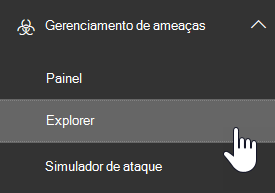
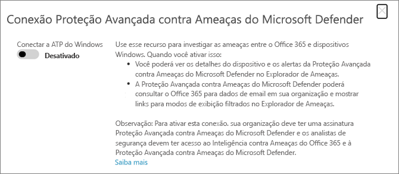

# Usar o Microsoft Defender para Office 365 com o Microsoft Defender para Ponto de ExtremidadeUse Microsoft Defender for Office 365 together with Microsoft Defender for Endpoint

[!INCLUDE [Microsoft 365 Defender rebranding](../includes/microsoft-defender-for-office.md)]

[O Microsoft Defender para Office 365](defender-for-office-365.md) pode ser configurado para trabalhar com o Microsoft Defender para Ponto de [Extremidade](/windows/security/threat-protection).[Microsoft Defender for Office 365](defender-for-office-365.md) can be configured to work with [Microsoft Defender for Endpoint](/windows/security/threat-protection).

A integração do Microsoft Defender para Office 365 com o Microsoft Defender para Ponto de Extremidade pode ajudar sua equipe de operações de segurança a monitorar e tomar medidas rapidamente se os dispositivos dos usuários estão em risco.Integrating Microsoft Defender for Office 365 with Microsoft Defender for Endpoint can help your security operations team monitor and take action quickly if users' devices are at risk. Por exemplo, depois que a integração for habilitada, sua equipe de operações de segurança poderá ver os dispositivos que são potencialmente afetados por uma mensagem de email detectada, bem como quantos alertas recentes foram gerados para esses dispositivos no Microsoft Defender para Endpoint.For example, once integration is enabled, your security operations team will be able to see the devices that are potentially affected by a detected email message, as well as how many recent alerts were generated for those devices in Microsoft Defender for Endpoint.

A imagem a seguir mostra a aparência da guia **Dispositivos** quando você tem a integração do Microsoft Defender for Endpoint habilitada:The following image depicts what the **Devices** tab looks like when you have Microsoft Defender for Endpoint integration enabled:

Neste exemplo, você pode ver que os destinatários da mensagem de email detectada têm quatro dispositivos e um tem um alerta.In this example, you can see that the recipients of the detected email message have four devices and one has an alert. Clicar no link de um dispositivo abre sua página [no Microsoft 365 Defender](../defender-endpoint/microsoft-defender-security-center.md) (anteriormente o Central de Segurança do Microsoft Defender).Clicking the link for a device opens its page in [Microsoft 365 Defender](../defender-endpoint/microsoft-defender-security-center.md) (formerly the Microsoft Defender Security Center).

> [!TIP]
> O Microsoft 365 portal do Defender substitui o Central de Segurança do Microsoft Defender.The Microsoft 365 Defender portal replaces the Microsoft Defender Security Center. Consulte [Microsoft Defender for Endpoint no Microsoft 365 Defender](../defender/microsoft-365-security-center-mde.md).See [Microsoft Defender for Endpoint in Microsoft 365 Defender](../defender/microsoft-365-security-center-mde.md).

## RequisitosRequirements

- Sua organização deve ter o Microsoft Defender para Office 365 (ou Office 365 E5) e o Microsoft Defender para Ponto de Extremidade.Your organization must have Microsoft Defender for Office 365 (or Office 365 E5) and Microsoft Defender for Endpoint.

- Você deve ser um administrador global ou ter uma função de administrador de segurança (como Administrador de Segurança) atribuída Microsoft 365.You must be a global administrator or have a security administrator role (such as Security Administrator) assigned in Microsoft 365. (Consulte Permissões no Centro de [Conformidade & Segurança](permissions-in-the-security-and-compliance-center.md))(See [Permissions in the Security & Compliance Center](permissions-in-the-security-and-compliance-center.md))

- Você deve ter acesso ao [Explorer (ou detecções em tempo real)](threat-explorer.md).You must have access to [Explorer (or real-time detections)](threat-explorer.md).

## Para integrar o Microsoft Defender para Office 365 com o Microsoft Defender para Ponto de ExtremidadeTo integrate Microsoft Defender for Office 365 with Microsoft Defender for Endpoint

A integração do Microsoft Defender para Office 365 com o Microsoft Defender for Endpoint está configurada no Defender para Ponto de Extremidade e no Defender para Office 365.Integrating Microsoft Defender for Office 365 with Microsoft Defender for Endpoint is set up in both Defender for Endpoint and Defender for Office 365.

1. Como administrador global ou administrador de segurança, acesse [https://protection.office.com](https://protection.office.com) e entre.As a global administrator or a security administrator, go to [https://protection.office.com](https://protection.office.com) and sign in. (Isso o leva ao Centro Office 365 Segurança & Conformidade.)(This takes you to the Office 365 Security & Compliance Center.)

2. No painel de navegação, escolha **Explorador de gerenciamento de** \> **ameaças.**In the navigation pane, choose **Threat management** \> **Explorer**.

   

3. No canto superior direito da tela, escolha **Defender for Endpoint Configurações (MDE Configurações)**.In the upper right corner of the screen, choose **Defender for Endpoint Settings (MDE Settings)**.

4. Na caixa de diálogo Conexão do Microsoft Defender para Ponto de Extremidade, a Conexão **para o Microsoft Defender para Ponto de Extremidade**.In the Microsoft Defender for Endpoint connection dialog box, turn on **Connect to Microsoft Defender for Endpoint**.

   

5. Vá para o portal Microsoft 365 Defender ( [https://security.microsoft.com](https://security.microsoft.com) .Go to the Microsoft 365 Defender portal ([https://security.microsoft.com](https://security.microsoft.com).

6. Na barra de navegação, escolha **Configurações**.In the navigation bar, choose **Settings**. Em **Geral,** escolha **Recursos avançados.**Then, under **General**, choose **Advanced features**.

7. Role para baixo **Office 365 conexão de Inteligência contra Ameaças** e a ligue.Scroll down to **Office 365 Threat Intelligence connection**, and turn the connection on.

   

## Artigos relacionadosRelated articles

[Recursos de investigação e resposta contra ameaças Office 365Threat investigation and response capabilities in Office 365](office-365-ti.md)

[Obter o Microsoft Defender para Office 365Microsoft Defender for Office 365](defender-for-office-365.md)

[Microsoft Defender para Ponto de ExtremidadeMicrosoft Defender for Endpoint](/windows/security/threat-protection)
