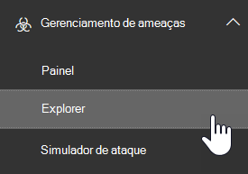

# Integrar a proteção avançada contra ameaças do Office 365 com a proteção avançada contra ameaças do Microsoft defenderIntegrate Office 365 Advanced Threat Protection with Microsoft Defender Advanced Threat Protection

[!INCLUDE [Microsoft 365 Defender rebranding](../includes/microsoft-defender-for-office.md)]

A [proteção avançada contra ameaças do office 365](https://docs.microsoft.com/microsoft-365/security/office-365-security/office-365-atp?view=o365-worldwide) (Office 365 ATP) pode ser configurada para funcionar com a [proteção avançada contra ameaças do Microsoft defender](https://docs.microsoft.com/windows/security/threat-protection) (Microsoft defender ATP).[Office 365 Advanced Threat Protection](https://docs.microsoft.com/microsoft-365/security/office-365-security/office-365-atp?view=o365-worldwide) (Office 365 ATP) can be configured to work with [Microsoft Defender Advanced Threat Protection](https://docs.microsoft.com/windows/security/threat-protection) (Microsoft Defender ATP).

Integrar o Office 365 ATP com o Microsoft defender ATP pode ajudar sua equipe de operações de segurança a monitorar e tomar ações rapidamente se os dispositivos dos usuários estiverem em risco.Integrating Office 365 ATP with Microsoft Defender ATP can help your security operations team monitor and take action quickly if users' devices are at risk. Por exemplo, depois que a integração estiver habilitada, sua equipe de operações de segurança poderá ver os dispositivos potencialmente afetados por uma mensagem de email detectada, bem como quantos alertas recentes esses dispositivos têm no Microsoft defender ATP.For example, once integration is enabled, your security operations team will be able to see the devices that are potentially affected by a detected email message, as well as how many recent alerts those devices have in Microsoft Defender ATP. 

A imagem a seguir representa a aparência da guia **dispositivos** como a integração do Microsoft defender ATP está habilitada:The following image depicts what the **Devices** tab looks like have Microsoft Defender ATP integration enabled:
  

  
Neste exemplo, você pode ver que os destinatários da mensagem de email detectado têm quatro dispositivos e um tem um alerta.In this example, you can see that the recipients of the detected email message have four devices and one has an alert. Clicar no link de um dispositivo abre sua página no centro de segurança do Microsoft defender ( [https://securitycenter.windows.com](https://securitycenter.windows.com) ).Clicking the link for a device opens its page in the Microsoft Defender Security Center ([https://securitycenter.windows.com](https://securitycenter.windows.com)).

> [!TIP]
> **[Saiba mais sobre o centro de segurança do Microsoft defender](https://docs.microsoft.com/windows/security/threat-protection/microsoft-defender-atp/use)** (também mencionado como o portal ATP do Microsoft defender).**[Learn more about the Microsoft Defender Security Center](https://docs.microsoft.com/windows/security/threat-protection/microsoft-defender-atp/use)** (also referred to as the Microsoft Defender ATP portal.)
  
## RequirementsRequirements

- Sua organização deve ter o Office 365 ATP Plan 2 (ou o Office 365 E5) e o Microsoft defender ATP.Your organization must have Office 365 ATP Plan 2 (or Office 365 E5) and Microsoft Defender ATP.
    
- Você deve ser um administrador global ou ter uma função de administrador de segurança (como administrador de segurança) atribuída [no &amp; centro de conformidade de segurança](https://protection.office.com).You must be a global administrator or have a security administrator role (such as Security Administrator) assigned in the [Security &amp; Compliance Center](https://protection.office.com). (Consulte [permissões no centro de &amp; conformidade de segurança](permissions-in-the-security-and-compliance-center.md))(See [Permissions in the Security &amp; Compliance Center](permissions-in-the-security-and-compliance-center.md))
    
- Você deve ter acesso ao [Explorer (ou às detecções em tempo real)](threat-explorer.md) no centro de segurança & conformidade e no centro de segurança do Microsoft defender.You must have access to both [Explorer (or real-time detections)](threat-explorer.md) in the Security & Compliance Center and the Microsoft Defender Security Center.
    
## Para integrar o Office 365 ATP com o Microsoft defender ATPTo integrate Office 365 ATP with Microsoft Defender ATP

A integração do Office 365 ATP com o Microsoft defender ATP é configurada usando o centro de conformidade & segurança e o centro de segurança do Microsoft defender.Integrating Office 365 ATP with Microsoft Defender ATP is set up by using both the Security & Compliance Center AND the Microsoft Defender Security Center.
  
1. Como administrador global ou administrador de segurança, acesse [https://protection.office.com](https://protection.office.com) e entre.As a global administrator or a security administrator, go to [https://protection.office.com](https://protection.office.com) and sign in. (Isso leva você para o centro de conformidade & segurança do Office 365.)(This takes you to the Office 365 Security & Compliance Center.)
    
2. No painel de navegação, escolha Gerenciador de **Gerenciamento de ameaças**  >  **Explorer**.In the navigation pane, choose **Threat management** > **Explorer**.  
    
3. No canto superior direito da tela, escolha configurações de **WDATP**.In the upper right corner of the screen, choose **WDATP Settings**.
    
4. Na caixa de diálogo conexão ATP do Microsoft defender, ative **conectar ao Windows ATP**.In the Microsoft Defender ATP connection dialog box, turn on **Connect to Windows ATP**.  
    
5. Vá para o centro de segurança do Microsoft defender ( [https://securitycenter.windows.com](https://securitycenter.windows.com) ).Go to the Microsoft Defender Security Center ([https://securitycenter.windows.com](https://securitycenter.windows.com)).

6. Na barra de navegação, escolha **configurações**.In the navigation bar, choose **Settings**. Em seguida, em **geral**, escolha **recursos avançados**.Then, under **General**, choose **Advanced features**.

7. Role para baixo até a **conexão do Office 365 Threat Intelligence**e ative a conexão.Scroll down to **Office 365 Threat Intelligence connection**, and turn the connection on.  

## Artigos relacionadosRelated articles

[Recursos de investigação e resposta contra ameaças no Office 365Threat investigation and response capabilities in Office 365](office-365-ti.md)
  
[Proteção Avançada contra Ameaças do Office 365Office 365 Advanced Threat Protection](office-365-atp.md)
  
[Microsoft Defender ATPMicrosoft Defender ATP](https://docs.microsoft.com/windows/security/threat-protection)
