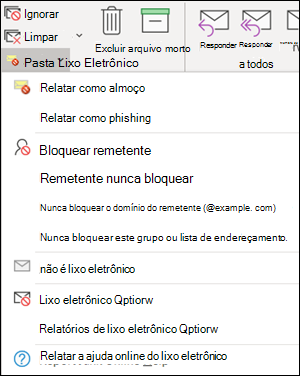
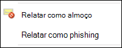
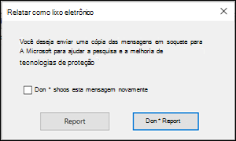
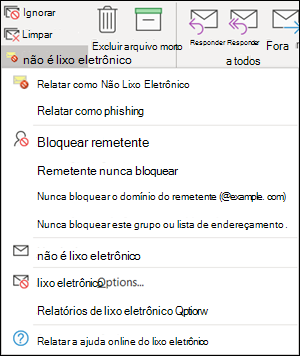
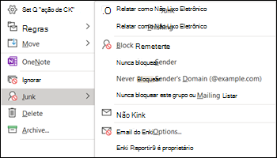
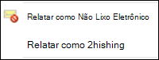
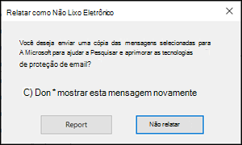

# <a name="install-and-use-the-junk-email-reporting-add-in-for-microsoft-outlook"></a><span data-ttu-id="53062-103">Instalar e usar o suplemento relatório de lixo eletrônico para o Microsoft Outlook</span><span class="sxs-lookup"><span data-stu-id="53062-103">Install and use the Junk Email Reporting add-in for Microsoft Outlook</span></span>

> [!NOTE]
> <span data-ttu-id="53062-104">Se você não estiver usando o suplemento relatório de lixo eletrônico, recomendamos o [suplemento mensagem de relatório](enable-the-report-message-add-in.md) .</span><span class="sxs-lookup"><span data-stu-id="53062-104">If you aren't currently using the Junk E-mail Reporting add-in, we recommend the [Report Message add-in](enable-the-report-message-add-in.md) instead.</span></span> <span data-ttu-id="53062-105">Para mais informações, confira [Relatar mensagens e arquivos à Microsoft](report-junk-email-messages-to-microsoft.md).</span><span class="sxs-lookup"><span data-stu-id="53062-105">For more information, see [Report messages and files to Microsoft](report-junk-email-messages-to-microsoft.md).</span></span>

<span data-ttu-id="53062-106">O suplemento relatório de lixo eletrônico para o Microsoft Outlook permite que os usuários enviem falsos positivos (emails em boas condições marcados como spam), falsos negativos (emails inválidos permitidos) e mensagens de phishing para a Microsoft.</span><span class="sxs-lookup"><span data-stu-id="53062-106">The Junk Email Reporting Add-in for Microsoft Outlook allows users to submit false positives (good email marked as spam), false negatives (bad email allowed) and phishing messages to Microsoft.</span></span> <span data-ttu-id="53062-107">Se sua organização não usa a proteção do Exchange Online (por exemplo, Exchange ou serviços de email locais, que não seja o Exchange Online), o envio do relatório de lixo eletrônico não afetará a filtragem de spam.</span><span class="sxs-lookup"><span data-stu-id="53062-107">If your organization doesn't use Exchange Online Protection (for example, on-premises Exchange or email services other than Exchange Online), your junk email report submission will not affect your spam filtering.</span></span>

<span data-ttu-id="53062-108">Este tópico explica como instalar e usar o suplemento relatório de lixo eletrônico.</span><span class="sxs-lookup"><span data-stu-id="53062-108">This topic explains how to install and use the Junk Email Reporting add-in.</span></span>

## <a name="what-do-you-need-to-know-before-you-begin"></a><span data-ttu-id="53062-109">O que você precisa saber antes de começar?</span><span class="sxs-lookup"><span data-stu-id="53062-109">What do you need to know before you begin?</span></span>

- <span data-ttu-id="53062-110">Para instalar o suplemento relatório de lixo eletrônico, confira a seção [instalar o suplemento relatório de lixo eletrônico](#install-the-junk-email-reporting-add-in) mais adiante neste tópico.</span><span class="sxs-lookup"><span data-stu-id="53062-110">To install the Junk Email Reporting add-in, see the [Install the Junk Email Reporting add-in](#install-the-junk-email-reporting-add-in) section later in this topic.</span></span>

- <span data-ttu-id="53062-111">O suplemento relatório de lixo eletrônico funciona com as seguintes versões do Outlook:</span><span class="sxs-lookup"><span data-stu-id="53062-111">The Junk Email Reporting add-in works with the following versions of Outlook:</span></span>

  - <span data-ttu-id="53062-112">Outlook 2013 ou posterior</span><span class="sxs-lookup"><span data-stu-id="53062-112">Outlook 2013 or later</span></span>
  - <span data-ttu-id="53062-113">Outlook incluído no Microsoft 365 Apps for Enterprise</span><span class="sxs-lookup"><span data-stu-id="53062-113">Outlook included with Microsoft 365 Apps for enterprise</span></span>

- <span data-ttu-id="53062-114">Para obter mais informações sobre como relatar mensagens à Microsoft, consulte [relatar mensagens e arquivos para a Microsoft](report-junk-email-messages-to-microsoft.md).</span><span class="sxs-lookup"><span data-stu-id="53062-114">For more information about reporting messages to Microsoft, see [Report messages and files to Microsoft](report-junk-email-messages-to-microsoft.md).</span></span>

## <a name="use-the-junk-email-reporting-add-in-to-report-spam-and-phishing-messages"></a><span data-ttu-id="53062-115">Usar o suplemento relatório de lixo eletrônico para relatar mensagens de spam e phishing</span><span class="sxs-lookup"><span data-stu-id="53062-115">Use the Junk Email Reporting add-in to report spam and phishing messages</span></span>

1. <span data-ttu-id="53062-116">Para mensagens na caixa de entrada ou em qualquer outra pasta de email, exceto lixo eletrônico, use qualquer um dos seguintes métodos para relatar mensagens de spam e phishing:</span><span class="sxs-lookup"><span data-stu-id="53062-116">For messages in the Inbox or any other email folder except Junk Email, use any of the following methods to report spam and phishing messages:</span></span>

   - <span data-ttu-id="53062-117">Selecione a mensagem ou abra a mensagem.</span><span class="sxs-lookup"><span data-stu-id="53062-117">Select the message or open the message.</span></span> <span data-ttu-id="53062-118">Na guia **página inicial** ou **mensagem** na faixa de opções, clique em **lixo eletrônico**e selecione **relatar como lixo eletrônico** ou **relatório como phishing**.</span><span class="sxs-lookup"><span data-stu-id="53062-118">In the **Home** or **Message** tab in the ribbon, click **Junk**, and then select **Report as Junk** or **Report as Phishing**.</span></span>

     

   - <span data-ttu-id="53062-120">Clique com o botão direito do mouse na mensagem, selecione **lixo eletrônico**e, em seguida, selecione **relatar como lixo eletrônico** ou **relatório como phishing**.</span><span class="sxs-lookup"><span data-stu-id="53062-120">Right-click on the message, select **Junk**, and then select **Report as Junk** or **Report as Phishing**.</span></span>

     

   - <span data-ttu-id="53062-122">Selecione várias mensagens, clique com o botão direito do mouse e selecione **relatar como lixo eletrônico** ou **relatório como phishing**.</span><span class="sxs-lookup"><span data-stu-id="53062-122">Select multiple messages, right-click, and then select **Report as Junk** or **Report as Phishing**.</span></span>

     

2. <span data-ttu-id="53062-124">Na caixa de diálogo exibida, leia as informações e clique em **relatório**.</span><span class="sxs-lookup"><span data-stu-id="53062-124">In the dialog that appears, read the information and click **Report**.</span></span> <span data-ttu-id="53062-125">Se você mudar de ideia, clique em **não relatar**.</span><span class="sxs-lookup"><span data-stu-id="53062-125">If you change your mind, click **Don't Report**.</span></span>

   

   

3. <span data-ttu-id="53062-128">As mensagens selecionadas serão enviadas para a Microsoft para análise e:</span><span class="sxs-lookup"><span data-stu-id="53062-128">The selected messages will be sent to Microsoft for analysis and:</span></span>

   - <span data-ttu-id="53062-129">Movido para a pasta lixo eletrônico se ele foi relatado como spam.</span><span class="sxs-lookup"><span data-stu-id="53062-129">Moved to the Junk Email folder if it was reported as spam.</span></span>
   - <span data-ttu-id="53062-130">Excluído se foi relatado como phishing.</span><span class="sxs-lookup"><span data-stu-id="53062-130">Deleted if it was reported as phishing.</span></span>
   
   <span data-ttu-id="53062-131">Para confirmar se as mensagens foram enviadas, abra sua pasta **Itens Enviados** para exibir as mensagens enviadas.</span><span class="sxs-lookup"><span data-stu-id="53062-131">To confirm that the messages have been submitted, open your **Sent Items** folder to view the submitted messages.</span></span>

## <a name="use-the-junk-email-reporting-add-in-to-report-non-spam-and-phishing-messages-from-the-junk-email-folder"></a><span data-ttu-id="53062-132">Use o suplemento relatório de lixo eletrônico para relatar mensagens que não são spam e phishing da pasta lixo eletrônico</span><span class="sxs-lookup"><span data-stu-id="53062-132">Use the Junk Email Reporting add-in to report non-spam and phishing messages from the Junk Email folder</span></span>

1. <span data-ttu-id="53062-133">Na pasta lixo eletrônico, use qualquer um dos seguintes métodos para relatar falsos positivos de spam ou mensagens de phishing:</span><span class="sxs-lookup"><span data-stu-id="53062-133">In the Junk Email folder, use any of the following methods to report spam false positives or phishing messages:</span></span>

   - <span data-ttu-id="53062-134">Selecione a mensagem ou abra a mensagem.</span><span class="sxs-lookup"><span data-stu-id="53062-134">Select the message or open the message.</span></span> <span data-ttu-id="53062-135">Na guia **página inicial** ou de **mensagem** na faixa de opções, clique em **não lixo eletrônico**e selecione **relatar como não lixo eletrônico** ou **relatar como phishing**.</span><span class="sxs-lookup"><span data-stu-id="53062-135">In the **Home** or **Message** tab in the ribbon, click **Not Junk**, and then select **Report as Not Junk** or **Report as Phishing**.</span></span>

     

   - <span data-ttu-id="53062-137">Clique com o botão direito do mouse na mensagem, clique em **lixo eletrônico**e selecione **relatar como não lixo eletrônico** ou **relatar como phishing**.</span><span class="sxs-lookup"><span data-stu-id="53062-137">Right-click on the message, click **Junk**, and then select **Report as Not Junk** or **Report as Phishing**.</span></span>

     

   - <span data-ttu-id="53062-139">Selecione várias mensagens, clique com o botão direito do mouse e selecione **relatar como não é lixo eletrônico** ou **relatar como phishing**.</span><span class="sxs-lookup"><span data-stu-id="53062-139">Select multiple messages, right-click, and then select **Report as Not Junk** or **Report as Phishing**.</span></span>

     

2. <span data-ttu-id="53062-141">Na caixa de diálogo exibida, leia as informações e clique em **relatório**.</span><span class="sxs-lookup"><span data-stu-id="53062-141">In the dialog that appears, read the information and click **Report**.</span></span> <span data-ttu-id="53062-142">Se você mudar de ideia, clique em **não relatar**.</span><span class="sxs-lookup"><span data-stu-id="53062-142">If you change your mind, click **Don't Report**.</span></span>

   

   

3. <span data-ttu-id="53062-145">As mensagens selecionadas serão enviadas para a Microsoft para análise e:</span><span class="sxs-lookup"><span data-stu-id="53062-145">The selected messages will be sent to Microsoft for analysis and:</span></span>

   - <span data-ttu-id="53062-146">Movido para a pasta lixo eletrônico se ele foi relatado como spam.</span><span class="sxs-lookup"><span data-stu-id="53062-146">Moved to the Junk Email folder if it was reported as spam.</span></span>
   - <span data-ttu-id="53062-147">Excluído se foi relatado como phishing.</span><span class="sxs-lookup"><span data-stu-id="53062-147">Deleted if it was reported as phishing.</span></span>

   <span data-ttu-id="53062-148">Para confirmar se as mensagens foram enviadas, abra sua pasta **Itens Enviados** para exibir as mensagens enviadas.</span><span class="sxs-lookup"><span data-stu-id="53062-148">To confirm that the messages have been submitted, open your **Sent Items** folder to view the submitted messages.</span></span>

## <a name="install-the-junk-email-reporting-add-in"></a><span data-ttu-id="53062-149">Instalar o suplemento relatório de lixo eletrônico</span><span class="sxs-lookup"><span data-stu-id="53062-149">Install the Junk Email Reporting add-in</span></span>

- <span data-ttu-id="53062-150">Você precisa ter privilégios de administrador no computador no qual você está instalando o suplemento.</span><span class="sxs-lookup"><span data-stu-id="53062-150">You need to have administrator privileges on the computer where you're installing the add-in.</span></span>

- <span data-ttu-id="53062-151">Vá para <https://www.microsoft.com/download/details.aspx?id=18275> e baixe o arquivo. msi apropriado para sua versão do Office para um local que seja fácil de encontrar:</span><span class="sxs-lookup"><span data-stu-id="53062-151">Go to <https://www.microsoft.com/download/details.aspx?id=18275> and download the appropriate .msi file for your version of Office to a location that's easy to find:</span></span>

  - <span data-ttu-id="53062-152">**32**bits:`Junk Reporting Add-in for Office 2007, 2010, 2013, and 2016 (32-bit).msi`</span><span class="sxs-lookup"><span data-stu-id="53062-152">**32-bit**: `Junk Reporting Add-in for Office 2007, 2010, 2013, and 2016 (32-bit).msi`</span></span>
  - <span data-ttu-id="53062-153">**64**bits:`Junk Reporting Add-in for Office 2007, 2010, 2013, and 2016 (64-bit).msi`</span><span class="sxs-lookup"><span data-stu-id="53062-153">**64-bit**: `Junk Reporting Add-in for Office 2007, 2010, 2013, and 2016 (64-bit).msi`</span></span>

- <span data-ttu-id="53062-154">Para o Outlook 2013 ou posterior, o único pré-requisito é o Microsoft .NET Framework 2,0.</span><span class="sxs-lookup"><span data-stu-id="53062-154">For Outlook 2013 or later, the only prerequisite is the Microsoft .NET Framework 2.0.</span></span> <span data-ttu-id="53062-155">No Windows 10, você não instala o .NET Framework 2,0 a partir de um download.</span><span class="sxs-lookup"><span data-stu-id="53062-155">In Windows 10, you don't install the .NET Framework 2.0 from a download.</span></span>

### <a name="install-the-junk-email-reporting-add-in-using-the-setup-wizard"></a><span data-ttu-id="53062-156">Instalar o suplemento de relatório de lixo eletrônico usando o assistente de configuração</span><span class="sxs-lookup"><span data-stu-id="53062-156">Install the Junk Email Reporting Add-in using the Setup wizard</span></span>

1. <span data-ttu-id="53062-157">Feche o Outlook no computador.</span><span class="sxs-lookup"><span data-stu-id="53062-157">On your computer, close Outlook.</span></span>

2. <span data-ttu-id="53062-158">No Windows 10, verifique se o .NET Framework 2,0 está habilitado.</span><span class="sxs-lookup"><span data-stu-id="53062-158">In Windows 10, verify the .NET Framework 2.0 is enabled.</span></span> <span data-ttu-id="53062-159">Para obter instruções, consulte [habilitar o .NET Framework 3,5 no painel de controle](https://docs.microsoft.com/dotnet/framework/install/dotnet-35-windows-10#enable-the-net-framework-35-in-control-panel).</span><span class="sxs-lookup"><span data-stu-id="53062-159">For instructions, see [Enable the .NET Framework 3.5 in Control Panel](https://docs.microsoft.com/dotnet/framework/install/dotnet-35-windows-10#enable-the-net-framework-35-in-control-panel).</span></span>

3. <span data-ttu-id="53062-160">Localize o arquivo. msi que você baixou e clique duas vezes nele.</span><span class="sxs-lookup"><span data-stu-id="53062-160">Locate the .msi file you downloaded and double-click on it.</span></span>

4. <span data-ttu-id="53062-161">Na página **Bem-vindo à Configuração do Suplemento Relatório de Lixo Eletrônico para Microsoft** e clique em **Próximo**.</span><span class="sxs-lookup"><span data-stu-id="53062-161">On the **Welcome to Microsoft Junk Email Reporting Add-in Setup** page, click **Next**.</span></span>

5. <span data-ttu-id="53062-162">Revise o contrato de licença, clique em **aceito os termos do contrato de licença** se você concordar com os termos e clique em **Avançar**.</span><span class="sxs-lookup"><span data-stu-id="53062-162">Review the license agreement, click **I accept the terms in the License Agreement** if you agree to the terms, and then click **Next**.</span></span>

6. <span data-ttu-id="53062-163">Quando o assistente for concluído, clique em **Concluir**.</span><span class="sxs-lookup"><span data-stu-id="53062-163">When the wizard is complete, click **Finish**.</span></span>

<span data-ttu-id="53062-164">Inicie o Outlook.</span><span class="sxs-lookup"><span data-stu-id="53062-164">Start Outlook.</span></span>

<span data-ttu-id="53062-p109">Procure o botão **Lixo Eletrônico** na faixa de opções do Outlook. Agora, você pode relatar mensagens de lixo eletrônico à Microsoft selecionando-as na sua Caixa de Entrada e clicando no botão **Relatar Lixo Eletrônico**.</span><span class="sxs-lookup"><span data-stu-id="53062-p109">Look for the **Junk** button on your Outlook ribbon. You can now report junk email messages to Microsoft by selecting the junk email messages in your Inbox and clicking the **Report Junk** button.</span></span>

<span data-ttu-id="53062-p110">Selecione a seta para baixo ao lado de **Lixo Eletrônico** para obter mais opções, como **Relatar como Phishing** se você quiser relatar emails de esquemas de phishing para a Microsoft. Na pasta Lixo Eletrônico, você também pode selecionar, **Relatar como não sendo lixo eletrônico** se um email tiver sido identificado incorretamente como lixo eletrônico.</span><span class="sxs-lookup"><span data-stu-id="53062-p110">Choose the down arrow next to **Junk** for more options such as **Report as Phishing** if you want to report phishing scam emails to Microsoft. In your junk mail folder, you can also select, **Report not junk** if an email was incorrectly identified as junk mail.</span></span>

### <a name="install-the-junk-email-reporting-add-in-using-silent-mode"></a><span data-ttu-id="53062-169">Instalar o Suplemento Relatório de Lixo Eletrônico usando Modo Silencioso</span><span class="sxs-lookup"><span data-stu-id="53062-169">Install the Junk Email Reporting Add-In using Silent Mode</span></span>

1. <span data-ttu-id="53062-170">Feche o Outlook no computador.</span><span class="sxs-lookup"><span data-stu-id="53062-170">On your computer, close Outlook.</span></span>

2. <span data-ttu-id="53062-171">No Windows 10, instale o .NET Framework 2,0 executando o seguinte comando:</span><span class="sxs-lookup"><span data-stu-id="53062-171">In Windows 10, install the .NET Framework 2.0 by running the following command:</span></span>

   ```dos
   DISM /Online /Enable-Feature /FeatureName:NetFx3 /All
   ```

3. <span data-ttu-id="53062-172">Para instalar o suplemento sem qualquer interação do usuário, abra um prompt de comando e use a seguinte sintaxe:</span><span class="sxs-lookup"><span data-stu-id="53062-172">To install the add-in without any user interaction, open a Command Prompt and use the following syntax:</span></span>

   ```dos
   msiexec /qn /i "<PathToMSIFile>\<MSIFile>" [MaxMessageSelection=<1-50>] [BccEmailAddress="<EmailAddress1>; <EmailAddress2>"...]
   ```

   - <span data-ttu-id="53062-173">`MaxMessageSelection`Especifica o número máximo de mensagens que você pode selecionar para um único envio.</span><span class="sxs-lookup"><span data-stu-id="53062-173">`MaxMessageSelection` specifies the maximum number of messages that you can select for a single submission.</span></span> <span data-ttu-id="53062-174">Os valores válidos vão de 1 a 50.</span><span class="sxs-lookup"><span data-stu-id="53062-174">Valid values are from 1 to 50.</span></span> <span data-ttu-id="53062-175">O valor padrão é 15.</span><span class="sxs-lookup"><span data-stu-id="53062-175">The default value is 15.</span></span>

   - <span data-ttu-id="53062-176">`BccEmailAddress`Especifica destinatários Cco adicionais que receberão uma cópia de todos os envios de usuários.</span><span class="sxs-lookup"><span data-stu-id="53062-176">`BccEmailAddress` specifies additional Bcc recipients who will receive a copy of all user submissions.</span></span> <span data-ttu-id="53062-177">O valor padrão é Blank (nenhum destinatário adicional Cco).</span><span class="sxs-lookup"><span data-stu-id="53062-177">The default value is blank (no additional Bcc recipients).</span></span>

   <span data-ttu-id="53062-178">Este exemplo instala a versão de 64 bits do suplemento do caminho especificado com as configurações padrão.</span><span class="sxs-lookup"><span data-stu-id="53062-178">This example installs the 64-bit version of the add-in from the specified path with the default settings.</span></span>

   ```dos
   msiexec /qn /i "C:\Downloads\Junk Reporting Add-in for Office 2007, 2010, 2013, and 2016 (64-bit).msi"
   ```

   <span data-ttu-id="53062-179">Este exemplo instala a versão de 32 bits do suplemento do caminho especificado com as seguintes configurações adicionais:</span><span class="sxs-lookup"><span data-stu-id="53062-179">This example installs the 32-bit version of the add-in from the specified path with the following additional settings:</span></span>

   - <span data-ttu-id="53062-180">Até 20 mensagens podem ser selecionadas em um único envio.</span><span class="sxs-lookup"><span data-stu-id="53062-180">Up to 20 messages can be selected in a single submission.</span></span>
   - <span data-ttu-id="53062-181">junkreports@contoso.com e hollyd@treyresearch.net recebem cópias Cco de todos os envios.</span><span class="sxs-lookup"><span data-stu-id="53062-181">junkreports@contoso.com and hollyd@treyresearch.net receive Bcc copies of all submissions.</span></span>

   ```dos
   msiexec /qn /i "C:\Downloads\Junk Reporting Add-in for Office 2007, 2010, 2013, and 2016 (32-bit).msi" MaxMessageSelection=20 BccEmailAddress="junkreports@contoso.com; hollyd@treyresearch.net"
   ```

### <a name="how-do-you-know-this-worked"></a><span data-ttu-id="53062-182">Como saber se funcionou?</span><span class="sxs-lookup"><span data-stu-id="53062-182">How do you know this worked?</span></span>

<span data-ttu-id="53062-183">Para verificar se você instalou com êxito o suplemento relatório de lixo eletrônico, execute qualquer uma das seguintes etapas no Outlook:</span><span class="sxs-lookup"><span data-stu-id="53062-183">To verify that you've successfully installed the Junk Email Reporting Add-in, do the any of the following steps in Outlook:</span></span>

- <span data-ttu-id="53062-184">Selecione a mensagem ou abra a mensagem.</span><span class="sxs-lookup"><span data-stu-id="53062-184">Select the message or open the message.</span></span> <span data-ttu-id="53062-185">Na guia **página inicial** ou de **mensagem** na faixa de opções, clique em **lixo eletrônico**e verifique se as seguintes opções estão disponíveis:</span><span class="sxs-lookup"><span data-stu-id="53062-185">In the **Home** or **Message** tab in the ribbon, click **Junk**, and verify that the following options are available:</span></span>

  - <span data-ttu-id="53062-186">**Relatar como lixo eletrônico**</span><span class="sxs-lookup"><span data-stu-id="53062-186">**Report as Junk**</span></span>
  - <span data-ttu-id="53062-187">**Relatar como phishing**</span><span class="sxs-lookup"><span data-stu-id="53062-187">**Report as Phishing**</span></span>
  - <span data-ttu-id="53062-188">**Opções de relatório de lixo eletrônico**</span><span class="sxs-lookup"><span data-stu-id="53062-188">**Junk Reporting Options**</span></span>
  - <span data-ttu-id="53062-189">**Relatar a ajuda online do lixo eletrônico**</span><span class="sxs-lookup"><span data-stu-id="53062-189">**Report Junk Online Help**</span></span>

  

- <span data-ttu-id="53062-191">Clique com o botão direito do mouse na mensagem, selecione **lixo eletrônico**e verifique se as seguintes opções estão disponíveis:</span><span class="sxs-lookup"><span data-stu-id="53062-191">Right-click on the message, select **Junk**, and verify that the following options are available:</span></span>

  - <span data-ttu-id="53062-192">**Relatar como lixo eletrônico**</span><span class="sxs-lookup"><span data-stu-id="53062-192">**Report as Junk**</span></span>
  - <span data-ttu-id="53062-193">**Relatar como phishing**</span><span class="sxs-lookup"><span data-stu-id="53062-193">**Report as Phishing**</span></span>
  - <span data-ttu-id="53062-194">**Opções de relatório de lixo eletrônico**</span><span class="sxs-lookup"><span data-stu-id="53062-194">**Junk Reporting Options**</span></span>
  - <span data-ttu-id="53062-195">**Relatar a ajuda online do lixo eletrônico**</span><span class="sxs-lookup"><span data-stu-id="53062-195">**Report Junk Online Help**</span></span>

  

- <span data-ttu-id="53062-197">Selecione várias mensagens, clique com o botão direito do mouse e verifique se as seguintes opções estão disponíveis:</span><span class="sxs-lookup"><span data-stu-id="53062-197">Select multiple messages, right click, and verify that the following options are available:</span></span>

  - <span data-ttu-id="53062-198">**Relatar como lixo eletrônico**</span><span class="sxs-lookup"><span data-stu-id="53062-198">**Report as Junk**</span></span>
  - <span data-ttu-id="53062-199">**Relatar como phishing**</span><span class="sxs-lookup"><span data-stu-id="53062-199">**Report as Phishing**</span></span>

  

- <span data-ttu-id="53062-201">Execute as ações anteriores na pasta **lixo eletrônico** e verifique se as opções anteriores de relatório de **lixo eletrônico** **não são lixo eletrônico**.</span><span class="sxs-lookup"><span data-stu-id="53062-201">Do the previous actions in the **Junk Email** folder and verify the previous **Junk** reporting options are now **Not Junk**.</span></span>

  

  

  

## <a name="uninstall-the-junk-email-reporting-add-in"></a><span data-ttu-id="53062-205">Desinstalar o Suplemento Relatório de Lixo Eletrônico</span><span class="sxs-lookup"><span data-stu-id="53062-205">Uninstall the Junk Email Reporting Add-in</span></span>

<span data-ttu-id="53062-206">Após fechar o Outlook, use qualquer um dos seguintes procedimentos para desinstalar o suplemento relatório de lixo eletrônico:</span><span class="sxs-lookup"><span data-stu-id="53062-206">After you close Outlook, use any of the following procedures to uninstall the Junk Email Reporting Add-in:</span></span>

- <span data-ttu-id="53062-207">**Painel de controle**: Pressione a tecla Windows + R. Na caixa de diálogo **executar** que é aberta, insira `control appwiz.cpl` e clique em **OK**.</span><span class="sxs-lookup"><span data-stu-id="53062-207">**Control Panel**: Press the Windows key + R. In the **Run** dialog that opens, enter `control appwiz.cpl` and then click **OK**.</span></span>

  <span data-ttu-id="53062-208">Localize e selecione o **suplemento relatório de lixo eletrônico da Microsoft** na lista e clique em **desinstalar**.</span><span class="sxs-lookup"><span data-stu-id="53062-208">Find and select **Microsoft Junk Email Reporting Add-in** in the list, and then click **Uninstall**.</span></span>

- <span data-ttu-id="53062-209">**Pacote do Windows Installer**: encontre ou baixe o arquivo. msi apropriado e clique duas vezes nele.</span><span class="sxs-lookup"><span data-stu-id="53062-209">**Windows Installer package**: Find or download the appropriate .msi file, and double-click on it.</span></span>

  - <span data-ttu-id="53062-210">**32**bits:`Junk Reporting Add-in for Office 2007, 2010, 2013, and 2016 (32-bit).msi`</span><span class="sxs-lookup"><span data-stu-id="53062-210">**32-bit**: `Junk Reporting Add-in for Office 2007, 2010, 2013, and 2016 (32-bit).msi`</span></span>

  - <span data-ttu-id="53062-211">**64**bits:`Junk Reporting Add-in for Office 2007, 2010, 2013, and 2016 (64-bit).msi`</span><span class="sxs-lookup"><span data-stu-id="53062-211">**64-bit**: `Junk Reporting Add-in for Office 2007, 2010, 2013, and 2016 (64-bit).msi`</span></span>

  <span data-ttu-id="53062-212">Na caixa de diálogo exibida, selecione **remover suplemento relatório de lixo eletrônico da Microsoft para Outlook** e clique em **Avançar**.</span><span class="sxs-lookup"><span data-stu-id="53062-212">In the dialog that appears, select **Remove Microsoft Junk Email Reporting Add-in for Outlook** and then click **Next**.</span></span>

- <span data-ttu-id="53062-213">**Modo silencioso**: encontre ou baixe o arquivo. msi apropriado.</span><span class="sxs-lookup"><span data-stu-id="53062-213">**Silent Mode**: Find or download the appropriate .msi file.</span></span> <span data-ttu-id="53062-214">Em uma janela de prompt de comando, substitua \<PathToFile\> o local do arquivo. msi e execute um dos seguintes comandos:</span><span class="sxs-lookup"><span data-stu-id="53062-214">In a Command Prompt window, replace \<PathToFile\> with the location of the .msi file, and run one of the following commands:</span></span>

  - <span data-ttu-id="53062-215">**32**bits:</span><span class="sxs-lookup"><span data-stu-id="53062-215">**32-bit**:</span></span>

    ```dos
    msiexec /x "<PathToFile>\Junk Reporting Add-in for Office 2007, 2010, 2013, and 2016 (32-bit).msi" /qn MSIRESTARTMANAGERCONTROL="DisableShutdown"
    ```

  - <span data-ttu-id="53062-216">**64**bits:</span><span class="sxs-lookup"><span data-stu-id="53062-216">**64-bit**:</span></span>

    ```dos
    msiexec /x "<PathToFile>\Junk Reporting Add-in for Office 2007, 2010, 2013, and 2016 (64-bit).msi" /qn MSIRESTARTMANAGERCONTROL="DisableShutdown"
    ```

<span data-ttu-id="53062-217">Quando você abre o Outlook após a desinstalação, as opções de relatório de lixo eletrônico, não lixo eletrônico e phishing devem ser despercebidas.</span><span class="sxs-lookup"><span data-stu-id="53062-217">When you open Outlook after the uninstall, the junk, not junk, and phishing reporting options should be gone.</span></span>

## <a name="troubleshooting-the-junk-email-reporting-add-in"></a><span data-ttu-id="53062-218">Solucionando problemas do suplemento relatório de lixo eletrônico</span><span class="sxs-lookup"><span data-stu-id="53062-218">Troubleshooting the Junk Email Reporting add-in</span></span>

<span data-ttu-id="53062-219">Ocasionalmente, você pode enfrentar problemas com o Outlook após adicionar o suplemento de relatório de lixo eletrônico.</span><span class="sxs-lookup"><span data-stu-id="53062-219">Occasionally, you might experience trouble with Outlook after adding the Junk Email Reporting Add-In.</span></span> <span data-ttu-id="53062-220">Esta seção descreve os problemas que você pode encontrar, juntamente com as dicas para resolver esses problemas.</span><span class="sxs-lookup"><span data-stu-id="53062-220">This section describes problems that you might encounter, along with tips for resolving these issues.</span></span>

### <a name="troubleshooting-for-users"></a><span data-ttu-id="53062-221">Solucionando problemas de usuários</span><span class="sxs-lookup"><span data-stu-id="53062-221">Troubleshooting for users</span></span>

<span data-ttu-id="53062-222">Você enfrenta um ou mais dos seguintes problemas:</span><span class="sxs-lookup"><span data-stu-id="53062-222">You experience one or more of the following problems:</span></span>

- <span data-ttu-id="53062-223">Nada acontece quando você clica em **Relatar Lixo Eletrônico**</span><span class="sxs-lookup"><span data-stu-id="53062-223">Nothing happens when you click **Report Junk**</span></span>
- <span data-ttu-id="53062-224">O Outlook para de responder depois que você selecionar uma mensagem de email</span><span class="sxs-lookup"><span data-stu-id="53062-224">Outlook stops responding after you select an email message</span></span>
- <span data-ttu-id="53062-225">O lixo eletrônico relatado não pode ser entregue devido a uma resposta "não entregue"</span><span class="sxs-lookup"><span data-stu-id="53062-225">Reported junk mail cannot be delivered due to an "undeliverable" reply</span></span>

<span data-ttu-id="53062-226">Para corrigir esse problema, siga estas etapas:</span><span class="sxs-lookup"><span data-stu-id="53062-226">To fix this problem, do the following steps:</span></span>

1. <span data-ttu-id="53062-227">Feche e reinicie o Outlook.</span><span class="sxs-lookup"><span data-stu-id="53062-227">Close and restart Outlook.</span></span>
2. <span data-ttu-id="53062-228">Criar e enviar uma mensagem de teste e verificar se o destinatário recebeu a mensagem.</span><span class="sxs-lookup"><span data-stu-id="53062-228">Create and send a test message, and verify that the recipient received the message.</span></span>
3. <span data-ttu-id="53062-229">Se o problema persistir, entre em contato com seu administrador.</span><span class="sxs-lookup"><span data-stu-id="53062-229">If the problem persists, contact your admin.</span></span>

<span data-ttu-id="53062-230">Para outros métodos que você pode usar para enviar mensagens à Microsoft, confira [mensagens de relatório e arquivos para a Microsoft](report-junk-email-messages-to-microsoft.md).</span><span class="sxs-lookup"><span data-stu-id="53062-230">For other methods that you can use to submit messages to Microsoft, see [Report messages and files to Microsoft](report-junk-email-messages-to-microsoft.md).</span></span>

### <a name="troubleshooting-for-admins"></a><span data-ttu-id="53062-231">Solucionando problemas de administradores</span><span class="sxs-lookup"><span data-stu-id="53062-231">Troubleshooting for admins</span></span>

#### <a name="problem-an-error-message-continually-appears-that-asks-users-to-contact-their-system-administrator"></a><span data-ttu-id="53062-232">Problema: uma mensagem de erro é exibida continuamente solicitando que os usuários entrem em contato com o administrador do sistema</span><span class="sxs-lookup"><span data-stu-id="53062-232">Problem: An error message continually appears that asks users to contact their system administrator</span></span>

1. <span data-ttu-id="53062-233">Verifique ou defina a `LoggingLevel` chave do registro com o valor "Verbose":</span><span class="sxs-lookup"><span data-stu-id="53062-233">Verify or set the `LoggingLevel` registry key to the value "Verbose":</span></span>

   - <span data-ttu-id="53062-234">o **Outlook de 32 bits em Windows de 32 bits**:</span><span class="sxs-lookup"><span data-stu-id="53062-234">**32-bit Outlook on 32-bit Windows**:</span></span>

     ```text
     Windows Registry Editor Version 5.00

     [HKEY_LOCAL_MACHINE\Software\Microsoft\Junk Email Reporting\Addins]
     "LoggingLevel"="Verbose"
     ```

   - <span data-ttu-id="53062-235">o **Outlook de 32 bits em Windows de 64 bits**:</span><span class="sxs-lookup"><span data-stu-id="53062-235">**32-bit Outlook on 64-bit Windows**:</span></span>

     ```text
     Windows Registry Editor Version 5.00

     [HKEY_LOCAL_MACHINE\Software\Wow6432Node\Microsoft\Junk Email Reporting\Addins]
     "LoggingLevel"="Verbose"
     ```

   - <span data-ttu-id="53062-236">**64-bit Outlook**:</span><span class="sxs-lookup"><span data-stu-id="53062-236">**64-bit Outlook**:</span></span>

     ```text
     Windows Registry Editor Version 5.00

     [HKEY_LOCAL_MACHINE\Software\Microsoft\Junk E-mail Reporting\Addins]
     "LoggingLevel"="Verbose"
     ```

2. <span data-ttu-id="53062-237">Reinicie o Outlook e peça aos usuários para reportá-los quando eles verão a mensagem de erro.</span><span class="sxs-lookup"><span data-stu-id="53062-237">Restart Outlook and ask users to report back when they see the error message.</span></span>

3. <span data-ttu-id="53062-238">Colete as informações de log encontradas no seguinte local:</span><span class="sxs-lookup"><span data-stu-id="53062-238">Collect the log information found at the following location:</span></span>

   `%LOCALAPPDATA%\Microsoft\Junk Email Reporting Add-in\SpamReporterAddinLog.txt`

4. <span data-ttu-id="53062-239">Entre em contato com o suporte técnico do Exchange Online Protection e forneça as informações de log.</span><span class="sxs-lookup"><span data-stu-id="53062-239">Contact Exchange Online Protection Technical Support and provide them with the log information.</span></span>

#### <a name="problem-users-selected-not-to-receive-a-confirmation-prompt-when-they-report-messages-and-now-they-want-the-prompt-back"></a><span data-ttu-id="53062-240">Problema: os usuários optaram por não receber um prompt de confirmação ao relatar mensagens e agora eles querem retornar o prompt</span><span class="sxs-lookup"><span data-stu-id="53062-240">Problem: Users selected not to receive a confirmation prompt when they report messages, and now they want the prompt back</span></span>

1. <span data-ttu-id="53062-241">Crie a `ConfirmReportJunk` chave do registro com o valor "true":</span><span class="sxs-lookup"><span data-stu-id="53062-241">Create the `ConfirmReportJunk`registry key with the value "True":</span></span>

   ```text
   Windows Registry Editor Version 5.00

   HKEY_CURRENT_USER\Software\Microsoft\Junk E-mail Reporting\Preferences]
   "ConfirmReportJunk"="True"
   ```

2. <span data-ttu-id="53062-242">Reinicie o Outlook.</span><span class="sxs-lookup"><span data-stu-id="53062-242">Restart Outlook.</span></span>
