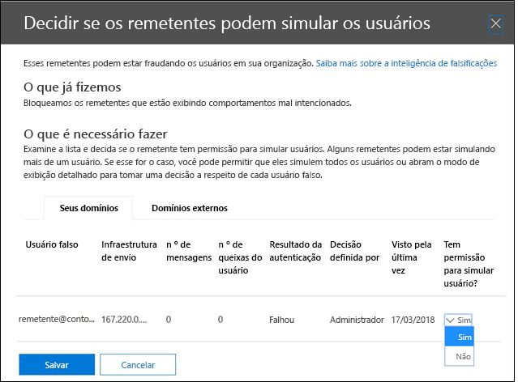

# <a name="configure-spoof-intelligence-in-microsoft-365"></a>Configurar a inteligência de spoof no Microsoft 365

Se você for um cliente Microsoft 365 com caixas de correio no Exchange Online ou um cliente autônomo do Exchange Online Protection (EOP) sem caixas de correio do Exchange Online, as mensagens de email de entrada serão automaticamente protegidas contra falsificação por EOP a partir de outubro de 2018. O EOP usa a inteligência de falsificação como parte da defesa geral da sua organização contra phishing. Para obter mais informações, consulte [proteção contra falsificação no Microsoft 365](anti-spoofing-protection.md).

Quando um remetente falsifica um endereço de email, ele parece ser um usuário em um dos domínios da sua organização ou um usuário em um domínio externo que envia emails para sua organização. Invasores que falsificam remetentes para enviar spam ou phishing email precisam ser bloqueados. Mas há situações em que remetentes legítimos estão falsificando. Por exemplo:

- Cenários legítimos para falsificação de domínios internos:

  - Remetentes de terceiros usam seu domínio para enviar emails em massa aos seus próprios funcionários para pesquisas da empresa.

  - Uma empresa externa gera e envia anúncios ou atualizações de produtos em seu nome.

  - Um assistente precisa regularmente enviar emails para outra pessoa em sua organização.

  - Um aplicativo interno envia notificações por email.

- Cenários legítimos para falsificação de domínios externos:

  - O remetente está em uma lista de endereçamento (também conhecida como lista de discussão) e a lista de endereçamento envia emails do remetente original para todos os participantes na lista de endereçamento.

  - Uma empresa externa envia emails em nome de outra empresa (por exemplo, um relatório automatizado ou uma empresa de software como serviço).

A inteligência de falsificação e, especificamente, a política de inteligência de falsificação padrão (e apenas) ajuda a garantir que o email falso enviado por remetentes legítimos não seja detectado em filtros de spam nos sistemas de email da Microsoft 365 ou externos, enquanto protege seus usuários contra ataques de spam ou phishing.

Você pode gerenciar a inteligência de falsificação no centro de conformidade & segurança da Microsoft 365 ou no PowerShell (PowerShell do Exchange Online para clientes do Microsoft 365; PowerShell de proteção do Exchange Online para clientes autônomos do EOP).

## <a name="what-do-you-need-to-know-before-you-begin"></a>O que você precisa saber antes de começar?

- Abra o Centro de Conformidade e Segurança em <https://protection.office.com/>. Para ir diretamente à página de **Configurações antispam**, use <https://protection.office.com/antispam>. Para ir diretamente para a página **anti-phishing** , use <https://protection.office.com/antiphishing>.

- Para se conectar ao PowerShell do Exchange Online, confira [Conectar ao PowerShell do Exchange Online](https://docs.microsoft.com/powershell/exchange/exchange-online/connect-to-exchange-online-powershell/connect-to-exchange-online-powershell). Para se conectar ao PowerShell da Proteção do Exchange Online autônoma, confira [Conectar ao PowerShell da Proteção do Exchange Online](https://docs.microsoft.com/powershell/exchange/exchange-eop/connect-to-exchange-online-protection-powershell).

- Você precisa receber permissões para executar esses procedimentos. Para modificar a política de inteligência de spoof ou habilitar ou desabilitar a inteligência de falsificação, você precisa ser membro dos grupos de função de **Gerenciamento da organização** ou de **administrador de segurança** . Para acesso somente leitura à política de inteligência de falsificação, você precisa ser membro do grupo de função **leitor de segurança** . Para obter mais informações sobre grupos de funções no Centro de Conformidade e Segurança, confira [Permissões no Centro de conformidade e Segurança do Office 365](permissions-in-the-security-and-compliance-center.md).

- Para nossas configurações recomendadas para inteligência de falsificação, [configurações de política antiphishing padrão do EOP](recommended-settings-for-eop-and-office365-atp.md#eop-default-anti-phishing-policy-settings).

## <a name="use-the-security--compliance-center-to-manage-spoofed-senders"></a>Usar o centro de conformidade de & de segurança para gerenciar remetentes falsificados

> [!NOTE]
> Se você tiver uma assinatura do Office 365 Enterprise E5 ou tiver um complemento de ATP (proteção avançada contra ameaças), você também poderá gerenciar os remetentes que estão falsificando seu domínio por meio da [compreensão de inteligência de falsificação](walkthrough-spoof-intelligence-insight.md).

1. No Centro de Conformidade e Segurança, vá para **Gerenciamento de ameaças** \> **Política** \> **Antispam**.

2. Na página **configurações antispam** , clique em  para expandir política de **inteligência de fraude**.

   

3. Faça uma das seguintes seleções:

   - **Revisar novos remetentes**
   - **Mostrar os remetentes que eu já revisei**

4. Em **decidir se esses remetentes têm permissão para falsificar o** submenu de usuários exibido, selecione uma das seguintes guias:

   - **Seus domínios**: remetentes que falsificam usuários em seus domínios internos.
   - **Domínios externos**: remetentes que falsificam usuários em domínios externos.

5. Clique  ícone na coluna **permitido para falsificação?** . Escolha **Sim** para permitir o remetente falsificado ou escolha **não** para marcar a mensagem como falsificada. A ação é controlada por uma política anti-phishing padrão ou políticas anti-phishing personalizadas da ATP (o valor padrão é **mover mensagem para a pasta lixo eletrônico**). Para obter mais informações, consulte [configurações de spoof em políticas anti-phishing](set-up-anti-phishing-policies.md#spoof-settings).

   

   As colunas e os valores que você vê são explicados na lista a seguir:

   - **Usuário falsificado**: a conta de usuário que está sendo falsificada. Este é o remetente da mensagem no endereço de (também conhecido como o `5322.From` endereço) que é mostrado nos clientes de email. A validade desse endereço não é verificada por SPF.

     - Na guia **domínios** , o valor contém um único endereço de email ou, se o servidor de email de origem estiver falsificando várias contas de usuário, ele conterá **mais de um**.

     - Na guia **domínios externos** , o valor contém o domínio do usuário falsificado, e não o endereço de email completo.

   - **Infraestrutura de envio**: o domínio encontrado em uma pesquisa de DNS inversa (registro PTR) do endereço IP do servidor de email de origem ou o endereço IP, se a fonte não tiver um registro PTR.

     Para obter mais informações sobre fontes de mensagens e remetentes de mensagens, consulte [uma visão geral dos padrões de mensagens de email](how-office-365-validates-the-from-address.md#an-overview-of-email-message-standards).

   - **n º de mensagens**: o número de mensagens da infraestrutura de envio para sua organização que contêm o remetente falsificado especificado ou remetentes nos últimos 30 dias.

   - **n º de reclamações de usuários**: reclamações arquivadas pelos usuários em relação a esse remetente nos últimos 30 dias. As reclamações geralmente estão na forma de envios de lixo eletrônico para a Microsoft.

   - **Resultado da autenticação**: um dos seguintes valores:

      - **Aprovado**: o remetente passou por verificações de autenticação de email do remetente (SPF ou DKIM).
      - **Falha**: o remetente falhou EOP verificações de autenticação do remetente.
      - **Desconhecido**: o resultado dessas verificações não é conhecido.

   - **Decisão definida por**: mostra quem determinou se a infraestrutura de envio tem permissão para falsificar o usuário:

       - **Política de inteligência de spoof** (automática)
       - **Administrador** (manual)

   - **Última vista**: a última data em que uma mensagem foi recebida da infraestrutura de envio que contém o usuário falsificado.

   - **Permitido para falsificar?**: os valores que você vê aqui são:

     - **Sim**: as mensagens da combinação de usuário falsificado e infraestrutura de envio são permitidas e não são tratadas como email falsificado.

     - **No**: as mensagens da combinação de usuário falsificado e infraestrutura de envio são marcadas como falsificadas. A ação é controlada por uma política anti-phishing padrão ou políticas anti-phishing personalizadas da ATP (o valor padrão é **mover mensagem para a pasta lixo eletrônico**). Consulte a próxima seção para obter mais informações.

     - **Alguns usuários** (apenas**a guia Domínios** ): uma infraestrutura de envio está falsificando vários usuários, onde alguns usuários falsificados são permitidos e outros não. Use a guia **detalhada** para ver os endereços específicos.

6. Na parte inferior da página, clique em **Salvar**.

## <a name="use-powershell-to-manage-spoofed-senders"></a>Usar o PowerShell para gerenciar remetentes falsificados

Para exibir os remetentes permitidos e bloqueados no spoof Intelligence, use a seguinte sintaxe:

```powershell
Get-PhishFilterPolicy [-AllowedToSpoof <Yes | No | Partial>] [-ConfidenceLevel <Low | High>] [-DecisionBy <Admin | SpoofProtection>] [-Detailed] [-SpoofType <Internal | External>]
```

Este exemplo retorna informações detalhadas sobre todos os remetentes que têm permissão para falsificar usuários em seus domínios.

```powershell
Get-PhishFilter -AllowedToSpoof Yes -Detailed -SpoofType Internal
```

Para informações detalhadas de sintaxes e de parâmetros, consulte [Get-PhishFilterPolicy](https://docs.microsoft.com/powershell/module/exchange/advanced-threat-protection/get-phishfilterpolicy).

Para configurar remetentes permitidos e bloqueados no spoof Intelligence, siga estas etapas:

1. Capture a lista atual de remetentes falsificados detectados escrevendo a saída do cmdlet **Get-PhishFilterPolicy** para um arquivo CSV:

   ```powershell
   Get-PhishFilterPolicy -Detailed | Export-CSV "C:\My Documents\Spoofed Senders.csv"
   ```

2. Edite o arquivo CSV para adicionar ou modificar os valores de **SpoofedUser** (endereço de email) e **AllowedToSpoof** (Sim ou não). Salve o arquivo, leia o arquivo e armazene o conteúdo como uma variável chamada `$UpdateSpoofedSenders`:

   ```powershell
   $UpdateSpoofedSenders = Get-Content -Raw "C:\My Documents\Spoofed Senders.csv"
   ```

3. Use a `$UpdateSpoofedSenders` variável para configurar a política de inteligência de falsificação:

   ```powershell
   Set-PhishFilterPolicy -Identity Default -SpoofAllowBlockList $UpdateSpoofedSenders
   ```

Para informações detalhadas de sintaxes e de parâmetros, consulte [set-PhishFilterPolicy](https://docs.microsoft.com/powershell/module/exchange/advanced-threat-protection/set-phishfilterpolicy).

## <a name="use-the-security--compliance-center-to-configure-spoof-intelligence"></a>Usar o centro de conformidade de & de segurança para configurar o spoof Intelligence

As opções de configuração para a inteligência de falsificação são descritas em [configurações de spoof em políticas anti-phishing](set-up-anti-phishing-policies.md#spoof-settings).

Suas opções disponíveis dependem de sua assinatura:

- As organizações autônomas do EOP sem caixas de correio do Exchange Online não podem definir configurações de inteligência de spoof.

- As organizações do Microsoft 365 com caixas de correio do Exchange Online podem definir configurações de inteligência de falsificação na política anti-phishing padrão (e apenas). Para obter instruções, consulte [Configurar a política anti-phishing padrão no EOP](configure-anti-phishing-policies-eop.md).

- As organizações 365 da Microsoft com a ATP podem definir as configurações de inteligência de spoofing na política anti-phishing padrão da ATP e também em políticas anti-phishing personalizadas da ATP. Para obter instruções, consulte [Configure ATP anti-phishing Policies in Microsoft 365](configure-atp-anti-phishing-policies.md).

## <a name="how-do-you-know-these-procedures-worked"></a>Como saber se esses procedimentos funcionaram?

Para verificar se você configurou a inteligência de spoof com remetentes que são permitidos e não têm permissão para falsificar e se você configurou as configurações de inteligência de spoof, use qualquer uma das seguintes etapas:

- No centro de conformidade e segurança &, vá para **política** \> de **Gerenciamento** \> de ameaças **anti-spam** \> expanda **política** \> de inteligência de falsificação selecionar **Mostrar remetentes que eu já revisei** \> selecione a guia **domínios** ou **domínios externos** e verifique o valor **permitido para falsificação?** para o remetente.

- No PowerShell, execute os seguintes comandos para exibir os remetentes que são permitidos e não podem ser falsificados:

  ```powershell
  Get-PhishFilter -AllowedToSpoof Yes -SpoofType Internal
  Get-PhishFilter -AllowedToSpoof No -SpoofType Internal
  Get-PhishFilter -AllowedToSpoof Yes -SpoofType External
  Get-PhishFilter -AllowedToSpoof No -SpoofType External
  ```

- No PowerShell, execute o seguinte comando para exportar a lista de todos os remetentes falsificados para um arquivo CSV:

   ```powershell
   Get-PhishFilterPolicy -Detailed | Export-CSV "C:\My Documents\Spoofed Senders.csv"
   ```

- Nas organizações do Microsoft 365 com caixas de correio do Exchange Online, execute uma das seguintes etapas:

  - No centro de conformidade & segurança, vá para **Threat management** \> **política** \> de gerenciamento de ameaças **anti-phishing** \> clique em **política padrão** e exiba os detalhes no submenu.

  - No PowerShell do Exchange Online, execute o seguinte comando e verifique as configurações:

    ```PowerShell
    Get-AntiPhishPolicy -Identity "Office365 AntiPhish Default"
    ```

- Nas organizações Microsoft 365 ATP, execute uma das seguintes etapas:

  - No centro de conformidade & segurança, vá para **Threat management** \> **política** \> de gerenciamento de ameaças e **anti-phishing da ATP** e execute uma das seguintes etapas:

    - Selecione uma política na lista. No submenu exibido, verifique os valores na seção **spoof** .
    - Clique em **política padrão**. No submenu exibido, verifique os valores na seção **spoof** .

  - No PowerShell do Exchange Online, \<substitua\> o nome pelo Office365 antiphish padrão ou o nome de uma política antivírus ATP personalizada e execute o seguinte comando e verifique as configurações:

    ```PowerShell
    Get-AntiPhishPolicy -Identity "<Name>"
    ```

## <a name="other-ways-to-manage-spoofing-and-phishing"></a>Outras maneiras de gerenciar falsificação e phishing

Fique à medida sobre falsificação e proteção contra phishing. Aqui estão as maneiras relacionadas à verificação de remetentes que falsificam seu domínio e ajudam a evitar que eles danifiquem sua organização:

- Verifique o **relatório de falsificação de emails**. Você pode usar esse relatório com frequência para exibir e ajudar a gerenciar remetentes falsificados. Para saber mais, confira [relatório de detecções de spoof](view-email-security-reports.md#spoof-detections-report).

- Revise a configuração da estrutura de política de remetente (SPF). Para obter uma breve introdução ao SPF e para configurá-lo rapidamente, consulte [Configurar o SPF no Microsoft 365 para ajudar a evitar a falsificação](set-up-spf-in-office-365-to-help-prevent-spoofing.md). Para compreender melhor como o Office 365 usa SPF, para solucionar problemas, ou para saber mais sobre implantações incomuns, como implantações híbridas, comece com [How Office 365 uses Sender Policy Framework (SPF) to prevent spoofing](how-office-365-uses-spf-to-prevent-spoofing.md).

- Revise sua configuração de email identificado do DomainKeys (DKIM). Você deve usar o DKIM além de SPF e DMARC para ajudar a impedir que os invasores enviem mensagens parecidas com o seu domínio. O DKIM possibilita adicionar uma assinatura digital a mensagens de email no cabeçalho da mensagem. Para saber mais, confira [usar DKIM para validar emails de saída enviados do seu domínio personalizado no Office 365](use-dkim-to-validate-outbound-email.md).

- Revise a configuração de autenticação, geração de relatórios e conformidade da mensagem baseada em domínio (DMARC). Implementar o DMARC com SPF e DKIM proporciona proporção adicional contra o spoofing e o phishing no email. O DMARC ajuda os sistemas de recepção de email a determinarem o que fazer com as mensagens enviadas a partir do seu domínio que falharem em verificações de SPF ou de DKIM. Para saber mais, confira [usar DMARC para validar emails no Office 365](use-dmarc-to-validate-email.md).