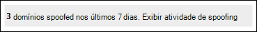

# <a name="spoof-intelligence-insight-in-eop"></a>Spoof intelligence insight in EOP

[!INCLUDE [Microsoft 365 Defender rebranding](../includes/microsoft-defender-for-office.md)]

**Aplica-se a**
- [Proteção do Exchange Online](exchange-online-protection-overview.md)
- [Plano 1 e plano 2 do Microsoft Defender para Office 365](defender-for-office-365.md)
- [Microsoft 365 Defender](../defender/microsoft-365-defender.md)

> [!NOTE]
> Os recursos descritos neste artigo estão em Visualização, estão sujeitos a alterações e não estão disponíveis em todas as organizações. Se a sua organização não tiver os recursos descritos neste artigo, consulte a experiência de gerenciamento de spoof mais antiga em Gerenciar envios com spoofed usando a política de inteligência de spoof e o insight de inteligência de [spoof no EOP](walkthrough-spoof-intelligence-insight.md).

Em organizações Microsoft 365 com caixas de correio em Exchange Online ou organizações de Proteção do Exchange Online (EOP) autônomas sem Exchange Online caixas de correio, as mensagens de email de entrada são automaticamente protegidas contra a Exchange Online contra a spoofagem. O EOP usa **a inteligência de** fraude como parte da defesa geral da sua organização contra phishing. Para obter mais informações, consulte [Anti-spoofing protection in EOP](anti-spoofing-protection.md).

Quando um remetente faz a spoofes de um endereço de email, ele parece ser um usuário em um dos domínios da sua organização ou um usuário em um domínio externo que envia emails para sua organização. Os invasores que spoof remetentes para enviar emails de spam ou phishing precisam ser bloqueados. Mas há cenários em que os envios legítimos são spoofing. Por exemplo:

- Cenários legítimos para a spoofing de domínios internos:
  - Os envios de terceiros usam seu domínio para enviar emails em massa para seus próprios funcionários para sondagens da empresa.
  - Uma empresa externa gera e envia atualizações de anúncios ou produtos em seu nome.
  - Um assistente precisa enviar emails regularmente para outra pessoa em sua organização.
  - Um aplicativo interno envia notificações por email.

- Cenários legítimos para a spoofing de domínios externos:
  - O remetente está em uma lista de email (também conhecida como lista de discussão), e a lista de emails retransmite emails do remetente original para todos os participantes na lista de email.
  - Uma empresa externa envia emails em nome de outra empresa (por exemplo, um relatório automatizado ou uma empresa de software como serviço).

Você pode  usar o insight de inteligência falsa no portal do Microsoft 365 Defender para identificar rapidamente os envios falsos que estão enviando emails não autenticados de forma legítima (mensagens de domínios que não passam verificações SPF, DKIM ou DMARC) e permitir manualmente esses envios.

Ao permitir que os envios conhecidos enviem mensagens falsas de locais conhecidos, você pode reduzir falsos positivos (emails bons marcados como ruins). Monitorando os envios permitidos, você fornece uma camada adicional de segurança para impedir que mensagens não seguras chegam à sua organização.

Da mesma forma, você pode revisar os envios de spoofed que foram permitidos pela inteligência de spoof e bloquear manualmente esses envios do insight de inteligência de spoof.

O restante deste artigo explica como usar o insight de inteligência de spoof no portal do Microsoft 365 Defender e no PowerShell (Exchange Online PowerShell para organizações Microsoft 365 com caixas de correio no Exchange Online; EOP PowerShell autônomo para organizações sem Exchange Online caixas de correio).

> [!NOTE]
>
> - Somente os envios com spoofed que foram detectados pela inteligência spoof aparecem na visão de inteligência spoof. Quando você substitui o veredito de permitir ou bloquear no insight, o remetente spoofed se torna uma entrada manual de permitir ou bloquear que aparece somente na guia **Spoof** na Lista de Locatários Permitir/Bloquear. Você também pode criar manualmente entradas de permitir ou bloquear para os envios de spoofed antes que eles são detectados pela inteligência spoof. Para saber mais, confira [Gerenciar a Lista Permitir/Bloquear Locatário no EOP](tenant-allow-block-list.md).
>
> - O insight de inteligência de spoof e a guia **Spoof** na lista Permitir/Bloquear Locatário substituem a funcionalidade da política de inteligência de spoof que estava disponível na página de política anti-spam no Centro de Conformidade de Segurança &.
>
>- O insight de inteligência de spoof mostra 7 dias de dados. O cmdlet **Get-SpoofIntelligenceInsight** mostra 30 dias de dados.

## <a name="what-do-you-need-to-know-before-you-begin"></a>Do que você precisa saber para começar?

- Abra o portal do Microsoft 365 Defender em <https://security.microsoft.com/>. Para ir diretamente para a página **Anti-phishing,** use <https://security.microsoft.com/antiphishing> . Para ir diretamente para a página **Spoof intelligence insight,** use <https://security.microsoft.com/spoofintelligence> .

- Para se conectar ao PowerShell do Exchange Online, confira [Conectar ao PowerShell do Exchange Online](/powershell/exchange/connect-to-exchange-online-powershell). Para se conectar ao EOP PowerShell autônomo, consulte [Conectar-se ao PowerShell do Exchange Online Protection.](/powershell/exchange/connect-to-exchange-online-protection-powershell).

- Você precisa de permissões em **Exchange Online** antes de poder realizar os procedimentos neste artigo:
  - Para modificar a política de inteligência de spoof ou habilitar ou  desabilitar a inteligência de spoof, você precisa ser membro dos grupos de função Gerenciamento da Organização ou Administrador **de** Segurança.
  - Para acesso somente leitura à política de inteligência de spoof, você precisa ser membro dos grupos de função Leitor **Global** ou **Leitor de** Segurança.

  Para obter mais informações, confira [Permissões no Exchange Online](/exchange/permissions-exo/permissions-exo).

  > [!NOTE]
  > - Adicionar usuários à função correspondente do Azure Active Directory no Centro de administração do Microsoft 365 fornece aos usuários as permissões necessárias _e_ permissões para outros recursos no Microsoft 365. Para obter mais informações, confira o artigo [Sobre funções de administrador](../../admin/add-users/about-admin-roles.md).
  > - O grupo de função **Gerenciamento de Organização Somente para Exibição** no [Exchange Online](/Exchange/permissions-exo/permissions-exo#role-groups) também fornece acesso somente leitura ao recurso.

- Você habilita e desabilita a inteligência de spoof em políticas anti-phishing no EOP e no Microsoft Defender para Office 365. A inteligência de spoof está habilitada por padrão. Para obter mais informações, consulte [Configure anti-phishing policies in EOP](configure-anti-phishing-policies-eop.md) or [Configure anti-phishing policies in Microsoft Defender for Office 365](configure-mdo-anti-phishing-policies.md).

- Para nossas configurações recomendadas para a inteligência de spoof, consulte Configurações de política [anti-phishing do EOP.](recommended-settings-for-eop-and-office365-atp.md#eop-anti-phishing-policy-settings)

## <a name="open-the-spoof-intelligence-insight-in-the-microsoft-365-defender-portal"></a>Abra o insight de inteligência de spoof no portal de Microsoft 365 Defender

1. No portal Microsoft 365 Defender, vá para **Email & Políticas** de Colaboração & Políticas de Ameaças de Regras página \>  \>  \> **Locatário Permitir/Bloquear Listas**.

2. Na página **Listas de Locatários de Permitir/Bloquear,** a visão de inteligência de spoof tem a seguinte aparência:

   

   O insight tem dois modos:

   - **Modo de** visão : se a inteligência falsa estiver habilitada, a visão mostra quantas mensagens foram detectadas pela inteligência falsa durante os últimos sete dias.
   - **E se o modo**: se a inteligência falsa estiver  desabilitada, a visão mostra quantas mensagens teriam sido detectadas pela inteligência falsa durante os últimos sete dias.

Para exibir informações sobre as detecções de inteligência falsas, clique em Exibir atividade de **spoofing** no insight de inteligência falsa.

### <a name="view-information-about-spoofed-messages"></a>Exibir informações sobre mensagens falsas

> [!NOTE]
> Lembre-se de que apenas os envios com spoofed detectados pela inteligência spoof aparecem nesta página. Quando você substitui o veredito de permitir ou bloquear no insight, o remetente spoofed se torna uma entrada manual de permitir ou bloquear que aparece somente na guia **Spoof** na Lista de Locatários Permitir/Bloquear.

Na página **Spoof intelligence insight** que aparece depois de clicar em Exibir atividade de **spoofing** no insight de inteligência falsa, a página contém as seguintes informações:

- **Usuário com spoofed**: o **domínio** do usuário que é exibido na caixa **De** em clientes de email. O endereço From também é conhecido como o `5322.From` endereço.
- **Infraestrutura de envio**: Também conhecida como _infraestrutura_. A infraestrutura de envio será um dos seguintes valores:
  - O domínio encontrado em um registro DNS reverso (registro PTR) do endereço IP do servidor de email de origem.
  - Se o endereço IP de origem não tiver registro PTR, a infraestrutura de envio será identificada como \<source IP\> /24 (por exemplo, 192.168.100.100/24).
- **Contagem de** mensagens : o número de mensagens da  combinação do domínio e da infraestrutura de envio para sua organização nos últimos 7 dias.
- **Last seen**: The last date when a message was received from the sending infrastructure that contains the spoofed domain.
- **Tipo de spoof**: um dos seguintes valores:
  - **Interno**: o remetente spoofed está em um domínio que pertence à sua organização [(um domínio aceito](/exchange/mail-flow-best-practices/manage-accepted-domains/manage-accepted-domains)).
  - **Externo**: o remetente spoofed está em um domínio externo.
- **Ação**: esse valor é **Permitido** ou **Bloqueado:**
  - **Permitido**: O domínio com falha na autenticação de email explícito verifica [SPF,](how-office-365-uses-spf-to-prevent-spoofing.md) [DKIM](use-dkim-to-validate-outbound-email.md)e [DMARC](use-dmarc-to-validate-email.md)). No entanto, o domínio passou nossas verificações implícitas de autenticação de email ([autenticação composta](email-validation-and-authentication.md#composite-authentication)). Como resultado, nenhuma ação anti-spoofing foi tomada na mensagem.
  - **Bloqueado**: As mensagens da combinação do  domínio e da infraestrutura de envio falsa são marcadas como ruins pela inteligência falsa. A ação realizada nas mensagens falsas é controlada pela política anti-phishing padrão ou políticas anti-phishing personalizadas (o valor padrão é **Mover** mensagem para a pasta Lixo Eletrônico ). Para obter mais informações, consulte [Configure anti-phishing policies in Microsoft Defender for Office 365](configure-mdo-anti-phishing-policies.md).

Você pode clicar em títulos de coluna selecionados para classificar os resultados.

Para filtrar os resultados, você tem as seguintes opções:

- Clique no **botão Filtrar.** No flyout **Filter** exibido, você pode filtrar os resultados por:
  - **Tipo de spoof**
  - **Action**
- Use a **caixa Pesquisar** para inserir uma lista separada por vírgulas de valores de domínios espouados ou enviar valores de infraestrutura para filtrar os resultados.

### <a name="view-details-about-spoofed-messages"></a>Exibir detalhes sobre mensagens falsas

Quando você seleciona uma entrada na lista, aparece um sobremenu de detalhes que contém as seguintes informações e recursos:

- Permitir a **spoofing** ou Bloquear a spoofing : selecione um desses valores para substituir o veredito de inteligência de spoof original e mover a entrada do insight de inteligência de spoof para a Lista de Locatários Permitir/Bloquear como uma entrada de permitir ou bloquear para spoof. 
- Por que pegamos isso.
- O que você precisa fazer.
- Um resumo de domínio que inclui a maioria das mesmas informações da página principal de inteligência de spoof.
- WhoIs dados sobre o remetente.
- Um link para abrir [o Explorador de Ameaças](threat-explorer.md) para ver detalhes adicionais sobre o remetente (Microsoft Defender para Office 365).
- Mensagens semelhantes que vimos em seu locatário do mesmo remetente.

### <a name="about-allowed-spoofed-senders"></a>Sobre os envios de spoofed permitidos

Um remetente spoofed permitido no insight de inteligência falsa ou um remetente com spoofed bloqueado que você alterou manualmente para Permitir  a **spoof** somente permite mensagens da combinação do domínio e da infraestrutura de envio. Ele não permite emails do domínio spoofed de qualquer origem, nem permite emails da infraestrutura de envio para qualquer domínio.

Por exemplo, o remetente spoofed a seguir tem permissão para fazer a spoof:

- **Domínio**: gmail.com
- **Infraestrutura**: tms.mx.com

Somente emails desse par de infraestrutura de envio/domínio terão permissão para fazer a spoof. Outros envios que tentam gmail.com não são permitidos automaticamente. As mensagens de senders em outros domínios que se originam tms.mx.com ainda são verificadas pela inteligência falsa e podem ser bloqueadas.

## <a name="use-the-spoof-intelligence-insight-in-exchange-online-powershell-or-standalone-eop-powershell"></a>Use o insight de inteligência de spoof no Exchange Online PowerShell ou no PowerShell do EOP autônomo

No PowerShell, você usa o cmdlet **Get-SpoofIntelligenceInsight** para exibir os envios permitidos e bloqueados que foram detectados pela inteligência de fraude.  Para permitir ou bloquear manualmente os envios despojados, você precisa usar o cmdlet **New-TenantAllowBlockListSpoofItems.** Para obter mais informações, [consulte Use PowerShell to configure the Tenant Allow/Block List](tenant-allow-block-list.md#use-exchange-online-powershell-or-standalone-eop-powershell-to-configure-the-tenant-allowblock-list).

Para exibir as informações no insight de inteligência falsa, execute o seguinte comando:

```powershell
Get-SpoofIntelligenceInsight
```

Para obter informações detalhadas sobre sintaxes e parâmetros, consulte [Get-SpoofIntelligenceInsight](/powershell/module/exchange/get-spoofintelligenceinsight).

## <a name="other-ways-to-manage-spoofing-and-phishing"></a>Outras maneiras de gerenciar a fraude e o phishing

Seja diligente sobre a proteção contra fraude e phishing. Aqui estão as maneiras relacionadas de verificar os envios que estão spoofando seu domínio e ajudar a impedir que eles danificarem sua organização:

- Verifique o **Relatório de Email de Spoof.** Você pode usar esse relatório com frequência para exibir e ajudar a gerenciar os envios com spoofed. Para obter informações, consulte [Spoof Detections report](view-email-security-reports.md#spoof-detections-report).

- Revise a configuração da Estrutura de Política do Remetente (SPF). Para obter uma introdução rápida à SPF e para configurá-la rapidamente, confira [Configurar a SPF no Microsoft 365 para ajudar a evitar falsificação](set-up-spf-in-office-365-to-help-prevent-spoofing.md). Para compreender melhor como o Office 365 usa SPF, para solucionar problemas, ou para saber mais sobre implantações incomuns, como implantações híbridas, comece com [How Office 365 uses Sender Policy Framework (SPF) to prevent spoofing](how-office-365-uses-spf-to-prevent-spoofing.md).

- Revise sua configuração DKIM (DomainKeys Identified Mail). Você deve usar o DKIM, além de SPF e DMARC, para ajudar a impedir que os invasores enviem mensagens que pareçam que vêm do seu domínio. O DKIM possibilita adicionar uma assinatura digital a mensagens de email no cabeçalho da mensagem. Para obter informações, [consulte Use DKIM to validate outbound email sent from your custom domain in Office 365](use-dkim-to-validate-outbound-email.md).

- Revise sua configuração de Autenticação, Relatório e Conformidade (DMARC) baseada em domínio. Implementar o DMARC com SPF e DKIM proporciona proporção adicional contra o spoofing e o phishing no email. O DMARC ajuda os sistemas de recepção de email a determinarem o que fazer com as mensagens enviadas a partir do seu domínio que falharem em verificações de SPF ou de DKIM. Para obter informações, [consulte Use DMARC to validate email in Office 365](use-dmarc-to-validate-email.md).
