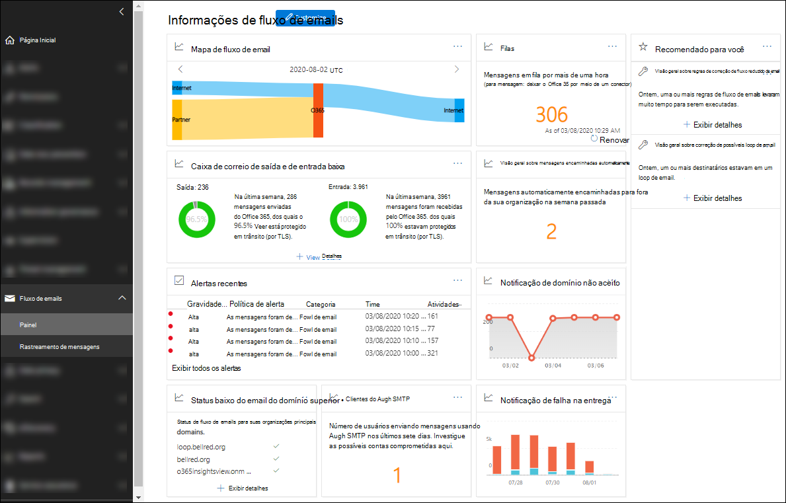

# Fluxo de emails no Centro de Conformidade e SegurançaMail flow insights in the Security & Compliance Center

[!INCLUDE [Microsoft 365 Defender rebranding](../includes/microsoft-defender-for-office.md)]

Os administradores podem usar o painel de fluxo de emails no centro de conformidade de & de segurança para descobrir tendências, insights e realizar ações para corrigir problemas relacionados ao fluxo de emails em sua organização.Admins can use Mail flow dashboard in the Security & Compliance Center to discover trends, insights, and take actions to fix issues related to mail flow in their organization.

As informações disponíveis são:The available insights are:

- [Visão geral sobre mensagens encaminhadas automaticamenteAuto-forwarded messages insight](mfi-auto-forwarded-messages-report.md)

- [Corrigir possíveis informações de loop de email](mfi-mail-loop-insight.md)1[Fix possible mail loop insight](mfi-mail-loop-insight.md)1

- [Corrigir as regras de fluxo de email lentos informações](mfi-slow-mail-flow-rules-insight.md)1[Fix slow mail flow rules insight](mfi-slow-mail-flow-rules-insight.md)1

- [Mapa de fluxo de emailMail flow map](mfi-mail-flow-map-report.md)

- [Novos domínios sendo encaminhados informações sobre email](mfi-new-domains-being-forwarded-email.md)2[New domains being forwarded email insight](mfi-new-domains-being-forwarded-email.md)2

- [Novos usuários encaminhando informações de email](mfi-new-users-forwarding-email.md)2[New users forwarding email insight](mfi-new-users-forwarding-email.md)2

- [Relatório de domínio não aceitoNon-accepted domain report](mfi-non-accepted-domain-report.md)

- [Relatório de falha na entregaNon-delivery report](mfi-non-delivery-report.md)

- [Visão geral sobre fluxo de entrada e saída de emailsOutbound and inbound mail flow insight](mfi-outbound-and-inbound-mail-flow.md)

- [Visão geral sobre filasQueues insight](mfi-queue-alerts-and-queues.md)

- [Visão geral e relatório de clientes de autenticação SMTPSMTP Auth clients insight and report](mfi-smtp-auth-clients-report.md)

- [Insight sobre o status do fluxo de mensagens dos principais domíniosTop domain mail flow status insight](mfi-domain-mail-flow-status-insight.md)

1 essa percepção aparecerá na área **recomendada para você** no painel de fluxo de emails somente depois que o problema for detectado.1 This insight appears in the **Recommended for you** area of the Mail flow dashboard only after the issue is detected. Caso contrário, você não o verá.Otherwise, you won't see it.

2 essa percepção não aparece no painel de fluxo de emails, mas fica visível na página de [relatório de encaminhamento](view-mail-flow-reports.md#forwarding-report) depois que o problema é detectado.2 This insight doesn't appear on the Mail flow dashboard, but is visible on the [Forwarding report](view-mail-flow-reports.md#forwarding-report) page after the issue is detected. Caso contrário, você não o verá.Otherwise, you won't see it.

## Permissões necessárias para exibir o painel de fluxo de emailsPermissions required to view the Mail flow dashboard

O painel de fluxo de emails está disponível para os membros dos seguintes grupos de função:The Mail flow dashboard is available to members of the following role groups:

- **Gerenciamento de organização** no centro de conformidade e segurança & (administradores globais).**Organization Management** in the Security & Compliance Center (global admins).

- **[Administrador do Exchange](https://docs.microsoft.com/azure/active-directory/users-groups-roles/directory-assign-admin-roles#exchange-administrator)** no Azure Active Directory.**[Exchange Administrator](https://docs.microsoft.com/azure/active-directory/users-groups-roles/directory-assign-admin-roles#exchange-administrator)** in Azure Active Directory.

- **Fluxo administrador** no centro de conformidade & segurança.**MailFlow Administrator** in the Security & Compliance Center. Se a conta também não for membro dos grupos de função de gerenciamento da organização ou de administrador do Exchange, considere os seguintes problemas:If the account is not also a member of the Organization Management or Exchange Administrator role groups, consider the following issues:
  - O usuário deve entrar no centro de conformidade & segurança diretamente em <https://protection.office.com> .The user must sign in to the Security & Compliance Center directly at <https://protection.office.com>.
  - O usuário só terá permissão somente leitura para o painel de fluxo de emails.The user will only have read-only permission to the Mail flow dashboard.
  - O usuário não terá acesso ao centro de administração do Microsoft 365.The user won't have access to the Microsoft 365 admin center.

Para obter mais informações sobre permissões, consulte [permissões no centro de conformidade de & de segurança](permissions-in-the-security-and-compliance-center.md) e [conceder aos usuários acesso ao centro de conformidade de & de segurança](grant-access-to-the-security-and-compliance-center.md).For more information about permissions, see [Permissions in the Security & Compliance Center](permissions-in-the-security-and-compliance-center.md) and [Give users access to the Security & Compliance Center](grant-access-to-the-security-and-compliance-center.md).

## Onde encontrar o painel de fluxo de emailsWhere to find the Mail flow dashboard

Abra o centro de conformidade do & de segurança em <https://protection.office.com> , expanda **fluxo de email** e selecione **painel**.Open the Security & Compliance Center at <https://protection.office.com>, expand **Mail flow** , and then select **Dashboard**.

Para ir diretamente para o painel de fluxo de emails, abra <https://protection.office.com/mailflow/dashboard> .To go directly to the Mail flow dashboard, open <https://protection.office.com/mailflow/dashboard>.
