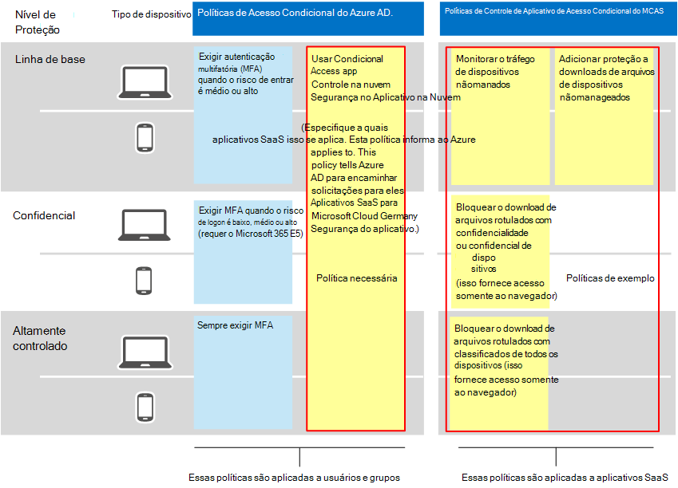
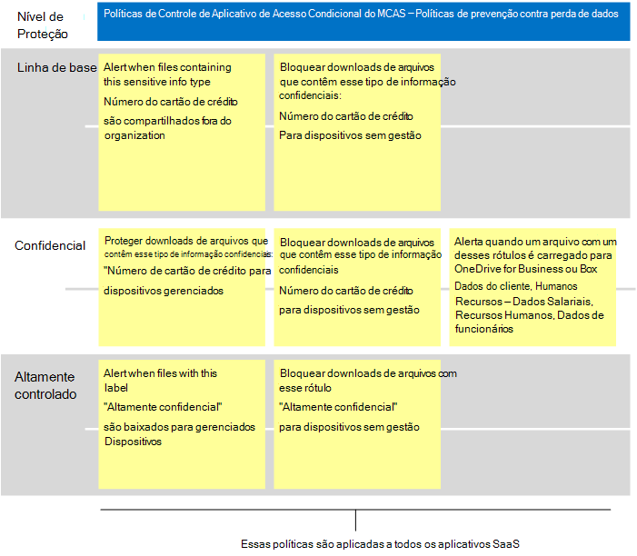

# Políticas recomendadas do Microsoft Cloud App Security para aplicativos SaaS
O Microsoft Cloud App Security se baseia em políticas de acesso condicional do Azure AD para habilitar o monitoramento em tempo real e o controle de ações granulares com aplicativos SaaS, como bloquear downloads, uploads, copiar e colar e imprimir. Esse recurso adiciona segurança a sessões que carregam riscos inerentes, como quando os recursos corporativos são acessados de dispositivos não utilizados ou por usuários convidados.

O Microsoft Cloud App Security também se integra de forma nativa à Proteção de Informações da Microsoft, fornecendo inspeção de conteúdo em tempo real para encontrar dados confidenciais com base em tipos de informações confidenciais e rótulos de sensibilidade e para tomar as medidas apropriadas.

Essas diretrizes incluem recomendações para esses cenários:

- Trazer aplicativos SaaS para o gerenciamento de IT
- Ajustar a proteção para aplicativos SaaS específicos
- Configurar a prevenção contra perda de dados (DLP) para ajudar a cumprir os regulamentos de proteção de dados

## Trazer aplicativos SaaS para o gerenciamento de IT

A primeira etapa ao usar o Microsoft Cloud App Security para gerenciar aplicativos SaaS é descobrir esses aplicativos e, em seguida, adicioná-los ao locatário do Azure AD. Se você precisar de ajuda com a descoberta, consulte [Descobrir e gerenciar aplicativos SaaS em sua rede.](/cloud-app-security/tutorial-shadow-it) Depois de descobrir os aplicativos, [adicione-os ao locatário do Azure AD.](/azure/active-directory/manage-apps/add-application-portal)

Você pode começar a gerenciá-lo fazendo o seguinte:

1. Primeiro, no Azure AD, crie uma nova política de acesso condicional e configure-a como "Usar o Controle de Aplicativo de Acesso Condicional". Isso redireciona a solicitação para o Cloud App Security. Você pode criar uma política e adicionar todos os aplicativos SaaS a essa política.
1. Em seguida, no Cloud App Security, crie políticas de sessão. Crie uma política para cada controle que você deseja aplicar.

As permissões para aplicativos SaaS geralmente se baseiam na necessidade comercial de acesso ao aplicativo. Essas permissões podem ser altamente dinâmicas. O uso de políticas de Segurança de Aplicativos na Nuvem garante proteção aos dados do aplicativo, independentemente de os usuários ser atribuídos a um grupo do Azure AD associado à proteção de linha de base, sensível ou altamente regulamentada.

Para proteger dados em sua coleção de aplicativos SaaS, o diagrama a seguir ilustra a política de acesso condicional necessária do Azure AD, além de políticas sugeridas que você pode criar no Cloud App Security. Neste exemplo, as políticas criadas no Cloud App Security se aplicam a todos os aplicativos SaaS que você está gerenciando. Eles foram projetados para aplicar controles apropriados com base em se os dispositivos são gerenciados, bem como rótulos de sensibilidade que já são aplicados a arquivos.

A tabela a seguir lista a nova política de acesso condicional que você deve criar no Azure AD.

|Nível de Proteção|Política|Mais informações|
|---|---|---|
|Todos os níveis de proteção|[Usar o Controle de Aplicativo de Acesso Condicional na Segurança do Aplicativo na Nuvem](/cloud-app-security/proxy-deployment-aad#configure-integration-with-azure-ad)|Isso configura seu IdP (Azure AD) para trabalhar com a Segurança do Aplicativo na Nuvem.|
||||

Esta próxima tabela lista as políticas de exemplo ilustradas acima que você pode criar para proteger todos os aplicativos SaaS. Avalie seus próprios objetivos de negócios, segurança e conformidade e crie políticas que forneçam a proteção mais apropriada para seu ambiente.

|Nível de Proteção|Política|
|---|---|
|Linha de base|Monitorar o tráfego de dispositivos nãomanados 
 Adicionar proteção a downloads de arquivos de dispositivos nãomanageados|
|Confidencial|Bloquear o download de arquivos rotulados com confidencialidade ou confidencial de dispositivos não autorizados (isso fornece acesso somente ao navegador)|
|Altamente controlado|Bloquear o download de arquivos rotulados com classificados de todos os dispositivos (isso fornece acesso somente ao navegador)|
|||

Para obter instruções de ponta a ponta para configurar o Controle de Aplicativo de Acesso Condicional, consulte [Deploy Conditional Access App Control for featured apps](/cloud-app-security/proxy-deployment-aad). Este artigo orienta você sobre o processo de criação da política de acesso condicional necessária no Azure AD e teste seus aplicativos SaaS.

Para obter mais informações, consulte [Proteger aplicativos com o Microsoft Cloud App Security Conditional Access App Control](/cloud-app-security/proxy-intro-aad).

## Ajustar a proteção para aplicativos SaaS específicos

Talvez você queira aplicar monitoramento e controles adicionais a aplicativos SaaS específicos em seu ambiente. O Cloud App Security permite que você realize isso. Por exemplo, se um aplicativo como Box for usado pesadamente em seu ambiente, faz sentido aplicar controles adicionais. Ou, se seu departamento jurídico ou financeiro estiver usando um aplicativo SaaS específico para dados comerciais confidenciais, você poderá direcionar proteção extra para esses aplicativos.

Por exemplo, você pode proteger seu ambiente Box com esses tipos de modelos de política de detecção de anomalias internas:

- Atividade de endereços IP anônimos
- Atividade de país pouco frequente
- Atividade de endereços IP suspeitos
- Viagem impossível
- Atividade executada por usuário encerrado (requer AAD como IdP)
- Detecção de malware
- Várias tentativas de logon com falha
- Atividade ransomware
- Aplicativo Oauth Arriscado
- Atividade incomum de compartilhamento de arquivos

Estes são exemplos. Modelos de política adicionais são adicionados regularmente. Para obter exemplos de como aplicar proteção adicional a aplicativos específicos, consulte [Protegendo aplicativos conectados.](/cloud-app-security/protect-connected-apps)

[Como o Cloud App Security ajuda](/cloud-app-security/protect-box) a proteger seu ambiente box demonstra os tipos de controles que podem ajudá-lo a proteger seus dados corporativos no Box e em outros aplicativos com dados confidenciais.

## Configurar a prevenção contra perda de dados (DLP) para ajudar a cumprir os regulamentos de proteção de dados

O Cloud App Security pode ser uma ferramenta valiosa para configurar a proteção para regulamentos de conformidade. Nesse caso, você cria políticas específicas para procurar dados específicos aos quais uma regulamentação se aplica e configura cada política para tomar as medidas apropriadas.

A ilustração e a tabela a seguir fornecem vários exemplos de políticas que podem ser configuradas para ajudar a cumprir o Regulamento Geral de Proteção de Dados (RGPD). Nesses exemplos, as políticas pesquisam dados específicos. Com base na sensibilidade dos dados, cada política é configurada para tomar a ação apropriada.

|Nível de Proteção|Políticas de exemplo|
|---|---|
|Linha de base|Alerta quando arquivos que contêm esse tipo de informação confidenciais ("Número do Cartão de Crédito") são compartilhados fora da organização 
 >Bloquear downloads de arquivos que contêm esse tipo de informação confidenciais ("Número do cartão de crédito") para dispositivos nãomanados|
|Confidencial|Proteger downloads de arquivos que contêm esse tipo de informação confidenciais ("Número do cartão de crédito") para dispositivos gerenciados 
 Bloquear downloads de arquivos que contêm esse tipo de informação confidenciais ("Número do cartão de crédito") para dispositivos nãomanageados 
 Alerta quando um arquivo com esses rótulos é carregado no OneDrive for Business ou na Caixa (Dados do cliente, Recursos Humanos: Dados salariais, Recursos Humanos, Dados do funcionário)|
|Altamente controlado|Alerta quando arquivos com esse rótulo ("Altamente classificados") são baixados para dispositivos gerenciados 
 Bloquear downloads de arquivos com esse rótulo ("Altamente classificado") para dispositivos nãomanageados|
|||

## Próximas etapas

Para obter mais informações sobre como usar o Cloud App Security, consulte [Microsoft Cloud App Security documentation](//cloud-app-security/).
