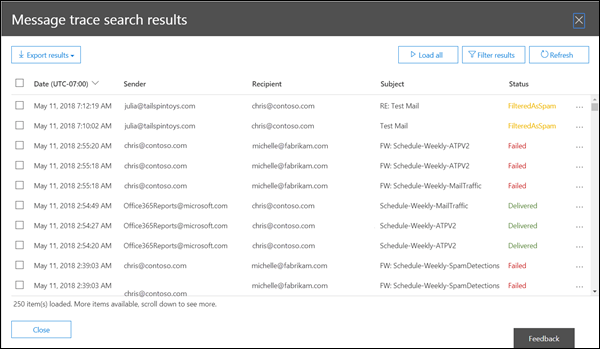

# Rastreamento de mensagens no Centro de Conformidade e SegurançaMessage trace in the Security & Compliance Center

[!INCLUDE [Microsoft 365 Defender rebranding](../includes/microsoft-defender-for-office.md)]

**Aplica-se a****Applies to**
- [Proteção do Exchange OnlineExchange Online Protection](exchange-online-protection-overview.md)
- [Plano 1 e plano 2 do Microsoft Defender para Office 365Microsoft Defender for Office 365 plan 1 and plan 2](office-365-atp.md)
- [Microsoft 365 DefenderMicrosoft 365 Defender](../mtp/microsoft-threat-protection.md)

## Recursos de rastreamento de mensagensMessage trace features

O rastreamento de mensagens no Centro de Conformidade e Segurança & segue as mensagens de email conforme elas passam pela sua organização do Exchange Online.Message trace in the Security & Compliance Center follows email messages as they travel through your Exchange Online organization. Você pode determinar se uma mensagem foi recebida, rejeitada, adiada ou entregue pelo serviço.You can determine if a message was received, rejected, deferred, or delivered by the service. Também mostra as ações feitas na mensagem antes de ela chegar em seu status final.It also shows what actions were taken on the message before it reached its final status.

O rastreamento de mensagens no Centro de Conformidade e Segurança & aprimora o rastreamento de mensagens original que estava disponível no Centro de administração do Exchange (EAC).Message trace in the Security & Compliance Center improves upon the original message trace that was available in the Exchange admin center (EAC). Você pode usar as informações do rastreamento de mensagens para responder com eficiência às perguntas do usuário sobre o que aconteceu com as mensagens, solucionar problemas de fluxo de emails e validar alterações de política.You can use the information from message trace to efficiently answer user questions about what happened to messages, troubleshoot mail flow issues, and validate policy changes.

> [!NOTE]
>
> - Para fazer um rastreamento de mensagens, você precisa ser membro dos grupos de função Gerenciamento da Organização, Gerenciamento de Conformidade ou Help Desk.To do a message trace, you need to be a member of the Organization Management, Compliance Management or Help Desk role groups. Para saber mais, confira [Permissões no Centro de Conformidade de Segurança](permissions-in-the-security-and-compliance-center.md).For more information, see [Permissions in the Security & Compliance Center](permissions-in-the-security-and-compliance-center.md).
>
> - O número máximo de mensagens exibidas nos resultados depende do tipo de relatório selecionado (consulte a seção Escolher tipo [de](#choose-report-type) relatório para obter detalhes).The maximum number of messages that are displayed in the results depends on the report type you selected (see the [Choose report type](#choose-report-type) section for details). O cmdlet [Get-HistoricalSearch](https://docs.microsoft.com/powershell/module/exchange/get-historicalsearch) no PowerShell do Exchange Online ou no PowerShell do EOP autônomo retorna todas as mensagens nos resultados.The [Get-HistoricalSearch](https://docs.microsoft.com/powershell/module/exchange/get-historicalsearch) cmdlet in Exchange Online PowerShell or standalone EOP PowerShell returns all messages in the results.

## Abrir rastreamento de mensagensOpen message trace

1. Abra o Centro de Conformidade & segurança em <https://protection.office.com> .Open the Security & Compliance Center at <https://protection.office.com>.

2. Expanda **o fluxo de** emails e selecione Rastreamento de **mensagens.**Expand **Mail flow**, and then select **Message trace**.

## Página de rastreamento de mensagensMessage trace page

A partir daqui, você pode iniciar um novo rastreamento padrão clicando no **botão Iniciar um** rastreamento.From here you can start a new default trace by clicking on the **Start a trace** button. Isso procurará todas as mensagens para todos os destinatários e os destinatários nos últimos dois dias.This will search for all messages for all senders and recipients for the last two days. Ou você pode usar uma das consultas armazenadas das categorias de consulta disponíveis e usá-las como estão ou usá-las como pontos de partida para suas próprias consultas:Or you can use one of the stored queries from the available query categories and either run them as-is or use them as starting points for your own queries:

- **Consultas padrão:** consultas integrados fornecidas pelo Microsoft 365.**Default queries**: Built-in queries provided by Microsoft 365.

- **Consultas personalizadas:** consultas salvas por administradores em sua organização para uso futuro.**Custom queries**: Queries saved by admins in your organization for future use.

- **Consultas autosaved:** as dez últimas consultas mais recentemente.**Autosaved queries**: The last ten most recently run queries. Essa lista torna mais fácil reacarcar de onde você saiu.This list makes it simple to pick up where you left off.

Também nesta página  há uma seção de relatórios baixáveis para as solicitações que você enviou, bem como os relatórios em si quando há disponíveis para download.Also on this page is a **Downloadable reports** section for the requests you've submitted, as well as the reports themselves when they're are available for download.

## Opções para um novo rastreamento de mensagensOptions for a new message trace

### Filtrar por destinatários e por destinatáriosFilter by senders and recipients

Os valores padrão são **Todos os destinatários e** os **destinatários,** mas você pode usar os seguintes campos para filtrar os resultados:The default values are **All senders** and **All recipients**, but you can use the following fields to filter the results:

- **Por essas pessoas:** clique neste campo para selecionar um ou mais senders da sua organização.**By these people**: Click in this field to select one or more senders from your organization. Você também pode começar a digitar um nome e os itens na lista serão filtrados pelo que você digitou, bem parecido com o comportamento de uma página de pesquisa.You can also start to type a name and the items in the list will be filtered by what you've typed, much like how a search page behaves.

- **Para essas pessoas:** clique neste campo para selecionar um ou mais destinatários em sua organização.**To these people**: Click in this field to select one or more recipients in your organization.

> [!NOTE]
>
> - Você também pode digitar os endereços de email de destinatários e destinatários externos.You can also type the email addresses of external senders and recipients. Há suporte para curingas (por exemplo, ), mas você não pode usar várias entradas curinga no mesmo campo `*@contoso.com` ao mesmo tempo.Wildcards are supported (for example, `*@contoso.com`), but you can't use multiple wildcard entries in the same field at the same time.
>
> - You can paste multiple senders or recipients lists separated by semicolons ( `;` ).You can paste multiple senders or recipients lists separated by semicolons (`;`). espaços ( `\s` ), retornos de carro ( `\r` ) ou próximas linhas ( `\n` ).spaces (`\s`), carriage returns (`\r`), or next lines (`\n`).

### Intervalo de tempoTime range

O valor padrão é **2 dias,** mas você pode especificar intervalos de data/hora de até 90 dias.The default value is **2 days**, but you can specify date/time ranges of up to 90 days. Ao usar intervalos de data/hora, considere estes problemas:When you use date/time ranges, consider these issues:

- Por padrão, você seleciona o intervalo de tempo no modo **de exibição de controle** deslizante usando uma linha de tempo.By default, you select the time range in **Slider** view using a time line. Você só pode selecionar as configurações de dia ou hora que são exibidas.You can only select the day or time settings that are displayed. Tentar selecionar um valor entre eles ajustará a bolha inicial/final à configuração exibida mais próxima.Trying to select an in-between value will snap the start/end bubble to the nearest displayed setting.

  

  Porém, você também  pode alternar para o  exibição Personalizado, onde você pode especificar  os valores de data de início e de término (incluindo horas) e também pode selecionar o fuso horário para o intervalo de data/hora. But, you can also switch to **Custom** view where you can specify the **Start date** and **End date** values (including times), and you can also select the **Time zone** for the date/time range. Observe que a **configuração fuso** horário se aplica às entradas de consulta e aos resultados da consulta.Note that the **Time zone** setting applies to both your query inputs and your query results.

  

  Por 10 dias ou menos, os resultados ficam disponíveis instantaneamente como um relatório **de** Resumo.For 10 days or less, the results are available instantly as a **Summary** report. Se você especificar um intervalo de tempo que seja um pouco maior do que 10 dias, os resultados serão atrasados,  pois só estarão disponíveis como um arquivo CSV para download **(resumo** aprimorado ou relatórios estendidos).If you specify a time range that's even slightly greater than 10 days, the results will be delayed as they are only available as a downloadable CSV file ( **Enhanced summary** or **Extended** reports).

  Para obter mais informações sobre os diferentes tipos de relatório, consulte a [seção](#choose-report-type) Escolher tipo de relatório neste artigo.For more information about the different report types, see the [Choose report type](#choose-report-type) section in this article.

  > [!NOTE]
  > Os relatórios estendidos e de resumo aprimorados são preparados usando dados de rastreamento de mensagens arquivados e podem levar várias horas até que o relatório esteja disponível para download.Enhanced summary and Extended reports are prepared using archived message trace data, and it can take up to several hours before your report is available for download. Dependendo de quantos outros administradores também enviaram solicitações de relatório ao mesmo tempo, você também pode notar um atraso antes do início do processamento para sua solicitação na fila.Depending on how many other admins have also submitted report requests around the same time, you might also notice a delay before processing starts for your queued request.

- Salvar uma consulta no controle **deslizante** salva o intervalo de tempo relativo (por exemplo, 3 dias a partir de hoje).Saving a query in **Slider** view saves the relative time range (for example, 3 days from today). Salvar uma consulta  no exibição Personalizado salva o intervalo absoluto de data/hora (por exemplo, 2018-05-06 13:00 a 2018-05-08 18:00).Saving a query in **Custom** view saves the absolute date/time range (for example, 2018-05-06 13:00 to 2018-05-08 18:00).

### Mais opções de pesquisaMore search options

#### Status de entregaDelivery status

Você pode deixar o valor padrão **Todos** selecionados ou pode selecionar um dos seguintes valores para filtrar os resultados:You can leave the default value **All** selected, or you can select one of the following values to filter the results:

- **Entregue:** a mensagem foi entregue com êxito ao destino pretendido.**Delivered**: The message was successfully delivered to the intended destination.

- **Pendente:** a tentativa de entrega da mensagem está sendo tentada ou tentada outra vez.**Pending**: Delivery of the message is being attempted or re-attempted.

- **Expandido:** um destinatário do grupo de distribuição foi expandido antes da entrega aos membros individuais do grupo.**Expanded**: A distribution group recipient was expanded before delivery to the individual members of the group.

- **Falha:** a mensagem não foi entregue.**Failed**: The message was not delivered.

- **Em quarentena:** a mensagem foi colocada em quarentena (como spam, email em massa ou phishing).**Quarantined**: The message was quarantined (as spam, bulk mail, or phishing). Para obter mais informações, consulte [Mensagens de email em quarentena no EOP.](quarantine-email-messages.md)For more information, see [Quarantined email messages in EOP](quarantine-email-messages.md).

- **Filtrado como spam:** a mensagem foi identificada como spam e foi rejeitada ou bloqueada (não colocada em quarentena).**Filtered as spam**: The message was identified spam, and was rejected or blocked (not quarantined).

- **Obter status:** A mensagem foi recebida recentemente pelo Microsoft 365, mas nenhum outro dado de status ainda está disponível.**Getting status:** The message was recently received by Microsoft 365, but no other status data is yet available. Verifique novamente em alguns minutos.Check back in a few minutes.

> [!NOTE]
> Os valores **Pendente, Em** **Quarentena** e Filtrar **como spam** só estão disponíveis para pesquisas com menos de 10 dias.The values **Pending,** **Quarantined**, and **Filter as spam** are only available for searches less than 10 days. Além disso, pode haver um atraso de 5 a 10 minutos entre o status de entrega real e relatado.Also, there might be a 5 to 10 minute delay between the actual and reported delivery status.

#### ID da mensagemMessage ID

Essa é a ID de mensagem da Internet (também conhecida como ID do Cliente) encontrada no campo de header **Message-ID:** no header da mensagem.This is the internet message ID (also known as the Client ID) that's found in the **Message-ID:** header field in the message header. Os usuários podem lhe dar esse valor para investigar mensagens específicas.Users can give you this value to investigate specific messages.

Esse valor é constante durante o tempo de vida da mensagem.This value is constant for the lifetime of the message. Para mensagens criadas no Microsoft 365 ou Exchange, o valor está no formato `<GUID@ServerFQDN>` , incluindo os colchetes angulares ( \< \> ).For messages created in Microsoft 365 or Exchange, the value is in the format `<GUID@ServerFQDN>`, including the angle brackets (\< \>). Por exemplo, `<d9683b4c-127b-413a-ae2e-fa7dfb32c69d@DM3NAM06BG401.Eop-nam06.prod.protection.outlook.com>`.For example, `<d9683b4c-127b-413a-ae2e-fa7dfb32c69d@DM3NAM06BG401.Eop-nam06.prod.protection.outlook.com>`. Outros sistemas de mensagens podem usar sintaxe ou valores diferentes.Other messaging systems might use different syntax or values. Esse valor deve ser exclusivo, mas nem todos os sistemas de email seguem estritamente esse requisito.This value is supposed to be unique, but not all email systems strictly follow this requirement. Se o campo de cabeça **Message-ID:** não existir ou estiver em branco para mensagens de entrada de fontes externas, um valor arbitrário será atribuído.If the **Message-ID:** header field doesn't exist or is blank for incoming messages from external sources, an arbitrary value is assigned.

Ao usar a **ID da Mensagem** para filtrar os resultados, certifique-se de incluir a cadeia de caracteres completa, incluindo colchetes angulares.When you use **Message ID** to filter the results, be sure to include the full string, including any angle brackets.

#### DireçãoDirection

Você pode deixar  o valor padrão Todos selecionados ou pode selecionar Entrada **(mensagens** enviadas a destinatários em sua organização) ou Saída **(mensagens** enviadas de usuários em sua organização) para filtrar os resultados.You can leave the default value **All** selected, or you can select **Inbound** (messages sent to recipients in your organization) or **Outbound** (messages sent from users in your organization) to filter the results.

#### Endereço IP do cliente originalOriginal client IP address

Você pode arquivar os resultados pelo endereço IP do cliente para investigar computadores criminosos que estão enviando grandes quantidades de spam ou malware.You can filer the results by client IP address to investigate hacked computers that are sending large amounts of spam or malware. Embora as mensagens possam parecer vir de vários senders, é provável que o mesmo computador está gerando todas as mensagens.Although the messages might appear to come from multiple senders, it's likely that the same computer is generating all of the messages.

> [!NOTE]
> As informações do endereço IP do cliente só estão disponíveis por  10  dias e só estão disponíveis nos relatórios de Resumo aprimorado ou Estendido (arquivos CSV baixáveis).The client IP address information is only available for 10 days, and is only available in the **Enhanced summary** or **Extended** reports (downloadable CSV files).

### Escolher tipo de relatórioChoose report type

Os tipos de relatório disponíveis são:The available report types are:

- **Resumo:** Disponível se o intervalo de tempo for menor que 10 dias e não exigir opções de filtragem adicionais.**Summary**: Available if the time range is less than 10 days, and requires no additional filtering options. Os resultados estão disponíveis quase imediatamente após você clicar em **Pesquisar.**The results are available almost immediately after you click **Search**. O relatório retorna até 20.000 resultados.The report returns up to 20000 results.

-  Resumo aprimorado ou **Estendido:** esses relatórios estão disponíveis apenas como arquivos CSV baixáveis e exigem uma ou mais das seguintes opções de filtragem, independentemente do intervalo de **tempo:** Por essas **pessoas,** para essas pessoas ou **ID** da Mensagem.**Enhanced summary** or **Extended**: These reports are only available as downloadable CSV files, and require one or more of the following filtering options regardless of the time range: **By these people**, **To these people**, or **Message ID**. Você pode usar curingas para os destinatários ou os destinatários (por exemplo, \* @contoso.com).You can use wildcards for the senders or the recipients (for example, \*@contoso.com). O relatório de resumo aprimorado retorna até 50.000 resultados.The Enhanced summary report returns up to 50000 results. O relatório Estendido retorna até 1000 resultados.The Extended report returns up to 1000 results.

> [!NOTE]
> 
> - Os relatórios estendidos e de resumo aprimorados são preparados usando dados de rastreamento de mensagens arquivados e podem levar várias horas antes que o relatório esteja disponível para download.Enhanced summary and Extended reports are prepared using archived message trace data, and it can take up to several hours before your report is available to download. Dependendo de quantos outros administradores também enviaram solicitações de relatório ao mesmo tempo, você também pode notar um atraso antes que sua solicitação na fila comece a ser processada.Depending on how many other admins have also submitted report requests around the same time, you might also notice a delay before your queued request starts to be processed.
> 
> - Embora você possa selecionar um resumo aprimorado ou um relatório estendido para qualquer intervalo de data/hora, normalmente as últimas quatro horas de dados arquivados ainda não estarão disponíveis para esses dois tipos de relatórios.While you can select an Enhanced summary or Extended report for any date/time range, commonly the last four hours of archived data will not yet be available for these two types of reports.

Ao clicar em **Próximo,** você recebe uma página de resumo que lista as opções de filtragem selecionadas, um título exclusivo (editável) para o relatório e o endereço de email que recebe a notificação quando o rastreamento de mensagem é concluído (também editável e deve estar em um dos domínios aceitos da sua organização).When you click **Next**, you're presented with a summary page that lists the filtering options that you selected, a unique (editable) title for the report, and the email address that receives the notification when the message trace completes (also editable, and must be in one of your organization's accepted domains). Clique **em Preparar relatório** para enviar o rastreamento de mensagem.Click **Prepare report** to submit the message trace. Na página principal **Rastreamento de** mensagens, você pode ver o status do relatório na seção **Relatórios Baixáveis.**On the main **Message trace** page, you can see the status of the report in the **Downloadable reports** section.

Para obter mais informações sobre as informações retornadas nos diferentes tipos de relatório, consulte a próxima seção.For more information about the information that's returned in the different report types, see the next section.

## Resultados de rastreamento de mensagensMessage trace results

Os diferentes tipos de relatório retornam diferentes níveis de informações.The different report types return different levels of information. As informações disponíveis nos diferentes relatórios são descritas nas seções a seguir.The information that's available in the different reports is described in the following sections.

### Saída do relatório de resumoSummary report output

Depois de executar o rastreamento de mensagem, os resultados serão listados, organizados por data/hora decrescente (a primeira mais recente).After running the message trace, the results will be listed, sorted by descending date/time (most recent first).

O relatório resumido contém as seguintes informações:The summary report contains the following information:

- **Data**: a data e a hora em que a mensagem foi recebida pelo serviço, usando o fuso horário UTC configurado.**Date**: The date and time at which the message was received by the service, using the configured UTC time zone.

- **Remetente**: o endereço de email do remetente *(domínio de* @ alias).**Sender**: The email address of the sender (*alias*@*domain*).

- **Destinatário**: o endereço de email do destinatário ou destinatários.**Recipient**: The email address of the recipient or recipients. Para uma mensagem enviada a vários destinatários, há uma linha por destinatário.For a message sent to multiple recipients, there's one line per recipient. Se o destinatário for um grupo de distribuição, um grupo dinâmico de distribuição ou um grupo de segurança habilitado para email, o grupo será o primeiro destinatário e, em seguida, cada membro do grupo estará em uma linha separada.If the recipient is a distribution group, dynamic distribution group, or mail-enabled security group, the group will be the first recipient, and then each member of the group is on a separate line.

- **Assunto**: os primeiros 256 caracteres do campo **Assunto: da** mensagem.**Subject**: The first 256 characters of the message's **Subject:** field.

- **Status:** esses valores são descritos na seção [Status de](#delivery-status) entrega.**Status**: These values are described in the [Delivery status](#delivery-status) section.

Por padrão, os primeiros 250 resultados são carregados e prontamente disponíveis.By default, the first 250 results are loaded and readily available. Quando você rola para baixo, há uma pequena pausa à medida que o próximo lote de resultados é carregado.When you scroll down, there's a slight pause as the next batch of results are loaded. Em vez de rolar,  você pode clicar em Carregar tudo para carregar todos os resultados até um máximo de 10.000.Instead of scrolling, you can click **Load all** to load all of the results up to a maximum of 10,000.

Você pode clicar nos headers das colunas para classificar os resultados pelos valores dessa coluna em ordem crescente ou decrescente.You can click on the column headers to sort the results by the values in that column in ascending or descending order.

Você pode clicar **nos resultados de** Filtro para filtrar os resultados por uma ou mais colunas.You can click **Filter results** to filter the results by one or more columns.

Você pode exportar os resultados depois de selecionar uma  ou mais linhas clicando em Exportar resultados e, em seguida, selecionando Exportar todos os resultados **,** Exportar resultados carregados ou **Exportar selecionado.**You can export the results after you've selected one or more rows by clicking **Export results** and then selecting **Export all results**, **Export loaded results**, or **Export selected**.

#### Encontrar registros relacionados para esta mensagemFind related records for this message

Registros de mensagens relacionados são registros que compartilharam a mesma ID de Mensagem.Related message records are records that shared the same Message ID. Lembre-se de que até mesmo uma única mensagem enviada entre duas pessoas pode gerar vários registros.Remember, even a single message sent between two people can generate multiple records. O número de registros aumenta quando a mensagem é afetada pela expansão, encaminhamento, regras de fluxo de emails (também conhecidas como regras de transporte), etc.The number of records increases when the message is affected by distribution group expansion, forwarding, mail flow rules (also known as transport rules), etc.

Depois de marcar a caixa de seleção de uma linha, você  pode encontrar registros relacionados  para a mensagem clicando no botão Encontrar relacionado que aparece ou selecionando Mais opções Mais opções Encontre registros relacionados para esta  \> **mensagem).**After you select a row's check box, you can find related records for the message by clicking the **Find related** button that appears, or by selecting **More options**  \> **Find related records for this message**).

Para obter mais informações sobre a ID da Mensagem, consulte a seção ID da Mensagem anteriormente neste artigo.For more information about the Message ID, see the Message ID section earlier in this article.

#### Detalhes do rastreamento de mensagensMessage trace details

Na saída do relatório resumido, você pode exibir detalhes sobre uma mensagem usando um dos seguintes métodos:In the summary report output, you can view details about a message by using either of the following methods:

- Selecione a linha (clique em qualquer lugar da linha, exceto na caixa de seleção).Select the row (click anywhere in the row except the check box).

- Marque a caixa de seleção da linha e clique em Mais opções **Mais Exibir** detalhes da  \> **mensagem.**Select the row's check box and click **More options**  \> **View message details**.

   

Os detalhes do rastreamento de mensagens contêm as seguintes informações adicionais que não estão presentes no relatório resumido:The message trace details contain the following additional information that's not present in the summary report:

- **Eventos de** mensagem: Esta seção contém classificações que ajudam a categorizar as ações que o serviço toma em mensagens.**Message events**: This section contains classifications that help categorize the actions that the service takes on messages. **Alguns dos eventos mais interessantes** que você pode encontrar são:**Some of the more interesting events** that you might encounter are:

  - **Receive**: The message was received by the service.**Receive**: The message was received by the service.

  - **Enviar**: a mensagem foi enviada pelo serviço.**Send**: The message was sent by the service.

  - **Falha:** A mensagem não foi entregue.**Fail**: The message failed to be delivered.

  - **Entrega:** a mensagem foi entregue a uma caixa de correio.**Deliver**: The message was delivered to a mailbox.

  - **Expanda**: a mensagem foi enviada para um grupo de distribuição que foi expandido.**Expand**: The message was sent to a distribution group that was expanded.

  - **Transferência:** os destinatários foram movidos para uma mensagem bifurcada devido à conversão de conteúdo, limites de destinatário da mensagem ou agentes.**Transfer**: Recipients were moved to a bifurcated message because of content conversion, message recipient limits, or agents.

  - **Adiar**: a entrega da mensagem foi adiada e pode ser tentada novamente mais tarde.**Defer**: The message delivery was postponed and might be re-attempted later.

  - **Resolvido:** a mensagem foi redirecionada para um novo endereço de destinatário com base em uma busca no Active Directory.**Resolved**: The message was redirected to a new recipient address based on an Active Directory look up. Quando isso acontece, o endereço original de destinatário é listado em uma linha separada no rastreamento de mensagem junto com o status final de entrega da mensagem.When this happens, the original recipient address is listed in a separate row in the message trace along with the final delivery status for the message.

  > [!NOTE]
  > 
  > - Uma mensagem sem eventos entregue com êxito gerará várias entradas **de** evento no rastreamento de mensagens.An uneventful message that's successfully delivered will generate multiple **Event** entries in the message trace.
  > 
  > - Essa lista não deve ser exaustiva.This list is not meant to be exhaustive. Para obter descrições de mais eventos, consulte [Tipos de eventos no log de controle de mensagens.](https://docs.microsoft.com/Exchange/mail-flow/transport-logs/message-tracking#event-types-in-the-message-tracking-log)For descriptions of more events, see [Event types in the message tracking log](https://docs.microsoft.com/Exchange/mail-flow/transport-logs/message-tracking#event-types-in-the-message-tracking-log). Observe que esse link é um tópico do Exchange Server (Exchange local).Note that this link is an Exchange Server (on-premises Exchange) topic.

- **Mais informações:** Esta seção contém os seguintes detalhes:**More information**: This section contains the following details:

  - **ID da** mensagem: esse valor é descrito na seção [ID da](#message-id) mensagem anteriormente neste artigo.**Message ID**: This value is described in the [Message ID](#message-id) section earlier in this article. Por exemplo, `<d9683b4c-127b-413a-ae2e-fa7dfb32c69d@DM3NAM06BG401.Eop-nam06.prod.protection.outlook.com>`.For example, `<d9683b4c-127b-413a-ae2e-fa7dfb32c69d@DM3NAM06BG401.Eop-nam06.prod.protection.outlook.com>`.

  - **Tamanho da mensagem****Message size**

  - **De IP**: o endereço IP do computador que enviou a mensagem.**From IP**: The IP address of the computer that sent the message. Para as mensagens de saída enviadas a partir do Exchange Online, o valor é nulo.For outbound messages sent from Exchange Online, this value is blank.

  - **Para IP:** o endereço IP ou endereços em que o serviço tentou entregar a mensagem.**To IP**: The IP address or addresses where the service attempted to deliver the message. Se a mensagem tiver vários destinatários, eles serão exibidos.If the message has multiple recipients, these are displayed. Para mensagens de entrada enviadas para o Exchange Online, o valor é nulo.For inbound messages sent to Exchange Online, this value is blank.

### Relatórios de resumo aprimoradosEnhanced summary reports

Relatórios de resumo aprimorados disponíveis (concluídos) estão disponíveis na seção **Relatórios baixáveis** no rastreamento de mensagens inicial.Available (completed) Enhanced summary reports are available in the **Downloadable reports** section at the beginning message trace. As seguintes informações estão disponíveis no relatório:The following information is available in the report:

- **origin_timestamp**: a data e hora em que a mensagem foi inicialmente recebida pelo serviço, usando o \* fuso horário UTC configurado.**origin_timestamp**\*: The date and time when the message was initially received by the service, using the configured UTC time zone.

- **sender_address:** o endereço de email do remetente *(domínio de alias).* @ **sender_address**: The sender's email address (*alias*@*domain*).

- **Recipient_status**: o status da entrega da mensagem para o destinatário.**Recipient_status**: The status of the delivery of the message to the recipient. Se a mensagem foi enviada para vários destinatários, ela mostrará todos os destinatários e o status correspondente para cada um, no formato: \<*email address*\> ## \<*status*\> .If the message was sent to multiple recipients, it will show all the recipients and the corresponding status for each, in the format: \<*email address*\>##\<*status*\>. Por exemplo:For example:

  - **##Receive, Send** significa que a mensagem foi recebida pelo serviço e enviada para o destino pretendido.**##Receive, Send** means the message was received by the service and was sent to the intended destination.

  - **##Receive, Falha significa** que a mensagem foi recebida pelo serviço, mas a entrega ao destino pretendido falhou.**##Receive, Fail** means the message was received by the service but delivery to the intended destination failed.

  - **##Receive, Entrega significa** que a mensagem foi recebida pelo serviço e entregue à caixa de correio do destinatário.**##Receive, Deliver** means the message was received by the service and was delivered to the recipient's mailbox.

- **message_subject**: os primeiros 256 caracteres do campo **Assunto da** mensagem.**message_subject**: The first 256 characters of the message's **Subject** field.

- **total_bytes**: o tamanho da mensagem em bytes, incluindo anexos.**total_bytes**: The size of the message in bytes, including attachments.

- **message_id**: esse valor é descrito na seção [ID](#message-id) da mensagem anteriormente neste artigo.**message_id**: This value is described in the [Message ID](#message-id) section earlier in this article. Por exemplo, `<d9683b4c-127b-413a-ae2e-fa7dfb32c69d@DM3NAM06BG401.Eop-nam06.prod.protection.outlook.com>`.For example, `<d9683b4c-127b-413a-ae2e-fa7dfb32c69d@DM3NAM06BG401.Eop-nam06.prod.protection.outlook.com>`.

- **network_message_id**: um valor de ID de mensagem exclusivo que persiste em todas as cópias da mensagem que podem ser criadas devido à bifurcação ou à expansão do grupo de distribuição.**network_message_id**: A unique message ID value that persists across all copies of the message that might be created due to bifurcation or distribution group expansion. Um valor de exemplo é `1341ac7b13fb42ab4d4408cf7f55890f` .An example value is `1341ac7b13fb42ab4d4408cf7f55890f`.

- **original_client_ip**: o endereço IP do cliente do remetente.**original_client_ip**: The IP address of the sender's client.

- **directionality**: Indica se a mensagem foi enviada de entrada (1) para sua organização ou se foi enviada de saída (2) da sua organização.**directionality**: Indicates whether the message was sent inbound (1) to your organization, or whether it was sent outbound (2) from your organization.

- **connector_id**: o nome do conector de origem ou de destino.**connector_id**: The name of the source or destination connector. Para saber mais sobre conectores no Exchange Online, confira Configurar o fluxo de [emails usando conectores no Office 365.](https://docs.microsoft.com/Exchange/mail-flow-best-practices/use-connectors-to-configure-mail-flow/use-connectors-to-configure-mail-flow)For more information about connectors in Exchange Online, see [Configure mail flow using connectors in Office 365](https://docs.microsoft.com/Exchange/mail-flow-best-practices/use-connectors-to-configure-mail-flow/use-connectors-to-configure-mail-flow).

- **delivery_priority**: se a mensagem foi enviada com prioridade \* **Alta,** Baixa ou **Normal.** **delivery_priority**\*: Whether the message was sent with **High**, **Low**, or **Normal** priority.

\* Essas propriedades só estão disponíveis em relatórios de resumo aprimorados.\* These properties are only available in Enhanced summary reports.

### Relatórios estendidosExtended reports

Relatórios estendidos disponíveis (concluídos) estão disponíveis na seção Relatórios **baixáveis** no início do rastreamento de mensagens.Available (completed) Extended reports are available in the **Downloadable reports** section at the beginning of message trace. Praticamente todas as informações de um relatório de resumo aprimorado estão  disponíveis em um relatório estendido (com exceção de origin_timestamp e **delivery_priority**).Virtually all of the information from an Enhanced summary report is available in an Extended report (with the exception of **origin_timestamp** and **delivery_priority**). As seguintes informações adicionais só estão disponíveis em um relatório Estendido:The following additional information is only available in an Extended report:

- **client_ip**: o endereço IP do servidor de email ou do cliente de mensagens que enviou a mensagem.**client_ip**: The IP address of the email server or messaging client that submitted the message.

- **client_hostname:** o nome do host ou FQDN do servidor de email ou do cliente de mensagens que enviou a mensagem.**client_hostname**: The host name or FQDN of the email server or messaging client that submitted the message.

- **server_ip**: o endereço IP do servidor de origem ou de destino.**server_ip**: The IP address of the source or destination server.

- **server_hostname:** o nome do host ou FQDN do servidor de destino.**server_hostname**: The host name or FQDN of the destination server.

- **source_context**: informações extras associadas ao campo **de origem.****source_context**: Extra information associated with the **source** field. Por exemplo:For example:

  - `Protocol Filter Agent`

  - `3489061114359050000`

- **origem**: o componente do Exchange Online responsável pelo evento.**source**: The Exchange Online component that's responsible for the event. Por exemplo:For example:

  - `AGENT`

  - `MAILBOXRULE`

  - `SMTP`

- **event_id**: eles correspondem aos valores **de** evento Message que são explicados na seção "Encontrar [registros relacionados".](#find-related-records-for-this-message)**event_id**: These correspond to the **Message event** values that are explained in the [Find related records for this message](#find-related-records-for-this-message) section.

- **internal_message_id**: um identificador de mensagem atribuído pelo servidor do Exchange Online que está processando a mensagem no momento.**internal_message_id**: A message identifier that's assigned by the Exchange Online server that's currently processing the message.

- **recipient_address:** os endereços de email dos destinatários da mensagem.**recipient_address**: The email addresses of the message's recipients. Vários endereços de email são separados pelo caractere de ponto-e-vírgula (;).Multiple email addresses are separated by the semicolon character (;).

- **recipient_count**: o número total de destinatários na mensagem.**recipient_count**: The total number of recipients in the message.

- **related_recipient_address**: usado com , e eventos para exibir outros endereços de email de destinatário `EXPAND` que estão `REDIRECT` `RESOLVE` associados à mensagem.**related_recipient_address**: Used with `EXPAND`, `REDIRECT`, and `RESOLVE` events to display other recipient email addresses that are associated with the message.

- **referência:** este campo contém informações adicionais para tipos específicos de eventos.**reference**: This field contains additional information for specific types of events. Por exemplo:For example:

  - **DSN**: contém o link do relatório, que é o valor **de message_id** da notificação de status de entrega associada (também conhecida como DSN, relatório de não entrega, NDR ou mensagem de rejeição) se uma DSN for gerada após esse evento.**DSN**: Contains the report link, which is the **message_id** value of the associated delivery status notification (also known as a DSN, non-delivery report, NDR, or bounce message) if a DSN is generated subsequent to this event. Se for uma mensagem DSN, esse campo conterá o **message_id** da mensagem original para a que a DSN foi gerada.If this is a DSN message, this field contains the **message_id** value of the original message that the DSN was generated for.

  - **EXPAND:** contém o **related_recipient_address** valor das mensagens relacionadas.**EXPAND**: Contains the **related_recipient_address** value of the related messages.

  - **RECEIVE**: pode conter o **message_id** da mensagem relacionada se a mensagem tiver sido gerada por outros processos (por exemplo, regras de Caixa de Entrada).**RECEIVE**: Might contain the **message_id** value of the related message if the message was generated by other processes (for example, Inbox rules).

  - **SEND**: contém o **internal_message_id** de todas as mensagens DSN.**SEND**: Contains the **internal_message_id** value of any DSN messages.

  - **TRANSFER**: contém **o internal_message_id** da mensagem que está sendo bifurcada (por exemplo, por conversão de conteúdo, limites de destinatário de mensagem ou agentes).**TRANSFER**: Contains the **internal_message_id** value of the message that's being forked (for example, by content conversion, message recipient limits, or agents).

  - **MAILBOXRULE**: contém o **internal_message_id** da mensagem de entrada que fez com que a regra de Caixa de Entrada gerava a mensagem de saída.**MAILBOXRULE**: Contains the **internal_message_id** value of the inbound message that caused the Inbox rule to generate the outbound message.

    Para outros tipos de eventos, esse campo geralmente fica em branco.For other types of events, this field is usually blank.

- **return_path**: o endereço de email de retorno especificado pelo comando **MAIL FROM** que enviou a mensagem.**return_path**: The return email address specified by the **MAIL FROM** command that sent the message. Embora esse campo nunca seja vazio, ele pode ter o valor nulo do endereço do remetente representado como `<>` .Although this field is never empty, it can have the null sender address value represented as `<>`.

- **message_info:** informações adicionais sobre a mensagem.**message_info**: Additional information about the message. Por exemplo:For example:

  - A data e a hora de origem da mensagem em UTC `DELIVER` para `SEND` eventos.The message origination date-time in UTC for `DELIVER` and `SEND` events. A data e a hora de origem é a hora em que a mensagem entrou pela primeira vez na organização do Exchange Online.The origination date-time is the time when the message first entered the Exchange Online organization. A data e a hora UTC são representadas no formato de data e hora ISO 8601: , onde = ano, = mês, = dia, indica o início do componente de hora, = hora, = minuto, = segundo, = frações de um segundo e significa , que é outra maneira `yyyy-mm-ddThh:mm:ss.fffZ` `yyyy` `mm` `dd` de `T` `hh` `mm` `ss` `fff` `Z` `Zulu` denotar UTC.The UTC date-time is represented in the ISO 8601 date-time format: `yyyy-mm-ddThh:mm:ss.fffZ`, where `yyyy` = year, `mm` = month, `dd` = day, `T` indicates the beginning of the time component, `hh` = hour, `mm` = minute, `ss` = second, `fff` = fractions of a second, and `Z` signifies `Zulu`, which is another way to denote UTC.

  - Erros de autenticação.Authentication errors. Por exemplo, você pode ver o valor `11a` e o tipo de autenticação que foi usado quando o erro de autenticação ocorreu.For example, you might see the value `11a` and the type of authentication that was used when the authentication error occurred.

- **tenant_id**: um valor GUID que representa a organização do Exchange Online (por exemplo, `39238e87-b5ab-4ef6-a559-af54c6b07b42` ).**tenant_id**: A GUID value that represents the Exchange Online organization (for example, `39238e87-b5ab-4ef6-a559-af54c6b07b42`).

- **original_server_ip**: o endereço IP do servidor original.**original_server_ip**: The IP address of the original server.

- **custom_data**: contém dados relacionados a tipos de eventos específicos.**custom_data**: Contains data related to specific event types. Para obter mais informações, consulte as seções a seguir.For more information, see the following sections.

#### custom_data valorescustom_data values

O **custom_data** de um evento é usado por vários agentes do Exchange Online para registrar detalhes `AGENTINFO` de processamento de mensagens.The **custom_data** field for an `AGENTINFO` event is used by a variety of Exchange Online agents to log message processing details. Alguns dos agentes mais interessantes são descritos nas seções a seguir.Some of the more interesting agents are described in the following sections.

#### Agente de filtro de spamSpam filter agent

Um **custom_data** valor que começa com `S:SFA` é do agente de filtro de spam.A **custom_data** value that starts with `S:SFA` is from the spam filter agent. Os principais detalhes são descritos na tabela a seguir:The key details are described in the following table:

****

|ValorValue|DescriçãoDescription|
|---|---|
|`SFV=NSPM`|A mensagem foi marcada como não spam e enviada aos destinatários pretendidos.The message was marked as non-spam and was sent to the intended recipients.|
|`SFV=SPM`|A mensagem foi marcada como spam pela filtragem anti-spam (também conhecida como filtragem de conteúdo).The message was marked as spam by anti-spam filtering (also known as content filtering).|
|`SFV=BLK`|A filtragem foi ignorada e a mensagem foi bloqueada, pois originou-se em um remetente bloqueado.Filtering was skipped and the message was blocked because it originated from a blocked sender.|
|`SFV=SKS`|A mensagem foi marcada como spam antes de ser processada pela filtragem anti-spam.The message was marked as spam prior to being processed by anti-spam filtering. Isso inclui mensagens que atenderam a uma regra de fluxo de emails (também conhecida como uma regra de Transporte) para marcá-la automaticamente como spam e ignorar toda filtragem adicional.This includes messages where the message matched a mail flow rule (also known as a transport rule) to automatically mark it as spam and bypass all additional filtering.|
|`SCL=<number>`|Para saber mais sobre os diferentes valores SCL e seu significado, veja [Níveis de confiança de spam](spam-confidence-levels.md).For more information about the different SCL values and what they mean, see [Spam confidence levels](spam-confidence-levels.md).|
|`PCL=<number>`|O valor do Nível de confiança de phishing (PCL) da mensagem. Podem ser interpretados da mesma maneira que os valores de SCL documentados em [Níveis de confiança de spam](spam-confidence-levels.md).  The Phishing Confidence Level (PCL) value of the message. These can be interpreted the same way as the SCL values documented in [Spam confidence levels](spam-confidence-levels.md).|
|`DI=SB`|O remetente da mensagem foi bloqueado.The sender of the message was blocked.|
|`DI=SQ`|A mensagem foi colocada em quarentena.The message was quarantined.|
|`DI=SD`|A mensagem foi excluída.The message was deleted.|
|`DI=SJ`|A mensagem foi enviada para a pasta de lixo eletrônico do destinatário.The message was sent to the recipient's Junk Email folder.|
|`DI=SN`|A mensagem foi roteada através do pool normal de entrega de saída.The message was routed through the normal outbound delivery pool.|
|`DI=SO`|A mensagem foi roteada através do pool de entrega de risco mais alto.The message was routed through the higher risk delivery pool. Para saber mais, confira [Pool de entrega com maior risco em mensagens de saída](high-risk-delivery-pool-for-outbound-messages.md).For more information, see [High-risk delivery pool for outbound messages](high-risk-delivery-pool-for-outbound-messages.md).|
|`SFS=[a]|SFS=[b]`|Isso indica que houve correspondência com regras de spam.This denotes that spam rules were matched.|
|`IPV=CAL`|A mensagem foi permitida pelos filtros de spam porque o endereço IP estava especificado em uma Lista de Permissões de IP do filtro de conexão.The message was allowed through the spam filters because the IP address was specified in an IP Allow list in the connection filter.|
|`H=<EHLOstring>`|A sequência HELO ou EHLO do servidor de emails de conexão.The HELO or EHLO string of the connecting email server.|
|`PTR=<ReverseDNS>`|O registro PTR do endereço IP de envio, também conhecido como o endereço de DNS reverso.The PTR record of the sending IP address, also known as the reverse DNS address.|
|

Um exemplo **custom_data** valor de uma mensagem filtrada por spam como esta:An example **custom_data** value for a message that's filtered for spam like this:

`S:SFA=SUM|SFV=SPM|IPV=CAL|SRV=BULK|SFS=470454002|SFS=349001|SCL=9|SCORE=-1|LIST=0|DI=SN|RD=ftmail.inc.com|H=ftmail.inc.com|CIP=98.129.140.74|SFP=1501|ASF=1|CTRY=US|CLTCTRY=|LANG=en|LAT=287|LAT=260|LAT=18;`

#### Agente de filtro de malwareMalware filter agent

Um **custom_data** valor que começa com `S:AMA` é do agente de filtro de malware.A **custom_data** value that starts with `S:AMA` is from the malware filter agent. Os principais detalhes são descritos na tabela a seguir:The key details are described in the following table:

****

|ValorValue|DescriçãoDescription|
|---|---|
|`AMA=SUM|v=1|` ou `AMA=EV|v=1``AMA=SUM|v=1|` or `AMA=EV|v=1`|Foi determinado que a mensagem contém malware.The message was determined to contain malware. `SUM` indica que o malware pode ter sido detectado por qualquer número de mecanismos.`SUM` indicates the malware could've been detected by any number of engines. `EV` indica que o malware foi detectado por um mecanismo específico.`EV` indicates the malware was detected by a specific engine. Quando um mecanismo detecta malware, isto aciona as ações subseqüentes.When malware is detected by an engine this triggers the subsequent actions.|
|`Action=r`|A mensagem foi substituída.The message was replaced.|
|`Action=p`|A mensagem foi ignorada.The message was bypassed.|
|`Action=d`|A mensagem foi adiada.The message was deferred.|
|`Action=s`|A mensagem foi excluída.The message was deleted.|
|`Action=st`|A mensagem foi ignorada.The message was bypassed.|
|`Action=sy`|A mensagem foi ignorada.The message was bypassed.|
|`Action=ni`|A mensagem foi rejeitada.The message was rejected.|
|`Action=ne`|A mensagem foi rejeitada.The message was rejected.|
|`Action=b`|A mensagem foi bloqueada.The message was blocked.|
|`Name=<malware>`|O nome do malware foi detectado.The name of the malware that was detected.|
|`File=<filename>`|O nome do arquivo que continha o malware.The name of the file that contained the malware.|
|

Um exemplo **custom_data** valor de uma mensagem que contém malware tem esta aparência:An example **custom_data** value for a message that contains malware looks like this:

`S:AMA=SUM|v=1|action=b|error=|atch=1;S:AMA=EV|engine=M|v=1|sig=1.155.974.0|name=DOS/Test_File|file=filename;S:AMA=EV|engine=A|v=1|sig=201707282038|name=Test_File|file=filename`

#### Agente de Regra de TransporteTransport Rule agent

Um **custom_data** que começa com é do agente de Regra de Transporte para regras de fluxo de emails `S:TRA` (também conhecidas como regras de transporte).A **custom_data** value that starts with`S:TRA` is from the Transport Rule agent for mail flow rules (also known as transport rules). Os principais detalhes são descritos na tabela a seguir:The key details are described in the following table:

****

|ValorValue|DescriçãoDescription|
|---|---|
|`ETR|ruleId=<guid>`|A identificação da regra encontrou uma correspondência.The rule ID that was matched.|
|`St=<datetime>`|A data e a hora em UTC em que a regra de match ocorreu.The date and time in UTC when the rule match occurred.|
|`Action=<ActionDefinition>`|A ação que foi aplicada.The action that was applied. Para ver uma lista de ações disponíveis, confira [Ações de regra de fluxo de emails no Exchange Online.](https://docs.microsoft.com/exchange/security-and-compliance/mail-flow-rules/mail-flow-rule-actions)For a list of available actions, see [Mail flow rule actions in Exchange Online](https://docs.microsoft.com/exchange/security-and-compliance/mail-flow-rules/mail-flow-rule-actions).|
|`Mode=<Mode>`|O modo da regra.The mode of the rule. Os valores válidos são:Valid values are:<ul><li>**Impor:** todas as ações na regra serão impostas.**Enforce**: All actions on the rule will be enforced.</li><li>**Teste com Dicas de Política:**: Todas as ações de Dica de Política serão enviadas, mas outras ações impositivas não serão realizadas.**Test with Policy Tips:**: Any Policy Tip actions will be sent, but other enforcement actions will not be acted on.</li><li>**Teste sem Dicas de Política:** as ações serão listadas em um arquivo de log, mas os senders não serão notificados de nenhuma maneira e as ações impositivas não serão realizadas.**Test without Policy Tips**: Actions will be listed in a log file, but senders will not be notified in any way, and enforcement actions will not be acted on.</li></ul>|
|

Um exemplo **custom_data** valor de uma mensagem que corresponde às condições de uma regra de fluxo de emails tem esta aparência:An example **custom_data** value for a messages that matches the conditions of a mail flow rule looks like this:

`S:TRA=ETR|ruleId=19a25eb2-3e43-4896-ad9e-47b6c359779d|st=7/17/2017 12:31:25 AM|action=ApplyHtmlDisclaimer|sev=1|mode=Enforce`
