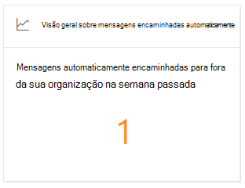
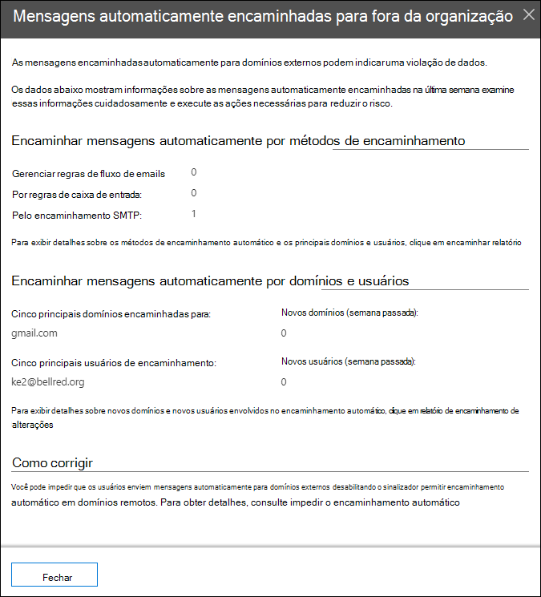

# Visão de mensagens encaminhadas automaticamente no Centro de Conformidade & Segurança

[!INCLUDE [Microsoft 365 Defender rebranding](../includes/microsoft-defender-for-office.md)]

**Aplica-se a**
- [Proteção do Exchange Online](exchange-online-protection-overview.md)
- [Plano 1 e plano 2 do Microsoft Defender para Office 365](defender-for-office-365.md)
- [Microsoft 365 Defender](../defender/microsoft-365-defender.md)

O & **insight** de mensagens  encaminhadas automaticamente no painel fluxo de emails no Centro de Conformidade e Segurança exibe informações sobre mensagens [que](https://protection.office.com) são encaminhadas automaticamente da sua organização para destinatários em domínios externos.

## Detalhes das mensagens encaminhadas automaticamente

Quando você clica no número de mensagens no widget, um painel de sub-texto é exibido que mostra mais informações sobre as mensagens encaminhadas automaticamente:

- **Mensagens encaminhadas automaticamente por meio de métodos de encaminhamento:**

  - **Por regras de fluxo de emails**
  - **Por regras de caixa de entrada**
  - **Por encaminhamento SMTP**: Este método indica o encaminhamento automático que os administradores podem configurar em uma caixa de correio, conforme descrito em [Configure email forwarding for a mailbox](/Exchange/recipients-in-exchange-online/manage-user-mailboxes/configure-email-forwarding).
  - Um link para o [relatório de encaminhamento](view-mail-flow-reports.md#forwarding-report) para obter mais detalhes.

- **Mensagens encaminhadas automaticamente por domínios e usuários:**

  - **Top 5 domínios encaminhados para**
  - **Novos domínios (semana passada)**
  - **Principais 5 usuários de encaminhamento**
  - **Novos usuários (semana passada)**
  - Um link para o [relatório de modificações de encaminhamento](mfi-new-users-forwarding-email.md#forwarding-modifications-report) para obter mais detalhes.

## Percepções

Duas percepções são geradas com base nos dados do relatório:

- [Novos usuários encaminhando emails](mfi-new-users-forwarding-email.md)
- [Novos domínios sendo encaminhados por email](mfi-new-domains-being-forwarded-email.md)

## Confira também

Para obter informações sobre outras informações no painel de fluxo de emails, consulte Informações de fluxo de email no Centro de Conformidade & [Segurança.](mail-flow-insights-v2.md)