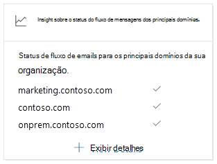

# Principais informações sobre o status do fluxo de emails do domínio no Centro de Conformidade e & SegurançaTop domain mail flow status insight in the Security & Compliance Center

[!INCLUDE [Microsoft 365 Defender rebranding](../includes/microsoft-defender-for-office.md)]

Os principais insights de status  **do** fluxo de emails do domínio no painel Fluxo de emails [no](https://protection.office.com) Centro de Conformidade e Segurança & o status atual do fluxo de emails da sua organização.The **Top domain mail flow status** insight in the [Mail flow dashboard](mail-flow-insights-v2.md) in the [Security & Compliance Center](https://protection.office.com) gives you the current mail flow status for your organization.

Esse insight ajuda a identificar e solucionar problemas de domínios que estão enfrentando \**_problemas de fluxo de_* emails.This insight helps you identify and troubleshoot domains that are experiencing \**_mail flow_* _ issues. Por exemplo, o domínio não pode receber emails externos porque o domínio expirou ou o domínio tem um registro MX incorreto.For example, the domain is unable to receive external email because the domain has expired or the domain has an incorrect MX record.

Quando você clica em _ *Exibir detalhes*\* no widget, um **flyout de status** do domínio é exibido, que mostra mais detalhes sobre o status de cada domínio:When you click _ *View details*\* in the widget, a **Domain status** flyout appears that shows you more details for the status of each domain:

- **Domínio****Domain**
- **Registro MX anterior****Previous MX record**
- **Registro MX atual****Current MX record**
- **Status de recebimento de email****Email receiving status**
- **Status** do domínio: uma marca de seleção verde indica que o registro MX atual (no momento em que você clicou no widget) corresponde ao valor que temos no registro, e o domínio recebeu emails durante as últimas duas horas.**Domain status**: A green check mark indicates the current MX record (at the time you clicked on the widget) matches the value we have on record, and the domain has received email during the past two hours.

  Um X vermelho indica que o registro MX foi alterado e que o domínio não recebeu emails durante as últimas seis horas.A red X indicates the MX record has been changed, and the domain has received no email during the past 6 hours. Isso provavelmente indica que seu domínio expirou ou que o registro MX foi atualizado incorretamente.This likely indicates that your domain has expired, or that the MX record has been incorrectly updated. Verifique com seu registrador de domínio ou serviço de hospedagem DNS para ver se o domínio expirou ou se o registro MX do domínio está incorreto.Check with your domain registrar or DNS hosting service to see if the domain has expired, or if the domain's MX record is incorrect.

Você pode clicar **em Exibir mais** para ver as mesmas informações para mais domínios.You can click **View more** to see the same information for more domains.

## Confira tambémSee also

Para obter informações sobre outros insights no painel de fluxo de emails, consulte Informações de fluxo de email no Centro de [Conformidade e & Segurança.](mail-flow-insights-v2.md)For information about other insights in the Mail flow dashboard, see [Mail flow insights in the Security & Compliance Center](mail-flow-insights-v2.md).
