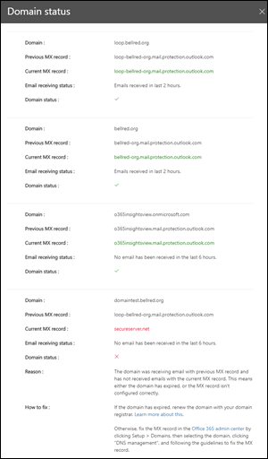

# Insight sobre o status do fluxo de mensagens dos principais domínios

A visão geral do **status do fluxo de email do domínio** oferece o status atual dos domínios da sua organização em termos de fluxo de emails. Essa percepção ajuda a identificar e solucionar problemas de domínios que estão enfrentando problemas de ***impacto de fluxo de emails*** (por exemplo, não é possível receber emails externos), especialmente expirações de domínio ou domínios com registros MX incorretos.

Quando você clica em **Exibir detalhes** na percepção, um submenu aparece mostrando mais detalhes para o status de cada domínio.

Uma marca de seleção verde para um domínio indica que o registro MX atual (quando você navegou para o painel de insights de fluxo de emails) corresponde ao valor que temos no registro e que o domínio recebeu emails durante as últimas duas horas.

Um x vermelho para um domínio indica que o registro MX foi alterado e que o domínio não recebeu nenhum email durante as últimas 6 horas. Isso provavelmente indica que o domínio expirou ou que o registro MX foi atualizado incorretamente. Verifique com o seu registrador de domínio ou serviço de hospedagem DNS para ver se o domínio expirou ou se o registro MX do domínio está incorreto.

## Confira também

Para obter mais informações sobre outros insights de fluxo de email no painel de fluxo de emails, consulte [Mail Flow insights no centro de conformidade de & de segurança](mail-flow-insights-v2.md).
