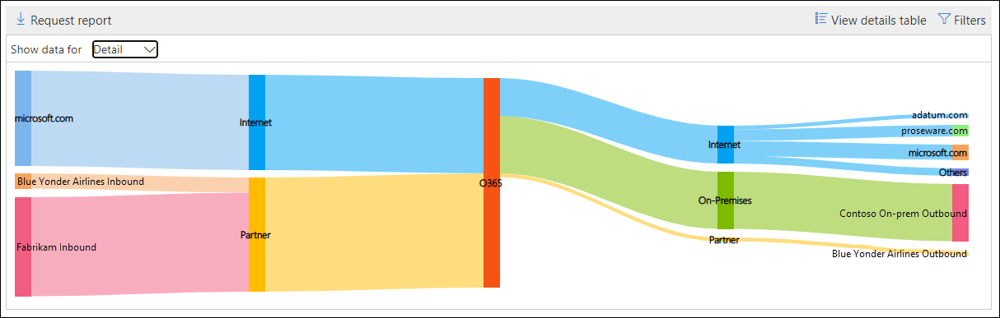

# Mapa de fluxo de emails no Centro de Conformidade & segurança

[!INCLUDE [Microsoft 365 Defender rebranding](../includes/microsoft-defender-for-office.md)]

**Aplica-se a**
- [Proteção do Exchange Online](exchange-online-protection-overview.md)
- [Plano 1 e plano 2 do Microsoft Defender para Office 365](office-365-atp.md)
- [Microsoft 365 Defender](../mtp/microsoft-threat-protection.md)

O **mapa de fluxo de** emails no painel [Fluxo](mail-flow-insights-v2.md) de emails no Centro de Conformidade e Segurança & [fornece](https://protection.office.com) informações sobre como os emails fluem pela sua organização. Você pode usar essas informações para aprender padrões, identificar anomalias e corrigir problemas à medida que eles ocorrem.

Por padrão, o widget mostra o padrão de fluxo de emails do dia anterior em um gráfico conhecido como *diagrama Sankey.* Você pode usar a seta para a esquerda e a seta para a direita para   diferentes. Cada cor diferente representa o fluxo de emails em um conector de entrada ou de saída diferente (ou sem usar conectores). Se você passar o mouse sobre uma cor específica, o número de mensagens será exibido para esse tipo de conector.

## Exibição de relatório para o mapa de fluxo de emails

Clicar no widget mapa de **fluxo de** emails levará você para o relatório de mapa de **fluxo de** email.

Os gráficos a seguir estão disponíveis na exibição de relatório:

- **Mostrar dados para: Visão geral:** é basicamente uma exibição maior do widget. Se você passar o mouse sobre uma cor específica, o número de mensagens será exibido para esse tipo de conector.

  

- **Mostrar dados para: Detalhe:** esta exibição mostra detalhes sobre os conectores e domínios de destino. Os principais domínios de remetentes e destinatários são listados, e o restante é colocado em **Outros.** Se você passar o mouse sobre uma cor e uma seção específicas, o número de mensagens será exibido.

  

Se você clicar em **Filtros** em uma exibição de relatório, poderá especificar um intervalo de datas com data **de** início **e data de término.**

Para enviar o relatório por email para um intervalo de datas específico para um ou mais destinatários, clique em **Solicitar download.**

Informações relacionadas são mostradas abaixo do mapa de fluxo de email se elas estão disponíveis (por exemplo, o insight de correção de [possível loop de email).](mfi-mail-loop-insight.md)

## Details table view for the Mail flow map

Se você clicar em **Exibir tabela de detalhes** em uma exibição de relatório, as seguintes informações serão mostradas:

- **Date**
- **Categoria**
- **Conector/Provedor de serviços de terceiros**
- **Domínio remetente/destinatário**
- **Contagem de mensagem**

Se você clicar em **Filtros** em uma exibição de tabela de detalhes, poderá especificar um intervalo de datas com data de **início** **e data de término.**

Se você selecionar uma linha, detalhes semelhantes serão mostrados em um flyout:

Para enviar o relatório por email para um intervalo de datas específico para um ou mais destinatários, clique em **Solicitar download.**

Para voltar para a exibição de relatórios, clique em **Exibir relatório.**

## Confira também

Para obter informações sobre outros insights no painel de fluxo de emails, consulte Informações de fluxo de email no Centro de [Conformidade e & Segurança.](mail-flow-insights-v2.md)
