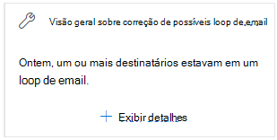

# Correção de possíveis informações de loop de email no centro de conformidade e segurança &Fix possible mail loop insight in the Security & Compliance Center

Um loop de email é ruim porque ele desperdiça recursos do sistema, consome a cota de volume de emails da sua organização e envia notificações confusas de falha na entrega (também conhecidas como NDRs ou mensagens de devolução) para os remetentes originais.A mail loop is bad because it wastes system resources, consumes your organization's mail volume quota, and sends confusing non-delivery reports (also known as NDRs or bounce messages) to the original senders.

A **correção de possíveis loops de email** na área **recomendada para você** do [painel de fluxo de emails](mail-flow-insights-v2.md) no [centro de segurança & conformidade](https://protection.office.com) avisa quando um loop de email é detectado em sua organização.The **Fix possible mail loop** insight in the **Recommended for you** area of the [Mail flow dashboard](mail-flow-insights-v2.md) in the [Security & Compliance Center](https://protection.office.com) notifies you when a mail loop is detected in your organization. Essa percepção aparece apenas após a condição ser detectada (se você não tiver loops de email, não verá a percepção).This insight appears only after the condition is detected (if you don't have any mail loops, you won't see the insight).

Quando você clica em **Exibir detalhes** no widget, um submenu aparece com mais informações:When you click **View details** on the widget, a flyout appears with more information:

- **Domínio****Domain**
- **Número de mensagens**: você pode clicar em **Exibir exemplos de mensagens** para ver os resultados do [rastreamento](message-trace-scc.md) de mensagens para um exemplo das mensagens que foram afetadas pelo loop.**Number of messages**: You can click **View sample messages** to see the [message trace](message-trace-scc.md) results for a sample of the messages that were affected by the loop.
- **Tipo de domínio**"por exemplo, autoritativo ou não autoritativo.**Domain type**" For example, Authoritative or Non-authoritative.
- **Registro MX**: o host (**servidor de email**) e os valores de **prioridade** do registro MX do domínio.**MX record**: The host (**Mail server**) and **Priority** values of the MX record for the domain.
- **Motivo do loop** e **como corrigir**: tentaremos identificar os cenários de loop de email mais comuns e fornecer as ações recomendadas (se disponível) para corrigir o loop.**Loop reason** and **How to fix**: We'll try to identify the most common mail loop scenarios and provide the recommended actions (if available) to fix the loop.

## Tópicos relacionadosRelated topics

Para obter informações sobre outras ideias no painel de fluxo de emails, consulte [Mail Flow insights no centro de conformidade de & de segurança](mail-flow-insights-v2.md).For information about other insights in the Mail flow dashboard, see [Mail flow insights in the Security & Compliance Center](mail-flow-insights-v2.md).
