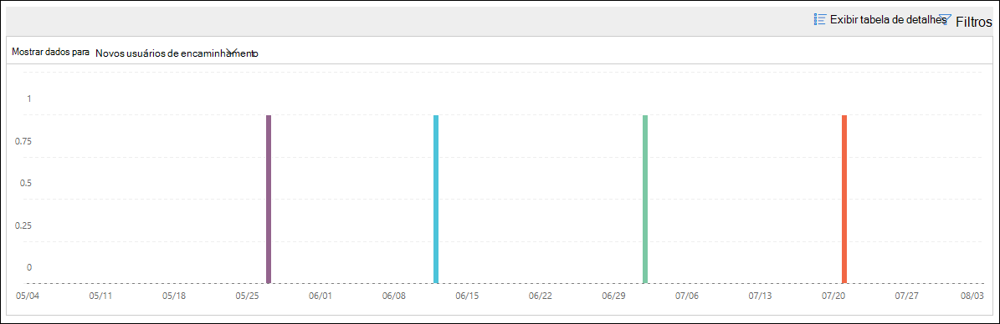

# Novos usuários encaminhando informações de email no centro de conformidade e segurança &New users forwarding email insight in the Security & Compliance Center

[!INCLUDE [Microsoft 365 Defender rebranding](../includes/microsoft-defender-for-office.md)]

É suspeito quando novas contas de usuário em sua organização começam a encaminhar mensagens de email para domínios externos de repente.It's suspicious when new user accounts in your organization suddenly start forwarding email messages to external domains.

Os **novos domínios que estão sendo encaminhados** informações de email no [centro de conformidade e segurança &](https://protection.office.com) notifica você quando os usuários recém-criados em sua organização estão encaminhando mensagens para domínios externos.The **New domains being forwarded email** insight in the [Security & Compliance Center](https://protection.office.com) notifies you when newly-created users in your organization are forwarding messages to external domains. Essa condição pode indicar que contas de administrador comprometidas foram usadas para criar novos usuários.This condition could indicate compromised admin accounts were used to create the new users. Se você suspeitar que as contas foram comprometidas, confira [responder a uma conta de email comprometida](responding-to-a-compromised-email-account.md).If you suspect the accounts have been compromised, see [Responding to a compromised email account](responding-to-a-compromised-email-account.md).

Essa percepção aparece somente quando o problema é detectado e aparece na página de [relatório de encaminhamento](view-mail-flow-reports.md#forwarding-report) .This insight appears only when the issue is detected, and it appears on the [Forwarding report](view-mail-flow-reports.md#forwarding-report) page.

Quando você clica no widget, um submenu aparece onde você pode encontrar mais detalhes sobre as mensagens encaminhadas, incluindo um link para o [relatório de alterações de encaminhamento](#forwarding-modifications-report) , conforme descrito posteriormente neste artigo.When you click on the widget, a flyout appears where you can find more details about the forwarded messages, including a link to the [Forwarding modifications report](#forwarding-modifications-report) as described later in this article.

Você também pode acessar essa página de detalhes ao selecionar a percepção depois de clicar em **Exibir tudo** na área de **recomendações de & principais** em (painel de **relatórios** \>  ou <https://protection.office.com/insightdashboard> ).You can also get to this details page when you select the insight after you click **View all** in the **Top insights & recommendations** area on (**Reports** \> **Dashboard** or <https://protection.office.com/insightdashboard>).

Você pode clicar no link **Confira o relatório associado com a percepção** para acessar o **relatório de alterações de encaminhamento** conforme descrito na próxima seção.You can click the **See report associated with insight** link to go to the **Forwarding modifications report** as described in the next section.

## Relatório de reencaminhamento de modificaçõesForwarding modifications report

O **relatório de alterações de encaminhamento** mostra detalhes sobre as mensagens que estão sendo encaminhadas automaticamente de remetentes em sua organização:The **Forwarding modifications report** shows details about messages that are being automatically forwarded from senders in your organization:

- Contas recém-criadas que estão encaminhando mensagens para domínios externos.Newly-created accounts that are forwarding messages to external domains.
- As contas que estão encaminhando mensagens para domínios externos que nunca foram encaminhadas para outros remetentes em sua organização.Accounts that are forwarding messages to external domains that have never been forwarded to by other senders in your organization.

Esses tipos de mensagens encaminhadas podem representar um risco de segurança ou de conformidade e podem indicar contas comprometidas.These types of forwarded messages can pose a security or compliance risk, and might indicate compromised accounts.

O relatório contém dados de até 90 dias.The report contains data for up to 90 days. Por padrão, o relatório mostra os dados dos últimos 7 dias.By default, the report shows data for the last 7 days.

Este relatório não está disponível diretamente no [painel de fluxo de emails](mail-flow-insights-v2.md) ou no [painel relatórios](view-mail-flow-reports.md).This report isn't directly available in the [Mail flow dashboard](mail-flow-insights-v2.md) or in the [Reports dashboard](view-mail-flow-reports.md). Além de clicar no link **Ver relatório associado com a percepção** no **envio de emails de encaminhamento de novos usuários** , você recebe o relatório por:In addition to clicking the **See report associated with insight** link in the **New users forwarding email** insight, you get to the report by:

- Clicando no link de **relatório de notificações de encaminhamento** , nos detalhes dos [novos domínios que estão sendo encaminhados informações de email](mfi-new-domains-being-forwarded-email.md).Clicking the **Forwarding notifications report** link in the details of the [New domains being forwarded email insight](mfi-new-domains-being-forwarded-email.md).
- Abrir <https://protection.office.com/reportv2?id=MailFlowNewForwarding> .Opening <https://protection.office.com/reportv2?id=MailFlowNewForwarding>.

### Exibição de relatório para o relatório de alterações de encaminhamentoReport view for the Forwarding modifications report

Os gráficos a seguir estão disponíveis no modo de exibição de relatório:The following charts are available in the report view:

- **Mostrar dados de: novos usuários de encaminhamento**:**Show data for: New forwarding users**:

  

- **Mostrar dados para: novos domínios de encaminhamento**:**Show data for: New forwarding domains**:

  

Se você clicar em **filtros** em um modo de exibição de relatório, poderá especificar um intervalo de datas com **data de início** e data de **término**.If you click **Filters** in a report view, you can specify a date range with **Start date** and **End date**.

### Exibição da tabela de detalhes para o relatório de alterações de encaminhamentoDetails table view for the Forwarding modifications report

Se você clicar em **Exibir tabela de detalhes**, as informações mostradas dependem do gráfico que você estava observando:If you click **View details table**, the information that's shown depends on the chart you were looking at:

- **Mostrar dados de: novos usuários de encaminhamento**:**Show data for: New forwarding users**:

  - **Name**: o endereço de email do remetente.**Name**: The email address of the sender.
  - **Tipo de encaminhamento****Forwarding type**
  - **Endereço do destinatário****Recipient address**
  - **Detalhes****Details**
  - **Count****Count**
  - **Primeira data de encaminhamento****First forward date**

- **Mostrar dados para: novos domínios de encaminhamento**:**Show data for: New forwarding domains**:

  - **Name**: o domínio de email do remetente.**Name**: The email domain of the sender.
  - **Tipo de encaminhamento****Forwarding type**
  - **Endereço do destinatário****Recipient address**
  - **Detalhes****Details**
  - **Count****Count**
  - **Primeira data de encaminhamento****First forward date**

Se você clicar em **filtros** em um modo de exibição de tabela detalhes, poderá especificar um intervalo de datas com **data de início** e data de **término**.If you click **Filters** in a details table view, you can specify a date range with **Start date** and **End date**.

Se você selecionar uma linha da tabela, um submenu de **detalhes** aparecerá com as seguintes informações:If you select a row from the table, a **Details** flyout appears with the following information:

- **Nome**: Este é o endereço de email do remetente (da exibição **Mostrar dados para: novos usuários de encaminhamento** ) ou o domínio de email do remetente (do **Mostrar dados para: novo** modo de exibição de domínios de encaminhamento).**Name**: This is either the sender's email address (from **Show data for: New forwarding users** view) or the sender's email domain (from **Show data for: New forwarding domains** view).
- **Tipo de encaminhamento****Forwarding type**
- **Recipiente****Recipient**
- **Detalhes****Details**
- **Count****Count**
- **Data de início****Start date**
- **Recomendação**: aqui, você pode clicar no link para gerenciar o usuário no centro de administração do Microsoft 365.**Recommendation**: From here, you can click the link to manage the user in the Microsoft 365 admin center.

Para voltar para o modo de exibição relatórios, clique em **Exibir relatório**.To go back to the reports view, click **View report**.

## Tópicos relacionadosRelated topics

Para obter informações sobre outras ideias no painel de fluxo de emails, consulte [Mail Flow insights no centro de conformidade de & de segurança](mail-flow-insights-v2.md).For information about other insights in the Mail flow dashboard, see [Mail flow insights in the Security & Compliance Center](mail-flow-insights-v2.md).
