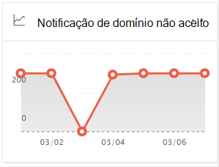
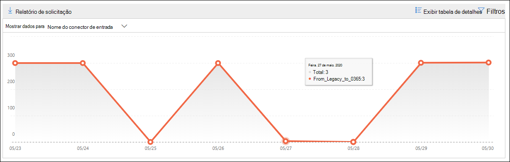

# Relatório de domínio não aceito no Centro de Conformidade e Segurança & segurançaNon-accepted domain report in the Security & Compliance Center

[!INCLUDE [Microsoft 365 Defender rebranding](../includes/microsoft-defender-for-office.md)]

**Aplica-se a****Applies to**
- [Proteção do Exchange OnlineExchange Online Protection](https://go.microsoft.com/fwlink/?linkid=2148611)
- [Microsoft Defender para Office 365 plano 1 e plano 2Microsoft Defender for Office 365 plan 1 and plan 2](https://go.microsoft.com/fwlink/?linkid=2148715)
- [Microsoft 365 DefenderMicrosoft 365 Defender](https://go.microsoft.com/fwlink/?linkid=2118804)

O  relatório de domínio não  aceito no painel Fluxo de emails no Centro de Conformidade e Segurança exibe informações sobre mensagens de sua organização de email local onde o domínio do remetente não está configurado como um domínio aceito em sua organização do Microsoft 365. [&](https://protection.office.com)The **Non-accepted domain** report in the [Mail flow dashboard](mail-flow-insights-v2.md) in the [Security & Compliance Center](https://protection.office.com) displays information about messages from your on-premises email organization where the sender's domain isn't configured as an accepted domain in your Microsoft 365 organization.

O Microsoft 365 pode acelerar essas mensagens se temos dados para provar que a intenção dessas mensagens é mal-intencionada.Microsoft 365 might throttle these messages if we have data to prove that the intent of these messages is malicious. Portanto, é importante que você entenda o que está acontecendo e corrige o problema.Therefore, it's important for you to understand what's happening and to fix the issue.

## Exibição de relatório para o relatório de domínio não aceitoReport view for the Non-accepted domain report

Clicar no gráfico no widget **de** domínio não aceito levará você ao relatório **de domínio não aceito.**Clicking the chart on the **Non-accepted domain** widget will take you to the **Non-accepted domain** report.

Por padrão, a atividade de todos os conectores afetados é mostrada.By default, the activity for all affected connectors is shown. Se você clicar **em Mostrar dados** para , você pode selecionar um conector específico na lista suspenso.If you click **Show data for**, you can select a specific connector from the dropdown.

Se você passar o mouse sobre um ponto de dados (dia) no gráfico, verá o número total de mensagens para o conector.If you hover over a data point (day) in the chart, you'll see the total number of messages for the connector.

## Exibição de tabela de detalhes para o relatório de domínio não aceitoDetails table view for the Non-accepted domain report

Se você clicar em **Exibir tabela de detalhes** em uma exibição de relatório, as seguintes informações serão mostradas:If you click **View details table** in a report view, the following information is shown:

- **Date****Date**
- **Nome do conector de entrada****Inbound connector name**
- **Domínio do remetente****Sender domain**
- **Contagem de mensagem****Message count**
- **Mensagens de** exemplo: as IDs de mensagem de uma amostra de mensagens afetadas.**Sample messages**: The message IDs of a sample of affected messages.

Se você clicar em **Filtros** em uma exibição de tabela de detalhes, poderá especificar um intervalo de datas com data **de** início **e data de término.**If you click **Filters** in a details table view, you can specify a date range with **Start date** and **End date**.

Para enviar o relatório por email para um intervalo de datas específico para um ou mais destinatários, clique em **Solicitar download.**To email the report for a specific date range to one or more recipients, click **Request download**.

Quando você seleciona uma linha na tabela, um flyout é exibido com as seguintes informações:When you select a row in the table, a flyout appears with the following information:

- **Date****Date**
- **Nome do conector de entrada****Inbound connector name**
- **Domínio do remetente****Sender domain**
- **Contagem de mensagem****Message count**
- **Exemplos de** mensagens: você pode clicar **em Exibir mensagens de exemplo** para ver os resultados [do](message-trace-scc.md) rastreamento de mensagens para uma amostra das mensagens afetadas.**Sample messages**: You can click **View sample messages** to see the [message trace](message-trace-scc.md) results for a sample of the affected messages.

Para voltar para a exibição de relatórios, clique em **Exibir relatório.**To go back to the reports view, click **View report**.

## Tópicos relacionadosRelated topics

Para obter informações sobre outros insights no painel de fluxo de emails, consulte Informações sobre o fluxo de emails no Centro de [Conformidade e & Segurança.](mail-flow-insights-v2.md)For information about other insights in the Mail flow dashboard, see [Mail flow insights in the Security & Compliance Center](mail-flow-insights-v2.md).
