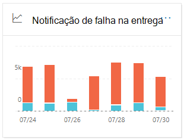
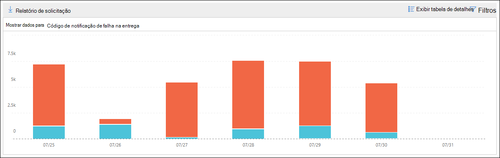

# Notificação de falha na entrega no centro de conformidade e segurança &

A notificação de falha na **entrega** no [painel de fluxo de emails](mail-flow-insights-v2.md) no centro de conformidade de & de segurança mostra os códigos de erro mais encontrados em notificações de falha na entrega (também conhecidos como NDRs ou mensagens de devolução) para os usuários da sua organização. Este relatório mostra os detalhes dos NDRs para que você possa solucionar problemas de entrega de email.

## Exibição de relatório para a notificação de falha na entrega

Ao clicar no widget notificação de falha na **entrega** , você será direcionado para o relatório de falha na **entrega**.

Por padrão, a atividade de todos os códigos de erro é mostrada. Se você clicar em **Mostrar dados para**, poderá selecionar um código de erro específico na lista suspensa.

Se você passar o mouse sobre uma cor específica (código de erro) em um dia específico no gráfico, verá o número total de mensagens para o erro.

## Exibição da tabela de detalhes para a notificação de falha na entrega

Se você clicar em **Exibir tabela de detalhes** em um modo de exibição de relatório, as seguintes informações serão exibidas:

- **Date**
- **Código de notificação de falha na entrega**
- **Count**
- **Mensagens de exemplo**: as IDs de mensagem de uma amostra de mensagens afetadas.

Se você clicar em **filtros** em um modo de exibição de tabela detalhes, poderá especificar um intervalo de datas com **data de início** e data de **término**.

Para enviar por email o relatório para um intervalo de datas específico para um ou mais destinatários, clique em **solicitar download**.

Quando você seleciona uma linha na tabela, um submenu aparece com as seguintes informações:

- **Date**
- **Código**de notificação de falha na entrega: você pode clicar no link para encontrar mais informações sobre as causas e soluções para o código de erro específico.
- **Count**
- **Exemplos de mensagens**: você pode clicar em **Exibir mensagens de amostra** para ver os resultados de [rastreamento](message-trace-scc.md) de mensagens para um exemplo de mensagens afetadas.

## Tópicos relacionados

Para obter informações sobre outras ideias no painel de fluxo de emails, consulte [Mail Flow insights no centro de conformidade de & de segurança](mail-flow-insights-v2.md).
