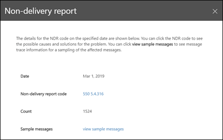

# Relatório de falha na entrega no Centro de Conformidade & segurançaNon-delivery report in the Security & Compliance Center

[!INCLUDE [Microsoft 365 Defender rebranding](../includes/microsoft-defender-for-office.md)]

**Aplica-se a****Applies to**
- [Proteção do Exchange OnlineExchange Online Protection](https://go.microsoft.com/fwlink/?linkid=2148611)
- [Microsoft Defender para Office 365 plano 1 e plano 2Microsoft Defender for Office 365 plan 1 and plan 2](https://go.microsoft.com/fwlink/?linkid=2148715)
- [Microsoft 365 DefenderMicrosoft 365 Defender](https://go.microsoft.com/fwlink/?linkid=2118804)

O  relatório de falha  na entrega no painel fluxo de emails no Centro de Conformidade e Segurança mostra os códigos de erro mais encontrados em notificações de falha na entrega (também conhecidas como NDRs ou mensagens de rejeição) para usuários em sua organização. [&](https://protection.office.com)The **Non-delivery report** in the [Mail flow dashboard](mail-flow-insights-v2.md) in the [Security & Compliance Center](https://protection.office.com) shows the most-encountered error codes in non-delivery reports (also known as NDRs or bounce messages) for users in your organization. Este relatório mostra os detalhes das NDRs para que você possa solucionar problemas de entrega de email.This report shows the details of NDRs so you can troubleshoot email delivery problems.

## Exibição de relatório para o relatório de não entregaReport view for the Non-delivery report

Clicar no widget de **relatório de não** entrega levará você ao relatório de não **entrega.**Clicking on the **Non-delivery report** widget will take you to the **Non-delivery report**.

Por padrão, a atividade de todos os códigos de erro é mostrada.By default, the activity for all error codes is shown. Se você clicar **em Mostrar dados** para , você pode selecionar um código de erro específico na lista suspenso.If you click **Show data for**, you can select a specific error code from the dropdown.

Se você passar o mouse sobre uma cor específica (código de erro) em um dia específico no gráfico, verá o número total de mensagens do erro.If you hover over a specific color (error code) on a specific day in the chart, you'll see the total number of messages for the error.

## Exibição de tabela de detalhes para o relatório de não entregaDetails table view for the Non-delivery report

Se você clicar em **Exibir tabela de detalhes** em uma exibição de relatório, as seguintes informações serão mostradas:If you click **View details table** in a report view, the following information is shown:

- **Date****Date**
- **Código do relatório de não entrega****Non-delivery report code**
- **Count****Count**
- **Mensagens de** exemplo: as IDs de mensagem de uma amostra de mensagens afetadas.**Sample messages**: The message IDs of a sample of affected messages.

Se você clicar em **Filtros** em uma exibição de tabela de detalhes, poderá especificar um intervalo de datas com data de **início** **e data de término.**If you click **Filters** in a details table view, you can specify a date range with **Start date** and **End date**.

Para enviar o relatório por email para um intervalo de datas específico para um ou mais destinatários, clique em **Solicitar download.**To email the report for a specific date range to one or more recipients, click **Request download**.

Quando você seleciona uma linha na tabela, um flyout é exibido com as seguintes informações:When you select a row in the table, a flyout appears with the following information:

- **Date****Date**
- **Código do relatório de falha** na entrega: você pode clicar no link para encontrar mais informações sobre as causas e soluções para o código de erro específico.**Non-delivery report code**: You can click on the link to find for more information about the causes and solutions for the specific error code.
- **Count****Count**
- **Exemplos de** mensagens: você pode clicar **em Exibir mensagens de exemplo** para ver os resultados do rastreamento de mensagens para um exemplo das mensagens afetadas. **Sample messages**: You can click **View sample messages** to see the [message trace](message-trace-scc.md) results for a sample of the affected messages.

## Tópicos relacionadosRelated topics

Para obter informações sobre outros insights no painel de fluxo de emails, consulte Informações de fluxo de email no Centro de [Conformidade e & Segurança.](mail-flow-insights-v2.md)For information about other insights in the Mail flow dashboard, see [Mail flow insights in the Security & Compliance Center](mail-flow-insights-v2.md).
