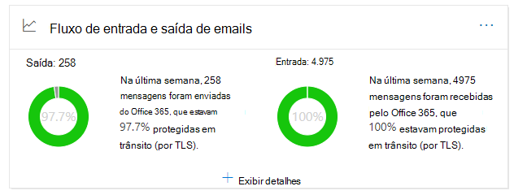
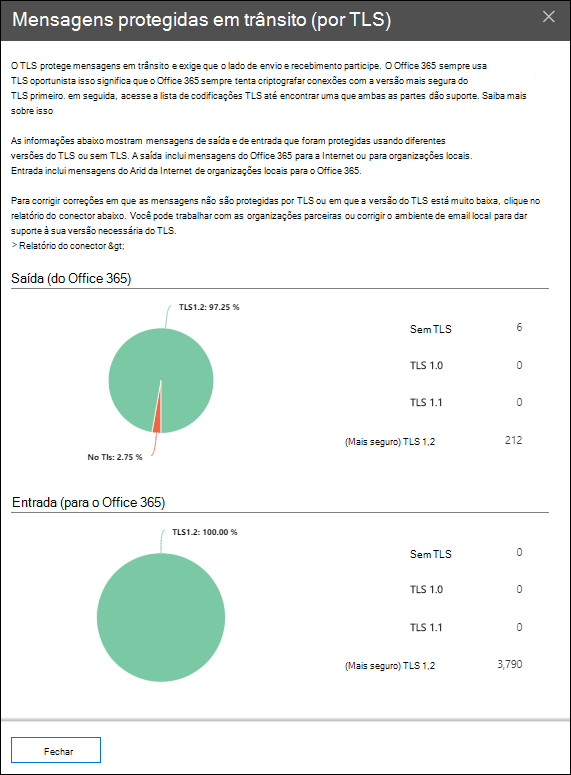

# Percepção de fluxo de email de entrada e de saída no centro de conformidade e segurança &Outbound and inbound mail flow insight in the Security & Compliance Center

[!INCLUDE [Microsoft 365 Defender rebranding](../includes/microsoft-defender-for-office.md)]

A percepção de **fluxo de email de entrada e de saída** no painel de fluxo de [emails](mail-flow-insights-v2.md) no [centro de conformidade e segurança &](https://protection.office.com) combina as informações do [relatório de conector](view-mail-flow-reports.md#connector-report) e o **relatório de visão geral de TLS** anterior em um só lugar.The **Outbound and inbound mail flow** insight in the [Mail flow dashboard](mail-flow-insights-v2.md) in the [Security & Compliance Center](https://protection.office.com) combines the information from the [Connector report](view-mail-flow-reports.md#connector-report) and the former **TLS overview report** in one place.

O widget exibe a criptografia TLS que é usada para a conexão quando as mensagens são entregues na sua organização.The widget displays the TLS encryption that's used for the connection when messages are delivered to and from your organization. As conexões estabelecidas com outros serviços de email são criptografadas por TLS quando o TLS é oferecido por ambos os lados.The connections that are established with other email services are encrypted by TLS when TLS is offered by both sides. O widget oferece um instantâneo da última semana de fluxo de emails.The widget offers a snapshot of the last week of mail flow.

As informações no widget estão relacionadas a conectores e proteção de mensagem TLS no Microsoft 365.The information in the widget is related to connectors and TLS message protection in Microsoft 365. Para obter mais informações, consulte estes tópicos:For more information, see these topics:

- [Configurar o fluxo de email usando conectoresConfigure mail flow using connectors](https://docs.microsoft.com/exchange/mail-flow-best-practices/use-connectors-to-configure-mail-flow/use-connectors-to-configure-mail-flow)
- [Como o Exchange Online usa o TLS para proteger conexões de emailHow Exchange Online uses TLS to secure email connections](https://docs.microsoft.com/microsoft-365/compliance/exchange-online-uses-tls-to-secure-email-connections)
- [Detalhes técnicos de referência sobre criptografia no Microsoft 365Technical reference details about encryption in Microsoft 365](https://docs.microsoft.com/microsoft-365/compliance/technical-reference-details-about-encryption)

## Mensagem protegida em trânsito (por TLS)Message protected in transit (by TLS)

Quando você clica em **Exibir detalhes** no widget, o submenu **mensagem protegido em trânsito (por TLS)** mostra a proteção TLS para mensagens que entram e saem da sua organização.When you click **View Details** on the widget, the **Message protected in transit (by TLS)** flyout shows you the TLS protection for messages entering and leaving your organization.

Atualmente, o TLS 1,2 é a versão mais segura do TLS oferecida pela Microsoft 365.Currently, TLS 1.2 is the most secure version of TLS that's offered by Microsoft 365. Muitas vezes, você precisará saber a criptografia TLS que está sendo usada para auditorias de conformidade.Often, you'll need to know the TLS encryption that's being used for compliance audits. Provavelmente você não tem uma relação direta com a maioria dos servidores de email de origem e de destino (você não é proprietário deles, e nenhuma da Microsoft), portanto, você não tem muitas opções para melhorar a criptografia TLS usada por esses servidores.You probably don't have a direct relationship with most of the source and destination email servers (you don't own them, and neither does Microsoft), so you don't have many options to improve the TLS encryption that's used by those servers.

No entanto, você pode usar [conectores](https://docs.microsoft.com/exchange/mail-flow-best-practices/use-connectors-to-configure-mail-flow/use-connectors-to-configure-mail-flow) para garantir a melhor proteção TLS disponível para mensagens enviadas entre seus servidores de email e o Microsoft 365.But, you can use [connectors](https://docs.microsoft.com/exchange/mail-flow-best-practices/use-connectors-to-configure-mail-flow/use-connectors-to-configure-mail-flow) to ensure the best available TLS protection for messages that are sent between your email servers and Microsoft 365. O fluxo de email entre o Microsoft 365 e seus próprios servidores de email ou servidores que pertencem a seus parceiros é freqüentemente mais importante e confidencial do que as mensagens normais, portanto, você deve aplicar segurança e vigilância extra a essas mensagens.Mail flow between Microsoft 365 and your own email servers or servers that belong to your partners is often more important and sensitive than regular messages, so you'll want to apply extra security and vigilance to those messages.

Você pode atualizar ou corrigir seus próprios servidores de email para melhorar a criptografia TLS que está sendo usada ou acessar seus parceiros para fazer o mesmo.You can upgrade or fix your own email servers to improve the TLS encryption that's being used, or reach out to your partners to do the same. O **relatório do conector** exibe o volume de fluxo de emails e a criptografia TLS para mensagens que usam seus conectores do Microsoft 365.The **Connector Report** displays both mail flow volume and TLS encryption for messages that use your Microsoft 365 connectors.

Você pode clicar no link de **relatório do conector** para ir para o [relatório do conector](view-mail-flow-reports.md#connector-report).You can click the **Connector report** link to go to the [Connector report](view-mail-flow-reports.md#connector-report). Os seguintes insights podem estar disponíveis na página de **relatório do conector** se a condição associada tiver sido detectada:The following insights might be available on the **Connector report** page if the associated condition has been detected:

- **Conector de parceiro de entrada que enxerga o fluxo de emails TLS 1.0 significativo****Inbound Partner connector seeing significant TLS1.0 mail flow**
- **Conector local de entrada que enxerga o fluxo de emails do TLS 1.0 significativo****Inbound OnPremises connector seeing significant TLS1.0 mail flow**

Para conexões TLS 1,0, você realmente precisa obter o servidor de email ou o servidor de seu parceiro atualizado ou corrigido para evitar qualquer problema quando o suporte a TLS 1,0 for eventualmente preterido no Microsoft 365.For TLS 1.0 connections, you really need to get your email server or your partner's server upgraded or fixed to avoid any issues when TLS 1.0 support is eventually deprecated in Microsoft 365.

## Confira tambémSee also

Para obter informações sobre outras ideias no painel de fluxo de emails, consulte [Mail Flow insights no centro de conformidade de & de segurança](mail-flow-insights-v2.md).For information about other insights in the Mail flow dashboard, see [Mail flow insights in the Security & Compliance Center](mail-flow-insights-v2.md).
