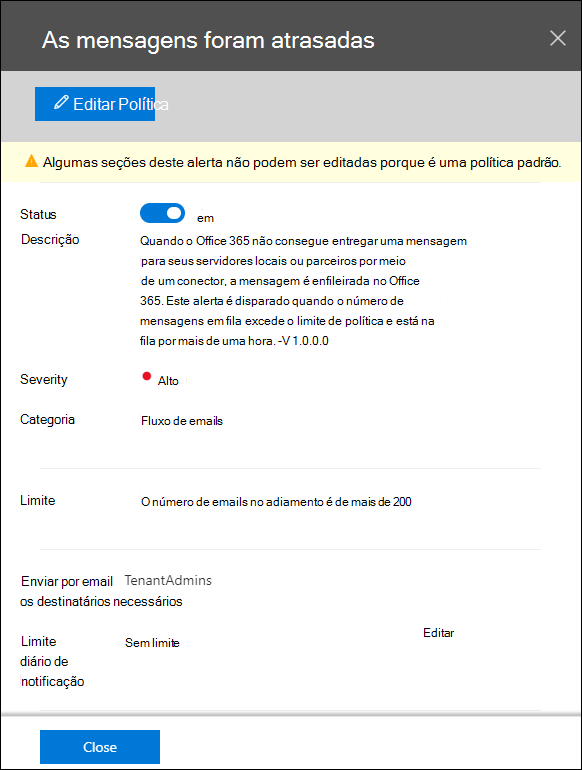
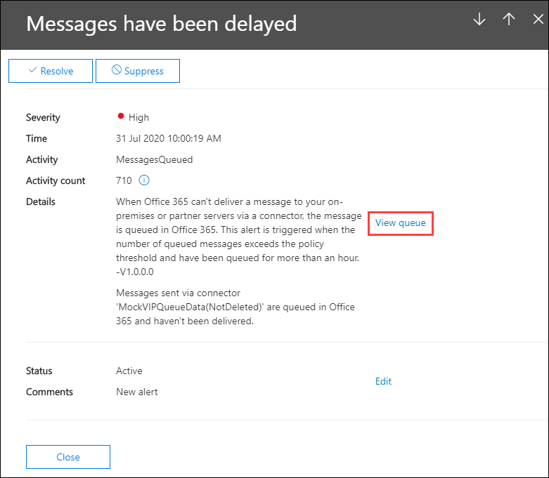

# Informações sobre filas no Centro de Conformidade & segurançaQueues insight in the Security & Compliance Center

[!INCLUDE [Microsoft 365 Defender rebranding](../includes/microsoft-defender-for-office.md)]

**Aplica-se a****Applies to**
- [Proteção do Exchange OnlineExchange Online Protection](https://go.microsoft.com/fwlink/?linkid=2148611)
- [Microsoft Defender para Office 365 plano 1 e plano 2Microsoft Defender for Office 365 plan 1 and plan 2](https://go.microsoft.com/fwlink/?linkid=2148715)
- [Microsoft 365 DefenderMicrosoft 365 Defender](https://go.microsoft.com/fwlink/?linkid=2118804)

Quando as mensagens não puderem ser enviadas de sua organização para seus servidores de email locais ou parceiros usando conectores, as mensagens serão en filas no Microsoft 365.When messages can't be sent from your organization to your on-premises or partner email servers using connectors, the messages are queued in Microsoft 365. Exemplos comuns que causam essa condição são:Common examples that cause this condition are:

- O conector está configurado incorretamente.The connector is incorrectly configured.
- Houve alterações de rede ou firewall em seu ambiente local.There have been networking or firewall changes in your on-premises environment.

O Microsoft 365 continuará tentando fazer a entrega por 24 horas.Microsoft 365 will continue to retry to delivery for 24 hours. Após 24 horas, as mensagens expiram e serão devolvidas aos rementes em notificações de não entrega (também conhecidas como NDRs ou mensagens de rejeição).After 24 hours, the messages will expire and will be returned to the senders in non-delivery reports (also known as a NDRs or bounce messages).

Se o volume de email na fila exceder o limite predefinido (o valor padrão é 200 mensagens), as informações estarão disponíveis nos seguintes locais:If the queued email volume exceeds the pre-defined threshold (the default value is 200 messages), the information is available in the following locations:

- O **insight de filas** no [painel de fluxo de](mail-flow-insights-v2.md) emails no Centro de conformidade & [segurança.](https://protection.office.com)The **Queues** insight in the [Mail flow dashboard](mail-flow-insights-v2.md) in the [Security & Compliance Center](https://protection.office.com). Para obter mais informações, consulte o [insight filas na seção painel](#queues-insight-in-the-mail-flow-dashboard) de fluxo de email neste artigo.For more information, see the [Queues insight in the Mail flow dashboard](#queues-insight-in-the-mail-flow-dashboard) section in this article.

- Um alerta é exibido em **Alertas** recentes do painel Alertas no Centro de Conformidade e Segurança [&](https://protection.office.com) ( Painel de **Alertas** \>  ou <https://protection.office.com/alertsdashboard> ).An alert is displayed in **Recent alerts** the Alerts dashboard in the [Security & Compliance Center](https://protection.office.com) (**Alerts** \> **Dashboard** or <https://protection.office.com/alertsdashboard>).

  

- Os administradores receberão uma notificação por email com base na configuração da política de alerta padrão chamada **Mensagens que foram adiadas.**Admins will receive an email notification based on the configuration of the default alert policy named **Messages have been delayed**. Para definir as configurações de notificação para esse alerta, consulte a próxima seção.To configure the notification settings for this alert, see the next section.

  Para obter mais informações sobre políticas de alerta, consulte [Políticas de alerta no Centro de Conformidade e & Segurança.](../../compliance/alert-policies.md)For more information about alert policies, see [Alert policies in the Security & Compliance Center](../../compliance/alert-policies.md).

## Personalizar alertas de filaCustomize queue alerts

1. In the [Security & Compliance Center](https://protection.office.com), go to **Alerts** \> **Alert policies** or open <https://protection.office.com/alertpolicies> .In the [Security & Compliance Center](https://protection.office.com), go to **Alerts** \> **Alert policies** or open <https://protection.office.com/alertpolicies>.

2. Na página **Políticas de alerta,** encontre e selecione a política chamada **Mensagens que foram atrasadas.**On the **Alert policies** page, find and select the policy named **Messages have been delayed**.

3. Na mensagem **que foi adiada, você** pode ativar ou desativar o alerta e definir as configurações de notificação.In the **Message have been delayed** flyout that opens, you can turn the alert on or off and configure the notification settings.

   

   - **Status:** você pode a adoção ou re alternância do alerta.**Status**: You can toggle the alert on or off.

   - **Destinatários de email** e **limite de notificação diária:** clique **em Editar** para definir as seguintes configurações:**Email recipients** and **Daily notification limit**: Click **Edit** to configure the following settings:

4. Para definir as configurações de notificação, clique em **Editar.**To configure the notification settings, click **Edit**. No menu **Editar política** exibido, de configure as seguintes configurações:In the **Edit policy** flyout that appears, configure the following settings:

   - **Enviar notificações por email:** o valor padrão está on.**Send email notifications**: The default value is on.
   - **Destinatários de email:** o valor padrão é **TenantAdmins**.**Email recipients**: The default value is **TenantAdmins**.
   - **Limite de notificação** diária: o valor padrão é **Sem limite.****Daily notification limit**: The default value is **No limit**.
   - **Limite:** o valor padrão é 200.**Threshold**: The default value is 200.

   

5. Quando terminar, clique em **Salvar** e **Fechar.**When you're finished, click **Save** and **Close**.

## Informações sobre filas no painel fluxo de emailsQueues insight in the Mail flow dashboard

Mesmo que o volume de mensagens na fila não tenha excedido o limite e  gerado um alerta, você ainda poderá usar o insight de **Filas** no painel fluxo de emails para ver as mensagens que foram enfileiradas por mais de uma hora e tomar medidas antes que o número de mensagens na fila se torne muito grande.Even if the queued message volume hasn't exceeded the threshold and generated an alert, you can still use the **Queues** insight in the [Mail flow dashboard](mail-flow-insights-v2.md) to see messages that have been queued for more than one hour, and take action before the number of queued messages becomes too large.

Se você clicar no número de mensagens no widget, um flyout Mensagens **em** fila aparecerá com as seguintes informações:If you click the number of messages on the widget, a **Messages queued** flyout appears with the following information:

- **Número de mensagens na fila****Number of queued messages**
- **Nome do** conector: clique no nome do conector para gerenciar o conector no Centro de administração do Exchange (EAC).**Connector name**: Click on the connector name to manage the connector in the Exchange admin center (EAC).
- **Hora de início da fila****Queue started time**
- **Mensagens mais antigas expiradas****Oldest messages expired**
- **Servidor de destino****Destination server**
- **Último endereço IP****Last IP address**
- **Último erro****Last error**
- **Como corrigir:** problemas comuns e soluções estão disponíveis.**How to fix**: Common issues and solutions are available. Se for um **link Corrigir agora** está disponível, clique nele para corrigir o problema.If is a **Fix it now** link is available, click it to fix the problem. Caso contrário, clique em qualquer link disponível para obter mais informações sobre o erro e possíveis soluções.Otherwise, click on any available links for more information about the error and possible solutions.

O mesmo flyout é exibido depois que você clica **em** Exibir fila nos detalhes de um alerta de **atraso de** mensagens.The same flyout is displayed after you click **View queue** in the details of a **Messages have been delayed** alert.

## Confira tambémSee also

Para obter informações sobre outros insights no painel de fluxo de emails, consulte Informações sobre o fluxo de emails no Centro de [Conformidade e & Segurança.](mail-flow-insights-v2.md)For information about other insights in the Mail flow dashboard, see [Mail flow insights in the Security & Compliance Center](mail-flow-insights-v2.md).
