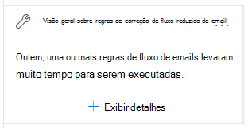

# Visão das regras de fluxo de emails lentas no Centro de Conformidade e & SegurançaFix slow mail flow rules insight in the Security & Compliance Center

[!INCLUDE [Microsoft 365 Defender rebranding](../includes/microsoft-defender-for-office.md)]

**Aplica-se a****Applies to**
- [Proteção do Exchange OnlineExchange Online Protection](exchange-online-protection-overview.md)
- [Plano 1 e plano 2 do Microsoft Defender para Office 365Microsoft Defender for Office 365 plan 1 and plan 2](office-365-atp.md)
- [Microsoft 365 DefenderMicrosoft 365 Defender](../mtp/microsoft-threat-protection.md)

Regras de fluxo de emails ineficientes (também conhecidas como regras de transporte) podem levar a atrasos de fluxo de emails para sua organização.Inefficient mail flow rules (also known as transport rules) can lead to mail flow delays for your organization. Esse insight relata regras de fluxo de emails que têm um impacto no fluxo de emails da sua organização.This insight reports mail flow rules that have an impact on your organization's mail flow. Exemplos desses tipos de regras incluem:Examples of these types of rules include:

- Condições que usam **é membro de grupos** grandes.Conditions that use **Is member of** for large groups.
- Condições que usam correspondência de padrão de expressão regular complexa (regex).Conditions that use complex regular expression (regex) pattern matching.
- Condições que usam a verificação de conteúdo em anexos.Conditions that use content checking in attachments.

The **Fix slow mail flow rules** insight in the Recommended for **you** area of the Mail [flow dashboard](mail-flow-insights-v2.md) in the Security & [Compliance Center](https://protection.office.com) notifes you when a mail flow rule is taking too long to complete.The **Fix slow mail flow rules** insight in the **Recommended for you** area of the [Mail flow dashboard](mail-flow-insights-v2.md) in the [Security & Compliance Center](https://protection.office.com) notifies you when a mail flow rule is taking too long to complete.

Esse insight só aparece depois que a condição é detectada (se você não tiver loops de email, você não verá o insight).This insight appears only after the condition is detected (if you don't have any mail loops, you won't see the insight).

Você pode usar essa notificação para ajudá-lo a identificar e ajustar as regras de fluxo de emails para ajudar a reduzir os atrasos de fluxo de emails.You can use this notification to help you to identify and fine-tune mail flow rules to help reduce mail flow delays.

Quando você clica **em Exibir detalhes** no widget, um flyout é exibido com mais informações:When you click **View details** on the widget, a flyout appears with more information:

- **Regra:** você pode passar o mouse sobre o resumo para ver todas as condições, exceções e ações da regra.**Rule**: You can hover over the summary to see all of the conditions, exceptions, and actions of the rule. Você pode clicar no resumo para editar a regra no Centro de administração do Exchange (EAC).You can click on the summary to edit the rule in the Exchange admin center (EAC).
- **Número de mensagens avaliadas:** você pode  clicar em Exibir mensagens **de** exemplo para ver os resultados do rastreamento de mensagens para um exemplo das mensagens que foram afetadas pela regra.**Number of messages evaluated**: You can click **View sample messages** to see the [message trace](message-trace-scc.md) results for a sample of the messages that were affected by the rule.
- **Tempo médio gasto em cada mensagem****Average time spent on each message**
- **Tempo médio gasto em uma mensagem:** o valor intermediário que separa a metade superior dos dados da metade inferior do tempo.**Median time spent on a message**: The middle value that separates the upper half from the lower half of time data.

Para obter mais informações sobre condições e exceções em regras de fluxo de emails, consulte Condições e exceções de regras de fluxo de email [(predicados) no Exchange Online.](https://docs.microsoft.com/Exchange/security-and-compliance/mail-flow-rules/conditions-and-exceptions)For more information about conditions and exceptions in mail flow rules, see [Mail flow rule conditions and exceptions (predicates) in Exchange Online](https://docs.microsoft.com/Exchange/security-and-compliance/mail-flow-rules/conditions-and-exceptions).

## Confira tambémSee also

Para obter informações sobre outros insights no painel de fluxo de emails, consulte Informações de fluxo de email no Centro de [Conformidade e & Segurança.](mail-flow-insights-v2.md)For information about other insights in the Mail flow dashboard, see [Mail flow insights in the Security & Compliance Center](mail-flow-insights-v2.md).
