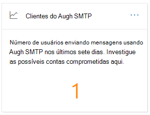
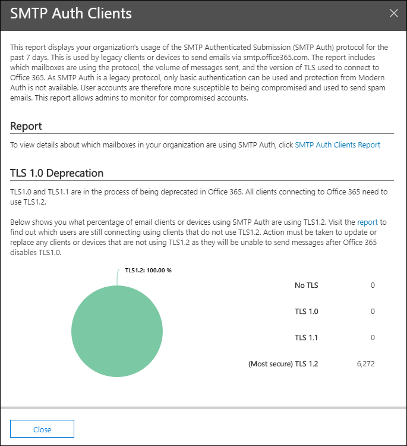
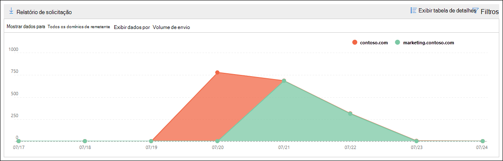
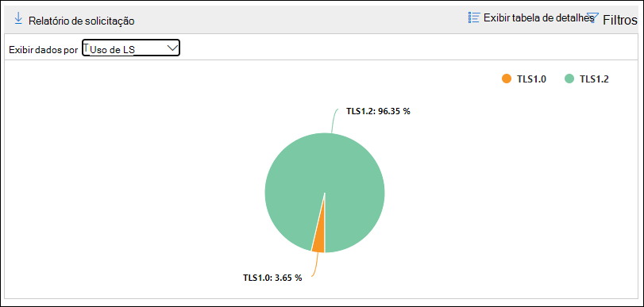
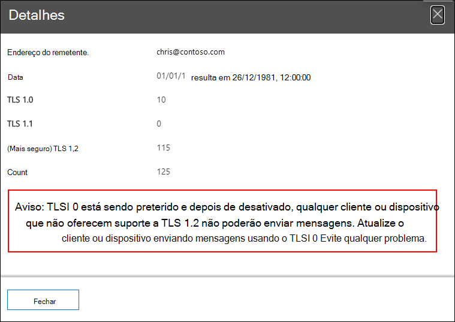

# Clientes de autenticação SMTP percepção e relatório no centro de conformidade e segurança &

Os **clientes de autenticação SMTP** se aprofundam no [painel de fluxo de emails](mail-flow-insights-v2.md) e no [relatório de clientes de autenticação SMTP](#smtp-auth-clients-report) associado no [centro de conformidade & de segurança](https://protection.office.com) realçar o uso do protocolo de envio de cliente de autenticação SMTP por usuários ou contas de sistema em sua organização. Este protocolo herdado (que usa o ponto de extremidade smtp.office365.com) só oferece autenticação básica e é suscetível a uso por contas comprometidas para enviar emails. A percepção e o relatório permitem verificar se há atividades incomuns para envios de email de autenticação SMTP. Ele também mostra os dados de uso de TLS para clientes ou dispositivos que usam a autenticação SMTP.

O widget indica o número de usuários ou contas de serviço que usaram o protocolo de autenticação SMTP nos últimos sete dias.

Se você clicar no número de mensagens no widget, um submenu de **clientes de autenticação SMTP** será exibido. O submenu fornece uma exibição agregada do uso e dos volumes de TLS para a última semana.

Você pode clicar no link **relatório de clientes de autenticação SMTP** para acessar o relatório de clientes de autenticação SMTP, conforme descrito na próxima seção.

## Relatório de clientes de autenticação SMTP

### Exibição de relatório para o relatório de clientes de autenticação SMTP

Por padrão, o relatório mostra os dados dos últimos 7 dias, mas os dados estão disponíveis nos últimos 90 dias.

A seção visão geral contém os seguintes gráficos:

- **Exibir dados por: enviando o volume**: por padrão, o gráfico mostra o número de mensagens de cliente de autenticação SMTP que foram enviadas de todos os domínios (**Mostrar dados de: todos os domínios do remetente** estão selecionados por padrão). Você pode filtrar os resultados em um domínio de remetente específico clicando em **Mostrar dados para** e selecionando o domínio do remetente na lista suspensa. Se você focalizar um ponto de dados específico (dia), o número de mensagens será exibido.

  

- **Exibir dados por: uso de TLS**: o gráfico mostra a porcentagem de uso de TLS para todas as mensagens de cliente de autenticação SMTP durante o período de tempo selecionado. Este gráfico permite identificar e executar ações sobre usuários e contas de sistema que ainda estão usando versões mais antigas do TLS.

  

Se você clicar em **filtros** em um modo de exibição de relatório, poderá especificar um intervalo de datas com **data de início** e data de **término**.

Clique em **solicitar relatório** para receber uma versão mais detalhada do relatório em uma mensagem de email. Você pode especificar o intervalo de datas e os destinatários que receberão o relatório.

### Exibição da tabela de detalhes para o relatório de clientes de autenticação SMTP

Se você clicar em **Exibir tabela de detalhes**, as informações mostradas dependem do gráfico que você estava observando:

- **Exibir dados por: enviando volume**: as informações a seguir são mostradas em uma tabela:

  - **Endereço do remetente**.
  - **Contagem de mensagem**

  Se você selecionar uma linha, os mesmos detalhes serão mostrados em um submenu.

- **Exibir dados por: uso de TLS**: as seguintes informações são mostradas em uma tabela:

  - **Endereço do remetente**.
  - **TLS 1.0%**\*
  - **TLS 1.1%**\*
  - **TLS 1.2%**\*
  - **Contagem de mensagem**

  \* Esta coluna mostra a porcentagem e o número de mensagens do remetente.

Se você clicar em **filtros** em um modo de exibição de tabela detalhes, poderá especificar um intervalo de datas com **data de início** e data de **término**.

Se você selecionar uma linha, os detalhes semelhantes serão mostrados em um submenu:

Clique em **solicitar relatório** para receber uma versão mais detalhada do relatório em uma mensagem de email. Você pode especificar o intervalo de datas e os destinatários que receberão o relatório.

Para voltar para o modo de exibição relatórios, clique em **Exibir relatório**.

## Tópicos relacionados

Para obter informações sobre outras ideias no painel de fluxo de emails, consulte [Mail Flow insights no centro de conformidade de & de segurança](mail-flow-insights-v2.md).
