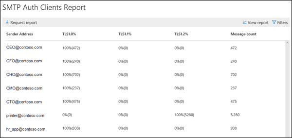

# Relatório de clientes de autenticação SMTPSMTP Auth clients report

O relatório de **clientes de autenticação SMTP** realça o uso do protocolo de envio de cliente de autenticação SMTP por usuários ou contas de sistema em sua organização.The **SMTP Auth clients** report highlights the use of the SMTP Auth client submission protocol by users or system accounts in your organization. Este protocolo herdado (que usa o ponto de extremidade smtp.office365.com) só oferece autenticação básica e é suscetível a uso por contas comprometidas para enviar emails.This legacy protocol (which uses the endpoint smtp.office365.com) only offers Basic authentication, and is susceptible to being used by compromised accounts to send email.  Este relatório permite verificar atividades incomuns.This report allows you to check for unusual activity. Ele também mostra os dados de uso de TLS para clientes ou dispositivos que usam a autenticação SMTP.It also shows the TLS usage data for clients or devices using SMTP Auth.

O widget que é mostrado no painel de fluxo de emails indica o número de usuários ou contas de serviço que usaram o protocolo de autenticação SMTP nos últimos sete dias.The widget that's shown in the Mail Flow dashboard indicates the number of users or service accounts that have used the SMTP Auth protocol in the last 7 days.

Clicar no widget abre um submenu que fornece uma exibição agregada do uso e dos volumes de TLS para a última semana.Clicking on the widget opens a flyout that provides an aggregated view of the TLS usage and volumes for the last week.

Ao clicar no link de **relatório de clientes de autenticação SMTP** , você verá dois dados dinâmicos principais e dois modos de exibição de dados.When you click on the **SMTP Auth Clients Report** link, you'll see two main data pivots and two data views. Os dados dinâmicos são o **volume de envio** e o **uso de TLS**.The data pivots are the **Sending Volume** and **TLS Usage**. Os modos de exibição de dados são o gráfico e a tabela de detalhes.The data views are the chart and the details table.

O modo de exibição de **volume de envio** mostra o número de mensagens que foram enviadas usando a autenticação SMTP no intervalo de tempo especificado.The **Sending Volume** view shows the number of messages that were sent using SMTP Auth for the specified time range. Você pode ajustar o intervalo clicando em **filtros**.You can adjust the range by clicking **Filters**. O gráfico é organizado por domínio de remetente.The chart is organized by sender domain. Você pode ver dados separados para cada domínio selecionando o domínio na lista suspensa **Mostrar dados para** .You can see separate data for each domain by selecting the domain in the **Show data for** drop down.

Você pode exibir informações detalhadas sobre os remetentes e suas contagens de mensagens clicando em **Exibir detalhes tabela**.You can view detailed information about the senders and their message counts by clicking **View details table**. Para retornar ao gráfico, clique em **Exibir relatório**.To return to the chart, click **View report**.

A tabela dinâmica de **uso de TLS** é importante devido à futura substituição de TLS 1.0 e TLS 1.1 no Office 365.The **TLS Usage** pivot is important due to the upcoming deprecation of TLS1.0 and TLS1.1 in Office 365. Muitos dispositivos e aplicativos herdados não poderão enviar emails se eles só forem capazes de usar o TLS 1.0 com autenticação SMTP. Essa tabela dinâmica permite que você identifique e execute ações sobre usuários e contas de sistema que ainda estão usando versões mais antigas do TLS.Many legacy devices and applications will be unable to send email if they are only capable of using TLS1.0 with SMTP Auth. This pivot allows you to identify and take action on users and system accounts that are still using older versions of TLS.

Você pode exibir informações detalhadas sobre os remetentes, as versões do TLS que estão usando a autenticação SMTP e suas contagens de mensagens clicando em **Exibir detalhes tabela**.You can view detailed information about the senders, the versions of TLS they are using with SMTP Auth, and their message counts by clicking **View details table**. Para retornar ao gráfico, clique em **Exibir relatório**.To return to the chart, click **View report**.

Você também pode baixar uma versão mais detalhada do relatório clicando em solicitação de relatório.You can also download a more detailed version of the report by clicking Request report.

## Tópicos relacionadosRelated topics

Para obter mais informações sobre outros insights de fluxo de email no painel de fluxo de emails, consulte [Mail Flow insights no centro de conformidade de & de segurança](mail-flow-insights-v2.md).For more information about other mail flow insights in the mail flow dashboard, see [Mail flow insights in the Security & Compliance Center](mail-flow-insights-v2.md).
