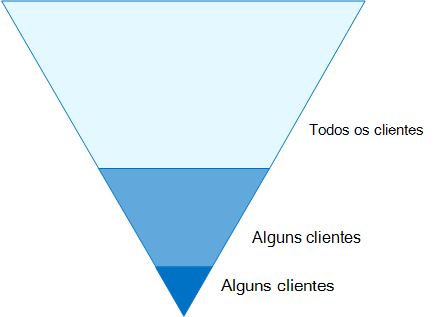

# Identidade e configurações de acesso ao dispositivo

O perímetro de segurança moderno da sua organização agora se estende além de sua rede para incluir os usuários acessando aplicativos baseados em nuvem de qualquer local com uma variedade de dispositivos. Sua infraestrutura de segurança precisa determinar se uma determinada solicitação de acesso deve ser concedida e sob quais condições.

Essa determinação deve ser baseada na conta de usuário da entrada, no dispositivo que está sendo usado, no aplicativo que o usuário está usando para acesso, no local a partir do qual a solicitação de acesso foi feita e em uma avaliação do risco da solicitação. Esse recurso ajuda a garantir que apenas usuários e dispositivos aprovados possam acessar os recursos críticos.

Esta série de artigos descreve um conjunto de configurações de pré-requisitos de acesso a identidades e dispositivos e um conjunto de Acesso Condicional do Azure Active Directory (Azure AD), Microsoft Intune e outras políticas para proteger o acesso ao Microsoft 365 para aplicativos e serviços em nuvem corporativos, outros serviços SaaS e aplicativos locais publicados com o Proxy de Aplicativo do Azure AD.

As configurações e políticas de acesso a identidades e dispositivos são recomendadas em três camadas: proteção de linha de base, proteção confidencial e proteção para ambientes com dados altamente regulamentados ou classificados. Essas camadas e suas configurações correspondentes fornecem níveis consistentes de proteção em seus dados, identidades e dispositivos.

Esses recursos e suas recomendações:

- Têm suporte no Microsoft 365 E3 e no Microsoft 365 E5.
- Estão alinhados com o [Microsoft Secure Score,](https://docs.microsoft.com/microsoft-365/security/mtp/microsoft-secure-score) bem como com a pontuação de identidade no [Azure AD,](https://docs.microsoft.com/azure/active-directory/fundamentals/identity-secure-score)e aumentarão essas pontuações para sua organização.
- Ajudará você a implementar essas [cinco etapas para proteger sua infraestrutura de identidade.](https://docs.microsoft.com/azure/security/azure-ad-secure-steps)

Se sua organização tiver requisitos ou complexidades de ambiente exclusivos, use essas recomendações como ponto de partida. No entanto, a maioria das organizações pode implementar essas recomendações conforme prescrito.

> [!NOTE]
> A Microsoft também vende licenças do Enterprise Mobility + Security (EMS) para assinaturas do Office 365. Os recursos do EMS E3 e do EMS E5 são equivalentes aos do Microsoft 365 E3 e microsoft 365 E5. Confira os detalhes nos planos do [EMS.](https://www.microsoft.com/microsoft-365/enterprise-mobility-security/compare-plans-and-pricing)

## Público-alvo

Essas recomendações destinam-se a arquitetos corporativos e profissionais de TI que estão familiarizados com os serviços de segurança e produtividade de nuvem do Microsoft 365, que incluem o Azure AD (identidade), o Microsoft Intune (gerenciamento de dispositivos) e a Proteção de Informações do Azure (proteção de dados).

### Ambiente do cliente

As políticas recomendadas são aplicáveis a organizações corporativas que operam inteiramente na nuvem da Microsoft e para clientes com infraestrutura de identidade híbrida, que é uma floresta local dos Serviços de Domínio do Active Directory (AD DS) sincronizada com um locatário do Azure AD.

Muitas das recomendações fornecidas dependem dos serviços disponíveis apenas com o Microsoft 365 E5, o Microsoft 365 E3 com o complemento Proteção contra Ameaças da Identidade &, o EMS E5 ou o Azure Premium P2.

Para as organizações que não têm essas licenças, a Microsoft recomenda que você implemente pelo menos padrões de segurança, que estão [incluídos](https://docs.microsoft.com/azure/active-directory/fundamentals/concept-fundamentals-security-defaults)em todos os planos do Microsoft 365.

### Advertências

Sua organização pode estar sujeita a requisitos regulatórios ou outros requisitos de conformidade, incluindo recomendações específicas que podem exigir que você aplique políticas que divergem dessas configurações recomendadas. Essas configurações recomendam controles de uso que historicamente não estavam disponíveis. Recomendamos esses controles porque acreditamos que eles representam um equilíbrio entre segurança e produtividade.

Fizemos o melhor para levar em conta uma ampla variedade de requisitos de proteção organizacional, mas não podemos levar em conta todos os requisitos possíveis ou todos os aspectos exclusivos da sua organização.

## Três camadas de proteção

A maioria das organizações tem requisitos específicos sobre segurança e proteção de dados. Esses requisitos variam por segmento do setor e por funções de trabalho dentro das organizações. Por exemplo, seu departamento jurídico e seus administradores podem exigir controles adicionais de segurança e proteção de informações em torno de suas correspondências de email que não são necessárias para outras unidades de negócios.

Cada setor também tem seu próprio conjunto de normas especializadas. Em vez de fornecer uma lista de todas as opções de segurança possíveis ou uma recomendação por função de trabalho ou segmento do setor, recomendações foram fornecidas para três camadas diferentes de segurança e proteção que podem ser aplicadas com base na granularidade de suas necessidades.

- **Proteção de linha** de base: recomendamos que você estabeleça um padrão mínimo para proteger dados, bem como as identidades e os dispositivos que acessam seus dados. Você pode seguir essas recomendações de linha de base para fornecer proteção forte padrão que atenda às necessidades de muitas organizações.
- **Proteção sensível:** alguns clientes têm um subconjunto de dados que devem ser protegidos em níveis mais altos ou podem exigir que todos os dados sejam protegidos em um nível superior. Você pode aplicar maior proteção a todos ou conjuntos de dados específicos em seu ambiente do Microsoft 365. É recomendável proteger identidades e dispositivos que acessam dados confidenciais com níveis compatíveis de segurança.
- **Altamente regulamentado:** algumas organizações podem ter uma pequena quantidade de dados altamente confidenciais, constituem segredos comerciais ou são dados regulamentados. A Microsoft fornece recursos para ajudar as organizações a atender a esses requisitos, incluindo proteção adicional para identidades e dispositivos.

Estas diretrizes mostram como implementar a proteção para identidades e dispositivos para cada uma dessas camadas de proteção. Use essas diretrizes como um ponto de partida para sua organização e ajuste as políticas para atender aos requisitos específicos da sua organização.

É importante usar níveis consistentes de proteção para dados, identidades e dispositivos. Por exemplo, se você implementar essas diretrizes, certifique-se de proteger seus dados em níveis comparáveis.

O modelo de identidade e proteção de dispositivo para o modelo de arquitetura do **Microsoft 365** mostra quais recursos são comparáveis.

   [Exibir como um PDF](../../downloads/MSFT_cloud_architecture_identity&device_protection.pdf) \| [Baixar como pdf](https://github.com/MicrosoftDocs/microsoft-365-docs/raw/public/microsoft-365/downloads/MSFT_cloud_architecture_identity&device_protection.pdf) \| [Baixar como um Visio](https://github.com/MicrosoftDocs/microsoft-365-docs/raw/public/microsoft-365/downloads/MSFT_cloud_architecture_identity&device_protection.vsdx)  

Além disso, consulte a solução [Implantar proteção de informações para regulamentações de](../../solutions/information-protection-deploy.md) privacidade de dados para proteger as informações armazenadas no Microsoft 365.

## Vantagens e desvantagens de produtividade e segurança

Implementar qualquer estratégia de segurança requer trocas entre segurança e produtividade. É útil avaliar como cada decisão afeta o equilíbrio de segurança, funcionalidade e facilidade de uso.

As recomendações fornecidas são baseadas nos seguintes princípios:

- Conheça seus usuários e seja flexível para seus requisitos funcionais e de segurança.
- Aplique uma política de segurança no momento certo e certifique-se de que ela seja significativa.

## Serviços e conceitos de proteção de acesso a identidades e dispositivos

O Microsoft 365 para empresas foi projetado para grandes organizações para capacitar todos a serem criativos e trabalharem juntos com segurança.

Esta seção fornece uma visão geral dos serviços e recursos do Microsoft 365 que são importantes para o acesso a identidades e dispositivos.

### Azure Active Directory

O Azure AD fornece um pacote completo de recursos de gerenciamento de identidade. Recomendamos usar esses recursos para proteger o acesso.

|Capcidade ou recurso|Descrição|Licenças|
|---|---|---|
|[MFA (Autenticação Multifator)](/azure/active-directory/authentication/concept-mfa-howitworks)|A MFA exige que os usuários forneçam duas formas de verificação, como uma senha de usuário, além de uma notificação do aplicativo Microsoft Authenticator ou uma chamada telefônica. A MFA reduz significativamente o risco de que credenciais roubadas possam ser usadas para acessar seu ambiente. O Microsoft 365 usa o serviço de Autenticação Multifatória do Azure AD para logins baseados em MFA.|Microsoft 365 E3 ou E5|
|[Acesso condicional](/azure/active-directory/conditional-access/overview)|O Azure AD avalia as condições de entrada do usuário e usa políticas de Acesso Condicional para determinar o acesso permitido. Por exemplo, nesta orientação, mostramos como criar uma política de Acesso Condicional para exigir a conformidade do dispositivo para acessar dados confidenciais. Isso reduz significativamente o risco de um hacker com seu próprio dispositivo e credenciais roubadas acessar seus dados confidenciais. Ele também protege dados confidenciais nos dispositivos, porque os dispositivos devem atender a requisitos específicos de saúde e segurança.|Microsoft 365 E3 ou E5|
|[Grupos do Azure AD](/azure/active-directory/fundamentals/active-directory-manage-groups)|As políticas de Acesso Condicional, o gerenciamento de dispositivos com o Intune e até mesmo as permissões para arquivos e sites em sua organização dependem da atribuição a contas de usuário ou grupos do Azure AD. Recomendamos que você crie grupos do Azure AD que correspondam aos níveis de proteção que você está implementando. Por exemplo, sua equipe executiva provavelmente é um alvo de valor mais alto para hackers. Portanto, faz sentido adicionar as contas de usuário desses funcionários a um grupo do Azure AD e atribuir esse grupo a políticas de Acesso Condicional e outras políticas que impõem um nível mais alto de proteção para acesso.|Microsoft 365 E3 ou E5|
|[Registro de dispositivos](/azure/active-directory/devices/overview)|Você registra um dispositivo no Azure AD para criar uma identidade para o dispositivo. Essa identidade é usada para autenticar o dispositivo quando um usuário entra e aplicar políticas de Acesso Condicional que exigem PCs ingressados no domínio ou em conformidade. Para essa orientação, usamos o registro de dispositivos para registrar automaticamente computadores Windows ingressados no domínio. O registro de dispositivos é um pré-requisito para gerenciar dispositivos com o Intune.|Microsoft 365 E3 ou E5|
|[Azure AD Identity Protection](/azure/active-directory/identity-protection/overview)|Permite que você detecte possíveis vulnerabilidades que afetam as identidades da sua organização e configure a política de correção automatizada para baixo, médio e alto risco de login e risco do usuário. Essa orientação depende dessa avaliação de risco para aplicar políticas de Acesso Condicional à autenticação multifacional. Essas diretrizes também incluem uma política de Acesso Condicional que exige que os usuários alterem suas senhas se atividades de alto risco são detectadas para sua conta.|Microsoft 365 E5, Microsoft 365 E3 com as licenças de Identidade & Proteção contra Ameaças, EMS E5 ou Azure Premium P2|
|[Redefinição de senha por autoatendimento (SSPR)](/azure/active-directory/authentication/concept-sspr-howitworks)|Permita que os usuários redefinam suas senhas com segurança e sem intervenção do help-desk, fornecendo a verificação de vários métodos de autenticação que o administrador pode controlar.|Microsoft 365 E3 ou E5|
|[Proteção por senha do Azure AD](https://docs.microsoft.com/azure/active-directory/authentication/concept-password-ban-bad)|Detecte e bloqueie senhas fracas conhecidas e suas variantes e termos fracos adicionais específicos para sua organização. Listas de senhas globais proibidas padrão são aplicadas automaticamente a todos os usuários em um locatário do Microsoft Azure AD. Você pode definir entradas adicionais em uma lista de senhas proibidas personalizadas. Quando os usuários alteram ou redefinem suas senhas, essas listas de senhas proibidas são verificadas para garantir o uso de senhas fortes.|Microsoft 365 E3 ou E5|
|

Aqui estão os componentes de acesso a identidades e dispositivos, incluindo objetos, configurações e subsserviços do Intune e do Azure AD.

### Microsoft Intune

[O Intune é](https://docs.microsoft.com/intune/introduction-intune) o serviço de gerenciamento de dispositivo móvel baseado na nuvem da Microsoft. Essas diretrizes recomendam o gerenciamento de dispositivos de computadores Windows com o Intune e recomenda configurações de política de conformidade do dispositivo. O Intune determina se os dispositivos são compatíveis e envia esses dados para o Azure AD a ser usado ao aplicar políticas de Acesso Condicional.

#### Proteção de aplicativo do Intune

As políticas de proteção de aplicativos do [Intune](https://docs.microsoft.com/intune/app-protection-policy) podem ser usadas para proteger os dados da sua organização em aplicativos móveis, com ou sem registrar dispositivos no gerenciamento. O Intune ajuda a proteger as informações, garantir que seus funcionários ainda possam ser produtivos e evitar a perda de dados. Implementando políticas no nível do aplicativo, você pode restringir o acesso aos recursos da empresa e manter os dados dentro do controle do departamento de TI.

Estas diretrizes mostram como criar políticas recomendadas para impor o uso de aplicativos aprovados e determinar como esses aplicativos podem ser usados com seus dados comerciais.

### Microsoft 365

Essas diretrizes mostram como implementar um conjunto de políticas para proteger o acesso aos serviços de nuvem do Microsoft 365, incluindo o Microsoft Teams, o Exchange Online, o SharePoint Online e o OneDrive for Business. Além de implementar essas políticas, recomendamos que você também eleva o nível de proteção para seu locatário usando estes recursos:

- [Configurar locatário para aumentar a segurança](tenant-wide-setup-for-increased-security.md)

  Recomendações que se aplicam à segurança de linha de base para seu locatário.

- [Roteiro de segurança: principais prioridades para os primeiros 30 dias, 90 dias e depois](security-roadmap.md)

  Recomendações que incluem registro em log, governança de dados, acesso de administrador e proteção contra ameaças.

### Aplicativos do Windows 10 e do Microsoft 365 para empresas

O Windows 10 com o Microsoft 365 Apps para empresas é o ambiente cliente recomendado para computadores. Recomendamos o Windows 10 porque o Azure foi projetado para fornecer a experiência mais suave possível para o Azure AD e local. O Windows 10 também inclui recursos avançados de segurança que podem ser gerenciados por meio do Intune. O Microsoft 365 Apps para empresas inclui as versões mais recentes dos aplicativos do Office. Eles usam a autenticação moderna, que é mais segura e um requisito de Acesso Condicional. Esses aplicativos também incluem ferramentas aprimoradas de segurança e conformidade.

## Aplicando esses recursos nas três camadas de proteção

A tabela a seguir resume nossas recomendações para usar esses recursos nas três camadas de proteção.

|Mecanismo de proteção|Linha de base|Confidencial|Altamente controlado|
|---|---|---|---|
|**Impor a MFA**|No risco de entrada médio ou acima|No risco de entrada baixo ou acima|Em todas as novas sessões|
|**Impor alteração de senha**|Para usuários de alto risco|Para usuários de alto risco|Para usuários de alto risco|
|**Impor a proteção de aplicativos do Intune**|Sim|Sim|Sim|
|**Impor o registro do Intune para o dispositivo de propriedade da organização**|Exigir um computador compatível ou ingressado no domínio, mas permitir telefones e tablets BYOD (traga seus próprios dispositivos)|Exigir um dispositivo compatível ou ingressado no domínio|Exigir um dispositivo compatível ou ingressado no domínio|
|

## Propriedade do dispositivo

A tabela acima reflete a tendência de muitas organizações suportarem uma combinação de dispositivos de propriedade da organização, bem como pessoais ou BYODs para habilitar a produtividade móvel em toda a força de trabalho. As políticas de proteção de aplicativos do Intune garantem que o email seja protegido contra a exfiltração do aplicativo móvel do Outlook e de outros aplicativos móveis do Office, em dispositivos de propriedade da organização e BYODs.

Recomendamos que os dispositivos de propriedade da organização sejam gerenciados pelo Intune ou ingressados no domínio para aplicar proteções e controle adicionais. Dependendo da sensibilidade dos dados, sua organização pode optar por não permitir BYODs para populações de usuários específicos ou aplicativos específicos.

## Implantação e seus aplicativos

Antes de configurar e lançar a configuração de acesso de dispositivo e identidade para seus aplicativos integrados ao Azure AD, você deve:

- Decida quais aplicativos usados em sua organização você deseja proteger.
- Analise essa lista de aplicativos para determinar os conjuntos de políticas que fornecem níveis apropriados de proteção.

  Você não deve criar conjuntos separados de políticas para cada aplicativo porque o gerenciamento delas pode se tornar complicado. A Microsoft recomenda que você a groupe seus aplicativos que tenham os mesmos requisitos de proteção para os mesmos usuários.

  Por exemplo, você pode ter um conjunto de políticas que inclua todos os aplicativos do Microsoft 365 para todos os usuários para proteção de linha de base e um segundo conjunto de políticas para todos os aplicativos confidenciais, como as usadas por recursos humanos ou departamentos financeiros, e aplicá-las a esses grupos.

Depois de determinar o conjunto de políticas para os aplicativos que você deseja proteger, roll the policies out para seus usuários de forma incremental, abordando problemas ao longo do caminho.

Por exemplo, configure as políticas que serão usadas para todos os aplicativos do Microsoft 365 apenas para o Exchange Online com as alterações adicionais para o Exchange. Roll these policies out to your users and work through any issues. Em seguida, adicione o Teams com suas alterações adicionais e roll-out para seus usuários. Em seguida, adicione o SharePoint com suas alterações adicionais. Continue adicionando o restante de seus aplicativos até que você possa configurar com confiança essas políticas de linha de base para incluir todos os aplicativos do Microsoft 365.

Da mesma forma, para seus aplicativos confidenciais, crie o conjunto de políticas e adicione um aplicativo por vez e solucione problemas até que todos eles sejam incluídos no conjunto de políticas confidenciais de aplicativo.

A Microsoft recomenda que você não crie conjuntos de políticas que se apliquem a todos os aplicativos porque isso pode resultar em algumas configurações não intencionais. Por exemplo, políticas que bloqueiam todos os aplicativos podem bloquear seus administradores fora do portal do Azure e exclusões não podem ser configuradas para pontos de extremidade importantes, como o Microsoft Graph.

## Etapas do processo de configuração de identidade e acesso ao dispositivo

1. Configure os recursos de identidade de pré-requisitos e suas configurações.
2. Configure a identidade comum e as políticas de Acesso Condicional.
3. Configurar políticas de Acesso Condicional para usuários convidados e externos.
4. Configurar políticas de Acesso Condicional para aplicativos de nuvem do Microsoft 365, como Microsoft Teams, Exchange Online e SharePoint.

Depois de configurar o acesso a identidades e dispositivos, consulte o guia de implantação de recursos do [Azure AD](https://docs.microsoft.com/azure/active-directory/fundamentals/active-directory-deployment-checklist-p2) para obter uma lista de verificação em fases de recursos adicionais a considerar e o [Azure AD Identity Governance](https://docs.microsoft.com/azure/active-directory/governance/) para proteger, monitorar e auditar o acesso.

## Próxima etapa

[Trabalho de pré-requisito para implementar políticas de acesso a identidades e dispositivos](identity-access-prerequisites.md)
