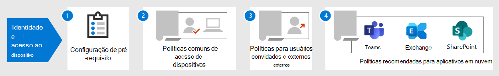

# Identidade e configurações de acesso ao dispositivoIdentity and device access configurations

**Aplica-se a****Applies to**
- [Proteção do Exchange OnlineExchange Online Protection](exchange-online-protection-overview.md)
- [Plano 1 e plano 2 do Microsoft Defender para Office 365Microsoft Defender for Office 365 plan 1 and plan 2](office-365-atp.md)

O perímetro de segurança moderno da sua organização agora se estende além de sua rede para incluir os usuários acessando aplicativos baseados em nuvem de qualquer local com uma variedade de dispositivos.The modern security perimeter of your organization now extends beyond your network to include users accessing cloud-based apps from any location with a variety of devices. Sua infraestrutura de segurança precisa determinar se uma determinada solicitação de acesso deve ser concedida e sob quais condições.Your security infrastructure needs to determine whether a given access request should be granted and under what conditions.

Essa determinação deve ser baseada na conta de usuário da entrada, no dispositivo que está sendo usado, no aplicativo que o usuário está usando para acesso, no local a partir do qual a solicitação de acesso foi feita e em uma avaliação do risco da solicitação.This determination should be based on the user account of the sign-in, the device being used, the app the user is using for access, the location from which the access request is made, and an assessment of the risk of the request. Esse recurso ajuda a garantir que apenas usuários e dispositivos aprovados possam acessar os recursos críticos.This capability helps ensure that only approved users and devices can access your critical resources.

Esta série de artigos descreve um conjunto de configurações de pré-requisitos de acesso a identidades e dispositivos e um conjunto de Acesso Condicional do Azure Active Directory (Azure AD), Microsoft Intune e outras políticas para proteger o acesso ao Microsoft 365 para aplicativos e serviços de nuvem corporativos, outros serviços SaaS e aplicativos locais publicados com o Proxy de Aplicativo do Azure AD.This series of articles describes a set of identity and device access prerequisite configurations and a set of Azure Active Directory (Azure AD) Conditional Access, Microsoft Intune, and other policies to secure access to Microsoft 365 for enterprise cloud apps and services, other SaaS services, and on-premises applications published with Azure AD Application Proxy.

As configurações e políticas de acesso a identidades e dispositivos são recomendadas em três camadas: proteção de linha de base, proteção confidencial e proteção para ambientes com dados altamente regulamentados ou classificados.Identity and device access settings and policies are recommended in three tiers: baseline protection, sensitive protection, and protection for environments with highly regulated or classified data. Essas camadas e suas configurações correspondentes fornecem níveis consistentes de proteção em seus dados, identidades e dispositivos.These tiers and their corresponding configurations provide consistent levels of protection across your data, identities, and devices.

Esses recursos e suas recomendações:These capabilities and their recommendations:

- Têm suporte no Microsoft 365 E3 e no Microsoft 365 E5.Are supported in Microsoft 365 E3 and Microsoft 365 E5.
- Estão alinhados com o [Microsoft Secure Score,](../mtp/microsoft-secure-score.md) bem como com a pontuação de identidade no [Azure AD,](https://docs.microsoft.com/azure/active-directory/fundamentals/identity-secure-score)e aumentarão essas pontuações para sua organização.Are aligned with [Microsoft Secure Score](../mtp/microsoft-secure-score.md) as well as [identity score in Azure AD](https://docs.microsoft.com/azure/active-directory/fundamentals/identity-secure-score), and will increase these scores for your organization.
- Ajudará você a implementar essas [cinco etapas para proteger sua infraestrutura de identidade.](https://docs.microsoft.com/azure/security/azure-ad-secure-steps)Will help you implement these [five steps to securing your identity infrastructure](https://docs.microsoft.com/azure/security/azure-ad-secure-steps).

Se sua organização tiver requisitos ou complexidades de ambiente exclusivos, use essas recomendações como ponto de partida.If your organization has unique environment requirements or complexities, use these recommendations as a starting point. No entanto, a maioria das organizações pode implementar essas recomendações conforme prescrito.However, most organizations can implement these recommendations as prescribed.

Assista a este vídeo para ter uma visão geral rápida das configurações de identidade e acesso ao dispositivo do Microsoft 365 para empresas.Watch this video for a quick overview of identity and device access configurations for Microsoft 365 for enterprise.
 
 
> [!VIDEO https://www.microsoft.com/videoplayer/embed/RWxEDQ]

> [!NOTE]
> A Microsoft também vende licenças do Enterprise Mobility + Security (EMS) para assinaturas do Office 365.Microsoft also sells Enterprise Mobility + Security (EMS) licenses for Office 365 subscriptions. Os recursos do EMS E3 e do EMS E5 são equivalentes aos do Microsoft 365 E3 e microsoft 365 E5.EMS E3 and EMS E5 capabilities are equivalent to those in Microsoft 365 E3 and Microsoft 365 E5. Confira os detalhes nos planos do [EMS.](https://www.microsoft.com/microsoft-365/enterprise-mobility-security/compare-plans-and-pricing)See [EMS plans](https://www.microsoft.com/microsoft-365/enterprise-mobility-security/compare-plans-and-pricing) for the details.

## Público-alvoIntended audience

Essas recomendações destinam-se a arquitetos corporativos e profissionais de TI que estão familiarizados com os serviços de segurança e produtividade de nuvem do Microsoft 365, que incluem o Azure AD (identidade), o Microsoft Intune (gerenciamento de dispositivos) e a Proteção de Informações do Azure (proteção de dados).These recommendations are intended for enterprise architects and IT professionals who are familiar with Microsoft 365 cloud productivity and security services, which includes Azure AD (identity), Microsoft Intune (device management), and Azure Information Protection (data protection).

### Ambiente do clienteCustomer environment

As políticas recomendadas são aplicáveis a organizações corporativas que operam inteiramente na nuvem da Microsoft e para clientes com infraestrutura de identidade híbrida, que é uma floresta local dos Serviços de Domínio do Active Directory (AD DS) sincronizada com um locatário do Azure AD.The recommended policies are applicable to enterprise organizations operating both entirely within the Microsoft cloud and for customers with hybrid identity infrastructure, which is an on-premises Active Directory Domain Services (AD DS) forest that is synchronized with an Azure AD tenant.

Muitas das recomendações fornecidas dependem dos serviços disponíveis apenas com o Microsoft 365 E5, o Microsoft 365 E3 com as licenças do complemento Proteção contra Ameaças de Identidade &, EMS E5 ou Azure Premium P2.Many of the provided recommendations rely on services available only with Microsoft 365 E5, Microsoft 365 E3 with the Identity & Threat Protection add-on, EMS E5, or Azure Premium P2 licenses.

Para as organizações que não têm essas licenças, a Microsoft recomenda que você implemente pelo menos padrões de segurança, que estão [incluídos](https://docs.microsoft.com/azure/active-directory/fundamentals/concept-fundamentals-security-defaults)em todos os planos do Microsoft 365.For those organizations who do not have these licenses, Microsoft recommends you at least implement [security defaults](https://docs.microsoft.com/azure/active-directory/fundamentals/concept-fundamentals-security-defaults), which is included with all Microsoft 365 plans.

### AdvertênciasCaveats

Sua organização pode estar sujeita a requisitos regulatórios ou outros requisitos de conformidade, incluindo recomendações específicas que podem exigir que você aplique políticas que divergem dessas configurações recomendadas.Your organization may be subject to regulatory or other compliance requirements, including specific recommendations that may require you to apply policies that diverge from these recommended configurations. Essas configurações recomendam controles de uso que historicamente não estavam disponíveis.These configurations recommend usage controls that have not historically been available. Recomendamos esses controles porque acreditamos que eles representam um equilíbrio entre segurança e produtividade.We recommend these controls because we believe they represent a balance between security and productivity.

Fizemos o melhor para levar em conta uma ampla variedade de requisitos de proteção organizacional, mas não podemos levar em conta todos os requisitos possíveis ou todos os aspectos exclusivos da sua organização.We've done our best to account for a wide variety of organizational protection requirements, but we're not able to account for all possible requirements or for all the unique aspects of your organization.

## Três camadas de proteçãoThree tiers of protection

A maioria das organizações tem requisitos específicos sobre segurança e proteção de dados.Most organizations have specific requirements regarding security and data protection. Esses requisitos variam por segmento do setor e por funções de trabalho dentro das organizações.These requirements vary by industry segment and by job functions within organizations. Por exemplo, seu departamento jurídico e seus administradores podem exigir controles adicionais de segurança e proteção de informações em torno de suas correspondências de email que não são necessárias para outras unidades de negócios.For example, your legal department and administrators might require additional security and information protection controls around their email correspondence that are not required for other business units.

Cada setor também tem seu próprio conjunto de normas especializadas.Each industry also has their own set of specialized regulations. Em vez de fornecer uma lista de todas as opções de segurança possíveis ou uma recomendação por função de trabalho ou segmento do setor, recomendações foram fornecidas para três camadas diferentes de segurança e proteção que podem ser aplicadas com base na granularidade de suas necessidades.Rather than providing a list of all possible security options or a recommendation per industry segment or job function, recommendations have been provided for three different tiers of security and protection that can be applied based on the granularity of your needs.

- **Proteção de linha** de base: recomendamos que você estabeleça um padrão mínimo para proteger dados, bem como as identidades e os dispositivos que acessam seus dados.**Baseline protection**: We recommend you establish a minimum standard for protecting data, as well as the identities and devices that access your data. Você pode seguir essas recomendações de linha de base para fornecer proteção forte padrão que atenda às necessidades de muitas organizações.You can follow these baseline recommendations to provide strong default protection that meets the needs of many organizations.
- **Proteção sensível:** alguns clientes têm um subconjunto de dados que devem ser protegidos em níveis mais altos ou podem exigir que todos os dados sejam protegidos em um nível superior.**Sensitive protection**: Some customers have a subset of data that must be protected at higher levels, or they may require all data to be protected at a higher level. Você pode aplicar maior proteção a todos ou conjuntos de dados específicos em seu ambiente do Microsoft 365.You can apply increased protection to all or specific data sets in your Microsoft 365 environment. É recomendável proteger identidades e dispositivos que acessam dados confidenciais com níveis compatíveis de segurança.We recommend protecting identities and devices that access sensitive data with comparable levels of security.
- **Altamente regulamentado:** algumas organizações podem ter uma pequena quantidade de dados altamente confidenciais, constituem segredos comerciais ou são dados regulamentados.**Highly regulated**: Some organizations may have a small amount of data that is highly classified, constitutes trade secrets, or is regulated data. A Microsoft fornece recursos para ajudar as organizações a atender a esses requisitos, incluindo proteção adicional para identidades e dispositivos.Microsoft provides capabilities to help organizations meet these requirements, including added protection for identities and devices.

Estas diretrizes mostram como implementar a proteção para identidades e dispositivos para cada uma dessas camadas de proteção.This guidance shows you how to implement protection for identities and devices for each of these tiers of protection. Use essas diretrizes como um ponto de partida para sua organização e ajuste as políticas para atender aos requisitos específicos da sua organização.Use this guidance as a starting point for your organization and adjust the policies to meet your organization's specific requirements.

É importante usar níveis consistentes de proteção para dados, identidades e dispositivos.It's important to use consistent levels of protection across your data, identities, and devices. Por exemplo, se você implementar essas diretrizes, certifique-se de proteger seus dados em níveis comparáveis.For example, if you implement this guidance, be sure to protect your data at comparable levels.

O modelo de identidade e proteção de dispositivo para o modelo de arquitetura do **Microsoft 365** mostra quais recursos são comparáveis.The **Identity and device protection for Microsoft 365** architecture model shows you which capabilities are comparable.

   [Exibir como um PDF](../../downloads/MSFT_cloud_architecture_identity&device_protection.pdf) \| [Baixar como pdf](https://github.com/MicrosoftDocs/microsoft-365-docs/raw/public/microsoft-365/downloads/MSFT_cloud_architecture_identity&device_protection.pdf) \| [Baixar como um Visio](https://github.com/MicrosoftDocs/microsoft-365-docs/raw/public/microsoft-365/downloads/MSFT_cloud_architecture_identity&device_protection.vsdx)  [View as a PDF](../../downloads/MSFT_cloud_architecture_identity&device_protection.pdf) \| [Download as a PDF](https://github.com/MicrosoftDocs/microsoft-365-docs/raw/public/microsoft-365/downloads/MSFT_cloud_architecture_identity&device_protection.pdf)  \| [Download as a Visio](https://github.com/MicrosoftDocs/microsoft-365-docs/raw/public/microsoft-365/downloads/MSFT_cloud_architecture_identity&device_protection.vsdx)

Além disso, consulte a solução [Implantar proteção de informações para regulamentações de](../../solutions/information-protection-deploy.md) privacidade de dados para proteger as informações armazenadas no Microsoft 365.Additionally, see the [Deploy information protection for data privacy regulations](../../solutions/information-protection-deploy.md) solution to protect information stored in Microsoft 365.

## Vantagens e desvantagens de produtividade e segurançaSecurity and productivity trade-offs

Implementar qualquer estratégia de segurança exige trocas entre segurança e produtividade.Implementing any security strategy requires trade-offs between security and productivity. É útil avaliar como cada decisão afeta o equilíbrio de segurança, funcionalidade e facilidade de uso.It's helpful to evaluate how each decision affects the balance of security, functionality, and ease of use.

As recomendações fornecidas são baseadas nos seguintes princípios:The recommendations provided are based on the following principles:

- Conheça seus usuários e seja flexível para seus requisitos funcionais e de segurança.Know your users and be flexible to their security and functional requirements.
- Aplique uma política de segurança no momento certo e certifique-se de que ela seja significativa.Apply a security policy just in time and ensure it is meaningful.

## Serviços e conceitos de proteção de acesso a identidades e dispositivosServices and concepts for identity and device access protection

O Microsoft 365 para empresas foi projetado para grandes organizações para capacitar todos a serem criativos e trabalharem juntos com segurança.Microsoft 365 for enterprise is designed for large organizations to empower everyone to be creative and work together securely.

Esta seção fornece uma visão geral dos serviços e recursos do Microsoft 365 que são importantes para o acesso a identidades e dispositivos.This section provides an overview of the Microsoft 365 services and capabilities that are important for identity and device access.

### Azure Active DirectoryAzure AD

O Azure AD fornece um pacote completo de recursos de gerenciamento de identidade.Azure AD provides a full suite of identity management capabilities. Recomendamos usar esses recursos para proteger o acesso.We recommend using these capabilities to secure access.

|Capcidade ou recursoCapability or feature|DescriçãoDescription|LicençasLicensing|
|---|---|---|
|[MFA (Autenticação Multifator)Multi-factor authentication (MFA)](/azure/active-directory/authentication/concept-mfa-howitworks)|A MFA exige que os usuários forneçam duas formas de verificação, como uma senha de usuário, além de uma notificação do aplicativo Microsoft Authenticator ou uma chamada telefônica.MFA requires users to provide two forms of verification, such as a user password plus a notification from the Microsoft Authenticator app or a phone call. A MFA reduz significativamente o risco de que credenciais roubadas possam ser usadas para acessar seu ambiente.MFA greatly reduces the risk that stolen credentials can be used to access your environment. O Microsoft 365 usa o serviço autenticação multifatória do Azure AD para logins baseados em MFA.Microsoft 365 uses the Azure AD Multi-Factor Authentication service for MFA-based sign-ins.|Microsoft 365 E3 ou E5Microsoft 365 E3 or E5|
|[Acesso condicionalConditional Access](/azure/active-directory/conditional-access/overview)|O Azure AD avalia as condições de entrada do usuário e usa políticas de Acesso Condicional para determinar o acesso permitido.Azure AD evaluates the conditions of the user sign-in and uses Conditional Access policies to determine the allowed access. Por exemplo, nesta orientação, mostramos como criar uma política de Acesso Condicional para exigir a conformidade do dispositivo para acessar dados confidenciais.For example, in this guidance we show you how to create a Conditional Access policy to require device compliance for access to sensitive data. Isso reduz significativamente o risco de um hacker com seu próprio dispositivo e credenciais roubadas acessar seus dados confidenciais.This greatly reduces the risk that a hacker with their own device and stolen credentials can access your sensitive data. Ele também protege dados confidenciais nos dispositivos, porque os dispositivos devem atender a requisitos específicos de saúde e segurança.It also protects sensitive data on the devices, because the devices must meet specific requirements for health and security.|Microsoft 365 E3 ou E5Microsoft 365 E3 or E5|
|[Grupos do Azure ADAzure AD groups](/azure/active-directory/fundamentals/active-directory-manage-groups)|As políticas de Acesso Condicional, o gerenciamento de dispositivos com o Intune e até mesmo as permissões para arquivos e sites em sua organização dependem da atribuição a contas de usuário ou grupos do Azure AD.Conditional Access policies, device management with Intune, and even permissions to files and sites in your organization rely on the assignment to user accounts or Azure AD groups. Recomendamos que você crie grupos do Azure AD que correspondam aos níveis de proteção que você está implementando.We recommend you create Azure AD groups that correspond to the levels of protection you are implementing. Por exemplo, sua equipe executiva provavelmente é um alvo de valor mais alto para hackers.For example, your executive staff are likely higher value targets for hackers. Portanto, faz sentido adicionar as contas de usuário desses funcionários a um grupo do Azure AD e atribuir esse grupo a políticas de Acesso Condicional e outras políticas que impõem um nível mais alto de proteção para acesso.Therefore, it makes sense to add the user accounts of these employees to an Azure AD group and assign this group to Conditional Access policies and other policies that enforce a higher level of protection for access.|Microsoft 365 E3 ou E5Microsoft 365 E3 or E5|
|[Registro de dispositivosDevice enrollment](/azure/active-directory/devices/overview)|Você registra um dispositivo no Azure AD para criar uma identidade para o dispositivo.You enroll a device into Azure AD to create an identity for the device. Essa identidade é usada para autenticar o dispositivo quando um usuário entra e aplicar políticas de Acesso Condicional que exigem PCs ingressados no domínio ou em conformidade.This identity is used to authenticate the device when a user signs in and to apply Conditional Access policies that require domain-joined or compliant PCs. Para essa orientação, usamos o registro de dispositivos para registrar automaticamente computadores Windows ingressados no domínio.For this guidance, we use device enrollment to automatically enroll domain-joined Windows computers. O registro de dispositivos é um pré-requisito para gerenciar dispositivos com o Intune.Device enrollment is a prerequisite for managing devices with Intune.|Microsoft 365 E3 ou E5Microsoft 365 E3 or E5|
|[Azure AD Identity ProtectionAzure AD Identity Protection](/azure/active-directory/identity-protection/overview)|Permite que você detecte possíveis vulnerabilidades que afetam as identidades da sua organização e configure a política de correção automatizada para baixo, médio e alto risco de login e risco do usuário.Enables you to detect potential vulnerabilities affecting your organization's identities and configure automated remediation policy to low, medium, and high sign-in risk and user risk. Essa orientação depende dessa avaliação de risco para aplicar políticas de Acesso Condicional à autenticação multifacional.This guidance relies on this risk evaluation to apply Conditional Access policies for multi-factor authentication. Essas diretrizes também incluem uma política de Acesso Condicional que exige que os usuários alterem suas senhas se atividades de alto risco são detectadas para sua conta.This guidance also includes a Conditional Access policy that requires users to change their password if high-risk activity is detected for their account.|Microsoft 365 E5, Microsoft 365 E3 com as licenças de Identidade & Proteção contra Ameaças, EMS E5 ou Azure Premium P2Microsoft 365 E5, Microsoft 365 E3 with the Identity & Threat Protection add-on, EMS E5, or Azure Premium P2 licenses|
|[Redefinição de senha de autoatendado (SSPR)Self-service password reset (SSPR)](/azure/active-directory/authentication/concept-sspr-howitworks)|Permita que os usuários redefinam suas senhas com segurança e sem intervenção do help-desk, fornecendo a verificação de vários métodos de autenticação que o administrador pode controlar.Allow your users to reset their passwords securely and without help-desk intervention, by providing verification of multiple authentication methods that the administrator can control.|Microsoft 365 E3 ou E5Microsoft 365 E3 or E5|
|[Proteção por senha do Azure ADAzure AD password protection](https://docs.microsoft.com/azure/active-directory/authentication/concept-password-ban-bad)|Detecte e bloqueie senhas fracas conhecidas e suas variantes e termos fracos adicionais específicos para sua organização.Detect and block known weak passwords and their variants and additional weak terms that are specific to your organization. Listas de senhas globais proibidas padrão são aplicadas automaticamente a todos os usuários em um locatário do Microsoft Azure AD.Default global banned password lists are automatically applied to all users in an Azure AD tenant. Você pode definir entradas adicionais em uma lista de senhas proibidas personalizadas.You can define additional entries in a custom banned password list. Quando os usuários alteram ou redefinem suas senhas, essas listas de senhas proibidas são verificadas para garantir o uso de senhas fortes.When users change or reset their passwords, these banned password lists are checked to enforce the use of strong passwords.|Microsoft 365 E3 ou E5Microsoft 365 E3 or E5|
|

Aqui estão os componentes de acesso a identidades e dispositivos, incluindo objetos, configurações e subsserviços do Intune e do Azure AD.Here are the components of identity and device access, including Intune and Azure AD objects, settings, and subservices.

### Microsoft IntuneMicrosoft Intune

[O Intune é](https://docs.microsoft.com/intune/introduction-intune) o serviço de gerenciamento de dispositivo móvel baseado na nuvem da Microsoft.[Intune](https://docs.microsoft.com/intune/introduction-intune) is Microsoft's cloud-based mobile device management service. Essas diretrizes recomendam o gerenciamento de dispositivos de computadores Windows com o Intune e recomenda configurações de política de conformidade do dispositivo.This guidance recommends device management of Windows PCs with Intune and recommends device compliance policy configurations. O Intune determina se os dispositivos são compatíveis e envia esses dados para o Azure AD a ser usado ao aplicar políticas de Acesso Condicional.Intune determines whether devices are compliant and sends this data to Azure AD to use when applying Conditional Access policies.

#### Proteção de aplicativo do IntuneIntune app protection

As políticas de proteção de aplicativos do [Intune](https://docs.microsoft.com/intune/app-protection-policy) podem ser usadas para proteger os dados da sua organização em aplicativos móveis, com ou sem registrar dispositivos no gerenciamento.[Intune app protection](https://docs.microsoft.com/intune/app-protection-policy) policies can be used to protect your organization's data in mobile apps, with or without enrolling devices into management. O Intune ajuda a proteger as informações, garantir que seus funcionários ainda possam ser produtivos e evitar a perda de dados.Intune helps protect information, making sure your employees can still be productive, and preventing data loss. Implementando políticas no nível do aplicativo, você pode restringir o acesso aos recursos da empresa e manter os dados dentro do controle do departamento de TI.By implementing app-level policies, you can restrict access to company resources and keep data within the control of your IT department.

Estas diretrizes mostram como criar políticas recomendadas para impor o uso de aplicativos aprovados e determinar como esses aplicativos podem ser usados com seus dados comerciais.This guidance shows you how to create recommended policies to enforce the use of approved apps and to determine how these apps can be used with your business data.

### Microsoft 365Microsoft 365

Essas diretrizes mostram como implementar um conjunto de políticas para proteger o acesso aos serviços de nuvem do Microsoft 365, incluindo o Microsoft Teams, o Exchange Online, o SharePoint Online e o OneDrive for Business.This guidance shows you how to implement a set of policies to protect access to Microsoft 365 cloud services, including Microsoft Teams, Exchange Online, SharePoint Online, and OneDrive for Business. Além de implementar essas políticas, recomendamos que você também eleva o nível de proteção para seu locatário usando estes recursos:In addition to implementing these policies, we recommend you also raise the level of protection for your tenant using these resources:

- [Configurar locatário para aumentar a segurançaConfigure your tenant for increased security](tenant-wide-setup-for-increased-security.md)

  Recomendações que se aplicam à segurança de linha de base para seu locatário.Recommendations that apply to baseline security for your tenant.

- [Roteiro de segurança: principais prioridades para os primeiros 30 dias, 90 dias e depoisSecurity roadmap: Top priorities for the first 30 days, 90 days, and beyond](security-roadmap.md)

  Recomendações que incluem registro em log, governança de dados, acesso de administrador e proteção contra ameaças.Recommendations that include logging, data governance, admin access, and threat protection.

### Aplicativos do Windows 10 e do Microsoft 365 para empresasWindows 10 and Microsoft 365 Apps for enterprise

O Windows 10 com o Microsoft 365 Apps para empresas é o ambiente cliente recomendado para computadores.Windows 10 with Microsoft 365 Apps for enterprise is the recommended client environment for PCs. Recomendamos o Windows 10 porque o Azure foi projetado para fornecer a experiência mais suave possível para o Azure AD e local.We recommend Windows 10 because Azure is designed to provide the smoothest experience possible for both on-premises and Azure AD. O Windows 10 também inclui recursos avançados de segurança que podem ser gerenciados por meio do Intune.Windows 10 also includes advanced security capabilities that can be managed through Intune. O Microsoft 365 Apps para empresas inclui as versões mais recentes dos aplicativos do Office.Microsoft 365 Apps for enterprise includes the latest versions of Office applications. Eles usam a autenticação moderna, que é mais segura e um requisito de Acesso Condicional.These use modern authentication, which is more secure and a requirement for Conditional Access. Esses aplicativos também incluem ferramentas aprimoradas de segurança e conformidade.These apps also include enhanced security and compliance tools.

## Aplicando esses recursos nas três camadas de proteçãoApplying these capabilities across the three tiers of protection

A tabela a seguir resume nossas recomendações para usar esses recursos nas três camadas de proteção.The following table summarizes our recommendations for using these capabilities across the three tiers of protection.

|Mecanismo de proteçãoProtection mechanism|Linha de baseBaseline|ConfidencialSensitive|Altamente controladoHighly regulated|
|---|---|---|---|
|**Impor a MFA****Enforce MFA**|No risco de entrada médio ou acimaOn medium or above sign-in risk|No risco de entrada baixo ou acimaOn low or above sign-in risk|Em todas as novas sessõesOn all new sessions|
|**Impor alteração de senha****Enforce password change**|Para usuários de alto riscoFor high-risk users|Para usuários de alto riscoFor high-risk users|Para usuários de alto riscoFor high-risk users|
|**Impor a proteção de aplicativos do Intune****Enforce Intune application protection**|SimYes|SimYes|SimYes|
|**Impor o registro do Intune para o dispositivo de propriedade da organização****Enforce Intune enrollment for organization-owned device**|Exigir um computador compatível ou ingressado no domínio, mas permitir telefones e tablets BYOD (traga seus próprios dispositivos)Require a compliant or domain-joined PC, but allow bring-your-own devices (BYOD) phones and tablets|Exigir um dispositivo compatível ou ingressado no domínioRequire a compliant or domain-joined device|Exigir um dispositivo compatível ou ingressado no domínioRequire a compliant or domain-joined device|
|

## Propriedade do dispositivoDevice ownership

A tabela acima reflete a tendência de muitas organizações suportarem uma combinação de dispositivos de propriedade da organização, bem como pessoais ou BYODs para habilitar a produtividade móvel em toda a força de trabalho.The above table reflects the trend for many organizations to support a mix of organization-owned devices, as well as personal or BYODs to enable mobile productivity across the workforce. As políticas de proteção de aplicativos do Intune garantem que o email seja protegido contra a exfiltração do aplicativo móvel do Outlook e de outros aplicativos móveis do Office, em dispositivos de propriedade da organização e BYODs.Intune app protection policies ensure that email is protected from exfiltrating out of the Outlook mobile app and other Office mobile apps, on both organization-owned devices and BYODs.

Recomendamos que os dispositivos de propriedade da organização sejam gerenciados pelo Intune ou ingressados no domínio para aplicar proteções e controle adicionais.We recommend organization-owned devices be managed by Intune or domain-joined to apply additional protections and control. Dependendo da sensibilidade dos dados, sua organização pode optar por não permitir BYODs para populações de usuários específicos ou aplicativos específicos.Depending on data sensitivity, your organization may choose to not allow BYODs for specific user populations or specific apps.

## Implantação e seus aplicativosDeployment and your apps

Antes de configurar e lançar a configuração de acesso de dispositivo e identidade para seus aplicativos integrados ao Azure AD, você deve:Prior to configuring and rolling out identity and device access configuration for your Azure AD-integrated apps, you must:

- Decida quais aplicativos usados em sua organização você deseja proteger.Decide which apps used in your organization you want to protect.
- Analise essa lista de aplicativos para determinar os conjuntos de políticas que fornecem níveis apropriados de proteção.Analyze this list of apps to determine the sets of policies that provide appropriate levels of protection.

  Você não deve criar conjuntos separados de políticas para cada aplicativo porque o gerenciamento delas pode se tornar complicado.You should not create separate sets of policies each for app because management of them can become cumbersome. A Microsoft recomenda que você a groupe seus aplicativos que tenham os mesmos requisitos de proteção para os mesmos usuários.Microsoft recommends that you group your apps that have the same protection requirements for the same users.

  Por exemplo, você pode ter um conjunto de políticas que inclua todos os aplicativos do Microsoft 365 para todos os usuários para proteção de linha de base e um segundo conjunto de políticas para todos os aplicativos confidenciais, como as usadas por recursos humanos ou departamentos financeiros, e aplicá-las a esses grupos.For example, you could have one set of policies that include all Microsoft 365 apps for all of your users for baseline protection and a second set of policies for all sensitive apps, such as those used by human resources or finance departments, and apply them to those groups.

Depois de determinar o conjunto de políticas para os aplicativos que você deseja proteger, roll the policies out para seus usuários de forma incremental, abordando problemas ao longo do caminho.Once you have determined the set of policies for the apps you want to secure, roll the policies out to your users incrementally, addressing issues along the way.

Por exemplo, configure as políticas que serão usadas para todos os aplicativos do Microsoft 365 apenas para o Exchange Online com as alterações adicionais para o Exchange.For example, configure the policies that will be used for all your Microsoft 365 apps for just Exchange Online with the additional changes for Exchange. Roll these policies out to your users and work through any issues.Roll these policies out to your users and work through any issues. Em seguida, adicione o Teams com suas alterações adicionais e roll-out para seus usuários.Then, add Teams with its additional changes and roll this out to your users. Em seguida, adicione o SharePoint com suas alterações adicionais.Then, add SharePoint with its additional changes. Continue adicionando o restante de seus aplicativos até que você possa configurar com confiança essas políticas de linha de base para incluir todos os aplicativos do Microsoft 365.Continue adding the rest of your apps until you can confidently configure these baseline policies to include all Microsoft 365 apps.

Da mesma forma, para seus aplicativos confidenciais, crie o conjunto de políticas e adicione um aplicativo por vez e solucione problemas até que todos eles sejam incluídos no conjunto de políticas confidenciais de aplicativo.Similarly, for your sensitive apps, create the set of policies and add one app at a time and work through any issues until they are all included in the sensitive app policy set.

A Microsoft recomenda que você não crie conjuntos de políticas que se apliquem a todos os aplicativos porque isso pode resultar em algumas configurações não intencionais.Microsoft recommends that you do not create policy sets that apply to all apps because it can result in some unintended configurations. Por exemplo, políticas que bloqueiam todos os aplicativos podem bloquear seus administradores fora do portal do Azure e exclusões não podem ser configuradas para pontos de extremidade importantes, como o Microsoft Graph.For example, policies that block all apps could lock your admins out of the Azure portal and exclusions cannot be configured for important endpoints such as Microsoft Graph.

## Etapas do processo de configuração de identidade e acesso ao dispositivoSteps in the process of configuring identity and device access

1. Configure os recursos de identidade de pré-requisitos e suas configurações.Configure prerequisite identity features and their settings.
2. Configure a identidade comum e as políticas de Acesso Condicional.Configure the common identity and access Conditional Access policies.
3. Configurar políticas de Acesso Condicional para usuários convidados e externos.Configure Conditional Access policies for guest and external users.
4. Configurar políticas de Acesso Condicional para aplicativos de nuvem do Microsoft 365, como Microsoft Teams, Exchange Online e SharePoint.Configure Conditional Access policies for Microsoft 365 cloud apps such as Microsoft Teams, Exchange Online, and SharePoint.

Depois de configurar o acesso a identidades e dispositivos, consulte o guia de implantação de recursos do [Azure AD](https://docs.microsoft.com/azure/active-directory/fundamentals/active-directory-deployment-checklist-p2) para obter uma lista de verificação em fases de recursos adicionais a considerar e o [Azure AD Identity Governance](https://docs.microsoft.com/azure/active-directory/governance/) para proteger, monitorar e auditar o acesso.After you have configured identity and device access, see the [Azure AD feature deployment guide](https://docs.microsoft.com/azure/active-directory/fundamentals/active-directory-deployment-checklist-p2) for a phased checklist of additional features to consider and [Azure AD Identity Governance](https://docs.microsoft.com/azure/active-directory/governance/) to protect, monitor, and audit access.

## Próxima etapaNext step

[Trabalho de pré-requisito para implementar políticas de acesso a identidades e dispositivosPrerequisite work for implementing identity and device access policies](identity-access-prerequisites.md)
