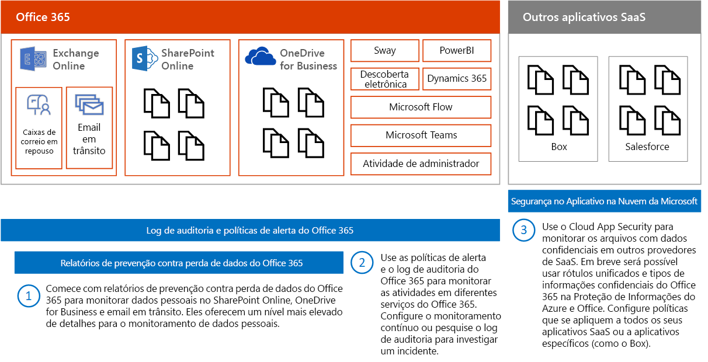
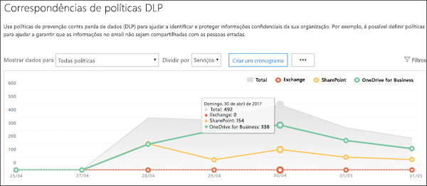
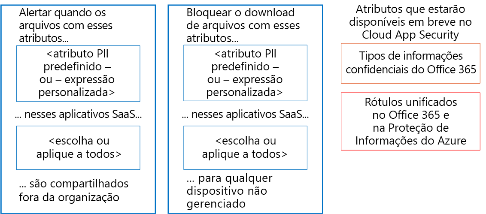
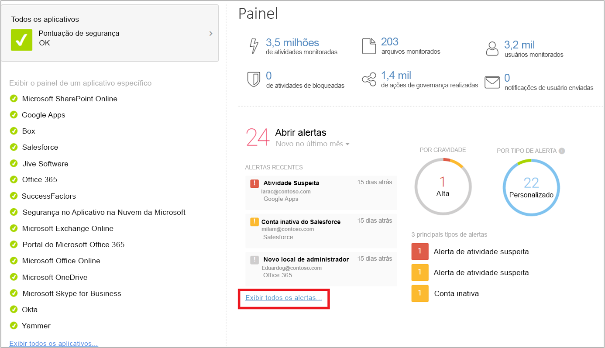

# Monitorar o vazamento de dados pessoais

[!INCLUDE [Microsoft 365 Defender rebranding](../includes/microsoft-defender-for-office.md)]

Existem várias ferramentas disponíveis destinadas a monitorar o uso e o transporte de dados pessoais. Este tópico descreve três ferramentas muito úteis.

Na ilustração:

- Comece com os relatórios de prevenção contra perda de dados do Microsoft 365 para monitorar dados pessoais no Microsoft Office SharePoint Online, OneDrive for Business e nos emails em trânsito. Eles oferecem o maior nível de detalhes para monitorar dados pessoais. No entanto, estes relatórios não incluem todos os serviços do Office 365.

- Em seguida, use políticas de alerta e logs de auditoria para monitorar as atividades entre os serviços. Configure o monitoramento contínuo ou pesquise no log de auditoria para investigar um incidente. O log de auditoria funciona entre serviços: Sway, PowerBI, eDiscovery, Dynamics 365, Microsoft Flow, Microsoft Teams, atividades de administração, OneDrive for Business, Microsoft Office SharePoint Online, email em trânsito e caixas de correio em repouso. As conversas do Skype estão incluídas nas caixas de correio em repouso.

- Por fim, use o Microsoft Cloud App Security para monitorar arquivos com dados confidenciais em outros provedores de SaaS. Em breve, você poderá usar os tipos de informações confidenciais e os rótulos unificados na Proteção de Informações do Azure e no Office com o Cloud App Security. Você pode configurar políticas que se aplicam a todos os aplicativos SaaS ou aplicativos específicos (como o Box). O Cloud App Security não descobre arquivos no Exchange Online, incluindo arquivos anexados a emails.

## Relatórios de prevenção contra perda de dados

Após criar as políticas DLP (prevenção contra perda de dados), convém verificar se elas estão funcionando conforme esperado e se estão ajudando a manter a conformidade. Com os relatórios DLP do Office 365, você pode exibir rapidamente o número de falsos positivos, substituições ou correspondências de regra e política DLP; verificar se elas estão mais ou menos populares ao longo do tempo; filtrar o relatório de várias maneiras e exibir mais detalhes selecionando um ponto em uma linha no gráfico.

Você pode usar os relatórios DLP para:

- Se concentrar em períodos de tempo específicos e entender os motivos para picos e tendências.
- Descobrir processos empresariais que violam as políticas DLP da organização.
- Compreender qualquer impacto nos negócios das políticas de DLP.
- Exiba as justificativas enviadas pelos usuários quando eles resolverem uma dica de política substituindo a política ou relatando um falso positivo.
- Verificar a conformidade com uma determinada política DLP mostrando as correspondências dessa política.
- Exibir uma lista de arquivos com dados confidenciais que correspondem às políticas DLP no painel de detalhes.

Além disso, você pode usar os relatórios de DLP para ajustar suas políticas DLP conforme as executa no modo de teste.

Os relatórios da DLP estão no Centro de conformidade do Microsoft 365. Vá para a seção **Relatórios** \> de **dados organizacionais** para localizar as **correspondências de política da DLP**, **incidentes de DLP** e **falsos positivos e relatórios de substituições da DLP**.

Para saber mais, confira o artigo [Exibir o relatório de prevenção contra perda de dados](../../compliance/view-the-dlp-reports.md).

## Log de Auditoria e políticas de alerta

O log de auditoria contém os eventos do Exchange Online, do Microsoft Office SharePoint Online, do OneDrive for Business, do Azure Active Directory, do Microsoft Teams, do Power BI, do Sway e de outros serviços.

O portal do Microsoft 365 Defender e o Centro de conformidade do Microsoft 365 fornecem duas maneiras de monitorar e relatar o log de auditoria:

- Configure as políticas de alerta, exiba os alertas e monitore as tendências - use a política de alerta e as ferramentas do painel de alerta no portal do Microsoft 365 Defender ou no Centro de conformidade do Microsoft 365.
- Pesquisar diretamente no log de auditoria – você pode pesquisar todos os eventos em um intervalo de datas especificado ou filtrar os resultados com base em determinados critérios; por exemplo, o usuário que executou a ação, a ação ou o objeto de destino.

As equipes de segurança e conformidade das informações podem usar essas ferramentas para analisar proativamente as atividades realizadas pelos usuários finais e administradores em vários serviços. Os alertas automáticos podem ser configurados para enviar notificações por email quando determinadas atividades ocorrerem em conjuntos de sites específicos, por exemplo, quando o conteúdo é compartilhado de sites conhecidos por conter informações relacionadas ao GDPR é compartilhado. Isso permite que essas equipes acompanhem os usuários para garantir que as políticas de segurança corporativa sejam seguidas ou para fornecer treinamento adicional.

As equipes de segurança de informações podem também pesquisar o log de auditoria para investigar suspeitas de violação de dados, bem como determinar a causa raiz e a abrangência da violação. Esta funcionalidade interna facilita o cumprimento dos artigos 33 e 34 do GDPR, que exige o envio de notificações sobre violação de dados à autoridade supervisora do GDPR e aos detentores dos dados, em um período específico. As entradas do log de auditoria são mantidas apenas por 90 dias no serviço. Recomendamos e a maioria das organizações exige que esses logs sejam mantidos por mais tempo.

Existem soluções disponíveis, com as quais é possível inscrever-se nos logs de auditoria unificados por meio da API da Atividade de Gestão da Microsoft, que podem armazenar as entradas do log conforme necessário, além de fornecer alertas e painéis avançados. Por exemplo, o [OMS (Microsoft Operations Management Suite)](/azure/operations-management-suite/oms-solution-office-365).

Clique nos links abaixo para saber mais sobre as políticas de alerta e como pesquisar no log de auditoria.

- [Políticas de alerta no Microsoft 365](../../compliance/alert-policies.md)
- [Pesquisar as atividades do administrador e dos usuários no log de auditoria do Office 365](../../compliance/search-the-audit-log-in-security-and-compliance.md) (introdução)
- [Ativar ou desativar a pesquisa de log de auditoria](../../compliance/turn-audit-log-search-on-or-off.md)
- [Pesquisas o log de auditoria](../../compliance/search-the-audit-log-in-security-and-compliance.md)
- [Search-UnifiedAuditLog](/powershell/module/exchange/search-unifiedauditlog) (cmdlet)
- [Propriedades detalhadas no log de auditoria](../../compliance/detailed-properties-in-the-office-365-audit-log.md)

## Microsoft Cloud App Security

O Microsoft Cloud App Security ajuda a descobrir outros aplicativos SaaS em uso nas redes e os dados confidenciais enviados desses aplicativos ou para eles.

O Microsoft Cloud App Security é um serviço abrangente que fornece visibilidade ampliada, controles granulares e proteção aprimorada para os aplicativos de nuvem. Ele identifica mais de 15 mil aplicativos de nuvem na rede, em todos os dispositivos, além de fornecer análise, avaliação e pontuação de risco contínuas. Não são necessários agentes: os dados são coletados nos firewalls e proxies para que você tenha contexto e visibilidade completa do uso da nuvem e da Shadow IT.

Para entender melhor o ambiente de nuvem, o recurso de investigação do Cloud App Security fornece uma ampla visibilidade de atividades, arquivos e contas para aplicativos gerenciados e sancionados. Você pode obter informações detalhadas em nível de arquivo e descobrir o deslocamento dos dados nos aplicativos de nuvem.

Por exemplo, a ilustração a seguir mostra duas políticas do Cloud App Security que podem ajudar com o GDPR.

A primeira política alerta quando os arquivos escolhidos, que incluem expressões personalizadas ou atributos de PII predefinidos, são compartilhados fora da organização nos aplicativos SaaS.

A segunda política bloqueia os downloads de arquivos em dispositivos não gerenciados. Você escolhe os atributos que deseja procurar nos arquivos, bem como os aplicativos SaaS aos quais deseja aplicar a política.

Em breve, os seguintes tipos de atributos estarão disponíveis para o Cloud App Security:

- Tipos de informações confidenciais
- Rótulos unificados no Microsoft 365 e na Proteção de Informações do Azure

### Painel do Cloud App Security

Se ainda não começou a usar o Cloud App Security, o primeiro passo é iniciá-lo. Acesse o Cloud App Security em <https://portal.cloudappsecurity.com>.

> [!NOTE]
> Certifique-se de habilitar 'Verificar os arquivos automaticamente para os rótulos de classificação da Proteção de Informações do Azure' (em Configurações gerais) ao começar a usar o Cloud App Security ou antes de atribuir os rótulos. Após a configuração, o Cloud App Security não verifica os arquivos existentes novamente até que sejam modificados.

Mais informações:

- [Implantar o Cloud App Security](/cloud-app-security/getting-started-with-cloud-app-security)
- [Mais informações sobre o Microsoft Cloud App Security](https://www.microsoft.com/cloud-platform/cloud-app-security)
- [Bloqueando downloads de informações confidenciais usando o proxy do Microsoft Cloud App Security](/cloud-app-security/use-case-proxy-block-session-aad)

## Políticas de atividade e arquivo de exemplo para detectar o compartilhamento de dados pessoais

### Detectar compartilhamento de arquivos que contêm informações de identificação pessoal: número de cartão de crédito

Alerta quando um arquivo que contém um número de cartão de crédito é compartilhado em um aplicativo de nuvem aprovado.

 

****

|Controle|Configurações|
|---|---|
|Tipo de política|Política de arquivo|
|Modelo de política|Sem modelo|
|Severidade da política|Alta|
|Categoria|DLP|
|Configurações de Filtro|Nível de acesso = Público (Internet), público, externo 
 Aplicativos = \<select apps\>(use esta configuração se quiser limitar o monitoramento a aplicativos SaaS específicos)|
|Aplicar a|Todos os arquivos, todos os proprietários|
|Inspeção de conteúdo|Inclui os arquivos que correspondam a uma expressão presente: "Todos os países: finanças: número do cartão de crédito" 
 Não exige contexto relevante: não selecionado (essa configuração corresponde a palavras-chave e expressões regulares) 
 Inclui arquivos com pelo menos uma correspondência 
 Remover a máscara dos quatro últimos caracteres da violação: selecionado|
|Alertas|Criar um alerta para cada arquivo correspondente: selecionado 
 Limite diário de alerta: 1.000 
 Selecionar um alerta como email: selecionado 
 Para: infosec@contoso.com|
|Gestão|Microsoft OneDrive for Business 
 Tornar particular: selecionar "Remover usuários externos" 
 Todas as outras configurações: não selecionadas 
 Microsoft SharePoint Online 
 Tornar particular: selecionar "Remover usuários externos" 
 Todas as outras configurações: não selecionadas|
|

Políticas semelhantes:

- Detectar compartilhamento de arquivos que contêm informações de identificação pessoal: endereço de email
- Detectar compartilhamento de arquivos que contêm informações de identificação pessoal: número do passaporte

### Detectar clientes ou dados de RH no Box ou no OneDrive for Business

Alerta quando um arquivo rotulado como "Dados do cliente" ou "Dados de RH" é carregado no Box ou no OneDrive for Business.

Observações:

- o monitoramento do Box exige configurar um conector com o SDK do conector de API.
- Essa política exige funcionalidades que estão atualmente em visualização privada.

 

****

|Controle|Configurações|
|---|---|
|Tipo de política|Política de atividade|
|Modelo de política|Sem modelo|
|Severidade da política|Alta|
|Categoria|Controle de Compartilhamento|
|Atuar em|Atividade única|
|Configurações de Filtro|Tipo de atividade = carregar arquivo 
 Aplicativo = Microsoft OneDrive for Business e Box 
 Rótulo de classificação (atualmente em visualização privada): Proteção de Informações do Azure = Dados do cliente, Recursos humanos: dados de salário; Recursos humanos: dados do funcionário|
|Alertas|Criar um alerta: selecionado 
 Limite diário de alerta: 1.000 
 Selecionar um alerta como email: selecionado 
 Para: infosec@contoso.com|
|Gestão|Todos os aplicativos 
 Colocar o usuário em quarentena: selecionar 
 Todas as outras configurações: não selecionadas 
 Office 365 
 Colocar o usuário em quarentena: selecionar 
 Todas as outras configurações: não selecionadas|
|

Políticas semelhantes:

- Detectar grandes downloads de dados do cliente ou de dados de RH: alertar quando for detectada uma grande quantidade de arquivos que contêm dados de clientes ou de RH sendo baixada por um único usuário, dentro de um curto período.
- Detectar o compartilhamento de dados de clientes e de RH: alertar quando os arquivos com dados de clientes ou de RH são compartilhados.
