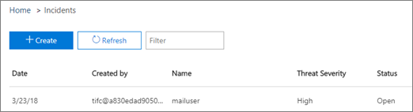

# Investigação e resposta a ameaçasThreat investigation and response

[!INCLUDE [Microsoft 365 Defender rebranding](../includes/microsoft-defender-for-office.md)]

**Aplica-se a****Applies To**
- [Plano 2 do Microsoft Defender para Office 365Microsoft Defender for Office 365 plan 2](office-365-atp.md)

Os recursos de investigação e resposta contra ameaças no [Microsoft Defender para Office 365](office-365-atp.md) ajudam os analistas e administradores de segurança a proteger o Microsoft 365 para usuários comerciais da organização:Threat investigation and response capabilities in [Microsoft Defender for Office 365](office-365-atp.md) help security analysts and administrators protect their organization's Microsoft 365 for business users by:

- Facilitando a identificação, o monitoramento e a compreensão de ataques cibernéticosMaking it easy to identify, monitor, and understand cyberattacks
- Ajudando a lidar rapidamente com ameaças no Exchange Online, SharePoint Online, OneDrive for Business e Microsoft TeamsHelping to quickly address threats in Exchange Online, SharePoint Online, OneDrive for Business and Microsoft Teams
- Fornecendo informações e conhecimento para ajudar as operações de segurança a evitar ataques cibernéticos contra sua organizaçãoProviding insights and knowledge to help security operations prevent cyberattacks against their organization
- Empregando [investigação e resposta automatizadas no Office 365](automated-investigation-response-office.md) para ameaças críticas baseadas em emailEmploying [automated investigation and response in Office 365](automated-investigation-response-office.md) for critical email-based threats

Os recursos de investigação e resposta contra ameaças fornecem informações sobre ameaças e ações de resposta relacionadas que estão disponíveis no Centro de Conformidade & Segurança.Threat investigation and response capabilities provide insights into threats and related response actions that are available in the Security & Compliance Center. Essas percepções podem ajudar a equipe de segurança da sua organização a proteger os usuários contra ataques baseados em email ou arquivos.These insights can help your organization's security team protect users from email- or file-based attacks. Os recursos ajudam a monitorar sinais e coletar dados de várias fontes, como atividade do usuário, autenticação, email, PCs comprometidos e incidentes de segurança.The capabilities help monitor signals and gather data from multiple sources, such as user activity, authentication, email, compromised PCs, and security incidents. Os tomadores de decisão de negócios e sua equipe de operações de segurança podem usar essas informações para entender e responder a ameaças contra sua organização e proteger sua propriedade intelectual.Business decision makers and your security operations team can use this information to understand and respond to threats against your organization and protect your intellectual property.

## Conheça as ferramentas de investigação e resposta contra ameaçasGet acquainted with threat investigation and response tools

Os recursos de investigação e resposta contra ameaças são a superfície no Centro de Conformidade & segurança, como um conjunto de ferramentas e fluxos de trabalho de resposta, incluindo o seguinte:Threat investigation and response capabilities surface in the Security & Compliance Center, as a set of tools and response workflows, including the following:

- [Painel de ameaçasThreat dashboard](#threat-dashboard)
- [ExploradorExplorer](#threat-explorer)
- [IncidentesIncidents](#incidents)
- [Simulador de AtaqueAttack Simulator](#attack-simulator)
- [Resposta e investigação automatizadasAutomated investigation and response](automated-investigation-response-office.md)

### Painel de ameaçasThreat dashboard

Use o painel De ameaças (também chamado de painel de [segurança)](security-dashboard.md)para ver rapidamente quais ameaças foram abordadas e como uma maneira visual de relatar aos tomadores de decisão comerciais como os serviços do Microsoft 365 estão garantindo sua empresa.Use the Threat dashboard (this is also referred to as the [Security dashboard](security-dashboard.md)) to quickly see what threats have been addressed, and as a visual way to report to business decision makers how Microsoft 365 services are securing your business.

Para exibir e usar esse painel, no Centro de Conformidade & segurança, vá para **Painel de gerenciamento de** \> **ameaças.**To view and use this dashboard, in the Security & Compliance Center, go to **Threat management** \> **Dashboard**.

### Explorador de AmeaçasThreat Explorer

Use o Explorador de Ameaças (e detecções em tempo [real)](threat-explorer.md) para analisar ameaças, ver o volume de ataques ao longo do tempo e analisar dados por famílias de ameaças, infraestrutura de invasores e muito mais.Use [Threat Explorer (and real-time detections)](threat-explorer.md) to analyze threats, see the volume of attacks over time, and analyze data by threat families, attacker infrastructure, and more. O Explorador de Ameaças (também conhecido como Explorer) é o ponto de partida para o fluxo de trabalho de investigação de qualquer analista de segurança.Threat Explorer (also referred to as Explorer) is the starting place for any security analyst's investigation workflow.

Para exibir e usar esse relatório, no Centro de Conformidade & segurança, vá para **o Explorador de gerenciamento de** \> **ameaças.**To view and use this report, in the Security & Compliance Center, go to **Threat management** \> **Explorer**.

### IncidentesIncidents

Use a lista Incidentes (isso também é chamado de Investigações) para ver uma lista de incidentes de segurança de voo.Use the Incidents list (this is also called Investigations) to see a list of in flight security incidents. Os incidentes são usados para rastrear ameaças, como mensagens de email suspeitas, e para conduzir investigações e correções posteriores.Incidents are used to track threats such as suspicious email messages, and to conduct further investigation and remediation.

Para exibir a lista de incidentes atuais para sua organização, no Centro de Conformidade & Segurança, acesse **Incidentes** de revisão de gerenciamento \>  \> **de ameaças.**To view the list of current incidents for your organization, in the Security & Compliance Center, go to **Threat management** \> **Review** \> **Incidents**.

### Simulador de AtaqueAttack Simulator

Use o Simulador de Ataque para configurar e executar ataques cibernéticos realistas em sua organização e identificar pessoas vulneráveis antes que um ataque cibernético real afete sua empresa.Use Attack Simulator to set up and run realistic cyberattacks in your organization, and identify vulnerable people before a real cyberattack affects your business. Para saber mais, confira [Simulador de Ataque no Office 365](attack-simulator.md).To learn more, see [Attack Simulator in Office 365](attack-simulator.md).

### Investigação e resposta automatizadasAutomated investigation and response

Use recursos automatizados de investigação e resposta (AIR) para economizar tempo e esforço correlacionando conteúdo, dispositivos e pessoas em risco contra ameaças em sua organização.Use automated investigation and response (AIR) capabilities to save time and effort correlating content, devices, and people at risk from threats in your organization. Os processos AIR podem começar sempre que determinados alertas são disparados ou quando iniciados pela equipe de operações de segurança.AIR processes can begin whenever certain alerts are triggered, or when started by your security operations team. Para saber mais, confira [investigação e resposta automatizadas no Office 365](automated-investigation-response-office.md).To learn more, see [automated investigation and response in Office 365](automated-investigation-response-office.md).

## Widgets de inteligência contra ameaçasThreat intelligence widgets

Como parte da oferta do Plano 2 do Microsoft Defender para Office 365, os analistas de segurança podem revisar detalhes sobre uma ameaça conhecida.As part of the Microsoft Defender for Office 365 Plan 2 offering, security analysts can review details about a known threat. Isso é útil para determinar se há medidas/etapas preventivas adicionais que podem ser tomadas para manter os usuários seguros.This is useful to determine whether there are additional preventative measures/steps that can be taken to keep users safe.

## Como obter esses recursos?How do we get these capabilities?

Os recursos de investigação e resposta contra ameaças do Microsoft 365 estão incluídos no Microsoft Defender para Office 365 Plano 2, que está incluído no Enterprise E5 ou como complemento para determinadas assinaturas.Microsoft 365 threat investigation and response capabilities are included in Microsoft Defender for Office 365 Plan 2, which is included in Enterprise E5 or as an add-on to certain subscriptions. Para saber mais, consulte [Defender for Office 365 Plan 1 e Plan 2](office-365-atp.md#microsoft-defender-for-office-365-plan-1-and-plan-2).To learn more, see [Defender for Office 365 Plan 1 and Plan 2](office-365-atp.md#microsoft-defender-for-office-365-plan-1-and-plan-2).

## Funções e permissões necessáriasRequired roles and permissions

O Microsoft Defender para Office 365 usa controle de acesso baseado em função.Microsoft Defender for Office 365 uses role-based access control. As permissões são atribuídas por meio de determinadas funções no Azure Active Directory, no Centro de administração do Microsoft 365 ou no Centro de Conformidade & Segurança.Permissions are assigned through certain roles in Azure Active Directory, the Microsoft 365 admin center, or the Security & Compliance Center.

> [!TIP]
> Embora algumas funções, como Administrador de Segurança, possam ser atribuídas no Centro de Conformidade & Segurança, considere usar o Centro de administração do Microsoft 365 ou o Azure Active Directory.Although some roles, such as Security Administrator, can be assigned in the Security & Compliance Center, consider using either the Microsoft 365 admin center or Azure Active Directory instead. Para obter informações sobre funções, grupos de funções e permissões, consulte os seguintes recursos:For information about roles, role groups, and permissions, see the following resources:
>
> - [Permissões no Centro de Segurança e ConformidadePermissions in the Security & Compliance Center](permissions-in-the-security-and-compliance-center.md)
>
> - [Permissões da função de administrador no Azure Active DirectoryAdministrator role permissions in Azure Active Directory](/azure/active-directory/users-groups-roles/directory-assign-admin-roles)

****

|AtividadeActivity|Funções e permissõesRoles and permissions|
|---|---|
|Use o painel De ameaças (ou o novo [painel de segurança)](security-dashboard.md)Use the Threat dashboard (or the new [Security dashboard](security-dashboard.md)) 
 Exibir informações sobre ameaças recentes ou atuaisView information about recent or current threats|Uma das seguintes opções:One of the following: <ul><li>**Administrador Global****Global Administrator**</li><li>**Administrador de Segurança****Security Administrator**</li><li>**Leitor de Segurança****Security Reader**</li></ul> 
 Essas funções podem ser atribuídas no Azure Active Directory ( ) ou no Centro de administração <https://portal.azure.com> do Microsoft 365 ( <https://admin.microsoft.com> ).These roles can be assigned in either Azure Active Directory (<https://portal.azure.com>) or the Microsoft 365 admin center (<https://admin.microsoft.com>).|
|Usar [o Explorador de Ameaças (e detecções](threat-explorer.md) em tempo real) para analisar ameaçasUse [Threat Explorer (and real-time detections)](threat-explorer.md) to analyze threats|Uma das seguintes opções:One of the following: <ul><li>**Administrador Global****Global Administrator**</li><li>**Administrador de Segurança****Security Administrator**</li><li>**Leitor de Segurança****Security Reader**</li></ul> 
 Essas funções podem ser atribuídas no Azure Active Directory ( ) ou no Centro de administração <https://portal.azure.com> do Microsoft 365 ( <https://admin.microsoft.com> ).These roles can be assigned in either Azure Active Directory (<https://portal.azure.com>) or the Microsoft 365 admin center (<https://admin.microsoft.com>).|
|Exibir Incidentes (também conhecido como Investigações)View Incidents (also referred to as Investigations) 
 Adicionar mensagens de email a um incidenteAdd email messages to an incident|Uma das seguintes opções:One of the following: <ul><li>**Administrador Global****Global Administrator**</li><li>**Administrador de Segurança****Security Administrator**</li><li>**Leitor de Segurança****Security Reader**</li></ul> 
 Essas funções podem ser atribuídas no Azure Active Directory ( ) ou no Centro de administração <https://portal.azure.com> do Microsoft 365 ( <https://admin.microsoft.com> ).These roles can be assigned in either Azure Active Directory (<https://portal.azure.com>) or the Microsoft 365 admin center (<https://admin.microsoft.com>).|
|Disparar ações de email em um incidenteTrigger email actions in an incident 
 Encontrar e excluir mensagens de email suspeitasFind and delete suspicious email messages|Uma das seguintes opções:One of the following: <ul><li>**Administrador Global****Global Administrator**</li><li>**Administrador de Segurança** mais a **função Pesquisar e Limpar****Security Administrator** plus the **Search and Purge** role</li></ul> 
 As **funções administrador global** **e** administrador de segurança podem ser atribuídas no Azure Active Directory ( ) ou no Centro de administração do <https://portal.azure.com> Microsoft 365 ( <https://admin.microsoft.com> ).The **Global Administrator** and **Security Administrator** roles can be assigned in either Azure Active Directory (<https://portal.azure.com>) or the Microsoft 365 admin center (<https://admin.microsoft.com>). 
 A **função De pesquisa e** limpeza deve ser atribuída no Centro de Conformidade & Segurança ( <https://protection.office.com> ).The **Search and Purge** role must be assigned in the Security & Compliance Center (<https://protection.office.com>).|
|Integrar o Microsoft Defender para Office 365 Plano 2 com o Microsoft Defender para Ponto de ExtremidadeIntegrate Microsoft Defender for Office 365 Plan 2 with Microsoft Defender for Endpoint  
 Integrar o Microsoft Defender para Office 365 Plano 2 com um servidor SIEMIntegrate Microsoft Defender for Office 365 Plan 2 with a SIEM server|A função **Administrador Global ou** Administrador de **Segurança** atribuída no Azure Active Directory ( ) ou no Centro de administração do <https://portal.azure.com> Microsoft 365 ( <https://admin.microsoft.com> ).Either the **Global Administrator** or the **Security Administrator** role assigned in either Azure Active Directory (<https://portal.azure.com>) or the Microsoft 365 admin center (<https://admin.microsoft.com>). 
 --- **plus** --- --- **plus** --- 
 Uma função apropriada atribuída a aplicativos adicionais (como o Centro de Segurança do [Microsoft Defender](/windows/security/threat-protection/microsoft-defender-atp/user-roles) ou seu servidor SIEM).An appropriate role assigned in additional applications (such as [Microsoft Defender Security Center](/windows/security/threat-protection/microsoft-defender-atp/user-roles) or your SIEM server).|
|

## Próximas etapasNext steps

- [Saiba mais sobre Rastreadores de Ameaças - Novo e NotávelLearn about Threat Trackers - New and Noteworthy](threat-trackers.md)

- [Encontre e investigue emails mal-intencionados que foram entregues (Investigação e Resposta contra Ameaças do Office 365)Find and investigate malicious email that was delivered (Office 365 Threat Investigation and Response)](investigate-malicious-email-that-was-delivered.md)

- [Integrar a Investigação e Resposta contra Ameaças do Office 365 com o Microsoft Defender para Ponto de ExtremidadeIntegrate Office 365 Threat Investigation and Response with Microsoft Defender for Endpoint](integrate-office-365-ti-with-wdatp.md)

- [Saiba mais sobre o Simulador de AtaqueLearn about Attack Simulator](attack-simulator.md)