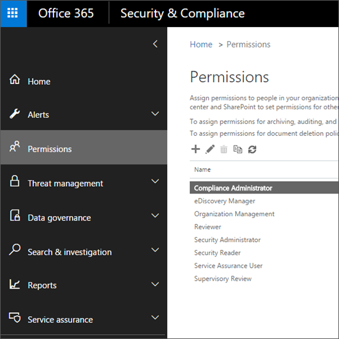

# Permissões no Centro de Conformidade e Segurança do Office 365Permissions in the Office 365 Security & Compliance Center

O centro de conformidade & segurança do Office 365 permite que você conceda permissões a pessoas que executam tarefas de conformidade, como gerenciamento de dispositivos, prevenção de perda de dados, eDiscovery, retenção e assim por diante.The Office 365 Security & Compliance Center lets you grant permissions to people who perform compliance tasks like device management, data loss prevention, eDiscovery, retention, and so on. Essas pessoas podem realizar apenas as tarefas para as quais você concedeu acesso especificamente.These people can perform only the tasks that you explicitly grant them access to. Para acessar o centro de conformidade do & de segurança, os usuários precisam ser um administrador global do Office 365 ou um membro de um ou mais grupos de funções de segurança & centro de conformidade.To access the Security & Compliance Center, users need to be an Office 365 global administrator or a member of one or more Security & Compliance Center role groups.

As permissões no centro de conformidade & segurança são baseadas no modelo de permissões RBAC (controle de acesso baseado em função).Permissions in the Security & Compliance Center are based on the Role Based Access Control (RBAC) permissions model. Este é o mesmo modelo de permissões que é usado pelo Exchange, portanto, se você estiver familiarizado com o Exchange, conceder permissões no centro de conformidade de & de segurança serão muito semelhantes.This is the same permissions model that's used by Exchange, so if you're familiar with Exchange, granting permissions in the Security & Compliance Center will be very similar. No entanto, é importante lembrar que os grupos de funções e os grupos de funções do centro de conformidade de & de segurança do Exchange não compartilham associações ou permissões.It's important to remember, however, that Exchange role groups and Security & Compliance Center role groups don't share membership or permissions. Eles não são os mesmos, visto que ambos possuem um grupo de funções de Gerenciamento de Organização.While both have an Organization Management role group, they aren't the same. As permissões que concedem e os membros dos grupos de função são diferentes.The permissions they grant, and the members of the role groups, are different. Há uma lista de grupos de funções do centro de conformidade de & de segurança abaixo.There's a list of Security & Compliance Center role groups below.

## Relação de membros, funções e grupos de funçãoRelationship of members, roles, and role groups

Uma **função** concede permissões para realizar um conjunto de tarefas; por exemplo, a função de Gerenciamento de Casos permite que as pessoas trabalhem em casos de Descoberta Eletrônica.A **role** grants permissions to do a set of tasks; for example, the Case Management role lets people work with eDiscovery cases.

Um **grupo de função** é um conjunto de funções que permite que as pessoas realizem seu trabalho no centro de conformidade & segurança; por exemplo, o grupo de funções de administrador de conformidade inclui as funções para gerenciamento de casos, pesquisa de conteúdo e configuração de organização (mais outros) porque alguém que é um administrador de conformidade precisará das permissões para que essas tarefas realizem seu trabalho.A **role group** is a set of roles that lets people perform their job across the Security & Compliance Center; for example, the Compliance Administrator role group includes the roles for Case Management, Content Search, and Organization Configuration (plus others) because someone who's a compliance admin will need the permissions for those tasks to do their job.

O centro de conformidade do & de segurança inclui grupos de função padrão para as tarefas e funções mais comuns às quais você precisará atribuir pessoas.The Security & Compliance Center includes default role groups for the most common tasks and functions that you'll need to assign people to. Recomendamos simplesmente adicionar usuários individuais como **Membros** aos grupos de função padrão.We recommend simply adding individual users as **members** to the default role groups.

Você pode editar ou excluir os grupos de função existentes, mas não recomendamos isso.You can edit or delete the existing role groups, but we don't recommend this. Em vez de editar um grupo de função padrão, você pode copiá-lo, modificá-lo e salvá-lo com um nome diferente.Instead of editing a default role group, you can copy it, modify it, and then save it with a different name.

## Permissões necessárias para usar recursos no centro de conformidade de & de segurançaPermissions needed to use features in the Security & Compliance Center

A tabela a seguir lista os grupos de função padrão que estão disponíveis no centro de conformidade & segurança e as funções atribuídas aos grupos de funções por padrão.The following table lists the default role groups that are available in the Security & Compliance Center, and the roles that are assigned to the role groups by default. Para conceder permissões a um usuário para executar uma tarefa de conformidade, adicione-os ao grupo de funções de segurança & centro de conformidade apropriado.To grant permissions to a user to perform a compliance task, add them to the appropriate Security & Compliance Center role group.

O gerenciamento de permissões no centro de conformidade de & de segurança só fornece aos usuários acesso aos recursos de conformidade disponíveis no centro de conformidade & de segurança.Managing permissions in the Security & Compliance Center only gives users access to the compliance features that are available within the Security & Compliance Center itself. Se você quiser conceder permissões a outros recursos de conformidade que não estão no centro de conformidade & segurança, como regras de fluxo de mensagens do Exchange (também conhecidas como regras de transporte), será necessário usar o centro de administração do Exchange.If you want to grant permissions to other compliance features that aren't in the Security & Compliance Center, such as Exchange mail flow rules (also known as transport rules), you need to use the Exchange admin center.

Para ver como conceder acesso ao centro de conformidade de & de segurança, confira [conceder aos usuários acesso ao centro de administração de conformidade do Office 365](grant-access-to-the-security-and-compliance-center.md).To see how to grant access to the Security & Compliance Center, check out [Give users access to Office 365 Compliance admin center](grant-access-to-the-security-and-compliance-center.md).

|**Default management role assignments for this role****Role group**|**Descrição****Description**|**Funções padrão atribuídas****Default roles assigned**|
|:-----|:-----|:-----|
|**Administrador de conformidade**1**Compliance Administrator**1|Os membros podem gerenciar configurações de gerenciamento de dispositivos, prevenção contra perda de dados, relatórios e preservação.Members can manage settings for device management, data loss prevention, reports, and preservation.|Gerenciamento de casosCase Management    Administrador de ConformidadeCompliance Administrator    Pesquisa de ConformidadeCompliance Search    Gerenciamento de conformidade de DLPDLP Compliance Management    Gerenciamento de dispositivoDevice Management    Gerenciamento de descarteDisposition Management    RetençãoHold    Gerenciamento de conformidade IBIB Compliance Management    Gerenciar AlertasManage Alerts    Configuração da organizaçãoOrganization Configuration    RecordManagementRecordManagement    Gerenciamento de retençãoRetention Management    Logs de auditoria somente para exibiçãoView-Only Audit Logs    Gerenciamento de retenção somente para exibiçãoView-Only Retention Management    Somente exibição Gerenciamento de conformidade DLPView-Only DLP Compliance Management    Gerenciamento de dispositivos somente exibiçãoView-Only Device Management    Somente exibição Gerenciamento de conformidade IBView-Only IB Compliance Management    Somente exibição Gerenciar alertasView-Only Manage Alerts    Destinatários Somente para ExibiçãoView-Only Recipients    Gerenciamento de registros somente de exibiçãoView-Only Record Management|
|**Administrador de dados de conformidade****Compliance Data Administrator**|Os membros podem gerenciar configurações de gerenciamento de dispositivos, proteção de dados, prevenção de perda de dados, relatórios e preservação.Members can manage settings for device management, data protection, data loss prevention, reports, and preservation.|Administrador de ConformidadeCompliance Administrator    Pesquisa de ConformidadeCompliance Search    Gerenciamento de conformidade de DLPDLP Compliance Management    Gerenciamento de dispositivoDevice Management    Gerenciamento de descarteDisposition Management    Gerenciamento de conformidade IBIB Compliance Management    Gerenciar AlertasManage Alerts    Configuração da organizaçãoOrganization Configuration    RecordManagementRecordManagement    Gerenciamento de retençãoRetention Management    Administrador de rótulo de confidencialidadeSensitivity Label Administrator    Logs de auditoria somente para exibiçãoView-Only Audit Logs    Somente exibição Gerenciamento de conformidade DLPView-Only DLP Compliance Management    Gerenciamento de dispositivos somente exibiçãoView-Only Device Management    Somente exibição Gerenciamento de conformidade IBView-Only IB Compliance Management    Somente exibição Gerenciar alertasView-Only Manage Alerts    Destinatários Somente para ExibiçãoView-Only Recipients    Gerenciamento de registros somente de exibiçãoView-Only Record Management    Gerenciamento de retenção somente para exibiçãoView-Only Retention Management|
|**Investigador de dados****Data Investigator**|Os membros podem realizar pesquisas em caixas de correio, sites do SharePoint e contas do OneDrive.Members can perform searches on mailboxes, SharePoint sites, and OneDrive accounts.|ComunicaçãoCommunication    Pesquisa de ConformidadeCompliance Search    CustodianCustodian    Gerenciamento de investigação de dadosData Investigation Management    ExportarExport   VisualizaçãoPreview    Descriptografia do RMSRMS Decrypt    RevisãoReview   Pesquisa e limpezaSearch And Purge|
|**Gerente de Descoberta Eletrônica****eDiscovery Manager**|Os membros podem realizar pesquisas e colocar bloqueios em caixas de correio, sites do SharePoint Online e locais do OneDrive for Business.Members can perform searches and place holds on mailboxes, SharePoint Online sites, and OneDrive for Business locations. Os membros também podem criar e gerenciar ocorrências de descoberta eletrônica, adicionar e remover membros a uma ocorrência, criar e editar pesquisas de conteúdo associadas a uma ocorrência e acessar dados de ocorrências na descoberta eletrônica avançada do Office 365.Members can also create and manage eDiscovery cases, add and remove members to a case, create and edit Content Searches associated with a case, and access case data in Office 365 Advanced eDiscovery.    Um Administrador de Descoberta Eletrônica é um membro do grupo de função de Gerente de Descoberta Eletrônica que recebeu permissões adicionais.An eDiscovery Administrator is a member of the eDiscovery Manager role group who has been assigned additional permissions. Além das tarefas que um gerente de descoberta eletrônica pode executar, um administrador de descoberta eletrônica pode:In addition to the tasks that an eDiscovery Manager can perform, an eDiscovery Administrator can:  • Exibir todos os casos de descoberta eletrônica na organização.• View all eDiscovery cases in the organization.  • Gerencie qualquer caso de descoberta eletrônica após eles se adicionarem como um membro do caso.• Manage any eDiscovery case after they add themselves as a member of the case.    A principal diferença entre um gerente de descoberta eletrônica e um administrador de descoberta eletrônica é que um administrador de descoberta eletrônica pode acessar todas as ocorrências listadas na página **ocorrências de descoberta eletrônica** no centro de conformidade do & de segurança.The primary difference between an eDiscovery Manager and an eDiscovery Administrator is that an eDiscovery Administrator can access all cases that are listed on the **eDiscovery cases** page in the Security & Compliance Center. Um gerente de descoberta eletrônica só pode acessar os casos em que eles criaram ou em que eles são membros.An eDiscovery manager can only access the cases they created or cases they are a member of. Para obter mais informações sobre como tornar um usuário administrador de descoberta eletrônica, confira [atribuir permissões de descoberta eletrônica no centro de conformidade & segurança do Office 365](../../compliance/assign-ediscovery-permissions.md).For more information about making a user an eDiscovery Administrator, see [Assign eDiscovery permissions in the Office 365 Security & Compliance Center](../../compliance/assign-ediscovery-permissions.md).|Gerenciamento de casosCase Management    ComunicaçãoCommunication    Pesquisa de ConformidadeCompliance Search    CustodianCustodian    ExportarExport    RetençãoHold    VisualizaçãoPreview    Descriptografia do RMSRMS Decrypt    RevisãoReview|
|**Administrador fluxo****MailFlow Administrator**|Os membros podem monitorar e exibir informações e relatórios de fluxo de emails no centro de conformidade do & de segurança.Members can monitor and view mail flow insights and reports in the Security & Compliance Center. Os administradores globais podem adicionar usuários comuns a esse grupo, mas, se o usuário não for um membro do grupo de administração do Exchange, o usuário não terá acesso às tarefas relacionadas ao administrador do Exchange.Global admins can add ordinary users to this group, but, if the user isn't a member of the Exchange Admin group, the user will not have access to Exchange admin-related tasks.|Destinatários Somente para ExibiçãoView-Only Recipients|
|**Gerenciamento de organização**1**Organization Management**1|Os membros podem controlar as permissões para acessar recursos no centro de conformidade de & de segurança e também gerenciar configurações de gerenciamento de dispositivos, prevenção de perda de dados, relatórios e preservação.Members can control permissions for accessing features in the Security & Compliance Center, and also manage settings for device management, data loss prevention, reports, and preservation.    Observe que, para um usuário que não seja um administrador global para ver a lista de dispositivos gerenciados pelo MDM para o Office 365 e realizar ações nesses dispositivos, como a desativação de um dispositivo de MDM para Office 365, o usuário deve ser um administrador do Exchange.Note that in order for a user who is not a global administrator to see the list of devices managed by MDM for Office 365 and perform actions on these devices, such as retiring a device from MDM for Office 365, the user must be an Exchange administrator.    Os administradores globais do Office 365 são automaticamente adicionados como membros desse grupo de função.Office 365 global admins are automatically added as members of this role group.|Logs de auditoriaAudit Logs    Gerenciamento de casosCase Management    Administrador de ConformidadeCompliance Administrator    Pesquisa de ConformidadeCompliance Search    Gerenciamento de conformidade de DLPDLP Compliance Management    Gerenciamento de dispositivoDevice Management    Gerenciamento de descarteDisposition Management    RetençãoHold    Gerenciamento de conformidade IBIB Compliance Management    Gerenciar AlertasManage Alerts    Configuração da organizaçãoOrganization Configuration    QuarentenaQuarantine    RecordManagementRecordManagement    Gerenciamento de retençãoRetention Management    Gerenciamento de funçãoRole Management    Pesquisa e limpezaSearch And Purge    Administrador de SegurançaSecurity Administrator    Leitor de segurançaSecurity Reader    Administrador de rótulo de confidencialidadeSensitivity Label Administrator    Exibição da garantia de serviçoService Assurance View    Logs de auditoria somente para exibiçãoView-Only Audit Logs    Somente exibição Gerenciamento de conformidade DLPView-Only DLP Compliance Management    Gerenciamento de dispositivos somente exibiçãoView-Only Device Management    Somente exibição Gerenciamento de conformidade IBView-Only IB Compliance Management    Somente exibição Gerenciar alertasView-Only Manage Alerts    Destinatários Somente para ExibiçãoView-Only Recipients    Gerenciamento de registros somente de exibiçãoView-Only Record Management    Gerenciamento de retenção somente para exibiçãoView-Only Retention Management|
|**Administrador de quarentena****Quarantine Administrator**|Os membros podem acessar todas as ações de quarentena.Members can access all Quarantine actions. Para obter mais informações, consulte [gerenciar mensagens em quarentena e arquivos como um administrador no Office 365](manage-quarantined-messages-and-files.md)For more information, see [Manage quarantined messages and files as an admin in Office 365](manage-quarantined-messages-and-files.md)|QuarentenaQuarantine|
|**Gerenciamento de Registros****Records Management**|Os membros podem gerenciar e descartar o conteúdo do registro.Members can manage and dispose record content.|Logs de auditoriaAudit Logs    RecordManagementRecordManagement    Gerenciamento de retençãoRetention Management|
|**Revisor****Reviewer**|Os membros só podem exibir a lista de casos na página de ocorrências de descoberta eletrônica no centro de conformidade do & de segurança.Members can only view the list of cases on the eDiscovery cases page in the Security & Compliance Center. Eles não podem criar, abrir ou gerenciar as ocorrências de Descoberta Eletrônica.They can't create, open, or manage an eDiscovery case. O principal objetivo desse grupo de função é permitir que os membros exibam e acessem dados de ocorrência no [Office 365 descoberta eletrônica avançada](../../compliance/office-365-advanced-ediscovery.md) (também conhecido como *descoberta eletrônica avançada v1*).The primary purpose of this role group is to allow members to view and access case data in [Office 365 Advanced eDiscovery](../../compliance/office-365-advanced-ediscovery.md) (also known as *Advanced eDiscovery v1*).    Esse grupo de função tem as permissões mais restritivas relacionadas a Descoberta Eletrônica.This role group has the most restrictive eDiscovery-related permissions.  **Observação:** No momento, os usuários que são membros do grupo de funções revisor não podem acessar os dados na [descoberta eletrônica avançada no Microsoft 365](../../compliance/overview-ediscovery-20.md) (também conhecido como *descoberta eletrônica avançada v2*).**Note:** At this time, users who are a member of the Reviewer role group can't access data in [Advanced eDiscovery in Microsoft 365](../../compliance/overview-ediscovery-20.md) (also known as *Advanced eDiscovery v2*). Para adicionar membros a um caso na descoberta eletrônica avançada v2 para que eles possam revisar os dados do caso, um usuário deve ser membro do grupo de função Gerenciador de descoberta eletrônica.To add members to a case in Advanced eDiscovery v2 so that they can review case data, a user must be a member of the eDiscovery Manager role group.|RevisãoReview|
|**Administrador de segurança****Security Administrator**|Os membros desse grupo de função podem incluir administradores entre serviços, além de grupos de parceiros externos e suporte da Microsoft.Members of this role group may include cross-service administrators, as well as external partner groups and Microsoft Support. Por padrão, não é possível atribuir nenhuma função a este grupo.By default, this group may not be assigned any roles. No entanto, ele será membro da função Administradores de segurança no Azure Active Directory e herdará os recursos dessa função.However, it will be a member of the Security Administrators role in Azure Active Directory and will inherit the capabilities of that role. Para gerenciar permissões centralmente, faça alterações nessa função no centro de administração do Azure Active Directory.To manage permissions centrally, make changes to this role in the Azure Active Directory admin center. Para obter mais informações, consulte [permissões de função de administrador no Azure Active Directory](https://docs.microsoft.com/azure/active-directory/users-groups-roles/directory-assign-admin-roles).For more information, see [Administrator role permissions in Azure Active Directory](https://docs.microsoft.com/azure/active-directory/users-groups-roles/directory-assign-admin-roles).    Se você editar esse grupo de função no centro de conformidade e segurança &, essas alterações serão aplicadas somente ao centro de conformidade do & de segurança e não a nenhum outro serviço, enquanto as alterações feitas no centro de administração do Azure Active Directory afetarão todos os serviços.If you edit this role group in the Security & Compliance Center, those changes apply only to the Security & Compliance Center and not any other services, whereas changes made in the Azure Active Directory admin center affect all services.    Todas as permissões somente leitura da função de leitor de segurança, além de várias permissões administrativas adicionais para os mesmos serviços: proteção de informações do Azure, centro de proteção de identidade, gerenciamento de identidade privilegiado, monitorar a integridade do serviço do Office 365 e o Office 365 Security & Compliance Center.All of the read-only permissions of the Security reader role, plus a number of additional administrative permissions for the same services: Azure Information Protection, Identity Protection Center, Privileged Identity Management, Monitor Office 365 Service Health, and Office 365 Security & Compliance Center.|Logs de auditoriaAudit Logs    Gerenciamento de conformidade de DLPDLP Compliance Management    Gerenciamento de dispositivoDevice Management    Gerenciamento de conformidade IBIB Compliance Management    Gerenciar AlertasManage Alerts    QuarentenaQuarantine    Administrador de SegurançaSecurity Administrator    Administrador de rótulo de confidencialidadeSensitivity Label Administrator    Logs de auditoria somente para exibiçãoView-Only Audit Logs    Somente exibição Gerenciamento de conformidade DLPView-Only DLP Compliance Management    Gerenciamento de dispositivos somente exibiçãoView-Only Device Management    Somente exibição Gerenciamento de conformidade IBView-Only IB Compliance Management    Somente exibição Gerenciar alertasView-Only Manage Alerts|
|**Operador de segurança****Security Operator**|Os membros podem gerenciar alertas de segurança e também exibir relatórios e configurações de recursos de segurança.Members can manage security alerts, and also view reports and settings of security features.|Pesquisa de ConformidadeCompliance Search    Gerenciar AlertasManage Alerts    Leitor de segurançaSecurity Reader    Logs de auditoria somente para exibiçãoView-Only Audit Logs    Somente exibição Gerenciamento de conformidade DLPView-Only DLP Compliance Management    Gerenciamento de dispositivos somente exibiçãoView-Only Device Management    Somente exibição Gerenciamento de conformidade IBView-Only IB Compliance Management    Somente exibição Gerenciar alertasView-Only Manage Alerts|
|**Leitor de segurança****Security Reader**|Os membros têm acesso somente leitura a vários recursos de segurança do centro de proteção de identidades, gerenciamento de identidade privilegiado, monitoramento da integridade do serviço do Office 365 e centro de conformidade do Office 365 Security &.Members have read-only access to a number of security features of Identity Protection Center, Privileged Identity Management, Monitor Office 365 Service Health, and Office 365 Security & Compliance Center.    A associação a este grupo de funções é sincronizada de forma centralizada em serviços e gerenciada centralmente.Membership in this role group is synchronized across services and managed centrally. Os membros desse grupo de função podem incluir administradores entre serviços, além de grupos de parceiros externos e suporte da Microsoft.Members of this role group may include cross-service administrators, as well as external partner groups and Microsoft Support. Por padrão, não é possível atribuir nenhuma função a este grupo.By default, this group may not be assigned any roles. No entanto, ele será um membro da função de leitores de segurança no Azure Active Directory e herdará os recursos dessa função.However, it will be a member of the Security Readers role in Azure Active Directory and will inherit the capabilities of that role. Para gerenciar permissões centralmente, faça alterações nessa função no centro de administração do Azure Active Directory-para obter mais informações, consulte [permissões de função de administrador no Azure Active Directory](https://docs.microsoft.com/azure/active-directory/users-groups-roles/directory-assign-admin-roles).To manage permissions centrally, make changes to this role in the Azure Active Directory admin center - for more information, see [Administrator role permissions in Azure Active Directory](https://docs.microsoft.com/azure/active-directory/users-groups-roles/directory-assign-admin-roles). Se você editar esse grupo de funções no centro de conformidade e segurança &, essas alterações só serão aplicadas ao centro de conformidade do & de segurança e não a nenhum outro serviço, enquanto as alterações feitas no centro de administração do Azure Active Directory afetarão todos os serviçosIf you edit this role group in the Security & Compliance Center, those changes apply only to the Security & Compliance Center and not any other services, whereas changes made in the Azure Active Directory admin center affect all services|Leitor de segurançaSecurity Reader    Somente exibição Gerenciamento de conformidade DLPView-Only DLP Compliance Management    Gerenciamento de dispositivos somente exibiçãoView-Only Device Management    Somente exibição Gerenciamento de conformidade IBView-Only IB Compliance Management    Somente exibição Gerenciar alertasView-Only Manage Alerts|
|**Usuário da Garantia do Serviço****Service Assurance User**|Os membros podem acessar a seção de garantia de serviço no centro de conformidade & segurança do Office 365.Members can access the Service assurance section in the Office 365 Security & Compliance Center. O serviço Assurance fornece relatórios e documentos que descrevem as práticas de segurança da Microsoft para dados do cliente armazenados no Office 365.Service assurance provides reports and documents that describe Microsoft's security practices for customer data that's stored in Office 365. Ele também fornece relatórios de auditoria de terceiros independentes no Office 365.It also provides independent third-party audit reports on Office 365. Confira mais informações [em garantia de serviço no centro de conformidade & segurança do Office 365](https://docs.microsoft.com/microsoft-365/compliance/service-assurance).For more information, see [Service assurance in the Office 365 Security & Compliance Center](https://docs.microsoft.com/microsoft-365/compliance/service-assurance).|Exibição da garantia de serviçoService Assurance View|
|**Revisão de Supervisão****Supervisory Review**|Os membros podem criar e gerenciar as políticas que definem quais comunicações estão sujeitas a revisão em uma organização.Members can create and manage the policies that define which communications are subject to review in an organization. Para obter mais informações, consulte [Configurar políticas de conformidade de comunicação para sua organização](../../compliance/communication-compliance-configure.md).For more information, see [Configure communication compliance policies for your organization](../../compliance/communication-compliance-configure.md).|Administrador de análise de supervisãoSupervisory Review Administrator|

> [!NOTE]
> 1 Esse grupo de função não atribui aos membros as permissões necessárias para pesquisar o log de auditoria do Office 365 ou para usar qualquer relatório que possa incluir dados do Exchange, como os relatórios DLP ou ATP.1This role group doesn't assign members the permissions necessary to search the Office 365 audit log or to use any reports that might include Exchange data, such as the DLP or ATP reports. Para pesquisar o log de auditoria ou exibir todos os relatórios, um usuário precisa receber permissões no Exchange Online.To search the audit log or to view all reports, a user has to be assigned permissions in Exchange Online. Isso ocorre porque o cmdlet subjacente usado para pesquisar o log de auditoria é um cmdlet Exchange Online.This is because the underlying cmdlet used to search the audit log is an Exchange Online cmdlet. Os administradores globais do Office 365 podem pesquisar o log de auditoria e exibir todos os relatórios, pois eles são automaticamente adicionados como membros do grupo de função gerenciamento da organização no Exchange Online.Office 365 global admins can search the audit log and view all reports because they're automatically added as members of the Organization Management role group in Exchange Online. Para saber mais, confira [Pesquisar o log de auditoria no Centro de Conformidade e Segurança do Office 365](https://docs.microsoft.com/microsoft-365/compliance/search-the-audit-log-in-security-and-compliance).For more information, see [Search the audit log in the Office 365 Security & Compliance Center](https://docs.microsoft.com/microsoft-365/compliance/search-the-audit-log-in-security-and-compliance).

## Funções no centro de conformidade & segurançaRoles in the Security & Compliance Center

A tabela a seguir lista as funções disponíveis e os grupos de funções aos quais elas estão atribuídas por padrão.The following table lists the available roles and the role groups that they're assigned to by default.

Observe que as funções a seguir não são atribuídas ao grupo de funções Gerenciamento da organização por padrão:Note that the following roles aren't assigned to the Organization Management role group by default:

- ComunicaçãoCommunication

- CustodianCustodian

- Gerenciamento de investigação de dadosData Investigation Management

- ExportarExport

- VisualizaçãoPreview

- RevisãoReview

- Descriptografia do RMSRMS Decrypt

- Administrador de análise de supervisãoSupervisory Review Administrator

|**Função****Role**|**Descrição****Description**|**Atribuições de grupo de função padrão****Default role group assignments**|
|:-----|:-----|:-----|
|**Logs de auditoria****Audit Logs**|Ative e configure a auditoria para a organização do Office 365, exiba os relatórios de auditoria da organização e exporte esses relatórios para um arquivo.Turn on and configure auditing for the Office 365 organization, view the organization's audit reports, and then export these reports to a file.|Gerenciamento de OrganizaçãoOrganization Management    Gerenciamento de RegistrosRecords Management    Administrador de SegurançaSecurity Administrator|
|**Gerenciamento de casos****Case Management**|Criar, editar, excluir e controlar o acesso a ocorrências de descoberta eletrônica.Create, edit, delete, and control access to eDiscovery cases.|Administrador de ConformidadeCompliance Administrator    Gerente de Descoberta EletrônicaeDiscovery Manager    Gerenciamento de OrganizaçãoOrganization Management|
|**Investigador de dados****Data Investigator**|Realizar pesquisas em caixas de correio, sites do SharePoint Online e locais do OneDrive for Business.Perform searches on mailboxes, SharePoint Online sites, and OneDrive for Business locations.|ExportarExport    Descriptografia do RMSRMS Decrypt    CustodianCustodian    ComunicaçãoCommunication    RevisãoReview    VisualizaçãoPreview    Pesquisa de ConformidadeCompliance Search    Gerenciamento de investigação de dadosData Investigation Management|
|**Comunicação****Communication**|Gerencie todas as comunicações com os responsáveis identificados em uma ocorrência de descoberta eletrônica avançada.Manage all communications with the custodians identified in an Advanced eDiscovery case.  Criar notificações de bloqueio, reter lembretes e escalonamentos para gerenciamento.Create hold notifications, hold reminders, and escalations to management. Rastreie a confirmação de bloqueio de responsáveis e gerencie o acesso ao portal do responsáveis que é usado por cada pessoa em um caso para rastrear as comunicações para os casos em que foram identificados como um responsáveis.Track custodian acknowledgement of hold notifications and manage access to the custodian portal that is used by each custodian in a case to track communications for the cases where they were identified as a custodian.|Gerente de Descoberta EletrônicaeDiscovery Manager|
|**Administrador de Conformidade****Compliance Administrator**|Exibir e editar configurações e relatórios de recursos de conformidade.View and edit settings and reports for compliance features.|Administrador de ConformidadeCompliance Administrator    Administrador de dados de conformidadeCompliance Data Administrator    Gerenciamento de OrganizaçãoOrganization Management|
|**Pesquisa de Conformidade****Compliance Search**|Realizar pesquisas nas caixas de correio e obter uma estimativa dos resultados.Perform searches across mailboxes and get an estimate of the results.|Administrador de ConformidadeCompliance Administrator    Administrador de dados de conformidadeCompliance Data Administrator    Gerente de Descoberta EletrônicaeDiscovery Manager    Gerenciamento de OrganizaçãoOrganization Management    Operador de segurançaSecurity Operator|
|**Custodian****Custodian**|Identificar e gerenciar os responsáveis por casos de descoberta eletrônica avançada e usar as informações do Azure Active Directory e de outras fontes para localizar fontes de dados associadas a responsáveis.Identify and manage custodians for Advanced eDiscovery cases and use the information from Azure Active Directory and other sources to find data sources associated with custodians. Associe outras fontes de dados, como caixas de correio, sites do SharePoint e equipes com os responsáveis em um caso.Associate other data sources such as mailboxes, SharePoint sites, and Teams with custodians in a case.  Coloque uma retenção legal nas fontes de dados associadas aos responsáveis para preservar o conteúdo no contexto de uma ocorrência.Place a legal hold on the data sources associated with custodians to preserve content in the context of a case.|Gerente de Descoberta EletrônicaeDiscovery Manager|
|**Gerenciamento de investigação de dados****Data Investigation Management**|Criar, editar, excluir e controlar o acesso a investigações de dados.Create, edit, delete, and control access to data investigations.|Investigador de dadosData Investigator|
|**Gerenciamento de dispositivos****Device Management**|Exibir e editar configurações e relatórios para recursos de gerenciamento de dispositivos.View and edit settings and reports for device management features.|Administrador de ConformidadeCompliance Administrator    Administrador de dados de conformidadeCompliance Data Administrator    Gerenciamento de OrganizaçãoOrganization Management    Administrador de SegurançaSecurity Administrator|
|**Gerenciamento de descarte****Disposition Management**|Controlar permissões para acessar a disposição manual no centro de conformidade de & de segurança.Control permissions for accessing Manual Disposition in the Security & Compliance Center.|Administrador de ConformidadeCompliance Administrator    Administrador de dados de conformidadeCompliance Data Administrator    Gerenciamento de OrganizaçãoOrganization Management|
|**Gerenciamento de conformidade de DLP****DLP Compliance Management**|Exibir e editar configurações e relatórios para políticas de prevenção de perda de dados (DLP).View and edit settings and reports for data loss prevention (DLP) policies.|Administrador de ConformidadeCompliance Administrator    Administrador de dados de conformidadeCompliance Data Administrator    Gerenciamento de OrganizaçãoOrganization Management    Administrador de SegurançaSecurity Administrator|
|**Export****Export**|Exportar o conteúdo do site e da caixa de correio que é retornado de pesquisas.Export mailbox and site content that's returned from searches.|Gerente de Descoberta EletrônicaeDiscovery Manager|
|**Retenção****Hold**|Coloque o conteúdo em caixas de correio, sites e pastas públicas em espera.Place content in mailboxes, sites, and public folders on hold. Quando em espera, uma cópia do conteúdo é armazenada em um local seguro.When on hold, a copy of the content is stored in a secure location. Os proprietários de conteúdo ainda poderão modificar ou excluir o conteúdo original.Content owners will still be able to modify or delete the original content.|Administrador de ConformidadeCompliance Administrator    Gerente de Descoberta EletrônicaeDiscovery Manager    Gerenciamento de OrganizaçãoOrganization Management|
|**Gerenciamento de conformidade IB****IB Compliance Management**|Exibir, criar, remover, modificar e testar políticas de barreira de informações.View, create, remove, modify, and test Information Barrier policies.|Administrador de ConformidadeCompliance Administrator    Administrador de dados de conformidadeCompliance Data Administrator    Gerenciamento de OrganizaçãoOrganization Management    Administrador de SegurançaSecurity Administrator|
|**Gerenciar alertas****Manage Alerts**|Exibir e editar configurações e relatórios de alertas.View and edit settings and reports for alerts.|Administrador de ConformidadeCompliance Administrator    Administrador de dados de conformidadeCompliance Data Administrator    Gerenciamento de OrganizaçãoOrganization Management    Administrador de SegurançaSecurity Administrator    Operador de segurançaSecurity Operator|
|**Configuração da organização****Organization Configuration**|Executar, exibir e exportar relatórios de auditoria e gerenciar políticas de conformidade para DLP, dispositivos e preservação.Run, view, and export audit reports and manage compliance policies for DLP, devices, and preservation.|Administrador de ConformidadeCompliance Administrator    Administrador de dados de conformidadeCompliance Data Administrator    Gerenciamento de OrganizaçãoOrganization Management|
|**Visualização****Preview**|Exibir uma lista de itens retornados de pesquisas de conteúdo e abrir cada item na lista para exibir seu conteúdo.View a list of items that are returned from content searches, and open each item from the list to view its contents.|Gerente de Descoberta EletrônicaeDiscovery Manager|
|**Quarentena****Quarantine**|Permite exibir e liberar emails em quarentena.Allows viewing and releasing quarantined email.|Administrador de quarentenaQuarantine Administrator    Administrador de SegurançaSecurity Administrator    Gerenciamento de OrganizaçãoOrganization Management|
|**RecordManagement****RecordManagement**|Exiba e edite a configuração e os relatórios para o recurso de gerenciamento de registros.View and edit the configuration and reports for the Record Management feature.|Administrador de ConformidadeCompliance Administrator    Administrador de dados de conformidadeCompliance Data Administrator    Gerenciamento de OrganizaçãoOrganization Management    Gerenciamento de RegistrosRecords Management|
|**Gerenciamento de retenção****Retention Management**|Gerenciar políticas de retenção.Manage retention policies.|Gerenciamento de RegistrosRecords Management    Administrador de ConformidadeCompliance Administrator    Administrador de dados de conformidadeCompliance Data Administrator    Gerenciamento de OrganizaçãoOrganization Management|
|**Examinar****Review**|Use a descoberta eletrônica avançada do Office 365 para rastrear, marcar, analisar e testar documentos atribuídos a eles.Use Office 365 Advanced eDiscovery to track, tag, analyze, and test documents that are assigned to them.|Gerente de Descoberta EletrônicaeDiscovery Manager    RevisorReviewer|
|**Descriptografia do RMS****RMS Decrypt**|Descriptografar o conteúdo protegido por RMS ao exportar resultados de pesquisa.Decrypt RMS-protected content when exporting search results.|Gerente de Descoberta EletrônicaeDiscovery Manager|
|**Gerenciamento de função****Role Management**|Gerenciar associação de grupo de função e criar ou excluir grupos de função personalizados.Manage role group membership and create or delete custom role groups.|Gerenciamento de OrganizaçãoOrganization Management|
|**Pesquisa e limpeza****Search And Purge**|Permite que as pessoas removam dados em massa que correspondam aos critérios de uma pesquisa de conteúdo.Lets people bulk-remove data that matches the criteria of a content search.|Gerenciamento de OrganizaçãoOrganization Management|
|**Administrador de segurança****Security Administrator**|Exibir e editar a configuração e os relatórios de recursos de segurança.View and edit the configuration and reports for Security features.|Gerenciamento de OrganizaçãoOrganization Management    Administrador de SegurançaSecurity Administrator|
|**Leitor de segurança****Security Reader**|Exibir a configuração e os relatórios de recursos de segurança.View the configuration and reports for Security features.|Gerenciamento de OrganizaçãoOrganization Management    Operador de segurançaSecurity Operator    Leitor de segurançaSecurity Reader|
|**Administrador de rótulo de confidencialidade****Sensitivity Label Administrator**|Exibir, criar, modificar e remover rótulos de sensibilidade.View, create, modify, and remove sensitivity labels.|Administrador de dados de conformidadeCompliance Data Administrator    Gerenciamento de OrganizaçãoOrganization Management    Administrador de SegurançaSecurity Administrator|
|**Exibição da garantia de serviço****Service Assurance View**|Baixe os documentos disponíveis da seção de garantia de serviço.Download the available documents from the Service Assurance section. O conteúdo inclui auditoria independente, documentação de conformidade e orientação relacionada à confiança para usar os recursos do Office 365 para gerenciar a conformidade normativa e os riscos de segurança.Content includes independent auditing, compliance documentation, and trust-related guidance for using Office 365 features to manage regulatory compliance and security risks.|Usuário da Garantia do ServiçoService Assurance User    Gerenciamento de OrganizaçãoOrganization Management|
|**Administrador de análise de supervisão****Supervisory Review Administrator**|Gerenciar políticas de análise de supervisão, incluindo quais comunicações revisar e quem deve realizar a revisão.Manage supervisory review policies, including which communications to review and who should perform the review.|Revisão de SupervisãoSupervisory Review|
|**Logs de auditoria somente para exibição****View-Only Audit Logs**|Exibir e exportar relatórios de auditoria.View and export audit reports. Como esses relatórios podem conter informações confidenciais, você só deve atribuir essa função a pessoas com uma necessidade explícita de exibir essas informações.Because these reports might contain sensitive information, you should only assign this role to people with an explicit need to view this information.|Administrador de ConformidadeCompliance Administrator    Administrador de dados de conformidadeCompliance Data Administrator    Gerenciamento de OrganizaçãoOrganization Management    Administrador de SegurançaSecurity Administrator    Operador de segurançaSecurity Operator|
|**Gerenciamento de dispositivos somente exibição****View-Only Device Management**|Exibir a configuração e os relatórios para o recurso de gerenciamento de dispositivos.View the configuration and reports for the Device Management feature.|Administrador de ConformidadeCompliance Administrator    Administrador de dados de conformidadeCompliance Data Administrator    Gerenciamento de OrganizaçãoOrganization Management    Administrador de SegurançaSecurity Administrator    Operador de segurançaSecurity Operator    Leitor de segurançaSecurity Reader|
|**Somente exibição Gerenciamento de conformidade DLP****View-Only DLP Compliance Management**|Exibir as configurações e relatórios das políticas de prevenção contra perda de dados (DLP).View the settings and reports for data loss prevention (DLP) policies.|Administrador de ConformidadeCompliance Administrator    Administrador de dados de conformidadeCompliance Data Administrator    Gerenciamento de OrganizaçãoOrganization Management    Administrador de SegurançaSecurity Administrator    Operador de segurançaSecurity Operator    Leitor de segurançaSecurity Reader|
|**Somente exibição Gerenciamento de conformidade IB****View-Only IB Compliance Management**|Exibir a configuração e os relatórios para o recurso de barreiras de informações.View the configuration and reports for the Information Barriers feature.|Administrador de ConformidadeCompliance Administrator    Administrador de dados de conformidadeCompliance Data Administrator    Gerenciamento de OrganizaçãoOrganization Management    Administrador de SegurançaSecurity Administrator    Operador de segurançaSecurity Operator    Leitor de segurançaSecurity Reader|
|**Somente exibição Gerenciar alertas****View-Only Manage Alerts**|Exibir a configuração e os relatórios para o recurso Gerenciar alertas.View the configuration and reports for the Manage Alerts feature.|Administrador de SegurançaSecurity Administrator    Operador de segurançaSecurity Operator    Leitor de segurançaSecurity Reader    Administrador de ConformidadeCompliance Administrator    Administrador de dados de conformidadeCompliance Data Administrator    Gerenciamento de OrganizaçãoOrganization Management|
|**Destinatários Somente para Exibição****View-Only Recipients**|Exibir informações sobre usuários e grupos.View information about users and groups.|Administrador fluxoMailFlow Administrator    Administrador de ConformidadeCompliance Administrator    Administrador de dados de conformidadeCompliance Data Administrator    Gerenciamento de OrganizaçãoOrganization Management|
|**Gerenciamento de registros somente de exibição****View-Only Record Management**|Exibir a configuração e os relatórios para o recurso de gerenciamento de registros.View the configuration and reports for the Record Management feature.|Administrador de ConformidadeCompliance Administrator    Administrador de dados de conformidadeCompliance Data Administrator    Gerenciamento de OrganizaçãoOrganization Management|
|**Gerenciamento de retenção somente para exibição****View-Only Retention Management**|Exibir a configuração e os relatórios para o recurso de gerenciamento de retenção.View the configuration and reports for the Retention Management feature.|Administrador de dados de conformidadeCompliance Data Administrator    Gerenciamento de OrganizaçãoOrganization Management    Administrador de ConformidadeCompliance Administrator|
