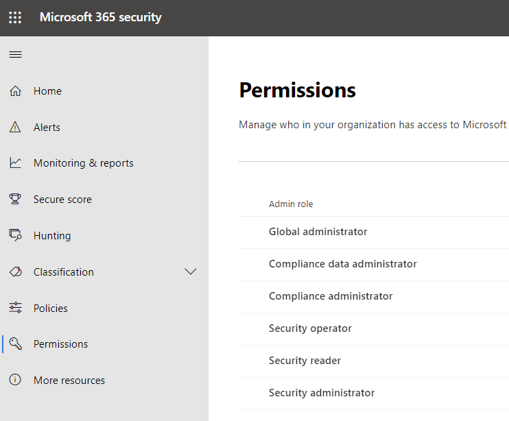
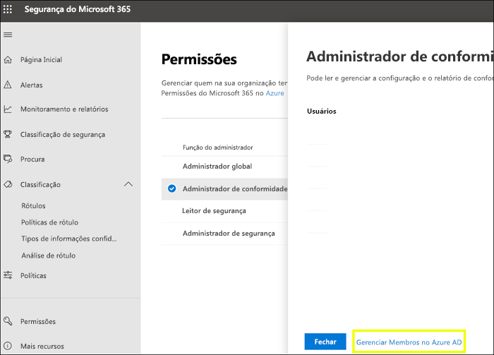
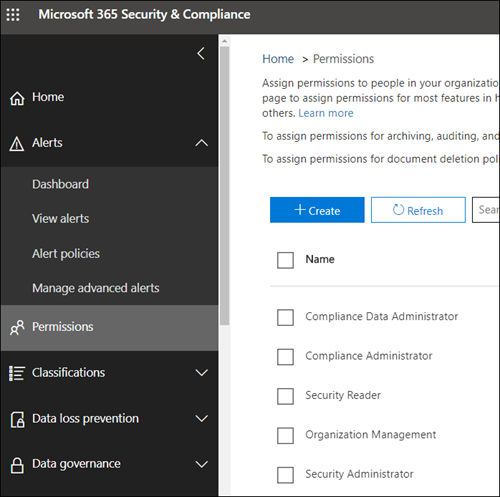

# Permissões novo centro de segurança do Microsoft 365 e no centro de conformidade do Microsoft 365Permissions in the Microsoft 365 compliance center and Microsoft 365 security center

Sua organização precisa gerenciar cenários de segurança e conformidade que abrangem todos os serviços do Microsoft 365.Your organization needs to manage security and compliance scenarios that span all the Microsoft 365 services. E você precisa ter flexibilidade para dar permissões de administrador para as pessoas certas no grupo de TI da sua organização.And you need the flexibility to give the right admin permissions to the right people in your organization's IT group. Usando a central de segurança do Microsoft 365 ou o centro de conformidade da Microsoft 365, você pode gerenciar as permissões centralmente para todas as tarefas relacionadas à segurança ou conformidade.By using the Microsoft 365 security center or Microsoft 365 compliance center, you can manage permissions centrally for all tasks related to security or compliance.

Depois que o administrador global atribuir essas funções de administrador, os administradores têm acesso aos recursos e dados que abrangem todos os serviços no Microsoft 365, como a central de segurança da Microsoft 365, o centro de conformidade da Microsoft 365, o Azure, o Office 365 e o Enterprise Mobility + Security.After the global administrator assigns these admin roles, the admins have access to features and data that span all services in Microsoft 365, such as the Microsoft 365 security center, Microsoft 365 compliance center, Azure, Office 365, and Enterprise Mobility + Security.

## Quais são as funções do Microsoft 365What the Microsoft 365 roles are

As funções que aparecem no centro de conformidade do Microsoft 365 e no centro de segurança da Microsoft 365 são funções do Azure Active Directory.The roles that appear in the Microsoft 365 compliance center and Microsoft 365 security center are Azure Active Directory roles. Essas funções foram projetadas para se alinharem com funções de trabalho no grupo de TI da sua organização, tornando mais fácil dar a uma pessoa todas as permissões necessárias para realizar o trabalho.These roles are designed to align with job functions in your organization's IT group, making it easy to give a person all the permissions necessary to get their job done.

|**Função****Role**|**Descrição****Description**|
|:-----|:-----|
|**Administrador global****Global administrator**|Os usuários com essa função têm acesso a todos os recursos administrativos em todos os serviços do Microsoft 365.Users with this role have access to all administrative features in all Microsoft 365 services. Somente os administradores globais podem atribuir outras funções de administrador.Only global administrators can assign other administrator roles.|
|**Administrador de dados de conformidade****Compliance data administrator**|Os usuários com essa função podem controlar os dados da sua organização no Microsoft 365, verificar se eles estão protegidos e obter informações para ajudar a reduzir os riscos.Users with this role can keep track of your organization's data across Microsoft 365, make sure it's protected, and get insights into any issues to help mitigate risks.|
|**Administrador de conformidade****Compliance administrator**|Os usuários que têm essa função podem ajudar sua organização a manter a conformidade com os requisitos regulamentares, gerenciar casos de descoberta eletrônica e manter políticas de governança de dados em locais, identidades e aplicativos do Microsoft 365.Users with this role can help your organization stay compliant with any regulatory requirements, manage eDiscovery cases, and maintain data governance policies across Microsoft 365 locations, identities, and apps.|
|**Operador de segurança****Security operator**|Os usuários com essa função podem exibir, investigar e responder a ameaças ativas a seus usuários, dispositivos e conteúdo da Microsoft 365.Users with this role can view, investigate, and respond to active threats to your Microsoft 365 users, devices, and content.|
|**Leitor de segurança****Security reader**|Os usuários que têm essa função podem exibir e investigar ameaças ativas a seus usuários, dispositivos e conteúdo da Microsoft 365, mas (diferentemente do operador de segurança) não têm permissões para responder executando uma ação.Users with this role can view and investigate active threats to your Microsoft 365 users, devices, and content, but (unlike the Security operator) they do not have permissions to respond by taking action.|
|**Administrador de segurança****Security administrator**|Os usuários que têm essa função podem controlar a segurança global da sua organização, gerenciando políticas de segurança, analisando análises e relatórios de segurança em produtos da Microsoft 365 e ficando sempre atualizado sobre o panorama das ameaças.Users with this role can control your organization's overall security by managing security policies, reviewing security analytics and reports across Microsoft 365 products, and staying up-to-speed on the threat landscape.|

## Ao que as funções do Microsoft 365 têm acessoWhat the Microsoft 365 roles have access to

Veja as funções disponíveis e o que as pessoas atribuídas a elas podem fazer.Here are the available roles and what people assigned to them can do.

### Administrador globalGlobal administrator

Os usuários com essa função têm acesso a todos os recursos administrativos do Azure Active Directory, bem como aos serviços que usam identidades do Azure Active Directory como centro de segurança do Microsoft 365, centro de conformidade do Microsoft 365, Exchange Online, SharePoint Online e Skype for Business Online.Users with this role have access to all administrative features in Azure Active Directory, as well as services that use Azure Active Directory identities like Microsoft 365 security center, Microsoft 365 compliance center, Exchange Online, SharePoint Online, and Skype for Business Online. A pessoa que se inscreve no locatário do Azure Active Directory torna-se um administrador global.The person who signs up for the Azure Active Directory tenant becomes a global administrator. Somente os administradores globais podem atribuir outras funções de administrador.Only global administrators can assign other administrator roles. Pode haver mais de um administrador global na sua empresa.There can be more than one global administrator at your company. Administradores globais podem redefinir a senha para qualquer usuário e todos os outros administradores.Global admins can reset the password for any user and all other administrators.

### Administrador de conformidadeCompliance administrator

Os usuários com essa função têm permissões para gerenciar recursos relacionados à conformidade no centro de conformidade do Microsoft 365, no centro de administração do Microsoft 365, no Azure e no Centro de Conformidade e Segurança do Office 365.Users with this role have permissions to manage compliance-related features in the Microsoft 365 compliance center, Microsoft 365 admin center, Azure, and Office 365 Security & Compliance Center. Os usuários também podem gerenciar todos os recursos no centro de administração do Exchange e no centro de administração do Teams e do Skype for Business e criar tíquetes de suporte para o Azure e o Microsoft 365.Users can also manage all features within the Exchange admin center and Teams & Skype for Business admin center and create support tickets for Azure and Microsoft 365.

|**Neste serviço...****In this service...**|**O administrador de conformidade pode...****The compliance administrator can...**|
|:-----|:-----|
|[**Centro de conformidade do Microsoft 365****Microsoft 365 compliance center**](https://compliance.microsoft.com/)|Proteger e gerenciar dados da sua organização em todos os serviços do Microsoft 365.Protect and manage your organization's data across Microsoft 365 services.    Gerenciar alertas de conformidade.Manage compliance alerts.|
|[**Pontuação de Conformidade****Compliance Score**](https://docs.microsoft.com/office365/securitycompliance/meet-data-protection-and-regulatory-reqs-using-microsoft-cloud)|Acompanhar, atribuir e verificar as atividades de conformidade regulatória da sua organização.Track, assign, and verify your organization's regulatory compliance activities.|
|[**Centro de Conformidade e Segurança do Office 365****Office 365 Security & Compliance Center**](https://docs.microsoft.com/office365/admin/add-users/about-admin-roles)|Gerenciar governança de dados.Manage data governance.    Executar investigação jurídica e de dados.Perform legal and data investigation.    Gerenciar solicitação do titular dos dados.Manage Data Subject Request.|
|[**Intune****Intune**](https://docs.microsoft.com/intune/role-based-access-control)|Exibir todos os dados de auditoria do Intune.View all Intune audit data.|
|[**Segurança no Aplicativo na Nuvem****Cloud App Security**](https://docs.microsoft.com/cloud-app-security/manage-admins)|Tem permissões somente leitura e pode gerenciar alertas.Has read-only permissions and can manage alerts.    Pode criar e modificar políticas de arquivo e permitir ações de governança de arquivo.Can create and modify file policies and allow file governance actions.    Pode exibir todos os relatórios internos em Gerenciamento de Dados.Can view all the built-in reports under Data Management.|

### Administrador de dados de conformidadeCompliance data administrator

Os usuários com esta função têm permissões para proteger e controlar dados no centro de conformidade do Microsoft 365, no centro de administração do Microsoft 365 e no Azure.Users with this role have permissions to protect and track data in the Microsoft 365 compliance center, Microsoft 365 admin center, and Azure. Os usuários também podem gerenciar todos os recursos no Centro de administração do Exchange, na Pontuação de Conformidade e no Centro de administração do Teams e do Skype for Business, além de criar tíquetes de suporte para o Azure e o Microsoft 365.Users can also manage all features within the Exchange admin center, Compliance Score, and Teams & Skype for Business admin center and create support tickets for Azure and Microsoft 365.

|**Neste serviço...****In this service...**|**O administrador de dados de conformidade pode...****The compliance data administrator can...**|
|:-----|:-----|
|[**Centro de conformidade do Microsoft 365****Microsoft 365 compliance center**](https://compliance.microsoft.com/)|Proteger e gerenciar dados da sua organização em todos os serviços do Microsoft 365.Protect and manage your organization's data across Microsoft 365 services.    Gerenciar alertas de conformidade.Manage compliance alerts.    Gerenciar rótulos de sensibilidadeManage sensitivity labels|
|[**Pontuação de Conformidade****Compliance Score**](https://docs.microsoft.com/office365/securitycompliance/meet-data-protection-and-regulatory-reqs-using-microsoft-cloud)|Acompanhar, atribuir e verificar as atividades de conformidade regulatória da sua organização.Track, assign, and verify your organization's regulatory compliance activities.|
|[**Centro de Conformidade e Segurança do Office 365****Office 365 Security & Compliance Center**](https://docs.microsoft.com/office365/admin/add-users/about-admin-roles)|Gerenciar governança de dados.Manage data governance.    Executar investigação jurídica e de dados.Perform legal and data investigation.    Gerenciar solicitação do titular dos dados.Manage Data Subject Request.    Gerenciar rótulos de sensibilidadeManage sensitivity labels|
|[\*\* Intune\*\*](https://docs.microsoft.com/intune/role-based-access-control) (em breve)[**Intune**](https://docs.microsoft.com/intune/role-based-access-control) (coming soon)|Exibir todos os dados de auditoria do Intune.View all Intune audit data.|
|[**Segurança no Aplicativo na Nuvem****Cloud App Security**](https://docs.microsoft.com/cloud-app-security/manage-admins)|Usar permissões somente leitura para exibir informações.Use read-only permissions to view information.  Gerenciar Alertas.Manage alerts.    Criar e modificar políticas de arquivo e permitir ações de governança de arquivo.Create and modify file policies and allow file governance actions.    Exibir todos os relatórios internos em Gerenciamento de Dados.View all the built-in reports under Data Management.|

### Administrador de segurançaSecurity administrator

Os usuários com essa função têm permissões para gerenciar recursos relacionados à segurança na central de segurança do Microsoft 365, Azure Active Directory Identity Protection, Proteção de Informações do Azure e Centro de Conformidade e Segurança do Office 365.Users with this role have permissions to manage security-related features in the Microsoft 365 security center, Azure Active Directory Identity Protection, Azure Information Protection, and Office 365 Security & Compliance Center.

|**Neste serviço...****In this service...**|**O administrador de segurança pode...****The security administrator can...**|
|:-----|:-----|
|[**Centro de segurança do Microsoft 365****Microsoft 365 security center**](https://security.microsoft.com/)|Monitorar políticas relacionadas a segurança em todos os serviços do Microsoft 365.Monitor security-related policies across Microsoft 365 services.     Gerenciar alertas e ameaças de segurança.Manage security threats and alerts.    Exibir relatórios.View reports.    Gerenciar rótulos de confidencialidade.Manage sensitivity labels.|
|**Identity Protection Center****Identity Protection Center**|Fazer tudo que o Leitor de Segurança pode fazer, além de executar todas as operações da central de proteção de identidade, exceto redefinir senhas.Do everything the Security Reader role can, plus  perform all Identity Protection Center operations, except for reset passwords.|
|[**Privileged Identity Management****Privileged Identity Management**](https://docs.microsoft.com/azure/active-directory/privileged-identity-management/pim-configure)|Realizar tudo o que o Leitor de Segurança pode fazer.Do everything the Security Reader role can.    **Não pode** gerenciar atribuições de função ou configurações do Azure AD.**Cannot** manage Azure AD role assignments or settings.|
|[**Centro de Conformidade e Segurança do Office 365****Office 365 Security & Compliance Center**](https://docs.microsoft.com/office365/admin/add-users/about-admin-roles)|Gerenciar políticas de segurança.Manage security policies.    Exibir, investigar e responder a ameaças de segurançaView, investigate, and respond to security threats    Exibir relatórios.View reports.    Gerenciar rótulos de confidencialidade.Manage sensitivity labels.|
|**Proteção Avançada contra Ameaças do Azure****Azure Advanced Threat Protection**|Monitorar e responder a atividades suspeitas de segurança.Monitor and respond to suspicious security activity.|
|**Windows Defender ATP e EDR****Windows Defender ATP and EDR**|Atribuir funções.Assign roles.    Gerenciar grupos de computadores.Manage machine groups.    Configurar a detecção de ameaças do ponto de extremidade e a correção automatizada.Configure endpoint threat detection and automated remediation.    Exibir, investigar e responder a alertas.View, investigate, and respond to alerts.|
|[**Intune****Intune**](https://docs.microsoft.com/intune/role-based-access-control)|Exibe informações de usuário, dispositivo, registro, configuração e aplicativo.Views user, device, enrollment, configuration, and application information.    **Não** pode fazer alterações no Intune.**Cannot** make changes to Intune.|
|[**Segurança no Aplicativo na Nuvem****Cloud App Security**](https://docs.microsoft.com/cloud-app-security/manage-admins)|Adicionar administradores, adicionar políticas e configurações, carregar logs e executar ações de governança.Add admins, add policies and settings, upload logs and perform governance actions.|
|[\*\* Central\*\*](https://docs.microsoft.com/azure/role-based-access-control/built-in-roles) de segurança do Azure (em breve)[**Azure Security Center**](https://docs.microsoft.com/azure/role-based-access-control/built-in-roles) (coming soon)|Exibir políticas de segurança, exibir estados de segurança, editar políticas de segurança, exibir alertas e recomendações, ignorar alertas e recomendações.View security policies, view security states, edit security policies, view alerts and recommendations, dismiss alerts and recommendations.|
|[**Integridade do serviço do Office 365****Office 365 service health**](https://docs.microsoft.com/office365/enterprise/view-service-health)|Exibir a integridade de serviços do Office 365.View the health of Office 365 services.|

### Operador de segurançaSecurity operator

Usuários com essa função podem gerenciar alertas e ter acesso global somente leitura em recurso relacionado à segurança, incluindo todas as informações no centro de segurança do Microsoft 365, no Azure Active Directory, no Identity Protection e no Privileged Identity Management, bem como a capacidade de ler logs de auditoria e relatórios de entrada do Azure Active Directory e no Centro de Conformidade e Segurança do Office 365.Users with this role can manage alerts and have global read-only access on security-related feature, including all information in the Microsoft 365 security center, Azure Active Directory, Identity Protection, Privileged Identity Management, as well as the ability to read Azure Active Directory sign-in reports and audit logs, and in Office 365 Security & Compliance Center.

|**Neste serviço...****In this service...**|**O operador de segurança pode...****The security operator can...**|
|:-----|:-----|
|[**Centro de segurança do Microsoft 365****Microsoft 365 security center**](https://security.microsoft.com/)|Realizar tudo o que o Leitor de Segurança pode fazer.Do everything the Security Reader role can.    Exibir, investigar e responder a alertas de segurança.View, investigate, and respond to security alerts.|
|**Identity Protection Center** (em breve)**Identity Protection Center** (coming soon)|Realizar tudo o que o Leitor de Segurança pode fazer.Do everything the Security Reader role can.|
|[**Privileged Identity Management****Privileged Identity Management**](https://docs.microsoft.com/azure/active-directory/privileged-identity-management/pim-configure)|Realizar tudo o que o Leitor de Segurança pode fazer.Do everything the Security Reader role can.|
|[**Centro de Conformidade e Segurança do Office 365****Office 365 Security & Compliance Center**](https://docs.microsoft.com/office365/admin/add-users/about-admin-roles)|Realizar tudo o que o Leitor de Segurança pode fazer.Do everything the Security Reader role can.    Exibir, investigar e responder a ameaças de segurançaView, investigate, and respond to security threats|
|**Windows Defender ATP e EDR****Windows Defender ATP and EDR**|Realizar tudo o que o Leitor de Segurança pode fazer.Do everything the Security Reader role can.    Exibir, investigar e responder a alertas.View, investigate, and respond to alerts.|
|[**Intune****Intune**](https://docs.microsoft.com/intune/role-based-access-control)|Exibe informações de usuário, dispositivo, registro, configuração e aplicativo.Views user, device, enrollment, configuration, and application information.    **Não** pode fazer alterações no Intune.**Cannot** make changes to Intune.|
|[**Segurança no Aplicativo na Nuvem****Cloud App Security**](https://docs.microsoft.com/cloud-app-security/manage-admins)|Realizar tudo o que o Leitor de Segurança pode fazer, além de exibir e descartar alertas.Do everything the Security Reader role can, plus view and dismiss alerts.|
|[**Integridade do serviço do Office 365****Office 365 service health**](https://docs.microsoft.com/office365/enterprise/view-service-health)|Exibir a integridade de serviços do Office 365.View the health of Office 365 services.|

### Leitor de segurançaSecurity reader

Usuários com essa função têm acesso somente leitura global em recurso relacionado à segurança, incluindo todas as informações no centro de segurança do Microsoft 365, no Azure Active Directory, no Identity Protection e no Privileged Identity Management, bem como a capacidade de ler logs de auditoria e relatórios de entrada do Azure Active Directory e no Centro de Conformidade e Segurança do Office 365.Users with this role have global read-only access on security-related feature, including all information in the Microsoft 365 security center, Azure Active Directory, Identity Protection, Privileged Identity Management, as well as the ability to read Azure Active Directory sign-in reports and audit logs, and in Office 365 Security & Compliance Center.

|**Neste serviço...****In this service...**|**O leitor de segurança pode...****The security reader can...**|
|:-----|:-----|
|[**Centro de segurança do Microsoft 365****Microsoft 365 security center**](https://security.microsoft.com/)|Exibir políticas relacionadas à segurança em todos os serviços do Microsoft 365.View security-related policies across Microsoft 365 services.    Exibir alertas e ameaças de segurança.View security threats and alerts.    Exibir relatórios.View reports.|
|**Identity Protection Center****Identity Protection Center**|Lê todas as informações sobre as configurações e os relatórios de segurança para recursos de segurança: antispam, criptografia, prevenção contra perda de dados (DLP), anti-malware, proteção avançada contra ameaças (ATP), anti-phishing e regras de fluxo de email (também conhecidas como regras de transporte).Read all security reports and settings information for security features: anti-spam, encryption, data loss prevention (DLP), anti-malware, Advanced Threat Protection (ATP), anti-phishing, and mail flow rules (also known as transport rules).|
|[**Privileged Identity Management****Privileged Identity Management**](https://docs.microsoft.com/azure/active-directory/privileged-identity-management/pim-configure)|Use o acesso somente leitura para exibir todas as informações exibidas no Azure AD PIM: políticas e relatórios de atribuições de função do Azure AD, análises de segurança e, no futuro, dados de política e relatórios para cenários além da atribuição de função do Azure AD.Use read-only access to view all information surfaced in Azure AD PIM: Policies and reports for Azure AD role assignments, security reviews, and (in the future) policy data and reports for scenarios other than Azure AD role assignment.    **Não pode** se inscrever no Azure AD PIM nem fazer alterações nele.**Cannot** sign up for Azure AD PIM or make any changes to it. No portal do PIM ou por meio do PowerShell, alguém nesta função poderá ativar funções adicionais (por exemplo, administrador global ou administrador com função com privilégios) se o usuário for elegível para a elas.In the PIM portal or via PowerShell, someone in this role can activate additional roles (for example, Global Admin or Privileged Role Administrator), if the user is a eligible for them.|
|[**Centro de Conformidade e Segurança do Office 365****Office 365 Security & Compliance Center**](https://docs.microsoft.com/office365/admin/add-users/about-admin-roles)|Exibir políticas de segurança.View security policies.    Exibir e investigar ameaças de segurança.View and investigate security threats.    Exibir relatórios.View reports.|
|**Windows Defender ATP e EDR****Windows Defender ATP and EDR**|Exibir e investigar alertas.View and investigate alerts.|
|[**Intune****Intune**](https://docs.microsoft.com/intune/role-based-access-control)|Exibe informações de usuário, dispositivo, registro, configuração e aplicativo.Views user, device, enrollment, configuration, and application information.    **Não** pode fazer alterações no Intune.**Cannot** make changes to Intune.|
|[**Segurança no Aplicativo na Nuvem****Cloud App Security**](https://docs.microsoft.com/cloud-app-security/manage-admins)|Usar permissões somente leitura para exibir informações.Use read-only permissions to view information.    Gerenciar Alertas.Manage alerts.|
|[**Central de Segurança do Azure****Azure Security Center**](https://docs.microsoft.com/azure/role-based-access-control/built-in-roles)|Exibir recomendações e alertas.View recommendations and alerts.    Exibir políticas de segurança.View security policies.    Exibir estados de segurança, mas sem poder fazer alterações.View security states, but cannot make changes.|
|[**Integridade do serviço do Office 365****Office 365 service health**](https://docs.microsoft.com/office365/enterprise/view-service-health)|Exibir a integridade de serviços do Office 365.View the health of Office 365 services.|

## Os administradores globais podem gerenciar as funções no Azure Active DirectoryGlobal administrators can manage roles in Azure Active Directory

No centro de conformidade do Microsoft 365 e no centro de segurança do Microsoft 365, ao selecionar uma função, você pode exibir suas tarefas.In the Microsoft 365 compliance center and Microsoft 365 security center, when you select a role, you can view its assignments. No entanto, para gerenciar essas tarefas, você precisa ir para o Azure Active Directory.But to manage those assignments, you need to go to the Azure Active Directory.

Para saber mais informações, consulte [Exibir e atribuir funções de administrador no Azure Active Directory](https://docs.microsoft.com/azure/active-directory/users-groups-roles/directory-manage-roles-portal).For more information, see [View and assign administrator roles in Azure Active Directory](https://docs.microsoft.com/azure/active-directory/users-groups-roles/directory-manage-roles-portal).

## Gerenciamento de funções em um serviço, em vez do Azure Active DirectoryManaging roles in a service instead of Azure Active Directory

As funções que aparecem no centro de conformidade do Microsoft 365 e no centro de segurança da Microsoft 365 também são exibidas nos serviços que têm permissões.The roles that appear in the Microsoft 365 compliance center and Microsoft 365 security center also appear in the services where they have permissions. Por exemplo, você pode ver essas funções no Centro de Conformidade e Segurança do Office 365.For example, you can see these roles in the Office 365 Security & Compliance Center.

### Interrompendo herançaBreaking inheritance

É importante compreender que quando você gerencia essas funções no Azure Active Directory, está fazendo centralmente para **todos** os serviços da Microsoft 365.It's important to understand that you when you manage these roles in Azure Active Directory, you're doing so centrally for **all** Microsoft 365 services. No entanto, ao gerenciar uma função em um serviço específico, como no Centro de Conformidade e Segurança do Office 365, você está gerenciando **apenas** a função para esse serviço específico.However, when you manage a role in a specific service, such as the Office 365 Security & Compliance Center, you're managing the role for **only** that specific service. As atribuições e permissões para uma função em um serviço substituem as permissões concedidas à função do Azure Active Directory.The assignments and permissions for a role in a service override any permissions granted to the Azure Active Directory role.

Isso pode ser útil, por exemplo, quando uma pessoa recebe a função de administrador de segurança e ela não tem permissões para gerenciar incidentes.This can be useful – for example, if a person is assigned to the Security administrator role, they don't have permissions to manage incidents. No entanto, você pode usar as permissões da proteção avançada contra ameaças do Windows Defender para conceder a eles a permissão específica de gerenciamento de incidentes naquele serviço.But you can use the permissions in Windows Defender Advanced Threat Protection to give them the specific permission for incident management in that service.

## Onde encontrar informações sobre a função de cada serviço da Microsoft 365Where to find role information for each Microsoft 365 service

Ao atribuir um usuário a uma das funções de administrador de conformidade ou segurança do Microsoft 365, conceda a essas permissões de usuário a uma série de serviços do Microsoft 365.By assigning a user to one of the Microsoft 365 compliance or security admin roles, you give that user permissions to a range of Microsoft 365 services. Use os links abaixo para saber mais sobre as permissões específicas para uma função em cada serviço.Use the links below to find more information about the specific permissions for a role in each service.

|**Serviço da Microsoft 365****Microsoft 365 service**|**Informações da função****Role info**|
|:-----|:-----|
|Funções de administrador em planos de negócios do Office 365 e do Microsoft 365Admin roles in Office 365 and Microsoft 365 business plans|[Funções de administrador do Office 365Office 365 admin roles](https://docs.microsoft.com/office365/admin/add-users/about-admin-roles?view=o365-worldwide)|
|Azure AD (Azure Active Directory) e Azure AD Identity ProtectionAzure Active Directory (Azure AD) and Azure AD Identity Protection|[Funções de administrador do Azure ADAzure AD admin roles](https://docs.microsoft.com/azure/active-directory/users-groups-roles/directory-assign-admin-roles)|
|Proteção Avançada contra Ameaças do AzureAzure Advanced Threat Protection|[Grupos de funções do ATP do AzureAzure ATP role groups](https://docs.microsoft.com/azure-advanced-threat-protection/atp-role-groups)|
|Proteção de Informações do AzureAzure Information Protection|[Funções de administrador do Azure ADAzure AD admin roles](https://docs.microsoft.com/azure/active-directory/users-groups-roles/directory-assign-admin-roles)|
|Pontuação de ConformidadeCompliance Score|[Funções da Pontuação de ConformidadeCompliance Score roles](https://docs.microsoft.com/microsoft-365/compliance/compliance-score-setup#set-user-permissions-and-assign-roles)|
|Exchange OnlineExchange Online|[Controle de acesso baseado em função do ExchangeExchange role-based access control](https://docs.microsoft.com/exchange/understanding-role-based-access-control-exchange-2013-help)|
|IntuneIntune|[Controle de acesso baseado em função do IntuneIntune role-based access control](https://docs.microsoft.com/intune/role-based-access-control)|
|Área de trabalho gerenciadaManaged Desktop|[Funções de administrador do Azure ADAzure AD admin roles](https://docs.microsoft.com/azure/active-directory/users-groups-roles/directory-assign-admin-roles)|
|Microsoft Cloud App SecurityMicrosoft Cloud App Security|[Controle de acesso baseado em funçãoRole-based access control](https://docs.microsoft.com/cloud-app-security/manage-admins)|
|Centro de Conformidade e Segurança do Office 365Office 365 Security & Compliance Center|[Funções de administrador do Office 365Office 365 admin roles](https://docs.microsoft.com/office365/SecurityCompliance/permissions-in-the-security-and-compliance-center)|
|Privileged Identity ManagementPrivileged Identity Management|[Funções de administrador do Azure ADAzure AD admin roles](https://docs.microsoft.com/azure/active-directory/users-groups-roles/directory-assign-admin-roles)|
|Classificação de SegurançaSecure Score|[Funções de administrador do Azure ADAzure AD admin roles](https://docs.microsoft.com/azure/active-directory/users-groups-roles/directory-assign-admin-roles)|
|SharePoint OnlineSharePoint Online|[Funções de administrador do Azure ADAzure AD admin roles](https://docs.microsoft.com/azure/active-directory/users-groups-roles/directory-assign-admin-roles)    [Sobre a função de administrador do SharePoint no Office 365About the SharePoint admin role in Office 365](https://docs.microsoft.com/sharepoint/sharepoint-admin-role)|
|Equipes/Skype for BusinessTeams/Skype for Business|[Funções de administrador do Azure ADAzure AD admin roles](https://docs.microsoft.com/azure/active-directory/users-groups-roles/directory-assign-admin-roles)|
|Proteção Avançada Contra Ameaças do Windows DefenderWindows Defender Advanced Threat Protection|[Controle de acesso baseado em função do Windows Defender ATPWindows Defender ATP role-based access control](https://docs.microsoft.com/windows/security/threat-protection/windows-defender-atp/rbac-windows-defender-advanced-threat-protection)|

## O que será lançado em breveWhat is coming soon

Ainda estamos trabalhando nas permissões do centro de conformidade do Microsoft 365 e do centro de segurança da Microsoft 365.We're still working on permissions in the Microsoft 365 compliance center and Microsoft 365 security center. Por exemplo, no momento estamos trabalhando para oferecer suporte à capacidade de:For example, we're currently working on support for the ability to:

- Gerenciar funções no centro de conformidade do Microsoft 365 e no centro de segurança da Microsoft 365, em vez de ir para o Azure Active Directory.Manage roles in the Microsoft 365 compliance center and Microsoft 365 security center, instead of going to Azure Active Directory.

- Personalizar funções adicionando ou removendo permissões específicas.Customize roles by adding or removing specific permissions.

- Criar funções personalizadas com as permissões que você escolher.Create custom roles with permissions that you choose.
