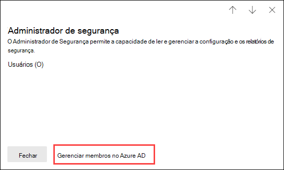

# Permissões no portal do Microsoft 365 Defender

[!INCLUDE [Microsoft 365 Defender rebranding](../includes/microsoft-defender-for-office.md)]

**Aplica-se a**
- [Proteção do Exchange Online](exchange-online-protection-overview.md)
- [Plano 1 e plano 2 do Microsoft Defender para Office 365](defender-for-office-365.md)
- [Microsoft 365 Defender](../defender/microsoft-365-defender.md)

Sua organização precisa gerenciar cenários de segurança que abrangem todos os serviços do Microsoft 365. E você precisa ter flexibilidade para dar permissões de administrador para as pessoas certas na sua organização.

O portal do Microsoft 365 Defender em <https://security.microsoft.com> dá suporte ao gerenciamento direto das permissões para os usuários que executam tarefas de segurança no Microsoft 365. Ao usar o portal do Microsoft 365 Defender para gerenciar permissões, você pode gerenciar permissões centralmente para todas as tarefas relacionadas à segurança.

Para gerenciar permissões no portal do Microsoft 365 Defender, acesse **Permissões e funções** ou <https://security.microsoft.com/securitypermissions>. Você precisa ser um **administrador global** ou membro do grupo de função **Gerenciamento da Organização** no portal do Microsoft 365 Defender. Especificamente, a função **Gerenciamento da Função** permite que os usuários exibam, criem e modifiquem grupos de funções no portal do Microsoft 365 Defender e, por padrão, essa função é atribuída somente ao grupo de função do **Gerenciamento da Organização**.

> [!NOTE]
> Para obter informações sobre permissões no Centro de conformidade do Microsoft 365, consulte [Permissões no Centro de conformidade do Microsoft 365](../../compliance/microsoft-365-compliance-center-permissions.md).

## Relação de membros, funções e grupos de função

As permissões no portal do Microsoft 365 Defender se baseiam no modelo de permissões de controle de acesso baseado na função (RBAC). O RBAC é o mesmo modelo de permissões usado pela maioria dos serviços do Microsoft 365 e, portanto, se você estiver familiarizado com a estrutura de permissões desses serviços, será muito familiar conceder permissões no portal do Microsoft 365 Defender.

Uma **função** concede as permissões para realizar um conjunto de tarefas.

Um **grupo de função** é um conjunto de funções que permite que as pessoas realizem seus trabalhos no portal do Microsoft 365 Defender. Por exemplo, o grupo de função Administradores de Simuladores de Ataque inclui a função Administrador de Simulação de Ataque para criar e gerenciar todos os aspectos do treinamento de ataque.

O portal do Microsoft 365 Defender inclui grupos de função padrão para as tarefas e funções mais comuns que precisam ser atribuídas às pessoas. Normalmente, recomendamos que você apenas adicione usuários individuais **membros** a grupos de função padrão.

## Funções e grupos de funções no portal do Microsoft 365 Defender

Os seguintes tipos de funções e grupos de função estão disponíveis em **Permissões e funções** no portal do Microsoft 365 Defender:

- **Funções do Azure AD**: você pode visualizar as funções e os usuários atribuídos, mas não pode gerenciá-los diretamente no portal do Microsoft 365 Defender. As funções do Azure AD são funções centrais que atribuem permissões para **todos** os serviços do Microsoft 365.

- **Funções de e-mail e de colaboração**: são os mesmos grupos de função que estão disponíveis no Centro de Segurança e Conformidade, mas você pode gerenciá-los diretamente no portal do Microsoft 365 Defender. As permissões que você atribuir aqui são específicas para o portal do Microsoft 365 Defender, o Centro de conformidade do Microsoft 365 e o Centro de Conformidade e Segurança, e não abrangem todas as permissões necessárias em outras cargas de trabalho do Microsoft 365.

### Funções de Azure AD no portal do Microsoft 365 Defender

Ao acessar **Funções de e-mail e de colaboração** \> **Permissões e funções** \> **Funções do Azure AD** \> **Funções** (ou diretamente em <https://security.microsoft.com/aadpermissions>), você visualizará as funções do Azure AD descritas nesta seção.

Quando você seleciona uma função, é exibido um informativo detalhado que contém a descrição da função e as atribuições do usuário. Mas, para gerenciar essas atribuições, você precisa clicar em **Gerenciar membros no Azure AD** no informativo de detalhes.

Para obter mais informações, consulte [Exibir e atribuir funções de administrador no Azure Active Directory](/azure/active-directory/users-groups-roles/directory-manage-roles-portal).

 

****

|Função|Descrição|
|---|---|
|**Administrador global**|Acesso a todos os recursos administrativos em todos os serviços do Microsoft 365. Somente os administradores globais podem atribuir outras funções de administrador. Para saber mais, confira [administrador global/administrador da empresa](/azure/active-directory/roles/permissions-reference#global-administrator--company-administrator).|
|**Administrador de dados de conformidade**|Acompanhe os dados da sua organização no Microsoft 365, certifique-se de que estejam protegidos e obtenha insights sobre quaisquer problemas para ajudar a atenuar os riscos. Para obter mais informações, confira o [Administrador de Dados de Conformidade](/azure/active-directory/roles/permissions-reference#compliance-data-administrator).|
|**Administrador de conformidade**|Ajude sua organização a se manter em conformidade com quaisquer requisitos regulatórios, gerenciar casos de descoberta eletrônica e manter políticas de governança de dados em locais, identidades e aplicativos do Microsoft 365. Para saber mais, confira o [Administrador de Conformidade](/azure/active-directory/roles/permissions-reference#compliance-administrator).|
|**Operador de segurança**|Exibir, investigar e responder a ameaças ativas a seus usuários, dispositivos e conteúdo da Microsoft 365. Para obter mais informações, confira [Operador de Segurança](/azure/active-directory/roles/permissions-reference#security-operator).|
|**Leitor de segurança**|Exibir e investigar ameaças ativas a seus usuários, dispositivos e conteúdo da Microsoft 365, mas (diferentemente do Operador de segurança) não têm permissões para responder executando uma ação. Para obter mais informações, confira o [Leitor de Segurança](/azure/active-directory/roles/permissions-reference#security-reader).|
|**Administrador de segurança**|Controle a segurança global da sua organização, gerenciando políticas de segurança, analisando análises e relatórios de segurança em produtos da Microsoft 365 e ficando sempre atualizado sobre o panorama das ameaças. Para obter mais informações, confira a[Segurança do Administrador](/azure/active-directory/roles/permissions-reference#security-administrator).|
|**Leitor global**|A versão somente leitura do **Administrador Global**. Exibir todas as configurações e informações administrativas no Microsoft 365. Para saber mais, confira [Leitor Global](/azure/active-directory/roles/permissions-reference#global-reader)..|
|**Administrador de ataque**|Crie e gerencie todos os aspectos de criação de [simulação de ataque](attack-simulation-training.md), lançamento/agendamento de uma simulação, e a revisão dos resultados da simulação. Para obter mais informações, consulte [Administrador de simulação de ataques](/azure/active-directory/roles/permissions-reference#attack-simulation-administrator).|
|**Autor do conteúdo de ataque**|Crie cargas úteis de ataque mas não as inicie ou agende. Para obter mais informações, consulte [Autor do conteúdo de ataque](/azure/active-directory/roles/permissions-reference#attack-payload-author).|
|

### Funções de email e colaboração no portal do Microsoft 365 Defender

Ao acessar **Funções de e-mail e de colaboração** \> **Permissões e funções** \> **Funções de e-mail e de colaboração** \> **Funções** (ou diretamente em <https://security.microsoft.com/emailandcollabpermissions>), você visualizará os mesmos grupos de funções disponíveis no Centro de Segurança e de Conformidade.

Para obter mais informações sobre esses grupos de função, consulte [Permissões no Centro de Segurança e Conformidade](permissions-in-the-security-and-compliance-center.md).

#### Modificar a associação de função de e-mail e colaboração no portal do Microsoft 365 Defender

1. No portal do Microsoft 365 Defender, acesse **Funções de e-mail e de colaboração** \> **Permissões e funções** \> **Funções de e-mail e de colaboração** \> **Funções**.

2. Na página **Permissões** aberta, selecione o grupo de função que você quer modificar na lista. Você pode clicar no título da coluna **Nome** para classificar a lista por nome ou clicar em **Pesquisar**  para encontrar o grupo de função.

3. No informativo de detalhes do grupo de função exibido, clique em **Editar** na seção **Membros**.

4. Na página **Editar a escolha dos membros** exibida, faça o seguinte:
   - Se não houver nenhum membro do grupo de função, clique em **Escolher membros**.
   - Se houver membros existentes do grupo de função, clique em **Editar**

5. Na página do informativo **Escolher membros** exibida, faça o seguinte:

   - Clique em **Adicionar**. Na lista de usuários exibida, selecione um ou mais usuários. Ou você pode clicar em **Pesquisar**  para encontrar e selecionar usuários.

     Depois de selecionar os usuários que você quer adicionar, clique em **Adicionar**.

   - Clique em **Remover**. Selecione uma ou mais das seguintes opções. Ou você pode clicar em **Pesquisar**  para encontrar e selecionar membros.

     Depois de selecionar os usuários que você quer remover, clique em **Adicionar**.

6. Retorne ao informativo **Escolher membros**, clique em **Feito**.

7. Retorne para **Editar a escolha dos membros**, clique em **Salvar**.

8. Retorne ao informativo de detalhes do grupo de função, clique em **Concluído**.
