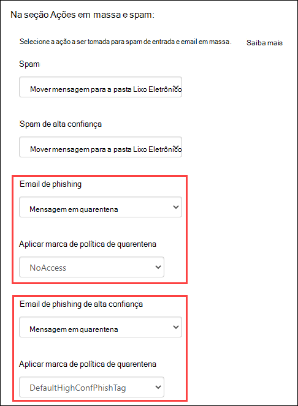
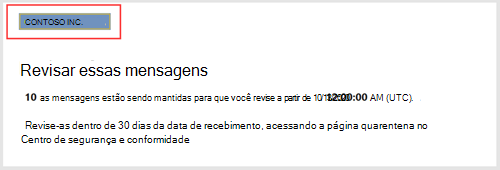
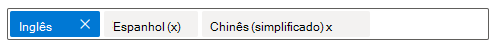
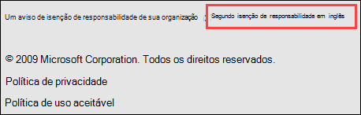
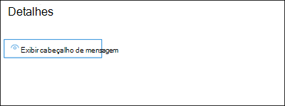
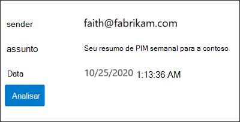
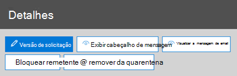
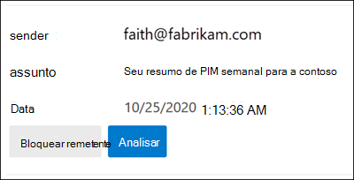
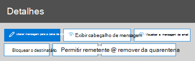
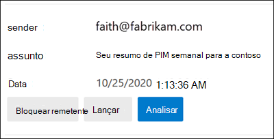

# <a name="quarantine-tags"></a>Marcas de quarentena

> [!NOTE]
> Os recursos descritos neste artigo estão atualmente em versão prévia, que não estão disponíveis para todos, e estão sujeitos a alterações.

As marcas de quarentena na proteção do Exchange Online (EOP) permitem que os administradores controlem o que os usuários podem fazer com as mensagens em quarentena com base em como a mensagem chegou em quarentena.

O EOP tradicionalmente permitiu ou evitou determinados níveis de interatividade para mensagens em [quarentena](find-and-release-quarantined-messages-as-a-user.md) e em [notificações de spam do usuário final](use-spam-notifications-to-release-and-report-quarantined-messages.md). Por exemplo, os usuários finais podem exibir e liberar mensagens em quarentena por filtragem antispam como spam ou em massa, mas não podem exibir nem liberar mensagens em quarentena como phishing de alta confiança.

Para [recursos de proteção compatíveis](#step-2-assign-a-quarantine-tag-to-supported-features), as marcas de quarentena especificam o que os usuários podem fazer nas mensagens de notificação de spam do usuário final e em suas mensagens em quarentena em quarentena (mensagens nas quais o usuário é um destinatário). As marcas de quarentena padrão são atribuídas automaticamente para impor as funcionalidades históricas para usuários finais em mensagens em quarentena. Ou você pode criar e atribuir marcas de quarentena personalizadas para permitir ou impedir que os usuários finais realizem ações específicas em mensagens em quarentena.

As permissões individuais são combinadas nos seguintes grupos de permissões predefinidos:

- Sem acesso
- Acesso limitado
- Acesso completo

As permissões individuais disponíveis e o que está incluído ou não incluído nos grupos de permissões predefinidos são descritos na tabela a seguir:

|Permissão|Sem acesso|Acesso limitado|Acesso completo|
|---|:---:|:---:|:---:|
|**Permitir remetente** (_PermissionToAllowSender_)||||
|**Bloquear remetente** (_PermissionToBlockSender_)||||
|**Excluir** (_PermissionToDelete_)||||
|**Visualização** (_PermissionToPreview_)||||
|**Permitir que os destinatários liberem uma mensagem da quarentena** (_PermissionToRelease_)||||
|**Permitir que os destinatários solicitem uma mensagem a ser liberada da quarentena** (_PermissionToRequestRelease_)||||
|

Se você não gostar das permissões padrão nos grupos de permissão predefinidos, poderá usar permissões personalizadas ao criar ou modificar as marcas de quarentena personalizadas. Para obter mais informações sobre o que cada permissão faz, consulte a seção [detalhes da permissão de marca de quarentena](#quarantine-tag-permission-details) mais adiante neste artigo.

Você cria e atribui as marcas de quarentena no centro de conformidade & segurança ou no PowerShell (PowerShell do Exchange Online para organizações do Microsoft 365 com caixas de correio do Exchange Online; EOP PowerShell autônomo em organizações do EOP sem caixas de correio do Exchange Online).

## <a name="what-do-you-need-to-know-before-you-begin"></a>O que você precisa saber antes de começar?

- Abra o Centro de Conformidade e Segurança em <https://protection.office.com/>. Para ir diretamente para a página de **marcas de quarentena** , abra <https://protection.office.com/quarantineTags> .

- Para se conectar ao PowerShell do Exchange Online, confira [Conectar ao PowerShell do Exchange Online](https://docs.microsoft.com/powershell/exchange/connect-to-exchange-online-powershell). Para se conectar ao EOP PowerShell autônomo, consulte [Conectar-se ao PowerShell do Exchange Online Protection.](https://docs.microsoft.com/powershell/exchange/connect-to-exchange-online-protection-powershell).

- Para exibir, criar, modificar ou remover as marcas de quarentena, você precisa ser membro das funções de **Gerenciamento da organização** ou **administrador de segurança** no centro de conformidade de & de [segurança](permissions-in-the-security-and-compliance-center.md).

## <a name="step-1-create-quarantine-tags-in-the-security--compliance-center"></a>Etapa 1: criar marcas de quarentena no centro de conformidade e segurança &

1. No centro de conformidade & segurança, vá para política de **Gerenciamento de ameaças** \> **Policy** e selecione **marcas de quarentena**.

2. Na página **marcas de quarentena** , selecione **adicionar marca personalizada**.

3. O assistente **novo marcador** é aberto. Na página **nome da marca** , insira um nome curto, mas exclusivo, no campo **nome da marca** . Você precisará identificar e selecionar a marca pelo nome em etapas futuras. Quando terminar, clique em **Avançar**.

4. Na página **acesso a mensagens de destinatário** , selecione um dos seguintes valores:
   - **Sem acesso**
   - **Acesso limitado**
   - **Acesso completo**

   As permissões individuais incluídas nesses grupos de permissão são descritas anteriormente neste artigo.

   Para especificar permissões personalizadas, selecione **Definir acesso específico (avançado)** e defina as seguintes configurações:

     - **Selecione a preferência de ação de liberação**: selecione um dos seguintes valores:
       - **Nenhuma ação de versão**: Este é o valor padrão.
       - **Permitir que os destinatários liberem uma mensagem da quarentena**
       - **Permitir que os destinatários solicitem uma mensagem a ser liberada da quarentena**

     - **Selecionar ações adicionais os destinatários podem executar em mensagens em quarentena**: selecione alguns, todos ou nenhum dos seguintes valores:
       - **Delete**
       - **Visualização**
       - **Permitir remetente**
       - **Bloquear remetente**

   Essas permissões e seus efeitos nas mensagens em quarentena e nas notificações de spam do usuário final são descritos na seção [detalhes da permissão de marca de quarentena](#quarantine-tag-permission-details) mais adiante neste artigo.

   Quando terminar, clique em **Avançar**.

5. Na página de **Resumo** exibida, revise suas configurações. Você pode clicar em **Editar** em cada configuração para modificá-la.

   Quando tiver concluído, clique em **Enviar**.

6. Clique em **concluído** na página de confirmação exibida.

Agora você está pronto para atribuir a marca de quarentena a um recurso de quarentena, conforme descrito na seção [etapa 2](#step-2-assign-a-quarantine-tag-to-supported-features) .

### <a name="create-quarantine-tags-in-powershell"></a>Criar marcas de quarentena no PowerShell

Se preferir usar o PowerShell para criar marcas de quarentena, conecte-se ao PowerShell do Exchange Online ou do Exchange Online Protection e use o cmdlet **New-QuarantineTag** . Você tem dois métodos diferentes para escolher:

- Use o parâmetro _EndUserQuarantinePermissionsValue_ .
- Use o parâmetro _EndUserQuarantinePermissions_ .

Esses métodos são descritos nas seções a seguir.

#### <a name="use-the-enduserquarantinepermissionsvalue-parameter"></a>Usar o parâmetro EndUserQuarantinePermissionsValue

Para criar uma marca de quarentena usando o parâmetro _EndUserQuarantinePermissionsValue_ , use a seguinte sintaxe:

```powershell
New-QuarantineTag -Name "<UniqueName>" -EndUserQuarantinePermissionsValue <0 to 236>
```

O parâmetro _EndUserQuarantinePermissionsValue_ usa um valor decimal que é convertido de um valor binário. O valor binário corresponde às permissões de quarentena de usuário final disponíveis em uma ordem específica. Para cada permissão, o valor 1 é igual a verdadeiro e o valor 0 é igual a falso.

A ordem e os valores necessários para cada permissão individual em grupos de permissões predefinidos são descritos na tabela a seguir:

****

|Permissão|Sem acesso|Acesso limitado|Acesso completo|
|---|:---:|:---:|:---:|
|PermissionToAllowSender|,0|,0|1 |
|PermissionToBlockSender|,0|1 |1 |
|PermissionToDelete|,0|1 |1 |
|PermissionToDownload<sup>\*</sup>|,0|,0|,0|
|PermissionToPreview|,0|1 |1 |
|PermissionToRelease<sup>\*\*</sup>|,0|,0|1 |
|PermissionToRequestRelease<sup>\*\*</sup>|,0|1 |,0|
|PermissionToViewHeader<sup>\*</sup>|,0|,0|,0|
|Valor binário|00000000|01101010|11101100|
|Valor decimal a ser usado|,0|106|236|

<sup>\*</sup> No momento, esse valor é sempre 0. Para PermissionToViewHeader, o valor 0 não oculta o botão **exibir cabeçalho da mensagem** nos detalhes da mensagem em quarentena (o botão está sempre disponível).

<sup>\*\*</sup> Não defina esses dois valores como 1. Defina um como 1 e o outro como 0, ou defina ambos como 0.

Este exemplo cria um novo nome de marca de quarentena NoAccess que atribui as permissões sem acesso conforme descrito na tabela anterior.

```powershell
New-QuarantineTag -Name NoAccess -EndUserQuarantinePermissionsValue 0
```

Para permissões de acesso limitado, use o valor 106. Para permissões de acesso total, use o valor 236.

Para permissões personalizadas, use a tabela anterior para obter o valor binário que corresponde às permissões desejadas. Converta o valor binário em um valor decimal e use o valor decimal para o parâmetro _EndUserQuarantinePermissionsValue_ .

Para informações detalhadas de sintaxes e de parâmetros, consulte [New-QuarantineTag](https://docs.microsoft.com/powershell/module/exchange/new-quarantinetag).

#### <a name="use-the-enduserquarantinepermissions-parameter"></a>Usar o parâmetro EndUserQuarantinePermissions

Para criar uma marca de quarentena usando o parâmetro _EndUserQuarantinePermissionsValue_ , siga estas etapas:

R. Armazenar um objeto de permissões de quarentena em uma variável usando o cmdlet **New-QuarantinePermissions** .
<br/>
A.b.c.. Use a variável como o valor _EndUserQuarantinePermissions_ no comando **New-QuarantineTag** .

##### <a name="step-a-store-a-quarantine-permissions-object-in-a-variable"></a>Etapa A: armazenar um objeto de permissões de quarentena em uma variável

Use a seguinte sintaxe:

```powershell
$<VariableName> = New-QuarantinePermissions [-PermissionToAllowSender <$true | $False>] [-PermissionToBlockSender <$true | $False>] [-PermissionToDelete <$true | $False>] [-PermissionToPreview <$true | $False>] [-PermissionToRelease <$true | $False>] [-PermissionToRequestRelease <$true | $False>]
```

O valor padrão para todos os parâmetros não utilizados é que `$false` você só precisa usar os parâmetros para os quais você deseja definir o valor `$true` .

Os exemplos a seguir mostram como criar objetos Permission que correspondam aos grupos de permissões predefinidas:

- **Sem acesso**:

  ```powershell
  $NoAccess = New-QuarantinePermissions
  ```

- **Acesso limitado**:

  ```powershell
  $LimitedAccess = New-QuarantinePermissions -PermissionToBlockSender $true -PermissionToDelete $true -PermissionToPreview $true -PermissionToRequestRelease $true
  ```

- **Acesso completo**:

  ```powershell
  $FullAccess = New-QuarantinePermissions -PermissionToAllowSender $true -PermissionToBlockSender $true -PermissionToDelete $true -PermissionToPreview $true -PermissionToRelease $true
  ```

Para ver os valores que você definiu, execute o nome da variável como um comando (por exemplo, execute o comando `$NoAccess` ).

Para permissões personalizadas, não defina os parâmetros _PermissionToRelease_ e _PermissionToRequestRelease_ como `$true` . Defina um como `$true` e deixe o outro como `$false` ou deixe como `$false` .

Você também pode modificar uma variável de objeto Permissions existente depois de criar, mas antes de usá-la usando o cmdlet **set-QuarantinePermissions** .

Para informações detalhadas de sintaxes e de parâmetros, consulte [New-QuarantinePermissions](https://docs.microsoft.com/powershell/module/exchange/new-quarantinepermissions) e [set-QuarantinePermissions](https://docs.microsoft.com/powershell/module/exchange/set-quarantinepermissions).

##### <a name="step-b-use-the-variable-in-the-new-quarantinetag-command"></a>Etapa B: usar a variável no comando New-QuarantineTag

Depois de criar e armazenar o objeto Permissions em uma variável, use a variável para o valor do parâmetro _EndUserQuarantinePermission_ no seguinte comando **New-QuarantineTag** :

```powershell
New-QuarantineTag -Name "<UniqueName>" -EndUserQuarantinePermissions $<VariableName>
```

Este exemplo cria uma nova marca de quarentena chamada LimitedAccess usando o `$LimitedAccess` objeto Permissions descrito e criado na etapa anterior.

```powershell
New-QuarantineTag -Name LimitedAccess -EndUserQuarantinePermissions $LimitedAccess
```

Para informações detalhadas de sintaxes e de parâmetros, consulte [New-QuarantineTag](https://docs.microsoft.com/powershell/module/exchange/new-quarantinetag).

## <a name="step-2-assign-a-quarantine-tag-to-supported-features"></a>Etapa 2: atribuir uma marca de quarentena aos recursos com suporte

Em recursos de proteção _com suporte_ que colocadas em quarentena mensagens ou arquivos (automaticamente ou como uma ação configurável), você pode atribuir uma marca de quarentena às ações de quarentena disponíveis. Os recursos que quarentena mensagens e a disponibilidade de marcas de quarentena são descritos na tabela a seguir:

****

|Recurso|Marcas de quarentena suportadas?|Marcas de quarentena padrão usadas|
|---|:---:|---|
|[Políticas antispam](configure-your-spam-filter-policies.md): <ul><li>**Spam** (_spam_)</li><li>**Spam de alta confiança** (_HighConfidenceSpamAction_)</li><li>**Email de phishing** (_PhishSpamAction_)</li><li>**Email de phishing de alta confiança** (_HighConfidencePhishAction_)</li><li>**Email em massa** (_BulkSpamAction_)</li></ul>|Sim|<ul><li>DefaultSpamTag (acesso completo)</li><li>DefaultHighConfSpamTag (acesso completo)</li><li>DefaultPhishTag (acesso completo)</li><li>DefaultHighConfPhishTag (sem acesso)</li><li>DefaultBulkTag (acesso completo)</li></ul>
|Políticas anti-phishing: <ul><li>[Proteção de inteligência de falsificação](set-up-anti-phishing-policies.md#spoof-settings) (_AuthenticationFailAction_)</li><li>[Proteção de representação](set-up-anti-phishing-policies.md#impersonation-settings-in-anti-phishing-policies-in-microsoft-defender-for-office-365):<sup>\*</sup> <ul><li>**Se o email for enviado por um usuário representado** (_TargetedUserProtectionAction_)</li><li>**Se o email for enviado por um domínio representado** (_TargetedDomainProtectionAction_)</li><li>Inteligência de caixa de **correio** \> **Se o email for enviado por um usuário representado** (_MailboxIntelligenceProtectionAction_)</li></ul></li></ul></ul>|Não|n/d|
|[Políticas Antimalware](configure-anti-malware-policies.md): todas as mensagens detectadas são sempre colocadas em quarentena.|Não|n/d|
|[ATP para SharePoint, OneDrive e Microsoft Teams](atp-for-spo-odb-and-teams.md)|Não|n/d|
|[Regras de fluxo de emails](https://docs.microsoft.com/exchange/security-and-compliance/mail-flow-rules/mail-flow-rules) (também conhecidas como regras de transporte) com a ação: **entregar a mensagem para a quarentena hospedada** (_quarentena_).|Não|n/d|
|

<sup>\*</sup> As configurações de proteção de representação estão disponíveis somente em políticas anti-phishing no Microsoft defender para Office 365.

Se você estiver satisfeito com as permissões de usuário final fornecidas pelas marcas de quarentena padrão, não será necessário fazer nada. Se você quiser personalizar os recursos do usuário final (botões disponíveis) nas notificações de spam do usuário final ou em detalhes da mensagem em quarentena, poderá atribuir uma marca de quarentena personalizada.

### <a name="assign-quarantine-tags-in-anti-spam-policies-in-the-security--compliance-center"></a>Atribuir marcas de quarentena em políticas antispam no centro de conformidade de & de segurança

Instruções completas para a criação e modificação de políticas antispam são descritas em [Configure anti-spam Policies in EOP](configure-your-spam-filter-policies.md).

1. No centro de conformidade & segurança, vá para política de **Gerenciamento de ameaças** \> **Policy** \> e selecione **anti-spam**. Ou abra <https://protection.office.com/antispam> .

2. Encontre e selecione uma política antispam existente para editar ou crie uma nova política antispam.

3. No submenu detalhes da política, expanda a seção **spam e ações em massa** .
  
4. Se você tiver selecionado a **mensagem de quarentena** para a ação de um veredicto de filtragem de spam disponível, a caixa **aplicar marca de política de quarentena** estará disponível para que você selecione a marca de quarentena para esse veredicto.

   **Observação**: quando você cria uma nova política, um valor de marca de quarentena em branco para um veredicto de filtragem de spam indica que a marca de quarentena padrão para o veredicto é usada. Quando você edita a política mais tarde, os valores em branco são substituídos pelos nomes de marca de quarentena padrão atuais, conforme descrito na tabela anterior.
  
   

5. Quando concluir, clique em **Salvar**.

#### <a name="assign-quarantine-tags-in-anti-spam-policies-in-powershell"></a>Atribuir marcas de quarentena em políticas antispam no PowerShell

Se preferir usar o PowerShell para atribuir marcas de quarentena em políticas antispam, conecte-se ao PowerShell do Exchange Online ou do Exchange Online Protection e use a seguinte sintaxe:

```powershell
<New-HostedContentFilterPolicy -Name "<Unique name>" | Set-HostedContentFilterPolicy -Identity "<Policy name>">  [-SpamAction Quarantine] [-SpamQuarantineTag <QuarantineTagName>] [-HighConfidenceSpamAction Quarantine] [-HighConfidenceSpamQuarantineTag <QuarantineTagName>] [-PhishSpamAction Quarantine] [-PhishQuarantineTag <QuarantineTagName>] [-HighConfidencePhishQuarantineTag <QuarantineTagName>] [-BulkSpamAction Quarantine] [-BulkQuarantineTag <QuarantineTagName>] ...
```

**Observações**:

- O valor padrão para o parâmetro _HighConfidencePhishAction_ é Quarantine, portanto, você não precisa definir a ação de quarentena para detecções de phishing de alta confiança em novas políticas antispam. Para todos os outros verdicts de filtragem de spam em políticas antispam novas ou existentes, a marca de quarentena só será efetiva se o valor da ação for Quarantine. Para ver os valores de ação em políticas antispam existentes, execute o seguinte comando:

  ```powershell
  Get-HostedContentFilterPolicy | Format-Table Name,*SpamAction,HighConfidencePhishAction
  ```

  Para obter informações sobre os valores de ação padrão e os valores de ação recomendados para Standard e Strict, consulte [EOP anti-Spam Policy Settings](recommended-settings-for-eop-and-office365-atp.md#eop-anti-spam-policy-settings).

- Um veredicto de filtragem de spam sem um parâmetro de marca de quarentena correspondente significa que a [marca de quarentena padrão](#step-2-assign-a-quarantine-tag-to-supported-features) para o veredicto é usada.

  Você só precisa substituir uma marca de quarentena padrão por uma marca de quarentena personalizada se quiser alterar os recursos de usuário final padrão em mensagens em quarentena.

- Uma nova política antispam no PowerShell requer uma política de filtro de spam (configurações) usando o cmdlet **New-HostedContentFilterPolicy** e uma nova regra de filtro de spam (filtros de destinatário) usando o cmdlet **New-HostedContentFilterRule** . Para obter instruções, consulte [usar o PowerShell para criar políticas antispam](configure-your-spam-filter-policies.md#use-powershell-to-create-anti-spam-policies).

Este exemplo cria uma nova política de filtro de spam chamada departamento de pesquisa com as seguintes configurações:

- A ação para todos os verdicts de filtragem de spam é definida como Quarantine.
- A marca de quarentena personalizada chamada NoAccess que atribui nenhuma permissão de **acesso** substitui qualquer marca de quarentena padrão que ainda não atribui nenhuma permissão de **acesso** por padrão.

```powershell
New-HostedContentFilterPolicy -Name Research Department -SpamAction Quarantine -SpamQuarantineTag NoAccess -HighConfidenceSpamAction Quarantine -HighConfidenceSpamQuarantineTag NoAction -PhishSpamAction Quarantine -PhishQuarantineTag NoAction -BulkSpamAction Quarantine -BulkQuarantineTag NoAccess
```

Para obter mais informações detalhadas de sintaxe e parâmetro, confira [New-HostedContentFilterPolicy](https://docs.microsoft.com/powershell/module/exchange/new-hostedcontentfilterpolicy).

Este exemplo modifica a política de filtro de spam existente chamada recursos humanos. A ação para o veredicto de quarentena de spam é definida como quarentena, e a marca de quarentena personalizada chamada NoAccess é atribuída.

```powershell
Set-HostedContentFilterPolicy -Identity "Human Resources" -SpamAction Quarantine -SpamQuarantineTag NoAccess
```

Para obter mais informações detalhadas de sintaxe e parâmetro, confira [Set-HostedContentFilterPolicy](https://docs.microsoft.com/powershell/module/exchange/set-hostedcontentfilterpolicy).

## <a name="configure-global-quarantine-notification-settings-in-the-security--compliance-center"></a>Configurar as definições de notificação de quarentena global no centro de conformidade de & de segurança

As configurações globais para marcas de quarentena permitem que você personalize as notificações de spam do usuário final que são enviadas aos destinatários das mensagens que foram colocadas em quarentena. Para obter mais informações sobre essas notificações, consulte [end-user spam Notifications](use-spam-notifications-to-release-and-report-quarantined-messages.md).

1. No centro de conformidade & segurança, vá para política de **Gerenciamento de ameaças** \> **Policy** e selecione **marcas de quarentena**.

2. Na página **marcas de quarentena** , selecione **configurações globais**.

3. No submenu **configurações de notificação de quarentena** que é aberto, defina algumas ou todas as configurações a seguir:

   - **Usar o logotipo da minha empresa**: Selecione essa opção para substituir o logotipo padrão da Microsoft que é usado na parte superior das notificações de spam do usuário final. Antes de fazer isso, você precisa seguir as instruções em [Personalizar o tema do Microsoft 365 para sua organização](https://docs.microsoft.com/microsoft-365/admin/setup/customize-your-organization-theme) para carregar seu logotipo personalizado.

     A captura de tela a seguir mostra um logotipo personalizado em uma notificação de spam do usuário final:

     

   - **Escolher idioma**: as notificações de spam do usuário final já estão localizadas com base nas configurações de idioma do destinatário. Você pode especificar texto personalizado em diferentes idiomas para o **nome de exibição** e os valores de **aviso de isenção de responsabilidade** .

     Selecione pelo menos um idioma na primeira caixa de idioma e clique em **Adicionar**. Você pode selecionar vários idiomas clicando em **Adicionar** após cada um. Uma caixa de idioma de seção mostra todos os idiomas que você selecionou:

     

   - **Nome para exibição**: Personalize o nome de exibição do remetente usado em notificações de spam do usuário final.

     Para cada idioma adicionado, selecione o idioma na segunda caixa de idioma (não clique no X) e insira o valor de texto desejado na caixa **nome para exibição** .

     A captura de tela a seguir mostra o nome de exibição personalizado em uma notificação de spam do usuário final:

     

   - **Aviso de isenção** de responsabilidade: Adicione um aviso de isenção personalizada à parte inferior das notificações de spam do usuário final. O texto localizado, **um aviso de isenção de responsabilidade da sua organização:** sempre é incluído primeiro, seguido pelo texto especificado.

     Para cada idioma adicionado, selecione o idioma na segunda caixa de idioma (não clique no X) e insira o valor de texto desejado na caixa de aviso de **isenção de responsabilidade** .

     A captura de tela a seguir mostra a isenção de responsabilidade personalizada em uma notificação de spam do usuário final:

     

## <a name="view-quarantine-tags-in-the-security--compliance-center"></a>Exibir as marcas de quarentena no centro de conformidade e segurança &

1. No centro de conformidade & segurança, vá para política de **Gerenciamento de ameaças** \> **Policy** e selecione **marcas de quarentena**.

- Para exibir as configurações de marcas de quarentena internas ou personalizadas, selecione a marca de quarentena na lista (não marque a caixa de seleção).

- Para exibir as configurações globais, selecione **configurações globais**

### <a name="view-quarantine-tags-in-powershell"></a>Exibir marcas de quarentena no PowerShell

Se preferir usar o PowerShell para exibir as marcas de quarentena, execute uma das seguintes etapas:

- Para exibir uma lista resumida de todas as marcas internas ou personalizadas, execute o seguinte comando:

  ```powershell
  Get-QuarantineTag | Format-Table Name
  ```

- Para exibir as configurações de marcas de quarentena internas ou personalizadas, substitua \<TagName\> o nome da marca de quarentena e execute o seguinte comando:

  ```powershell
  Get-QuarantineTag -Identity "<TagName>"
  ```

- Para exibir as configurações globais, execute o seguinte comando:

  ```powershell
  Get-QuarantineTag -QuarantineTagType GlobalQuarantineTag
  ```

Para obter mais informações detalhadas de sintaxe e parâmetro, confira [Get-HostedContentFilterPolicy](https://docs.microsoft.com/powershell/module/exchange/get-hostedcontentfilterpolicy).

## <a name="remove-quarantine-tags-in-the-security--compliance-center"></a>Remover as marcas de quarentena no centro de conformidade & segurança

**Observações**:

- Não é possível remover as marcas de quarentena internas.

- Antes de remover uma marca de quarentena personalizada, verifique se ela não está sendo usada. Por exemplo, execute o seguinte comando no PowerShell:

  ```powershell
  Get-HostedContentFilterPolicy | Format-List Name,*QuarantineTag
  ```

  Se a marca de quarentena estiver sendo usada, [substitua a marca de quarentena atribuída antes de](#step-2-assign-a-quarantine-tag-to-supported-features) removê-la.

1. No centro de conformidade & segurança, vá para política de **Gerenciamento de ameaças** \> **Policy** e selecione **marcas de quarentena**.

2. Na página **marcas de quarentena** , selecione a marca de quarentena personalizada que você deseja remover e clique em **excluir marca**.

3. Clique em **remover marca** na caixa de diálogo de confirmação que aparece.

### <a name="remove-quarantine-tags-in-powershell"></a>Remover as marcas de quarentena no PowerShell

Se preferir usar o PowerShell para remover uma marca de quarentena personalizada, substitua \<TagName\> o nome da marca de quarentena e execute o seguinte comando:

```powershell
Remove-QuarantineTag -Identity "<TagName>"
```

Para informações detalhadas de sintaxes e de parâmetros, consulte [Remove-QuarantineTag](https://docs.microsoft.com/powershell/module/exchange/remove-quarantinetag).

## <a name="quarantine-tag-permission-details"></a>Detalhes da permissão de marca de quarentena

As seções a seguir descrevem os efeitos de grupos de permissões predefinidos e permissões individuais nos detalhes das mensagens em quarentena e nas notificações de spam do usuário final.

### <a name="preset-permissions-groups"></a>Grupos de permissões predefinidas

As permissões individuais incluídas em grupos de permissões predefinidas estão listadas na tabela no início deste artigo.

#### <a name="no-access"></a>Sem acesso

Se a marca de quarentena atribuir as permissões **sem acesso** (sem permissões), os usuários ainda receberão alguns recursos de linha de base:

- **Detalhes da mensagem em quarentena**: o botão **exibir cabeçalho da mensagem** está sempre disponível.

  

- **Notificações de spam do usuário final**: o botão de **revisão** que leva o usuário para a mensagem em quarentena está sempre disponível.

  

#### <a name="limited-access"></a>Acesso limitado

Se a marca de quarentena atribuir as permissões de **acesso limitado** , os usuários receberão os seguintes recursos:

- **Detalhes da mensagem em quarentena**: os seguintes botões estão disponíveis:
  - **Versão de solicitação**
  - **Exibir cabeçalho de mensagem**
  - **Visualizar mensagem**
  - **Bloquear remetente**
  - **Remover da quarentena**

  

- **Notificações de spam para o usuário final**: os seguintes botões estão disponíveis:
  - **Bloquear remetente**
  - **Examinar**

  

#### <a name="full-access"></a>Acesso completo

Se a marca de quarentena atribuir as permissões de **acesso completo** (todas as permissões disponíveis), os usuários receberão os seguintes recursos:

- **Detalhes da mensagem em quarentena**: os seguintes botões estão disponíveis:
  - **Mensagem de liberação**
  - **Exibir cabeçalho de mensagem**
  - **Visualizar mensagem**
  - **Bloquear remetente**
  - **Permitir remetente**
  - **Remover da quarentena**

  

- **Notificações de spam para o usuário final**: os seguintes botões estão disponíveis:
  - **Bloquear remetente**
  - **Liberar**
  - **Examinar**

  

### <a name="individual-permissions"></a>Permissões individuais

> [!NOTE]
> Lembre-se de que os usuários sempre recebem os botões descritos na seção [sem acesso](#no-access) . Esses botões não estão incluídos nas descrições de permissão individuais.

#### <a name="allow-sender-permission"></a>Permitir permissão de remetente

A permissão de **remetente permitir** (_PermissionToAllowSender_) controla o acesso ao botão que permite que os usuários adicionem convenientemente o remetente da mensagem em quarentena à sua lista de remetentes seguros.

- **Detalhes da mensagem em quarentena**:
  - **Permitir** permissão de remetente habilitado: o botão **permitir remetente** está disponível.
  - Permissão para **permitir remetente** desabilitada: o botão **permitir remetente** não está disponível.

- **Notificações de spam do usuário final**: sem efeito.

Para mais informações sobre a lista de remetentes confiáveis, consulte [impedir que remetentes confiáveis sejam bloqueados](https://support.microsoft.com/office/274ae301-5db2-4aad-be21-25413cede077#__toc304379666) e [usar o PowerShell do Exchange Online para configurar a coleção de lista segura em uma caixa de correio](configure-junk-email-settings-on-exo-mailboxes.md#use-exchange-online-powershell-to-configure-the-safelist-collection-on-a-mailbox).

#### <a name="block-sender-permission"></a>Permissão bloquear remetente

A permissão **bloquear remetente** (_PermissionToBlockSender_) controla o acesso ao botão que permite que os usuários adicionem convenientemente o remetente da mensagem em quarentena à sua lista de remetentes bloqueados.

- **Detalhes da mensagem em quarentena**:
  - Permissão **bloquear remetente** habilitada: o botão **bloquear remetente** está disponível.
  - Permissão **bloquear remetente** desabilitada: o botão **bloquear remetente** não está disponível.

- **Notificações de spam do usuário final**:
  - Permissão **bloquear remetente** desabilitada: o botão **bloquear remetente** não está disponível.
  - Permissão **bloquear remetente** habilitada: o botão **bloquear remetente** está disponível.

Para obter mais informações sobre a lista de remetentes bloqueados, consulte [bloquear mensagens de alguém](https://support.microsoft.com/office/274ae301-5db2-4aad-be21-25413cede077#__toc304379667) e [usar o PowerShell do Exchange Online para configurar o conjunto de listas seguras em uma caixa de correio](configure-junk-email-settings-on-exo-mailboxes.md#use-exchange-online-powershell-to-configure-the-safelist-collection-on-a-mailbox).

#### <a name="delete-permission"></a>Excluir permissão

A permissão de **exclusão** (_PermissionToDelete_) controla a capacidade de os usuários excluírem suas mensagens (mensagens nas quais o usuário é um destinatário) da quarentena.

- **Detalhes da mensagem em quarentena**:
  - Permissão **excluir** habilitada: o botão **remover da quarentena** está disponível.
  - Permissão **excluir** desabilitada: o botão **remover da quarentena** não está disponível.

- **Notificações de spam do usuário final**: sem efeito.

#### <a name="preview-permission"></a>Permissão prévia

A permissão de **Visualização** (_PermissionToPreview_) controla a capacidade de os usuários visualizarem suas mensagens em quarentena.

- **Detalhes da mensagem em quarentena**:
  - Permissão de **Visualização** habilitada: o botão **Visualizar mensagem** está disponível.
  - Permissão de **Visualização** desabilitada: o botão **Visualizar mensagem** não está disponível.

- **Notificações de spam do usuário final**: sem efeito.

#### <a name="allow-recipients-to-release-a-message-from-quarantine-permission"></a>Permitir que os destinatários liberem uma mensagem da permissão de quarentena

O **permitir que os destinatários liberem uma mensagem da** permissão de quarentena (_PermissionToRelease_) controla a capacidade dos usuários de liberar mensagens em quarentena diretamente e sem a aprovação de um administrador.

- **Detalhes da mensagem em quarentena**:
  - Permissão habilitada: o botão **liberar mensagem** está disponível.
  - Permissão desabilitada: o botão **liberar mensagem** não está disponível.
  
- **Notificações de spam do usuário final**:
  - Permissão habilitada: o botão **liberar** está disponível.
  - Permissão desabilitada: o botão de **versão** não está disponível.

#### <a name="allow-recipients-to-request-a-message-to-be-released-from-quarantine-permission"></a>Permitir que os destinatários solicitem uma mensagem a ser liberada da permissão de quarentena

O **permitir que os destinatários solicitem uma mensagem a ser liberada da** permissão de quarentena (_PermissionToRequestRelease_) controla a capacidade dos usuários de _solicitar_ o lançamento de suas mensagens em quarentena. A mensagem é liberada somente depois que um administrador aprova a solicitação.

- **Detalhes da mensagem em quarentena**:
  - Permissão habilitada: o botão **liberar versão** está disponível.
  - Permissão desabilitada: o botão **liberar versão** não está disponível.

- **Notificações de spam do usuário final**: o botão **liberar** não está disponível.
