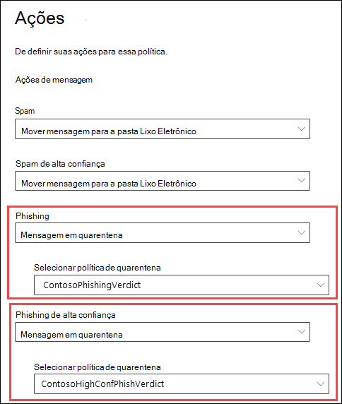

# <a name="quarantine-policies"></a>Políticas de quarentena

> [!NOTE]
> Os recursos descritos neste artigo estão atualmente em Visualização, não estão disponíveis para todos e estão sujeitos a alterações.

As políticas de quarentena (anteriormente conhecidas como marcas de quarentena) no Proteção do Exchange Online (EOP) permitem que os administradores controlem o que os usuários são capazes de fazer com suas mensagens em quarentena com base em como a mensagem chegou em quarentena.

O EOP tradicionalmente permitiu ou impediu determinados [](find-and-release-quarantined-messages-as-a-user.md) níveis de interatividade para mensagens em quarentena e em notificações de [spam do usuário final.](use-spam-notifications-to-release-and-report-quarantined-messages.md) Por exemplo, os usuários podem exibir e liberar mensagens que foram colocadas em quarentena pela filtragem anti-spam como spam ou em massa, mas não podem exibir ou liberar mensagens que foram colocadas em quarentena como phishing de alta confiança (somente os administradores podem fazer isso).

Para [recursos de proteção](#step-2-assign-a-quarantine-policy-to-supported-features)com suporte, as políticas de quarentena especificam o que os usuários têm permissão para fazer em mensagens de notificação de spam do usuário final e em suas mensagens em quarentena (mensagens em que o usuário é um destinatário). As políticas de quarentena padrão são atribuídas automaticamente para impor os recursos históricos para os usuários em mensagens em quarentena. Ou você pode criar e atribuir políticas de quarentena personalizadas para permitir ou impedir que os usuários finais executam ações específicas em mensagens em quarentena.

As permissões individuais são combinadas nos seguintes grupos de permissões predefinidos:

- Sem acesso
- Acesso limitado
- Acesso total

As permissões individuais disponíveis e o que está incluído ou não nos grupos de permissão predefinidos são descritos na tabela a seguir:

<br>

****

|Permissão|Sem acesso|Acesso limitado|Acesso total|
|---|:---:|:---:|:---:|
|**Permitir remetente** (_PermissionToAllowSender_)||||
|**Bloquear remetente** (_PermissionToBlockSender_)||||
|**Excluir** (_PermissionToDelete_)||||
|**Visualização** (_PermissionToPreview_)||||
|**Permitir que os destinatários liberem uma mensagem de quarentena** (_PermissionToRelease_)||||
|**Permitir que os destinatários solicitem que uma mensagem seja liberada da quarentena** (_PermissionToRequestRelease_)||||
|

Se você não gostar das permissões padrão nos grupos de permissões predefinidos, poderá usar permissões personalizadas ao criar ou modificar políticas de quarentena personalizadas. Para obter mais informações sobre o que cada permissão faz, consulte a seção Detalhes da permissão de [política](#quarantine-policy-permission-details) de quarentena posteriormente neste artigo.

Você cria e atribui políticas de quarentena no portal do Microsoft 365 Defender ou no PowerShell (Exchange Online PowerShell para organizações Microsoft 365 com caixas de correio do Exchange Online; PowerShell autônomo do EOP em organizações do EOP sem Exchange Online caixas de correio).

## <a name="what-do-you-need-to-know-before-you-begin"></a>Do que você precisa saber para começar?

- Abra o portal do Microsoft 365 Defender em <https://security.microsoft.com>. Ou para ir diretamente para a página **Políticas de** quarentena, abra <https://security.microsoft.com/quarantineTags> .

- Para se conectar ao PowerShell do Exchange Online, confira [Conectar ao PowerShell do Exchange Online](/powershell/exchange/connect-to-exchange-online-powershell). Para se conectar ao EOP PowerShell autônomo, consulte [Conectar-se ao PowerShell do Exchange Online Protection.](/powershell/exchange/connect-to-exchange-online-protection-powershell).

- Para exibir, criar, modificar ou remover políticas de quarentena,  você  precisa ser membro das funções Gerenciamento da Organização ou Administrador de Segurança no portal Microsoft 365 Defender. Para obter mais informações, veja [Permissões no portal do Microsoft 365 Defender](permissions-microsoft-365-security-center.md).

## <a name="step-1-create-quarantine-policies-in-the-microsoft-365-defender-portal"></a>Etapa 1: Criar políticas de quarentena no Microsoft 365 Defender portal

1. No portal Microsoft 365 Defender, vá para Email & de colaboração Políticas **de** ameaças seção Políticas de quarentena e, em seguida, selecione Políticas \>  \>  \>  **de quarentena**.

2. Na página **Política de quarentena,** clique em  **personalizada**.

3. O **assistente nova política** é aberto. Na página **Nome da** política, insira um nome breve, mas exclusivo, na caixa **Nome da** política. Você precisará identificar e selecionar a política de quarentena pelo nome nas próximas etapas. Ao terminar, clique em **Avançar**.

4. Na página **Acesso à** mensagem de destinatário, selecione um dos seguintes valores:
   - **Sem acesso**
   - **Acesso limitado**
   - **Acesso total**

   As permissões individuais incluídas nesses grupos de permissão são descritas anteriormente neste artigo.

   Para especificar permissões personalizadas, selecione **Definir acesso específico (Avançado)** e as configurações a seguir que aparecem:

     - **Selecione preferência de ação de versão**: Selecione um dos seguintes valores:
       - **Nenhuma ação de versão**: esse é o valor padrão.
       - **Permitir que os destinatários liberem uma mensagem da quarentena**
       - **Permitir que os destinatários solicitem que uma mensagem seja liberada da quarentena**
     - **Selecione ações adicionais que os destinatários podem tomar** em mensagens em quarentena : Selecione alguns, todos ou nenhum dos seguintes valores:
       - **Delete**
       - **Visualização**
       - **Bloquear remetente**

   Essas permissões e seus efeitos nas mensagens em quarentena e nas notificações de spam do usuário final são descritos na seção [Detalhes](#quarantine-policy-permission-details) da permissão de política de quarentena posteriormente neste artigo.

   Ao terminar, clique em **Avançar**.

5. Na página **Revisar política** exibida, revise suas configurações. Você pode selecionar **Editar** em cada seção para modificar as configurações da seção. Ou você pode clicar em **Voltar** ou selecionar a página específica no assistente.

   Quando terminar, clique em **Enviar**.

6. Na mensagem de confirmação exibida, clique em **Concluído**.

Agora você está pronto para atribuir a política de quarentena a um recurso de quarentena, conforme descrito na [seção Etapa 2.](#step-2-assign-a-quarantine-policy-to-supported-features)

### <a name="create-quarantine-policies-in-powershell"></a>Criar políticas de quarentena no PowerShell

Se preferir usar o PowerShell para criar políticas de quarentena, conecte-se ao Exchange Online PowerShell ou ao Proteção do Exchange Online PowerShell e use o cmdlet **New-QuarantineTag.** Você tem dois métodos diferentes para escolher:

- Use o _parâmetro EndUserQuarantinePermissionsValue._
- Use o _parâmetro EndUserQuarantinePermissions._

Esses métodos são descritos nas seções a seguir.

#### <a name="use-the-enduserquarantinepermissionsvalue-parameter"></a>Usar o parâmetro EndUserQuarantinePermissionsValue

Para criar uma política de quarentena usando o _parâmetro EndUserQuarantinePermissionsValue,_ use a seguinte sintaxe:

```powershell
New-QuarantineTag -Name "<UniqueName>" -EndUserQuarantinePermissionsValue <0 to 236>
```

O _parâmetro EndUserQuarantinePermissionsValue_ usa um valor decimal convertido de um valor binário. O valor binário corresponde às permissões de quarentena do usuário final disponíveis em uma ordem específica. Para cada permissão, o valor 1 é igual a True e o valor 0 é igual a False.

A ordem e os valores necessários para cada permissão individual em grupos de permissão predefinidos são descritos na tabela a seguir:

<br>

****

|Permissão|Sem acesso|Acesso limitado|Acesso total|
|---|:---:|:---:|:---:|
|PermissionToAllowSender|0|0|1|
|PermissionToBlockSender|0|1|1|
|PermissionToDelete|0|1|1|
|PermissionToDownload<sup>\*</sup>|0|0|0|
|PermissionToPreview|0|1|1|
|PermissionToRelease<sup>\*\*</sup>|0|0|1|
|PermissionToRequestRelease<sup>\*\*</sup>|0|1|0|
|PermissionToViewHeader<sup>\*</sup>|0|0|0|
|Valor binário|00000000|01101010|11101100|
|Valor decimal a ser usado|0|106|236|
|

<sup>\*</sup> Atualmente, esse valor é sempre 0. Para PermissionToViewHeader, o valor 0 não oculta o botão Exibir o **header** da mensagem nos detalhes da mensagem em quarentena (o botão está sempre disponível).

<sup>\*\*</sup> Não de definir ambos os valores como 1. De definir um como 1 e o outro como 0 ou definir ambos como 0.

Este exemplo cria um novo nome de política de quarentena NoAccess que atribui as permissões Sem acesso conforme descrito na tabela anterior.

```powershell
New-QuarantineTag -Name NoAccess -EndUserQuarantinePermissionsValue 0
```

Para permissões de acesso limitado, use o valor 106. Para permissões de acesso total, use o valor 236.

Para permissões personalizadas, use a tabela anterior para obter o valor binário que corresponde às permissões que você deseja. Converta o valor binário em um valor decimal e use o valor decimal para o _parâmetro EndUserQuarantinePermissionsValue._

Para obter informações detalhadas sobre sintaxes e parâmetros, consulte [New-QuarantineTag](/powershell/module/exchange/new-quarantinetag).

#### <a name="use-the-enduserquarantinepermissions-parameter"></a>Usar o parâmetro EndUserQuarantinePermissions

Para criar uma política de quarentena usando o _parâmetro EndUserQuarantinePermissionsValue,_ faça as seguintes etapas:

R. Armazene um objeto de permissões de quarentena em uma variável usando o cmdlet **New-QuarantinePermissions.**

<p>

B. Use a variável _como o valor EndUserQuarantinePermissions_ no **comando New-QuarantineTag.**

##### <a name="step-a-store-a-quarantine-permissions-object-in-a-variable"></a>Etapa A: Armazenar um objeto de permissões de quarentena em uma variável

Use a seguinte sintaxe:

```powershell
$<VariableName> = New-QuarantinePermissions [-PermissionToAllowSender <$true | $False>] [-PermissionToBlockSender <$true | $False>] [-PermissionToDelete <$true | $False>] [-PermissionToPreview <$true | $False>] [-PermissionToRelease <$true | $False>] [-PermissionToRequestRelease <$true | $False>]
```

O valor padrão para todos os parâmetros não usado é , portanto, você só precisa usar os parâmetros onde deseja `$false` definir o valor como `$true` .

Os exemplos a seguir mostram como criar objetos de permissão que correspondem aos grupos de permissões predefinidos:

- **Sem acesso**:

  ```powershell
  $NoAccess = New-QuarantinePermissions
  ```

- **Acesso limitado**:

  ```powershell
  $LimitedAccess = New-QuarantinePermissions -PermissionToBlockSender $true -PermissionToDelete $true -PermissionToPreview $true -PermissionToRequestRelease $true
  ```

- **Acesso completo**:

  ```powershell
  $FullAccess = New-QuarantinePermissions -PermissionToAllowSender $true -PermissionToBlockSender $true -PermissionToDelete $true -PermissionToPreview $true -PermissionToRelease $true
  ```

Para ver os valores que você definiu, execute o nome da variável como um comando (por exemplo, execute o comando `$NoAccess` ).

Para permissões personalizadas, não de definir os parâmetros _PermissionToRelease_ e _PermissionToRequestRelease_ como `$true` . De definir um para `$true` e deixar o outro como , ou deixar ambos como `$false` `$false` .

Você também pode modificar uma variável de objeto de permissões existente após criar, mas antes de usá-la usando o cmdlet **Set-QuarantinePermissions.**

Para obter informações detalhadas sobre sintaxes e parâmetros, consulte [New-QuarantinePermissions](/powershell/module/exchange/new-quarantinepermissions) e [Set-QuarantinePermissions](/powershell/module/exchange/set-quarantinepermissions).

##### <a name="step-b-use-the-variable-in-the-new-quarantinetag-command"></a>Etapa B: Use a variável no comando New-QuarantineTag comando

Depois de criar e armazenar o objeto permissions em uma variável, use a variável para o valor do parâmetro _EndUserQuarantinePermission_ no seguinte comando **New-QuarantineTag:**

```powershell
New-QuarantineTag -Name "<UniqueName>" -EndUserQuarantinePermissions $<VariableName>
```

Este exemplo cria uma nova política de quarentena chamada LimitedAccess usando o objeto permissions que foi descrito e `$LimitedAccess` criado na etapa anterior.

```powershell
New-QuarantineTag -Name LimitedAccess -EndUserQuarantinePermissions $LimitedAccess
```

Para obter informações detalhadas sobre sintaxes e parâmetros, consulte [New-QuarantineTag](/powershell/module/exchange/new-quarantinetag).

## <a name="step-2-assign-a-quarantine-policy-to-supported-features"></a>Etapa 2: Atribuir uma política de quarentena aos recursos com suporte

Nos _recursos de proteção_ com suporte que coloca em quarentena mensagens ou arquivos (automaticamente ou como uma ação configurável), você pode atribuir uma política de quarentena às ações de quarentena disponíveis. Recursos que as mensagens de quarentena e a disponibilidade de políticas de quarentena são descritos na tabela a seguir:

<br>

****

|Recurso|Políticas de quarentena suportadas?|Políticas de quarentena padrão usadas|
|---|:---:|---|
|[Políticas anti-spam](configure-your-spam-filter-policies.md): <ul><li>**Spam** (_SpamAction_)</li><li>**Spam de alta confiança** (_HighConfidenceSpamAction_)</li><li>**Phishing** (_PhishSpamAction_)</li><li>**Phishing de alta confiança** (_HighConfidencePhishAction_)</li><li>**Bulk** (_BulkSpamAction_)</li></ul>|Sim|<ul><li>DefaultSpamTag (Acesso completo)</li><li>DefaultHighConfSpamTag (acesso completo)</li><li>DefaultPhishTag (acesso completo)</li><li>DefaultHighConfPhishTag (Sem acesso)</li><li>DefaultBulkTag (acesso completo)</li></ul>
|Políticas anti-phishing: <ul><li>[Proteção de inteligência de spoof](set-up-anti-phishing-policies.md#spoof-settings) (_AuthenticationFailAction_)</li><li>[Proteção contra representação](set-up-anti-phishing-policies.md#impersonation-settings-in-anti-phishing-policies-in-microsoft-defender-for-office-365):<sup>\*</sup> <ul><li>**Se a mensagem for detectada como um usuário personificado** (_TargetedUserProtectionAction_)</li><li>**Se a mensagem for detectada como um domínio personificado** (_TargetedDomainProtectionAction_)</li><li>**Se a inteligência da caixa de correio detectar e representar o usuário** (_MailboxIntelligenceProtectionAction_)</li></ul></li></ul></ul>|Não|n/d|
|[Políticas anti-malware](configure-anti-malware-policies.md): Todas as mensagens detectadas estão sempre em quarentena.|Não|n/d|
|[Anexos seguros para SharePoint, OneDrive e Microsoft Teams](mdo-for-spo-odb-and-teams.md)|Não|n/d|
|[Regras de fluxo de emails](/exchange/security-and-compliance/mail-flow-rules/mail-flow-rules) (também conhecidas como regras de transporte) com a ação: Entregar a mensagem à **quarentena** hospedada (_Quarentena_).|Não|n/d|
|

<sup>\*</sup>As configurações de proteção de representação estão disponíveis somente em políticas anti-phishing no Microsoft Defender para Office 365.

Se você estiver satisfeito com as permissões do usuário final fornecidas pelas políticas de quarentena padrão, você não precisa fazer nada. Se você quiser personalizar os recursos do usuário final (botões disponíveis) em notificações de spam do usuário final ou em detalhes de mensagem em quarentena, você pode atribuir uma política de quarentena personalizada.

### <a name="assign-quarantine-policies-in-anti-spam-policies-in-the-microsoft-365-defender-portal"></a>Atribuir políticas de quarentena em políticas anti-spam no portal Microsoft 365 Defender site

Instruções completas para criar e modificar políticas anti-spam são descritas em [Configure anti-spam policies in EOP](configure-your-spam-filter-policies.md).

1. No portal Microsoft 365 Defender, acesse **Email & políticas** de colaboração & de regras seção \>  \>  \> **Anti-spam**. Ou, abra <https://security.microsoft.com/antispam> .

2. Na página **Políticas anti-spam,** faça uma das seguintes etapas:
   - Encontre e selecione uma **política** anti-spam de entrada existente.
   - Crie uma nova **política** anti-spam de entrada.

3. Faça o seguinte:
   - **Editar política anti-spam** existente : No submenu de detalhes da política, vá para a seção **Ações** e clique em **Editar ações**.
   - **Criar nova política anti-spam**: No novo assistente de política, vá para a **página Ações.**

4. Na página **Ações.** cada veredito que tiver a **ação de mensagem de** quarentena também terá a caixa de política **Selecionar** quarentena para você selecionar uma política de quarentena correspondente.

   **Observação**: ao criar uma nova  política, um valor de política de quarentena selecionar em branco indica que a política de quarentena padrão para esse veredito é usada. Quando você edita a política posteriormente, os valores em branco são substituídos pelos nomes de política de quarentena padrão reais, conforme descrito na tabela anterior.

   

5. Quando concluir, clique em **Salvar**.

#### <a name="assign-quarantine-policies-in-anti-spam-policies-in-powershell"></a>Atribuir políticas de quarentena em políticas anti-spam no PowerShell

Se você preferir usar o PowerShell para atribuir políticas de quarentena em políticas anti-spam, conecte-se ao Exchange Online PowerShell ou ao Proteção do Exchange Online PowerShell e use a seguinte sintaxe:

```powershell
<New-HostedContentFilterPolicy -Name "<Unique name>" | Set-HostedContentFilterPolicy -Identity "<Policy name>">  [-SpamAction Quarantine] [-SpamQuarantineTag <QuarantineTagName>] [-HighConfidenceSpamAction Quarantine] [-HighConfidenceSpamQuarantineTag <QuarantineTagName>] [-PhishSpamAction Quarantine] [-PhishQuarantineTag <QuarantineTagName>] [-HighConfidencePhishQuarantineTag <QuarantineTagName>] [-BulkSpamAction Quarantine] [-BulkQuarantineTag <QuarantineTagName>] ...
```

**Observações**:

- O valor padrão para o parâmetro _HighConfidencePhishAction_ é Quarantine, portanto, você não precisa definir a ação quarentena para detecções de phishing de alta confiança em novas políticas anti-spam. Para todos os outros vereditos de filtragem de spam em políticas anti-spam novas ou existentes, a política de quarentena só será efetiva se o valor da ação for Quarantine. Para ver os valores de ação em políticas anti-spam existentes, execute o seguinte comando:

  ```powershell
  Get-HostedContentFilterPolicy | Format-Table Name,*SpamAction,HighConfidencePhishAction
  ```

  Para obter informações sobre os valores de ação padrão e os valores de ação recomendados para Standard e Strict, consulte [EOP anti-spam policy settings](recommended-settings-for-eop-and-office365.md#eop-anti-spam-policy-settings).

- Um veredito de filtragem de spam sem um parâmetro de política de quarentena correspondente significa que a política de [quarentena](#step-2-assign-a-quarantine-policy-to-supported-features) padrão para esse veredito é usada.

  Você só precisa substituir uma política de quarentena padrão por uma política de quarentena personalizada se quiser alterar os recursos padrão do usuário final em mensagens em quarentena.

- Uma nova política anti-spam no PowerShell exige uma política de filtro de spam (configurações) usando o cmdlet **New-HostedContentFilterPolicy** e uma nova regra de filtro de spam (filtros de destinatário) usando o cmdlet **New-HostedContentFilterRule.** Para obter instruções, [consulte Use PowerShell to create anti-spam policies](configure-your-spam-filter-policies.md#use-powershell-to-create-anti-spam-policies).

Este exemplo cria uma nova política de filtro de spam chamada Departamento de Pesquisa com as seguintes configurações:

- A ação para todos os vereditos de filtragem de spam está definida como Quarentena.
- A política de quarentena personalizada chamada NoAccess que atribui Nenhuma permissão de acesso substitui quaisquer políticas de quarentena padrão que ainda não atribuam **Nenhuma** permissão de acesso por padrão. 

```powershell
New-HostedContentFilterPolicy -Name Research Department -SpamAction Quarantine -SpamQuarantineTag NoAccess -HighConfidenceSpamAction Quarantine -HighConfidenceSpamQuarantineTag NoAction -PhishSpamAction Quarantine -PhishQuarantineTag NoAction -BulkSpamAction Quarantine -BulkQuarantineTag NoAccess
```

Para obter mais informações detalhadas de sintaxe e parâmetro, confira [New-HostedContentFilterPolicy](/powershell/module/exchange/new-hostedcontentfilterpolicy).

Este exemplo modifica a política de filtro de spam existente chamada Recursos Humanos. A ação para o veredito de quarentena de spam é definida como Quarentena e a política de quarentena personalizada chamada NoAccess é atribuída.

```powershell
Set-HostedContentFilterPolicy -Identity "Human Resources" -SpamAction Quarantine -SpamQuarantineTag NoAccess
```

Para obter mais informações detalhadas de sintaxe e parâmetro, confira [Set-HostedContentFilterPolicy](/powershell/module/exchange/set-hostedcontentfilterpolicy).

## <a name="configure-global-quarantine-notification-settings-in-the-microsoft-365-defender-portal"></a>Configurar configurações globais de notificação de quarentena no portal Microsoft 365 Defender site

As configurações globais para políticas de quarentena permitem personalizar as notificações de spam do usuário final enviadas aos destinatários das mensagens que foram colocadas em quarentena. Para obter mais informações sobre essas notificações, consulte [End-user spam notifications](use-spam-notifications-to-release-and-report-quarantined-messages.md).

1. No portal Microsoft 365 Defender, vá para Email & de colaboração Políticas **de** ameaças seção Políticas de quarentena e, em seguida, selecione Políticas \>  \>  \>  **de quarentena**.

2. Na página **Política de quarentena,** selecione **Configurações globais**.

3. No **sobrevoo de configurações** de notificação de quarentena que é aberto, configure algumas ou todas as seguintes configurações:

   - **Nome para** exibição : Personalize o nome de exibição do remetente usado em notificações de spam do usuário final.

     Para cada idioma adicionado, selecione o idioma na segunda caixa de idioma (não clique no X) e insira o valor de texto que você deseja na caixa **Nome de** exibição.

     A captura de tela a seguir mostra o nome de exibição personalizado em uma notificação de spam do usuário final:

     

   - **Aviso de isenção** de responsabilidade : adicione um aviso de isenção de responsabilidade personalizado à parte inferior das notificações de spam do usuário final. O texto localizado, Um aviso de **isenção de responsabilidade da** sua organização: é sempre incluído primeiro, seguido pelo texto especificado.

     Para cada idioma adicionado, selecione o idioma na segunda caixa de idioma (não clique no X) e insira o valor de texto que você deseja na caixa **Aviso** de isenção de responsabilidade.

     A captura de tela a seguir mostra o aviso de isenção de responsabilidade personalizado em uma notificação de spam do usuário final:

     

   - **Escolha idioma**: As notificações de spam do usuário final já estão localizadas com base nas configurações de idioma do destinatário. Você pode especificar texto personalizado em idiomas diferentes para os valores **Nome de** exibição e Aviso de **Isenção** de Responsabilidade.

     Selecione pelo menos um idioma na primeira caixa de idioma e clique em **Adicionar**. Você pode selecionar vários idiomas clicando em **Adicionar** após cada um deles. Uma caixa de idioma de seção mostra todos os idiomas selecionados:

     

   - **Use o logotipo da minha empresa**: selecione essa opção para substituir o logotipo padrão da Microsoft que é usado na parte superior das notificações de spam do usuário final. Antes de fazer isso, você precisa seguir as instruções em Personalizar o tema [Microsoft 365 para](../../admin/setup/customize-your-organization-theme.md) sua organização carregar seu logotipo personalizado.

     A captura de tela a seguir mostra um logotipo personalizado em uma notificação de spam do usuário final:

     

## <a name="view-quarantine-policies-in-the-microsoft-365-defender-portal"></a>Exibir políticas de quarentena no portal Microsoft 365 Defender site

1. No portal Microsoft 365 Defender, vá para Email & de colaboração Políticas **de** ameaças seção Políticas de quarentena e, em seguida, selecione Políticas \>  \>  \>  **de quarentena**.

2. A **página de política de** quarentena mostra a lista de políticas por **Name** e Last **updated** date.

3. Para exibir as configurações de políticas de quarentena internas ou personalizadas, selecione a política de quarentena na lista clicando no nome.

4. Para exibir as configurações globais, clique em **Configurações globais**

### <a name="view-quarantine-policies-in-powershell"></a>Exibir políticas de quarentena no PowerShell

Se você preferir usar o PowerShell para exibir políticas de quarentena, faça qualquer uma das seguintes etapas:

- Para exibir uma lista resumida de todas as políticas internas ou personalizadas, execute o seguinte comando:

  ```powershell
  Get-QuarantineTag | Format-Table Name
  ```

- Para exibir as configurações de políticas de quarentena internas ou personalizadas, substitua pelo nome da política de quarentena e \<QuarantinePolicyName\> execute o seguinte comando:

  ```powershell
  Get-QuarantineTag -Identity "<QuarantinePolicyName>"
  ```

- Para exibir as configurações globais, execute o seguinte comando:

  ```powershell
  Get-QuarantineTag -QuarantineTagType GlobalQuarantineTag
  ```

Para obter mais informações detalhadas de sintaxe e parâmetro, confira [Get-HostedContentFilterPolicy](/powershell/module/exchange/get-hostedcontentfilterpolicy).

## <a name="modify-quarantine-policies-in-the-microsoft-365-defender-portal"></a>Modificar políticas de quarentena no Microsoft 365 Defender portal

1. No portal Microsoft 365 Defender, vá para Email & de colaboração Políticas **de** ameaças seção Políticas de quarentena e, em seguida, selecione Políticas \>  \>  \>  **de quarentena**.

2. Na página **Políticas de quarentena,** selecione a política clicando no nome.

3. Depois de selecionar a política, clique no ícone  **política** que aparece.

4. O **assistente editar política** que é  aberto é praticamente idêntico ao assistente nova política, conforme descrito na seção Criar políticas de quarentena na seção [portal](#step-1-create-quarantine-policies-in-the-microsoft-365-defender-portal) Microsoft 365 Defender anteriormente neste artigo.

   A principal diferença é: você não pode renomear uma política existente.

5. Quando terminar de modificar a política, vá para a página **Resumo** e clique em **Enviar**.

### <a name="modify-quarantine-policies-in-powershell"></a>Modificar políticas de quarentena no PowerShell

Se você preferir usar o PowerShell para modificar uma política de quarentena personalizada, substitua pelo nome da política de quarentena e \<QuarantinePolicyName\> use a seguinte sintaxe:

```powershell
Set-QuarantineTag -Identity "<QuarantinePolicyName>" [Settings]
```

As configurações disponíveis são as mesmas descritas para a criação de políticas de quarentena anteriormente neste artigo.

Para obter informações detalhadas sobre sintaxes e parâmetros, consulte [Set-QuarantineTag](/powershell/module/exchange/set-quarantinetag).

## <a name="remove-quarantine-policies-in-the-microsoft-365-defender-portal"></a>Remover políticas de quarentena no portal Microsoft 365 Defender portal

**Observações**:

- Não é possível remover políticas internas de quarentena.
- Antes de remover uma política de quarentena personalizada, verifique se ela não está sendo usada. Por exemplo, execute o seguinte comando no PowerShell:

  ```powershell
  Get-HostedContentFilterPolicy | Format-List Name,*QuarantineTag
  ```

  Se a política de quarentena estiver sendo usada, substitua a política [de quarentena atribuída](#step-2-assign-a-quarantine-policy-to-supported-features) antes de removê-la.

1. No portal Microsoft 365 Defender, vá para Email & de colaboração Políticas **de** ameaças seção Políticas de quarentena e, em seguida, selecione Políticas \>  \>  \>  **de quarentena**.

2. Na página **Política de quarentena,** selecione a política de quarentena personalizada que você deseja remover clicando no nome.

3. Depois de selecionar a política, clique no ícone Excluir política Excluir ícone  **de política** exibido.

4. Clique **em Remover política** na caixa de diálogo de confirmação exibida.

### <a name="remove-quarantine-policies-in-powershell"></a>Remover políticas de quarentena no PowerShell

Se você preferir usar o PowerShell para remover uma política de quarentena personalizada, substitua pelo nome da política de quarentena e \<QuarantinePolicyName\> execute o seguinte comando:

```powershell
Remove-QuarantineTag -Identity "<QuarantinePolicyName>"
```

Para obter informações detalhadas sobre sintaxes e parâmetros, [consulte Remove-QuarantineTag](/powershell/module/exchange/remove-quarantinetag).

## <a name="quarantine-policy-permission-details"></a>Detalhes da permissão da política de quarentena

As seções a seguir descrevem os efeitos de grupos de permissões predefinidos e permissões individuais nos detalhes das mensagens em quarentena e nas notificações de spam do usuário final.

### <a name="preset-permissions-groups"></a>Grupos de permissões predefinidas

As permissões individuais incluídas em grupos de permissão predefinidos estão listadas na tabela no início deste artigo.

#### <a name="no-access"></a>Sem acesso

Se a política de quarentena atribuir as permissões **Sem** acesso (sem permissões), os usuários ainda obterão alguns recursos de linha de base:

- **Detalhes da mensagem em quarentena**: o botão Exibir o **header** da mensagem está sempre disponível.

  

- **Notificações de spam do usuário final**: O botão **Revisão** que leva o usuário para a mensagem em quarentena está sempre disponível.

  

#### <a name="limited-access"></a>Acesso limitado

Se a política de quarentena atribuir **as** permissões de acesso limitado, os usuários obterão os seguintes recursos:

- **Detalhes da mensagem em quarentena:** Os seguintes botões estão disponíveis:
  - **Versão de solicitação**
  - **Exibir cabeçalho de mensagem**
  - **Mensagem de visualização**
  - **Bloquear remetente**
  - **Remover da quarentena**

  

- **Notificações de spam do usuário final:** Os seguintes botões estão disponíveis:
  - **Bloquear remetente**
  - **Análise**

  

#### <a name="full-access"></a>Acesso total

Se a política de quarentena atribuir as **permissões** de acesso total (todas as permissões disponíveis), os usuários obterão os seguintes recursos:

- **Detalhes da mensagem em quarentena:** Os seguintes botões estão disponíveis:
  - **Mensagem de versão**
  - **Exibir cabeçalho de mensagem**
  - **Mensagem de visualização**
  - **Bloquear remetente**
  - **Permitir remetente**
  - **Remover da quarentena**

  

- **Notificações de spam do usuário final:** Os seguintes botões estão disponíveis:
  - **Bloquear remetente**
  - **Liberar**
  - **Análise**

  

### <a name="individual-permissions"></a>Permissões individuais

> [!NOTE]
> Lembre-se de que os usuários sempre têm os botões descritos na [seção Sem](#no-access) acesso. Esses botões não estão incluídos nas descrições de permissão individuais.

#### <a name="allow-sender-permission"></a>Permitir permissão de remetente

A **permissão Permitir remetente** (_PermissionToAllowSender_) controla o acesso ao botão que permite que os usuários adicionem convenientemente o remetente de mensagem em quarentena à sua lista Cofre Remetentes.

- **Detalhes da mensagem em quarentena:**
  - **Permitir permissão de remetente** habilitada: o **botão Permitir remetente** está disponível.
  - **Permitir permissão de remetente** desabilitada: o **botão Permitir remetente** não está disponível.

- **Notificações de spam do usuário final**: Sem efeito.

Para obter mais informações sobre Cofre de envios, consulte Prevent [trusted senders](https://support.microsoft.com/office/274ae301-5db2-4aad-be21-25413cede077#__toc304379666) from being blocked and [Use Exchange Online PowerShell to configure](configure-junk-email-settings-on-exo-mailboxes.md#use-exchange-online-powershell-to-configure-the-safelist-collection-on-a-mailbox)the safelist collection on a mailbox .

#### <a name="block-sender-permission"></a>Bloquear permissão de remetente

A **permissão bloquear remetente** (_PermissionToBlockSender_) controla o acesso ao botão que permite que os usuários adicionem convenientemente o remetente de mensagem em quarentena à lista de Remetentes Bloqueados.

- **Detalhes da mensagem em quarentena:**
  - **Bloquear a permissão de** remetente habilitada: o **botão Bloquear remetente** está disponível.
  - **Bloquear a permissão de** remetente desabilitada: o **botão Bloquear remetente** não está disponível.

- **Notificações de spam do usuário final:**
  - **Bloquear a permissão de** remetente desabilitada: o **botão Bloquear remetente** não está disponível.
  - **Bloquear a permissão de** remetente habilitada: o **botão Bloquear remetente** está disponível.

Para obter mais informações sobre a lista De envios bloqueados, consulte [Bloquear](https://support.microsoft.com/office/274ae301-5db2-4aad-be21-25413cede077#__toc304379667) mensagens de alguém e Usar Exchange Online PowerShell para configurar o conjunto de listas [seguras em uma caixa de correio](configure-junk-email-settings-on-exo-mailboxes.md#use-exchange-online-powershell-to-configure-the-safelist-collection-on-a-mailbox).

#### <a name="delete-permission"></a>Permissão de exclusão

A **permissão Delete** (_PermissionToDelete_) controla a capacidade dos usuários de excluir suas mensagens (mensagens em que o usuário é um destinatário) da quarentena.

- **Detalhes da mensagem em quarentena:**
  - **Excluir** permissão habilitada: o **botão Remover da** quarentena está disponível.
  - **Excluir** permissão desabilitada: o **botão Remover da** quarentena não está disponível.

- **Notificações de spam do usuário final**: Sem efeito.

#### <a name="preview-permission"></a>Permissão de visualização

A **permissão Preview** (_PermissionToPreview_) controla a capacidade dos usuários de visualizar suas mensagens em quarentena.

- **Detalhes da mensagem em quarentena:**
  - **Permissão** de visualização habilitada: o **botão Mensagem de** visualização está disponível.
  - **Permissão** de visualização desabilitada: o **botão Visualizar** mensagem não está disponível.

- **Notificações de spam do usuário final**: Sem efeito.

#### <a name="allow-recipients-to-release-a-message-from-quarantine-permission"></a>Permitir que os destinatários liberem uma mensagem da permissão de quarentena

A **permissão Permitir que os destinatários** liberem uma mensagem da permissão de quarentena (_PermissionToRelease_) controla a capacidade dos usuários de liberar suas mensagens em quarentena diretamente e sem a aprovação de um administrador.

- **Detalhes da mensagem em quarentena:**
  - Permissão habilitada: o **botão Liberar** mensagem está disponível.
  - Permissão desabilitada: o **botão Liberar** mensagem não está disponível.

- **Notificações de spam do usuário final:**
  - Permissão habilitada: o **botão Liberar** está disponível.
  - Permissão desabilitada: o **botão Liberar** não está disponível.

#### <a name="allow-recipients-to-request-a-message-to-be-released-from-quarantine-permission"></a>Permitir que os destinatários solicitem que uma mensagem seja liberada da permissão de quarentena

A **permissão Permitir que os destinatários** solicitem que uma mensagem seja liberada da permissão  de quarentena (_PermissionToRequestRelease_) controla a capacidade dos usuários de solicitar a liberação de suas mensagens em quarentena. A mensagem só é liberada depois que um administrador aprova a solicitação.

- **Detalhes da mensagem em quarentena:**
  - Permissão habilitada: o **botão Liberar** solicitação está disponível.
  - Permissão desabilitada: o **botão Liberar** solicitação não está disponível.

- **Notificações de spam do usuário final**: o botão **Liberar** não está disponível.
