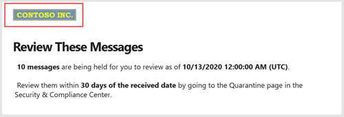

# <a name="quarantine-tags"></a><span data-ttu-id="464d2-103">Marcas de quarentena</span><span class="sxs-lookup"><span data-stu-id="464d2-103">Quarantine tags</span></span>

> [!NOTE]
> <span data-ttu-id="464d2-104">Os recursos descritos neste artigo estão atualmente em versão prévia, que não estão disponíveis para todos, e estão sujeitos a alterações.</span><span class="sxs-lookup"><span data-stu-id="464d2-104">The features that are described in this article are currently in Preview, aren't available to everyone, and are subject to change.</span></span>

<span data-ttu-id="464d2-105">As marcas de quarentena na proteção do Exchange Online (EOP) permitem que os administradores controlem o que os usuários podem fazer com as mensagens em quarentena com base em como a mensagem chegou em quarentena.</span><span class="sxs-lookup"><span data-stu-id="464d2-105">Quarantine tags in Exchange Online Protection (EOP) allow admins to control what users are able to do to their quarantined messages based on how the message arrived in quarantine.</span></span>

<span data-ttu-id="464d2-106">O EOP tradicionalmente permitiu ou evitou determinados níveis de interatividade para mensagens em [quarentena](find-and-release-quarantined-messages-as-a-user.md) e em [notificações de spam do usuário final](use-spam-notifications-to-release-and-report-quarantined-messages.md).</span><span class="sxs-lookup"><span data-stu-id="464d2-106">EOP has traditionally allowed or prevented certain levels of interactivity for messages in [quarantine](find-and-release-quarantined-messages-as-a-user.md) and in [end-user spam notifications](use-spam-notifications-to-release-and-report-quarantined-messages.md).</span></span> <span data-ttu-id="464d2-107">Por exemplo, os usuários finais podem exibir e liberar mensagens em quarentena por filtragem antispam como spam ou em massa, mas não podem exibir nem liberar mensagens em quarentena como phishing de alta confiança.</span><span class="sxs-lookup"><span data-stu-id="464d2-107">For example, end-users can view and release messages that were quarantined by anti-spam filtering as spam or bulk, but they can't view or release messages that were quarantined as high confidence phishing.</span></span>

<span data-ttu-id="464d2-108">Para [recursos de proteção compatíveis](#step-2-assign-a-quarantine-tag-to-supported-features), as marcas de quarentena especificam o que os usuários podem fazer nas mensagens de notificação de spam do usuário final e em suas mensagens em quarentena em quarentena (mensagens nas quais o usuário é um destinatário).</span><span class="sxs-lookup"><span data-stu-id="464d2-108">For [supported protection features](#step-2-assign-a-quarantine-tag-to-supported-features), quarantine tags specify what users are allowed to do in end-user spam notification messages and in their quarantined messages in quarantine (messages where the user is a recipient).</span></span> <span data-ttu-id="464d2-109">As marcas de quarentena padrão são atribuídas automaticamente para impor as funcionalidades históricas para usuários finais em mensagens em quarentena.</span><span class="sxs-lookup"><span data-stu-id="464d2-109">Default quarantine tags are automatically assigned to enforce the historical capabilities for end-users on quarantined messages.</span></span> <span data-ttu-id="464d2-110">Ou você pode criar e atribuir marcas de quarentena personalizadas para permitir ou impedir que os usuários finais realizem ações específicas em mensagens em quarentena.</span><span class="sxs-lookup"><span data-stu-id="464d2-110">Or, you can create and assign custom quarantine tags to allow or prevent end-users from performing specific actions on quarantined messages.</span></span>

<span data-ttu-id="464d2-111">As permissões individuais são combinadas nos seguintes grupos de permissões predefinidos:</span><span class="sxs-lookup"><span data-stu-id="464d2-111">The individual permissions are combined into the following preset permission groups:</span></span>

- <span data-ttu-id="464d2-112">Sem acesso</span><span class="sxs-lookup"><span data-stu-id="464d2-112">No access</span></span>
- <span data-ttu-id="464d2-113">Acesso limitado</span><span class="sxs-lookup"><span data-stu-id="464d2-113">Limited access</span></span>
- <span data-ttu-id="464d2-114">Acesso completo</span><span class="sxs-lookup"><span data-stu-id="464d2-114">Full access</span></span>

<span data-ttu-id="464d2-115">As permissões individuais disponíveis e o que está incluído ou não incluído nos grupos de permissões predefinidos são descritos na tabela a seguir:</span><span class="sxs-lookup"><span data-stu-id="464d2-115">The available individual permissions and what's included or not included in the preset permission groups are described in the following table:</span></span>

|<span data-ttu-id="464d2-116">Permissão</span><span class="sxs-lookup"><span data-stu-id="464d2-116">Permission</span></span>|<span data-ttu-id="464d2-117">Sem acesso</span><span class="sxs-lookup"><span data-stu-id="464d2-117">No access</span></span>|<span data-ttu-id="464d2-118">Acesso limitado</span><span class="sxs-lookup"><span data-stu-id="464d2-118">Limited access</span></span>|<span data-ttu-id="464d2-119">Acesso completo</span><span class="sxs-lookup"><span data-stu-id="464d2-119">Full access</span></span>|
|---|:---:|:---:|:---:|
|<span data-ttu-id="464d2-120">**Permitir remetente** (_PermissionToAllowSender_)</span><span class="sxs-lookup"><span data-stu-id="464d2-120">**Allow sender** (_PermissionToAllowSender_)</span></span>||||
|<span data-ttu-id="464d2-122">**Bloquear remetente** (_PermissionToBlockSender_)</span><span class="sxs-lookup"><span data-stu-id="464d2-122">**Block sender** (_PermissionToBlockSender_)</span></span>||||
|<span data-ttu-id="464d2-125">**Excluir** (_PermissionToDelete_)</span><span class="sxs-lookup"><span data-stu-id="464d2-125">**Delete** (_PermissionToDelete_)</span></span>||||
|<span data-ttu-id="464d2-128">**Visualização** (_PermissionToPreview_)</span><span class="sxs-lookup"><span data-stu-id="464d2-128">**Preview** (_PermissionToPreview_)</span></span>||||
|<span data-ttu-id="464d2-131">**Permitir que os destinatários liberem uma mensagem da quarentena** (_PermissionToRelease_)</span><span class="sxs-lookup"><span data-stu-id="464d2-131">**Allow recipients to release a message from quarantine** (_PermissionToRelease_)</span></span>||||
|<span data-ttu-id="464d2-133">**Permitir que os destinatários solicitem uma mensagem a ser liberada da quarentena** (_PermissionToRequestRelease_)</span><span class="sxs-lookup"><span data-stu-id="464d2-133">**Allow recipients to request a message to be released from quarantine** (_PermissionToRequestRelease_)</span></span>||||
|

<span data-ttu-id="464d2-135">Se você não gostar das permissões padrão nos grupos de permissão predefinidos, poderá usar permissões personalizadas ao criar ou modificar as marcas de quarentena personalizadas.</span><span class="sxs-lookup"><span data-stu-id="464d2-135">If you don't like the default permissions in the preset permission groups, you can use custom permissions when you create or modify custom quarantine tags.</span></span> <span data-ttu-id="464d2-136">Para obter mais informações sobre o que cada permissão faz, consulte a seção [detalhes da permissão de marca de quarentena](#quarantine-tag-permission-details) mais adiante neste artigo.</span><span class="sxs-lookup"><span data-stu-id="464d2-136">For more information about what each permission does, see the [Quarantine tag permission details](#quarantine-tag-permission-details) section later in this article.</span></span>

<span data-ttu-id="464d2-137">Você cria e atribui as marcas de quarentena no centro de conformidade & segurança ou no PowerShell (PowerShell do Exchange Online para organizações do Microsoft 365 com caixas de correio do Exchange Online; EOP PowerShell autônomo em organizações do EOP sem caixas de correio do Exchange Online).</span><span class="sxs-lookup"><span data-stu-id="464d2-137">You create and assign quarantine tags in the Security & Compliance Center or in PowerShell (Exchange Online PowerShell for Microsoft 365 organizations with Exchange Online Mailboxes; standalone EOP PowerShell in EOP organizations without Exchange Online mailboxes).</span></span>

## <a name="what-do-you-need-to-know-before-you-begin"></a><span data-ttu-id="464d2-138">Do que você precisa saber para começar?</span><span class="sxs-lookup"><span data-stu-id="464d2-138">What do you need to know before you begin?</span></span>

- <span data-ttu-id="464d2-139">Abra o Centro de Conformidade e Segurança em <https://protection.office.com/>.</span><span class="sxs-lookup"><span data-stu-id="464d2-139">You open the Security & Compliance Center at <https://protection.office.com/>.</span></span> <span data-ttu-id="464d2-140">Para ir diretamente para a página de **marcas de quarentena** , abra <https://protection.office.com/quarantineTags> .</span><span class="sxs-lookup"><span data-stu-id="464d2-140">To go directly to the **Quarantine tags** page, open <https://protection.office.com/quarantineTags>.</span></span>

- <span data-ttu-id="464d2-141">Para se conectar ao PowerShell do Exchange Online, confira [Conectar ao PowerShell do Exchange Online](https://docs.microsoft.com/powershell/exchange/connect-to-exchange-online-powershell).</span><span class="sxs-lookup"><span data-stu-id="464d2-141">To connect to Exchange Online PowerShell, see [Connect to Exchange Online PowerShell](https://docs.microsoft.com/powershell/exchange/connect-to-exchange-online-powershell).</span></span> <span data-ttu-id="464d2-142">Para se conectar ao EOP PowerShell autônomo, consulte [Conectar-se ao PowerShell do Exchange Online Protection.](https://docs.microsoft.com/powershell/exchange/connect-to-exchange-online-protection-powershell).</span><span class="sxs-lookup"><span data-stu-id="464d2-142">To connect to standalone EOP PowerShell, see [Connect to Exchange Online Protection PowerShell](https://docs.microsoft.com/powershell/exchange/connect-to-exchange-online-protection-powershell).</span></span>

- <span data-ttu-id="464d2-143">Para exibir, criar, modificar ou remover marcas de quarentena, você precisa ser membro de um dos grupos de função a seguir:</span><span class="sxs-lookup"><span data-stu-id="464d2-143">To view, create, modify, or remove quarantine tags, you need to be a member of one of the following role groups:</span></span>
  - <span data-ttu-id="464d2-144">**Gerenciamento de organizações** ou **Administrador de segurança** no [Centro de segurança e conformidade](permissions-in-the-security-and-compliance-center.md).</span><span class="sxs-lookup"><span data-stu-id="464d2-144">**Organization Management** or **Security Administrator** in the [Security & Compliance Center](permissions-in-the-security-and-compliance-center.md).</span></span>
  - <span data-ttu-id="464d2-145">**Gerenciamento de organizações** ou **Gerenciamento de higiene** no [Exchange Online](https://docs.microsoft.com/Exchange/permissions-exo/permissions-exo#role-groups).</span><span class="sxs-lookup"><span data-stu-id="464d2-145">**Organization Management** or **Hygiene Management** in [Exchange Online](https://docs.microsoft.com/Exchange/permissions-exo/permissions-exo#role-groups).</span></span>

## <a name="step-1-create-quarantine-tags-in-the-security--compliance-center"></a><span data-ttu-id="464d2-146">Etapa 1: criar marcas de quarentena no centro de conformidade e segurança &</span><span class="sxs-lookup"><span data-stu-id="464d2-146">Step 1: Create quarantine tags in the Security & Compliance Center</span></span>

1. <span data-ttu-id="464d2-147">No centro de conformidade & segurança, vá para política de **Gerenciamento de ameaças** \> **Policy** e selecione **marcas de quarentena**.</span><span class="sxs-lookup"><span data-stu-id="464d2-147">In the Security & Compliance Center, go to **Threat management** \> **Policy** and then select **Quarantine tags**.</span></span>

2. <span data-ttu-id="464d2-148">Na página **marcas de quarentena** , selecione **adicionar marca personalizada**.</span><span class="sxs-lookup"><span data-stu-id="464d2-148">On the **Quarantine tags** page, select **Add custom tag**.</span></span>

3. <span data-ttu-id="464d2-149">O assistente **novo marcador** é aberto.</span><span class="sxs-lookup"><span data-stu-id="464d2-149">The **New tag** wizard opens.</span></span> <span data-ttu-id="464d2-150">Na página **nome da marca** , insira um nome curto, mas exclusivo, no campo **nome da marca** .</span><span class="sxs-lookup"><span data-stu-id="464d2-150">On the **Tag name** page, enter a brief but unique name in the **Tag name** field.</span></span> <span data-ttu-id="464d2-151">Você precisará identificar e selecionar a marca pelo nome em etapas futuras.</span><span class="sxs-lookup"><span data-stu-id="464d2-151">You'll need to identify and select the tag by name in upcoming steps.</span></span> <span data-ttu-id="464d2-152">Quando terminar, clique em **Avançar**.</span><span class="sxs-lookup"><span data-stu-id="464d2-152">When you're finished, click **Next**.</span></span>

4. <span data-ttu-id="464d2-153">Na página **acesso a mensagens de destinatário** , selecione um dos seguintes valores:</span><span class="sxs-lookup"><span data-stu-id="464d2-153">On the **Recipient message access** page, select one of the following values:</span></span>
   - <span data-ttu-id="464d2-154">**Sem acesso**</span><span class="sxs-lookup"><span data-stu-id="464d2-154">**No access**</span></span>
   - <span data-ttu-id="464d2-155">**Acesso limitado**</span><span class="sxs-lookup"><span data-stu-id="464d2-155">**Limited access**</span></span>
   - <span data-ttu-id="464d2-156">**Acesso completo**</span><span class="sxs-lookup"><span data-stu-id="464d2-156">**Full access**</span></span>

   <span data-ttu-id="464d2-157">As permissões individuais incluídas nesses grupos de permissão são descritas anteriormente neste artigo.</span><span class="sxs-lookup"><span data-stu-id="464d2-157">The individual permissions that are included in these permission groups are described earlier in this article.</span></span>

   <span data-ttu-id="464d2-158">Para especificar permissões personalizadas, selecione **Definir acesso específico (avançado)** e defina as seguintes configurações:</span><span class="sxs-lookup"><span data-stu-id="464d2-158">To specify custom permissions, select **Set specific access (Advanced)** and configure the following settings:</span></span>

     - <span data-ttu-id="464d2-159">**Selecione a preferência de ação de liberação**: selecione um dos seguintes valores:</span><span class="sxs-lookup"><span data-stu-id="464d2-159">**Select release action preference**: Select one of the following values:</span></span>
       - <span data-ttu-id="464d2-160">**Nenhuma ação de versão**: Este é o valor padrão.</span><span class="sxs-lookup"><span data-stu-id="464d2-160">**No release action**: This is the default value.</span></span>
       - <span data-ttu-id="464d2-161">**Permitir que os destinatários liberem uma mensagem da quarentena**</span><span class="sxs-lookup"><span data-stu-id="464d2-161">**Allow recipients to release a message from quarantine**</span></span>
       - <span data-ttu-id="464d2-162">**Permitir que os destinatários solicitem uma mensagem a ser liberada da quarentena**</span><span class="sxs-lookup"><span data-stu-id="464d2-162">**Allow recipients to request a message to be released from quarantine**</span></span>

     - <span data-ttu-id="464d2-163">**Selecionar ações adicionais os destinatários podem executar em mensagens em quarentena**: selecione alguns, todos ou nenhum dos seguintes valores:</span><span class="sxs-lookup"><span data-stu-id="464d2-163">**Select additional actions recipients can take on quarantined messages**: Select some, all, or none of the following values:</span></span>
       - <span data-ttu-id="464d2-164">**Delete**</span><span class="sxs-lookup"><span data-stu-id="464d2-164">**Delete**</span></span>
       - <span data-ttu-id="464d2-165">**Visualização**</span><span class="sxs-lookup"><span data-stu-id="464d2-165">**Preview**</span></span>
       - <span data-ttu-id="464d2-166">**Permitir remetente**</span><span class="sxs-lookup"><span data-stu-id="464d2-166">**Allow sender**</span></span>
       - <span data-ttu-id="464d2-167">**Bloquear remetente**</span><span class="sxs-lookup"><span data-stu-id="464d2-167">**Block sender**</span></span>

   <span data-ttu-id="464d2-168">Essas permissões e seus efeitos nas mensagens em quarentena e nas notificações de spam do usuário final são descritos na seção [detalhes da permissão de marca de quarentena](#quarantine-tag-permission-details) mais adiante neste artigo.</span><span class="sxs-lookup"><span data-stu-id="464d2-168">These permissions and their effect on quarantined messages and in end-user spam notifications are described in the [Quarantine tag permission details](#quarantine-tag-permission-details) section later in this article.</span></span>

   <span data-ttu-id="464d2-169">Quando terminar, clique em **Avançar**.</span><span class="sxs-lookup"><span data-stu-id="464d2-169">When you're finished, click **Next**.</span></span>

5. <span data-ttu-id="464d2-170">Na página de **Resumo** exibida, revise suas configurações.</span><span class="sxs-lookup"><span data-stu-id="464d2-170">On the **Summary** page that appears, review your settings.</span></span> <span data-ttu-id="464d2-171">Você pode clicar em **Editar** em cada configuração para modificá-la.</span><span class="sxs-lookup"><span data-stu-id="464d2-171">You can click **Edit** on each setting to modify it.</span></span>

   <span data-ttu-id="464d2-172">Quando tiver concluído, clique em **Enviar**.</span><span class="sxs-lookup"><span data-stu-id="464d2-172">When you're finished, click **Submit**.</span></span>

6. <span data-ttu-id="464d2-173">Clique em **concluído** na página de confirmação exibida.</span><span class="sxs-lookup"><span data-stu-id="464d2-173">Click **Done** on the confirmation page that appears.</span></span>

<span data-ttu-id="464d2-174">Agora você está pronto para atribuir a marca de quarentena a um recurso de quarentena, conforme descrito na seção [etapa 2](#step-2-assign-a-quarantine-tag-to-supported-features) .</span><span class="sxs-lookup"><span data-stu-id="464d2-174">Now you are ready to assign the quarantine tag to a quarantine feature as described in the [Step 2](#step-2-assign-a-quarantine-tag-to-supported-features) section.</span></span>

### <a name="create-quarantine-tags-in-powershell"></a><span data-ttu-id="464d2-175">Criar marcas de quarentena no PowerShell</span><span class="sxs-lookup"><span data-stu-id="464d2-175">Create quarantine tags in PowerShell</span></span>

<span data-ttu-id="464d2-176">Se preferir usar o PowerShell para criar marcas de quarentena, conecte-se ao PowerShell do Exchange Online ou do Exchange Online Protection e use o cmdlet **New-QuarantineTag** .</span><span class="sxs-lookup"><span data-stu-id="464d2-176">If you'd rather use PowerShell to create quarantine tags, connect to Exchange Online PowerShell or Exchange Online Protection PowerShell and use the **New-QuarantineTag** cmdlet.</span></span> <span data-ttu-id="464d2-177">Você tem dois métodos diferentes para escolher:</span><span class="sxs-lookup"><span data-stu-id="464d2-177">You have two different methods to choose from:</span></span>

- <span data-ttu-id="464d2-178">Use o parâmetro _EndUserQuarantinePermissionsValue_ .</span><span class="sxs-lookup"><span data-stu-id="464d2-178">Use the _EndUserQuarantinePermissionsValue_ parameter.</span></span>
- <span data-ttu-id="464d2-179">Use o parâmetro _EndUserQuarantinePermissions_ .</span><span class="sxs-lookup"><span data-stu-id="464d2-179">Use the _EndUserQuarantinePermissions_ parameter.</span></span>

<span data-ttu-id="464d2-180">Esses métodos são descritos nas seções a seguir.</span><span class="sxs-lookup"><span data-stu-id="464d2-180">These methods are described in the following sections.</span></span>

#### <a name="use-the-enduserquarantinepermissionsvalue-parameter"></a><span data-ttu-id="464d2-181">Usar o parâmetro EndUserQuarantinePermissionsValue</span><span class="sxs-lookup"><span data-stu-id="464d2-181">Use the EndUserQuarantinePermissionsValue parameter</span></span>

<span data-ttu-id="464d2-182">Para criar uma marca de quarentena usando o parâmetro _EndUserQuarantinePermissionsValue_ , use a seguinte sintaxe:</span><span class="sxs-lookup"><span data-stu-id="464d2-182">To create a quarantine tag using the _EndUserQuarantinePermissionsValue_ parameter, use the following syntax:</span></span>

```powershell
New-QuarantineTag -Name "<UniqueName>" -EndUserQuarantinePermissionsValue <0 to 236>
```

<span data-ttu-id="464d2-183">O parâmetro _EndUserQuarantinePermissionsValue_ usa um valor decimal que é convertido de um valor binário.</span><span class="sxs-lookup"><span data-stu-id="464d2-183">The _EndUserQuarantinePermissionsValue_ parameter uses a decimal value that's converted from a binary value.</span></span> <span data-ttu-id="464d2-184">O valor binário corresponde às permissões de quarentena de usuário final disponíveis em uma ordem específica.</span><span class="sxs-lookup"><span data-stu-id="464d2-184">The binary value corresponds to the available end-user quarantine permissions in a specific order.</span></span> <span data-ttu-id="464d2-185">Para cada permissão, o valor 1 é igual a verdadeiro e o valor 0 é igual a falso.</span><span class="sxs-lookup"><span data-stu-id="464d2-185">For each permission, the value 1 equals True and the value 0 equals False.</span></span>

<span data-ttu-id="464d2-186">A ordem e os valores necessários para cada permissão individual em grupos de permissões predefinidos são descritos na tabela a seguir:</span><span class="sxs-lookup"><span data-stu-id="464d2-186">The required order and values for each individual permission in preset permission groups are described in the following table:</span></span>

****

|<span data-ttu-id="464d2-187">Permissão</span><span class="sxs-lookup"><span data-stu-id="464d2-187">Permission</span></span>|<span data-ttu-id="464d2-188">Sem acesso</span><span class="sxs-lookup"><span data-stu-id="464d2-188">No access</span></span>|<span data-ttu-id="464d2-189">Acesso limitado</span><span class="sxs-lookup"><span data-stu-id="464d2-189">Limited access</span></span>|<span data-ttu-id="464d2-190">Acesso completo</span><span class="sxs-lookup"><span data-stu-id="464d2-190">Full access</span></span>|
|---|:---:|:---:|:---:|
|<span data-ttu-id="464d2-191">PermissionToAllowSender</span><span class="sxs-lookup"><span data-stu-id="464d2-191">PermissionToAllowSender</span></span>|<span data-ttu-id="464d2-192">,0</span><span class="sxs-lookup"><span data-stu-id="464d2-192">0</span></span>|<span data-ttu-id="464d2-193">,0</span><span class="sxs-lookup"><span data-stu-id="464d2-193">0</span></span>|<span data-ttu-id="464d2-194">1</span><span class="sxs-lookup"><span data-stu-id="464d2-194">1</span></span>|
|<span data-ttu-id="464d2-195">PermissionToBlockSender</span><span class="sxs-lookup"><span data-stu-id="464d2-195">PermissionToBlockSender</span></span>|<span data-ttu-id="464d2-196">,0</span><span class="sxs-lookup"><span data-stu-id="464d2-196">0</span></span>|<span data-ttu-id="464d2-197">1</span><span class="sxs-lookup"><span data-stu-id="464d2-197">1</span></span>|<span data-ttu-id="464d2-198">1</span><span class="sxs-lookup"><span data-stu-id="464d2-198">1</span></span>|
|<span data-ttu-id="464d2-199">PermissionToDelete</span><span class="sxs-lookup"><span data-stu-id="464d2-199">PermissionToDelete</span></span>|<span data-ttu-id="464d2-200">,0</span><span class="sxs-lookup"><span data-stu-id="464d2-200">0</span></span>|<span data-ttu-id="464d2-201">1</span><span class="sxs-lookup"><span data-stu-id="464d2-201">1</span></span>|<span data-ttu-id="464d2-202">1</span><span class="sxs-lookup"><span data-stu-id="464d2-202">1</span></span>|
|<span data-ttu-id="464d2-203">PermissionToDownload<sup>\*</sup></span><span class="sxs-lookup"><span data-stu-id="464d2-203">PermissionToDownload<sup>\*</sup></span></span>|<span data-ttu-id="464d2-204">,0</span><span class="sxs-lookup"><span data-stu-id="464d2-204">0</span></span>|<span data-ttu-id="464d2-205">,0</span><span class="sxs-lookup"><span data-stu-id="464d2-205">0</span></span>|<span data-ttu-id="464d2-206">,0</span><span class="sxs-lookup"><span data-stu-id="464d2-206">0</span></span>|
|<span data-ttu-id="464d2-207">PermissionToPreview</span><span class="sxs-lookup"><span data-stu-id="464d2-207">PermissionToPreview</span></span>|<span data-ttu-id="464d2-208">,0</span><span class="sxs-lookup"><span data-stu-id="464d2-208">0</span></span>|<span data-ttu-id="464d2-209">1</span><span class="sxs-lookup"><span data-stu-id="464d2-209">1</span></span>|<span data-ttu-id="464d2-210">1</span><span class="sxs-lookup"><span data-stu-id="464d2-210">1</span></span>|
|<span data-ttu-id="464d2-211">PermissionToRelease<sup>\*\*</sup></span><span class="sxs-lookup"><span data-stu-id="464d2-211">PermissionToRelease<sup>\*\*</sup></span></span>|<span data-ttu-id="464d2-212">,0</span><span class="sxs-lookup"><span data-stu-id="464d2-212">0</span></span>|<span data-ttu-id="464d2-213">,0</span><span class="sxs-lookup"><span data-stu-id="464d2-213">0</span></span>|<span data-ttu-id="464d2-214">1</span><span class="sxs-lookup"><span data-stu-id="464d2-214">1</span></span>|
|<span data-ttu-id="464d2-215">PermissionToRequestRelease<sup>\*\*</sup></span><span class="sxs-lookup"><span data-stu-id="464d2-215">PermissionToRequestRelease<sup>\*\*</sup></span></span>|<span data-ttu-id="464d2-216">,0</span><span class="sxs-lookup"><span data-stu-id="464d2-216">0</span></span>|<span data-ttu-id="464d2-217">1</span><span class="sxs-lookup"><span data-stu-id="464d2-217">1</span></span>|<span data-ttu-id="464d2-218">,0</span><span class="sxs-lookup"><span data-stu-id="464d2-218">0</span></span>|
|<span data-ttu-id="464d2-219">PermissionToViewHeader<sup>\*</sup></span><span class="sxs-lookup"><span data-stu-id="464d2-219">PermissionToViewHeader<sup>\*</sup></span></span>|<span data-ttu-id="464d2-220">,0</span><span class="sxs-lookup"><span data-stu-id="464d2-220">0</span></span>|<span data-ttu-id="464d2-221">,0</span><span class="sxs-lookup"><span data-stu-id="464d2-221">0</span></span>|<span data-ttu-id="464d2-222">,0</span><span class="sxs-lookup"><span data-stu-id="464d2-222">0</span></span>|
|<span data-ttu-id="464d2-223">Valor binário</span><span class="sxs-lookup"><span data-stu-id="464d2-223">Binary value</span></span>|<span data-ttu-id="464d2-224">00000000</span><span class="sxs-lookup"><span data-stu-id="464d2-224">00000000</span></span>|<span data-ttu-id="464d2-225">01101010</span><span class="sxs-lookup"><span data-stu-id="464d2-225">01101010</span></span>|<span data-ttu-id="464d2-226">11101100</span><span class="sxs-lookup"><span data-stu-id="464d2-226">11101100</span></span>|
|<span data-ttu-id="464d2-227">Valor decimal a ser usado</span><span class="sxs-lookup"><span data-stu-id="464d2-227">Decimal value to use</span></span>|<span data-ttu-id="464d2-228">,0</span><span class="sxs-lookup"><span data-stu-id="464d2-228">0</span></span>|<span data-ttu-id="464d2-229">106</span><span class="sxs-lookup"><span data-stu-id="464d2-229">106</span></span>|<span data-ttu-id="464d2-230">236</span><span class="sxs-lookup"><span data-stu-id="464d2-230">236</span></span>|

<span data-ttu-id="464d2-231"><sup>\*</sup> No momento, esse valor é sempre 0.</span><span class="sxs-lookup"><span data-stu-id="464d2-231"><sup>\*</sup> Currently, this value is always 0.</span></span> <span data-ttu-id="464d2-232">Para PermissionToViewHeader, o valor 0 não oculta o botão **exibir cabeçalho da mensagem** nos detalhes da mensagem em quarentena (o botão está sempre disponível).</span><span class="sxs-lookup"><span data-stu-id="464d2-232">For PermissionToViewHeader, the value 0 doesn't hide the **View message header** button in the details of the quarantined message (the button is always available).</span></span>

<span data-ttu-id="464d2-233"><sup>\*\*</sup> Não defina esses dois valores como 1.</span><span class="sxs-lookup"><span data-stu-id="464d2-233"><sup>\*\*</sup> Don't set both of these values to 1.</span></span> <span data-ttu-id="464d2-234">Defina um como 1 e o outro como 0, ou defina ambos como 0.</span><span class="sxs-lookup"><span data-stu-id="464d2-234">Set one to 1 and the other to 0, or set both to 0.</span></span>

<span data-ttu-id="464d2-235">Este exemplo cria um novo nome de marca de quarentena NoAccess que atribui as permissões sem acesso conforme descrito na tabela anterior.</span><span class="sxs-lookup"><span data-stu-id="464d2-235">This example creates a new quarantine tag name NoAccess that assigns the No access permissions as described in the previous table.</span></span>

```powershell
New-QuarantineTag -Name NoAccess -EndUserQuarantinePermissionsValue 0
```

<span data-ttu-id="464d2-236">Para permissões de acesso limitado, use o valor 106.</span><span class="sxs-lookup"><span data-stu-id="464d2-236">For Limited access permissions, use the value 106.</span></span> <span data-ttu-id="464d2-237">Para permissões de acesso total, use o valor 236.</span><span class="sxs-lookup"><span data-stu-id="464d2-237">For Full access permissions, use the value 236.</span></span>

<span data-ttu-id="464d2-238">Para permissões personalizadas, use a tabela anterior para obter o valor binário que corresponde às permissões desejadas.</span><span class="sxs-lookup"><span data-stu-id="464d2-238">For custom permissions, use the previous table to get the binary value that corresponds to the permissions you want.</span></span> <span data-ttu-id="464d2-239">Converta o valor binário em um valor decimal e use o valor decimal para o parâmetro _EndUserQuarantinePermissionsValue_ .</span><span class="sxs-lookup"><span data-stu-id="464d2-239">Convert the binary value to a decimal value and use the decimal value for the _EndUserQuarantinePermissionsValue_ parameter.</span></span>

<span data-ttu-id="464d2-240">Para informações detalhadas de sintaxes e de parâmetros, consulte [New-QuarantineTag](https://docs.microsoft.com/powershell/module/exchange/new-quarantinetag).</span><span class="sxs-lookup"><span data-stu-id="464d2-240">For detailed syntax and parameter information, see [New-QuarantineTag](https://docs.microsoft.com/powershell/module/exchange/new-quarantinetag).</span></span>

#### <a name="use-the-enduserquarantinepermissions-parameter"></a><span data-ttu-id="464d2-241">Usar o parâmetro EndUserQuarantinePermissions</span><span class="sxs-lookup"><span data-stu-id="464d2-241">Use the EndUserQuarantinePermissions parameter</span></span>

<span data-ttu-id="464d2-242">Para criar uma marca de quarentena usando o parâmetro _EndUserQuarantinePermissionsValue_ , siga estas etapas:</span><span class="sxs-lookup"><span data-stu-id="464d2-242">To create a quarantine tag using the _EndUserQuarantinePermissionsValue_ parameter, do the following steps:</span></span>

<span data-ttu-id="464d2-243">R.</span><span class="sxs-lookup"><span data-stu-id="464d2-243">A.</span></span> <span data-ttu-id="464d2-244">Armazenar um objeto de permissões de quarentena em uma variável usando o cmdlet **New-QuarantinePermissions** .</span><span class="sxs-lookup"><span data-stu-id="464d2-244">Store a quarantine permissions object in a variable using the **New-QuarantinePermissions** cmdlet.</span></span>
<br/>
<span data-ttu-id="464d2-245">A.b.c..</span><span class="sxs-lookup"><span data-stu-id="464d2-245">B.</span></span> <span data-ttu-id="464d2-246">Use a variável como o valor _EndUserQuarantinePermissions_ no comando **New-QuarantineTag** .</span><span class="sxs-lookup"><span data-stu-id="464d2-246">Use the variable as the _EndUserQuarantinePermissions_ value in the **New-QuarantineTag** command.</span></span>

##### <a name="step-a-store-a-quarantine-permissions-object-in-a-variable"></a><span data-ttu-id="464d2-247">Etapa A: armazenar um objeto de permissões de quarentena em uma variável</span><span class="sxs-lookup"><span data-stu-id="464d2-247">Step A: Store a quarantine permissions object in a variable</span></span>

<span data-ttu-id="464d2-248">Use a seguinte sintaxe:</span><span class="sxs-lookup"><span data-stu-id="464d2-248">Use the following syntax:</span></span>

```powershell
$<VariableName> = New-QuarantinePermissions [-PermissionToAllowSender <$true | $False>] [-PermissionToBlockSender <$true | $False>] [-PermissionToDelete <$true | $False>] [-PermissionToPreview <$true | $False>] [-PermissionToRelease <$true | $False>] [-PermissionToRequestRelease <$true | $False>]
```

<span data-ttu-id="464d2-249">O valor padrão para todos os parâmetros não utilizados é que `$false` você só precisa usar os parâmetros para os quais você deseja definir o valor `$true` .</span><span class="sxs-lookup"><span data-stu-id="464d2-249">The default value for any unused parameters is `$false`, so you only need to use the parameters where you want to set value to `$true`.</span></span>

<span data-ttu-id="464d2-250">Os exemplos a seguir mostram como criar objetos Permission que correspondam aos grupos de permissões predefinidas:</span><span class="sxs-lookup"><span data-stu-id="464d2-250">The following examples show how to create permission objects that correspond to the preset permissions groups:</span></span>

- <span data-ttu-id="464d2-251">**Sem acesso**:</span><span class="sxs-lookup"><span data-stu-id="464d2-251">**No access**:</span></span>

  ```powershell
  $NoAccess = New-QuarantinePermissions
  ```

- <span data-ttu-id="464d2-252">**Acesso limitado**:</span><span class="sxs-lookup"><span data-stu-id="464d2-252">**Limited access**:</span></span>

  ```powershell
  $LimitedAccess = New-QuarantinePermissions -PermissionToBlockSender $true -PermissionToDelete $true -PermissionToPreview $true -PermissionToRequestRelease $true
  ```

- <span data-ttu-id="464d2-253">**Acesso completo**:</span><span class="sxs-lookup"><span data-stu-id="464d2-253">**Full access**:</span></span>

  ```powershell
  $FullAccess = New-QuarantinePermissions -PermissionToAllowSender $true -PermissionToBlockSender $true -PermissionToDelete $true -PermissionToPreview $true -PermissionToRelease $true
  ```

<span data-ttu-id="464d2-254">Para ver os valores que você definiu, execute o nome da variável como um comando (por exemplo, execute o comando `$NoAccess` ).</span><span class="sxs-lookup"><span data-stu-id="464d2-254">To see the values that you've set, run the variable name as a command (for example, run the command `$NoAccess`).</span></span>

<span data-ttu-id="464d2-255">Para permissões personalizadas, não defina os parâmetros _PermissionToRelease_ e _PermissionToRequestRelease_ como `$true` .</span><span class="sxs-lookup"><span data-stu-id="464d2-255">For custom permissions, don't set both the _PermissionToRelease_ and _PermissionToRequestRelease_ parameters to `$true`.</span></span> <span data-ttu-id="464d2-256">Defina um como `$true` e deixe o outro como `$false` ou deixe como `$false` .</span><span class="sxs-lookup"><span data-stu-id="464d2-256">Set one to `$true` and leave the other as `$false`, or leave both as `$false`.</span></span>

<span data-ttu-id="464d2-257">Você também pode modificar uma variável de objeto Permissions existente depois de criar, mas antes de usá-la usando o cmdlet **set-QuarantinePermissions** .</span><span class="sxs-lookup"><span data-stu-id="464d2-257">You can also modify an existing permissions object variable after you create but before you use it by using the **Set-QuarantinePermissions** cmdlet.</span></span>

<span data-ttu-id="464d2-258">Para informações detalhadas de sintaxes e de parâmetros, consulte [New-QuarantinePermissions](https://docs.microsoft.com/powershell/module/exchange/new-quarantinepermissions) e [set-QuarantinePermissions](https://docs.microsoft.com/powershell/module/exchange/set-quarantinepermissions).</span><span class="sxs-lookup"><span data-stu-id="464d2-258">For detailed syntax and parameter information, see [New-QuarantinePermissions](https://docs.microsoft.com/powershell/module/exchange/new-quarantinepermissions) and [Set-QuarantinePermissions](https://docs.microsoft.com/powershell/module/exchange/set-quarantinepermissions).</span></span>

##### <a name="step-b-use-the-variable-in-the-new-quarantinetag-command"></a><span data-ttu-id="464d2-259">Etapa B: usar a variável no comando New-QuarantineTag</span><span class="sxs-lookup"><span data-stu-id="464d2-259">Step B: Use the variable in the New-QuarantineTag command</span></span>

<span data-ttu-id="464d2-260">Depois de criar e armazenar o objeto Permissions em uma variável, use a variável para o valor do parâmetro _EndUserQuarantinePermission_ no seguinte comando **New-QuarantineTag** :</span><span class="sxs-lookup"><span data-stu-id="464d2-260">After you've created and stored the permissions object in a variable, use the variable for the _EndUserQuarantinePermission_ parameter value in the following **New-QuarantineTag** command:</span></span>

```powershell
New-QuarantineTag -Name "<UniqueName>" -EndUserQuarantinePermissions $<VariableName>
```

<span data-ttu-id="464d2-261">Este exemplo cria uma nova marca de quarentena chamada LimitedAccess usando o `$LimitedAccess` objeto Permissions descrito e criado na etapa anterior.</span><span class="sxs-lookup"><span data-stu-id="464d2-261">This example creates a new quarantine tag named LimitedAccess using the `$LimitedAccess` permissions object that was described and created in the previous step.</span></span>

```powershell
New-QuarantineTag -Name LimitedAccess -EndUserQuarantinePermissions $LimitedAccess
```

<span data-ttu-id="464d2-262">Para informações detalhadas de sintaxes e de parâmetros, consulte [New-QuarantineTag](https://docs.microsoft.com/powershell/module/exchange/new-quarantinetag).</span><span class="sxs-lookup"><span data-stu-id="464d2-262">For detailed syntax and parameter information, see [New-QuarantineTag](https://docs.microsoft.com/powershell/module/exchange/new-quarantinetag).</span></span>

## <a name="step-2-assign-a-quarantine-tag-to-supported-features"></a><span data-ttu-id="464d2-263">Etapa 2: atribuir uma marca de quarentena aos recursos com suporte</span><span class="sxs-lookup"><span data-stu-id="464d2-263">Step 2: Assign a quarantine tag to supported features</span></span>

<span data-ttu-id="464d2-264">Em recursos de proteção _com suporte_ que colocadas em quarentena mensagens ou arquivos (automaticamente ou como uma ação configurável), você pode atribuir uma marca de quarentena às ações de quarentena disponíveis.</span><span class="sxs-lookup"><span data-stu-id="464d2-264">In _supported_ protection features that quarantine messages or files (automatically or as a configurable action), you can assign a quarantine tag to the available quarantine actions.</span></span> <span data-ttu-id="464d2-265">Os recursos que quarentena mensagens e a disponibilidade de marcas de quarentena são descritos na tabela a seguir:</span><span class="sxs-lookup"><span data-stu-id="464d2-265">Features that quarantine messages and the availability of quarantine tags are described in the following table:</span></span>

****

|<span data-ttu-id="464d2-266">Recurso</span><span class="sxs-lookup"><span data-stu-id="464d2-266">Feature</span></span>|<span data-ttu-id="464d2-267">Marcas de quarentena suportadas?</span><span class="sxs-lookup"><span data-stu-id="464d2-267">Quarantine tags supported?</span></span>|<span data-ttu-id="464d2-268">Marcas de quarentena padrão usadas</span><span class="sxs-lookup"><span data-stu-id="464d2-268">Default quarantine tags used</span></span>|
|---|:---:|---|
|<span data-ttu-id="464d2-269">[Políticas antispam](configure-your-spam-filter-policies.md):</span><span class="sxs-lookup"><span data-stu-id="464d2-269">[Anti-spam policies](configure-your-spam-filter-policies.md):</span></span> <ul><li><span data-ttu-id="464d2-270">**Spam** (_spam_)</span><span class="sxs-lookup"><span data-stu-id="464d2-270">**Spam** (_SpamAction_)</span></span></li><li><span data-ttu-id="464d2-271">**Spam de alta confiança** (_HighConfidenceSpamAction_)</span><span class="sxs-lookup"><span data-stu-id="464d2-271">**High confidence spam** (_HighConfidenceSpamAction_)</span></span></li><li><span data-ttu-id="464d2-272">**Email de phishing** (_PhishSpamAction_)</span><span class="sxs-lookup"><span data-stu-id="464d2-272">**Phishing email** (_PhishSpamAction_)</span></span></li><li><span data-ttu-id="464d2-273">**Email de phishing de alta confiança** (_HighConfidencePhishAction_)</span><span class="sxs-lookup"><span data-stu-id="464d2-273">**High confidence phishing email** (_HighConfidencePhishAction_)</span></span></li><li><span data-ttu-id="464d2-274">**Email em massa** (_BulkSpamAction_)</span><span class="sxs-lookup"><span data-stu-id="464d2-274">**Bulk email** (_BulkSpamAction_)</span></span></li></ul>|<span data-ttu-id="464d2-275">Sim</span><span class="sxs-lookup"><span data-stu-id="464d2-275">Yes</span></span>|<ul><li><span data-ttu-id="464d2-276">DefaultSpamTag (acesso completo)</span><span class="sxs-lookup"><span data-stu-id="464d2-276">DefaultSpamTag (Full access)</span></span></li><li><span data-ttu-id="464d2-277">DefaultHighConfSpamTag (acesso completo)</span><span class="sxs-lookup"><span data-stu-id="464d2-277">DefaultHighConfSpamTag (Full access)</span></span></li><li><span data-ttu-id="464d2-278">DefaultPhishTag (acesso completo)</span><span class="sxs-lookup"><span data-stu-id="464d2-278">DefaultPhishTag (Full access)</span></span></li><li><span data-ttu-id="464d2-279">DefaultHighConfPhishTag (sem acesso)</span><span class="sxs-lookup"><span data-stu-id="464d2-279">DefaultHighConfPhishTag (No access)</span></span></li><li><span data-ttu-id="464d2-280">DefaultBulkTag (acesso completo)</span><span class="sxs-lookup"><span data-stu-id="464d2-280">DefaultBulkTag (Full access)</span></span></li></ul>
|<span data-ttu-id="464d2-281">Políticas anti-phishing:</span><span class="sxs-lookup"><span data-stu-id="464d2-281">Anti-phishing policies:</span></span> <ul><li><span data-ttu-id="464d2-282">[Proteção de inteligência de falsificação](set-up-anti-phishing-policies.md#spoof-settings) (_AuthenticationFailAction_)</span><span class="sxs-lookup"><span data-stu-id="464d2-282">[Spoof intelligence protection](set-up-anti-phishing-policies.md#spoof-settings) (_AuthenticationFailAction_)</span></span></li><li><span data-ttu-id="464d2-283">[Proteção de representação](set-up-anti-phishing-policies.md#impersonation-settings-in-anti-phishing-policies-in-microsoft-defender-for-office-365):<sup>\*</sup></span><span class="sxs-lookup"><span data-stu-id="464d2-283">[Impersonation protection](set-up-anti-phishing-policies.md#impersonation-settings-in-anti-phishing-policies-in-microsoft-defender-for-office-365):<sup>\*</sup></span></span> <ul><li><span data-ttu-id="464d2-284">**Se o email for enviado por um usuário representado** (_TargetedUserProtectionAction_)</span><span class="sxs-lookup"><span data-stu-id="464d2-284">**If email is sent by an impersonated user** (_TargetedUserProtectionAction_)</span></span></li><li><span data-ttu-id="464d2-285">**Se o email for enviado por um domínio representado** (_TargetedDomainProtectionAction_)</span><span class="sxs-lookup"><span data-stu-id="464d2-285">**If email is sent by an impersonated domain** (_TargetedDomainProtectionAction_)</span></span></li><li><span data-ttu-id="464d2-286">Inteligência de caixa de **correio** \> **Se o email for enviado por um usuário representado** (_MailboxIntelligenceProtectionAction_)</span><span class="sxs-lookup"><span data-stu-id="464d2-286">**Mailbox intelligence** \> **If email is sent by an impersonated user** (_MailboxIntelligenceProtectionAction_)</span></span></li></ul></li></ul></ul>|<span data-ttu-id="464d2-287">Não</span><span class="sxs-lookup"><span data-stu-id="464d2-287">No</span></span>|<span data-ttu-id="464d2-288">n/d</span><span class="sxs-lookup"><span data-stu-id="464d2-288">n/a</span></span>|
|<span data-ttu-id="464d2-289">[Políticas Antimalware](configure-anti-malware-policies.md): todas as mensagens detectadas são sempre colocadas em quarentena.</span><span class="sxs-lookup"><span data-stu-id="464d2-289">[Anti-malware policies](configure-anti-malware-policies.md): All detected messages are always quarantined.</span></span>|<span data-ttu-id="464d2-290">Não</span><span class="sxs-lookup"><span data-stu-id="464d2-290">No</span></span>|<span data-ttu-id="464d2-291">n/d</span><span class="sxs-lookup"><span data-stu-id="464d2-291">n/a</span></span>|
|[<span data-ttu-id="464d2-292">ATP para SharePoint, OneDrive e Microsoft Teams</span><span class="sxs-lookup"><span data-stu-id="464d2-292">ATP for SharePoint, OneDrive, and Microsoft Teams</span></span>](atp-for-spo-odb-and-teams.md)|<span data-ttu-id="464d2-293">Não</span><span class="sxs-lookup"><span data-stu-id="464d2-293">No</span></span>|<span data-ttu-id="464d2-294">n/d</span><span class="sxs-lookup"><span data-stu-id="464d2-294">n/a</span></span>|
|<span data-ttu-id="464d2-295">[Regras de fluxo de emails](https://docs.microsoft.com/exchange/security-and-compliance/mail-flow-rules/mail-flow-rules) (também conhecidas como regras de transporte) com a ação: **entregar a mensagem para a quarentena hospedada** (_quarentena_).</span><span class="sxs-lookup"><span data-stu-id="464d2-295">[Mail flow rules](https://docs.microsoft.com/exchange/security-and-compliance/mail-flow-rules/mail-flow-rules) (also known as transport rules) with the action: **Deliver the message to the hosted quarantine** (_Quarantine_).</span></span>|<span data-ttu-id="464d2-296">Não</span><span class="sxs-lookup"><span data-stu-id="464d2-296">No</span></span>|<span data-ttu-id="464d2-297">n/d</span><span class="sxs-lookup"><span data-stu-id="464d2-297">n/a</span></span>|
|

<span data-ttu-id="464d2-298"><sup>\*</sup> As configurações de proteção de representação estão disponíveis somente em políticas anti-phishing no Microsoft defender para Office 365.</span><span class="sxs-lookup"><span data-stu-id="464d2-298"><sup>\*</sup> Impersonation protection settings are available only in anti-phishing policies in Microsoft Defender for Office 365.</span></span>

<span data-ttu-id="464d2-299">Se você estiver satisfeito com as permissões de usuário final fornecidas pelas marcas de quarentena padrão, não será necessário fazer nada.</span><span class="sxs-lookup"><span data-stu-id="464d2-299">If you're happy with the end-user permissions that are provided by the default quarantine tags, you don't need to do anything.</span></span> <span data-ttu-id="464d2-300">Se você quiser personalizar os recursos do usuário final (botões disponíveis) nas notificações de spam do usuário final ou em detalhes da mensagem em quarentena, poderá atribuir uma marca de quarentena personalizada.</span><span class="sxs-lookup"><span data-stu-id="464d2-300">If you want to customize the end-user capabilities (available buttons) in end-user spam notifications or in quarantined message details, you can assign a custom quarantine tag.</span></span>

### <a name="assign-quarantine-tags-in-anti-spam-policies-in-the-security--compliance-center"></a><span data-ttu-id="464d2-301">Atribuir marcas de quarentena em políticas antispam no centro de conformidade de & de segurança</span><span class="sxs-lookup"><span data-stu-id="464d2-301">Assign quarantine tags in anti-spam policies in the Security & Compliance Center</span></span>

<span data-ttu-id="464d2-302">Instruções completas para a criação e modificação de políticas antispam são descritas em [Configure anti-spam Policies in EOP](configure-your-spam-filter-policies.md).</span><span class="sxs-lookup"><span data-stu-id="464d2-302">Full instructions for creating and modifying anti-spam policies are described in [Configure anti-spam policies in EOP](configure-your-spam-filter-policies.md).</span></span>

1. <span data-ttu-id="464d2-303">No centro de conformidade & segurança, vá para política de **Gerenciamento de ameaças** \> **Policy** \> e selecione **anti-spam**.</span><span class="sxs-lookup"><span data-stu-id="464d2-303">In the Security & Compliance Center, go to **Threat management** \> **Policy** \> and then select **Anti-spam**.</span></span> <span data-ttu-id="464d2-304">Ou abra <https://protection.office.com/antispam> .</span><span class="sxs-lookup"><span data-stu-id="464d2-304">Or, open <https://protection.office.com/antispam>.</span></span>

2. <span data-ttu-id="464d2-305">Encontre e selecione uma política antispam existente para editar ou crie uma nova política antispam.</span><span class="sxs-lookup"><span data-stu-id="464d2-305">Find and select an existing anti-spam policy to edit, or create a new anti-spam policy.</span></span>

3. <span data-ttu-id="464d2-306">No submenu detalhes da política, expanda a seção **spam e ações em massa** .</span><span class="sxs-lookup"><span data-stu-id="464d2-306">In the policy details flyout, expand the **Spam and bulk actions** section.</span></span>
  
4. <span data-ttu-id="464d2-307">Se você tiver selecionado a **mensagem de quarentena** para a ação de um veredicto de filtragem de spam disponível, a caixa **aplicar marca de política de quarentena** estará disponível para que você selecione a marca de quarentena para esse veredicto.</span><span class="sxs-lookup"><span data-stu-id="464d2-307">If you've selected **Quarantine message** for the action of an available spam filtering verdict, the **Apply quarantine policy tag** box is available for you to select the quarantine tag for that verdict.</span></span>

   <span data-ttu-id="464d2-308">**Observação**: quando você cria uma nova política, um valor de marca de quarentena em branco para um veredicto de filtragem de spam indica que a marca de quarentena padrão para o veredicto é usada.</span><span class="sxs-lookup"><span data-stu-id="464d2-308">**Note**: When you create a new policy, a blank quarantine tag value for a spam filtering verdict indicates the default quarantine tag for that verdict is used.</span></span> <span data-ttu-id="464d2-309">Quando você edita a política mais tarde, os valores em branco são substituídos pelos nomes de marca de quarentena padrão atuais, conforme descrito na tabela anterior.</span><span class="sxs-lookup"><span data-stu-id="464d2-309">When you later edit the policy, the blank values are replaced by the actual default quarantine tag names as described in the previous table.</span></span>
  
   

5. <span data-ttu-id="464d2-311">Quando concluir, clique em **Salvar**.</span><span class="sxs-lookup"><span data-stu-id="464d2-311">When you're finished, click **Save**.</span></span>

#### <a name="assign-quarantine-tags-in-anti-spam-policies-in-powershell"></a><span data-ttu-id="464d2-312">Atribuir marcas de quarentena em políticas antispam no PowerShell</span><span class="sxs-lookup"><span data-stu-id="464d2-312">Assign quarantine tags in anti-spam policies in PowerShell</span></span>

<span data-ttu-id="464d2-313">Se preferir usar o PowerShell para atribuir marcas de quarentena em políticas antispam, conecte-se ao PowerShell do Exchange Online ou do Exchange Online Protection e use a seguinte sintaxe:</span><span class="sxs-lookup"><span data-stu-id="464d2-313">If you'd rather use PowerShell to assign quarantine tags in anti-spam policies, connect to Exchange Online PowerShell or Exchange Online Protection PowerShell and use the following syntax:</span></span>

```powershell
<New-HostedContentFilterPolicy -Name "<Unique name>" | Set-HostedContentFilterPolicy -Identity "<Policy name>">  [-SpamAction Quarantine] [-SpamQuarantineTag <QuarantineTagName>] [-HighConfidenceSpamAction Quarantine] [-HighConfidenceSpamQuarantineTag <QuarantineTagName>] [-PhishSpamAction Quarantine] [-PhishQuarantineTag <QuarantineTagName>] [-HighConfidencePhishQuarantineTag <QuarantineTagName>] [-BulkSpamAction Quarantine] [-BulkQuarantineTag <QuarantineTagName>] ...
```

<span data-ttu-id="464d2-314">**Observações**:</span><span class="sxs-lookup"><span data-stu-id="464d2-314">**Notes**:</span></span>

- <span data-ttu-id="464d2-315">O valor padrão para o parâmetro _HighConfidencePhishAction_ é Quarantine, portanto, você não precisa definir a ação de quarentena para detecções de phishing de alta confiança em novas políticas antispam.</span><span class="sxs-lookup"><span data-stu-id="464d2-315">The default value for the _HighConfidencePhishAction_ parameter is Quarantine, so you don't need to set the Quarantine action for high confidence phishing detections in new anti-spam policies.</span></span> <span data-ttu-id="464d2-316">Para todos os outros verdicts de filtragem de spam em políticas antispam novas ou existentes, a marca de quarentena só será efetiva se o valor da ação for Quarantine.</span><span class="sxs-lookup"><span data-stu-id="464d2-316">For all other spam filtering verdicts in new or existing anti-spam policies, the quarantine tag is only effective if the action value is Quarantine.</span></span> <span data-ttu-id="464d2-317">Para ver os valores de ação em políticas antispam existentes, execute o seguinte comando:</span><span class="sxs-lookup"><span data-stu-id="464d2-317">To see the action values in existing anti-spam policies, run the following command:</span></span>

  ```powershell
  Get-HostedContentFilterPolicy | Format-Table Name,*SpamAction,HighConfidencePhishAction
  ```

  <span data-ttu-id="464d2-318">Para obter informações sobre os valores de ação padrão e os valores de ação recomendados para Standard e Strict, consulte [EOP anti-Spam Policy Settings](recommended-settings-for-eop-and-office365-atp.md#eop-anti-spam-policy-settings).</span><span class="sxs-lookup"><span data-stu-id="464d2-318">For information about the default action values and the recommended action values for Standard and Strict, see [EOP anti-spam policy settings](recommended-settings-for-eop-and-office365-atp.md#eop-anti-spam-policy-settings).</span></span>

- <span data-ttu-id="464d2-319">Um veredicto de filtragem de spam sem um parâmetro de marca de quarentena correspondente significa que a [marca de quarentena padrão](#step-2-assign-a-quarantine-tag-to-supported-features) para o veredicto é usada.</span><span class="sxs-lookup"><span data-stu-id="464d2-319">A spam filtering verdict without a corresponding quarantine tag parameter means the [default quarantine tag](#step-2-assign-a-quarantine-tag-to-supported-features) for that verdict is used.</span></span>

  <span data-ttu-id="464d2-320">Você só precisa substituir uma marca de quarentena padrão por uma marca de quarentena personalizada se quiser alterar os recursos de usuário final padrão em mensagens em quarentena.</span><span class="sxs-lookup"><span data-stu-id="464d2-320">You only need to replace a default quarantine tag with a custom quarantine tag if you want to change the default end-user capabilities on quarantined messages.</span></span>

- <span data-ttu-id="464d2-321">Uma nova política antispam no PowerShell requer uma política de filtro de spam (configurações) usando o cmdlet **New-HostedContentFilterPolicy** e uma nova regra de filtro de spam (filtros de destinatário) usando o cmdlet **New-HostedContentFilterRule** .</span><span class="sxs-lookup"><span data-stu-id="464d2-321">A new anti-spam policy in PowerShell requires a spam filter policy (settings) using the **New-HostedContentFilterPolicy** cmdlet and a new spam filter rule (recipient filters) using the **New-HostedContentFilterRule** cmdlet.</span></span> <span data-ttu-id="464d2-322">Para obter instruções, consulte [usar o PowerShell para criar políticas antispam](configure-your-spam-filter-policies.md#use-powershell-to-create-anti-spam-policies).</span><span class="sxs-lookup"><span data-stu-id="464d2-322">For instructions, see [Use PowerShell to create anti-spam policies](configure-your-spam-filter-policies.md#use-powershell-to-create-anti-spam-policies).</span></span>

<span data-ttu-id="464d2-323">Este exemplo cria uma nova política de filtro de spam chamada departamento de pesquisa com as seguintes configurações:</span><span class="sxs-lookup"><span data-stu-id="464d2-323">This example creates a new spam filter policy named Research Department with the following settings:</span></span>

- <span data-ttu-id="464d2-324">A ação para todos os verdicts de filtragem de spam é definida como Quarantine.</span><span class="sxs-lookup"><span data-stu-id="464d2-324">The action for all spam filtering verdicts is set to Quarantine.</span></span>
- <span data-ttu-id="464d2-325">A marca de quarentena personalizada chamada NoAccess que atribui nenhuma permissão de **acesso** substitui qualquer marca de quarentena padrão que ainda não atribui nenhuma permissão de **acesso** por padrão.</span><span class="sxs-lookup"><span data-stu-id="464d2-325">The custom quarantine tag named NoAccess that assigns **No access** permissions replaces any default quarantine tags that don't already assign **No access** permissions by default.</span></span>

```powershell
New-HostedContentFilterPolicy -Name Research Department -SpamAction Quarantine -SpamQuarantineTag NoAccess -HighConfidenceSpamAction Quarantine -HighConfidenceSpamQuarantineTag NoAction -PhishSpamAction Quarantine -PhishQuarantineTag NoAction -BulkSpamAction Quarantine -BulkQuarantineTag NoAccess
```

<span data-ttu-id="464d2-326">Para obter mais informações detalhadas de sintaxe e parâmetro, confira [New-HostedContentFilterPolicy](https://docs.microsoft.com/powershell/module/exchange/new-hostedcontentfilterpolicy).</span><span class="sxs-lookup"><span data-stu-id="464d2-326">For detailed syntax and parameter information, see [New-HostedContentFilterPolicy](https://docs.microsoft.com/powershell/module/exchange/new-hostedcontentfilterpolicy).</span></span>

<span data-ttu-id="464d2-327">Este exemplo modifica a política de filtro de spam existente chamada recursos humanos.</span><span class="sxs-lookup"><span data-stu-id="464d2-327">This example modifies the existing spam filter policy named Human Resources.</span></span> <span data-ttu-id="464d2-328">A ação para o veredicto de quarentena de spam é definida como quarentena, e a marca de quarentena personalizada chamada NoAccess é atribuída.</span><span class="sxs-lookup"><span data-stu-id="464d2-328">The action for the spam quarantine verdict is set to Quarantine, and the custom quarantine tag named NoAccess is assigned.</span></span>

```powershell
Set-HostedContentFilterPolicy -Identity "Human Resources" -SpamAction Quarantine -SpamQuarantineTag NoAccess
```

<span data-ttu-id="464d2-329">Para obter mais informações detalhadas de sintaxe e parâmetro, confira [Set-HostedContentFilterPolicy](https://docs.microsoft.com/powershell/module/exchange/set-hostedcontentfilterpolicy).</span><span class="sxs-lookup"><span data-stu-id="464d2-329">For detailed syntax and parameter information, see [Set-HostedContentFilterPolicy](https://docs.microsoft.com/powershell/module/exchange/set-hostedcontentfilterpolicy).</span></span>

## <a name="configure-global-quarantine-notification-settings-in-the-security--compliance-center"></a><span data-ttu-id="464d2-330">Configurar as definições de notificação de quarentena global no centro de conformidade de & de segurança</span><span class="sxs-lookup"><span data-stu-id="464d2-330">Configure global quarantine notification settings in the Security & Compliance Center</span></span>

<span data-ttu-id="464d2-331">As configurações globais para marcas de quarentena permitem que você personalize as notificações de spam do usuário final que são enviadas aos destinatários das mensagens que foram colocadas em quarentena.</span><span class="sxs-lookup"><span data-stu-id="464d2-331">The global settings for quarantine tags allow you to customize the end-user spam notifications that are sent to recipients of messages that were quarantined.</span></span> <span data-ttu-id="464d2-332">Para obter mais informações sobre essas notificações, consulte [end-user spam Notifications](use-spam-notifications-to-release-and-report-quarantined-messages.md).</span><span class="sxs-lookup"><span data-stu-id="464d2-332">For more information about these notifications, see [End-user spam notifications](use-spam-notifications-to-release-and-report-quarantined-messages.md).</span></span>

1. <span data-ttu-id="464d2-333">No centro de conformidade & segurança, vá para política de **Gerenciamento de ameaças** \> **Policy** e selecione **marcas de quarentena**.</span><span class="sxs-lookup"><span data-stu-id="464d2-333">In the Security & Compliance Center, go to **Threat management** \> **Policy** and then select **Quarantine tags**.</span></span>

2. <span data-ttu-id="464d2-334">Na página **marcas de quarentena** , selecione **configurações globais**.</span><span class="sxs-lookup"><span data-stu-id="464d2-334">On the **Quarantine tags** page, select **Global settings**.</span></span>

3. <span data-ttu-id="464d2-335">No submenu **configurações de notificação de quarentena** que é aberto, defina algumas ou todas as configurações a seguir:</span><span class="sxs-lookup"><span data-stu-id="464d2-335">In the **Quarantine notification settings** flyout that opens, configure some or all of the following settings:</span></span>

   - <span data-ttu-id="464d2-336">**Usar o logotipo da minha empresa**: Selecione essa opção para substituir o logotipo padrão da Microsoft que é usado na parte superior das notificações de spam do usuário final.</span><span class="sxs-lookup"><span data-stu-id="464d2-336">**Use my company logo**: Select this option to replace the default Microsoft logo that's use at the top of end-user spam notifications.</span></span> <span data-ttu-id="464d2-337">Antes de fazer isso, você precisa seguir as instruções em [Personalizar o tema do Microsoft 365 para sua organização](https://docs.microsoft.com/microsoft-365/admin/setup/customize-your-organization-theme) para carregar seu logotipo personalizado.</span><span class="sxs-lookup"><span data-stu-id="464d2-337">Before you do this, you need to follow the instructions in [Customize the Microsoft 365 theme for your organization](https://docs.microsoft.com/microsoft-365/admin/setup/customize-your-organization-theme) to upload your custom logo.</span></span>

     <span data-ttu-id="464d2-338">A captura de tela a seguir mostra um logotipo personalizado em uma notificação de spam do usuário final:</span><span class="sxs-lookup"><span data-stu-id="464d2-338">The following screenshot shows a custom logo in an end-user spam notification:</span></span>

     

   - <span data-ttu-id="464d2-340">**Escolher idioma**: as notificações de spam do usuário final já estão localizadas com base nas configurações de idioma do destinatário.</span><span class="sxs-lookup"><span data-stu-id="464d2-340">**Choose language**: End-user spam notifications are already localized based on the recipient's language settings.</span></span> <span data-ttu-id="464d2-341">Você pode especificar texto personalizado em diferentes idiomas para o **nome de exibição** e os valores de **aviso de isenção de responsabilidade** .</span><span class="sxs-lookup"><span data-stu-id="464d2-341">You can specify customized text in different languages for the **Display name** and **Disclaimer** values.</span></span>

     <span data-ttu-id="464d2-342">Selecione pelo menos um idioma na primeira caixa de idioma e clique em **Adicionar**.</span><span class="sxs-lookup"><span data-stu-id="464d2-342">Select at least one language from the first language box and then click **Add**.</span></span> <span data-ttu-id="464d2-343">Você pode selecionar vários idiomas clicando em **Adicionar** após cada um.</span><span class="sxs-lookup"><span data-stu-id="464d2-343">You can select multiple languages by clicking **Add** after each one.</span></span> <span data-ttu-id="464d2-344">Uma caixa de idioma de seção mostra todos os idiomas que você selecionou:</span><span class="sxs-lookup"><span data-stu-id="464d2-344">A section language box shows all of the languages that you've selected:</span></span>

     

   - <span data-ttu-id="464d2-346">**Nome para exibição**: Personalize o nome de exibição do remetente usado em notificações de spam do usuário final.</span><span class="sxs-lookup"><span data-stu-id="464d2-346">**Display name**: Customize the sender's display name that's used in end-user spam notifications.</span></span>

     <span data-ttu-id="464d2-347">Para cada idioma adicionado, selecione o idioma na segunda caixa de idioma (não clique no X) e insira o valor de texto desejado na caixa **nome para exibição** .</span><span class="sxs-lookup"><span data-stu-id="464d2-347">For each language that you've added, select the language in the second language box (don't click on the X) and enter the text value you want in the **Display name** box.</span></span>

     <span data-ttu-id="464d2-348">A captura de tela a seguir mostra o nome de exibição personalizado em uma notificação de spam do usuário final:</span><span class="sxs-lookup"><span data-stu-id="464d2-348">The following screenshot shows the customized display name in an end-user spam notification:</span></span>

     

   - <span data-ttu-id="464d2-350">**Aviso de isenção** de responsabilidade: Adicione um aviso de isenção personalizada à parte inferior das notificações de spam do usuário final.</span><span class="sxs-lookup"><span data-stu-id="464d2-350">**Disclaimer**: Add a custom disclaimer to the bottom of end-user spam notifications.</span></span> <span data-ttu-id="464d2-351">O texto localizado, **um aviso de isenção de responsabilidade da sua organização:** sempre é incluído primeiro, seguido pelo texto especificado.</span><span class="sxs-lookup"><span data-stu-id="464d2-351">The localized text, **A disclaimer from your organization:** is always included first, followed by the text you specify.</span></span>

     <span data-ttu-id="464d2-352">Para cada idioma adicionado, selecione o idioma na segunda caixa de idioma (não clique no X) e insira o valor de texto desejado na caixa de aviso de **isenção de responsabilidade** .</span><span class="sxs-lookup"><span data-stu-id="464d2-352">For each language that you've added, select the language in the second language box  (don't click the X) and enter the text value you want in the **Disclaimer** box.</span></span>

     <span data-ttu-id="464d2-353">A captura de tela a seguir mostra a isenção de responsabilidade personalizada em uma notificação de spam do usuário final:</span><span class="sxs-lookup"><span data-stu-id="464d2-353">The following screenshot shows the customized disclaimer in an end-user spam notification:</span></span>

     

## <a name="view-quarantine-tags-in-the-security--compliance-center"></a><span data-ttu-id="464d2-355">Exibir as marcas de quarentena no centro de conformidade e segurança &</span><span class="sxs-lookup"><span data-stu-id="464d2-355">View quarantine tags in the Security & Compliance Center</span></span>

1. <span data-ttu-id="464d2-356">No centro de conformidade & segurança, vá para política de **Gerenciamento de ameaças** \> **Policy** e selecione **marcas de quarentena**.</span><span class="sxs-lookup"><span data-stu-id="464d2-356">In the Security & Compliance Center, go to **Threat management** \> **Policy** and then select **Quarantine tags**.</span></span>

- <span data-ttu-id="464d2-357">Para exibir as configurações de marcas de quarentena internas ou personalizadas, selecione a marca de quarentena na lista (não marque a caixa de seleção).</span><span class="sxs-lookup"><span data-stu-id="464d2-357">To view the settings of built-in or custom quarantine tags, select the quarantine tag from the list (don't select the check box).</span></span>

- <span data-ttu-id="464d2-358">Para exibir as configurações globais, selecione **configurações globais**</span><span class="sxs-lookup"><span data-stu-id="464d2-358">To view the global settings, select **Global settings**</span></span>

### <a name="view-quarantine-tags-in-powershell"></a><span data-ttu-id="464d2-359">Exibir marcas de quarentena no PowerShell</span><span class="sxs-lookup"><span data-stu-id="464d2-359">View quarantine tags in PowerShell</span></span>

<span data-ttu-id="464d2-360">Se preferir usar o PowerShell para exibir as marcas de quarentena, execute uma das seguintes etapas:</span><span class="sxs-lookup"><span data-stu-id="464d2-360">If you'd rather use PowerShell to view quarantine tags, do any of the following steps:</span></span>

- <span data-ttu-id="464d2-361">Para exibir uma lista resumida de todas as marcas internas ou personalizadas, execute o seguinte comando:</span><span class="sxs-lookup"><span data-stu-id="464d2-361">To view a summary list of all built-in or custom tags, run the following command:</span></span>

  ```powershell
  Get-QuarantineTag | Format-Table Name
  ```

- <span data-ttu-id="464d2-362">Para exibir as configurações de marcas de quarentena internas ou personalizadas, substitua \<TagName\> o nome da marca de quarentena e execute o seguinte comando:</span><span class="sxs-lookup"><span data-stu-id="464d2-362">To view the settings of built-in or custom quarantine tags, replace \<TagName\> with the name of the quarantine tag, and run the following command:</span></span>

  ```powershell
  Get-QuarantineTag -Identity "<TagName>"
  ```

- <span data-ttu-id="464d2-363">Para exibir as configurações globais, execute o seguinte comando:</span><span class="sxs-lookup"><span data-stu-id="464d2-363">To view the global settings, run the following command:</span></span>

  ```powershell
  Get-QuarantineTag -QuarantineTagType GlobalQuarantineTag
  ```

<span data-ttu-id="464d2-364">Para obter mais informações detalhadas de sintaxe e parâmetro, confira [Get-HostedContentFilterPolicy](https://docs.microsoft.com/powershell/module/exchange/get-hostedcontentfilterpolicy).</span><span class="sxs-lookup"><span data-stu-id="464d2-364">For detailed syntax and parameter information, see [Get-HostedContentFilterPolicy](https://docs.microsoft.com/powershell/module/exchange/get-hostedcontentfilterpolicy).</span></span>

## <a name="remove-quarantine-tags-in-the-security--compliance-center"></a><span data-ttu-id="464d2-365">Remover as marcas de quarentena no centro de conformidade & segurança</span><span class="sxs-lookup"><span data-stu-id="464d2-365">Remove quarantine tags in the Security & Compliance Center</span></span>

<span data-ttu-id="464d2-366">**Observações**:</span><span class="sxs-lookup"><span data-stu-id="464d2-366">**Notes**:</span></span>

- <span data-ttu-id="464d2-367">Não é possível remover as marcas de quarentena internas.</span><span class="sxs-lookup"><span data-stu-id="464d2-367">You can't remove built-in quarantine tags.</span></span>

- <span data-ttu-id="464d2-368">Antes de remover uma marca de quarentena personalizada, verifique se ela não está sendo usada.</span><span class="sxs-lookup"><span data-stu-id="464d2-368">Before you remove a custom quarantine tag, verify that it's not being used.</span></span> <span data-ttu-id="464d2-369">Por exemplo, execute o seguinte comando no PowerShell:</span><span class="sxs-lookup"><span data-stu-id="464d2-369">For example, run the following command in PowerShell:</span></span>

  ```powershell
  Get-HostedContentFilterPolicy | Format-List Name,*QuarantineTag
  ```

  <span data-ttu-id="464d2-370">Se a marca de quarentena estiver sendo usada, [substitua a marca de quarentena atribuída antes de](#step-2-assign-a-quarantine-tag-to-supported-features) removê-la.</span><span class="sxs-lookup"><span data-stu-id="464d2-370">If the quarantine tag is being used, [replace the assigned quarantine tag](#step-2-assign-a-quarantine-tag-to-supported-features) before you remove it.</span></span>

1. <span data-ttu-id="464d2-371">No centro de conformidade & segurança, vá para política de **Gerenciamento de ameaças** \> **Policy** e selecione **marcas de quarentena**.</span><span class="sxs-lookup"><span data-stu-id="464d2-371">In the Security & Compliance Center, go to **Threat management** \> **Policy** and then select **Quarantine tags**.</span></span>

2. <span data-ttu-id="464d2-372">Na página **marcas de quarentena** , selecione a marca de quarentena personalizada que você deseja remover e clique em **excluir marca**.</span><span class="sxs-lookup"><span data-stu-id="464d2-372">On the **Quarantine tags** page, select the custom quarantine tag that you want to remove, and the click **Delete tag**.</span></span>

3. <span data-ttu-id="464d2-373">Clique em **remover marca** na caixa de diálogo de confirmação que aparece.</span><span class="sxs-lookup"><span data-stu-id="464d2-373">Click **Remove tag** in the confirmation dialog that appears.</span></span>

### <a name="remove-quarantine-tags-in-powershell"></a><span data-ttu-id="464d2-374">Remover as marcas de quarentena no PowerShell</span><span class="sxs-lookup"><span data-stu-id="464d2-374">Remove quarantine tags in PowerShell</span></span>

<span data-ttu-id="464d2-375">Se preferir usar o PowerShell para remover uma marca de quarentena personalizada, substitua \<TagName\> o nome da marca de quarentena e execute o seguinte comando:</span><span class="sxs-lookup"><span data-stu-id="464d2-375">If you'd rather use PowerShell to remove a custom quarantine tag, replace \<TagName\> with the name of the quarantine tag, and run the following command:</span></span>

```powershell
Remove-QuarantineTag -Identity "<TagName>"
```

<span data-ttu-id="464d2-376">Para informações detalhadas de sintaxes e de parâmetros, consulte [Remove-QuarantineTag](https://docs.microsoft.com/powershell/module/exchange/remove-quarantinetag).</span><span class="sxs-lookup"><span data-stu-id="464d2-376">For detailed syntax and parameter information, see [Remove-QuarantineTag](https://docs.microsoft.com/powershell/module/exchange/remove-quarantinetag).</span></span>

## <a name="quarantine-tag-permission-details"></a><span data-ttu-id="464d2-377">Detalhes da permissão de marca de quarentena</span><span class="sxs-lookup"><span data-stu-id="464d2-377">Quarantine tag permission details</span></span>

<span data-ttu-id="464d2-378">As seções a seguir descrevem os efeitos de grupos de permissões predefinidos e permissões individuais nos detalhes das mensagens em quarentena e nas notificações de spam do usuário final.</span><span class="sxs-lookup"><span data-stu-id="464d2-378">The following sections describe the effects of preset permission groups and individual permissions in the details of quarantined messages and in end-user spam notifications.</span></span>

### <a name="preset-permissions-groups"></a><span data-ttu-id="464d2-379">Grupos de permissões predefinidas</span><span class="sxs-lookup"><span data-stu-id="464d2-379">Preset permissions groups</span></span>

<span data-ttu-id="464d2-380">As permissões individuais incluídas em grupos de permissões predefinidas estão listadas na tabela no início deste artigo.</span><span class="sxs-lookup"><span data-stu-id="464d2-380">The individual permissions that are included in preset permission groups are listed in the table at the beginning of this article.</span></span>

#### <a name="no-access"></a><span data-ttu-id="464d2-381">Sem acesso</span><span class="sxs-lookup"><span data-stu-id="464d2-381">No access</span></span>

<span data-ttu-id="464d2-382">Se a marca de quarentena atribuir as permissões **sem acesso** (sem permissões), os usuários ainda receberão alguns recursos de linha de base:</span><span class="sxs-lookup"><span data-stu-id="464d2-382">If the quarantine tag assigns the **No access** permissions (no permissions), users still get some baseline capabilities:</span></span>

- <span data-ttu-id="464d2-383">**Detalhes da mensagem em quarentena**: o botão **exibir cabeçalho da mensagem** está sempre disponível.</span><span class="sxs-lookup"><span data-stu-id="464d2-383">**Quarantined message details**: The **View message header** button is always available.</span></span>

  

- <span data-ttu-id="464d2-385">**Notificações de spam do usuário final**: o botão de **revisão** que leva o usuário para a mensagem em quarentena está sempre disponível.</span><span class="sxs-lookup"><span data-stu-id="464d2-385">**End-user spam notifications**: The **Review** button that takes the user to the message in quarantine is always available.</span></span>

  

#### <a name="limited-access"></a><span data-ttu-id="464d2-387">Acesso limitado</span><span class="sxs-lookup"><span data-stu-id="464d2-387">Limited access</span></span>

<span data-ttu-id="464d2-388">Se a marca de quarentena atribuir as permissões de **acesso limitado** , os usuários receberão os seguintes recursos:</span><span class="sxs-lookup"><span data-stu-id="464d2-388">If the quarantine tag assigns the **Limited access** permissions, users get the following capabilities:</span></span>

- <span data-ttu-id="464d2-389">**Detalhes da mensagem em quarentena**: os seguintes botões estão disponíveis:</span><span class="sxs-lookup"><span data-stu-id="464d2-389">**Quarantined message details**: The following buttons are available:</span></span>
  - <span data-ttu-id="464d2-390">**Versão de solicitação**</span><span class="sxs-lookup"><span data-stu-id="464d2-390">**Request release**</span></span>
  - <span data-ttu-id="464d2-391">**Exibir cabeçalho de mensagem**</span><span class="sxs-lookup"><span data-stu-id="464d2-391">**View message header**</span></span>
  - <span data-ttu-id="464d2-392">**Visualizar mensagem**</span><span class="sxs-lookup"><span data-stu-id="464d2-392">**Preview message**</span></span>
  - <span data-ttu-id="464d2-393">**Bloquear remetente**</span><span class="sxs-lookup"><span data-stu-id="464d2-393">**Block sender**</span></span>
  - <span data-ttu-id="464d2-394">**Remover da quarentena**</span><span class="sxs-lookup"><span data-stu-id="464d2-394">**Remove from quarantine**</span></span>

  

- <span data-ttu-id="464d2-396">**Notificações de spam para o usuário final**: os seguintes botões estão disponíveis:</span><span class="sxs-lookup"><span data-stu-id="464d2-396">**End-user spam notifications**: The following buttons are available:</span></span>
  - <span data-ttu-id="464d2-397">**Bloquear remetente**</span><span class="sxs-lookup"><span data-stu-id="464d2-397">**Block sender**</span></span>
  - <span data-ttu-id="464d2-398">**Examinar**</span><span class="sxs-lookup"><span data-stu-id="464d2-398">**Review**</span></span>

  

#### <a name="full-access"></a><span data-ttu-id="464d2-400">Acesso completo</span><span class="sxs-lookup"><span data-stu-id="464d2-400">Full access</span></span>

<span data-ttu-id="464d2-401">Se a marca de quarentena atribuir as permissões de **acesso completo** (todas as permissões disponíveis), os usuários receberão os seguintes recursos:</span><span class="sxs-lookup"><span data-stu-id="464d2-401">If the quarantine tag assigns the **Full access** permissions (all available permissions), users get the following capabilities:</span></span>

- <span data-ttu-id="464d2-402">**Detalhes da mensagem em quarentena**: os seguintes botões estão disponíveis:</span><span class="sxs-lookup"><span data-stu-id="464d2-402">**Quarantined message details**: The following buttons are available:</span></span>
  - <span data-ttu-id="464d2-403">**Mensagem de liberação**</span><span class="sxs-lookup"><span data-stu-id="464d2-403">**Release message**</span></span>
  - <span data-ttu-id="464d2-404">**Exibir cabeçalho de mensagem**</span><span class="sxs-lookup"><span data-stu-id="464d2-404">**View message header**</span></span>
  - <span data-ttu-id="464d2-405">**Visualizar mensagem**</span><span class="sxs-lookup"><span data-stu-id="464d2-405">**Preview message**</span></span>
  - <span data-ttu-id="464d2-406">**Bloquear remetente**</span><span class="sxs-lookup"><span data-stu-id="464d2-406">**Block sender**</span></span>
  - <span data-ttu-id="464d2-407">**Permitir remetente**</span><span class="sxs-lookup"><span data-stu-id="464d2-407">**Allow sender**</span></span>
  - <span data-ttu-id="464d2-408">**Remover da quarentena**</span><span class="sxs-lookup"><span data-stu-id="464d2-408">**Remove from quarantine**</span></span>

  

- <span data-ttu-id="464d2-410">**Notificações de spam para o usuário final**: os seguintes botões estão disponíveis:</span><span class="sxs-lookup"><span data-stu-id="464d2-410">**End-user spam notifications**: The following buttons are available:</span></span>
  - <span data-ttu-id="464d2-411">**Bloquear remetente**</span><span class="sxs-lookup"><span data-stu-id="464d2-411">**Block sender**</span></span>
  - <span data-ttu-id="464d2-412">**Lançar**</span><span class="sxs-lookup"><span data-stu-id="464d2-412">**Release**</span></span>
  - <span data-ttu-id="464d2-413">**Examinar**</span><span class="sxs-lookup"><span data-stu-id="464d2-413">**Review**</span></span>

  

### <a name="individual-permissions"></a><span data-ttu-id="464d2-415">Permissões individuais</span><span class="sxs-lookup"><span data-stu-id="464d2-415">Individual permissions</span></span>

> [!NOTE]
> <span data-ttu-id="464d2-416">Lembre-se de que os usuários sempre recebem os botões descritos na seção [sem acesso](#no-access) .</span><span class="sxs-lookup"><span data-stu-id="464d2-416">Remember, users always get the buttons described in the [No access](#no-access) section.</span></span> <span data-ttu-id="464d2-417">Esses botões não estão incluídos nas descrições de permissão individuais.</span><span class="sxs-lookup"><span data-stu-id="464d2-417">These buttons are not included in the individual permission descriptions.</span></span>

#### <a name="allow-sender-permission"></a><span data-ttu-id="464d2-418">Permitir permissão de remetente</span><span class="sxs-lookup"><span data-stu-id="464d2-418">Allow sender permission</span></span>

<span data-ttu-id="464d2-419">A permissão de **remetente permitir** (_PermissionToAllowSender_) controla o acesso ao botão que permite que os usuários adicionem convenientemente o remetente da mensagem em quarentena à sua lista de remetentes seguros.</span><span class="sxs-lookup"><span data-stu-id="464d2-419">The **Allow sender** permission (_PermissionToAllowSender_) controls access to the button that allows users to conveniently add the quarantined message sender to their Safe Senders list.</span></span>

- <span data-ttu-id="464d2-420">**Detalhes da mensagem em quarentena**:</span><span class="sxs-lookup"><span data-stu-id="464d2-420">**Quarantined message details**:</span></span>
  - <span data-ttu-id="464d2-421">**Permitir** permissão de remetente habilitado: o botão **permitir remetente** está disponível.</span><span class="sxs-lookup"><span data-stu-id="464d2-421">**Allow sender** permission enabled: The **Allow sender** button is available.</span></span>
  - <span data-ttu-id="464d2-422">Permissão para **permitir remetente** desabilitada: o botão **permitir remetente** não está disponível.</span><span class="sxs-lookup"><span data-stu-id="464d2-422">**Allow sender** permission disabled: The **Allow sender** button is not available.</span></span>

- <span data-ttu-id="464d2-423">**Notificações de spam do usuário final**: sem efeito.</span><span class="sxs-lookup"><span data-stu-id="464d2-423">**End-user spam notifications**: No effect.</span></span>

<span data-ttu-id="464d2-424">Para mais informações sobre a lista de remetentes confiáveis, consulte [impedir que remetentes confiáveis sejam bloqueados](https://support.microsoft.com/office/274ae301-5db2-4aad-be21-25413cede077#__toc304379666) e [usar o PowerShell do Exchange Online para configurar a coleção de lista segura em uma caixa de correio](configure-junk-email-settings-on-exo-mailboxes.md#use-exchange-online-powershell-to-configure-the-safelist-collection-on-a-mailbox).</span><span class="sxs-lookup"><span data-stu-id="464d2-424">For more information about the Safe Senders list, see [Prevent trusted senders from being blocked](https://support.microsoft.com/office/274ae301-5db2-4aad-be21-25413cede077#__toc304379666) and [Use Exchange Online PowerShell to configure the safelist collection on a mailbox](configure-junk-email-settings-on-exo-mailboxes.md#use-exchange-online-powershell-to-configure-the-safelist-collection-on-a-mailbox).</span></span>

#### <a name="block-sender-permission"></a><span data-ttu-id="464d2-425">Permissão bloquear remetente</span><span class="sxs-lookup"><span data-stu-id="464d2-425">Block sender permission</span></span>

<span data-ttu-id="464d2-426">A permissão **bloquear remetente** (_PermissionToBlockSender_) controla o acesso ao botão que permite que os usuários adicionem convenientemente o remetente da mensagem em quarentena à sua lista de remetentes bloqueados.</span><span class="sxs-lookup"><span data-stu-id="464d2-426">The **Block sender** permission (_PermissionToBlockSender_) controls access to the button that allows users to conveniently add the quarantined message sender to their Blocked Senders list.</span></span>

- <span data-ttu-id="464d2-427">**Detalhes da mensagem em quarentena**:</span><span class="sxs-lookup"><span data-stu-id="464d2-427">**Quarantined message details**:</span></span>
  - <span data-ttu-id="464d2-428">Permissão **bloquear remetente** habilitada: o botão **bloquear remetente** está disponível.</span><span class="sxs-lookup"><span data-stu-id="464d2-428">**Block sender** permission enabled: The **Block sender** button is available.</span></span>
  - <span data-ttu-id="464d2-429">Permissão **bloquear remetente** desabilitada: o botão **bloquear remetente** não está disponível.</span><span class="sxs-lookup"><span data-stu-id="464d2-429">**Block sender** permission disabled: The **Block sender** button is not available.</span></span>

- <span data-ttu-id="464d2-430">**Notificações de spam do usuário final**:</span><span class="sxs-lookup"><span data-stu-id="464d2-430">**End-user spam notifications**:</span></span>
  - <span data-ttu-id="464d2-431">Permissão **bloquear remetente** desabilitada: o botão **bloquear remetente** não está disponível.</span><span class="sxs-lookup"><span data-stu-id="464d2-431">**Block sender** permission disabled: The **Block sender** button is not available.</span></span>
  - <span data-ttu-id="464d2-432">Permissão **bloquear remetente** habilitada: o botão **bloquear remetente** está disponível.</span><span class="sxs-lookup"><span data-stu-id="464d2-432">**Block sender** permission enabled: The **Block sender** button is available.</span></span>

<span data-ttu-id="464d2-433">Para obter mais informações sobre a lista de remetentes bloqueados, consulte [bloquear mensagens de alguém](https://support.microsoft.com/office/274ae301-5db2-4aad-be21-25413cede077#__toc304379667) e [usar o PowerShell do Exchange Online para configurar o conjunto de listas seguras em uma caixa de correio](configure-junk-email-settings-on-exo-mailboxes.md#use-exchange-online-powershell-to-configure-the-safelist-collection-on-a-mailbox).</span><span class="sxs-lookup"><span data-stu-id="464d2-433">For more information about the Blocked Senders list, see [Block messages from someone](https://support.microsoft.com/office/274ae301-5db2-4aad-be21-25413cede077#__toc304379667) and [Use Exchange Online PowerShell to configure the safelist collection on a mailbox](configure-junk-email-settings-on-exo-mailboxes.md#use-exchange-online-powershell-to-configure-the-safelist-collection-on-a-mailbox).</span></span>

#### <a name="delete-permission"></a><span data-ttu-id="464d2-434">Permissão de exclusão</span><span class="sxs-lookup"><span data-stu-id="464d2-434">Delete permission</span></span>

<span data-ttu-id="464d2-435">A permissão de **exclusão** (_PermissionToDelete_) controla a capacidade de os usuários excluírem suas mensagens (mensagens nas quais o usuário é um destinatário) da quarentena.</span><span class="sxs-lookup"><span data-stu-id="464d2-435">The **Delete** permission (_PermissionToDelete_) controls the ability to of users to delete their messages (messages where the user is a recipient) from quarantine.</span></span>

- <span data-ttu-id="464d2-436">**Detalhes da mensagem em quarentena**:</span><span class="sxs-lookup"><span data-stu-id="464d2-436">**Quarantined message details**:</span></span>
  - <span data-ttu-id="464d2-437">Permissão **excluir** habilitada: o botão **remover da quarentena** está disponível.</span><span class="sxs-lookup"><span data-stu-id="464d2-437">**Delete** permission enabled: The **Remove from quarantine** button is available.</span></span>
  - <span data-ttu-id="464d2-438">Permissão **excluir** desabilitada: o botão **remover da quarentena** não está disponível.</span><span class="sxs-lookup"><span data-stu-id="464d2-438">**Delete** permission disabled: The **Remove from quarantine** button is not available.</span></span>

- <span data-ttu-id="464d2-439">**Notificações de spam do usuário final**: sem efeito.</span><span class="sxs-lookup"><span data-stu-id="464d2-439">**End-user spam notifications**: No effect.</span></span>

#### <a name="preview-permission"></a><span data-ttu-id="464d2-440">Permissão prévia</span><span class="sxs-lookup"><span data-stu-id="464d2-440">Preview permission</span></span>

<span data-ttu-id="464d2-441">A permissão de **Visualização** (_PermissionToPreview_) controla a capacidade de os usuários visualizarem suas mensagens em quarentena.</span><span class="sxs-lookup"><span data-stu-id="464d2-441">The **Preview** permission (_PermissionToPreview_) controls the ability to of users to preview their messages in quarantine.</span></span>

- <span data-ttu-id="464d2-442">**Detalhes da mensagem em quarentena**:</span><span class="sxs-lookup"><span data-stu-id="464d2-442">**Quarantined message details**:</span></span>
  - <span data-ttu-id="464d2-443">Permissão de **Visualização** habilitada: o botão **Visualizar mensagem** está disponível.</span><span class="sxs-lookup"><span data-stu-id="464d2-443">**Preview** permission enabled: The **Preview message** button is available.</span></span>
  - <span data-ttu-id="464d2-444">Permissão de **Visualização** desabilitada: o botão **Visualizar mensagem** não está disponível.</span><span class="sxs-lookup"><span data-stu-id="464d2-444">**Preview** permission disabled: The **Preview message** button is not available.</span></span>

- <span data-ttu-id="464d2-445">**Notificações de spam do usuário final**: sem efeito.</span><span class="sxs-lookup"><span data-stu-id="464d2-445">**End-user spam notifications**: No effect.</span></span>

#### <a name="allow-recipients-to-release-a-message-from-quarantine-permission"></a><span data-ttu-id="464d2-446">Permitir que os destinatários liberem uma mensagem da permissão de quarentena</span><span class="sxs-lookup"><span data-stu-id="464d2-446">Allow recipients to release a message from quarantine permission</span></span>

<span data-ttu-id="464d2-447">O **permitir que os destinatários liberem uma mensagem da** permissão de quarentena (_PermissionToRelease_) controla a capacidade dos usuários de liberar mensagens em quarentena diretamente e sem a aprovação de um administrador.</span><span class="sxs-lookup"><span data-stu-id="464d2-447">The **Allow recipients to release a message from quarantine** permission (_PermissionToRelease_) controls the ability of users to release their quarantined messages directly and without the approval of an admin.</span></span>

- <span data-ttu-id="464d2-448">**Detalhes da mensagem em quarentena**:</span><span class="sxs-lookup"><span data-stu-id="464d2-448">**Quarantined message details**:</span></span>
  - <span data-ttu-id="464d2-449">Permissão habilitada: o botão **liberar mensagem** está disponível.</span><span class="sxs-lookup"><span data-stu-id="464d2-449">Permission enabled: The **Release message** button is available.</span></span>
  - <span data-ttu-id="464d2-450">Permissão desabilitada: o botão **liberar mensagem** não está disponível.</span><span class="sxs-lookup"><span data-stu-id="464d2-450">Permission disabled: The **Release message** button is not available.</span></span>
  
- <span data-ttu-id="464d2-451">**Notificações de spam do usuário final**:</span><span class="sxs-lookup"><span data-stu-id="464d2-451">**End-user spam notifications**:</span></span>
  - <span data-ttu-id="464d2-452">Permissão habilitada: o botão **liberar** está disponível.</span><span class="sxs-lookup"><span data-stu-id="464d2-452">Permission enabled: The **Release** button is available.</span></span>
  - <span data-ttu-id="464d2-453">Permissão desabilitada: o botão de **versão** não está disponível.</span><span class="sxs-lookup"><span data-stu-id="464d2-453">Permission disabled: The **Release** button is not available.</span></span>

#### <a name="allow-recipients-to-request-a-message-to-be-released-from-quarantine-permission"></a><span data-ttu-id="464d2-454">Permitir que os destinatários solicitem uma mensagem a ser liberada da permissão de quarentena</span><span class="sxs-lookup"><span data-stu-id="464d2-454">Allow recipients to request a message to be released from quarantine permission</span></span>

<span data-ttu-id="464d2-455">O **permitir que os destinatários solicitem uma mensagem a ser liberada da** permissão de quarentena (_PermissionToRequestRelease_) controla a capacidade dos usuários de _solicitar_ o lançamento de suas mensagens em quarentena.</span><span class="sxs-lookup"><span data-stu-id="464d2-455">The **Allow recipients to request a message to be released from quarantine** permission (_PermissionToRequestRelease_) controls the ability of users to _request_ the release of their quarantined messages.</span></span> <span data-ttu-id="464d2-456">A mensagem é liberada somente depois que um administrador aprova a solicitação.</span><span class="sxs-lookup"><span data-stu-id="464d2-456">The message is only released after an admin approves the request.</span></span>

- <span data-ttu-id="464d2-457">**Detalhes da mensagem em quarentena**:</span><span class="sxs-lookup"><span data-stu-id="464d2-457">**Quarantined message details**:</span></span>
  - <span data-ttu-id="464d2-458">Permissão habilitada: o botão **liberar versão** está disponível.</span><span class="sxs-lookup"><span data-stu-id="464d2-458">Permission enabled: The **Request release** button is available.</span></span>
  - <span data-ttu-id="464d2-459">Permissão desabilitada: o botão **liberar versão** não está disponível.</span><span class="sxs-lookup"><span data-stu-id="464d2-459">Permission disabled: The **Request release** button is not available.</span></span>

- <span data-ttu-id="464d2-460">**Notificações de spam do usuário final**: o botão **liberar** não está disponível.</span><span class="sxs-lookup"><span data-stu-id="464d2-460">**End-user spam notifications**: The **Release** button is not available.</span></span>
