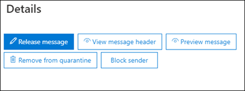

# <a name="quarantine-policies"></a><span data-ttu-id="d60db-103">Políticas de quarentena</span><span class="sxs-lookup"><span data-stu-id="d60db-103">Quarantine policies</span></span>

> [!NOTE]
> <span data-ttu-id="d60db-104">Os recursos descritos neste artigo estão atualmente em Visualização, não estão disponíveis para todos e estão sujeitos a alterações.</span><span class="sxs-lookup"><span data-stu-id="d60db-104">The features that are described in this article are currently in Preview, aren't available to everyone, and are subject to change.</span></span>

<span data-ttu-id="d60db-105">As políticas de quarentena (anteriormente conhecidas como marcas de quarentena) no Proteção do Exchange Online (EOP) permitem que os administradores controlem o que os usuários são capazes de fazer com suas mensagens em quarentena com base em como a mensagem chegou em quarentena.</span><span class="sxs-lookup"><span data-stu-id="d60db-105">Quarantine policies (formerly known as quarantine tags) in Exchange Online Protection (EOP) allow admins to control what users are able to do to their quarantined messages based on how the message arrived in quarantine.</span></span>

<span data-ttu-id="d60db-106">O EOP tradicionalmente permitiu ou impediu determinados [](find-and-release-quarantined-messages-as-a-user.md) níveis de interatividade para mensagens em quarentena e em notificações de [spam do usuário final.](use-spam-notifications-to-release-and-report-quarantined-messages.md)</span><span class="sxs-lookup"><span data-stu-id="d60db-106">EOP has traditionally allowed or prevented certain levels of interactivity for messages in [quarantine](find-and-release-quarantined-messages-as-a-user.md) and in [end-user spam notifications](use-spam-notifications-to-release-and-report-quarantined-messages.md).</span></span> <span data-ttu-id="d60db-107">Por exemplo, os usuários podem exibir e liberar mensagens que foram colocadas em quarentena pela filtragem anti-spam como spam ou em massa, mas não podem exibir ou liberar mensagens que foram colocadas em quarentena como phishing de alta confiança (somente os administradores podem fazer isso).</span><span class="sxs-lookup"><span data-stu-id="d60db-107">For example, users can view and release messages that were quarantined by anti-spam filtering as spam or bulk, but they can't view or release messages that were quarantined as high confidence phishing (only admins can do that).</span></span>

<span data-ttu-id="d60db-108">Para [recursos de proteção](#step-2-assign-a-quarantine-policy-to-supported-features)com suporte, as políticas de quarentena especificam o que os usuários têm permissão para fazer em mensagens de notificação de spam do usuário final e em suas mensagens em quarentena (mensagens em que o usuário é um destinatário).</span><span class="sxs-lookup"><span data-stu-id="d60db-108">For [supported protection features](#step-2-assign-a-quarantine-policy-to-supported-features), quarantine policies specify what users are allowed to do in end-user spam notification messages and in their quarantined messages in quarantine (messages where the user is a recipient).</span></span> <span data-ttu-id="d60db-109">As políticas de quarentena padrão são atribuídas automaticamente para impor os recursos históricos para os usuários em mensagens em quarentena.</span><span class="sxs-lookup"><span data-stu-id="d60db-109">Default quarantine policies are automatically assigned to enforce the historical capabilities for users on quarantined messages.</span></span> <span data-ttu-id="d60db-110">Ou você pode criar e atribuir políticas de quarentena personalizadas para permitir ou impedir que os usuários finais executam ações específicas em mensagens em quarentena.</span><span class="sxs-lookup"><span data-stu-id="d60db-110">Or, you can create and assign custom quarantine policies to allow or prevent end users from performing specific actions on quarantined messages.</span></span>

<span data-ttu-id="d60db-111">As permissões individuais são combinadas nos seguintes grupos de permissões predefinidos:</span><span class="sxs-lookup"><span data-stu-id="d60db-111">The individual permissions are combined into the following preset permission groups:</span></span>

- <span data-ttu-id="d60db-112">Sem acesso</span><span class="sxs-lookup"><span data-stu-id="d60db-112">No access</span></span>
- <span data-ttu-id="d60db-113">Acesso limitado</span><span class="sxs-lookup"><span data-stu-id="d60db-113">Limited access</span></span>
- <span data-ttu-id="d60db-114">Acesso total</span><span class="sxs-lookup"><span data-stu-id="d60db-114">Full access</span></span>

<span data-ttu-id="d60db-115">As permissões individuais disponíveis e o que está incluído ou não nos grupos de permissão predefinidos são descritos na tabela a seguir:</span><span class="sxs-lookup"><span data-stu-id="d60db-115">The available individual permissions and what's included or not included in the preset permission groups are described in the following table:</span></span>

<br>

****

|<span data-ttu-id="d60db-116">Permissão</span><span class="sxs-lookup"><span data-stu-id="d60db-116">Permission</span></span>|<span data-ttu-id="d60db-117">Sem acesso</span><span class="sxs-lookup"><span data-stu-id="d60db-117">No access</span></span>|<span data-ttu-id="d60db-118">Acesso limitado</span><span class="sxs-lookup"><span data-stu-id="d60db-118">Limited access</span></span>|<span data-ttu-id="d60db-119">Acesso total</span><span class="sxs-lookup"><span data-stu-id="d60db-119">Full access</span></span>|
|---|:---:|:---:|:---:|
|<span data-ttu-id="d60db-120">**Permitir remetente** (_PermissionToAllowSender_)</span><span class="sxs-lookup"><span data-stu-id="d60db-120">**Allow sender** (_PermissionToAllowSender_)</span></span>||||
|<span data-ttu-id="d60db-122">**Bloquear remetente** (_PermissionToBlockSender_)</span><span class="sxs-lookup"><span data-stu-id="d60db-122">**Block sender** (_PermissionToBlockSender_)</span></span>||||
|<span data-ttu-id="d60db-125">**Excluir** (_PermissionToDelete_)</span><span class="sxs-lookup"><span data-stu-id="d60db-125">**Delete** (_PermissionToDelete_)</span></span>||||
|<span data-ttu-id="d60db-128">**Visualização** (_PermissionToPreview_)</span><span class="sxs-lookup"><span data-stu-id="d60db-128">**Preview** (_PermissionToPreview_)</span></span>||||
|<span data-ttu-id="d60db-131">**Permitir que os destinatários liberem uma mensagem de quarentena** (_PermissionToRelease_)</span><span class="sxs-lookup"><span data-stu-id="d60db-131">**Allow recipients to release a message from quarantine** (_PermissionToRelease_)</span></span>||||
|<span data-ttu-id="d60db-133">**Permitir que os destinatários solicitem que uma mensagem seja liberada da quarentena** (_PermissionToRequestRelease_)</span><span class="sxs-lookup"><span data-stu-id="d60db-133">**Allow recipients to request a message to be released from quarantine** (_PermissionToRequestRelease_)</span></span>||||
|

<span data-ttu-id="d60db-135">Se você não gostar das permissões padrão nos grupos de permissões predefinidos, poderá usar permissões personalizadas ao criar ou modificar políticas de quarentena personalizadas.</span><span class="sxs-lookup"><span data-stu-id="d60db-135">If you don't like the default permissions in the preset permission groups, you can use custom permissions when you create or modify custom quarantine policies.</span></span> <span data-ttu-id="d60db-136">Para obter mais informações sobre o que cada permissão faz, consulte a seção Detalhes da permissão de [política](#quarantine-policy-permission-details) de quarentena posteriormente neste artigo.</span><span class="sxs-lookup"><span data-stu-id="d60db-136">For more information about what each permission does, see the [Quarantine policy permission details](#quarantine-policy-permission-details) section later in this article.</span></span>

<span data-ttu-id="d60db-137">Você cria e atribui políticas de quarentena no portal do Microsoft 365 Defender ou no PowerShell (Exchange Online PowerShell para organizações Microsoft 365 com caixas de correio do Exchange Online; PowerShell autônomo do EOP em organizações do EOP sem Exchange Online caixas de correio).</span><span class="sxs-lookup"><span data-stu-id="d60db-137">You create and assign quarantine policies in the Microsoft 365 Defender portal or in PowerShell (Exchange Online PowerShell for Microsoft 365 organizations with Exchange Online Mailboxes; standalone EOP PowerShell in EOP organizations without Exchange Online mailboxes).</span></span>

## <a name="what-do-you-need-to-know-before-you-begin"></a><span data-ttu-id="d60db-138">Do que você precisa saber para começar?</span><span class="sxs-lookup"><span data-stu-id="d60db-138">What do you need to know before you begin?</span></span>

- <span data-ttu-id="d60db-139">Abra o portal do Microsoft 365 Defender em <https://security.microsoft.com>.</span><span class="sxs-lookup"><span data-stu-id="d60db-139">You open the Microsoft 365 Defender portal at <https://security.microsoft.com>.</span></span> <span data-ttu-id="d60db-140">Ou para ir diretamente para a página **Políticas de** quarentena, abra <https://security.microsoft.com/quarantineTags> .</span><span class="sxs-lookup"><span data-stu-id="d60db-140">Or to go directly to the **Quarantine policies** page, open <https://security.microsoft.com/quarantineTags>.</span></span>

- <span data-ttu-id="d60db-141">Para se conectar ao PowerShell do Exchange Online, confira [Conectar ao PowerShell do Exchange Online](/powershell/exchange/connect-to-exchange-online-powershell).</span><span class="sxs-lookup"><span data-stu-id="d60db-141">To connect to Exchange Online PowerShell, see [Connect to Exchange Online PowerShell](/powershell/exchange/connect-to-exchange-online-powershell).</span></span> <span data-ttu-id="d60db-142">Para se conectar ao EOP PowerShell autônomo, consulte [Conectar-se ao PowerShell do Exchange Online Protection.](/powershell/exchange/connect-to-exchange-online-protection-powershell).</span><span class="sxs-lookup"><span data-stu-id="d60db-142">To connect to standalone EOP PowerShell, see [Connect to Exchange Online Protection PowerShell](/powershell/exchange/connect-to-exchange-online-protection-powershell).</span></span>

- <span data-ttu-id="d60db-143">Para exibir, criar, modificar ou remover políticas de quarentena,  você  precisa ser membro das funções Gerenciamento da Organização ou Administrador de Segurança no portal Microsoft 365 Defender.</span><span class="sxs-lookup"><span data-stu-id="d60db-143">To view, create, modify, or remove quarantine policies, you need to be a member of the **Organization Management** or **Security Administrator** roles in the Microsoft 365 Defender portal.</span></span> <span data-ttu-id="d60db-144">Para obter mais informações, veja [Permissões no portal do Microsoft 365 Defender](permissions-microsoft-365-security-center.md).</span><span class="sxs-lookup"><span data-stu-id="d60db-144">For more information, see [Permissions in the Microsoft 365 Defender portal](permissions-microsoft-365-security-center.md).</span></span>

## <a name="step-1-create-quarantine-policies-in-the-microsoft-365-defender-portal"></a><span data-ttu-id="d60db-145">Etapa 1: Criar políticas de quarentena no Microsoft 365 Defender portal</span><span class="sxs-lookup"><span data-stu-id="d60db-145">Step 1: Create quarantine policies in the Microsoft 365 Defender portal</span></span>

1. <span data-ttu-id="d60db-146">No portal Microsoft 365 Defender, vá para Email & de colaboração Políticas **de** ameaças seção Políticas de quarentena e, em seguida, selecione Políticas \>  \>  \>  **de quarentena**.</span><span class="sxs-lookup"><span data-stu-id="d60db-146">In the Microsoft 365 Defender portal, go to **Email & collaboration** \>**Threat policies** \> **Rules** section \> **Quarantine policies** and then select **Quarantine policies**.</span></span>

2. <span data-ttu-id="d60db-147">Na página **Política de quarentena,** clique em  **personalizada**.</span><span class="sxs-lookup"><span data-stu-id="d60db-147">On the **Quarantine policy** page, click  **Add custom policy**.</span></span>

3. <span data-ttu-id="d60db-148">O **assistente nova política** é aberto.</span><span class="sxs-lookup"><span data-stu-id="d60db-148">The **New policy** wizard opens.</span></span> <span data-ttu-id="d60db-149">Na página **Nome da** política, insira um nome breve, mas exclusivo, na caixa **Nome da** política.</span><span class="sxs-lookup"><span data-stu-id="d60db-149">On the **Policy name** page, enter a brief but unique name in the **Policy name** box.</span></span> <span data-ttu-id="d60db-150">Você precisará identificar e selecionar a política de quarentena pelo nome nas próximas etapas.</span><span class="sxs-lookup"><span data-stu-id="d60db-150">You'll need to identify and select the quarantine policy by name in upcoming steps.</span></span> <span data-ttu-id="d60db-151">Ao terminar, clique em **Avançar**.</span><span class="sxs-lookup"><span data-stu-id="d60db-151">When you're finished, click **Next**.</span></span>

4. <span data-ttu-id="d60db-152">Na página **Acesso à** mensagem de destinatário, selecione um dos seguintes valores:</span><span class="sxs-lookup"><span data-stu-id="d60db-152">On the **Recipient message access** page, select one of the following values:</span></span>
   - <span data-ttu-id="d60db-153">**Sem acesso**</span><span class="sxs-lookup"><span data-stu-id="d60db-153">**No access**</span></span>
   - <span data-ttu-id="d60db-154">**Acesso limitado**</span><span class="sxs-lookup"><span data-stu-id="d60db-154">**Limited access**</span></span>
   - <span data-ttu-id="d60db-155">**Acesso total**</span><span class="sxs-lookup"><span data-stu-id="d60db-155">**Full access**</span></span>

   <span data-ttu-id="d60db-156">As permissões individuais incluídas nesses grupos de permissão são descritas anteriormente neste artigo.</span><span class="sxs-lookup"><span data-stu-id="d60db-156">The individual permissions that are included in these permission groups are described earlier in this article.</span></span>

   <span data-ttu-id="d60db-157">Para especificar permissões personalizadas, selecione **Definir acesso específico (Avançado)** e as configurações a seguir que aparecem:</span><span class="sxs-lookup"><span data-stu-id="d60db-157">To specify custom permissions, select **Set specific access (Advanced)** and the configure the following settings that appear:</span></span>

     - <span data-ttu-id="d60db-158">**Selecione preferência de ação de versão**: Selecione um dos seguintes valores:</span><span class="sxs-lookup"><span data-stu-id="d60db-158">**Select release action preference**: Select one of the following values:</span></span>
       - <span data-ttu-id="d60db-159">**Nenhuma ação de versão**: esse é o valor padrão.</span><span class="sxs-lookup"><span data-stu-id="d60db-159">**No release action**: This is the default value.</span></span>
       - <span data-ttu-id="d60db-160">**Permitir que os destinatários liberem uma mensagem da quarentena**</span><span class="sxs-lookup"><span data-stu-id="d60db-160">**Allow recipients to release a message from quarantine**</span></span>
       - <span data-ttu-id="d60db-161">**Permitir que os destinatários solicitem que uma mensagem seja liberada da quarentena**</span><span class="sxs-lookup"><span data-stu-id="d60db-161">**Allow recipients to request a message to be released from quarantine**</span></span>
     - <span data-ttu-id="d60db-162">**Selecione ações adicionais que os destinatários podem tomar** em mensagens em quarentena : Selecione alguns, todos ou nenhum dos seguintes valores:</span><span class="sxs-lookup"><span data-stu-id="d60db-162">**Select additional actions recipients can take on quarantined messages**: Select some, all, or none of the following values:</span></span>
       - <span data-ttu-id="d60db-163">**Delete**</span><span class="sxs-lookup"><span data-stu-id="d60db-163">**Delete**</span></span>
       - <span data-ttu-id="d60db-164">**Visualização**</span><span class="sxs-lookup"><span data-stu-id="d60db-164">**Preview**</span></span>
       - <span data-ttu-id="d60db-165">**Bloquear remetente**</span><span class="sxs-lookup"><span data-stu-id="d60db-165">**Block sender**</span></span>

   <span data-ttu-id="d60db-166">Essas permissões e seus efeitos nas mensagens em quarentena e nas notificações de spam do usuário final são descritos na seção [Detalhes](#quarantine-policy-permission-details) da permissão de política de quarentena posteriormente neste artigo.</span><span class="sxs-lookup"><span data-stu-id="d60db-166">These permissions and their effect on quarantined messages and in end-user spam notifications are described in the [Quarantine policy permission details](#quarantine-policy-permission-details) section later in this article.</span></span>

   <span data-ttu-id="d60db-167">Ao terminar, clique em **Avançar**.</span><span class="sxs-lookup"><span data-stu-id="d60db-167">When you're finished, click **Next**.</span></span>

5. <span data-ttu-id="d60db-168">Na página **Revisar política** exibida, revise suas configurações.</span><span class="sxs-lookup"><span data-stu-id="d60db-168">On the **Review policy** page that appears, review your settings.</span></span> <span data-ttu-id="d60db-169">Você pode selecionar **Editar** em cada seção para modificar as configurações da seção.</span><span class="sxs-lookup"><span data-stu-id="d60db-169">You can select **Edit** in each section to modify the settings within the section.</span></span> <span data-ttu-id="d60db-170">Ou você pode clicar em **Voltar** ou selecionar a página específica no assistente.</span><span class="sxs-lookup"><span data-stu-id="d60db-170">Or you can click **Back** or select the specific page in the wizard.</span></span>

   <span data-ttu-id="d60db-171">Quando terminar, clique em **Enviar**.</span><span class="sxs-lookup"><span data-stu-id="d60db-171">When you're finished, click **Submit**.</span></span>

6. <span data-ttu-id="d60db-172">Na mensagem de confirmação exibida, clique em **Concluído**.</span><span class="sxs-lookup"><span data-stu-id="d60db-172">On the confirmation page that appears, click **Done**.</span></span>

<span data-ttu-id="d60db-173">Agora você está pronto para atribuir a política de quarentena a um recurso de quarentena, conforme descrito na [seção Etapa 2.](#step-2-assign-a-quarantine-policy-to-supported-features)</span><span class="sxs-lookup"><span data-stu-id="d60db-173">Now you're ready to assign the quarantine policy to a quarantine feature as described in the [Step 2](#step-2-assign-a-quarantine-policy-to-supported-features) section.</span></span>

### <a name="create-quarantine-policies-in-powershell"></a><span data-ttu-id="d60db-174">Criar políticas de quarentena no PowerShell</span><span class="sxs-lookup"><span data-stu-id="d60db-174">Create quarantine policies in PowerShell</span></span>

<span data-ttu-id="d60db-175">Se preferir usar o PowerShell para criar políticas de quarentena, conecte-se ao Exchange Online PowerShell ou ao Proteção do Exchange Online PowerShell e use o cmdlet **New-QuarantineTag.**</span><span class="sxs-lookup"><span data-stu-id="d60db-175">If you'd rather use PowerShell to create quarantine policies, connect to Exchange Online PowerShell or Exchange Online Protection PowerShell and use the **New-QuarantineTag** cmdlet.</span></span> <span data-ttu-id="d60db-176">Você tem dois métodos diferentes para escolher:</span><span class="sxs-lookup"><span data-stu-id="d60db-176">You have two different methods to choose from:</span></span>

- <span data-ttu-id="d60db-177">Use o _parâmetro EndUserQuarantinePermissionsValue._</span><span class="sxs-lookup"><span data-stu-id="d60db-177">Use the _EndUserQuarantinePermissionsValue_ parameter.</span></span>
- <span data-ttu-id="d60db-178">Use o _parâmetro EndUserQuarantinePermissions._</span><span class="sxs-lookup"><span data-stu-id="d60db-178">Use the _EndUserQuarantinePermissions_ parameter.</span></span>

<span data-ttu-id="d60db-179">Esses métodos são descritos nas seções a seguir.</span><span class="sxs-lookup"><span data-stu-id="d60db-179">These methods are described in the following sections.</span></span>

#### <a name="use-the-enduserquarantinepermissionsvalue-parameter"></a><span data-ttu-id="d60db-180">Usar o parâmetro EndUserQuarantinePermissionsValue</span><span class="sxs-lookup"><span data-stu-id="d60db-180">Use the EndUserQuarantinePermissionsValue parameter</span></span>

<span data-ttu-id="d60db-181">Para criar uma política de quarentena usando o _parâmetro EndUserQuarantinePermissionsValue,_ use a seguinte sintaxe:</span><span class="sxs-lookup"><span data-stu-id="d60db-181">To create a quarantine policy using the _EndUserQuarantinePermissionsValue_ parameter, use the following syntax:</span></span>

```powershell
New-QuarantineTag -Name "<UniqueName>" -EndUserQuarantinePermissionsValue <0 to 236>
```

<span data-ttu-id="d60db-182">O _parâmetro EndUserQuarantinePermissionsValue_ usa um valor decimal convertido de um valor binário.</span><span class="sxs-lookup"><span data-stu-id="d60db-182">The _EndUserQuarantinePermissionsValue_ parameter uses a decimal value that's converted from a binary value.</span></span> <span data-ttu-id="d60db-183">O valor binário corresponde às permissões de quarentena do usuário final disponíveis em uma ordem específica.</span><span class="sxs-lookup"><span data-stu-id="d60db-183">The binary value corresponds to the available end-user quarantine permissions in a specific order.</span></span> <span data-ttu-id="d60db-184">Para cada permissão, o valor 1 é igual a True e o valor 0 é igual a False.</span><span class="sxs-lookup"><span data-stu-id="d60db-184">For each permission, the value 1 equals True and the value 0 equals False.</span></span>

<span data-ttu-id="d60db-185">A ordem e os valores necessários para cada permissão individual em grupos de permissão predefinidos são descritos na tabela a seguir:</span><span class="sxs-lookup"><span data-stu-id="d60db-185">The required order and values for each individual permission in preset permission groups are described in the following table:</span></span>

<br>

****

|<span data-ttu-id="d60db-186">Permissão</span><span class="sxs-lookup"><span data-stu-id="d60db-186">Permission</span></span>|<span data-ttu-id="d60db-187">Sem acesso</span><span class="sxs-lookup"><span data-stu-id="d60db-187">No access</span></span>|<span data-ttu-id="d60db-188">Acesso limitado</span><span class="sxs-lookup"><span data-stu-id="d60db-188">Limited access</span></span>|<span data-ttu-id="d60db-189">Acesso total</span><span class="sxs-lookup"><span data-stu-id="d60db-189">Full access</span></span>|
|---|:---:|:---:|:---:|
|<span data-ttu-id="d60db-190">PermissionToAllowSender</span><span class="sxs-lookup"><span data-stu-id="d60db-190">PermissionToAllowSender</span></span>|<span data-ttu-id="d60db-191">0</span><span class="sxs-lookup"><span data-stu-id="d60db-191">0</span></span>|<span data-ttu-id="d60db-192">0</span><span class="sxs-lookup"><span data-stu-id="d60db-192">0</span></span>|<span data-ttu-id="d60db-193">1</span><span class="sxs-lookup"><span data-stu-id="d60db-193">1</span></span>|
|<span data-ttu-id="d60db-194">PermissionToBlockSender</span><span class="sxs-lookup"><span data-stu-id="d60db-194">PermissionToBlockSender</span></span>|<span data-ttu-id="d60db-195">0</span><span class="sxs-lookup"><span data-stu-id="d60db-195">0</span></span>|<span data-ttu-id="d60db-196">1</span><span class="sxs-lookup"><span data-stu-id="d60db-196">1</span></span>|<span data-ttu-id="d60db-197">1</span><span class="sxs-lookup"><span data-stu-id="d60db-197">1</span></span>|
|<span data-ttu-id="d60db-198">PermissionToDelete</span><span class="sxs-lookup"><span data-stu-id="d60db-198">PermissionToDelete</span></span>|<span data-ttu-id="d60db-199">0</span><span class="sxs-lookup"><span data-stu-id="d60db-199">0</span></span>|<span data-ttu-id="d60db-200">1</span><span class="sxs-lookup"><span data-stu-id="d60db-200">1</span></span>|<span data-ttu-id="d60db-201">1</span><span class="sxs-lookup"><span data-stu-id="d60db-201">1</span></span>|
|<span data-ttu-id="d60db-202">PermissionToDownload<sup>\*</sup></span><span class="sxs-lookup"><span data-stu-id="d60db-202">PermissionToDownload<sup>\*</sup></span></span>|<span data-ttu-id="d60db-203">0</span><span class="sxs-lookup"><span data-stu-id="d60db-203">0</span></span>|<span data-ttu-id="d60db-204">0</span><span class="sxs-lookup"><span data-stu-id="d60db-204">0</span></span>|<span data-ttu-id="d60db-205">0</span><span class="sxs-lookup"><span data-stu-id="d60db-205">0</span></span>|
|<span data-ttu-id="d60db-206">PermissionToPreview</span><span class="sxs-lookup"><span data-stu-id="d60db-206">PermissionToPreview</span></span>|<span data-ttu-id="d60db-207">0</span><span class="sxs-lookup"><span data-stu-id="d60db-207">0</span></span>|<span data-ttu-id="d60db-208">1</span><span class="sxs-lookup"><span data-stu-id="d60db-208">1</span></span>|<span data-ttu-id="d60db-209">1</span><span class="sxs-lookup"><span data-stu-id="d60db-209">1</span></span>|
|<span data-ttu-id="d60db-210">PermissionToRelease<sup>\*\*</sup></span><span class="sxs-lookup"><span data-stu-id="d60db-210">PermissionToRelease<sup>\*\*</sup></span></span>|<span data-ttu-id="d60db-211">0</span><span class="sxs-lookup"><span data-stu-id="d60db-211">0</span></span>|<span data-ttu-id="d60db-212">0</span><span class="sxs-lookup"><span data-stu-id="d60db-212">0</span></span>|<span data-ttu-id="d60db-213">1</span><span class="sxs-lookup"><span data-stu-id="d60db-213">1</span></span>|
|<span data-ttu-id="d60db-214">PermissionToRequestRelease<sup>\*\*</sup></span><span class="sxs-lookup"><span data-stu-id="d60db-214">PermissionToRequestRelease<sup>\*\*</sup></span></span>|<span data-ttu-id="d60db-215">0</span><span class="sxs-lookup"><span data-stu-id="d60db-215">0</span></span>|<span data-ttu-id="d60db-216">1</span><span class="sxs-lookup"><span data-stu-id="d60db-216">1</span></span>|<span data-ttu-id="d60db-217">0</span><span class="sxs-lookup"><span data-stu-id="d60db-217">0</span></span>|
|<span data-ttu-id="d60db-218">PermissionToViewHeader<sup>\*</sup></span><span class="sxs-lookup"><span data-stu-id="d60db-218">PermissionToViewHeader<sup>\*</sup></span></span>|<span data-ttu-id="d60db-219">0</span><span class="sxs-lookup"><span data-stu-id="d60db-219">0</span></span>|<span data-ttu-id="d60db-220">0</span><span class="sxs-lookup"><span data-stu-id="d60db-220">0</span></span>|<span data-ttu-id="d60db-221">0</span><span class="sxs-lookup"><span data-stu-id="d60db-221">0</span></span>|
|<span data-ttu-id="d60db-222">Valor binário</span><span class="sxs-lookup"><span data-stu-id="d60db-222">Binary value</span></span>|<span data-ttu-id="d60db-223">00000000</span><span class="sxs-lookup"><span data-stu-id="d60db-223">00000000</span></span>|<span data-ttu-id="d60db-224">01101010</span><span class="sxs-lookup"><span data-stu-id="d60db-224">01101010</span></span>|<span data-ttu-id="d60db-225">11101100</span><span class="sxs-lookup"><span data-stu-id="d60db-225">11101100</span></span>|
|<span data-ttu-id="d60db-226">Valor decimal a ser usado</span><span class="sxs-lookup"><span data-stu-id="d60db-226">Decimal value to use</span></span>|<span data-ttu-id="d60db-227">0</span><span class="sxs-lookup"><span data-stu-id="d60db-227">0</span></span>|<span data-ttu-id="d60db-228">106</span><span class="sxs-lookup"><span data-stu-id="d60db-228">106</span></span>|<span data-ttu-id="d60db-229">236</span><span class="sxs-lookup"><span data-stu-id="d60db-229">236</span></span>|
|

<span data-ttu-id="d60db-230"><sup>\*</sup> Atualmente, esse valor é sempre 0.</span><span class="sxs-lookup"><span data-stu-id="d60db-230"><sup>\*</sup> Currently, this value is always 0.</span></span> <span data-ttu-id="d60db-231">Para PermissionToViewHeader, o valor 0 não oculta o botão Exibir o **header** da mensagem nos detalhes da mensagem em quarentena (o botão está sempre disponível).</span><span class="sxs-lookup"><span data-stu-id="d60db-231">For PermissionToViewHeader, the value 0 doesn't hide the **View message header** button in the details of the quarantined message (the button is always available).</span></span>

<span data-ttu-id="d60db-232"><sup>\*\*</sup> Não de definir ambos os valores como 1.</span><span class="sxs-lookup"><span data-stu-id="d60db-232"><sup>\*\*</sup> Don't set both of these values to 1.</span></span> <span data-ttu-id="d60db-233">De definir um como 1 e o outro como 0 ou definir ambos como 0.</span><span class="sxs-lookup"><span data-stu-id="d60db-233">Set one to 1 and the other to 0, or set both to 0.</span></span>

<span data-ttu-id="d60db-234">Este exemplo cria um novo nome de política de quarentena NoAccess que atribui as permissões Sem acesso conforme descrito na tabela anterior.</span><span class="sxs-lookup"><span data-stu-id="d60db-234">This example creates a new quarantine policy name NoAccess that assigns the No access permissions as described in the previous table.</span></span>

```powershell
New-QuarantineTag -Name NoAccess -EndUserQuarantinePermissionsValue 0
```

<span data-ttu-id="d60db-235">Para permissões de acesso limitado, use o valor 106.</span><span class="sxs-lookup"><span data-stu-id="d60db-235">For Limited access permissions, use the value 106.</span></span> <span data-ttu-id="d60db-236">Para permissões de acesso total, use o valor 236.</span><span class="sxs-lookup"><span data-stu-id="d60db-236">For Full access permissions, use the value 236.</span></span>

<span data-ttu-id="d60db-237">Para permissões personalizadas, use a tabela anterior para obter o valor binário que corresponde às permissões que você deseja.</span><span class="sxs-lookup"><span data-stu-id="d60db-237">For custom permissions, use the previous table to get the binary value that corresponds to the permissions you want.</span></span> <span data-ttu-id="d60db-238">Converta o valor binário em um valor decimal e use o valor decimal para o _parâmetro EndUserQuarantinePermissionsValue._</span><span class="sxs-lookup"><span data-stu-id="d60db-238">Convert the binary value to a decimal value and use the decimal value for the _EndUserQuarantinePermissionsValue_ parameter.</span></span>

<span data-ttu-id="d60db-239">Para obter informações detalhadas sobre sintaxes e parâmetros, consulte [New-QuarantineTag](/powershell/module/exchange/new-quarantinetag).</span><span class="sxs-lookup"><span data-stu-id="d60db-239">For detailed syntax and parameter information, see [New-QuarantineTag](/powershell/module/exchange/new-quarantinetag).</span></span>

#### <a name="use-the-enduserquarantinepermissions-parameter"></a><span data-ttu-id="d60db-240">Usar o parâmetro EndUserQuarantinePermissions</span><span class="sxs-lookup"><span data-stu-id="d60db-240">Use the EndUserQuarantinePermissions parameter</span></span>

<span data-ttu-id="d60db-241">Para criar uma política de quarentena usando o _parâmetro EndUserQuarantinePermissionsValue,_ faça as seguintes etapas:</span><span class="sxs-lookup"><span data-stu-id="d60db-241">To create a quarantine policy using the _EndUserQuarantinePermissionsValue_ parameter, do the following steps:</span></span>

<span data-ttu-id="d60db-242">R.</span><span class="sxs-lookup"><span data-stu-id="d60db-242">A.</span></span> <span data-ttu-id="d60db-243">Armazene um objeto de permissões de quarentena em uma variável usando o cmdlet **New-QuarantinePermissions.**</span><span class="sxs-lookup"><span data-stu-id="d60db-243">Store a quarantine permissions object in a variable using the **New-QuarantinePermissions** cmdlet.</span></span>

<p>

<span data-ttu-id="d60db-244">B.</span><span class="sxs-lookup"><span data-stu-id="d60db-244">B.</span></span> <span data-ttu-id="d60db-245">Use a variável _como o valor EndUserQuarantinePermissions_ no **comando New-QuarantineTag.**</span><span class="sxs-lookup"><span data-stu-id="d60db-245">Use the variable as the _EndUserQuarantinePermissions_ value in the **New-QuarantineTag** command.</span></span>

##### <a name="step-a-store-a-quarantine-permissions-object-in-a-variable"></a><span data-ttu-id="d60db-246">Etapa A: Armazenar um objeto de permissões de quarentena em uma variável</span><span class="sxs-lookup"><span data-stu-id="d60db-246">Step A: Store a quarantine permissions object in a variable</span></span>

<span data-ttu-id="d60db-247">Use a seguinte sintaxe:</span><span class="sxs-lookup"><span data-stu-id="d60db-247">Use the following syntax:</span></span>

```powershell
$<VariableName> = New-QuarantinePermissions [-PermissionToAllowSender <$true | $False>] [-PermissionToBlockSender <$true | $False>] [-PermissionToDelete <$true | $False>] [-PermissionToPreview <$true | $False>] [-PermissionToRelease <$true | $False>] [-PermissionToRequestRelease <$true | $False>]
```

<span data-ttu-id="d60db-248">O valor padrão para todos os parâmetros não usado é , portanto, você só precisa usar os parâmetros onde deseja `$false` definir o valor como `$true` .</span><span class="sxs-lookup"><span data-stu-id="d60db-248">The default value for any unused parameters is `$false`, so you only need to use the parameters where you want to set value to `$true`.</span></span>

<span data-ttu-id="d60db-249">Os exemplos a seguir mostram como criar objetos de permissão que correspondem aos grupos de permissões predefinidos:</span><span class="sxs-lookup"><span data-stu-id="d60db-249">The following examples show how to create permission objects that correspond to the preset permissions groups:</span></span>

- <span data-ttu-id="d60db-250">**Sem acesso**:</span><span class="sxs-lookup"><span data-stu-id="d60db-250">**No access**:</span></span>

  ```powershell
  $NoAccess = New-QuarantinePermissions
  ```

- <span data-ttu-id="d60db-251">**Acesso limitado**:</span><span class="sxs-lookup"><span data-stu-id="d60db-251">**Limited access**:</span></span>

  ```powershell
  $LimitedAccess = New-QuarantinePermissions -PermissionToBlockSender $true -PermissionToDelete $true -PermissionToPreview $true -PermissionToRequestRelease $true
  ```

- <span data-ttu-id="d60db-252">**Acesso completo**:</span><span class="sxs-lookup"><span data-stu-id="d60db-252">**Full access**:</span></span>

  ```powershell
  $FullAccess = New-QuarantinePermissions -PermissionToAllowSender $true -PermissionToBlockSender $true -PermissionToDelete $true -PermissionToPreview $true -PermissionToRelease $true
  ```

<span data-ttu-id="d60db-253">Para ver os valores que você definiu, execute o nome da variável como um comando (por exemplo, execute o comando `$NoAccess` ).</span><span class="sxs-lookup"><span data-stu-id="d60db-253">To see the values that you've set, run the variable name as a command (for example, run the command `$NoAccess`).</span></span>

<span data-ttu-id="d60db-254">Para permissões personalizadas, não de definir os parâmetros _PermissionToRelease_ e _PermissionToRequestRelease_ como `$true` .</span><span class="sxs-lookup"><span data-stu-id="d60db-254">For custom permissions, don't set both the _PermissionToRelease_ and _PermissionToRequestRelease_ parameters to `$true`.</span></span> <span data-ttu-id="d60db-255">De definir um para `$true` e deixar o outro como , ou deixar ambos como `$false` `$false` .</span><span class="sxs-lookup"><span data-stu-id="d60db-255">Set one to `$true` and leave the other as `$false`, or leave both as `$false`.</span></span>

<span data-ttu-id="d60db-256">Você também pode modificar uma variável de objeto de permissões existente após criar, mas antes de usá-la usando o cmdlet **Set-QuarantinePermissions.**</span><span class="sxs-lookup"><span data-stu-id="d60db-256">You can also modify an existing permissions object variable after you create but before you use it by using the **Set-QuarantinePermissions** cmdlet.</span></span>

<span data-ttu-id="d60db-257">Para obter informações detalhadas sobre sintaxes e parâmetros, consulte [New-QuarantinePermissions](/powershell/module/exchange/new-quarantinepermissions) e [Set-QuarantinePermissions](/powershell/module/exchange/set-quarantinepermissions).</span><span class="sxs-lookup"><span data-stu-id="d60db-257">For detailed syntax and parameter information, see [New-QuarantinePermissions](/powershell/module/exchange/new-quarantinepermissions) and [Set-QuarantinePermissions](/powershell/module/exchange/set-quarantinepermissions).</span></span>

##### <a name="step-b-use-the-variable-in-the-new-quarantinetag-command"></a><span data-ttu-id="d60db-258">Etapa B: Use a variável no comando New-QuarantineTag comando</span><span class="sxs-lookup"><span data-stu-id="d60db-258">Step B: Use the variable in the New-QuarantineTag command</span></span>

<span data-ttu-id="d60db-259">Depois de criar e armazenar o objeto permissions em uma variável, use a variável para o valor do parâmetro _EndUserQuarantinePermission_ no seguinte comando **New-QuarantineTag:**</span><span class="sxs-lookup"><span data-stu-id="d60db-259">After you've created and stored the permissions object in a variable, use the variable for the _EndUserQuarantinePermission_ parameter value in the following **New-QuarantineTag** command:</span></span>

```powershell
New-QuarantineTag -Name "<UniqueName>" -EndUserQuarantinePermissions $<VariableName>
```

<span data-ttu-id="d60db-260">Este exemplo cria uma nova política de quarentena chamada LimitedAccess usando o objeto permissions que foi descrito e `$LimitedAccess` criado na etapa anterior.</span><span class="sxs-lookup"><span data-stu-id="d60db-260">This example creates a new quarantine policy named LimitedAccess using the `$LimitedAccess` permissions object that was described and created in the previous step.</span></span>

```powershell
New-QuarantineTag -Name LimitedAccess -EndUserQuarantinePermissions $LimitedAccess
```

<span data-ttu-id="d60db-261">Para obter informações detalhadas sobre sintaxes e parâmetros, consulte [New-QuarantineTag](/powershell/module/exchange/new-quarantinetag).</span><span class="sxs-lookup"><span data-stu-id="d60db-261">For detailed syntax and parameter information, see [New-QuarantineTag](/powershell/module/exchange/new-quarantinetag).</span></span>

## <a name="step-2-assign-a-quarantine-policy-to-supported-features"></a><span data-ttu-id="d60db-262">Etapa 2: Atribuir uma política de quarentena aos recursos com suporte</span><span class="sxs-lookup"><span data-stu-id="d60db-262">Step 2: Assign a quarantine policy to supported features</span></span>

<span data-ttu-id="d60db-263">Nos _recursos de proteção_ com suporte que coloca em quarentena mensagens ou arquivos (automaticamente ou como uma ação configurável), você pode atribuir uma política de quarentena às ações de quarentena disponíveis.</span><span class="sxs-lookup"><span data-stu-id="d60db-263">In _supported_ protection features that quarantine messages or files (automatically or as a configurable action), you can assign a quarantine policy to the available quarantine actions.</span></span> <span data-ttu-id="d60db-264">Recursos que as mensagens de quarentena e a disponibilidade de políticas de quarentena são descritos na tabela a seguir:</span><span class="sxs-lookup"><span data-stu-id="d60db-264">Features that quarantine messages and the availability of quarantine policies are described in the following table:</span></span>

<br>

****

|<span data-ttu-id="d60db-265">Recurso</span><span class="sxs-lookup"><span data-stu-id="d60db-265">Feature</span></span>|<span data-ttu-id="d60db-266">Políticas de quarentena suportadas?</span><span class="sxs-lookup"><span data-stu-id="d60db-266">Quarantine policies supported?</span></span>|<span data-ttu-id="d60db-267">Políticas de quarentena padrão usadas</span><span class="sxs-lookup"><span data-stu-id="d60db-267">Default quarantine policies used</span></span>|
|---|:---:|---|
|<span data-ttu-id="d60db-268">[Políticas anti-spam](configure-your-spam-filter-policies.md):</span><span class="sxs-lookup"><span data-stu-id="d60db-268">[Anti-spam policies](configure-your-spam-filter-policies.md):</span></span> <ul><li><span data-ttu-id="d60db-269">**Spam** (_SpamAction_)</span><span class="sxs-lookup"><span data-stu-id="d60db-269">**Spam** (_SpamAction_)</span></span></li><li><span data-ttu-id="d60db-270">**Spam de alta confiança** (_HighConfidenceSpamAction_)</span><span class="sxs-lookup"><span data-stu-id="d60db-270">**High confidence spam** (_HighConfidenceSpamAction_)</span></span></li><li><span data-ttu-id="d60db-271">**Phishing** (_PhishSpamAction_)</span><span class="sxs-lookup"><span data-stu-id="d60db-271">**Phishing** (_PhishSpamAction_)</span></span></li><li><span data-ttu-id="d60db-272">**Phishing de alta confiança** (_HighConfidencePhishAction_)</span><span class="sxs-lookup"><span data-stu-id="d60db-272">**High confidence phishing** (_HighConfidencePhishAction_)</span></span></li><li><span data-ttu-id="d60db-273">**Bulk** (_BulkSpamAction_)</span><span class="sxs-lookup"><span data-stu-id="d60db-273">**Bulk** (_BulkSpamAction_)</span></span></li></ul>|<span data-ttu-id="d60db-274">Sim</span><span class="sxs-lookup"><span data-stu-id="d60db-274">Yes</span></span>|<ul><li><span data-ttu-id="d60db-275">DefaultSpamTag (Acesso completo)</span><span class="sxs-lookup"><span data-stu-id="d60db-275">DefaultSpamTag (Full access)</span></span></li><li><span data-ttu-id="d60db-276">DefaultHighConfSpamTag (acesso completo)</span><span class="sxs-lookup"><span data-stu-id="d60db-276">DefaultHighConfSpamTag (Full access)</span></span></li><li><span data-ttu-id="d60db-277">DefaultPhishTag (acesso completo)</span><span class="sxs-lookup"><span data-stu-id="d60db-277">DefaultPhishTag (Full access)</span></span></li><li><span data-ttu-id="d60db-278">DefaultHighConfPhishTag (Sem acesso)</span><span class="sxs-lookup"><span data-stu-id="d60db-278">DefaultHighConfPhishTag (No access)</span></span></li><li><span data-ttu-id="d60db-279">DefaultBulkTag (acesso completo)</span><span class="sxs-lookup"><span data-stu-id="d60db-279">DefaultBulkTag (Full access)</span></span></li></ul>
|<span data-ttu-id="d60db-280">Políticas anti-phishing:</span><span class="sxs-lookup"><span data-stu-id="d60db-280">Anti-phishing policies:</span></span> <ul><li><span data-ttu-id="d60db-281">[Proteção de inteligência de spoof](set-up-anti-phishing-policies.md#spoof-settings) (_AuthenticationFailAction_)</span><span class="sxs-lookup"><span data-stu-id="d60db-281">[Spoof intelligence protection](set-up-anti-phishing-policies.md#spoof-settings) (_AuthenticationFailAction_)</span></span></li><li><span data-ttu-id="d60db-282">[Proteção contra representação](set-up-anti-phishing-policies.md#impersonation-settings-in-anti-phishing-policies-in-microsoft-defender-for-office-365):<sup>\*</sup></span><span class="sxs-lookup"><span data-stu-id="d60db-282">[Impersonation protection](set-up-anti-phishing-policies.md#impersonation-settings-in-anti-phishing-policies-in-microsoft-defender-for-office-365):<sup>\*</sup></span></span> <ul><li><span data-ttu-id="d60db-283">**Se a mensagem for detectada como um usuário personificado** (_TargetedUserProtectionAction_)</span><span class="sxs-lookup"><span data-stu-id="d60db-283">**If message is detected as an impersonated user** (_TargetedUserProtectionAction_)</span></span></li><li><span data-ttu-id="d60db-284">**Se a mensagem for detectada como um domínio personificado** (_TargetedDomainProtectionAction_)</span><span class="sxs-lookup"><span data-stu-id="d60db-284">**If message is detected as an impersonated domain** (_TargetedDomainProtectionAction_)</span></span></li><li><span data-ttu-id="d60db-285">**Se a inteligência da caixa de correio detectar e representar o usuário** (_MailboxIntelligenceProtectionAction_)</span><span class="sxs-lookup"><span data-stu-id="d60db-285">**If mailbox intelligence detects and impersonated user** (_MailboxIntelligenceProtectionAction_)</span></span></li></ul></li></ul></ul>|<span data-ttu-id="d60db-286">Não</span><span class="sxs-lookup"><span data-stu-id="d60db-286">No</span></span>|<span data-ttu-id="d60db-287">n/d</span><span class="sxs-lookup"><span data-stu-id="d60db-287">n/a</span></span>|
|<span data-ttu-id="d60db-288">[Políticas anti-malware](configure-anti-malware-policies.md): Todas as mensagens detectadas estão sempre em quarentena.</span><span class="sxs-lookup"><span data-stu-id="d60db-288">[Anti-malware policies](configure-anti-malware-policies.md): All detected messages are always quarantined.</span></span>|<span data-ttu-id="d60db-289">Não</span><span class="sxs-lookup"><span data-stu-id="d60db-289">No</span></span>|<span data-ttu-id="d60db-290">n/d</span><span class="sxs-lookup"><span data-stu-id="d60db-290">n/a</span></span>|
|[<span data-ttu-id="d60db-291">Anexos seguros para SharePoint, OneDrive e Microsoft Teams</span><span class="sxs-lookup"><span data-stu-id="d60db-291">Safe Attachments for SharePoint, OneDrive, and Microsoft Teams</span></span>](mdo-for-spo-odb-and-teams.md)|<span data-ttu-id="d60db-292">Não</span><span class="sxs-lookup"><span data-stu-id="d60db-292">No</span></span>|<span data-ttu-id="d60db-293">n/d</span><span class="sxs-lookup"><span data-stu-id="d60db-293">n/a</span></span>|
|<span data-ttu-id="d60db-294">[Regras de fluxo de emails](/exchange/security-and-compliance/mail-flow-rules/mail-flow-rules) (também conhecidas como regras de transporte) com a ação: Entregar a mensagem à **quarentena** hospedada (_Quarentena_).</span><span class="sxs-lookup"><span data-stu-id="d60db-294">[Mail flow rules](/exchange/security-and-compliance/mail-flow-rules/mail-flow-rules) (also known as transport rules) with the action: **Deliver the message to the hosted quarantine** (_Quarantine_).</span></span>|<span data-ttu-id="d60db-295">Não</span><span class="sxs-lookup"><span data-stu-id="d60db-295">No</span></span>|<span data-ttu-id="d60db-296">n/d</span><span class="sxs-lookup"><span data-stu-id="d60db-296">n/a</span></span>|
|

<span data-ttu-id="d60db-297"><sup>\*</sup>As configurações de proteção de representação estão disponíveis somente em políticas anti-phishing no Microsoft Defender para Office 365.</span><span class="sxs-lookup"><span data-stu-id="d60db-297"><sup>\*</sup> Impersonation protection settings are available only in anti-phishing policies in Microsoft Defender for Office 365.</span></span>

<span data-ttu-id="d60db-298">Se você estiver satisfeito com as permissões do usuário final fornecidas pelas políticas de quarentena padrão, você não precisa fazer nada.</span><span class="sxs-lookup"><span data-stu-id="d60db-298">If you're happy with the end-user permissions that are provided by the default quarantine policies, you don't need to do anything.</span></span> <span data-ttu-id="d60db-299">Se você quiser personalizar os recursos do usuário final (botões disponíveis) em notificações de spam do usuário final ou em detalhes de mensagem em quarentena, você pode atribuir uma política de quarentena personalizada.</span><span class="sxs-lookup"><span data-stu-id="d60db-299">If you want to customize the end-user capabilities (available buttons) in end-user spam notifications or in quarantined message details, you can assign a custom quarantine policy.</span></span>

### <a name="assign-quarantine-policies-in-anti-spam-policies-in-the-microsoft-365-defender-portal"></a><span data-ttu-id="d60db-300">Atribuir políticas de quarentena em políticas anti-spam no portal Microsoft 365 Defender site</span><span class="sxs-lookup"><span data-stu-id="d60db-300">Assign quarantine policies in anti-spam policies in the Microsoft 365 Defender portal</span></span>

<span data-ttu-id="d60db-301">Instruções completas para criar e modificar políticas anti-spam são descritas em [Configure anti-spam policies in EOP](configure-your-spam-filter-policies.md).</span><span class="sxs-lookup"><span data-stu-id="d60db-301">Full instructions for creating and modifying anti-spam policies are described in [Configure anti-spam policies in EOP](configure-your-spam-filter-policies.md).</span></span>

1. <span data-ttu-id="d60db-302">No portal Microsoft 365 Defender, acesse **Email & políticas** de colaboração & de regras seção \>  \>  \> **Anti-spam**.</span><span class="sxs-lookup"><span data-stu-id="d60db-302">In the Microsoft 365 Defender portal, go to **Email & collaboration** \> **Policies & rules** \> **Policies** section \> **Anti-spam**.</span></span> <span data-ttu-id="d60db-303">Ou, abra <https://security.microsoft.com/antispam> .</span><span class="sxs-lookup"><span data-stu-id="d60db-303">Or, open <https://security.microsoft.com/antispam>.</span></span>

2. <span data-ttu-id="d60db-304">Na página **Políticas anti-spam,** faça uma das seguintes etapas:</span><span class="sxs-lookup"><span data-stu-id="d60db-304">On the **Anti-spam policies** page, do one of the following steps:</span></span>
   - <span data-ttu-id="d60db-305">Encontre e selecione uma **política** anti-spam de entrada existente.</span><span class="sxs-lookup"><span data-stu-id="d60db-305">Find and select an existing **inbound** anti-spam policy.</span></span>
   - <span data-ttu-id="d60db-306">Crie uma nova **política** anti-spam de entrada.</span><span class="sxs-lookup"><span data-stu-id="d60db-306">Create a new **inbound** anti-spam policy.</span></span>

3. <span data-ttu-id="d60db-307">Faça o seguinte:</span><span class="sxs-lookup"><span data-stu-id="d60db-307">Do one of the following steps:</span></span>
   - <span data-ttu-id="d60db-308">**Editar política anti-spam** existente : No submenu de detalhes da política, vá para a seção **Ações** e clique em **Editar ações**.</span><span class="sxs-lookup"><span data-stu-id="d60db-308">**Edit existing anti-spam policy**: In the policy details flyout, go to the **Actions** section and then click **Edit actions**.</span></span>
   - <span data-ttu-id="d60db-309">**Criar nova política anti-spam**: No novo assistente de política, vá para a **página Ações.**</span><span class="sxs-lookup"><span data-stu-id="d60db-309">**Create new anti-spam policy**: In the new policy wizard, go to the **Actions** page.</span></span>

4. <span data-ttu-id="d60db-310">Na página **Ações.**</span><span class="sxs-lookup"><span data-stu-id="d60db-310">On the **Actions** page.</span></span> <span data-ttu-id="d60db-311">cada veredito que tiver a **ação de mensagem de** quarentena também terá a caixa de política **Selecionar** quarentena para você selecionar uma política de quarentena correspondente.</span><span class="sxs-lookup"><span data-stu-id="d60db-311">every verdict that has the **Quarantine message** action will also have the **Select quarantine policy** box for you to select a corresponding quarantine policy.</span></span>

   <span data-ttu-id="d60db-312">**Observação**: ao criar uma nova  política, um valor de política de quarentena selecionar em branco indica que a política de quarentena padrão para esse veredito é usada.</span><span class="sxs-lookup"><span data-stu-id="d60db-312">**Note**: When you create a new policy, a blank **Select quarantine policy** value indicates the default quarantine policy for that verdict is used.</span></span> <span data-ttu-id="d60db-313">Quando você edita a política posteriormente, os valores em branco são substituídos pelos nomes de política de quarentena padrão reais, conforme descrito na tabela anterior.</span><span class="sxs-lookup"><span data-stu-id="d60db-313">When you later edit the policy, the blank values are replaced by the actual default quarantine policy names as described in the previous table.</span></span>

   

5. <span data-ttu-id="d60db-315">Quando concluir, clique em **Salvar**.</span><span class="sxs-lookup"><span data-stu-id="d60db-315">When you're finished, click **Save**.</span></span>

#### <a name="assign-quarantine-policies-in-anti-spam-policies-in-powershell"></a><span data-ttu-id="d60db-316">Atribuir políticas de quarentena em políticas anti-spam no PowerShell</span><span class="sxs-lookup"><span data-stu-id="d60db-316">Assign quarantine policies in anti-spam policies in PowerShell</span></span>

<span data-ttu-id="d60db-317">Se você preferir usar o PowerShell para atribuir políticas de quarentena em políticas anti-spam, conecte-se ao Exchange Online PowerShell ou ao Proteção do Exchange Online PowerShell e use a seguinte sintaxe:</span><span class="sxs-lookup"><span data-stu-id="d60db-317">If you'd rather use PowerShell to assign quarantine policies in anti-spam policies, connect to Exchange Online PowerShell or Exchange Online Protection PowerShell and use the following syntax:</span></span>

```powershell
<New-HostedContentFilterPolicy -Name "<Unique name>" | Set-HostedContentFilterPolicy -Identity "<Policy name>">  [-SpamAction Quarantine] [-SpamQuarantineTag <QuarantineTagName>] [-HighConfidenceSpamAction Quarantine] [-HighConfidenceSpamQuarantineTag <QuarantineTagName>] [-PhishSpamAction Quarantine] [-PhishQuarantineTag <QuarantineTagName>] [-HighConfidencePhishQuarantineTag <QuarantineTagName>] [-BulkSpamAction Quarantine] [-BulkQuarantineTag <QuarantineTagName>] ...
```

<span data-ttu-id="d60db-318">**Observações**:</span><span class="sxs-lookup"><span data-stu-id="d60db-318">**Notes**:</span></span>

- <span data-ttu-id="d60db-319">O valor padrão para o parâmetro _HighConfidencePhishAction_ é Quarantine, portanto, você não precisa definir a ação quarentena para detecções de phishing de alta confiança em novas políticas anti-spam.</span><span class="sxs-lookup"><span data-stu-id="d60db-319">The default value for the _HighConfidencePhishAction_ parameter is Quarantine, so you don't need to set the Quarantine action for high confidence phishing detections in new anti-spam policies.</span></span> <span data-ttu-id="d60db-320">Para todos os outros vereditos de filtragem de spam em políticas anti-spam novas ou existentes, a política de quarentena só será efetiva se o valor da ação for Quarantine.</span><span class="sxs-lookup"><span data-stu-id="d60db-320">For all other spam filtering verdicts in new or existing anti-spam policies, the quarantine policy is only effective if the action value is Quarantine.</span></span> <span data-ttu-id="d60db-321">Para ver os valores de ação em políticas anti-spam existentes, execute o seguinte comando:</span><span class="sxs-lookup"><span data-stu-id="d60db-321">To see the action values in existing anti-spam policies, run the following command:</span></span>

  ```powershell
  Get-HostedContentFilterPolicy | Format-Table Name,*SpamAction,HighConfidencePhishAction
  ```

  <span data-ttu-id="d60db-322">Para obter informações sobre os valores de ação padrão e os valores de ação recomendados para Standard e Strict, consulte [EOP anti-spam policy settings](recommended-settings-for-eop-and-office365.md#eop-anti-spam-policy-settings).</span><span class="sxs-lookup"><span data-stu-id="d60db-322">For information about the default action values and the recommended action values for Standard and Strict, see [EOP anti-spam policy settings](recommended-settings-for-eop-and-office365.md#eop-anti-spam-policy-settings).</span></span>

- <span data-ttu-id="d60db-323">Um veredito de filtragem de spam sem um parâmetro de política de quarentena correspondente significa que a política de [quarentena](#step-2-assign-a-quarantine-policy-to-supported-features) padrão para esse veredito é usada.</span><span class="sxs-lookup"><span data-stu-id="d60db-323">A spam filtering verdict without a corresponding quarantine policy parameter means the [default quarantine policy](#step-2-assign-a-quarantine-policy-to-supported-features) for that verdict is used.</span></span>

  <span data-ttu-id="d60db-324">Você só precisa substituir uma política de quarentena padrão por uma política de quarentena personalizada se quiser alterar os recursos padrão do usuário final em mensagens em quarentena.</span><span class="sxs-lookup"><span data-stu-id="d60db-324">You only need to replace a default quarantine policy with a custom quarantine policy if you want to change the default end-user capabilities on quarantined messages.</span></span>

- <span data-ttu-id="d60db-325">Uma nova política anti-spam no PowerShell exige uma política de filtro de spam (configurações) usando o cmdlet **New-HostedContentFilterPolicy** e uma nova regra de filtro de spam (filtros de destinatário) usando o cmdlet **New-HostedContentFilterRule.**</span><span class="sxs-lookup"><span data-stu-id="d60db-325">A new anti-spam policy in PowerShell requires a spam filter policy (settings) using the **New-HostedContentFilterPolicy** cmdlet and a new spam filter rule (recipient filters) using the **New-HostedContentFilterRule** cmdlet.</span></span> <span data-ttu-id="d60db-326">Para obter instruções, [consulte Use PowerShell to create anti-spam policies](configure-your-spam-filter-policies.md#use-powershell-to-create-anti-spam-policies).</span><span class="sxs-lookup"><span data-stu-id="d60db-326">For instructions, see [Use PowerShell to create anti-spam policies](configure-your-spam-filter-policies.md#use-powershell-to-create-anti-spam-policies).</span></span>

<span data-ttu-id="d60db-327">Este exemplo cria uma nova política de filtro de spam chamada Departamento de Pesquisa com as seguintes configurações:</span><span class="sxs-lookup"><span data-stu-id="d60db-327">This example creates a new spam filter policy named Research Department with the following settings:</span></span>

- <span data-ttu-id="d60db-328">A ação para todos os vereditos de filtragem de spam está definida como Quarentena.</span><span class="sxs-lookup"><span data-stu-id="d60db-328">The action for all spam filtering verdicts is set to Quarantine.</span></span>
- <span data-ttu-id="d60db-329">A política de quarentena personalizada chamada NoAccess que atribui Nenhuma permissão de acesso substitui quaisquer políticas de quarentena padrão que ainda não atribuam **Nenhuma** permissão de acesso por padrão. </span><span class="sxs-lookup"><span data-stu-id="d60db-329">The custom quarantine policy named NoAccess that assigns **No access** permissions replaces any default quarantine policies that don't already assign **No access** permissions by default.</span></span>

```powershell
New-HostedContentFilterPolicy -Name Research Department -SpamAction Quarantine -SpamQuarantineTag NoAccess -HighConfidenceSpamAction Quarantine -HighConfidenceSpamQuarantineTag NoAction -PhishSpamAction Quarantine -PhishQuarantineTag NoAction -BulkSpamAction Quarantine -BulkQuarantineTag NoAccess
```

<span data-ttu-id="d60db-330">Para obter mais informações detalhadas de sintaxe e parâmetro, confira [New-HostedContentFilterPolicy](/powershell/module/exchange/new-hostedcontentfilterpolicy).</span><span class="sxs-lookup"><span data-stu-id="d60db-330">For detailed syntax and parameter information, see [New-HostedContentFilterPolicy](/powershell/module/exchange/new-hostedcontentfilterpolicy).</span></span>

<span data-ttu-id="d60db-331">Este exemplo modifica a política de filtro de spam existente chamada Recursos Humanos.</span><span class="sxs-lookup"><span data-stu-id="d60db-331">This example modifies the existing spam filter policy named Human Resources.</span></span> <span data-ttu-id="d60db-332">A ação para o veredito de quarentena de spam é definida como Quarentena e a política de quarentena personalizada chamada NoAccess é atribuída.</span><span class="sxs-lookup"><span data-stu-id="d60db-332">The action for the spam quarantine verdict is set to Quarantine, and the custom quarantine policy named NoAccess is assigned.</span></span>

```powershell
Set-HostedContentFilterPolicy -Identity "Human Resources" -SpamAction Quarantine -SpamQuarantineTag NoAccess
```

<span data-ttu-id="d60db-333">Para obter mais informações detalhadas de sintaxe e parâmetro, confira [Set-HostedContentFilterPolicy](/powershell/module/exchange/set-hostedcontentfilterpolicy).</span><span class="sxs-lookup"><span data-stu-id="d60db-333">For detailed syntax and parameter information, see [Set-HostedContentFilterPolicy](/powershell/module/exchange/set-hostedcontentfilterpolicy).</span></span>

## <a name="configure-global-quarantine-notification-settings-in-the-microsoft-365-defender-portal"></a><span data-ttu-id="d60db-334">Configurar configurações globais de notificação de quarentena no portal Microsoft 365 Defender site</span><span class="sxs-lookup"><span data-stu-id="d60db-334">Configure global quarantine notification settings in the Microsoft 365 Defender portal</span></span>

<span data-ttu-id="d60db-335">As configurações globais para políticas de quarentena permitem personalizar as notificações de spam do usuário final enviadas aos destinatários das mensagens que foram colocadas em quarentena.</span><span class="sxs-lookup"><span data-stu-id="d60db-335">The global settings for quarantine policies allow you to customize the end-user spam notifications that are sent to recipients of messages that were quarantined.</span></span> <span data-ttu-id="d60db-336">Para obter mais informações sobre essas notificações, consulte [End-user spam notifications](use-spam-notifications-to-release-and-report-quarantined-messages.md).</span><span class="sxs-lookup"><span data-stu-id="d60db-336">For more information about these notifications, see [End-user spam notifications](use-spam-notifications-to-release-and-report-quarantined-messages.md).</span></span>

1. <span data-ttu-id="d60db-337">No portal Microsoft 365 Defender, vá para Email & de colaboração Políticas **de** ameaças seção Políticas de quarentena e, em seguida, selecione Políticas \>  \>  \>  **de quarentena**.</span><span class="sxs-lookup"><span data-stu-id="d60db-337">In the Microsoft 365 Defender portal, go to **Email & collaboration** \>**Threat policies** \> **Rules** section \> **Quarantine policies** and then select **Quarantine policies**.</span></span>

2. <span data-ttu-id="d60db-338">Na página **Política de quarentena,** selecione **Configurações globais**.</span><span class="sxs-lookup"><span data-stu-id="d60db-338">On the **Quarantine policy** page, select **Global settings**.</span></span>

3. <span data-ttu-id="d60db-339">No **sobrevoo de configurações** de notificação de quarentena que é aberto, configure algumas ou todas as seguintes configurações:</span><span class="sxs-lookup"><span data-stu-id="d60db-339">In the **Quarantine notification settings** flyout that opens, configure some or all of the following settings:</span></span>

   - <span data-ttu-id="d60db-340">**Nome para** exibição : Personalize o nome de exibição do remetente usado em notificações de spam do usuário final.</span><span class="sxs-lookup"><span data-stu-id="d60db-340">**Display name**: Customize the sender's display name that's used in end-user spam notifications.</span></span>

     <span data-ttu-id="d60db-341">Para cada idioma adicionado, selecione o idioma na segunda caixa de idioma (não clique no X) e insira o valor de texto que você deseja na caixa **Nome de** exibição.</span><span class="sxs-lookup"><span data-stu-id="d60db-341">For each language that you've added, select the language in the second language box (don't click on the X) and enter the text value you want in the **Display name** box.</span></span>

     <span data-ttu-id="d60db-342">A captura de tela a seguir mostra o nome de exibição personalizado em uma notificação de spam do usuário final:</span><span class="sxs-lookup"><span data-stu-id="d60db-342">The following screenshot shows the customized display name in an end-user spam notification:</span></span>

     

   - <span data-ttu-id="d60db-344">**Aviso de isenção** de responsabilidade : adicione um aviso de isenção de responsabilidade personalizado à parte inferior das notificações de spam do usuário final.</span><span class="sxs-lookup"><span data-stu-id="d60db-344">**Disclaimer**: Add a custom disclaimer to the bottom of end-user spam notifications.</span></span> <span data-ttu-id="d60db-345">O texto localizado, Um aviso de **isenção de responsabilidade da** sua organização: é sempre incluído primeiro, seguido pelo texto especificado.</span><span class="sxs-lookup"><span data-stu-id="d60db-345">The localized text, **A disclaimer from your organization:** is always included first, followed by the text you specify.</span></span>

     <span data-ttu-id="d60db-346">Para cada idioma adicionado, selecione o idioma na segunda caixa de idioma (não clique no X) e insira o valor de texto que você deseja na caixa **Aviso** de isenção de responsabilidade.</span><span class="sxs-lookup"><span data-stu-id="d60db-346">For each language that you've added, select the language in the second language box  (don't click the X) and enter the text value you want in the **Disclaimer** box.</span></span>

     <span data-ttu-id="d60db-347">A captura de tela a seguir mostra o aviso de isenção de responsabilidade personalizado em uma notificação de spam do usuário final:</span><span class="sxs-lookup"><span data-stu-id="d60db-347">The following screenshot shows the customized disclaimer in an end-user spam notification:</span></span>

     

   - <span data-ttu-id="d60db-349">**Escolha idioma**: As notificações de spam do usuário final já estão localizadas com base nas configurações de idioma do destinatário.</span><span class="sxs-lookup"><span data-stu-id="d60db-349">**Choose language**: End-user spam notifications are already localized based on the recipient's language settings.</span></span> <span data-ttu-id="d60db-350">Você pode especificar texto personalizado em idiomas diferentes para os valores **Nome de** exibição e Aviso de **Isenção** de Responsabilidade.</span><span class="sxs-lookup"><span data-stu-id="d60db-350">You can specify customized text in different languages for the **Display name** and **Disclaimer** values.</span></span>

     <span data-ttu-id="d60db-351">Selecione pelo menos um idioma na primeira caixa de idioma e clique em **Adicionar**.</span><span class="sxs-lookup"><span data-stu-id="d60db-351">Select at least one language from the first language box and then click **Add**.</span></span> <span data-ttu-id="d60db-352">Você pode selecionar vários idiomas clicando em **Adicionar** após cada um deles.</span><span class="sxs-lookup"><span data-stu-id="d60db-352">You can select multiple languages by clicking **Add** after each one.</span></span> <span data-ttu-id="d60db-353">Uma caixa de idioma de seção mostra todos os idiomas selecionados:</span><span class="sxs-lookup"><span data-stu-id="d60db-353">A section language box shows all of the languages that you've selected:</span></span>

     

   - <span data-ttu-id="d60db-355">**Use o logotipo da minha empresa**: selecione essa opção para substituir o logotipo padrão da Microsoft que é usado na parte superior das notificações de spam do usuário final.</span><span class="sxs-lookup"><span data-stu-id="d60db-355">**Use my company logo**: Select this option to replace the default Microsoft logo that's use at the top of end-user spam notifications.</span></span> <span data-ttu-id="d60db-356">Antes de fazer isso, você precisa seguir as instruções em Personalizar o tema [Microsoft 365 para](../../admin/setup/customize-your-organization-theme.md) sua organização carregar seu logotipo personalizado.</span><span class="sxs-lookup"><span data-stu-id="d60db-356">Before you do this, you need to follow the instructions in [Customize the Microsoft 365 theme for your organization](../../admin/setup/customize-your-organization-theme.md) to upload your custom logo.</span></span>

     <span data-ttu-id="d60db-357">A captura de tela a seguir mostra um logotipo personalizado em uma notificação de spam do usuário final:</span><span class="sxs-lookup"><span data-stu-id="d60db-357">The following screenshot shows a custom logo in an end-user spam notification:</span></span>

     

## <a name="view-quarantine-policies-in-the-microsoft-365-defender-portal"></a><span data-ttu-id="d60db-359">Exibir políticas de quarentena no portal Microsoft 365 Defender site</span><span class="sxs-lookup"><span data-stu-id="d60db-359">View quarantine policies in the Microsoft 365 Defender portal</span></span>

1. <span data-ttu-id="d60db-360">No portal Microsoft 365 Defender, vá para Email & de colaboração Políticas **de** ameaças seção Políticas de quarentena e, em seguida, selecione Políticas \>  \>  \>  **de quarentena**.</span><span class="sxs-lookup"><span data-stu-id="d60db-360">In the Microsoft 365 Defender portal, go to **Email & collaboration** \>**Threat policies** \> **Rules** section \> **Quarantine policies** and then select **Quarantine policies**.</span></span>

2. <span data-ttu-id="d60db-361">A **página de política de** quarentena mostra a lista de políticas por **Name** e Last **updated** date.</span><span class="sxs-lookup"><span data-stu-id="d60db-361">The **Quarantine policy** page shows the list of policies by **Name** and **Last updated** date.</span></span>

3. <span data-ttu-id="d60db-362">Para exibir as configurações de políticas de quarentena internas ou personalizadas, selecione a política de quarentena na lista clicando no nome.</span><span class="sxs-lookup"><span data-stu-id="d60db-362">To view the settings of built-in or custom quarantine policies, select the quarantine policy from the list by clicking on the name.</span></span>

4. <span data-ttu-id="d60db-363">Para exibir as configurações globais, clique em **Configurações globais**</span><span class="sxs-lookup"><span data-stu-id="d60db-363">To view the global settings, click **Global settings**</span></span>

### <a name="view-quarantine-policies-in-powershell"></a><span data-ttu-id="d60db-364">Exibir políticas de quarentena no PowerShell</span><span class="sxs-lookup"><span data-stu-id="d60db-364">View quarantine policies in PowerShell</span></span>

<span data-ttu-id="d60db-365">Se você preferir usar o PowerShell para exibir políticas de quarentena, faça qualquer uma das seguintes etapas:</span><span class="sxs-lookup"><span data-stu-id="d60db-365">If you'd rather use PowerShell to view quarantine policies, do any of the following steps:</span></span>

- <span data-ttu-id="d60db-366">Para exibir uma lista resumida de todas as políticas internas ou personalizadas, execute o seguinte comando:</span><span class="sxs-lookup"><span data-stu-id="d60db-366">To view a summary list of all built-in or custom policies, run the following command:</span></span>

  ```powershell
  Get-QuarantineTag | Format-Table Name
  ```

- <span data-ttu-id="d60db-367">Para exibir as configurações de políticas de quarentena internas ou personalizadas, substitua pelo nome da política de quarentena e \<QuarantinePolicyName\> execute o seguinte comando:</span><span class="sxs-lookup"><span data-stu-id="d60db-367">To view the settings of built-in or custom quarantine policies, replace \<QuarantinePolicyName\> with the name of the quarantine policy, and run the following command:</span></span>

  ```powershell
  Get-QuarantineTag -Identity "<QuarantinePolicyName>"
  ```

- <span data-ttu-id="d60db-368">Para exibir as configurações globais, execute o seguinte comando:</span><span class="sxs-lookup"><span data-stu-id="d60db-368">To view the global settings, run the following command:</span></span>

  ```powershell
  Get-QuarantineTag -QuarantineTagType GlobalQuarantineTag
  ```

<span data-ttu-id="d60db-369">Para obter mais informações detalhadas de sintaxe e parâmetro, confira [Get-HostedContentFilterPolicy](/powershell/module/exchange/get-hostedcontentfilterpolicy).</span><span class="sxs-lookup"><span data-stu-id="d60db-369">For detailed syntax and parameter information, see [Get-HostedContentFilterPolicy](/powershell/module/exchange/get-hostedcontentfilterpolicy).</span></span>

## <a name="modify-quarantine-policies-in-the-microsoft-365-defender-portal"></a><span data-ttu-id="d60db-370">Modificar políticas de quarentena no Microsoft 365 Defender portal</span><span class="sxs-lookup"><span data-stu-id="d60db-370">Modify quarantine policies in the Microsoft 365 Defender portal</span></span>

1. <span data-ttu-id="d60db-371">No portal Microsoft 365 Defender, vá para Email & de colaboração Políticas **de** ameaças seção Políticas de quarentena e, em seguida, selecione Políticas \>  \>  \>  **de quarentena**.</span><span class="sxs-lookup"><span data-stu-id="d60db-371">In the Microsoft 365 Defender portal, go to **Email & collaboration** \>**Threat policies** \> **Rules** section \> **Quarantine policies** and then select **Quarantine policies**.</span></span>

2. <span data-ttu-id="d60db-372">Na página **Políticas de quarentena,** selecione a política clicando no nome.</span><span class="sxs-lookup"><span data-stu-id="d60db-372">On the **Quarantine policies** page, select the policy by clicking on the name.</span></span>

3. <span data-ttu-id="d60db-373">Depois de selecionar a política, clique no ícone  **política** que aparece.</span><span class="sxs-lookup"><span data-stu-id="d60db-373">After you select the policy, click the  **Edit policy** icon that appears.</span></span>

4. <span data-ttu-id="d60db-374">O **assistente editar política** que é  aberto é praticamente idêntico ao assistente nova política, conforme descrito na seção Criar políticas de quarentena na seção [portal](#step-1-create-quarantine-policies-in-the-microsoft-365-defender-portal) Microsoft 365 Defender anteriormente neste artigo.</span><span class="sxs-lookup"><span data-stu-id="d60db-374">The **Edit policy** wizard that opens is virtually identical to the **New policy** wizard as described in the [Create quarantine policies in the Microsoft 365 Defender portal](#step-1-create-quarantine-policies-in-the-microsoft-365-defender-portal) section earlier in this article.</span></span>

   <span data-ttu-id="d60db-375">A principal diferença é: você não pode renomear uma política existente.</span><span class="sxs-lookup"><span data-stu-id="d60db-375">The main difference is: you can't rename an existing policy.</span></span>

5. <span data-ttu-id="d60db-376">Quando terminar de modificar a política, vá para a página **Resumo** e clique em **Enviar**.</span><span class="sxs-lookup"><span data-stu-id="d60db-376">When you're finished modifying the policy, go to the **Summary** page and click **Submit**.</span></span>

### <a name="modify-quarantine-policies-in-powershell"></a><span data-ttu-id="d60db-377">Modificar políticas de quarentena no PowerShell</span><span class="sxs-lookup"><span data-stu-id="d60db-377">Modify quarantine policies in PowerShell</span></span>

<span data-ttu-id="d60db-378">Se você preferir usar o PowerShell para modificar uma política de quarentena personalizada, substitua pelo nome da política de quarentena e \<QuarantinePolicyName\> use a seguinte sintaxe:</span><span class="sxs-lookup"><span data-stu-id="d60db-378">If you'd rather use PowerShell to modify a custom quarantine policy, replace \<QuarantinePolicyName\> with the name of the quarantine policy, and use the following syntax:</span></span>

```powershell
Set-QuarantineTag -Identity "<QuarantinePolicyName>" [Settings]
```

<span data-ttu-id="d60db-379">As configurações disponíveis são as mesmas descritas para a criação de políticas de quarentena anteriormente neste artigo.</span><span class="sxs-lookup"><span data-stu-id="d60db-379">The available settings are the same as described for creating quarantine policies earlier in this article.</span></span>

<span data-ttu-id="d60db-380">Para obter informações detalhadas sobre sintaxes e parâmetros, consulte [Set-QuarantineTag](/powershell/module/exchange/set-quarantinetag).</span><span class="sxs-lookup"><span data-stu-id="d60db-380">For detailed syntax and parameter information, see [Set-QuarantineTag](/powershell/module/exchange/set-quarantinetag).</span></span>

## <a name="remove-quarantine-policies-in-the-microsoft-365-defender-portal"></a><span data-ttu-id="d60db-381">Remover políticas de quarentena no portal Microsoft 365 Defender portal</span><span class="sxs-lookup"><span data-stu-id="d60db-381">Remove quarantine policies in the Microsoft 365 Defender portal</span></span>

<span data-ttu-id="d60db-382">**Observações**:</span><span class="sxs-lookup"><span data-stu-id="d60db-382">**Notes**:</span></span>

- <span data-ttu-id="d60db-383">Não é possível remover políticas internas de quarentena.</span><span class="sxs-lookup"><span data-stu-id="d60db-383">You can't remove built-in quarantine policies.</span></span>
- <span data-ttu-id="d60db-384">Antes de remover uma política de quarentena personalizada, verifique se ela não está sendo usada.</span><span class="sxs-lookup"><span data-stu-id="d60db-384">Before you remove a custom quarantine policy, verify that it's not being used.</span></span> <span data-ttu-id="d60db-385">Por exemplo, execute o seguinte comando no PowerShell:</span><span class="sxs-lookup"><span data-stu-id="d60db-385">For example, run the following command in PowerShell:</span></span>

  ```powershell
  Get-HostedContentFilterPolicy | Format-List Name,*QuarantineTag
  ```

  <span data-ttu-id="d60db-386">Se a política de quarentena estiver sendo usada, substitua a política [de quarentena atribuída](#step-2-assign-a-quarantine-policy-to-supported-features) antes de removê-la.</span><span class="sxs-lookup"><span data-stu-id="d60db-386">If the quarantine policy is being used, [replace the assigned quarantine policy](#step-2-assign-a-quarantine-policy-to-supported-features) before you remove it.</span></span>

1. <span data-ttu-id="d60db-387">No portal Microsoft 365 Defender, vá para Email & de colaboração Políticas **de** ameaças seção Políticas de quarentena e, em seguida, selecione Políticas \>  \>  \>  **de quarentena**.</span><span class="sxs-lookup"><span data-stu-id="d60db-387">In the Microsoft 365 Defender portal, go to **Email & collaboration** \>**Threat policies** \> **Rules** section \> **Quarantine policies** and then select **Quarantine policies**.</span></span>

2. <span data-ttu-id="d60db-388">Na página **Política de quarentena,** selecione a política de quarentena personalizada que você deseja remover clicando no nome.</span><span class="sxs-lookup"><span data-stu-id="d60db-388">On the **Quarantine policy** page, select the custom quarantine policy that you want to remove by clicking on the name.</span></span>

3. <span data-ttu-id="d60db-389">Depois de selecionar a política, clique no ícone Excluir política Excluir ícone  **de política** exibido.</span><span class="sxs-lookup"><span data-stu-id="d60db-389">After you select the policy, click the  **Delete policy** icon that appears.</span></span>

4. <span data-ttu-id="d60db-390">Clique **em Remover política** na caixa de diálogo de confirmação exibida.</span><span class="sxs-lookup"><span data-stu-id="d60db-390">Click **Remove policy** in the confirmation dialog that appears.</span></span>

### <a name="remove-quarantine-policies-in-powershell"></a><span data-ttu-id="d60db-391">Remover políticas de quarentena no PowerShell</span><span class="sxs-lookup"><span data-stu-id="d60db-391">Remove quarantine policies in PowerShell</span></span>

<span data-ttu-id="d60db-392">Se você preferir usar o PowerShell para remover uma política de quarentena personalizada, substitua pelo nome da política de quarentena e \<QuarantinePolicyName\> execute o seguinte comando:</span><span class="sxs-lookup"><span data-stu-id="d60db-392">If you'd rather use PowerShell to remove a custom quarantine policy, replace \<QuarantinePolicyName\> with the name of the quarantine policy, and run the following command:</span></span>

```powershell
Remove-QuarantineTag -Identity "<QuarantinePolicyName>"
```

<span data-ttu-id="d60db-393">Para obter informações detalhadas sobre sintaxes e parâmetros, [consulte Remove-QuarantineTag](/powershell/module/exchange/remove-quarantinetag).</span><span class="sxs-lookup"><span data-stu-id="d60db-393">For detailed syntax and parameter information, see [Remove-QuarantineTag](/powershell/module/exchange/remove-quarantinetag).</span></span>

## <a name="quarantine-policy-permission-details"></a><span data-ttu-id="d60db-394">Detalhes da permissão da política de quarentena</span><span class="sxs-lookup"><span data-stu-id="d60db-394">Quarantine policy permission details</span></span>

<span data-ttu-id="d60db-395">As seções a seguir descrevem os efeitos de grupos de permissões predefinidos e permissões individuais nos detalhes das mensagens em quarentena e nas notificações de spam do usuário final.</span><span class="sxs-lookup"><span data-stu-id="d60db-395">The following sections describe the effects of preset permission groups and individual permissions in the details of quarantined messages and in end-user spam notifications.</span></span>

### <a name="preset-permissions-groups"></a><span data-ttu-id="d60db-396">Grupos de permissões predefinidas</span><span class="sxs-lookup"><span data-stu-id="d60db-396">Preset permissions groups</span></span>

<span data-ttu-id="d60db-397">As permissões individuais incluídas em grupos de permissão predefinidos estão listadas na tabela no início deste artigo.</span><span class="sxs-lookup"><span data-stu-id="d60db-397">The individual permissions that are included in preset permission groups are listed in the table at the beginning of this article.</span></span>

#### <a name="no-access"></a><span data-ttu-id="d60db-398">Sem acesso</span><span class="sxs-lookup"><span data-stu-id="d60db-398">No access</span></span>

<span data-ttu-id="d60db-399">Se a política de quarentena atribuir as permissões **Sem** acesso (sem permissões), os usuários ainda obterão alguns recursos de linha de base:</span><span class="sxs-lookup"><span data-stu-id="d60db-399">If the quarantine policy assigns the **No access** permissions (no permissions), users still get some baseline capabilities:</span></span>

- <span data-ttu-id="d60db-400">**Detalhes da mensagem em quarentena**: o botão Exibir o **header** da mensagem está sempre disponível.</span><span class="sxs-lookup"><span data-stu-id="d60db-400">**Quarantined message details**: The **View message header** button is always available.</span></span>

  

- <span data-ttu-id="d60db-402">**Notificações de spam do usuário final**: O botão **Revisão** que leva o usuário para a mensagem em quarentena está sempre disponível.</span><span class="sxs-lookup"><span data-stu-id="d60db-402">**End-user spam notifications**: The **Review** button that takes the user to the message in quarantine is always available.</span></span>

  

#### <a name="limited-access"></a><span data-ttu-id="d60db-404">Acesso limitado</span><span class="sxs-lookup"><span data-stu-id="d60db-404">Limited access</span></span>

<span data-ttu-id="d60db-405">Se a política de quarentena atribuir **as** permissões de acesso limitado, os usuários obterão os seguintes recursos:</span><span class="sxs-lookup"><span data-stu-id="d60db-405">If the quarantine policy assigns the **Limited access** permissions, users get the following capabilities:</span></span>

- <span data-ttu-id="d60db-406">**Detalhes da mensagem em quarentena:** Os seguintes botões estão disponíveis:</span><span class="sxs-lookup"><span data-stu-id="d60db-406">**Quarantined message details**: The following buttons are available:</span></span>
  - <span data-ttu-id="d60db-407">**Versão de solicitação**</span><span class="sxs-lookup"><span data-stu-id="d60db-407">**Request release**</span></span>
  - <span data-ttu-id="d60db-408">**Exibir cabeçalho de mensagem**</span><span class="sxs-lookup"><span data-stu-id="d60db-408">**View message header**</span></span>
  - <span data-ttu-id="d60db-409">**Mensagem de visualização**</span><span class="sxs-lookup"><span data-stu-id="d60db-409">**Preview message**</span></span>
  - <span data-ttu-id="d60db-410">**Bloquear remetente**</span><span class="sxs-lookup"><span data-stu-id="d60db-410">**Block sender**</span></span>
  - <span data-ttu-id="d60db-411">**Remover da quarentena**</span><span class="sxs-lookup"><span data-stu-id="d60db-411">**Remove from quarantine**</span></span>

  

- <span data-ttu-id="d60db-413">**Notificações de spam do usuário final:** Os seguintes botões estão disponíveis:</span><span class="sxs-lookup"><span data-stu-id="d60db-413">**End-user spam notifications**: The following buttons are available:</span></span>
  - <span data-ttu-id="d60db-414">**Bloquear remetente**</span><span class="sxs-lookup"><span data-stu-id="d60db-414">**Block sender**</span></span>
  - <span data-ttu-id="d60db-415">**Análise**</span><span class="sxs-lookup"><span data-stu-id="d60db-415">**Review**</span></span>

  

#### <a name="full-access"></a><span data-ttu-id="d60db-417">Acesso total</span><span class="sxs-lookup"><span data-stu-id="d60db-417">Full access</span></span>

<span data-ttu-id="d60db-418">Se a política de quarentena atribuir as **permissões** de acesso total (todas as permissões disponíveis), os usuários obterão os seguintes recursos:</span><span class="sxs-lookup"><span data-stu-id="d60db-418">If the quarantine policy assigns the **Full access** permissions (all available permissions), users get the following capabilities:</span></span>

- <span data-ttu-id="d60db-419">**Detalhes da mensagem em quarentena:** Os seguintes botões estão disponíveis:</span><span class="sxs-lookup"><span data-stu-id="d60db-419">**Quarantined message details**: The following buttons are available:</span></span>
  - <span data-ttu-id="d60db-420">**Mensagem de versão**</span><span class="sxs-lookup"><span data-stu-id="d60db-420">**Release message**</span></span>
  - <span data-ttu-id="d60db-421">**Exibir cabeçalho de mensagem**</span><span class="sxs-lookup"><span data-stu-id="d60db-421">**View message header**</span></span>
  - <span data-ttu-id="d60db-422">**Mensagem de visualização**</span><span class="sxs-lookup"><span data-stu-id="d60db-422">**Preview message**</span></span>
  - <span data-ttu-id="d60db-423">**Bloquear remetente**</span><span class="sxs-lookup"><span data-stu-id="d60db-423">**Block sender**</span></span>
  - <span data-ttu-id="d60db-424">**Permitir remetente**</span><span class="sxs-lookup"><span data-stu-id="d60db-424">**Allow sender**</span></span>
  - <span data-ttu-id="d60db-425">**Remover da quarentena**</span><span class="sxs-lookup"><span data-stu-id="d60db-425">**Remove from quarantine**</span></span>

  

- <span data-ttu-id="d60db-427">**Notificações de spam do usuário final:** Os seguintes botões estão disponíveis:</span><span class="sxs-lookup"><span data-stu-id="d60db-427">**End-user spam notifications**: The following buttons are available:</span></span>
  - <span data-ttu-id="d60db-428">**Bloquear remetente**</span><span class="sxs-lookup"><span data-stu-id="d60db-428">**Block sender**</span></span>
  - <span data-ttu-id="d60db-429">**Liberar**</span><span class="sxs-lookup"><span data-stu-id="d60db-429">**Release**</span></span>
  - <span data-ttu-id="d60db-430">**Análise**</span><span class="sxs-lookup"><span data-stu-id="d60db-430">**Review**</span></span>

  

### <a name="individual-permissions"></a><span data-ttu-id="d60db-432">Permissões individuais</span><span class="sxs-lookup"><span data-stu-id="d60db-432">Individual permissions</span></span>

> [!NOTE]
> <span data-ttu-id="d60db-433">Lembre-se de que os usuários sempre têm os botões descritos na [seção Sem](#no-access) acesso.</span><span class="sxs-lookup"><span data-stu-id="d60db-433">Remember, users always get the buttons described in the [No access](#no-access) section.</span></span> <span data-ttu-id="d60db-434">Esses botões não estão incluídos nas descrições de permissão individuais.</span><span class="sxs-lookup"><span data-stu-id="d60db-434">These buttons are not included in the individual permission descriptions.</span></span>

#### <a name="allow-sender-permission"></a><span data-ttu-id="d60db-435">Permitir permissão de remetente</span><span class="sxs-lookup"><span data-stu-id="d60db-435">Allow sender permission</span></span>

<span data-ttu-id="d60db-436">A **permissão Permitir remetente** (_PermissionToAllowSender_) controla o acesso ao botão que permite que os usuários adicionem convenientemente o remetente de mensagem em quarentena à sua lista Cofre Remetentes.</span><span class="sxs-lookup"><span data-stu-id="d60db-436">The **Allow sender** permission (_PermissionToAllowSender_) controls access to the button that allows users to conveniently add the quarantined message sender to their Safe Senders list.</span></span>

- <span data-ttu-id="d60db-437">**Detalhes da mensagem em quarentena:**</span><span class="sxs-lookup"><span data-stu-id="d60db-437">**Quarantined message details**:</span></span>
  - <span data-ttu-id="d60db-438">**Permitir permissão de remetente** habilitada: o **botão Permitir remetente** está disponível.</span><span class="sxs-lookup"><span data-stu-id="d60db-438">**Allow sender** permission enabled: The **Allow sender** button is available.</span></span>
  - <span data-ttu-id="d60db-439">**Permitir permissão de remetente** desabilitada: o **botão Permitir remetente** não está disponível.</span><span class="sxs-lookup"><span data-stu-id="d60db-439">**Allow sender** permission disabled: The **Allow sender** button is not available.</span></span>

- <span data-ttu-id="d60db-440">**Notificações de spam do usuário final**: Sem efeito.</span><span class="sxs-lookup"><span data-stu-id="d60db-440">**End-user spam notifications**: No effect.</span></span>

<span data-ttu-id="d60db-441">Para obter mais informações sobre Cofre de envios, consulte Prevent [trusted senders](https://support.microsoft.com/office/274ae301-5db2-4aad-be21-25413cede077#__toc304379666) from being blocked and [Use Exchange Online PowerShell to configure](configure-junk-email-settings-on-exo-mailboxes.md#use-exchange-online-powershell-to-configure-the-safelist-collection-on-a-mailbox)the safelist collection on a mailbox .</span><span class="sxs-lookup"><span data-stu-id="d60db-441">For more information about the Safe Senders list, see [Prevent trusted senders from being blocked](https://support.microsoft.com/office/274ae301-5db2-4aad-be21-25413cede077#__toc304379666) and [Use Exchange Online PowerShell to configure the safelist collection on a mailbox](configure-junk-email-settings-on-exo-mailboxes.md#use-exchange-online-powershell-to-configure-the-safelist-collection-on-a-mailbox).</span></span>

#### <a name="block-sender-permission"></a><span data-ttu-id="d60db-442">Bloquear permissão de remetente</span><span class="sxs-lookup"><span data-stu-id="d60db-442">Block sender permission</span></span>

<span data-ttu-id="d60db-443">A **permissão bloquear remetente** (_PermissionToBlockSender_) controla o acesso ao botão que permite que os usuários adicionem convenientemente o remetente de mensagem em quarentena à lista de Remetentes Bloqueados.</span><span class="sxs-lookup"><span data-stu-id="d60db-443">The **Block sender** permission (_PermissionToBlockSender_) controls access to the button that allows users to conveniently add the quarantined message sender to their Blocked Senders list.</span></span>

- <span data-ttu-id="d60db-444">**Detalhes da mensagem em quarentena:**</span><span class="sxs-lookup"><span data-stu-id="d60db-444">**Quarantined message details**:</span></span>
  - <span data-ttu-id="d60db-445">**Bloquear a permissão de** remetente habilitada: o **botão Bloquear remetente** está disponível.</span><span class="sxs-lookup"><span data-stu-id="d60db-445">**Block sender** permission enabled: The **Block sender** button is available.</span></span>
  - <span data-ttu-id="d60db-446">**Bloquear a permissão de** remetente desabilitada: o **botão Bloquear remetente** não está disponível.</span><span class="sxs-lookup"><span data-stu-id="d60db-446">**Block sender** permission disabled: The **Block sender** button is not available.</span></span>

- <span data-ttu-id="d60db-447">**Notificações de spam do usuário final:**</span><span class="sxs-lookup"><span data-stu-id="d60db-447">**End-user spam notifications**:</span></span>
  - <span data-ttu-id="d60db-448">**Bloquear a permissão de** remetente desabilitada: o **botão Bloquear remetente** não está disponível.</span><span class="sxs-lookup"><span data-stu-id="d60db-448">**Block sender** permission disabled: The **Block sender** button is not available.</span></span>
  - <span data-ttu-id="d60db-449">**Bloquear a permissão de** remetente habilitada: o **botão Bloquear remetente** está disponível.</span><span class="sxs-lookup"><span data-stu-id="d60db-449">**Block sender** permission enabled: The **Block sender** button is available.</span></span>

<span data-ttu-id="d60db-450">Para obter mais informações sobre a lista De envios bloqueados, consulte [Bloquear](https://support.microsoft.com/office/274ae301-5db2-4aad-be21-25413cede077#__toc304379667) mensagens de alguém e Usar Exchange Online PowerShell para configurar o conjunto de listas [seguras em uma caixa de correio](configure-junk-email-settings-on-exo-mailboxes.md#use-exchange-online-powershell-to-configure-the-safelist-collection-on-a-mailbox).</span><span class="sxs-lookup"><span data-stu-id="d60db-450">For more information about the Blocked Senders list, see [Block messages from someone](https://support.microsoft.com/office/274ae301-5db2-4aad-be21-25413cede077#__toc304379667) and [Use Exchange Online PowerShell to configure the safelist collection on a mailbox](configure-junk-email-settings-on-exo-mailboxes.md#use-exchange-online-powershell-to-configure-the-safelist-collection-on-a-mailbox).</span></span>

#### <a name="delete-permission"></a><span data-ttu-id="d60db-451">Permissão de exclusão</span><span class="sxs-lookup"><span data-stu-id="d60db-451">Delete permission</span></span>

<span data-ttu-id="d60db-452">A **permissão Delete** (_PermissionToDelete_) controla a capacidade dos usuários de excluir suas mensagens (mensagens em que o usuário é um destinatário) da quarentena.</span><span class="sxs-lookup"><span data-stu-id="d60db-452">The **Delete** permission (_PermissionToDelete_) controls the ability to of users to delete their messages (messages where the user is a recipient) from quarantine.</span></span>

- <span data-ttu-id="d60db-453">**Detalhes da mensagem em quarentena:**</span><span class="sxs-lookup"><span data-stu-id="d60db-453">**Quarantined message details**:</span></span>
  - <span data-ttu-id="d60db-454">**Excluir** permissão habilitada: o **botão Remover da** quarentena está disponível.</span><span class="sxs-lookup"><span data-stu-id="d60db-454">**Delete** permission enabled: The **Remove from quarantine** button is available.</span></span>
  - <span data-ttu-id="d60db-455">**Excluir** permissão desabilitada: o **botão Remover da** quarentena não está disponível.</span><span class="sxs-lookup"><span data-stu-id="d60db-455">**Delete** permission disabled: The **Remove from quarantine** button is not available.</span></span>

- <span data-ttu-id="d60db-456">**Notificações de spam do usuário final**: Sem efeito.</span><span class="sxs-lookup"><span data-stu-id="d60db-456">**End-user spam notifications**: No effect.</span></span>

#### <a name="preview-permission"></a><span data-ttu-id="d60db-457">Permissão de visualização</span><span class="sxs-lookup"><span data-stu-id="d60db-457">Preview permission</span></span>

<span data-ttu-id="d60db-458">A **permissão Preview** (_PermissionToPreview_) controla a capacidade dos usuários de visualizar suas mensagens em quarentena.</span><span class="sxs-lookup"><span data-stu-id="d60db-458">The **Preview** permission (_PermissionToPreview_) controls the ability to of users to preview their messages in quarantine.</span></span>

- <span data-ttu-id="d60db-459">**Detalhes da mensagem em quarentena:**</span><span class="sxs-lookup"><span data-stu-id="d60db-459">**Quarantined message details**:</span></span>
  - <span data-ttu-id="d60db-460">**Permissão** de visualização habilitada: o **botão Mensagem de** visualização está disponível.</span><span class="sxs-lookup"><span data-stu-id="d60db-460">**Preview** permission enabled: The **Preview message** button is available.</span></span>
  - <span data-ttu-id="d60db-461">**Permissão** de visualização desabilitada: o **botão Visualizar** mensagem não está disponível.</span><span class="sxs-lookup"><span data-stu-id="d60db-461">**Preview** permission disabled: The **Preview message** button is not available.</span></span>

- <span data-ttu-id="d60db-462">**Notificações de spam do usuário final**: Sem efeito.</span><span class="sxs-lookup"><span data-stu-id="d60db-462">**End-user spam notifications**: No effect.</span></span>

#### <a name="allow-recipients-to-release-a-message-from-quarantine-permission"></a><span data-ttu-id="d60db-463">Permitir que os destinatários liberem uma mensagem da permissão de quarentena</span><span class="sxs-lookup"><span data-stu-id="d60db-463">Allow recipients to release a message from quarantine permission</span></span>

<span data-ttu-id="d60db-464">A **permissão Permitir que os destinatários** liberem uma mensagem da permissão de quarentena (_PermissionToRelease_) controla a capacidade dos usuários de liberar suas mensagens em quarentena diretamente e sem a aprovação de um administrador.</span><span class="sxs-lookup"><span data-stu-id="d60db-464">The **Allow recipients to release a message from quarantine** permission (_PermissionToRelease_) controls the ability of users to release their quarantined messages directly and without the approval of an admin.</span></span>

- <span data-ttu-id="d60db-465">**Detalhes da mensagem em quarentena:**</span><span class="sxs-lookup"><span data-stu-id="d60db-465">**Quarantined message details**:</span></span>
  - <span data-ttu-id="d60db-466">Permissão habilitada: o **botão Liberar** mensagem está disponível.</span><span class="sxs-lookup"><span data-stu-id="d60db-466">Permission enabled: The **Release message** button is available.</span></span>
  - <span data-ttu-id="d60db-467">Permissão desabilitada: o **botão Liberar** mensagem não está disponível.</span><span class="sxs-lookup"><span data-stu-id="d60db-467">Permission disabled: The **Release message** button is not available.</span></span>

- <span data-ttu-id="d60db-468">**Notificações de spam do usuário final:**</span><span class="sxs-lookup"><span data-stu-id="d60db-468">**End-user spam notifications**:</span></span>
  - <span data-ttu-id="d60db-469">Permissão habilitada: o **botão Liberar** está disponível.</span><span class="sxs-lookup"><span data-stu-id="d60db-469">Permission enabled: The **Release** button is available.</span></span>
  - <span data-ttu-id="d60db-470">Permissão desabilitada: o **botão Liberar** não está disponível.</span><span class="sxs-lookup"><span data-stu-id="d60db-470">Permission disabled: The **Release** button is not available.</span></span>

#### <a name="allow-recipients-to-request-a-message-to-be-released-from-quarantine-permission"></a><span data-ttu-id="d60db-471">Permitir que os destinatários solicitem que uma mensagem seja liberada da permissão de quarentena</span><span class="sxs-lookup"><span data-stu-id="d60db-471">Allow recipients to request a message to be released from quarantine permission</span></span>

<span data-ttu-id="d60db-472">A **permissão Permitir que os destinatários** solicitem que uma mensagem seja liberada da permissão  de quarentena (_PermissionToRequestRelease_) controla a capacidade dos usuários de solicitar a liberação de suas mensagens em quarentena.</span><span class="sxs-lookup"><span data-stu-id="d60db-472">The **Allow recipients to request a message to be released from quarantine** permission (_PermissionToRequestRelease_) controls the ability of users to _request_ the release of their quarantined messages.</span></span> <span data-ttu-id="d60db-473">A mensagem só é liberada depois que um administrador aprova a solicitação.</span><span class="sxs-lookup"><span data-stu-id="d60db-473">The message is only released after an admin approves the request.</span></span>

- <span data-ttu-id="d60db-474">**Detalhes da mensagem em quarentena:**</span><span class="sxs-lookup"><span data-stu-id="d60db-474">**Quarantined message details**:</span></span>
  - <span data-ttu-id="d60db-475">Permissão habilitada: o **botão Liberar** solicitação está disponível.</span><span class="sxs-lookup"><span data-stu-id="d60db-475">Permission enabled: The **Request release** button is available.</span></span>
  - <span data-ttu-id="d60db-476">Permissão desabilitada: o **botão Liberar** solicitação não está disponível.</span><span class="sxs-lookup"><span data-stu-id="d60db-476">Permission disabled: The **Request release** button is not available.</span></span>

- <span data-ttu-id="d60db-477">**Notificações de spam do usuário final**: o botão **Liberar** não está disponível.</span><span class="sxs-lookup"><span data-stu-id="d60db-477">**End-user spam notifications**: The **Release** button is not available.</span></span>
