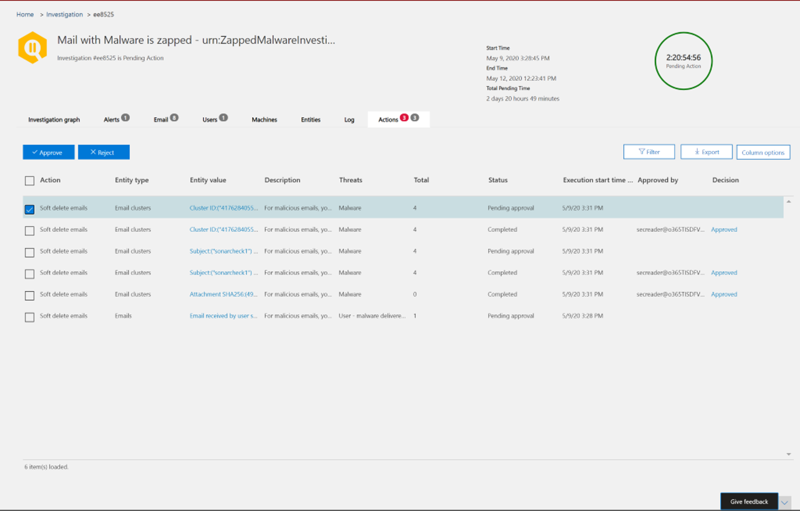

# Corrigir emails mal-intencionados entregues no Office 365

Correção significa realizar uma ação inscrita em relação a uma ameaça. Emails maliciosos enviados para sua organização podem ser limpos pelo sistema, por meio de exclusão automática de zero horas (ZAP) ou por equipes de segurança por meio de ações de correção, como *mover para a caixa de entrada*, *mover para o lixo eletrônico*, *mover para itens excluídos*, *exclusão reversível*ou *exclusão de hardware*. A proteção avançada contra ameaças do Office (Office ATP) P2/E5 permite que as equipes de segurança remediam ameaças em email e funcionalidade de colaboração através da investigação manual e automatizada.

> [!NOTE]
> Para corrigir emails mal-intencionados, as equipes de segurança precisam da função de *pesquisa e limpeza* atribuída a eles. A atribuição de função é feita através de permissões no centro de conformidade e segurança.

## O que você precisa saber antes de começar

Para fazer coisas como exibir cabeçalhos de mensagem ou baixar conteúdo de email, você deve ter uma nova função chamada *Preview* adicionada a outro grupo de função apropriado. A tabela a seguir mostra as funções e permissões necessárias.

****

|Atividade|Grupo de função|Função *prévia* necessária?|
|---|---|---|
|Usar o explorador de ameaças (e detecções em tempo real) para analisar ameaças |Administrador Global   Administrador de Segurança   Leitor de segurança|Não|
|Usar o explorador de ameaças (e detecção em tempo real) para exibir cabeçalhos para mensagens de email e para visualizar e baixar mensagens de email em quarentena|Administrador Global   Administrador de Segurança  Leitor de segurança|Não|
|Usar o explorador de ameaças para exibir cabeçalhos e baixar mensagens de email entregues a caixas de correio|Administrador Global  Administrador de Segurança   Leitor de segurança   Visualização|Sim|

> [!NOTE]
> Preview é uma *função*, não um *grupo de função*. A função Preview deve ser adicionada a um grupo de função existente para o Office 365. A *função de administrador global* é atribuída no [centro de administração do Microsoft 365](https://admin.microsoft.com). As funções de administrador de segurança e leitor de segurança são atribuídas nos [centros de segurança e conformidade](https://protection.office.com). Para saber mais sobre funções e permissões, consulte [permissões nos centros de segurança e conformidade](permissions-in-the-security-and-compliance-center.md).

> [!NOTE]
> Os administradores podem executar a ação necessária em emails, mas para obter essas ações aprovadas, eles devem ter a função de *pesquisa e limpeza* atribuída a eles por meio de permissões **de centro de conformidade e segurança**  >  **Permissions**.

## Correção manual e automatizada

A busca *manual* ocorre quando o Security Teams identifica ameaças manualmente usando os recursos de pesquisa e filtragem no Gerenciador de ameaças. A correção manual de email pode ser acionada por qualquer modo de exibição de email (*malware*, *phishing*ou *todos os emails*) após a identificação de um conjunto de emails que precisam ser corrigidos.

As equipes de segurança podem usar o explorador de ameaças para selecionar emails de várias maneiras:

- Escolha emails à mão: usar filtros em vários modos de exibição. Selecione até 100 emails a serem corrigidos.

- Seleção de consulta: selecione uma consulta inteira usando o botão **selecionar tudo** principal. A mesma consulta também é mostrada nos detalhes de envio de mensagens da central de ações.

- Seleção de consulta com exclusão: às vezes, as equipes de operações de segurança podem querer corrigir emails selecionando uma consulta inteira e excluindo certos emails da consulta manualmente. Para fazer isso, um administrador pode usar a caixa de seleção **selecionar tudo** e rolar para baixo para excluir emails manualmente. A consulta pode conter um máximo de 1.000 emails. O número máximo de exclusões é de 100.

Depois que os emails são selecionados por meio do Gerenciador de ameaças, você pode iniciar a correção executando a ação direta ou enfileirar emails para uma ação:

- Aprovação direta: quando as ações como *mover para a caixa de entrada*, *mover para o lixo eletrônico*, *mover para itens excluídos*, *exclusão reversível*ou *exclusão de hardware* são selecionadas pelo pessoal de segurança com permissões apropriadas e as próximas etapas da correção são seguidas, o processo de correção começa a executar a ação selecionada. Um submenu temporário mostra A correção em andamento.

- Aprovação em duas etapas: uma ação "adicionar à correção" pode ser tomada por administradores que não têm as permissões apropriadas ou que precisam esperar para executar a ação. Nesse caso, os emails direcionados são adicionados a um contêiner de correção. A aprovação é necessária antes que a correção seja executada.

Ações **automatizadas de investigação e resposta** são acionadas por alertas ou por equipes de operações de segurança do explorador de ameaças. Eles podem incluir ações de correção recomendadas que devem ser aprovadas por uma equipe de operações de segurança. Essas ações são incluídas na guia **ação** da investigação automatizada.

Todas as correções (aprovação direta ou aprovação em duas etapas) que foram criadas no Gerenciador de ameaças, bem como as ações aprovadas provenientes de investigações automatizadas, são exibidas na central de ações. Acessá-los por meio do painel de navegação esquerdo em **revisar**  >  **central de ações**.

A central de ações mostra todas as ações de correção dos últimos 30 dias. As ações realizadas pelo Gerenciador de ameaças são listadas pelo nome que a equipe de operações de segurança forneceu quando a correção foi criada. Ações tomadas através de investigações automatizadas têm títulos que começam com o alerta relacionado que disparou a investigação, como "cluster de emails zap... ."

Abra qualquer item de correção para exibir detalhes sobre ele, incluindo o nome, a data de criação, a descrição, a severidade da ameaça e o status. Ele também mostra as duas guias a seguir.

- Guia **envio de email** : exibe o número de emails enviados por meio do explorador de ameaças ou investigações automatizadas a serem corrigidos. Esses emails podem ser acionáveis ou não acionáveis.  

   - **Acionável**: os emails nos seguintes locais de caixa de correio na nuvem podem ser afetados e movidos:

     - Caixa de Entrada
     - Desejado
     - Pasta excluída
     - Pasta de exclusão reversível

     > [!NOTE]
     > Atualmente, apenas um usuário com acesso à caixa de correio pode recuperar itens de uma pasta de exclusão reversível.

   - **Não acionável**: os emails nos seguintes locais não podem ser afetados ou movidos em ações de correção:

     - Quarentena
     - Pasta de exclusão fixa
     - Local/externo
     - Com falha/Descartado

   As mensagens suspeitas são categorizadas como remediable ou nonremediable. Na maioria dos casos, as mensagens do remediable e do nonremediable combinam o total de mensagens enviadas. Mas, em casos raros, isso pode não ser verdadeiro. Isso pode acontecer devido a atrasos no sistema, tempo limite ou mensagens expiradas. As mensagens expiram com base no período de retenção do explorador de ameaças para sua organização.

   A menos que você esteja corrigindo mensagens antigas após o período de retenção do explorador de ameaças da organização, é aconselhável repetir a correção de itens se você vir inconsistências de número. Para os atrasos do sistema, as atualizações de correção são normalmente atualizadas dentro de algumas horas.

   Se o período de retenção da sua organização para email no Gerenciador de ameaças for 30 dias e você estiver corrigindo os emails de volta 29-30 dias, as contagens de envio de emails não poderão ser sempre adicionadas. Os emails talvez já tenham iniciado a mudança do período de retenção.

   Se as correções estiverem presas no estado "em andamento" por um tempo, provavelmente será devido a atrasos no sistema. Pode levar algumas horas para ser corrigida. Você pode ver variações nas contagens de envio de emails, pois alguns emails podem não ter sido incluídos na consulta no início da correção devido a atrasos no sistema. É uma boa ideia repetir a correção nesses casos.

  >[!Note]
  >Para obter melhores resultados, a correção deve ser feita em lotes de 50.000 ou menos.

   Somente os emails do remediable são afetados durante a correção. Os emails do Nonremediable não podem ser corrigidos pelo sistema de email do Office 365, pois eles não são armazenados nas caixas de correio na nuvem.

   Os administradores podem executar ações nos emails em quarentena, se necessário, mas esses emails expirarão em quarentena se não forem removidos manualmente. Os emails em quarentena porque o conteúdo mal-intencionado não é acessível por usuários, portanto, a equipe de segurança não precisa realizar qualquer ação para se livrar de ameaças em quarentena. Se os emails estiverem no local ou externos, o usuário poderá ser contatado para lidar com o email suspeito. Ou os administradores podem usar ferramentas de segurança e servidor de email separadas para remoção. Esses emails podem ser identificados aplicando o filtro externo de *entrega = local* no Gerenciador de ameaças. Para email com falha ou cancelado, ou email não acessível por usuários, não haverá nenhum email para reduzir, pois esses emails não chegam à caixa de correio.

   A imagem a seguir mostra a aparência de um envio na central de ações. Uma correção pode conter vários envios. Se várias ações forem aprovadas por meio de uma investigação automatizada, cada ação de email ou de cluster de emails aparecerá na mesma correção que um envio diferente.

   

   Selecione um item de envio de email para mostrar os detalhes dessa correção, como a consulta (quando a correção é acionada por meio de investigações automatizadas ou explorador de ameaças por meio da seleção de uma consulta) e dos horários de início e término da correção. Também exibe uma lista de mensagens que foram enviadas para correção. Como as mensagens são movidas para o período de retenção do explorador de ameaças, as mensagens desaparecem dessa lista. A lista também mostra mensagens individuais que são remediable.

- **Logs de ação**: essa guia mostra as mensagens corrigidas, incluindo a data aprovada, o administrador que aprovou a ação, a ação, o status e as contagens.

   O status pode ser:

     - **Iniciado**: a correção foi disparada.
     - Em **fila**: a correção é enfileirada para atenuação de emails.
     - **Em andamento**: a mitigação está em andamento.
     - **Concluído**: a mitigação de todos os emails do remediable foi concluída com êxito ou com algumas falhas.
     - **Falha**: nenhuma correção foi bem-sucedida.

   Como apenas os emails do remediable podem ser afetados, a limpeza de cada email é mostrada como bem-sucedida ou com falha. Do total de emails do remediable, as atenuações com êxito e com falha são relatadas.

   - **Êxito**: a ação desejada em emails do remediable foi realizada. Por exemplo: um administrador deseja remover emails de caixas de correio, portanto, o administrador executa a ação de excluir emails de forma reversível. Se um email do remediable não for encontrado na pasta original após a ação ser realizada, o status será exibido como bem-sucedido.

   - **Falha**: a ação desejada em emails do remediable falhou. Por exemplo: um administrador deseja remover emails de caixas de correio, portanto, o administrador executa a ação de excluir emails de forma reversível. Se um email do remediable ainda for encontrado na caixa de correio após a ação ser executada, o status será mostrado como falha.

   Selecione qualquer item no log de ações para exibir detalhes de correção. Se os detalhes dizem "êxito" ou "não encontrado na caixa de correio", esse item já foi removido da caixa de correio. Às vezes, há um erro do sistema durante a correção. Nesses casos, é uma boa ideia tentar novamente a correção.

 Correção é uma poderosa ferramenta para reduzir as ameaças e lidar com emails suspeitos. Ele ajuda a manter uma organização segura.

