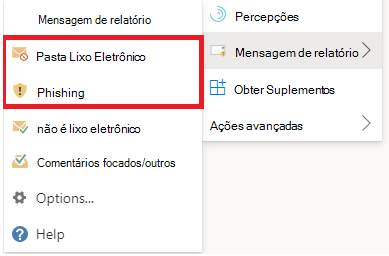
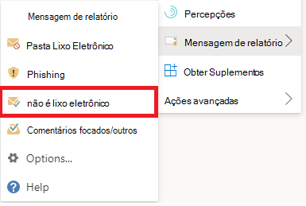

# Relatar falsos positivos e falsos negativos no OutlookReport false positives and false negatives in Outlook

[!INCLUDE [Microsoft 365 Defender rebranding](../includes/microsoft-defender-for-office.md)]

**Aplica-se a****Applies to**
- [Proteção do Exchange OnlineExchange Online Protection](exchange-online-protection-overview.md)
- [Plano 1 e plano 2 do Microsoft Defender para Office 365Microsoft Defender for Office 365 plan 1 and plan 2](defender-for-office-365.md)
- [Microsoft 365 DefenderMicrosoft 365 Defender](../defender/microsoft-365-defender.md)

> [!NOTE]
> Se você for um administrador em uma organização Microsoft 365 com caixas de correio Exchange Online, recomendamos que você use o portal Envios no Centro de Conformidade & Segurança.If you're an admin in a Microsoft 365 organization with Exchange Online mailboxes, we recommend that you use the Submissions portal in the Security & Compliance Center. Para obter mais informações, [consulte Use Admin Submission to submit suspected spam, phish, URLs, and files to Microsoft](admin-submission.md).For more information, see [Use Admin Submission to submit suspected spam, phish, URLs, and files to Microsoft](admin-submission.md).

Em organizações com caixas de correio em Exchange Online ou caixas de correio locais usando autenticação moderna híbrida, você pode enviar falsos positivos (bons emails bloqueados ou enviados para a pasta de lixo eletrônico) e falsos negativos (email indesejado ou phishing que foi entregue à caixa de entrada) para Proteção do Exchange Online (EOP). Microsoft 365In Microsoft 365 organizations with mailboxes in Exchange Online or on-premises mailboxes using hybrid modern authentication, you can submit false positives (good email that was blocked or sent to junk folder) and false negatives (unwanted email or phish that was delivered to the inbox) to Exchange Online Protection (EOP).

## Do que você precisa saber para começar?What do you need to know before you begin?

- Para a melhor experiência de envio do usuário, use o complemento Mensagem de Relatório ou o complemento Relatar Phishing.For the best user submission experience, use the Report Message add-in or the Report Phishing add-in.

  > [!IMPORTANT]
  > A experiência interna para relatar lixo eletrônico ou phishing Outlook não pode usar a [política de envio do usuário.](./user-submission.md)The built-in experience for reporting junk or phishing in Outlook can't use the [user submission policy](./user-submission.md). Em vez disso, recomendamos o uso do add-in Mensagem de Relatório ou do add-in Relatar Phishing.We recommend using the Report Message add-in or the Report Phishing add-in instead.

- O complemento Mensagem de Relatório e o add-in De Relatório phishing funcionam para Outlook em todas as plataformas (Outlook na Web, iOS, Android e Área de Trabalho).The the Report Message add-in and the Report Phishing add-in work for Outlook in all platforms (Outlook on the web, iOS, Android, and Desktop).

- Se você for um administrador em uma organização com Exchange Online caixas de correio, use o portal Envios no Centro de Conformidade & Segurança.If you're an admin in an organization with Exchange Online mailboxes, use the Submissions portal in the Security & Compliance Center. Para obter mais informações, [consulte Use Admin Submission to submit suspected spam, phish, URLs, and files to Microsoft](admin-submission.md).For more information, see [Use Admin Submission to submit suspected spam, phish, URLs, and files to Microsoft](admin-submission.md).

- Você pode configurar para enviar mensagens diretamente para a Microsoft, uma caixa de correio especificada ou ambas.You can configure to send messages directly to Microsoft, a mailbox you specify, or both. Para obter mais informações, consulte [Políticas de envios de usuário](user-submission.md).For more information, see [User submissions policies](user-submission.md).

- Para obter mais informações sobre como obter e habilitar a Mensagem de Relatório ou os complementos de Phishing de Relatório, consulte [Enable the Report Message or the Report Phishing add-ins](enable-the-report-message-add-in.md).For more information on how to get and enable the Report Message or the Report Phishing add-ins, see [Enable the Report Message or the Report Phishing add-ins](enable-the-report-message-add-in.md).

- Para obter mais informações sobre o relatório de mensagens para a Microsoft, consulte [Report messages and files to Microsoft](report-junk-email-messages-to-microsoft.md).For more information about reporting messages to Microsoft, see [Report messages and files to Microsoft](report-junk-email-messages-to-microsoft.md).

## Usar o recurso Mensagem de RelatórioUse the Report Message feature

### Relatar mensagens de lixo eletrônico e phishingReport junk and phishing messages

Para mensagens na Caixa de Entrada ou em qualquer outra pasta de email, exceto Lixo Eletrônico, use o seguinte método para relatar mensagens de spam e phishing:For messages in the Inbox or any other email folder except Junk Email, use the following method to report spam and phishing messages:

1. Selecione as **releições** Mais ações no canto superior direito da mensagem selecionada, selecione **Relatar** mensagem no menu suspenso e selecione **Lixo** Eletrônico ou **Phishing**.Select the **More actions** ellipses on the top-right corner of the selected message, select **Report message** from the dropdown menu, and then select **Junk** or **Phishing**.

   
   
   

2. As mensagens selecionadas serão enviadas à Microsoft para análise e:The selected messages will be sent to Microsoft for analysis and:
   - Movido para a pasta Lixo Eletrônico se eles foram relatados como spam.Moved to the Junk Email folder if they were reported as spam.
   - Excluído se eles foram relatados como phishing.Deleted if they were reported as phishing.

### Relatar mensagens que não são lixo eletrônicoReport messages that are not junk

1. Selecione as releições Mais ações no canto superior direito da mensagem selecionada, selecione **Relatar** mensagem no menu suspenso e selecione **Não Lixo Eletrônico**. Select the **More actions** ellipses on the top-right corner of the selected message, select **Report message** from the dropdown menu, and then select **Not Junk**.

   
   
   

2. A mensagem selecionada será enviada à Microsoft para análise e movida para a Caixa de Entrada ou qualquer outra pasta especificada.The selected message will be sent to Microsoft for analysis and moved to Inbox or any other specified folder.

## Exibir e revisar mensagens relatadasView and review reported messages

Para revisar as mensagens relatadas pelos usuários à Microsoft, você tem estas opções:To review messages that users report to Microsoft, you have these options:

- Use o portal Envios de Administrador.Use the Admin Submissions portal. Para obter mais informações, consulte [Exibir envios de usuários para a Microsoft](admin-submission.md#view-user-submissions-to-microsoft).For more information, see [View user submissions to Microsoft](admin-submission.md#view-user-submissions-to-microsoft).
- Crie uma regra de fluxo de emails (também conhecida como regra de transporte) para enviar cópias de mensagens relatadas.Create a mail flow rule (also known as a transport rule) to send copies of reported messages. Para obter instruções, [consulte Use mail flow rules to see what users are reporting to Microsoft](/exchange/security-and-compliance/mail-flow-rules/use-rules-to-see-what-users-are-reporting-to-microsoft).For instructions, see [Use mail flow rules to see what users are reporting to Microsoft](/exchange/security-and-compliance/mail-flow-rules/use-rules-to-see-what-users-are-reporting-to-microsoft).
