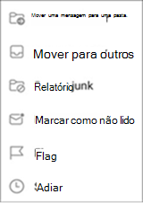
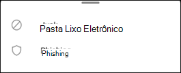
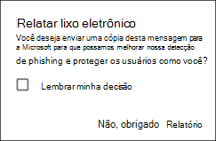
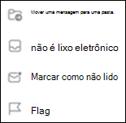

# Relatar lixo eletrônico e phishing no Outlook para iOS e Android no Exchange Online

[!INCLUDE [Microsoft 365 Defender rebranding](../includes/microsoft-defender-for-office.md)]

Nas organizações do Microsoft 365 com caixas de correio no Exchange Online ou caixas de correio locais usando a autenticação moderna híbrida, você pode usar as opções de relatório internas no Outlook para iOS e Android para enviar falsos positivos (emails bons marcados como spam), falsos negativos (emails falsos permitidos) e mensagens de phishing para o Exchange Online Protection (EOP).

## O que você precisa saber antes de começar

- Se você for um administrador em uma organização com caixas de correio do Exchange Online, recomendamos usar o portal de Envios no Centro de Conformidade e Segurança & Segurança. Para obter mais informações, consulte Usar o Envio de Administrador para [enviar spam, phishing, URLs e arquivos suspeitos para a Microsoft.](admin-submission.md)

- Você pode configurar mensagens relatadas para serem copiadas ou redirecionadas para uma caixa de correio que você especificar. Para obter mais informações, consulte [Políticas de Envios de Usuário.](user-submission.md)

- Para obter mais informações sobre como relatar mensagens à Microsoft, consulte [Mensagens e arquivos de relatório para a Microsoft.](report-junk-email-messages-to-microsoft.md)

  > [!NOTE]
  > Se o relatório de lixo eletrônico estiver desabilitado para o Outlook na política de envio de usuário, as mensagens de lixo eletrônico ou phishing serão movidas para a pasta Lixo eletrônico e não relatadas ao administrador ou à Microsoft.

## Relatar mensagens de spam e phishing no Outlook para iOS e Android

Para mensagens na Caixa de Entrada ou em qualquer outra pasta de email, exceto Lixo Eletrônico, use as etapas a seguir para relatar mensagens de spam e phishing para iOS e Android:

1. Selecione uma ou mais mensagens.
2. No canto superior direito, toque nos três pontos verticais. O menu de ação é aberto.

   

3. Toque **em Relatar lixo** eletrônico e selecione Lixo **Eletrônico** ou **Phishing.**

   

4. Na caixa de diálogo exibida, você pode escolher **Relatório** ou **Não, Obrigado.** Ao selecionar **Não** Obrigado ,  se você tiver mapeado Lixo Eletrônico, a mensagem será deslocada para a pasta Lixo Eletrônico, se você tiver mapeado **Phishing,** a mensagem será deslocada para a pasta Itens Excluídos. Selecione **Relatório** para também enviar uma cópia da mensagem para a Microsoft.

   

Se você mudar de ideia, selecione **Desfazer** na notificação do usuário exibida. A mensagem permanece na pasta Caixa de Entrada.

## Relatar mensagens não spam da pasta Lixo eletrônico no Outlook para iOS e Android

Na pasta Lixo eletrônico, use as etapas a seguir para relatar falsos positivos de spam:

1. Selecione uma ou mais mensagens.
2. No canto superior direito, toque nos três pontos verticais. O menu de ação é aberto.

   

3. Toque **em Não é lixo eletrônico.**

Uma notificação do notificação do jogo é exibida de que o email foi movido para sua Caixa de Entrada. Se você mudar de ideia, selecione **Desfazer** na notificação do notificação do notificação do jogo. O email permanece na pasta Lixo eletrônico.
