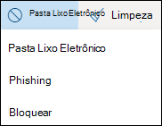
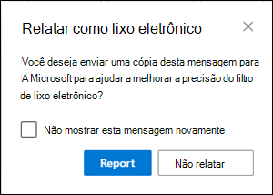
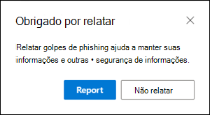
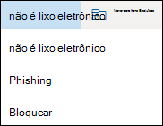
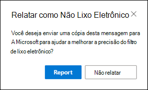

# <a name="report-junk-and-phishing-email-in-outlook-on-the-web-in-exchange-online"></a>Relatar emails de lixo eletrônico e phishing no Outlook na Web no Exchange Online

Nas organizações do Microsoft 365 com caixas de correio no Exchange Online, você pode usar as opções de relatório internas no Outlook na Web (anteriormente conhecido como Outlook Web App) para enviar falsos positivos (emails bons marcados como spam), falsos negativos (email incorreto) e mensagens de phishing para o Exchange Online Protection (EOP).

## <a name="what-do-you-need-to-know-before-you-begin"></a>O que você precisa saber antes de começar?

- Se você for um administrador em uma organização com caixas de correio do Exchange Online, recomendamos que você use o portal de envios no centro de conformidade do & de segurança. Para obter mais informações, consulte [usar o envio do administrador para enviar spam, phishing, URLs e arquivos suspeitos à Microsoft](admin-submission.md).

- Os administradores podem desabilitar ou habilitar a capacidade de os usuários reportarem mensagens para a Microsoft no Outlook na Web. Para obter detalhes, consulte a seção [desabilitar ou habilitar relatórios de lixo eletrônico no Outlook na Web](#disable-or-enable-junk-email-reporting-in-outlook-on-the-web) mais adiante neste tópico.

- Você pode configurar mensagens relatadas para serem copiadas ou redirecionadas para uma caixa de correio que você especificar. Para obter mais informações, consulte [especificar uma caixa de correio para envios de emails de spam e mensagens de phishing no Exchange Online](user-submission.md).

- Para obter mais informações sobre como relatar mensagens à Microsoft, consulte [relatar mensagens e arquivos para a Microsoft](report-junk-email-messages-to-microsoft.md).

## <a name="report-spam-and-phishing-messages-in-outlook-on-the-web"></a>Relatar mensagens de spam e phishing no Outlook na Web

1. Para mensagens na caixa de entrada ou em qualquer outra pasta de email, exceto lixo eletrônico, use um dos seguintes métodos para relatar mensagens de spam e phishing:

   - Selecione a mensagem, clique em **lixo eletrônico** na barra de ferramentas e selecione **lixo eletrônico** ou **phishing**.

     

   - Selecione uma ou mais mensagens, clique com o botão direito do mouse e selecione **Marcar como lixo eletrônico**.

2. Na caixa de diálogo exibida, clique em **relatório**. Se você mudar de ideia, clique em **não relatar**.

   

   

3. As mensagens selecionadas serão enviadas para a Microsoft para análise. Para confirmar se as mensagens foram enviadas, abra sua pasta **Itens Enviados** para exibir as mensagens enviadas.

## <a name="report-non-spam-and-phishing-messages-from-the-junk-email-folder-in-outlook-on-the-web"></a>Relatar mensagens que não são spam e phishing da pasta lixo eletrônico no Outlook na Web

1. Na pasta lixo eletrônico, use um dos seguintes métodos para relatar falsos positivos de spam ou mensagens de phishing:

   - Selecione a mensagem, clique em **não lixo eletrônico** na barra de ferramentas e selecione **não lixo eletrônico** ou **phishing**.

     

   - Selecione uma ou mais mensagens, clique com o botão direito do mouse e selecione **Marcar como não sendo lixo eletrônico**.

2. Na caixa de diálogo exibida, leia as informações e clique em **relatório**. Se você mudar de ideia, clique em **não relatar**.

   

   

3. As mensagens selecionadas serão enviadas para a Microsoft para análise. Para confirmar se as mensagens foram enviadas, abra sua pasta **Itens Enviados** para exibir as mensagens enviadas.

## <a name="disable-or-enable-junk-email-reporting-in-outlook-on-the-web"></a>Desabilitar ou habilitar os relatórios de lixo eletrônico no Outlook na Web

Por padrão, os usuários podem relatar falsos positivos de spam, falsos negativos e mensagens de phishing para a Microsoft para análise no Outlook na Web. Os administradores podem configurar o Outlook nas políticas de caixa de correio da Web no PowerShell do Exchange Online para impedir que os usuários reportem falsos positivos e falsos negativos de spam para a Microsoft. Não é possível desabilitar a capacidade de os usuários reportarem mensagens de phishing para a Microsoft.

### <a name="what-do-you-need-to-know-before-you-begin"></a>O que você precisa saber antes de começar?

- Para se conectar ao Exchange Online PowerShell, consulte [Conectar ao Exchange Online PowerShell](https://docs.microsoft.com/powershell/exchange/exchange-online/connect-to-exchange-online-powershell/connect-to-exchange-online-powershell).

- Você precisa receber permissões para executar esses procedimentos. Especificamente, você precisa das funções de **Recipient** ou de **destinatários de email** no Exchange Online, que são atribuídas aos grupos de funções de gerenciamento de **destinatários** e de **Gerenciamento da organização** por padrão. Para obter mais informações sobre grupos de função no Exchange Online, consulte [modificar grupos de função no Exchange Online](https://docs.microsoft.com/Exchange/permissions-exo/role-groups#modify-role-groups).

- Cada organização tem uma política padrão chamada OwaMailboxPolicy-padrão, mas você pode criar políticas personalizadas. Políticas personalizadas são aplicadas a usuários com escopo antes da política padrão. Para obter mais informações sobre o Outlook nas políticas de caixa de correio da Web, consulte [Outlook na Web políticas de caixa de correio no Exchange Online](https://docs.microsoft.com/Exchange/clients-and-mobile-in-exchange-online/outlook-on-the-web/outlook-web-app-mailbox-policies).

- Desabilitar o relatório de lixo eletrônico não remove a capacidade de marcar uma mensagem como lixo eletrônico ou não lixo eletrônico no Outlook na Web. Selecionar uma mensagem na pasta lixo eletrônico e clicar em **não é lixo** eletrônico \> ainda **não** move a mensagem de volta para a caixa de entrada. Selecionar uma mensagem em qualquer outra pasta de email e clicar em **lixo** \> **eletrônico** ainda move a mensagem para a pasta lixo eletrônico. O que não está mais disponível é a opção de relatar a mensagem à Microsoft.

### <a name="use-exchange-online-powershell-to-disable-or-enable-junk-email-reporting-in-outlook-on-the-web"></a>Usar o PowerShell do Exchange Online para desabilitar ou habilitar relatórios de lixo eletrônico no Outlook na Web

1. Para localizar suas políticas de caixa de correio do Outlook na Web e o status do relatório de lixo eletrônico, execute o seguinte comando:

   ```powershell
   Get-OwaMailboxPolicy | Format-Table Name,ReportJunkEmailEnabled
   ```

2. Para desabilitar ou habilitar os relatórios de lixo eletrônico no Outlook na Web, use a seguinte sintaxe:

   ```powershell
   Set-OwaMailboxPolicy -Identity "<OWAMailboxPolicyName>" -ReportJunkEmailEnabled <$true | $false>
   ```

   Este exemplo desabilita os relatórios de lixo eletrônico na política padrão.

   ```powershell
   Set-OwaMailboxPolicy -Identity "OwaMailboxPolicy-Default" -ReportJunkEmailEnabled $false
   ```

   Este exemplo habilita o envio de relatórios de lixo eletrônico na política personalizada chamada gerentes da contoso.

   ```powershell
   Set-OwaMailboxPolicy -Identity "Contoso Managers" -ReportJunkEmailEnabled $true
   ```

Para informações detalhadas de sintaxes e de parâmetros, consulte [Get-OwaMailboxPolicy](https://docs.microsoft.com/powershell/module/exchange/client-access/get-owamailboxpolicy) e [Set-OwaMailboxPolicy](https://docs.microsoft.com/powershell/module/exchange/client-access/set-owamailboxpolicy).

### <a name="how-do-you-know-this-worked"></a>Como saber se funcionou?

Para verificar se você habilitou ou desabilitou com êxito os relatórios de lixo eletrônico no Outlook na Web, use uma das seguintes etapas:

- No PowerShell do Exchange Online, execute o seguinte comando e verifique o valor da propriedade **ReportJunkEmailEnabled** :

  ```powershell
  Get-OwaMailboxPolicy | Format-Table Name,ReportJunkEmailEnabled
  ```

- Abra a caixa de correio de um usuário afetado no Outlook na Web, selecione uma mensagem na caixa de entrada, clique em **lixo** \> **eletrônico** e verifique se o aviso para relatar a mensagem à Microsoft é ou não é exibido.<sup>\*</sup>

- Abra a caixa de correio de um usuário afetado no Outlook na Web, selecione uma mensagem na pasta lixo eletrônico, clique em **lixo** \> **eletrônico** e verifique se o aviso para relatar a mensagem à Microsoft é ou não é exibido.<sup>\*</sup>

<sup>\*</sup>Os usuários podem ocultar a solicitação para relatar a mensagem enquanto estiver relatando a mensagem. Para verificar essa configuração no Outlook na Web:

1. Clique em **configurações**  \> **Exibir todas as configurações do Outlook** \> **lixo eletrônico**.
2. Na seção **relatório** , verifique o valor: **perguntar antes de enviar um relatório**.

   
