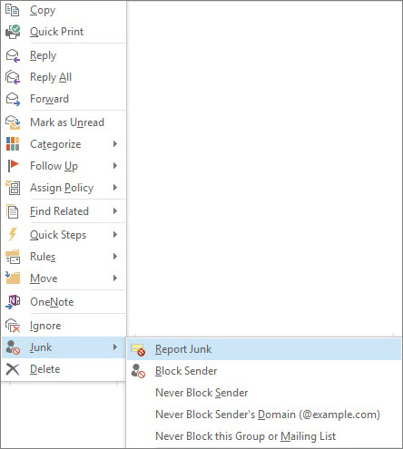

# Relatar mensagens de Lixo Eletrônico à Microsoft

O Suplemento de Relatório de Lixo Eletrônico da Microsoft do Microsoft Office Outlook oferece várias maneiras para você relatar mensagens de lixo eletrônico:

- Da faixa de opções do Outlook

- Da sua Caixa de Entrada

- De dentro de uma mensagem de email aberta

O Suplemento de Relatórios de Lixo Eletrônico ajuda você a enviar relatórios para o serviço Microsoft Proteção do Exchange Online (EOP). Se a sua caixa de correio não estiver protegida pelo serviço, o envio de relatório de lixo eletrônico não afetará os filtros de spam. Os administradores podem saber mais sobre as configurações de spam que se aplicam a uma organização inteira em [criar listas de remetentes seguros no office 365](create-safe-sender-lists-in-office-365.md) e [criar listas de remetentes bloqueados no Office 365](create-block-sender-lists-in-office-365.md). Elas serão úteis se você tiver o controle de nível de administrador e quiser impedir falsos positivos ou falsos negativos.

> [!TIP]
> Você também pode enviar mensagens de spam diretamente para a Microsoft usando o endereço de email do [junk@office365.microsoft.com](mailto:junk@office365.microsoft.com) e mensagens falsas positivas (não spam) usando o endereço de email do [not_junk@office365.microsoft.com](mailto:not_junk@office365.microsoft.com) . Para obter mais informações, consulte [enviar mensagens de spam, não spam e golpes de phishing para a Microsoft para análise](submit-spam-non-spam-and-phishing-scam-messages-to-microsoft-for-analysis.md).

### Para relatar mensagens de lixo eletrônico do Outlook

[Usar o suplemento de mensagem de relatório](https://support.office.com/article/b5caa9f1-cdf3-4443-af8c-ff724ea719d2)

### Para relatar mensagens de lixo eletrônico em Caixa de Entrada

1. Clique com o botão direito do mouse nas mensagens que deseja relatar como lixo eletrônico.

2. Selecione **Lixo Eletrônico** e clique em **Relatar lixo eletrônico**.
    

3. A caixa de diálogo **Suplemento de Relatório de lixo eletrônico da Microsoft** será aberta. Se você tiver certeza de que deseja enviar as mensagens que selecionou como lixo eletrônico, clique em **Sim**.
    

    > [!NOTE]
    > Se você não quiser receber essa mensagem de confirmação ao enviar mensagens de lixo eletrônico, marque **Não mostrar essa mensagem novamente**.

As mensagens selecionadas serão enviadas à Microsoft para análise e movidas para a pasta Lixo Eletrônico. Para confirmar se as mensagens foram enviadas, abra sua pasta **Itens Enviados** para exibir as mensagens enviadas.

### Para relatar uma mensagem de lixo eletrônico de dentro de uma mensagem de aberta

1. De dentro de uma mensagem aberta, clique no botão **Relatar lixo eletrônico** na faixa de opções da mensagem. Por exemplo **, clique em** \> lixo eletrônico **relatar** 

2. A caixa de diálogo **Suplemento de Relatório de lixo eletrônico da Microsoft** será aberta. Se você tiver certeza de que deseja enviar a mensagem selecionada como lixo eletrônico, clique em **Sim**.
    

    > [!NOTE]
    > Se você não quiser receber essa mensagem de confirmação ao enviar mensagens de lixo eletrônico, marque **Não mostrar essa mensagem novamente**.

A mensagem selecionada será enviada à Microsoft para análise e movida para a pasta Lixo Eletrônico. Para confirmar se a mensagem foi enviada, abra sua pasta **Itens Enviados** para exibir a mensagem enviada.
