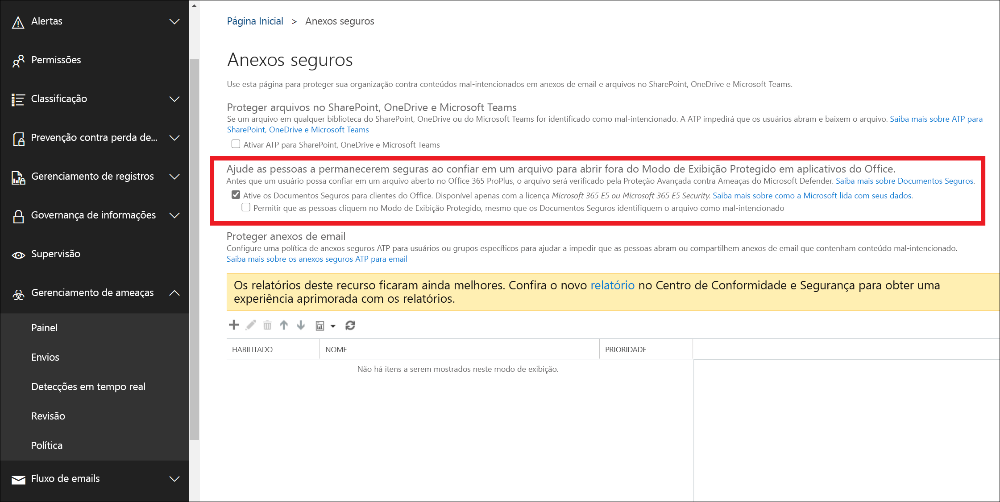

# <a name="safe-documents-in-microsoft-365-e5"></a>Documentos seguros no Microsoft 365 e5

Documentos seguros é um recurso no Microsoft 365 E5 ou no Microsoft 365 E5 segurança que usa a [proteção avançada contra ameaças do Microsoft defender](https://docs.microsoft.com/windows/security/threat-protection/microsoft-defender-atp/microsoft-defender-advanced-threat-protection) para verificar documentos e arquivos abertos no [modo de exibição protegido](https://support.microsoft.com/office/d6f09ac7-e6b9-4495-8e43-2bbcdbcb6653).

## <a name="what-do-you-need-to-know-before-you-begin"></a>Do que você precisa saber para começar?

- Este recurso está disponível apenas para usuários com a licença de segurança do Microsoft 365 E5 ou Microsoft 365 e5.

- No momento, documentos seguros estão disponíveis para visualização pública, disponível para os usuários que fazem parte do [programa Office Insider](https://insider.office.com/join) no canal atual (visualização) com o office versão 2002 (12527,20092) ou superior. Esse recurso está desativado por padrão e deverá ser habilitado pelo administrador de segurança.

- Para se conectar ao PowerShell do Exchange Online, confira [Conectar ao PowerShell do Exchange Online](https://docs.microsoft.com/powershell/exchange/connect-to-exchange-online-powershell). Para se conectar ao EOP PowerShell autônomo, consulte [Conectar-se ao PowerShell do Exchange Online Protection.](https://docs.microsoft.com/powershell/exchange/connect-to-exchange-online-protection-powershell).

- Você precisa ter permissões para poder executar os procedimentos deste tópico. Para habilitar e configurar documentos seguros, você precisa ser membro dos grupos de função de **Gerenciamento da organização** ou de administrador de **segurança** . Para obter mais informações sobre grupos de funções no Centro de Conformidade e Segurança, confira [Permissões no Centro de Conformidade e Segurança](permissions-in-the-security-and-compliance-center.md).

## <a name="how-does-microsoft-handle-your-data"></a>Como a Microsoft lida com seus dados?

Para mantê-lo protegido, documentos seguros enviam arquivos para a nuvem de [proteção avançada contra ameaças do Microsoft defender](https://docs.microsoft.com/windows/security/threat-protection/microsoft-defender-atp/microsoft-defender-advanced-threat-protection) para análise.

- Detalhes sobre como a proteção de thread avançada do Microsoft defender lida com seus dados pode ser encontrada [aqui](https://docs.microsoft.com/windows/security/threat-protection/microsoft-defender-atp/data-storage-privacy)
- Além das diretrizes acima, os arquivos enviados por documentos seguros não são mantidos no defender além do tempo necessário para análise, que normalmente é menor que 24 horas

## <a name="use-the-security--compliance-center-to-configure-safe-documents"></a>Usar o centro de conformidade de & de segurança para configurar documentos seguros

1. Abra o centro de conformidade & segurança em <https://protection.office.com> .

2. Vá para política de **Gerenciamento de ameaças** \> **Policy** \> **anexos seguros de ATP**.

3. Na seção **ajudar as pessoas a permanecerem seguras ao confiar em um arquivo para abrir fora do modo de exibição protegido em aplicativos do Office** , configure qualquer uma das seguintes configurações:

   - **Ative documentos seguros para clientes do Office (os arquivos também serão enviados para a nuvem da Microsoft para análises profundas)**

   - **Permitir que as pessoas cliquem no modo de exibição protegido, mesmo se os documentos seguros identificam o arquivo como mal-intencionado**: Recomendamos que você não habilite essa opção.

4. Quando concluir, clique em **Salvar**.



### <a name="use-exchange-online-powershell-or-standalone-eop-powershell-to-configure-safe-documents"></a>Usar o PowerShell do Exchange Online ou o PowerShell do EOP para configurar documentos seguros

Use a seguinte sintaxe:

```powershell
Set-AtpPolicyForO365 -EnableSafeDocs <$true|$false> -AllowSafeDocsOpen <$true|$false>
```

- O parâmetro _EnableSafeDocs_ habilita ou desabilita documentos seguros para toda a organização.

- O parâmetro _AllowSafeDocsOpen_ permite ou impede que os usuários saiam do modo de exibição protegido (ou seja, abrir o documento) se o documento tiver sido identificado como mal-intencionado.

Este exemplo habilita documentos seguros para toda a organização e impede que os usuários abram documentos identificados como mal-intencionados no modo de exibição protegido.

```powershell
Set-AtpPolicyForO365 -EnableSafeDocs $true -AllowSafeDocsOpen $false
```

Para informações detalhadas de sintaxes e de parâmetros, consulte [set-AtpPolicyForO365](https://docs.microsoft.com/powershell/module/exchange/set-atppolicyforo365).

### <a name="how-do-i-know-this-worked"></a>Como saber se funcionou?

Para verificar se você habilitou e configurou documentos seguros, execute uma das seguintes etapas:

- No centro de conformidade & segurança, vá para a política de **Gerenciamento de ameaças** de \> **Policy** \> **anexos seguros de ATP**e verifique as seleções na seção **ajuda para manter a segurança ao confiar em um arquivo para abrir fora do modo de exibição protegido em aplicativos do Office** .

- Execute o seguinte comando no PowerShell do Exchange Online e verifique os valores de propriedade:

  ```powershell
  Get-AtpPolicyForO365 | Format-List *SafeDocs*
  ```
