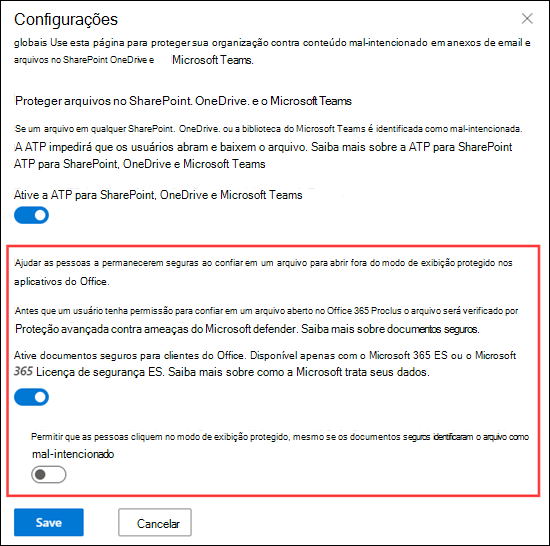

# <a name="safe-documents-in-microsoft-365-e5"></a><span data-ttu-id="809e8-103">Documentos Seguros no Microsoft 365 E5</span><span class="sxs-lookup"><span data-stu-id="809e8-103">Safe Documents in Microsoft 365 E5</span></span>

[!INCLUDE [Microsoft 365 Defender rebranding](../includes/microsoft-defender-for-office.md)]


<span data-ttu-id="809e8-104">Documentos seguros é um recurso no Microsoft 365 E5 ou no Microsoft 365 E5 segurança que usa [o Microsoft defender para ponto de extremidade](https://docs.microsoft.com/windows/security/threat-protection/microsoft-defender-atp/microsoft-defender-advanced-threat-protection) para verificar documentos e arquivos abertos no [modo de exibição protegido](https://support.microsoft.com/office/d6f09ac7-e6b9-4495-8e43-2bbcdbcb6653).</span><span class="sxs-lookup"><span data-stu-id="809e8-104">Safe Documents is a feature in Microsoft 365 E5 or Microsoft 365 E5 Security that uses [Microsoft Defender for Endpoint](https://docs.microsoft.com/windows/security/threat-protection/microsoft-defender-atp/microsoft-defender-advanced-threat-protection) to scan documents and files that are opened in [Protected View](https://support.microsoft.com/office/d6f09ac7-e6b9-4495-8e43-2bbcdbcb6653).</span></span>

## <a name="what-do-you-need-to-know-before-you-begin"></a><span data-ttu-id="809e8-105">O que você precisa saber antes de começar?</span><span class="sxs-lookup"><span data-stu-id="809e8-105">What do you need to know before you begin?</span></span>

- <span data-ttu-id="809e8-106">Os documentos seguros só estão disponíveis para usuários com licenças de segurança *do microsoft 365 E5* ou *Microsoft 365 E5* .</span><span class="sxs-lookup"><span data-stu-id="809e8-106">Safe Documents is available only to users with *Microsoft 365 E5* or *Microsoft 365 E5 Security* licenses.</span></span> <span data-ttu-id="809e8-107">Essas licenças não estão incluídas nos planos do Microsoft defender for Office 365.</span><span class="sxs-lookup"><span data-stu-id="809e8-107">These licenses are not included in Microsoft Defender for Office 365 plans.</span></span>

- <span data-ttu-id="809e8-108">Os documentos seguros têm suporte no Microsoft 365 Apps for Enterprise (anteriormente conhecido como Office 365 ProPlus) versão 2004 ou posterior.</span><span class="sxs-lookup"><span data-stu-id="809e8-108">Safe Documents is supported in Microsoft 365 Apps for enterprise (formerly known as Office 365 ProPlus) version 2004 or later.</span></span>

- <span data-ttu-id="809e8-109">Abra o Centro de Conformidade e Segurança em <https://protection.office.com>.</span><span class="sxs-lookup"><span data-stu-id="809e8-109">You open the Security & Compliance Center at <https://protection.office.com>.</span></span> <span data-ttu-id="809e8-110">Para ir diretamente para a página de **anexos seguros de ATP** , abra <https://protection.office.com/safeattachmentv2> .</span><span class="sxs-lookup"><span data-stu-id="809e8-110">To go directly to the **ATP Safe Attachments** page, open <https://protection.office.com/safeattachmentv2>.</span></span>

- <span data-ttu-id="809e8-111">Para se conectar ao Windows PowerShell do Exchange Online, confira [Conectar ao Windows PowerShell do Exchange Online](https://docs.microsoft.com/powershell/exchange/connect-to-exchange-online-powershell).</span><span class="sxs-lookup"><span data-stu-id="809e8-111">To connect to Exchange Online PowerShell, see [Connect to Exchange Online PowerShell](https://docs.microsoft.com/powershell/exchange/connect-to-exchange-online-powershell).</span></span>

- <span data-ttu-id="809e8-112">Você precisa de permissões no Centro de Conformidade e Segurança antes de poder realizar os procedimentos deste artigo:</span><span class="sxs-lookup"><span data-stu-id="809e8-112">You need to be assigned permissions in the Security & Compliance Center before you can do the procedures in this article:</span></span>
  - <span data-ttu-id="809e8-113">Para definir as configurações de documentos seguros, você precisa ser membro dos grupos de função de **Gerenciamento da organização** ou de **administrador de segurança** .</span><span class="sxs-lookup"><span data-stu-id="809e8-113">To configure Safe Documents settings, you need to be a member of the **Organization Management** or **Security Administrator** role groups.</span></span>
  - <span data-ttu-id="809e8-114">Para acesso somente leitura a configurações de documentos seguros, você precisa ser membro dos grupos de função **leitor global** ou **leitor de segurança** .</span><span class="sxs-lookup"><span data-stu-id="809e8-114">For read-only access to Safe Documents settings, you need to be a member of the **Global Reader** or **Security Reader** role groups.</span></span>

  <span data-ttu-id="809e8-115">Para saber mais, confira [Permissões no Centro de Conformidade de Segurança](permissions-in-the-security-and-compliance-center.md).</span><span class="sxs-lookup"><span data-stu-id="809e8-115">For more information, see [Permissions in the Security & Compliance Center](permissions-in-the-security-and-compliance-center.md).</span></span>

  <span data-ttu-id="809e8-116">**Observações**:</span><span class="sxs-lookup"><span data-stu-id="809e8-116">**Notes**:</span></span>

  - <span data-ttu-id="809e8-117">Adicionar usuários à função correspondente do Azure Active Directory no Centro de administração do Microsoft 365 fornece aos usuários as permissões necessárias no Centro de Segurança e Conformidade _e_ permissões para outros recursos no Microsoft 365.</span><span class="sxs-lookup"><span data-stu-id="809e8-117">Adding users to the corresponding Azure Active Directory role in the Microsoft 365 admin center gives users the required permissions in the Security & Compliance Center _and_ permissions for other features in Microsoft 365.</span></span> <span data-ttu-id="809e8-118">Para obter mais informações, confira o artigo [Sobre funções de administrador](https://docs.microsoft.com/microsoft-365/admin/add-users/about-admin-roles).</span><span class="sxs-lookup"><span data-stu-id="809e8-118">For more information, see [About admin roles](https://docs.microsoft.com/microsoft-365/admin/add-users/about-admin-roles).</span></span>
  - <span data-ttu-id="809e8-119">O grupo de função **Gerenciamento de Organização Somente para Exibição** no [Exchange Online](https://docs.microsoft.com/Exchange/permissions-exo/permissions-exo#role-groups) também fornece acesso somente leitura ao recurso.</span><span class="sxs-lookup"><span data-stu-id="809e8-119">The **View-Only Organization Management** role group in [Exchange Online](https://docs.microsoft.com/Exchange/permissions-exo/permissions-exo#role-groups) also gives read-only access to the feature.</span></span>

### <a name="how-does-microsoft-handle-your-data"></a><span data-ttu-id="809e8-120">Como a Microsoft lida com seus dados?</span><span class="sxs-lookup"><span data-stu-id="809e8-120">How does Microsoft handle your data?</span></span>

<span data-ttu-id="809e8-121">Para mantê-lo protegido, os documentos seguros enviam arquivos para a nuvem do [Microsoft defender for Endpoint](https://docs.microsoft.com/windows/security/threat-protection/microsoft-defender-atp/microsoft-defender-advanced-threat-protection) para análise.</span><span class="sxs-lookup"><span data-stu-id="809e8-121">To keep you protected, Safe Documents sends files to the [Microsoft Defender for Endpoint](https://docs.microsoft.com/windows/security/threat-protection/microsoft-defender-atp/microsoft-defender-advanced-threat-protection) cloud for analysis.</span></span> <span data-ttu-id="809e8-122">Detalhes sobre como o Microsoft defender para ponto de extremidade lida com seus dados pode ser encontrado aqui: [Microsoft defender para armazenamento de dados do ponto de extremidade e privacidade](https://docs.microsoft.com/windows/security/threat-protection/microsoft-defender-atp/data-storage-privacy).</span><span class="sxs-lookup"><span data-stu-id="809e8-122">Details on how Microsoft Defender for Endpoint handles your data can be found here: [Microsoft Defender for Endpoint data storage and privacy](https://docs.microsoft.com/windows/security/threat-protection/microsoft-defender-atp/data-storage-privacy).</span></span>

<span data-ttu-id="809e8-123">Arquivos enviados por documentos seguros não são mantidos no defender além do tempo necessário para análise (normalmente, menos de 24 horas).</span><span class="sxs-lookup"><span data-stu-id="809e8-123">Files sent by Safe Documents are not retained in Defender beyond the time needed for analysis (typically, less than 24 hours).</span></span>

## <a name="use-the-security--compliance-center-to-configure-safe-documents"></a><span data-ttu-id="809e8-124">Usar o centro de conformidade de & de segurança para configurar documentos seguros</span><span class="sxs-lookup"><span data-stu-id="809e8-124">Use the Security & Compliance Center to configure Safe Documents</span></span>

1. <span data-ttu-id="809e8-125">No centro de conformidade & segurança, vá para política de **Gerenciamento de ameaças** \>  \> e **anexos seguros de ATP** e clique em **configurações globais**.</span><span class="sxs-lookup"><span data-stu-id="809e8-125">In the Security & Compliance Center, go to **Threat management** \> **Policy** \> **ATP Safe Attachments**, and then click **Global settings**.</span></span>

2. <span data-ttu-id="809e8-126">Na saída **das configurações globais** exibida, defina as seguintes configurações:</span><span class="sxs-lookup"><span data-stu-id="809e8-126">In the **Global settings** fly out that appears, configure the following settings:</span></span>

   - <span data-ttu-id="809e8-127">**Ativar documentos seguros para clientes do Office**: mover o botão de alternância para o direito para ativar o recurso:  .</span><span class="sxs-lookup"><span data-stu-id="809e8-127">**Turn on Safe Documents for Office clients**: Move the toggle to the right to turn on the feature: .</span></span>

   - <span data-ttu-id="809e8-128">**Permitir que as pessoas cliquem através do modo de exibição protegido, mesmo se os documentos seguros identificarem o arquivo como mal-intencionado**: Recomendamos que você deixe esta opção desativada (Mantenha a alternação para a esquerda:  ).</span><span class="sxs-lookup"><span data-stu-id="809e8-128">**Allow people to click through Protected View even if Safe Documents identifies the file as malicious**: We recommend that you leave this option turned off (leave the toggle to the left: ).</span></span>

   <span data-ttu-id="809e8-129">Quando concluir, clique em **Salvar**.</span><span class="sxs-lookup"><span data-stu-id="809e8-129">When you're finished, click **Save**.</span></span>

   

### <a name="use-exchange-online-powershell-to-configure-safe-documents"></a><span data-ttu-id="809e8-131">Usar o PowerShell do Exchange Online para configurar documentos seguros</span><span class="sxs-lookup"><span data-stu-id="809e8-131">Use Exchange Online PowerShell to configure Safe Documents</span></span>

<span data-ttu-id="809e8-132">Use a seguinte sintaxe:</span><span class="sxs-lookup"><span data-stu-id="809e8-132">Use the following syntax:</span></span>

```powershell
Set-AtpPolicyForO365 -EnableSafeDocs <$true | $false> -AllowSafeDocsOpen <$true | $false>
```

- <span data-ttu-id="809e8-133">O parâmetro _EnableSafeDocs_ habilita ou desabilita documentos seguros para toda a organização.</span><span class="sxs-lookup"><span data-stu-id="809e8-133">The _EnableSafeDocs_ parameter enables or disables Safe Documents for the entire organization.</span></span>
- <span data-ttu-id="809e8-134">O parâmetro _AllowSafeDocsOpen_ permite ou impede que os usuários saiam do modo de exibição protegido (ou seja, abrir o documento) se o documento tiver sido identificado como mal-intencionado.</span><span class="sxs-lookup"><span data-stu-id="809e8-134">The _AllowSafeDocsOpen_ parameter allows or prevents users from leaving Protected View (that is, opening the document) if the document has been identified as malicious.</span></span>

<span data-ttu-id="809e8-135">Este exemplo habilita documentos seguros para toda a organização e impede que os usuários abram documentos identificados como mal-intencionados no modo de exibição protegido.</span><span class="sxs-lookup"><span data-stu-id="809e8-135">This example enables Safe Documents for the entire organization, and prevents users from opening documents that have been identified as malicious from Protected View.</span></span>

```powershell
Set-AtpPolicyForO365 -EnableSafeDocs $true -AllowSafeDocsOpen $false
```

<span data-ttu-id="809e8-136">Para informações detalhadas de sintaxes e de parâmetros, consulte [set-AtpPolicyForO365](https://docs.microsoft.com/powershell/module/exchange/set-atppolicyforo365).</span><span class="sxs-lookup"><span data-stu-id="809e8-136">For detailed syntax and parameter information, see [Set-AtpPolicyForO365](https://docs.microsoft.com/powershell/module/exchange/set-atppolicyforo365).</span></span>

### <a name="how-do-i-know-this-worked"></a><span data-ttu-id="809e8-137">Como saber se funcionou?</span><span class="sxs-lookup"><span data-stu-id="809e8-137">How do I know this worked?</span></span>

<span data-ttu-id="809e8-138">Para verificar se você habilitou e configurou documentos seguros, execute uma das seguintes etapas:</span><span class="sxs-lookup"><span data-stu-id="809e8-138">To verify that you've enabled and configured Safe Documents, do any of the following steps:</span></span>

- <span data-ttu-id="809e8-139">No centro de conformidade & segurança, vá para política de **Gerenciamento de ameaças** \>  \> de **anexos seguros de ATP**, clique em **configurações globais** e verifique o **Ativar documentos seguros para clientes do Office** e **permitir que as pessoas cliquem através do modo de exibição protegido, mesmo se os documentos seguros identificam o arquivo como configurações mal-intencionadas** .</span><span class="sxs-lookup"><span data-stu-id="809e8-139">In the Security & Compliance Center, go to **Threat management** \> **Policy** \> **ATP Safe Attachments**, click **Global settings**, and verify the **Turn on Safe Documents for Office clients** and **Allow people to click through Protected View even if Safe Documents identifies the file as malicious** settings.</span></span>

- <span data-ttu-id="809e8-140">Execute o seguinte comando no PowerShell do Exchange Online e verifique os valores de propriedade:</span><span class="sxs-lookup"><span data-stu-id="809e8-140">Run the following command in Exchange Online PowerShell and verify the property values:</span></span>

  ```powershell
  Get-AtpPolicyForO365 | Format-List *SafeDocs*
  ```

- <span data-ttu-id="809e8-141">Os arquivos a seguir estão disponíveis para testar a proteção de documentos seguros.</span><span class="sxs-lookup"><span data-stu-id="809e8-141">The following files are available to test Safe Documents protection.</span></span> <span data-ttu-id="809e8-142">Estes documentos são semelhantes aos EICAR.TXT arquivo para testar soluções antimalware e antivírus.</span><span class="sxs-lookup"><span data-stu-id="809e8-142">These documents are similar to the EICAR.TXT file for testing anti-malware and anti-virus solutions.</span></span> <span data-ttu-id="809e8-143">Os arquivos não são prejudiciais, mas eles disparam a proteção de documentos seguros.</span><span class="sxs-lookup"><span data-stu-id="809e8-143">The files are not harmful, but they will trigger Safe Documents protection.</span></span>

  - [<span data-ttu-id="809e8-144">SafeDocsDemo.docx</span><span class="sxs-lookup"><span data-stu-id="809e8-144">SafeDocsDemo.docx</span></span>](https://github.com/MicrosoftDocs/microsoft-365-docs/raw/public/microsoft-365/downloads/SafeDocsDemo.docx)
  - [<span data-ttu-id="809e8-145">SafeDocsDemo.pptx</span><span class="sxs-lookup"><span data-stu-id="809e8-145">SafeDocsDemo.pptx</span></span>](https://github.com/MicrosoftDocs/microsoft-365-docs/raw/public/microsoft-365/downloads/SafeDocsDemo.pptx)
  - [<span data-ttu-id="809e8-146">SafeDocsDemo.xlsx</span><span class="sxs-lookup"><span data-stu-id="809e8-146">SafeDocsDemo.xlsx</span></span>](https://github.com/MicrosoftDocs/microsoft-365-docs/raw/public/microsoft-365/downloads/SafeDocsDemo.xlsx)
