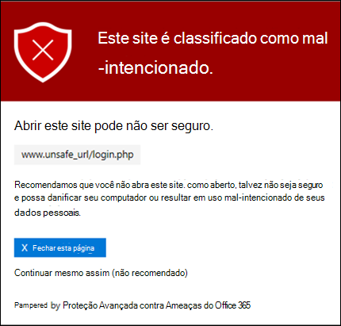

# Links seguros no Microsoft Defender para Office 365Safe Links in Microsoft Defender for Office 365

[!INCLUDE [Microsoft 365 Defender rebranding](../includes/microsoft-defender-for-office.md)]

**Aplica-se a****Applies to**
- [Plano 1 e plano 2 do Microsoft Defender para Office 365Microsoft Defender for Office 365 plan 1 and plan 2](defender-for-office-365.md)
- [Microsoft 365 DefenderMicrosoft 365 Defender](../defender/microsoft-365-defender.md)

> [!IMPORTANT]
> Este artigo se destina a clientes empresariais que possuem o [Microsoft Defender para Office 365](defender-for-office-365.md).This article is intended for business customers who have [Microsoft Defender for Office 365](defender-for-office-365.md). Se você estiver usando o Outlook.com, a Família do Microsoft 365 ou o Microsoft 365 Personal e estiver procurando informações sobre Safelinks no Outlook, consulte [Advanced Outlook.com security](https://support.microsoft.com/office/882d2243-eab9-4545-a58a-b36fee4a46e2).If you're using Outlook.com, Microsoft 365 Family, or Microsoft 365 Personal, and you're looking for information about Safelinks in Outlook, see [Advanced Outlook.com security](https://support.microsoft.com/office/882d2243-eab9-4545-a58a-b36fee4a46e2).

Links Seguros é um recurso no [Defender para Office 365](defender-for-office-365.md) que fornece verificação de URL e reescrita de mensagens de email de entrada no fluxo de emails e verificação de tempo de clique de URLs e links em mensagens de email e outros locais.Safe Links is a feature in [Defender for Office 365](defender-for-office-365.md) that provides URL scanning and rewriting of inbound email messages in mail flow, and time-of-click verification of URLs and links in email messages and other locations. A verificação de Links Seguros ocorre além da proteção [anti-spam e anti-malware](anti-spam-and-anti-malware-protection.md) regular em mensagens de email de entrada no Exchange Online Protection (EOP).Safe Links scanning occurs in addition to the regular [anti-spam and anti-malware protection](anti-spam-and-anti-malware-protection.md) in inbound email messages in Exchange Online Protection (EOP). A verificação de Links Seguros pode ajudar a proteger sua organização contra links mal-intencionados usados em phishing e outros ataques.Safe Links scanning can help protect your organization from malicious links that are used in phishing and other attacks.

A proteção de Links Seguros está disponível nos seguintes locais:Safe Links protection is available in the following locations:

- **Mensagens de email**: a proteção de links seguros para links em mensagens de email é controlada por políticas de Links Seguros.**Email messages**: Safe Links protection for links in email messages is controlled by Safe Links policies. Não há política de Links Seguros padrão, portanto, para obter a proteção de Links Seguros em mensagens de email, você precisa criar uma ou mais políticas de **Links Seguros.**There is no default Safe Links policy, **so to get the protection of Safe Links in email messages, you need to create one or more Safe Links policies**. Para obter instruções, consulte [Set up Safe Links policies in Microsoft Defender for Office 365](set-up-safe-links-policies.md).For instructions, see [Set up Safe Links policies in Microsoft Defender for Office 365](set-up-safe-links-policies.md).

  Para obter mais informações sobre a proteção de Links Seguros para mensagens de email, consulte a seção Links Seguros para mensagens de [email](#safe-links-settings-for-email-messages) mais adiante neste artigo.For more information about Safe Links protection for email messages, see the [Safe Links settings for email messages](#safe-links-settings-for-email-messages) section later in this article.

- **Microsoft Teams** (atualmente no TAP Preview): a proteção de links seguros para links em conversas do Teams, chats de grupo ou de canais também é controlada por políticas de Links Seguros.**Microsoft Teams** (currently in TAP Preview): Safe Links protection for links in Teams conversations, group chats, or from channels is also controlled by Safe Links policies. Não há nenhuma política padrão de Links Seguros, portanto, para obter a proteção de Links Seguros no Teams, você precisa criar uma ou mais políticas de **Links Seguros.**There is no default Safe Links policy, **so to get the protection of Safe Links in Teams, you need to create one or more Safe Links policies**.

  Para obter mais informações sobre a proteção de Links Seguros no Teams, consulte a seção Links Seguros [para o Microsoft Teams](#safe-links-settings-for-microsoft-teams) mais adiante neste artigo.For more information about Safe Links protection in Teams, see the [Safe Links settings for Microsoft Teams](#safe-links-settings-for-microsoft-teams) section later in this article.

- **Aplicativos do Office 365**: a proteção de Links Seguros para aplicativos do Office 365 está disponível em computadores, dispositivos móveis e web com suporte.**Office 365 apps**: Safe Links protection for Office 365 apps is available in supported desktop, mobile, and web aps. Configure **a** proteção de Links Seguros para aplicativos do Office 365 na configuração global que estão **fora das** políticas de Links Seguros.You **configure** Safe Links protection for Office 365 apps in the global setting that are **outside** of Safe Links policies. Para obter instruções, consulte [Configure global settings for Safe Links settings in Microsoft Defender for Office 365](configure-global-settings-for-safe-links.md).For instructions, see [Configure global settings for Safe Links settings in Microsoft Defender for Office 365](configure-global-settings-for-safe-links.md).

  No entanto, a proteção de Links Seguros  para aplicativos do Office 365 só é aplicada aos usuários incluídos em políticas de Links Seguros ativos.But, Safe Links protection for Office 365 apps is only **applied** to users who are included in active Safe Links policies. Se um usuário não estiver incluído em uma política de Links Seguros ativos, o usuário não obterá proteção de Links Seguros em aplicativos do Office 365 com suporte.If a user isn't included in an active Safe Links policy, the user doesn't get Safe Links protection in supported Office 365 apps.

  Para obter mais informações sobre a proteção de Links Seguros nos aplicativos do Office 365, consulte a seção Configurações de Links Seguros para aplicativos do [Office 365](#safe-links-settings-for-office-365-apps) posteriormente neste artigo.For more information about Safe Links protection in Office 365 apps, see the [Safe Links settings for Office 365 apps](#safe-links-settings-for-office-365-apps) section later in this article.

Este artigo inclui descrições detalhadas dos seguintes tipos de configurações de Links Seguros:This article includes detailed descriptions of the following types of Safe Links settings:

- **Configurações em políticas de Links Seguros**: Essas configurações se aplicam somente aos usuários incluídos nas políticas específicas, e as configurações podem ser diferentes entre as políticas.**Settings in Safe Links policies**: These settings apply only to the users who are included in the specific policies, and the settings might be different between policies. Essas configurações incluem:These settings include:

  - [Configurações de Links Seguros para mensagens de emailSafe Links settings for email messages](#safe-links-settings-for-email-messages)
  - [Configurações de Links Seguros para o Microsoft TeamsSafe Links settings for Microsoft Teams](#safe-links-settings-for-microsoft-teams)
  - ["Não reescrever as seguintes URLs" em políticas de Links Seguros"Do not rewrite the following URLs" lists in Safe Links policies](#do-not-rewrite-the-following-urls-lists-in-safe-links-policies)

- **Configurações de Links Seguros Globais**: Essas configurações são configuradas globalmente, não em políticas de Links Seguros.**Global Safe Links settings**: These settings are configured globally, not in Safe Links policies. Porém, as configurações se aplicam apenas aos usuários incluídos em políticas ativas de Links Seguros.But, the settings apply only to users who are included in active Safe Links policies. Essas configurações incluem:These settings include:

  - [Configurações de Links Seguros para aplicativos do Office 365Safe Links settings for Office 365 apps](#safe-links-settings-for-office-365-apps)
  - ["Bloquear a lista de URLs a seguir" para Links Seguros"Block the following URLs" list for Safe Links](#block-the-following-urls-list-for-safe-links)

A tabela a seguir descreve cenários para Links Seguros nas organizações do Microsoft 365 e do Office 365 que incluem o Defender para Office 365 (em outras palavras, a falta de licenciamento nunca é um problema nos exemplos).The following table describes scenarios for Safe Links in Microsoft 365 and Office 365 organizations that include Defender for Office 365 (in other words, lack of licensing is never an issue in the examples).

****

|CenárioScenario|ResultadoResult|
|---|---|
|O Jean é membro do departamento de marketing.Jean is a member of the marketing department. A proteção de Links Seguros para aplicativos do Office 365 está ativas nas configurações globais para Links Seguros, e existe uma política de Links Seguros que se aplica a membros do departamento de marketing.Safe Links protection for Office 365 apps is turned on in the global settings for Safe Links, and a Safe Links policy that applies to members of the marketing department exists. João abre uma apresentação do PowerPoint em uma mensagem de email e clica em uma URL na apresentação.Jean opens a PowerPoint presentation in an email message, and then clicks a URL in the presentation.|O Jean é protegido por Links Seguros.Jean is protected by Safe Links. 
 O Jean está incluído em uma política de Links Seguros e a proteção de Links Seguros para aplicativos do Office 365 está conexões.Jean is included in a Safe Links policy, and Safe Links protection for Office 365 apps is turned on. 
 Para obter mais informações sobre os requisitos para a proteção de Links Seguros em aplicativos do Office 365, consulte a seção Configurações de Links Seguros para aplicativos do [Office 365](#safe-links-settings-for-office-365-apps) posteriormente neste artigo.For more information about the requirements for Safe Links protection in Office 365 apps, see the [Safe Links settings for Office 365 apps](#safe-links-settings-for-office-365-apps) section later in this article.|
|A organização do Microsoft 365 E5 do Chris não tem políticas de Links Seguros configuradas.Chris's Microsoft 365 E5 organization has no Safe Links policies configured. Chris recebe um email de um remetente externo que contém uma URL para um site mal-intencionado que ele finalmente clica.Chris receives an email from an external sender that contains a URL to a malicious website that he ultimately clicks.|Chris não está protegido por Links Seguros.Chris is not protected by Safe Links. 
 Um administrador deve criar pelo menos uma política de Links Seguros para qualquer pessoa obter proteção de Links Seguros em mensagens de email de entrada.An admin must create at least one Safe Links policy for anyone to get Safe Links protection in inbound email messages. Chris deve ser incluído nas condições da política para obter proteção de Links Seguros.Chris must be included in the conditions of policy to get Safe Links protection.|
|Na organização do Pat, nenhum administrador criou nenhuma política de Links Seguros, mas a proteção de Links Seguros para aplicativos do Office 365 está conexões ativas.In Pat's organization, no admins have created any Safe Links policies, but Safe Links protection for Office 365 apps is turned on. Pat abre um documento do Word e clica em uma URL no arquivo.Pat opens a Word document and clicks a URL in the file.|O Pat não está protegido por Links Seguros.Pat is not protected by Safe Links. 
 Embora a proteção de Links Seguros para aplicativos do Office 365 seja ativa globalmente, o Pat não está incluído em nenhuma política ativa de Links Seguros, portanto, a proteção não pode ser aplicada.Although Safe Links protection for Office 365 apps is turned on globally, Pat is not included in any active Safe Links policies, so the protection can't be applied.|
|Na organização de Lee, é configurado na lista Bloquear as URLs a seguir nas configurações `https://tailspintoys.com` globais para Links Seguros. In Lee's organization, `https://tailspintoys.com` is configured in the **Block the following URLs** list in the global settings for Safe Links. Uma política de Links Seguros que inclui Lee já existe.A Safe Links policy that includes Lee already exists. Lee recebe uma mensagem de email que contém a URL `https://tailspintoys.com/aboutus/trythispage` .Lee receives an email message that contains the URL `https://tailspintoys.com/aboutus/trythispage`. Lee clica na URL.Lee clicks the URL.|A URL pode ser bloqueada automaticamente para Lee; depende da entrada da URL na lista e do cliente de email que Lee usou.The URL might be automatically blocked for Lee; it depends on the URL entry in the list and the email client Lee used. Para obter mais informações, consulte a [seção "Bloquear as URLs a seguir" para Links](#block-the-following-urls-list-for-safe-links) Seguros mais adiante neste artigo.For more information, see the ["Block the following URLs" list for Safe Links](#block-the-following-urls-list-for-safe-links) section later in this article.|
|O Jamie e a Julia trabalham para contoso.com.Jamie and Julia both work for contoso.com. Há muito tempo, os administradores configuram políticas de Links Seguros que se aplicam a Ambos de Jamie e Julia.A long time ago, admins configured Safe Links policies that apply to both of Jamie and Julia. O Jamie envia um email para a Julia, sem saber que o email contém uma URL mal-intencionada.Jamie sends an email to Julia, not knowing that the email contains a malicious URL.|A Julia será protegida por **Links** Seguros se a política de Links Seguros que se aplica a ela estiver configurada para aplicar-se a mensagens entre destinatários internos.Julia is protected by Safe Links **if** the Safe Links policy that applies to her is configured to apply to messages between internal recipients. Para obter mais informações, consulte a seção [Configurações de Links Seguros para mensagens de email](#safe-links-settings-for-email-messages) posteriormente neste artigo.For more information, see the [Safe Links settings for email messages](#safe-links-settings-for-email-messages) section later in this article.|

## Configurações de Links Seguros para mensagens de emailSafe Links settings for email messages

Links seguros verifica emails de entrada para hiperlinks mal-intencionados conhecidos.Safe Links scans incoming email for known malicious hyperlinks. As URLs digitalizados são reescritas usando o prefixo de URL padrão da Microsoft: `https://nam01.safelinks.protection.outlook.com` .Scanned URLs are rewritten using the Microsoft standard URL prefix: `https://nam01.safelinks.protection.outlook.com`. Depois que o link é reescrito, ele é analisado para conteúdo potencialmente mal-intencionado.After the link is rewritten, it's analyzed for potentially malicious content.

Depois que Links Seguros reescrever uma URL, a URL permanecerá reescrito mesmo que a mensagem seja *encaminhada manualmente* ou respondida (para destinatários internos e externos).After Safe Links rewrites a URL, the URL remains rewritten even if the message is *manually* forwarded or replied to (both to internal and external recipients). Links adicionais adicionados à mensagem encaminhada ou respondida não são reescritos.Additional links that are added to the forwarded or replied to message are not rewritten. No entanto, no  caso de encaminhamento automático por regras de Caixa de Entrada ou encaminhamento SMTP, a  URL não será regravada na mensagem que se destina ao destinatário final, a menos que esse destinatário também esteja protegido por Links Seguros ou a URL já tenha sido regravada em uma comunicação anterior.However, in the case of *automatic* forwarding by Inbox rules or SMTP forwarding, the URL will not be rewritten in the message that's intended for the final recipient *unless* that recipient is also protected by Safe Links or the URL had already been rewritten in a previous communication. 

As configurações em políticas de Links Seguros que se aplicam a mensagens de email são descritas na lista a seguir:The settings in Safe Links policies that apply to email messages are described in the following list:

- **Selecione a ação para URLs potencialmente mal-intencionadas** desconhecidas em mensagens : Habilita ou desabilita a verificação de Links Seguros em mensagens de email.**Select the action for unknown potentially malicious URLs in messages**: Enables or disables Safe Links scanning in email messages. O valor recomendado é **On**.The recommended value is **On**. A ação dessa configuração resulta nas seguintes ações.Turning on this setting results in the following actions.

  - A verificação de Links Seguros está habilitada no Outlook (C2R) no Windows.Safe Links scanning is enabled in Outlook (C2R) on Windows.
  - AS URLs são regravadas e os usuários são roteados por meio da proteção de Links Seguros quando clicam em URLs em mensagens.URLs are rewritten and users are routed through Safe Links protection when they click URLs in messages.
  - Quando clicadas, as URLs são verificadas em uma lista de URLs mal-intencionadas conhecidas e na lista ["Bloquear as URLs a seguir".](#block-the-following-urls-list-for-safe-links)When clicked, URLs are checked against a list of known malicious URLs and the ["Block the following URLs" list](#block-the-following-urls-list-for-safe-links).
  - URLs que não têm uma reputação válida são detonadas de forma assíncrona em segundo plano.URLs that don't have a valid reputation are detonated asynchronously in the background.

- **Aplicar verificação de URL** em tempo real para links suspeitos e links que apontam para arquivos : Permite a verificação em tempo real de links, incluindo links em mensagens de email que apontam para conteúdo baixável.**Apply real-time URL scanning for suspicious links and links that point to files**: Enables real-time scanning of links, including links in email messages that point to downloadable content. O valor recomendado está habilitado.The recommended value is enabled.

  - **Aguarde a conclusão da verificação de URL antes de entregar a mensagem**:**Wait for URL scanning to complete before delivering the message**:

    - Habilitado: as mensagens que contêm URLs são mantidas até que a verificação seja concluída.Enabled: Messages that contain URLs are held until scanning is finished. As mensagens são entregues somente depois que as URLs são confirmadas como seguras.Messages are delivered only after the URLs are confirmed to be safe. Esse é o valor recomendado.This is the recommended value.
    - Desabilitado: se a verificação de URL não puder ser concluída, entregue a mensagem de qualquer maneira.Disabled: If URL scanning can't complete, deliver the message anyway.

- **Aplicar Links Seguros** a mensagens de email enviadas dentro da organização : Habilita ou desabilita a verificação de Links Seguros em mensagens enviadas entre destinatários internos e destinatários internos na mesma organização do Exchange Online.**Apply Safe Links to email messages sent within the organization**: Enables or disables Safe Links scanning on messages sent between internal senders and internal recipients within the same Exchange Online organization. O valor recomendado está habilitado.The recommended value is enabled.

- **Não rastrear cliques do usuário**: Habilita ou desabilita o armazenamento de Links Seguros clique em dados de clique para URLs clicadas em mensagens de email.**Do not track user clicks**: Enables or disables storing Safe Links click data for URLs clicked in email messages. O valor recomendado é deixar essa configuração não eleita (para acompanhar os cliques do usuário).The recommend value is to leave this setting unselected (to track user clicks).

  No momento, não há suporte para o rastreamento de cliques de URL para links em mensagens de email enviadas entre destinatários internos e destinatários internos.URL click tracking for links in email messages sent between internal senders and internal recipients is currently not supported.

- **Não permita que os usuários cliquem** na URL original : Permite ou impede que os usuários cliquem na página de aviso [para](#warning-pages-from-safe-links) a URL original.**Do not allow users to click through to original URL**: Allows or blocks users from clicking through the [warning page](#warning-pages-from-safe-links) to the original URL. O valor recomendado está habilitado.The recommend value is enabled.

- **Exibir a identidade visual da organização em páginas** de notificação e aviso: essa opção mostra a identidade visual da sua organização em páginas de aviso.**Display the organization branding on notification and warning pages**: This option shows your organization's branding on warning pages. A identidade visual ajuda os usuários a identificar avisos legítimos, pois as páginas de aviso padrão da Microsoft geralmente são usadas por invasores.Branding helps users identify legitimate warnings, because default Microsoft warning pages are often used by attackers. Para obter mais informações sobre identidade visual personalizada, consulte [Personalizar o tema do Microsoft 365 para sua organização.](../../admin/setup/customize-your-organization-theme.md)For more information about customized branding, see [Customize the Microsoft 365 theme for your organization](../../admin/setup/customize-your-organization-theme.md).

- **Não reescreva as SEGUINTES URLs**: deixa URLs como estão.**Do not rewrite the following URLs**: Leaves URLs as they are. Mantém uma lista personalizada de URLs seguras que não precisam de verificação.Keeps a custom list of safe URLs that don't need scanning. A lista é exclusiva para cada política de Links Seguros.The list is unique for each Safe Links policy. Para obter mais informações sobre a lista Não reescrever as **URLs** a seguir, consulte as listas "Não reescrever as [URLs a seguir"](#do-not-rewrite-the-following-urls-lists-in-safe-links-policies) na seção Políticas de Links Seguros mais adiante neste artigo.For more information about the **Do not rewrite the following URLs** list, see the ["Do not rewrite the following URLs" lists in Safe Links policies](#do-not-rewrite-the-following-urls-lists-in-safe-links-policies) section later in this article.

  Para obter mais informações sobre os valores recomendados para configurações de política padrão e estrita para políticas de Links Seguros, consulte Configurações de política de [Links Seguros.](recommended-settings-for-eop-and-office365.md#safe-links-policy-settings)For more information about the recommended values for Standard and Strict policy settings for Safe Links policies, see [Safe Links policy settings](recommended-settings-for-eop-and-office365.md#safe-links-policy-settings).

- **Filtros de** destinatário : Você precisa especificar as condições e exceções de destinatário que determinam a quem a política se aplica.**Recipient filters**: You need to specify the recipient conditions and exceptions that determine who the policy applies to. Você pode usar essas propriedades para condições e exceções:You can use these properties for conditions and exceptions:

  - **O destinatário é****The recipient is**
  - **O domínio do destinatário é****The recipient domain is**
  - **O destinatário é um membro de****The recipient is a member of**

  Você só pode usar uma condição ou exceção uma vez, mas a condição ou exceção pode conter vários valores.You can only use a condition or exception once, but the condition or exception can contain multiple values. Vários valores da mesma condição ou exceção usam a lógica OU (por exemplo, _\<recipient1\>_ ou _\<recipient2\>_).Multiple values of the same condition or exception use OR logic (for example, _\<recipient1\>_ or _\<recipient2\>_). Para diferentes condições ou exceções, use a lógica E (por exemplo, _\<recipient1\>_ e _\<member of group 1\>_).Different conditions or exceptions use AND logic (for example, _\<recipient1\>_ and _\<member of group 1\>_).

- **Prioridade**: se você criar várias políticas, poderá especificar a ordem em que elas são aplicadas.**Priority**: If you create multiple policies, you can specify the order that they're applied. Duas políticas não podem ter a mesma prioridade, e o processamento da política será interrompido após a primeira política ser aplicada.No two policies can have the same priority, and policy processing stops after the first policy is applied.

  Para obter mais informações sobre a ordem de precedência e como várias políticas são avaliadas e aplicadas, confira [Ordem e precedência da proteção de email](how-policies-and-protections-are-combined.md).For more information about the order of precedence and how multiple policies are evaluated and applied, see [Order and precedence of email protection](how-policies-and-protections-are-combined.md).

### Como os Links Seguros funcionam em mensagens de emailHow Safe Links works in email messages

Em alto nível, veja como a proteção de Links Seguros funciona em URLs em mensagens de email:At a high level, here's how Safe Links protection works on URLs in email messages:

1. Todos os emails passam pelo EOP, onde o protocolo de Internet (IP) e filtros de envelope, proteção contra malware baseada em assinatura, filtros anti-spam e anti-malware antes da mensagem ser entregue à caixa de correio do destinatário.All email goes through EOP, where internet protocol (IP) and envelope filters, signature-based malware protection, anti-spam and anti-malware filters before the message is delivered to the recipient's mailbox.

2. O usuário abre a mensagem em sua caixa de correio e clica em uma URL na mensagem.The user opens the message in their mailbox and clicks on a URL in the message.

3. Links seguros verifica imediatamente a URL antes de abrir o site:Safe Links immediately checks the URL before opening the website:

   - Se a URL for incluída na lista **Bloquear as URLs** a seguir, será aberto um aviso [de URL](#blocked-url-warning) bloqueado.If the URL is included in the **Block the following URLs** list, a [blocked URL warning](#blocked-url-warning) opens.

   - Se a URL aponta para um site que foi determinado como mal-intencionado, uma página de aviso de [site](#malicious-website-warning) mal-intencionado (ou uma página de aviso diferente) será aberta.If the URL points to a website that has been determined to be malicious, a [malicious website warning](#malicious-website-warning) page (or a different warning page) opens.

   - Se a URL apontar para um arquivo baixável e a verificação de URL aplicar em tempo real para links suspeitos e **links** que apontam para a configuração de arquivos estiver habilitada na política que se aplica ao usuário, o arquivo baixável será verificado.If the URL points to a downloadable file, and the **Apply real-time URL scanning for suspicious links and links that point to files** setting is enabled in the policy that applies to the user, the downloadable file is checked.

   - Se a URL for determinada como segura, o site será aberto.If the URL is determined to be safe, the website opens.

## Configurações de Links Seguros para o Microsoft TeamsSafe Links settings for Microsoft Teams

> [!IMPORTANT]
> A partir de março de 2020, esse recurso está no Preview e está disponível apenas para membros do Programa de Adoção de Tecnologia do Microsoft Teams (TAP).As of March 2020, this feature is in Preview and is available only to members of the Microsoft Teams Technology Adoption Program (TAP). Para obter informações sobre o cronograma de lançamento, confira o [roteiro do Microsoft 365](https://www.microsoft.com/microsoft-365/roadmap?rtc=1&filters=&searchterms=Safe%2CLinks%2CProtection%2Cfor%2CMicrosoft%2CTeams).For information about the release schedule, check out the [Microsoft 365 roadmap](https://www.microsoft.com/microsoft-365/roadmap?rtc=1&filters=&searchterms=Safe%2CLinks%2CProtection%2Cfor%2CMicrosoft%2CTeams).

Você habilita ou desabilita a proteção de Links Seguros para o Microsoft Teams em políticas de Links Seguros.You enable or disable Safe Links protection for Microsoft Teams in Safe Links policies. Especificamente, você usa a configuração Selecionar a ação para **URLs desconhecidas** ou potencialmente mal-intencionadas no Microsoft Teams.Specifically, you use the **Select the action for unknown or potentially malicious URLs within Microsoft Teams** setting. O valor recomendado é **On**.The recommended value is **On**.

As configurações a seguir em políticas de Links Seguros que se aplicam a links em mensagens de email também se aplicam a links no Teams:The following settings in Safe Links policies that apply to links in email messages also apply to links in Teams:

- **Aplicar verificação de URL em tempo real para links suspeitos e links que apontam para arquivos****Apply real-time URL scanning for suspicious links and links that point to files**
- **Não rastrear cliques do usuário****Do not track user clicks**
- **Não permitir que os usuários cliquem na URL original****Do not allow users to click through to original URL**

Essas configurações são explicadas anteriormente em [Configurações de Links Seguros para mensagens de email.](#safe-links-settings-for-email-messages)These settings are explained previously in [Safe Links settings for email messages](#safe-links-settings-for-email-messages).

Depois de ativar a proteção de Links Seguros para o Microsoft Teams, as URLs no Teams são verificadas em uma lista de links mal-intencionados conhecidos quando o usuário protegido clica no link (proteção de hora em clique).After you turn on Safe Links protection for Microsoft Teams, URLs in Teams are checked against a list of known malicious links when the protected user clicks the link (time-of-click protection). URLs não são regravadas.URLs are not rewritten. Se um link for considerado mal-intencionado, os usuários terão as seguintes experiências:If a link is found to be malicious, users will have the following experiences:

- Se o link foi clicado em uma conversa do Teams, chat em grupo ou de canais, a página de aviso, conforme mostrado na captura de tela abaixo, aparecerá no navegador da Web padrão.If the link was clicked in a Teams conversation, group chat, or from channels, the warning page as shown in the screenshot below will appear in the default web browser.
- Se o link foi clicado de uma guia fixada, a página de aviso aparecerá na interface do Teams nessa guia. A opção de abrir o link em um navegador da Web está desabilitada por motivos de segurança.If the link was clicked from a pinned tab, the warning page will appear in the Teams interface within that tab. The option to open the link in a web browser is disabled for security reasons.
- Dependendo de como a configuração não permitir que os usuários cliquem até **a URL original** na política está configurada, o usuário poderá ou não clicar na URL original ( Continue de qualquer maneira **(não recomendado)** na captura de tela).Depending on how the **Do not allow users to click through to original URL** setting in the policy is configured, the user will or will not be allowed to click through to the original URL (**Continue anyway (not recommended)** in the screenshot). Recomendamos que você habilita a configuração não permitir que os usuários cliquem na **URL original** para que os usuários não possam clicar na URL original.We recommend that you enable the **Do not allow users to click through to original URL** setting so users can't click through to the original URL.

Se o usuário que enviou o link não estiver incluído em uma política de Links Seguros em que a proteção do Teams está habilitada, o usuário poderá clicar na URL original em seu computador ou dispositivo.If the user who sent the link isn't included in a Safe Links policy where Teams protection is enabled, the user is free to click through to the original URL on their computer or device.

Clicar no botão **Voltar** na página de aviso retornará o usuário ao contexto original ou ao local da URL.Clicking the **Go Back** button on the warning page will return the user to their original context or URL location. No entanto, clicar no link original novamente fará com que os Links Seguros reexame a URL, para que a página de aviso reaparecer.However, clicking on the original link again will cause Safe Links to rescan the URL, so the warning page will reappear.

### Como os Links Seguros funcionam no TeamsHow Safe Links works in Teams

Em alto nível, veja como funciona a proteção de Links Seguros para URLs no Microsoft Teams:At a high level, here's how Safe Links protection works for URLs in Microsoft Teams:

1. Um usuário inicia o aplicativo do Teams.A user starts the Teams app.

2. O Microsoft 365 verifica se a organização do usuário inclui o Microsoft Defender para Office 365 e se o usuário está incluído em uma política de Links Seguros ativos, onde a proteção para o Microsoft Teams está habilitada.Microsoft 365 verifies that the user's organization includes Microsoft Defender for Office 365, and that the user is included in an active Safe Links policy where protection for Microsoft Teams is enabled.

3. AS URLs são validadas no momento do clique para o usuário em chats, chats de grupo, canais e guias.URLs are validated at the time of click for the user in chats, group chats, channels, and tabs.

## Configurações de Links Seguros para aplicativos do Office 365Safe Links settings for Office 365 apps

Proteção de Links Seguros para aplicativos do Office 365 verifica links em documentos do Office, não links em mensagens de email (mas pode verificar links em documentos anexados do Office em mensagens de email após a abertura do documento).Safe Links protection for Office 365 apps checks links in Office documents, not links in email messages (but it can check links in attached Office documents in email messages after the document is opened).

A proteção de Links Seguros para aplicativos do Office 365 tem os seguintes requisitos de cliente:Safe Links protection for Office 365 apps has the following client requirements:

- Microsoft 365 Apps ou Microsoft 365 Business Premium.Microsoft 365 Apps or Microsoft 365 Business Premium.
  - Versões atuais do Word, Excel e PowerPoint no Windows, Mac ou em um navegador da Web.Current versions of Word, Excel, and PowerPoint on Windows, Mac, or in a web browser.
  - Aplicativos do Office em dispositivos iOS ou Android.Office apps on iOS or Android devices.
  - Visio no Windows.Visio on Windows.
  - OneNote em um navegador da Web.OneNote in a web browser.

- Os aplicativos do Office 365 estão configurados para usar a autenticação moderna.Office 365 apps are configured to use modern authentication. Para obter mais informações, consulte Como funciona a autenticação moderna para aplicativos cliente [do Office 2013, Office 2016 e Office 2019.](../../enterprise/modern-auth-for-office-2013-and-2016.md)For more information, see [How modern authentication works for Office 2013, Office 2016, and Office 2019 client apps](../../enterprise/modern-auth-for-office-2013-and-2016.md).

- Os usuários são assinados usando suas contas de trabalho ou de estudante.Users are signed in using their work or school accounts. Para obter mais informações, [consulte Entrar no Office](https://support.microsoft.com/office/b9582171-fd1f-4284-9846-bdd72bb28426).For more information, see [Sign in to Office](https://support.microsoft.com/office/b9582171-fd1f-4284-9846-bdd72bb28426).

Configure a proteção de Links Seguros para aplicativos do Office 365 nas configurações globais para Links Seguros, não em políticas de Links Seguros.You configure Safe Links protection for Office 365 apps in the global settings for Safe Links, not in Safe Links policies. No entanto, para que a proteção de Links Seguros para aplicativos do Office 365 seja aplicada, o usuário que abre o documento do Office e clica no link deve ser incluído em uma política de Links Seguros ativos.But, in order for Safe Links protection for Office 365 apps to be applied, the user who opens the Office document and clicks the link must be included in an active Safe Links policy.

As seguintes configurações de Links Seguros estão disponíveis para aplicativos do Office 365:The following Safe Links settings are available for Office 365 apps:

- **Aplicativos do Office 365**: Habilita ou desabilita a verificação de Links Seguros em aplicativos do Office 365 com suporte.**Office 365 applications**: Enables or disables Safe Links scanning in supported Office 365 apps. O valor padrão e recomendado é **On**.The default and recommended value is **On**.

- **Não rastreia quando** os usuários clicam em Links Seguros : Habilita ou desabilita o armazenamento de Links Seguros clicam em dados de URLs clicadas nas versões da área de trabalho Word, Excel, PowerPoint e Visio.**Do not track when users click Safe Links**: Enables or disables storing Safe Links click data for URLs clicked in the desktop versions Word, Excel, PowerPoint, and Visio. O valor recomendado é **Off**, o que significa que os cliques do usuário são rastreados.The recommended value is **Off**, which means user clicks are tracked.

- Não permita que os usuários cliquem em links seguros para a  **URL original**: Permite ou impede que os usuários cliquem na página de aviso para a URL original nas versões da área de trabalho Word, Excel, PowerPoint e Visio.**Do not let users click through safe links to original URL**: Allows or blocks users from clicking through the [warning page](#warning-pages-from-safe-links) to the original URL in in the desktop versions Word, Excel, PowerPoint, and Visio. O valor padrão e recomendado é **On**.The default and recommended value is **On**.

Para definir as configurações de Links Seguros para aplicativos do Office 365, consulte [Configure Safe Links protection for Office 365 apps](configure-global-settings-for-safe-links.md#configure-safe-links-protection-for-office-365-apps-in-the-security--compliance-center).To configure the Safe Links settings for Office 365 apps, see [Configure Safe Links protection for Office 365 apps](configure-global-settings-for-safe-links.md#configure-safe-links-protection-for-office-365-apps-in-the-security--compliance-center).

Para obter mais informações sobre os valores recomendados para configurações de política padrão e estrita, [consulte Configurações globais para Links Seguros.](recommended-settings-for-eop-and-office365.md#global-settings-for-safe-links)For more information about the recommended values for Standard and Strict policy settings, see [Global settings for Safe Links](recommended-settings-for-eop-and-office365.md#global-settings-for-safe-links).

### Como funcionam os Links Seguros em aplicativos do Office 365How Safe Links works in Office 365 apps

Em alto nível, veja como funciona a proteção de Links Seguros para URLs em aplicativos do Office 365.At a high level, here's how Safe Links protection works for URLs in Office 365 apps. Os aplicativos do Office 365 com suporte são descritos na seção anterior.The supported Office 365 apps are described in the previous section.

1. Um usuário se ins signa em usar sua conta de estudante ou de trabalho em uma organização que inclui o Microsoft 365 Apps ou o Microsoft 365 Business Premium.A user signs in using their work or school account in an organization that includes Microsoft 365 Apps or Microsoft 365 Business Premium.

2. O usuário abre e clica em um link de um documento do Office em um aplicativo do Office com suporte.The user opens and clicks on a link an Office document in a supported Office app.

3. Links seguros verifica imediatamente a URL antes de abrir o site de destino:Safe Links immediately checks the URL before opening the target website:

   - Se a URL estiver incluída na lista que ignora a verificação de Links Seguros (a lista Bloquear as **URLs** a seguir) será aberta uma página de aviso de [URL](#blocked-url-warning) bloqueada.If the URL is included in the list that skips Safe Links scanning (the **Block the following URLs** list) a [blocked URL warning](#blocked-url-warning) page opens.

   - Se a URL aponta para um site que foi determinado como mal-intencionado, uma página de aviso de [site](#malicious-website-warning) mal-intencionado (ou uma página de aviso diferente) será aberta.If the URL points to a website that has been determined to be malicious, a [malicious website warning](#malicious-website-warning) page (or a different warning page) opens.

   - Se a URL apontar para um arquivo baixável e a política links seguros que se aplica ao usuário estiver configurada para verificar links para conteúdo baixável ( Aplicar verificação de URL em tempo real para links suspeitos e **links** que apontam para arquivos ), o arquivo baixável será verificado.If the URL points to a downloadable file, and the Safe Links policy that applies to the user is configured to scan links to downloadable content (**Apply real-time URL scanning for suspicious links and links that point to files**), the downloadable file is checked.

   - Se a URL for considerada segura, o usuário será levado para o site.If the URL is considered safe, the user is taken to the website.

   - Se a verificação de Links Seguros não puder ser concluída, a proteção de Links Seguros não será acionada.If Safe Links scanning is unable to complete, Safe Links protection does not trigger. Nos clientes da área de trabalho do Office, o usuário será avisado antes de prosseguir para o site de destino.In Office desktop clients, the user will be warned before they proceed to the destination website.

> [!NOTE]
> Pode levar vários segundos no início de cada sessão para verificar se o usuário tem links seguros para o Office habilitados.It may take several seconds at the beginning of each session to verify that the user has Safe Links for Office enabled.

## "Bloquear a lista de URLs a seguir" para Links Seguros"Block the following URLs" list for Safe Links

A **lista Bloquear as URLs** a seguir define os links que sempre são bloqueados pela verificação de Links Seguros nos seguintes locais:The **Block the following URLs** list defines the links that are always blocked by Safe Links scanning in the following locations:

- Mensagens de email.Email messages.
- Documentos em aplicativos do Office 365 no Windows e No Mac.Documents in Office 365 apps in Windows and Mac.
- Documentos no Office para iOS e Android.Documents in Office for iOS and Android.

Quando um usuário em uma política de Links Seguros ativo clica em um link bloqueado em um aplicativo com suporte, ele é levado para a página de aviso [de URL bloqueada.](#blocked-url-warning)When a user in an active Safe Links policy clicks a blocked link in a supported app, they're taken to the [Blocked URL warning](#blocked-url-warning) page.

Você configura a lista de URLs nas configurações globais para Links Seguros.You configure the list of URLs in the global settings for Safe Links. Para obter instruções, [consulte Configure the "Block the following URLs" list](configure-global-settings-for-safe-links.md#configure-the-block-the-following-urls-list-in-the-security--compliance-center).For instructions, see [Configure the "Block the following URLs" list](configure-global-settings-for-safe-links.md#configure-the-block-the-following-urls-list-in-the-security--compliance-center).

> [!NOTE]
> 
> - Para uma lista verdadeiramente universal de URLs bloqueadas em todos os lugares, consulte [Manage the Tenant Allow/Block List](tenant-allow-block-list.md).For a truly universal list of URLs that are blocked everywhere, see [Manage the Tenant Allow/Block List](tenant-allow-block-list.md).
> 
> - Limites:Limits:
>   - O número máximo de entradas é 500.The maximum number of entries is 500.
>   - O comprimento máximo de uma entrada é de 128 caracteres.The maximum length of an entry is 128 characters.
>   - Todas as entradas não podem exceder 10.000 caracteres.All of the entries can't exceed 10,000 characters.
> 
> - Não inclua uma barra de avanço ( `/` ) no final da URL.Don't include a forward slash (`/`) at the end of the URL. Por exemplo, use `https://www.contoso.com` , não `https://www.contoso.com/` .For example, use `https://www.contoso.com`, not `https://www.contoso.com/`.
> 
> - Uma URL somente de domínio (por `contoso.com` exemplo ou `tailspintoys.com` ) bloqueará qualquer URL que contenha o domínio.A domain only-URL (for example `contoso.com` or `tailspintoys.com`) will block any URL that contains the domain.
> 
> - Você pode bloquear um subdomínio sem bloquear o domínio completo.You can block a subdomain without blocking the full domain. Por exemplo, bloqueia qualquer URL que contenha o subdomínio, mas não bloqueia `toys.contoso.com*` URLs que contenham o domínio completo `contoso.com` .For example, `toys.contoso.com*` blocks any URL that contains the subdomain, but it doesn't block URLs that contain the full domain `contoso.com`.
> 
> - Você pode incluir até três caracteres curinga ( `*` ) por entrada de URL.You can include up to three wildcards (`*`) per URL entry.

### Sintaxe de entrada para a lista "Bloquear as URLs a seguir"Entry syntax for the "Block the following URLs" list

Exemplos dos valores que você pode inserir e seus resultados são descritos na tabela a seguir:Examples of the values that you can enter and their results are described in the following table:

****

|ValorValue|ResultadoResult|
|---|---|
|`contoso.com` 
 ouor 
 `*contoso.com*`|Bloqueia o domínio, subdomas e caminhos.Blocks the domain, subdomains, and paths. Por exemplo, `https://www.contoso.com` , `https://sub.contoso.com` e são `https://contoso.com/abc` bloqueados.For example, `https://www.contoso.com`, `https://sub.contoso.com`, and `https://contoso.com/abc` are blocked.|
|`https://contoso.com/a`|Bloqueia, `https://contoso.com/a` mas não subcamados adicionais como `https://contoso.com/a/b` .Blocks `https://contoso.com/a` but not additional subpaths like `https://contoso.com/a/b`.|
|`https://contoso.com/a*`|Blocos `https://contoso.com/a` e subcamas adicionais como `https://contoso.com/a/b` .Blocks `https://contoso.com/a` and additional subpaths like `https://contoso.com/a/b`.|
|`https://toys.contoso.com*`|Bloqueia um subdomínio ( neste exemplo), mas permite clicar em outras URLs de domínio `toys` (como `https://contoso.com` ou `https://home.contoso.com` ).Blocks a subdomain (`toys` in this example) but allow clicks to other domain URLs (like `https://contoso.com` or `https://home.contoso.com`).|
|

## "Não reescrever as seguintes URLs" em políticas de Links Seguros"Do not rewrite the following URLs" lists in Safe Links policies

> [!NOTE]
> Se a sua organização usar políticas de Links Seguros, as listas **de URLs** a seguir não serão o único método suportado para testes de phishing de terceiros.If your organization use Safe Links policies, the **Do not rewrite the following URLs** lists are the only supported method for third party phishing tests.

Cada política de Links Seguros contém uma lista Não reescrever a lista de **URLs** a seguir que você pode usar para especificar URLs que não são reescritas pela verificação de Links Seguros.Each Safe Links policy contains a **Do not rewrite the following URLs** list that you can use to specify URLs that are not rewritten by Safe Links scanning. Em outras palavras, a lista permite que os usuários incluídos na política acessem as URLs especificadas que seriam bloqueadas por Links Seguros.In other words, the list allows users who are included in the policy to access the specified URLs that would otherwise be blocked by Safe Links. Você pode configurar listas diferentes em diferentes políticas de Links Seguros.You can configure different lists in different Safe Links policies. O processamento de política é interrompido após a primeira (provavelmente, a política de prioridade mais alta) ser aplicada ao usuário.Policy processing stops after the first (likely, the highest priority) policy is applied to the user. Portanto, apenas um Não reescreva a lista **de URLs** a seguir é aplicada a um usuário incluído em várias políticas de Links Seguros ativos.So, only one **Do not rewrite the following URLs** list is applied to a user who is included in multiple active Safe Links policies.

Para adicionar entradas à lista em políticas de Links Seguros novas ou existentes, consulte [Create Safe Links policies](set-up-safe-links-policies.md#use-the-security--compliance-center-to-create-safe-links-policies) or Modify Safe Links [policies](set-up-safe-links-policies.md#use-the-security--compliance-center-to-modify-safe-links-policies).To add entries to the list in new or existing Safe Links policies, see [Create Safe Links policies](set-up-safe-links-policies.md#use-the-security--compliance-center-to-create-safe-links-policies) or [Modify Safe Links policies](set-up-safe-links-policies.md#use-the-security--compliance-center-to-modify-safe-links-policies).

> [!NOTE]
> 
> - Os clientes a seguir não reconhecem as listas Não reescrever **as SEGUINTES URLs** em políticas de Links Seguros.The following clients don't recognize the **Do not rewrite the following URLs** lists in Safe Links policies. Os usuários incluídos nas polícias podem ser impedidos de acessar as URLs com base nos resultados da verificação de Links Seguros nesses clientes:Users included in the polices can be blocked from accessing the URLs based on the results of Safe Links scanning in these clients:
> 
>   - Microsoft TeamsMicrosoft Teams
>   - Aplicativos web do OfficeOffice web apps
> 
>   Para uma lista verdadeiramente universal de URLs permitidas em todos os lugares, consulte [Manage the Tenant Allow/Block List](tenant-allow-block-list.md).For a truly universal list of URLs that are allowed everywhere, see [Manage the Tenant Allow/Block List](tenant-allow-block-list.md).
> 
> - Considere adicionar URLs internas comumente usadas à lista para melhorar a experiência do usuário.Consider adding commonly used internal URLs to the list to improve the user experience. Por exemplo, se você tiver serviços locais, como Skype for Business ou SharePoint, poderá adicionar essas URLs para exclui-las da verificação.For example, if you have on-premises services, such as Skype for Business or SharePoint, you can add those URLs to exclude them from scanning.
> 
> - Se você já tiver Não reescreve as seguintes entradas **URLs** em suas políticas de Links Seguros, não deixe de revisar as listas e adicionar curingas conforme necessário.If you already have **Do not rewrite the following URLs** entries in your Safe Links policies, be sure to review the lists and add wildcards as required. Por exemplo, sua lista tem uma entrada como e você decide incluir `https://contoso.com/a` subcaminho como `https://contoso.com/a/b` .For example, your list has an entry like `https://contoso.com/a` and you later decide to include subpaths like `https://contoso.com/a/b`. Em vez de adicionar uma nova entrada, adicione um caractere curinga à entrada existente para que ela se torne `https://contoso.com/a/*` .Instead of adding a new entry, add a wildcard to the existing entry so it becomes `https://contoso.com/a/*`.
> 
> - Você pode incluir até três caracteres curinga ( `*` ) por entrada de URL.You can include up to three wildcards (`*`) per URL entry. Caracteres curinga incluem explicitamente prefixos ou subdomas.Wildcards explicitly include prefixes or subdomains. Por exemplo, a entrada não é igual a , porque permite que as pessoas `contoso.com` `*.contoso.com/*` `*.contoso.com/*` visitem subdomas e caminhos no domínio especificado.For example, the entry `contoso.com` is not the same as `*.contoso.com/*`, because `*.contoso.com/*` allows people to visit subdomains and paths in the specified domain.

### Sintaxe de entrada para a lista "Não reescrever as URLs a seguir"Entry syntax for the "Do not rewrite the following URLs" list

Exemplos dos valores que você pode inserir e seus resultados são descritos na tabela a seguir:Examples of the values that you can enter and their results are described in the following table:

****

|ValorValue|ResultadoResult|
|---|---|
|`contoso.com`|Permite o acesso a `https://contoso.com` subdomas ou caminhos, mas não a caminhos.Allows access to `https://contoso.com` but not subdomains or paths.|
|`*.contoso.com/*`|Permite o acesso a um domínio, subdomas e caminhos (por exemplo, `https://www.contoso.com` , `https://www.contoso.com` , ou `https://maps.contoso.com` `https://www.contoso.com/a` ).Allows access to a domain, subdomains, and paths (for example, `https://www.contoso.com`, `https://www.contoso.com`, `https://maps.contoso.com`, or `https://www.contoso.com/a`). 
 Essa entrada é inerentemente melhor do que , porque não permite sites `*contoso.com*` potencialmente fraudulentos, como `https://www.falsecontoso.com` ou `https://www.false.contoso.completelyfalse.com`This entry is inherently better than `*contoso.com*`, because it doesn't allow potentially fraudulent sites, like `https://www.falsecontoso.com` or `https://www.false.contoso.completelyfalse.com`|
|`https://contoso.com/a`|Permite o acesso `https://contoso.com/a` a , mas não subcaminho como `https://contoso.com/a/b`Allows access to `https://contoso.com/a`, but not subpaths like `https://contoso.com/a/b`|
|`https://contoso.com/a/*`|Permite acesso a `https://contoso.com/a` e subcaminhos como `https://contoso.com/a/b`Allows access to `https://contoso.com/a` and subpaths like `https://contoso.com/a/b`|
|

## Páginas de aviso de Links SegurosWarning pages from Safe Links

Esta seção contém exemplos das várias páginas de aviso que são disparadas pela proteção de Links Seguros quando você clica em uma URL.This section contains examples of the various warning pages that are triggered by Safe Links protection when you click a URL.

Observe que várias páginas de aviso foram atualizadas.Note that several warning pages have been updated. Se você ainda não estiver vendo as páginas atualizadas, em breve.If you're not already seeing the updated pages, you will soon. As páginas atualizadas incluem um novo esquema de cores, mais detalhes e a capacidade de prosseguir para um site, apesar do aviso e das recomendações.The updated pages include a new color scheme, more detail, and the ability to proceed to a site despite the given warning and recommendations.

### Notificação de verificação em andamentoScan in progress notification

A URL clicada está sendo digitalizada por Links Seguros.The clicked URL is being scanned by Safe Links. Talvez seja necessário aguardar alguns instantes antes de tentar o link novamente.You might need to wait a few moments before trying the link again.

A página de notificação original era assim:The original notification page looked like this:

### Aviso de mensagem suspeitoSuspicious message warning

A URL clicada estava em uma mensagem de email semelhante a outras mensagens suspeitas.The clicked URL was in an email message that's similar to other suspicious messages. Recomendamos que você verifique a mensagem de email duas vezes antes de prosseguir para o site.We recommend that you double-check the email message before proceeding to the site.

### Aviso de tentativa de phishingPhishing attempt warning

A URL clicada estava em uma mensagem de email que foi identificada como um ataque de phishing.The clicked URL was in an email message that has been identified as a phishing attack. Como resultado, todas as URLs na mensagem de email são bloqueadas.As a result, all URLs in the email message are blocked. Recomendamos que você não prossiga para o site.We recommend that you do not proceed to the site.

### Aviso de site mal-intencionadoMalicious website warning

A URL clicada aponta para um site identificado como mal-intencionado.The clicked URL points to a site that has been identified as malicious. Recomendamos que você não prossiga para o site.We recommend that you do not proceed to the site.

A página de aviso original era assim:The original warning page looked like this:

### Aviso de URL bloqueadoBlocked URL warning

A URL clicada foi bloqueada manualmente por um administrador em sua organização (a lista Bloquear as **URLs** a seguir nas configurações globais para Links Seguros).The clicked URL has been manually blocked by an admin in your organization (the **Block the following URLs** list in the global settings for Safe Links). O link não foi verificado por Links Seguros porque foi bloqueado manualmente.The link was not scanned by Safe Links because it was manually blocked.

Há vários motivos pelos quais um administrador bloquearia manualmente URLs específicas.There are several reasons why an admin would manually block specific URLs. Se você acha que o site não deve ser bloqueado, entre em contato com o administrador.If you think the site should not be blocked, contact your admin.

A página de aviso original era assim:The original warning page looked like this:

### Aviso de erroError warning

Ocorreu algum tipo de erro e a URL não pode ser aberta.Some kind of error has occurred, and the URL can't be opened.

A página de aviso original era assim:The original warning page looked like this:

