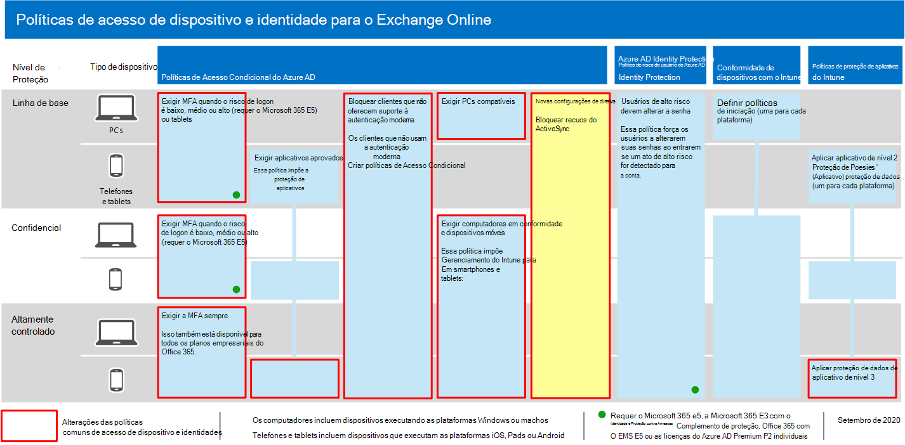

# <a name="policy-recommendations-for-securing-email"></a>Recomendações de política para proteger o email

**Aplica-se a**
- [Proteção do Exchange Online](exchange-online-protection-overview.md)
- [Plano 1 e plano 2 do Microsoft Defender para Office 365](office-365-atp.md)


Este artigo descreve como implementar as políticas de acesso de dispositivo e identidade recomendadas para proteger clientes de email e email organizacionais que suportam autenticação moderna e acesso condicional. Essa orientação se baseia nas políticas [de](identity-access-policies.md) acesso a dispositivos e identidade comum e também inclui algumas recomendações adicionais.

Essas recomendações se baseiam em três camadas diferentes de segurança e proteção que podem ser aplicadas com base na granularidade de suas **necessidades:** linha de **base,** sensível e **altamente regulamentada.** Você pode aprender mais sobre esses níveis de segurança e os sistemas operacionais de cliente recomendada, referenciados por essas recomendações na [introdução de configurações e políticas de segurança recomendadas](microsoft-365-policies-configurations.md).

Essas recomendações exigem que os usuários usem clientes de email modernos, incluindo o Outlook para iOS e Android em dispositivos móveis. O Outlook para iOS e Android oferece suporte para os melhores recursos do Office 365. Esses aplicativos móveis do Outlook também são projetados com recursos de segurança que suportam o uso móvel e trabalham em conjunto com outros recursos de segurança na nuvem da Microsoft. Para obter mais informações, consulte Perguntas frequentes [sobre o Outlook para iOS e Android.](/exchange/clients-and-mobile-in-exchange-online/outlook-for-ios-and-android/outlook-for-ios-and-android-faq)

## <a name="update-common-policies-to-include-email"></a>Atualizar políticas comuns para incluir email

Para proteger o email, o diagrama a seguir ilustra quais políticas atualizar das políticas comuns de acesso a dispositivos e identidades.

[](https://github.com/MicrosoftDocs/microsoft-365-docs/raw/public/microsoft-365/media/microsoft-365-policies-configurations/identity-access-ruleset-mail.png)

Observe a adição de uma nova política para o Exchange Online para bloquear clientes ActiveSync. Isso força o uso do Outlook mobile.

Se você incluiu o Exchange Online e o Outlook no escopo das políticas ao defini-las, você só precisará criar a nova política para bloquear clientes ActiveSync. Revise as políticas listadas na tabela a seguir e faça as adições recomendadas ou confirme se elas já estão incluídas. Cada política vincula-se às instruções de configuração associadas em Políticas comuns de acesso a [dispositivos e identidades.](identity-access-policies.md)

|Nível de Proteção|Políticas|Mais informações|
|---|---|---|
|**Baseline**|[Exigir MFA quando o risco de entrar é *médio* ou *alto*](identity-access-policies.md#require-mfa-based-on-sign-in-risk)|Incluir o Exchange Online na atribuição de aplicativos de nuvem|
||[Bloquear clientes sem suporte para a autenticação moderna](identity-access-policies.md#block-clients-that-dont-support-multi-factor)|Incluir o Exchange Online na atribuição de aplicativos de nuvem|
||[Aplicar políticas de proteção de dados do APP](identity-access-policies.md#apply-app-data-protection-policies)|Certifique-se de que o Outlook está incluído na lista de aplicativos. Certifique-se de atualizar a política para cada plataforma (iOS, Android, Windows)|
||[Exigir aplicativos aprovados e proteção de APLICATIVO](identity-access-policies.md#require-approved-apps-and-app-protection)|Incluir o Exchange Online na lista de aplicativos de nuvem|
||[Exigir PCs compatíveis](identity-access-policies.md#require-compliant-pcs-but-not-compliant-phones-and-tablets)|Incluir o Exchange Online na lista de aplicativos de nuvem|
||[Bloquear clientes ActiveSync](#block-activesync-clients)|Adicionar essa nova política|
|**Confidencial**|[Exigir MFA quando o risco de entrar é *baixo,* *médio* ou *alto*](identity-access-policies.md#require-mfa-based-on-sign-in-risk)|Incluir o Exchange Online na atribuição de aplicativos de nuvem|
||[Exigir PCs e *dispositivos* móveis compatíveis](identity-access-policies.md#require-compliant-pcs-and-mobile-devices)|Incluir o Exchange Online na lista de aplicativos de nuvem|
|**Altamente controlado**|[*Sempre* exigir MFA](identity-access-policies.md#require-mfa-based-on-sign-in-risk)|Incluir o Exchange Online na atribuição de aplicativos de nuvem|
|

## <a name="block-activesync-clients"></a>Bloquear clientes ActiveSync

Essa política impede que os clientes ActiveSync ignorem outras políticas de Acesso Condicional. A configuração de política só se aplica a clientes ActiveSync. Ao selecionar **[Exigir política de proteção de aplicativo,](/azure/active-directory/conditional-access/concept-conditional-access-grant#require-app-protection-policy)** essa política bloqueia clientes ActiveSync. Detalhes sobre a criação dessa política podem ser encontrados em Exigir política de proteção de aplicativos para acesso [a aplicativos na nuvem com Acesso Condicional](/azure/active-directory/conditional-access/app-protection-based-conditional-access).

- Siga "Etapa 2: Configurar uma política de Acesso Condicional do Azure AD para o Exchange Online com o ActiveSync (EAS)" no Cenário 1: os aplicativos do [Office 365](/azure/active-directory/conditional-access/app-protection-based-conditional-access#scenario-1-office-365-apps-require-approved-apps-with-app-protection-policies)exigem aplicativos aprovados com políticas de proteção de aplicativos , o que impede que os clientes Exchange ActiveSync aproveitando a autenticação básica se conectem ao Exchange Online.

Você também pode usar políticas de autenticação para [desabilitar a autenticação básica](/exchange/clients-and-mobile-in-exchange-online/disable-basic-authentication-in-exchange-online), o que força todas as solicitações de acesso do cliente a usar a autenticação moderna.

## <a name="limit-access-to-exchange-online-from-outlook-on-the-web"></a>Limitar o acesso ao Exchange Online a partir do Outlook na Web

Você pode restringir a capacidade dos usuários de baixar anexos do Outlook na Web em dispositivos umnanaged. Os usuários nesses dispositivos podem exibir e editar esses arquivos usando o Office Online sem vazar e armazenar os arquivos no dispositivo. Você também pode impedir que os usuários veja anexos em um dispositivo não-manado.

Estas são as etapas:

1. [Conecte-se a uma sessão do PowerShell Remoto do Exchange Online.](/powershell/exchange/exchange-online/connect-to-exchange-online-powershell/connect-to-exchange-online-powershell)
2. Se você ainda não tiver uma política de caixa de correio OWA, crie uma com o cmdlet [New-OwaMailboxPolicy.](/powershell/module/exchange/new-owamailboxpolicy)
3. Se você quiser permitir a exibição de anexos, mas sem download, use este comando:

   ```powershell
   Set-OwaMailboxPolicy -Identity Default -ConditionalAccessPolicy ReadOnly
   ```

4. Se você quiser bloquear anexos, use este comando:

   ```powershell
   Set-OwaMailboxPolicy -Identity Default -ConditionalAccessPolicy ReadOnlyPlusAttachmentsBlocked
   ```

5. No portal do Azure, crie uma nova política de Acesso Condicional com essas configurações:

   **Atribuições** \> **Usuários e grupos**: Selecione usuários e grupos apropriados para incluir e excluir.

   **Atribuições** \> **Aplicativos ou ações na nuvem** \> **Aplicativos de nuvem** \> **Incluir** \> **Selecionar aplicativos**: Selecionar **Office 365 Exchange Online**

   **Controles de acesso** \> **Sessão**: Selecione **Usar restrições impostas pelo aplicativo**

## <a name="require-that-ios-and-android-devices-must-use-outlook"></a>Exigir que dispositivos iOS e Android devem usar o Outlook

Para garantir que os usuários de dispositivos iOS e Android só possam acessar conteúdo de trabalho ou de estudante usando o Outlook para iOS e Android, você precisa de uma política de Acesso Condicional destinado a esses usuários em potencial.

Consulte as etapas para configurar essa política em Gerenciar o acesso à colaboração de mensagens usando [o Outlook para iOS e Android.]( https://docs.microsoft.com/mem/intune/apps/app-configuration-policies-outlook#apply-conditional-access)

## <a name="set-up-message-encryption"></a>Configurar criptografia de mensagens

Com os novos recursos de Criptografia de Mensagens do Office 365 (OME), que aproveitam os recursos de proteção na Proteção de Informações do Azure, sua organização pode compartilhar facilmente emails protegidos com qualquer pessoa em qualquer dispositivo. Os usuários podem enviar e receber mensagens protegidas com outras organizações do Microsoft 365, bem como não clientes usando Outlook.com, Gmail e outros serviços de email.

Para obter mais informações, consulte Configurar novos recursos de Criptografia de Mensagens do [Office 365.](../../compliance/set-up-new-message-encryption-capabilities.md)

## <a name="next-steps"></a>Próximas etapas


Configurar políticas de Acesso Condicional para:

- [Microsoft Teams](teams-access-policies.md)
- [SharePoint](sharepoint-file-access-policies.md)