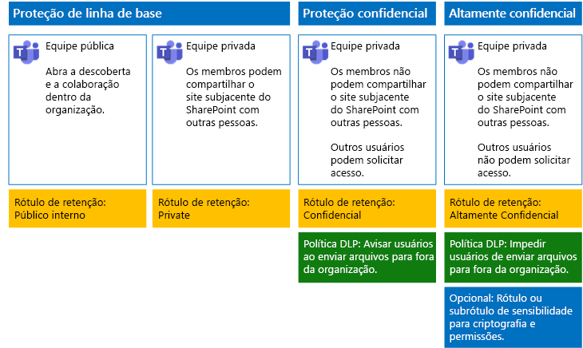

# Proteger arquivos no Microsoft Teams

Este artigo fornece recomendações para configurar equipes no Microsoft Teams e seus sites subjacentes do SharePoint para obter uma proteção de arquivo que equilibre segurança com facilidade de colaboração. Este artigo define quatro configurações diferentes, começando com um site público dentro de sua organização com as políticas de compartilhamento abertas. Cada configuração adicional representa uma etapa significativa na proteção, mas a capacidade de acessar e colaborar em arquivos armazenados no Teams é reduzida ao conjunto de membros de equipe relevantes. Use essas recomendações como um ponto de partida e ajuste as configurações para atender às necessidades da sua organização.

As configurações nesse artigo se alinham às recomendações da Microsoft para três níveis de proteção de dados, identidades e dispositivos:

- Proteção de linha de base

- Proteção confidencial

- Proteção altamente confidencial

Para obter mais informações sobre essas camadas e recursos recomendados para cada camada, consulte os recursos a seguir.

- [Proteção de identidade e dispositivo para o Office 365](https://docs.microsoft.com/office365/enterprise/microsoft-cloud-it-architecture-resources#identity-and-device-protection-for-office-365)

- [Soluções para proteção de arquivos do Office 365](https://docs.microsoft.com/office365/enterprise/microsoft-cloud-it-architecture-resources#file-protection-solutions-in-office-365)

## Visão geral da funcionalidade

As recomendações para equipes protegidas traçam uma variedade de recursos do Microsoft 365. A ilustração a seguir mostra as configurações recomendadas.

Conforme ilustrado:

- A proteção de linha de base inclui uma equipe pública e uma privada. As equipes públicas podem ser descobertas e acessadas por qualquer pessoa na organização. As equipes privadas podem ser descobertas e acessadas apenas por membros da equipe. Ambas as configurações permitem o compartilhamento do site subjacente do SharePoint no qual os arquivos são armazenados fora do grupo de equipes.

- As equipes de proteção confidencial e altamente confidencial são equipes privadas nas quais o compartilhamento e a solicitação de acesso ao site subjacente são limitados.

- [Rótulos de retenção](../../compliance/labels.md) oferecem uma maneira para classificar os sites subjacentes do SharePoint. Cada um dos sites subjacentes do SharePoint é configurado para aplicar rótulos automaticamente aos arquivos nas bibliotecas de documentos com um rótulo de retenção padrão. Correspondentes às quatro configurações da equipe, os rótulos nesse exemplo são Público Interno, Privado, Confidencial e Altamente Confidencial. Os usuários podem alterar os rótulos nos arquivos individuais, mas essa configuração garante que todos os arquivos recebam um rótulo padrão.

- As políticas DLP [(prevenção de perda de dados)](../../compliance/data-loss-prevention-policies.md) são configuradas para os rótulos de retenção Confidenciais e Altamente Confidenciais para avisar ou impedir os usuários quando tentam enviar esses tipos de arquivos para fora da organização.

- Se for necessário para sua situação, você pode usar [rótulos de confidencialidade](../../compliance/sensitivity-labels.md)para proteger arquivos altamente confidenciais com criptografia e permissões. Clientes da Proteção de Informações do Azure pode, usar  Rótulos da Proteção de Informações do Azure no centro de conformidade do Microsoft 365 e os rótulos serão sincronizados com o portal do Azure, caso seja escolhido executar a configuração adicional ou avançada. Os Rótulos de Proteção de Informações do Azure e os rótulos de confidencialidade do Office 365 são totalmente compatíveis entre si. Isso significa que, por exemplo, se você tiver um conteúdo marcado pela Proteção de Informações do Azure, não precisará reclassificar ou rotular novamente seu conteúdo. Nem todos os clientes precisam desse nível de proteção.

## Configurações de toda a organização para o SharePoint e o OneDrive

O SharePoint Online e OneDrive incluem configurações para toda a organização que afetam todos os sites e usuários. Algumas dessas configurações também podem ser ajustadas no nível do site para serem mais restritivas (mas não menos). Esta seção discute as configurações para todo o locatário que afetam a segurança e a colaboração.

### Compartilhamento

Para esta solução, recomendamos as seguintes configurações para toda a organização:

- Mantenha a política de configuração padrão que permite todo o compartilhamento com todos os tipos de conta, incluindo o compartilhamento anônimo.

- Configure os links anônimos para expirar, se desejado.

- Altere o tipo de link padrão para o compartilhamento para Interno. Isso ajuda a impedir o vazamento acidental de dados fora da sua organização.

Embora possa parecer contraintuitivo permitir o compartilhamento externo, essa abordagem fornece mais controle sobre o compartilhamento de arquivo em comparação com enviar os arquivos por email. O SharePoint e o Outlook trabalham juntos para fornecer uma colaboração segura nos arquivos.

- Por padrão, o Outlook compartilha um link para um arquivo em vez de enviar o arquivo por email.

- O SharePoint e OneDrive facilitam o compartilhamento de links para arquivos com colaboradores que estão dentro e fora da sua organização

Você também tem controles para ajudar a controlar o compartilhamento externo. Por exemplo, você pode:

- Desabilitar um link de convidado anônimo.

- Revogar o acesso de usuário para um site.

- Ver quem tem acesso a um documento ou um site específico.

- Configurar os links de compartilhamento anônimos para expirarem (configuração de locatário).

- Limitar quem pode compartilhar fora da sua organização (configuração de locatário).

### Usar o compartilhamento externo junto com a DLP (prevenção de perda de dados)

Se você não permitir o compartilhamento externo, os usuários com uma empresa encontrarão métodos e ferramentas alternativas. A Microsoft recomenda que você combine o compartilhamento externo com políticas DLP para proteger os arquivos confidenciais e altamente confidenciais.

### Configurações de acesso de dispositivo

As configurações de acesso de dispositivo do SharePoint e do OneDrive permitem que você determine se o acesso é limitado apenas ao navegador (não é possível baixar os arquivos) ou se o acesso está bloqueado. Para obter informações, consulte [Controlar o acesso de dispositivos gerenciados](https://docs.microsoft.com/sharepoint/control-access-from-unmanaged-devices).

Para usar as configurações de acesso de dispositivo com as políticas de acesso condicional recomendadas no Azure Active Directory, confira [Recomendações de política para proteger os arquivos e sites do SharePoint](https://docs.microsoft.com/microsoft-365/enterprise/sharepoint-file-access-policies).

Visite essas configurações para decidir se deseja alterar as configurações padrão para sites do OneDrive. Atualmente, as configurações de acesso de compartilhamento e de dispositivo estão duplicadas do Centro de administração do SharePoint e se aplicam a ambos os ambientes.

## Configuração de site do Teams e do SharePoint

A tabela a seguir resume a configuração para cada uma das equipes e do site subjacente do SharePoint descritos anteriormente neste artigo. Use essas configurações como recomendações de ponto de partida e ajuste as configurações e os tipos de site para atender às necessidades da sua organização. Nem toda organização precisa de todos os tipos de equipe. Somente um pequeno número de organizações requer equipes com a proteção altamente confidencial.

||||||
|:-----|:-----|:-----|:-----|:-----|
||**Proteção de linha de base nº 1**|**Proteção de linha de base nº 2**|**Proteção confidencial**|**Altamente confidencial**|
|Descrição|Equipe pública com descoberta aberta e colaboração dentro da organização.|Equipe privada com compartilhamento do site subjacente do SharePoint permitido fora do grupo.|Equipe privada, mas o compartilhamento do site subjacente do SharePoint é permitido apenas aos membros do site. A DLP avisa os usuários quando tenta enviar arquivos fora da organização.|Equipe privada com rótulos de confidencialidade para criptografia de arquivos e permissões que acompanham o arquivo. A DLP impede que os usuários enviem arquivos fora da organização.|
|Site de equipe público ou privado|Público|Private|Private|Private|
|Quem tem acesso?|Todas as pessoas na organização, incluindo usuários B2B.|Membros do site somente. Outros usuários podem solicitar acesso.|Membros da equipe somente. Outras pessoas podem solicitar acesso ao site subjacente, que é aprovado pelo proprietário da equipe.|Somente membros. Outras pessoas não podem solicitar acesso ao site subjacente.|
|Controles de compartilhamento de nível de site|Compartilhamento permitido com qualquer pessoa. Configurações padrão.|Compartilhamento permitido com qualquer pessoa. Configurações padrão.|Os membros não podem compartilhar o acesso ao site.   Os não membros podem solicitar acesso ao site, mas essas solicitações precisam ser atendidas por um proprietário do grupo da equipe.|Os membros não podem compartilhar o acesso ao site.   Os não membros não podem solicitar acesso ao site ou conteúdo.|
|Controles de acesso de dispositivo de nível de site|Sem controles adicionais.|Sem controles adicionais.|Impede que os usuários baixem arquivos para os dispositivos incompatíveis ou com domínio não associado. Isso permite o acesso somente para navegador de todos os outros dispositivos.|Bloquear o download de arquivos para os dispositivos incompatíveis ou com domínio não associado.|
|Rótulos de retenção|Público interno|Private|Confidencial|Altamente Confidencial|
|Políticas DLP|||Avisar os usuários quando enviar arquivos que são rotulados como Confidencial para fora da organização.   Para bloquear o compartilhamento externo de tipos de dados confidenciais, como números de cartão de crédito ou outros dados pessoais, você pode configurar políticas DLP adicionais para esses tipos de dados (incluindo tipos de dados personalizados que você configurar).|Impedir que os usuários enviem arquivos rotulados como altamente confidenciais para fora da organização. Permitir que os usuários substituam isso fornecendo justificativa, incluindo com quem eles estão compartilhando o arquivo.|
|Rótulos de confidencialidade||||Usar os rótulos de confidencialidade para criptografar e conceder permissões aos arquivos. Essa proteção acompanha os arquivos caso eles sejam vazados do site subjacente do SharePoint.|

Para as etapas de implantação dos quatro tipos diferentes de equipes nesta solução, confira [Implantar equipes para três camadas de proteção dos arquivos](deploy-teams-three-tiers.md).

## Rótulos de retenção do Office 365

O uso dos rótulos de retenção é recomendado para ambientes com os dados confidenciais. Depois de configurar e publicar rótulos de retenção:

- Você pode aplicar um rótulo padrão a uma biblioteca de documentos no site subjacente do SharePoint para uma equipe, para que todos os documentos na seção **Arquivos** da equipe obtenham o rótulo padrão.

- Você pode aplicar automaticamente rótulos ao conteúdo que corresponder a condições específicas.

- Você pode aplicar políticas DLP que se baseiem nos rótulos de retenção.

- As pessoas em sua organização podem aplicar um rótulo manualmente ao conteúdo no Outlook na Web, no Outlook 2010 e posterior, no OneDrive, no SharePoint e em grupos do Office 365. Os usuários geralmente sabem melhor o tipo de conteúdo com o qual estão trabalhando, portanto, eles podem classificá-lo e aplicar a política DLP apropriada.

Conforme ilustrado, essa solução inclui a criação dos seguintes rótulos de retenção:

- Altamente confidencial

- Confidencial

- Private

- Público interno

Esses rótulos são mapeados para os sites recomendados nas ilustrações e gráficos anteriormente neste artigo. Esta solução recomenda a configuração de políticas DLP para ajudar a evitar vazamento de arquivos rotulados como Confidenciais e Altamente Confidenciais.

Para as etapas de configuração de rótulos e políticas DLP de retenção nesta solução, confira [Proteger os arquivos nas equipes com rótulos de retenção e DLP](deploy-teams-retention-DLP.md).

## Rótulos de confidencialidade

Se for necessário para o seu cenário de segurança, você pode usar rótulos de confidencialidade para aplicar proteções que acompanham os arquivos onde quer que estejam. Os Rótulos de Proteção de Informações do Azure e os Rótulos de confidencialidade no Centro de conformidade do Microsoft 365 são os mesmos. Para esta solução, recomendamos que você use rótulo de confidencialidade ou um sub-rótulo para criptografar e conceder permissões a arquivos que precisam ser protegidos com o mais alto nível de segurança.

Para saber mais, confira [Visão geral de rótulos de confidencialidade](../../compliance/sensitivity-labels.md).

Para as etapas de configuração de rótulos de confidencialidade nesta solução, confira [Proteger os arquivos nas equipes com rótulos de confidencialidade](deploy-teams-sensitivity-labels.md).

## Confira também

[Adoção da nuvem e de soluções híbridas](https://docs.microsoft.com/office365/enterprise/cloud-adoption-and-hybrid-solutions)
