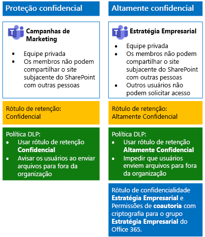
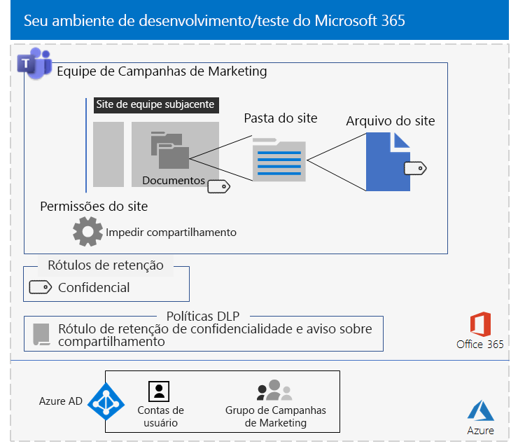
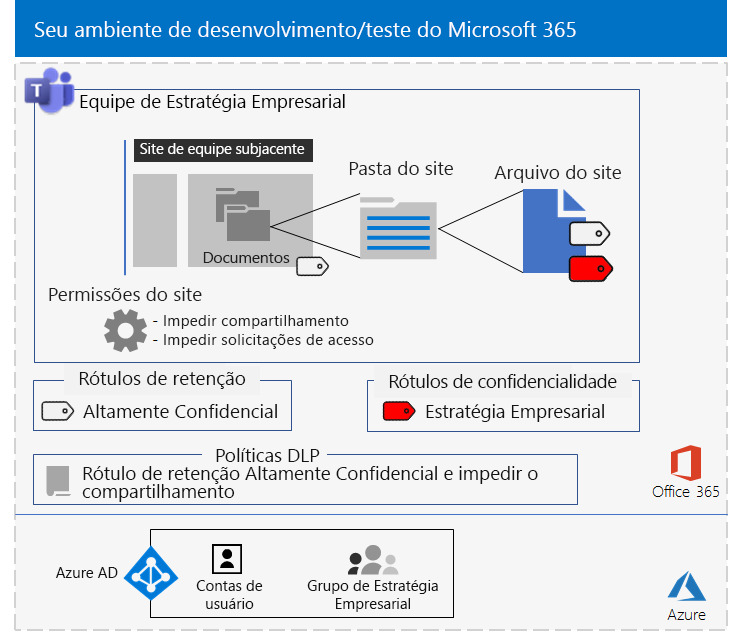

# <a name="secure-teams-for-files-in-a-devtest-environment"></a>Protege o Teams para arquivos em um ambiente de desenvolvimento/teste

Este artigo fornece instruções passo a passo para criar um ambiente de desenvolvimento e teste que inclui as equipes contextuais e altamente confidenciais para a solução [arquivos seguros no Microsoft Teams](secure-files-in-teams.md).



Use esse ambiente de desenvolvimento/teste para testar e ajustar as configurações de suas necessidades específicas antes de implantar esses tipos de equipes na produção.

## <a name="phase-1-build-out-your-microsoft-365-enterprise-test-environment"></a>Fase 1: Criar o ambiente de teste do Microsoft 365 Enterprise

Se você deseja apenas testar equipes confidenciais e altamente confidenciais de uma maneira simples com os requisitos mínimos, siga as instruções em [Configuração de base leve](https://docs.microsoft.com/microsoft-365/enterprise/lightweight-base-configuration-microsoft-365-enterprise).

Caso pretenda testar equipes confidenciais e altamente confidenciais em uma empresa simulada, siga as instruções em [sincronização de hash de senha](https://docs.microsoft.com/microsoft-365/enterprise/password-hash-sync-m365-ent-test-environment).

>[!Note]
>Testar as equipes confidenciais e altamente confidenciais não exige o ambiente de teste corporativo simulado, que inclui uma intranet simulada conectada à Internet e a sincronização de diretórios para uma floresta dos Serviços de Domínio do Active Directory (AD DS). Ele é fornecido aqui como uma opção para que você possa testar equipes confidenciais e altamente confidenciais e experimentá-las em um ambiente que representa uma organização típica.
>

## <a name="phase-2-create-and-configure-your-azure-active-directory-ad-groups-and-users"></a>Fase 2: criar e configurar seus grupos e usuários do Azure Active Directory (AD)

Nesta fase, você cria e configura os usuários e grupos do Azure AD para sua organização fictícia.

Primeiro, crie um conjunto de grupos para uma organização comum com o portal do Azure.

1. Crie uma guia separada no navegador e vá para o Portal do Azure[https://portal.azure.com](https://portal.azure.com). Se necessário, entre com as credenciais da conta de administrador global da sua assinatura paga ou de avaliação do Microsoft 365 E5.

2. No Portal do Azure, clique em **Azure Active Directory > Grupos**.

3. Na folha **Grupos – Todos os grupos**, clique em **+ Novo grupo**.

4. Na folha **Grupo**:

   - Selecione **Segurança** em **Tipo de grupo**.

   - Digite **Pacote C** em **Nome**.

   - Escolha **Atribuído** em **Tipo de Associação**.

5. Clique em **Criar** e, em seguida, feche a folha **Grupo**.

6. Repita as etapas 3-5 para um novo grupo chamado **equipe de marketing**.

Em seguida, você configura o licenciamento automático para que os membros dos seus grupos recebam licenças automaticamente para suas assinaturas do Microsoft 365 e EMS.

1. No Portal do Azure, clique em **Azure Active Directory > Licenças > Todos os produtos**.

2. Na lista, selecione **Microsoft 365 Enterprise E5**e, em seguida, clique em **atribuir**.

3. Na folha **Atribuir licença**, clique em **Usuários e grupos**.

4. Na lista de grupos, selecione o seguinte:

   - Pacote C

   - Equipe de marketing

5. Clique em **Selecionar** e clique em **Atribuir**.

6. Feche a guia do Portal do Azure no navegador.

Em seguida, conecte-se ao módulo [PowerShell do Azure Active Directory para Graph](https://docs.microsoft.com/office365/enterprise/powershell/connect-to-office-365-powershell#connect-with-the-azure-active-directory-powershell-for-graph-module).

Preencha o nome da organização, seu local e uma senha comum. Execute esses comandos no prompt de comando do PowerShell ou no ISE (Ambiente de Script Integrado) para criar contas de usuário e adicioná-las aos grupos:

```powershell
$orgName="<organization name, such as contoso for the contoso.onmicrosoft.com trial subscription domain name>"
$location="<the ISO ALPHA2 country code, such as US for the United States>"
$commonPassword="<common password for all the new accounts>"

$PasswordProfile=New-Object -TypeName Microsoft.Open.AzureAD.Model.PasswordProfile
$PasswordProfile.Password=$commonPassword

$groupName="C-Suite"
$userNames=@("CEO","CFO","CIO")
$groupID=(Get-AzureADGroup | Where { $_.DisplayName -eq $groupName }).ObjectID
ForEach ($element in $userNames){
New-AzureADUser -DisplayName $element -PasswordProfile $PasswordProfile -UserPrincipalName ($element + "@" + $orgName + ".onmicrosoft.com") -AccountEnabled $true -MailNickName $element -UsageLocation $location
Add-AzureADGroupMember -RefObjectId (Get-AzureADUser | Where { $_.DisplayName -eq $element }).ObjectID -ObjectId $groupID
}
$groupName="Marketing staff"
$userNames=@("Marketing1", "Marketing2")
$groupID=(Get-AzureADGroup | Where { $_.DisplayName -eq $groupName }).ObjectID
ForEach ($element in $userNames){
New-AzureADUser -DisplayName $element -PasswordProfile $PasswordProfile -UserPrincipalName ($element + "@" + $orgName + ".onmicrosoft.com") -AccountEnabled $true -MailNickName $element -UsageLocation $location
Add-AzureADGroupMember -RefObjectId (Get-AzureADUser | Where { $_.DisplayName -eq $element }).ObjectID -ObjectId $groupID
}
```

> [!NOTE]
> O uso de uma senha comum aqui é para a automação e facilidade de configuração para um ambiente de desenvolvimento/teste. Obviamente, isso é recomendado para assinaturas de produção.

Use essas etapas para verificar se o licenciamento baseado em grupo está funcionando corretamente.

1. Na guia **Microsoft Office Home** do navegador, clique no bloco **Administração**.

2. Na nova guia **Centro de administração do Microsoft 365** do seu navegador, clique em **Usuários**.

3. Na lista de usuários, clique em **CEO**.

4. No painel que lista as propriedades da conta de usuário **CEO**, verifique se ele recebeu a atribuição das licenças **Microsoft 365 Enterprise E5** (em ** Licenças de produto**).

## <a name="phase-3-create-retention-labels"></a>Fase 3: crie rótulos de retenção

Nesta fase, você deve criar os rótulos para os diferentes níveis de segurança para as pastas de documentos do site de SharePoint subjacentes.

1. Acesse o [portal de conformidade do Microsoft 365](https://compliance.microsoft.com) com sua conta de administrador global.

2. Na guia **Início - Conformidade do Microsoft 365** do navegador, clique em **Classificações > Rótulos**.

3. Clique em **Rótulos de retenção > Criar um rótulo**.

4. No painel **Atribuir nome ao seu rótulo** digite **Confidenciais** em **Atribuir nome ao seu rótulo**, e clique em **Avançar**.

5. No painel **descritores de plano de arquivo**, clique em **próximo**.

6. No painel **configurações de etiqueta**, se necessário, defina **retenção** para **no**e, em seguida, clique em **próximo**.

7. No painel **Revise suas configurações**, clique em **Criar o rótulo**.

8. Repita as etapas 3-7 para um rótulo de retenção adicional chamado **altamente confidencial**.

9. No painel **Início > Rótulos**, clique em **Publicar rótulos**.

10. No painel **Escolher rótulos para publicar**, clique em **Escolher rótulos para publicar**.

11. No painel **Escolher rótulos**, clique em **Adicionar** e selecione todos os quatro rótulos.

12. Clique em **Concluído**.

13. No painel **Escolher rótulos para publicar**, clique em **Avançar**.

14. No painel **Escolher locais**, clique em **Avançar**.

15. No painel **Atribuir um nome à política**, digite **Organização de exemplo** em **Nome** e clique em **Avançar**.

16. No painel **Examine as configurações**, clique em **Publicar rótulos** e clique em **Fechar**.

## <a name="phase-4-create-your-teams"></a>Fase 4: criar suas equipes

Nesta fase, você criará e configurará equipes confidenciais e altamente confidenciais para a sua organização de exemplo.

### <a name="sensitive-team-for-marketing-campaigns"></a>Equipe sensível a campanhas de marketing

Para criar uma equipe de nível confidencial para os membros do grupo de marketing colaborarem em campanhas de marketing contínuas:

1. [Criar uma nova equipe privada](https://support.microsoft.com/office/174adf5f-846b-4780-b765-de1a0a737e2b) com o nome **campanhas de Marketing**.
2. Abra a equipe de **Campanhas de marketing**.
3. Na barra de ferramentas da equipe, clique em **Arquivos**.
4. Clique nas reticências e em **Abrir no SharePoint**.
5. Na barra de ferramentas do site do SharePoint subjacente, clique no ícone de configurações e, em seguida, clique em **Permissões do site**.
6. No painel **Permissões do site**, em **Configurações de Compartilhamento**, clique em **Alterar configurações de compartilhamento**.
7. Em **Permissões de compartilhamento**, selecione **Somente proprietários do site podem compartilhar arquivos, pastas e o site** e clique em **Salvar**.

Em seguida, configure a pasta de documentos do site de equipe Campanhas de marketing para o rótulo Confidencial.

1. Na guia **Campanhas de marketing – Página Inicial** do navegador, clique em **Documentos**.
2. Clique no ícone de configurações e clique em **Configurações de biblioteca**.
3. Em **Permissões e Gerenciamento**, clique em **Aplicar o rótulo aos itens nessa biblioteca**.
4. Em **Configurações – Aplicar Rótulo**, escolha **Confidencial** e clique em **Salvar**.

Em seguida, configure uma política DLP (prevenção de perda de dados) que notifica os usuários quando eles compartilham um documento em um site de equipe do SharePoint com o rótulo Confidencial, que inclui o site de Campanhas de marketing, fora da organização.

1. Acesse o [portal de conformidade do Microsoft 365](https://compliance.microsoft.com/) com sua conta de administrador global.

2. Na nova guia **conformidade do Microsoft 365** em seu navegador, clique em**Políticas > Prevenção de perda de dados**.

3. No painel **Início > Prevenção de perda de dados**, clique em **Criar uma política**.

4. No painel **Iniciar com um modelo ou criar uma política personalizada**, clique em **Personalizado** e clique em **Avançar**.

5. No painel **Atribuir um nome à política**, digite **Sites do SharePoint de rótulo Confidencial** em **Nome** e clique em **Avançar**.

6. No painel **Escolher locais**, clique em **Deixe-me escolher locais específicos** e, em seguida, clique em **Avançar**.

7. Na lista de locais, desabilite os locais **email do Exchange**, **contas do OneDrive** e **Mensagens do canal e do chat do Teams** e, em seguida, clique em **Avançar**.

8. No painel **Personalizar o tipo de conteúdo que você deseja proteger**, clique em **Editar**.

9. No painel **Escolher os tipos de conteúdo para proteger**, clique em **Adicionar** na caixa suspensa e, em seguida, clique em **Rótulos de retenção**.

10. No painel **Rótulos de retenção**, clique em ** Adicionar**, selecione o rótulo **Confidencial**, clique em **Adicionar** e, em seguida, clique em **Concluído**.

11. No painel **Escolher os tipos de conteúdo para proteger**, clique em **Salvar**.

12. No painel **personalizar um tipo de conteúdo que deseja proteger**, clique em **próxima**.

13. No painel **O que deseja fazer se detectarmos informações confidenciais?**, clique em **Personalizar a dica e o email**.

14. No painel **Personalizar dicas de política e notificações de email**, clique em **Personalizar o texto da dica da política**.

15. Na caixa de texto, digite ou cole o seguinte:

    Para compartilhar com um usuário de fora da organização, baixe o arquivo e abra-o. Clique em Arquivo, em seguida, Proteger Documento e Criptografar com Senha e especifique uma senha forte. Envie a senha em um email separado ou outros meios de comunicação.

16. Clique em **OK**.

17. No painel **O que deseja fazer se detectarmos informações confidenciais?**, clique em **Avançar**.

18. No painel **Deseja ativar a política ou testar primeiro?**, clique em **Sim** para ativá-la imediatamente e clique em **Avançar**.

19. No painel **Examine as configurações**, clique em **Criar** e em **Fechar**.

Esta é a configuração resultante da equipe de campanhas de marketing.



### <a name="company-strategy-team-site"></a>Site de equipe de estratégia empresarial

Para criar uma equipe de nível altamente confidencial para que os membros da equipe de liderança sênior colabore na estratégia da empresa:

1. [Criar uma nova equipe privada](https://support.microsoft.com/office/174adf5f-846b-4780-b765-de1a0a737e2b) com o nome **Estratégia empresarial**.
2. Abra a equipe de **Estratégia Empresarial**.
3. Na barra de ferramentas da equipe, clique em **Arquivos**.
4. Clique nas reticências e em **Abrir no SharePoint**.
5. Na barra de ferramentas do site do SharePoint subjacente, clique no ícone de configurações e, em seguida, clique em **Permissões do site**.
6. No painel **Permissões do site**, em **Configurações de Compartilhamento**, clique em **Alterar configurações de compartilhamento**.
7. Em **Permissões de compartilhamento**, **Somente proprietários do site podem compartilhar arquivos, pastas e o site**.
8. Desative **Permitir solicitações de acesso** e clique em **Salvar**.

Em seguida, configure a pasta de documentos do site subjacente do SharePoint da estratégia empresarial para o rótulo Altamente Confidencial.

1. Na guia **Estratégia empresarial – Página Inicial** do navegador, clique em **Documentos**.
2. Clique no ícone de configurações e clique em **Configurações de biblioteca**.
3. Em **Permissões e Gerenciamento**, clique em **Aplicar o rótulo aos itens nessa biblioteca**.
4. Em **Configurações – Aplicar Rótulo**, escolha **Altamente Confidencial** e clique em **Salvar**.

Em seguida, configure uma política de DLP que bloqueie os usuários quando eles compartilham um documento em um site subjacente do SharePoint com o rótulo Altamente Confidencial, que inclui o site de Estratégia Empresarial, fora da organização.

1. Acesse o [portal de conformidade do Microsoft 365](https://compliance.microsoft.com/) com seu administrador global.

2. Na nova guia **conformidade do Microsoft 365** em seu navegador, clique em**Políticas > Prevenção de perda de dados**.

3. No painel **Início > Prevenção de perda de dados**, clique em **Criar uma política**.

4. No painel **Iniciar com um modelo ou criar uma política personalizada**, clique em **Personalizado** e clique em **Avançar**.

5. No painel **Atribuir um nome à política**, digite **Sites do SharePoint de rótulo Altamente Confidencial** em **Nome** e clique em **Avançar**.

6. No painel **Escolher locais**, clique em **Deixe-me escolher locais específicos** e, em seguida, clique em **Avançar**.

7. Na lista de locais, desabilite os locais **email do Exchange**, **contas do OneDrive** e **Mensagens do canal e do chat do Teams** e, em seguida, clique em **Avançar**.

8. No painel **Personalizar o tipo de conteúdo que você deseja proteger**, clique em **Editar**.

9. No painel **Escolher os tipos de conteúdo para proteger**, clique em **Adicionar** na caixa suspensa e, em seguida, clique em **Rótulos de retenção**.

10. No painel **Rótulos de retenção**, clique em **Adicionar**, selecione o rótulo **Altamente Confidencial**, clique em **Adicionar** e, em seguida, clique em **Concluído**.

11. No painel **Escolher os tipos de conteúdo para proteger**, clique em **Salvar**.

12. No painel **personalizar um tipo de conteúdo que deseja proteger**, clique em **próxima**.

13. No painel **O que deseja fazer se detectarmos informações confidenciais?**, clique em **Personalizar a dica e o email**.

14. No painel **Personalizar dicas de política e notificações de email**, clique em **Personalizar o texto da dica da política**.

15. Na caixa de texto, digite ou cole o seguinte:

    Para compartilhar com um usuário de fora da organização, baixe o arquivo e abra-o. Clique em Arquivo, em seguida, Proteger Documento e Criptografar com Senha e especifique uma senha forte. Envie a senha em um email separado ou outros meios de comunicação.

16. Clique em **OK**.

17. No painel **Deseja ativar a política ou testar primeiro?**, clique em **Sim** para ativá-la imediatamente e clique em **Avançar**.

18. No painel **Deseja ativar a política ou testar primeiro?**, clique em **Sim** para ativá-la imediatamente e clique em **Avançar**.

19. No painel **Examine as configurações**, clique em **Criar** e em **Fechar**.

Use [estas instruções](https://docs.microsoft.com/microsoft-365/compliance/encryption-sensitivity-labels) para configurar um rótulo confidencial com as seguintes configurações:

- O nome do rótulo é Estratégia empresarial
- A criptografia está ativada
- O grupo de estratégia empresarial tem permissões de Coautoria.

Depois de criar, publique o novo rótulo. Se entrar como um membro do grupo de estratégias empresarial, você verá o novo rótulo na opção confidencialidade na barra de ferramentas página inicial do Word, Excel e PowerPoint. Selecione o rótulo de estratégia empresarial na opção confidencialidade para atribuir o rótulo a um arquivo.

Esta é a configuração resultante da equipe de estratégia empresarial.



Os arquivos na seção documentos do site da estratégia empresarial subjacente do SharePoint recebem o rótulo de retenção altamente confidencial e estão sujeitos à política de DLP configurada. Os arquivos também podem ter o rótulo diferencial da estratégia empresarial atribuído.

## <a name="next-step"></a>Próxima etapa

Quando você estiver pronto para a implantação da produção, consulte [Arquivos seguros no Microsoft Teams](secure-files-in-teams.md) para obter informações detalhadas e links para os artigos de implantação passo a passo.

## <a name="see-also"></a>Confira também

[Adoção da nuvem e de soluções híbridas](https://docs.microsoft.com/office365/enterprise/cloud-adoption-and-hybrid-solutions)
