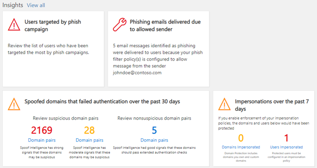

# Painel de segurança

## Funções básicas e como abrir o painel de segurança

O [centro de conformidade & segurança](../../compliance/go-to-the-securitycompliance-center.md) permite que sua organização gerencie a proteção e a conformidade dos dados. Supondo que você tenha as permissões necessárias, o painel de segurança permite que você revise o status da proteção contra ameaças, bem como o modo de exibição e agir nos alertas de segurança.

Assista ao vídeo para obter uma visão geral e leia este artigo para saber mais.

> [!VIDEO https://www.microsoft.com/videoplayer/embed/RE1VV3o]

Dependendo da assinatura que a sua organização inclui, o painel de segurança inclui vários widgets, como Resumo de gerenciamento de ameaças, status de proteção contra ameaças, detecções semanais globais de ameaças, malware e muito mais, conforme descrito nas seções a seguir.

Para exibir o painel de segurança, no [centro de conformidade & segurança](../../compliance/go-to-the-securitycompliance-center.md), vá para o painel **Gerenciamento de ameaças** \> **Dashboard**.

> [!NOTE]
> Você deve ser um administrador global, um administrador de segurança ou um leitor de segurança para exibir o painel de segurança. Alguns widgets exigem permissões adicionais para exibir. Para saber mais, confira [permissões no centro de conformidade de & de segurança](permissions-in-the-security-and-compliance-center.md).

## Resumo de gerenciamento de ameaças

O widget Resumo de gerenciamento de ameaças informa rapidamente como sua organização foi protegida contra ameaças nos últimos sete (7) dias.

As informações que você verá no Resumo de gerenciamento de ameaças depende do que a assinatura inclui. A tabela a seguir descreve quais informações estão incluídas para o Office 365 E3 e o Office 365 e5.

|Office 365 E3|Office 365 E5|
|---|---|
|Mensagens de malware bloqueadas Mensagens de phishing bloqueadas Mensagens relatadas por usuários    |Mensagens de malware bloqueadas Mensagens de phishing bloqueadas Mensagens relatadas por usuários Malware de dia zero bloqueado Mensagens de phishing avançadas detectadas URLs mal-intencionadas bloqueadas|

Para exibir ou acessar o widget Resumo de gerenciamento de ameaças, você deve ter permissões para exibir relatórios de proteção avançada contra ameaças. Para saber mais, veja [quais permissões são necessárias para exibir os relatórios ATP?](view-reports-for-atp.md#what-permissions-are-needed-to-view-the-atp-reports)

## Status de proteção contra ameaças

O widget status de proteção contra ameaças mostra a eficácia da proteção contra ameaças com uma visão detalhada e de tendências de phishing e malware.

Os detalhes dependem de sua assinatura do Microsoft 365 incluir o [Exchange Online Protection](exchange-online-protection-overview.md) (EOP) com ou sem o [Office 365 Advanced Threat Protection](office-365-atp.md) (ATP).

|Se sua assinatura incluir...|Você verá estes detalhes|
|---|---|
|EOP mas não Office 365 ATP|Email mal-intencionado detectado e bloqueado pelo EOP.   Consulte [relatório de status de proteção contra ameaças (EOP)](view-email-security-reports.md#threat-protection-status-report).|
|Office 365 ATP|Conteúdo mal-intencionado e email mal-intencionado detectados e bloqueados pelo EOP e pelo Office 365 ATP  Contagem agregada de mensagens de email exclusivas com conteúdo mal-intencionado bloqueado pelo Mecanismo Antimalware, [limpeza automática de zero horas](zero-hour-auto-purge.md)e recursos ATP (incluindo [links seguros](atp-safe-links.md), [anexos seguros](atp-safe-attachments.md)e [anti-phishing](set-up-anti-phishing-policies.md#exclusive-settings-in-atp-anti-phishing-policies)).  Consulte [relatório de status de proteção contra ameaças (ATP)](view-reports-for-atp.md#threat-protection-status-report).|

Para exibir ou acessar o widget status de proteção contra ameaças, você deve ter permissões para exibir relatórios de proteção avançada contra ameaças. Para saber mais, veja [quais permissões são necessárias para exibir os relatórios ATP?](view-reports-for-atp.md#what-permissions-are-needed-to-view-the-atp-reports)

## Detecções semanais globais de ameaças

O widget global Weekly detecções de ameaças mostra quantas ameaças foram detectadas nas mensagens de email nos últimos sete (7) dias.

As métricas são calculadas conforme descrito na tabela a seguir:

|Indicador|Como é calculado|
|---|---|
|Mensagens verificadas|Número de mensagens de email verificadas multiplicadas pelo número de destinatários|
|Ameaças interrompidas|Número de mensagens de email identificadas como contendo malware multiplicado pelo número de destinatários|
|Bloqueado por [ATP](office-365-atp.md)|Número de mensagens de email bloqueadas por ATP multiplicado pelo número de destinatários|
|Removido após a entrega|Número de mensagens removidas por [limpeza automática de zero hora](zero-hour-auto-purge.md) multiplicado pelo número de destinatários|

## Malware

Os widgets de malware mostram detalhes sobre tendências de malware e tipos de família de malware nos últimos sete (7) dias.

## Informações

Insights não apenas os principais problemas de superfície que você deve examinar, também incluem recomendações e ações a serem consideradas.

Por exemplo, você pode ver que as mensagens de email de phishing estão sendo entregues, pois alguns usuários desabilitaram suas opções de lixo eletrônico. Para saber mais sobre como as ideias funcionam, confira [relatórios e insights no centro de conformidade do & de segurança](reports-and-insights-in-security-and-compliance.md).

## Investigação e resposta a ameaças

Se a assinatura de sua organização incluir o [plano de proteção avançada contra ameaças do Office 365](office-365-ti.md), o painel de segurança tem uma seção que inclui investigação avançada de ameaças e ferramentas de resposta. Essas ferramentas incluem [investigação automatizada e recursos de resposta](automated-investigation-response-office.md). A investigação e a resposta automatizadas podem ser úteis em cenários como [endereçar contas de usuário comprometidas rapidamente](address-compromised-users-quickly.md).

Para saber mais, confira [introdução ao uso de investigação e resposta automatizadas (Air) no Office 365](office-365-air.md).

## Tendências

Próximo à parte inferior do painel de segurança está uma seção de **tendências** , que resume as tendências de fluxo de emails da sua organização. Os relatórios fornecem informações sobre emails categorizados como spam, malware, tentativas de phishing e bons emails. Clique em um bloco para exibir informações mais detalhadas no relatório.

E, se a assinatura de sua organização incluir o [plano 2 avançado de proteção contra ameaças do Office 365](office-365-ti.md), você também terá um relatório **recente de alertas de gerenciamento de ameaças** nesta seção que permite que sua equipe de segurança exiba e execute ações sobre alertas de segurança de alta prioridade.

Para exibir ou acessar o widget email enviado e recebido, você deve ter permissões para exibir relatórios de proteção avançada contra ameaças. Para saber mais, veja [quais permissões são necessárias para exibir os relatórios ATP?](view-reports-for-atp.md#what-permissions-are-needed-to-view-the-atp-reports).

Para exibir ou acessar o widget alertas de gerenciamento de ameaças recentes, você deve ter permissões para exibir alertas. Para saber mais, veja [permissões RBAC necessárias para exibir alertas](../../compliance/alert-policies.md#rbac-permissions-required-to-view-alerts).

## Tópicos relacionados

[Exibir relatórios de segurança de email no centro de conformidade & segurança](view-email-security-reports.md)

[Exibir relatórios para a proteção avançada contra ameaças do Office 365](view-reports-for-atp.md)

[Proteção Avançada contra Ameaças do Office 365](office-365-atp.md)

[Investigação e resposta contra ameaças do Office 365](office-365-ti.md)
