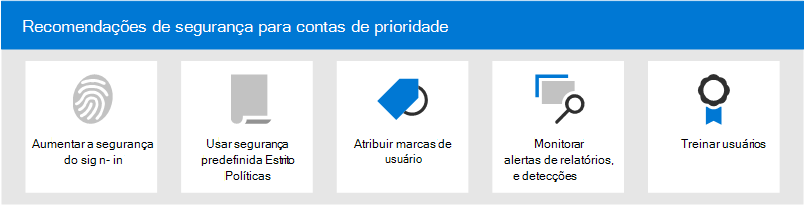

# Recomendações de segurança para contas prioritárias Microsoft 365Security recommendations for priority accounts in Microsoft 365

Nem todas as contas de usuário têm acesso às mesmas informações da empresa.Not all user accounts have access to the same company information. Algumas contas têm acesso a informações confidenciais, como dados financeiros, informações de desenvolvimento de produtos, acesso de parceiros a sistemas de com build críticos e muito mais.Some accounts have access to sensitive information, such as financial data, product development information, partner access to critical build systems, and more. Se comprometidas, contas que têm acesso a informações altamente confidenciais representam uma séria ameaça.If compromised, accounts that have access to highly confidential information pose a serious threat. Chamamos esses tipos de contas de prioridade de _contas._We call these types of accounts _priority accounts_. As contas de prioridade incluem (mas não estão limitadas a) CEOs, CISOs, CFOs, contas de administradores de infraestrutura, criar contas do sistema e muito mais.Priority accounts include (but aren't limited to) CEOs, CISOs, CFOs, infrastructure admin accounts, build system accounts, and more.

Para invasores, ataques de phishing comuns que lançam uma rede aleatória para usuários comuns ou desconhecidos são ineficientes.For attackers, ordinary phishing attacks that cast a random net for ordinary or unknown users are inefficient. Por outro lado, _ataques de phishing_ de lança ou _de_ caça que visam contas de prioridade são muito compensadores para os invasores.On the other hand, _spear phishing_ or _whaling_ attacks that target priority accounts are very rewarding for attackers. Portanto, as contas de prioridade exigem proteção mais forte do que a comum para ajudar a evitar o comprometimento da conta.So, priority accounts require stronger than ordinary protection to help prevent account compromise.

Microsoft 365 e o Microsoft Defender para Office 365 contêm vários recursos importantes que fornecem camadas adicionais de segurança para suas contas de prioridade.Microsoft 365 and Microsoft Defender for Office 365 contain several key features that provide additional layers of security for your priority accounts. Este artigo descreve esses recursos e como usá-los.This article describes these capabilities and how to use them.

****

|TarefaTask|Todos os Office 365 Enterprise planosAll Office 365 Enterprise plans|Microsoft 365 E3Microsoft 365 E3|Microsoft 365 E5Microsoft 365 E5|
|---|:---:|:---:|:---:|
|[Aumentar a segurança de login para contas prioritáriasIncrease sign-in security for priority accounts](#increase-sign-in-security-for-priority-accounts)||||
|[Usar políticas de segurança predefinidas estritas para contas prioritáriasUse Strict preset security policies for priority accounts](#use-strict-preset-security-policies-for-priority-accounts)||||
|[Aplicar marcas de usuário a contas prioritáriasApply user tags to priority accounts](#apply-user-tags-to-priority-accounts)||||
|[Monitorar contas de prioridade em alertas, relatórios e detecçõesMonitor priority accounts in alerts, reports, and detections](#monitor-priority-accounts-in-alerts-reports-and-detections)||||
|[Treinar usuáriosTrain users](#train-users)||||
|

> [!NOTE]
> Para obter informações sobre como proteger contas _privilegiadas_ (contas de administrador), consulte [este tópico](/azure/architecture/framework/security/critical-impact-accounts).For information about securing _privileged accounts_ (admin accounts), see [this topic](/azure/architecture/framework/security/critical-impact-accounts).

## Aumentar a segurança de login para contas prioritáriasIncrease sign-in security for priority accounts

As contas de prioridade exigem maior segurança de login.Priority accounts require increased sign-in security. Você pode aumentar a segurança de login deles exigindo a autenticação multifato (MFA) e desabilitando protocolos de autenticação herdados.You can increase their sign-in security by requiring multi-factor authentication (MFA) and disabling legacy authentication protocols.

Para obter instruções, consulte [a Etapa 1. Aumente a segurança de login para funcionários remotos com MFA](../../solutions/empower-people-to-work-remotely-secure-sign-in.md).For instructions, see [Step 1. Increase sign-in security for remote workers with MFA](../../solutions/empower-people-to-work-remotely-secure-sign-in.md). Embora este artigo seja sobre funcionários remotos, os mesmos conceitos se aplicam aos usuários prioritários.Although this article is about remote workers, the same concepts apply to priority users.

**Observação**: recomendamos que você desabilite globalmente os protocolos de autenticação herdados para todos os usuários prioritários, conforme descrito no artigo anterior.**Note**: We strongly recommend that you globally disable legacy authentication protocols for all priority users as described in the previous article. Se os requisitos de negócios impedirem isso, a Exchange Online oferece os seguintes controles para ajudar a limitar o escopo de protocolos de autenticação herdados:If your business requirements prevent you from doing so, Exchange Online offers the following controls to help limit the scope of legacy authentication protocols:

- Você pode  usar  políticas de autenticação e Regras de Acesso para Cliente no Exchange Online para bloquear ou permitir protocolos básicos de autenticação e autenticação herdada, como POP3, IMAP4 e SMTP autenticado para usuários específicos.You can use [authentication policies](/exchange/clients-and-mobile-in-exchange-online/disable-basic-authentication-in-exchange-online) and [Client Access Rules](/exchange/clients-and-mobile-in-exchange-online/client-access-rules/client-access-rules) in Exchange Online to block or allow Basic authentication and legacy authentication protocols like POP3, IMAP4, and authenticated SMTP for specific users.

- Você pode desabilitar o acesso POP3 e IMAP4 em caixas de correio individuais.You can disable POP3 and IMAP4 access on individual mailboxes. Você pode desabilitar o SMTP autenticado no nível organizacional e habilita-lo em caixas de correio específicas que ainda o exigem.You can disable authenticated SMTP at the organizational level and enable it on specific mailboxes that still require it. Para obter instruções, consulte os seguintes tópicos:For instructions, see the following topics:
  - [Habilitar ou desabilitar o acesso POP3 ou IMAP4 para um usuárioEnable or Disable POP3 or IMAP4 access for a user](/exchange/clients-and-mobile-in-exchange-online/pop3-and-imap4/enable-or-disable-pop3-or-imap4-access)
  - [Habilitar ou desabilitar o envio SMTP do cliente autenticado (SMTP AUTH)Enable or disable authenticated client SMTP submission (SMTP AUTH)](/exchange/clients-and-mobile-in-exchange-online/authenticated-client-smtp-submission)

Também vale a pena notar que a autenticação básica está em processo de preterido no Exchange Online para Exchange serviços Web (EWS), Exchange ActiveSync, POP3, IMAP4 e PowerShell remoto.It's also worth noting that Basic authentication is in the process of being deprecated in Exchange Online for Exchange Web Services (EWS), Exchange ActiveSync, POP3, IMAP4, and remote PowerShell. Para obter detalhes, consulte esta [postagem de blog](https://developer.microsoft.com/office/blogs/deferred-end-of-support-date-for-basic-authentication-in-exchange-online/).For details, see this [blog post](https://developer.microsoft.com/office/blogs/deferred-end-of-support-date-for-basic-authentication-in-exchange-online/).

## Usar políticas de segurança predefinidas estritas para contas prioritáriasUse Strict preset security policies for priority accounts

Os usuários prioritários exigem ações mais rigorosas para as várias proteções disponíveis no Proteção do Exchange Online (EOP) e no Defender para Office 365.Priority users require more stringent actions for the various protections that are available in Exchange Online Protection (EOP) and Defender for Office 365.

Por exemplo, em vez de entregar mensagens que foram classificadas como spam para a pasta Lixo Eletrônico, você deve colocar essas mesmas mensagens em quarentena se elas se destinam a contas prioritárias.For example, instead of delivering messages that were classified as spam to the Junk Email folder, you should quarantine those same messages if they're intended for priority accounts.

Você pode implementar essa abordagem rigorosa para contas prioritárias usando o perfil Estrito em políticas de segurança predefinidas.You can implement this stringent approach for priority accounts by using the Strict profile in preset security policies.

As políticas de segurança predefinidas são um local conveniente e central para aplicar nossas configurações de política estrita recomendadas para todas as proteções no EOP e no Defender para Office 365.Preset security policies are a convenient and central location to apply our recommended Strict policy settings for all of the protections in EOP and Defender for Office 365. Para obter mais informações, consulte [Preset security policies in EOP and Microsoft Defender for Office 365](preset-security-policies.md).For more information, see [Preset security policies in EOP and Microsoft Defender for Office 365](preset-security-policies.md).

Para obter detalhes sobre como as configurações de política Estrita diferem das configurações de política padrão e Padrão, consulte [Configurações recomendadas](recommended-settings-for-eop-and-office365.md)para EOP e Microsoft Defender para Office 365 segurança .For details about how the Strict policy settings differ from the the default and Standard policy settings, see [Recommended settings for EOP and Microsoft Defender for Office 365 security](recommended-settings-for-eop-and-office365.md).

## Aplicar marcas de usuário a contas prioritáriasApply user tags to priority accounts

As marcas de usuário no Microsoft Defender para Office 365 Plano 2 (como parte do Microsoft 365 E5 ou uma assinatura de complemento) são uma maneira de identificar e classificar rapidamente usuários ou grupos específicos de usuários em relatórios e investigações de incidentes.User tags in Microsoft Defender for Office 365 Plan 2 (as part of Microsoft 365 E5 or an add-on subscription) are a way to quickly identify and classify specific users or groups of users in reports and incident investigations.

**As contas de** prioridade são um tipo de marca de usuário interna (conhecida como marca do sistema _)_ que você pode usar para identificar incidentes e alertas que envolvem contas de prioridade.**Priority accounts** is a type of built-in user tag (known as a _system tag_) that you can use to identify incidents and alerts that involve priority accounts. Para obter mais informações sobre **contas de prioridade,** consulte [Manage and monitor priority accounts](../../admin/setup/priority-accounts.md).For more information about **priority accounts**, see [Manage and monitor priority accounts](../../admin/setup/priority-accounts.md).

Você também pode criar marcas personalizadas para identificar e classificar ainda mais suas contas de prioridade.You can also create custom tags to further identify and classify your priority accounts. Para obter mais informações, consulte [Marcas de usuário](user-tags.md).For more information, see [User tags](user-tags.md). Observe que você pode gerenciar contas **de prioridade** (marcas do sistema) na mesma interface que as marcas de usuário personalizadas.Note that you can manage **priority accounts** (system tags) in the same interface as custom user tags.

## Monitorar contas de prioridade em alertas, relatórios e detecçõesMonitor priority accounts in alerts, reports, and detections

Depois de proteger e marcar seus usuários prioritários, você pode usar os relatórios, alertas e investigações disponíveis no EOP e no Defender para Office 365 identificar rapidamente incidentes ou detecções que envolvem contas de prioridade.After you secure and tag your priority users, you can use the available reports, alerts, and investigations in EOP and Defender for Office 365 to quickly identify incidents or detections that involve priority accounts. Os recursos que suportam marcas de usuário são descritos na tabela a seguir.The features that support user tags are described in the following table.

 

****

|RecursoFeature|DescriçãoDescription|
|---|---|
|AlertasAlerts|As marcas de usuário dos usuários afetados estão visíveis e disponíveis como filtros na página Exibir **alertas** no Centro de Conformidade & Segurança.The user tags of affected users are visible and available as filters on the **View alerts** page in the Security & Compliance Center. Para obter mais informações, consulte [Exibindo alertas](../../compliance/alert-policies.md#viewing-alerts).For more information, see [Viewing alerts](../../compliance/alert-policies.md#viewing-alerts).|
|Explorador de AmeaçasThreat Explorer 
 Detecções em tempo realReal-time detections|No **Explorador** de Ameaças (Microsoft Defender para Office 365 Plano 2) ou detecções em tempo **real** (Microsoft Defender para Office 365 Plano 1), as marcas de usuário ficam visíveis na exibição de grade email e no submenu Detalhes de email.In **Threat Explorer** (Microsoft Defender for Office 365 Plan 2) or **Real-time detections** (Microsoft Defender for Office 365 Plan 1), user tags are visible in the Email grid view and the Email details flyout. As marcas de usuário também estão disponíveis como uma propriedade filtável.User tags are also available as a filterable property. Para obter mais informações, consulte  [Tags in Threat Explorer](threat-explorer.md#tags-in-threat-explorer).For more information, see  [Tags in Threat Explorer](threat-explorer.md#tags-in-threat-explorer).|
|Modos de Exibição de CampanhaCampaign Views|As marcas de usuário são uma das muitas propriedades filtáveis em Exibições de Campanha no Microsoft Defender para Office 365 Plano 2.User tags are one of many filterable properties in Campaign Views in Microsoft Defender for Office 365 Plan 2. Para obter mais informações, consulte [Exibições de Campanha.](campaigns.md)For more information, see [Campaign Views](campaigns.md).|
|Relatório de status de proteção contra ameaçasThreat protection status report|Em praticamente todas as exibições e tabelas de detalhes no relatório de **status** de proteção contra ameaças, você pode filtrar os resultados por **contas de prioridade.**In virtually all of the views and detail tables in the **Threat protection status report**, you can filter the results by **priority accounts**. Para obter mais informações, consulte [Relatório de status de proteção contra ameaças.](view-email-security-reports.md#threat-protection-status-report)For more information, see [Threat protection status report](view-email-security-reports.md#threat-protection-status-report).|
|Relatório de problemas de email para contas prioritáriasEmail issues for priority accounts report|O **relatório de** problemas de email para contas de prioridade no centro de administração Exchange (EAC) contém informações sobre mensagens não entregues e atrasadas para contas de **prioridade.**The **Email issues for priority accounts** report in the Exchange admin center (EAC) contains information about undelivered and delayed messages for **priority accounts**. Para obter mais informações, consulte [Email issues for priority accounts report](/exchange/monitoring/mail-flow-reports/mfr-email-issues-for-priority-accounts-report).For more information, see [Email issues for priority accounts report](/exchange/monitoring/mail-flow-reports/mfr-email-issues-for-priority-accounts-report).|
|

## Treinar usuáriosTrain users

O treinamento de usuários com contas prioritárias pode ajudar a salvar esses usuários e sua equipe de operações de segurança por muito tempo e frustração.Training users with priority accounts can help save those users and your security operations team much time and frustration. Os usuários experientes têm menos probabilidade de abrir anexos ou clicar em links em mensagens de email questionáveis, e é mais provável que eles evitem sites suspeitos.Savvy users are less likely to open attachments or click links in questionable email messages, and they are more likely to avoid suspicious websites.

O Manual da Campanha de [Segurança](https://www.belfercenter.org/CyberPlaybook) Cibernética da Escola De Harvard Kennedy fornece excelentes diretrizes para estabelecer uma forte cultura de reconhecimento de segurança em sua organização, incluindo o treinamento de usuários para identificar ataques de phishing.The Harvard Kennedy School [Cybersecurity Campaign Handbook](https://www.belfercenter.org/CyberPlaybook) provides excellent guidance for establishing a strong culture of security awareness within your organization, including training users to identify phishing attacks.

Microsoft 365 fornece os seguintes recursos para ajudar a informar os usuários em sua organização:Microsoft 365 provides the following resources to help inform users in your organization:

 

****

|ConceitoConcept|RecursosResources|DescriçãoDescription|
|---|---|---|
|Microsoft 365Microsoft 365|[Caminhos de aprendizado personalizáveisCustomizable learning pathways](/office365/customlearning/)|Esses recursos podem ajudá-lo a montar um treinamento para usuários em sua organização.These resources can help you put together training for users in your organization.|
|Segurança do Microsoft 365Microsoft 365 security|[Módulo de aprendizagem: proteja sua organização com segurança interna e inteligente de Microsoft 365Learning module: Secure your organization with built-in, intelligent security from Microsoft 365](/learn/modules/security-with-microsoft-365)|Esse módulo permite descrever como os recursos de segurança Microsoft 365 funcionam em conjunto e articular os benefícios desses recursos de segurança.This module enables you to describe how Microsoft 365 security features work together and to articulate the benefits of these security features.|
|Autenticação multifatorMulti-factor authentication|[Verificação em duas etapas: Qual é a página de verificação adicional?Two-step verification: What is the additional verification page?](/azure/active-directory/user-help/multi-factor-authentication-end-user-first-time)|Este artigo ajuda os usuários finais a entender o que é a autenticação multifatar e por que ela está sendo usada em sua organização.This article helps end users understand what multi-factor authentication is and why it's being used at your organization.|
|Treinamento de simulação de ataqueAttack simulation training|[Começar a usar o Treinamento de simulação de ataqueGet started using Attack simulation training](attack-simulation-training-get-started.md)|O treinamento de simulação de ataque no Microsoft Defender para Office 365 Plano 2 permite ao administrador configurar, iniciar e acompanhar ataques de phishing simulados contra grupos específicos de usuários.Attack simulation training in Microsoft Defender for Office 365 Plan 2 allows admin to configure, launch, and track simulated phishing attacks against specific groups of users.|

Além disso, a Microsoft recomenda que os usuários tomem as ações descritas neste artigo: Proteger sua conta e dispositivos [contra hackers e malware.](https://support.microsoft.com/office/066d6216-a56b-4f90-9af3-b3a1e9a327d6)In addition, Microsoft recommends that users take the actions described in this article: [Protect your account and devices from hackers and malware](https://support.microsoft.com/office/066d6216-a56b-4f90-9af3-b3a1e9a327d6). Essas ações incluem:These actions include:

- Usando senhas fortesUsing strong passwords
- Protegendo dispositivosProtecting devices
- Habilitando recursos de segurança em computadores Windows 10 e Mac (para dispositivos sem gestão)Enabling security features on Windows 10 and Mac PCs (for unmanaged devices)

## Confira tambémSee also

[Anunciando a Proteção de Conta De Prioridade no Microsoft Defender para Office 365Announcing Priority Account Protection in Microsoft Defender for Office 365](https://techcommunity.microsoft.com/t5/microsoft-defender-for-office/announcing-priority-account-protection-in-microsoft-defender-for/ba-p/1696385)