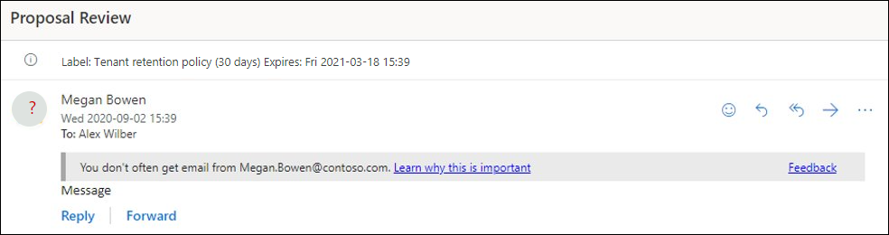
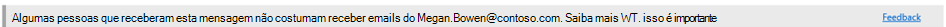

# Políticas anti-phishing no Microsoft 365

[!INCLUDE [Microsoft 365 Defender rebranding](../includes/microsoft-defender-for-office.md)]

**Aplica-se a**
- [Proteção do Exchange Online](exchange-online-protection-overview.md)
- [Plano 1 e plano 2 do Microsoft Defender para Office 365](defender-for-office-365.md)
- [Microsoft 365 Defender](../defender/microsoft-365-defender.md)

As políticas para configurar configurações de proteção anti-phishing estão disponíveis em organizações de Microsoft 365 com caixas de correio do Exchange Online, organizações autônomas Proteção do Exchange Online (EOP) sem caixas de correio Exchange Online e o Microsoft Defender para organizações Office 365.

Exemplos do Microsoft Defender para organizações Office 365 incluem:

- Microsoft 365 Enterprise E5, Microsoft 365 Education A5, etc.
- [Microsoft 365 Enterprise](https://www.microsoft.com/microsoft-365/enterprise/home)
- [Microsoft 365 Business](https://www.microsoft.com/microsoft-365/business)
- [Microsoft Defender para Office 365 como complemento](https://products.office.com/exchange/advance-threat-protection)

As diferenças de alto nível entre políticas anti-phishing no EOP e políticas anti-phishing no Defender para Office 365 são descritas na tabela a seguir:

 

****

|Recurso|Políticas anti-phishing no EOP|Políticas anti-phishing no Defender para Office 365|
|---|:---:|:---:|
|Política padrão criada automaticamente|||
|Criar políticas personalizadas|||
|Configurações de política comuns\*|||
|Configurações de spoof|||
|Primeiro contato dica de segurança|||
|Configurações de representação|||
|Limites avançados de phishing|||
|

\* Na política padrão, o nome da política e a descrição são somente leitura (a descrição está em branco) e você não pode especificar a quem a política se aplica (a política padrão se aplica a todos os destinatários).

Para configurar políticas anti-phishing, consulte os seguintes artigos:

- [Configurar políticas anti-phishing em EOP](configure-anti-phishing-policies-eop.md)
- [Configurar políticas anti-phishing no Microsoft Defender para Office 365](configure-mdo-anti-phishing-policies.md)

O restante deste artigo descreve as configurações disponíveis em políticas anti-phishing no EOP e no Defender para Office 365.

## Configurações de política comuns

As seguintes configurações de política estão disponíveis em políticas anti-phishing no EOP e no Defender para Office 365:

- **Nome**: Você não pode renomear a política anti-phishing padrão. Depois de criar uma política anti-phishing personalizada, não é possível renomear a política no Microsoft 365 Defender portal.

- **Descrição** Não é possível adicionar uma descrição à política anti-phishing padrão, mas você pode adicionar e alterar a descrição das políticas personalizadas que você cria.

- **Usuários, grupos e domínios**: Identifica destinatários internos aos que a política anti-phishing se aplica. Esse valor é necessário em políticas personalizadas e não está disponível na política padrão (a política padrão se aplica a todos os destinatários).

  Só é possível usar uma condição ou exceção uma vez; contudo, você pode especificar vários valores para a condição ou exceção. Vários valores da mesma condição ou exceção usam a lógica OU (por exemplo, _\<recipient1\>_ ou _\<recipient2\>_). Para diferentes condições ou exceções, use a lógica E (por exemplo, _\<recipient1\>_ e _\<member of group 1\>_).

  - **Usuários**: uma ou mais caixas de correio, usuários de email ou contatos de email em sua organização.
  - **Grupos**: Um ou mais grupos em sua organização.
  - **Domínios**: Um ou mais dos [domínios aceitos configurados](/exchange/mail-flow-best-practices/manage-accepted-domains/manage-accepted-domains) no Microsoft 365.

  - **Exclua esses usuários, grupos e domínios**: Exceções para a política. As configurações e o comportamento são exatamente como as condições:
    - **Users**
    - **Grupos**
    - **Domínios**

  > [!NOTE]
  > Pelo menos uma seleção nas configurações **Usuários,** grupos e domínios é necessária em políticas anti-phishing personalizadas para identificar os **destinatários** da mensagem aos quais a política se <u>aplica.</u> As políticas anti-phishing no Defender para Office 365 também têm configurações de representação nas quais você pode especificar [endereços](#impersonation-settings-in-anti-phishing-policies-in-microsoft-defender-for-office-365) de email de remetente <u>individuais</u> ou domínios de remetente que receberão proteção de representação conforme descrito mais adiante neste artigo.

## Configurações de spoof

A spoofing é quando o endereço From em uma mensagem de email (o endereço de remetente mostrado em clientes de email) não corresponderá ao domínio da fonte de email. Para obter mais informações sobre a spoofing, consulte [Anti-spoofing protection in Microsoft 365](anti-spoofing-protection.md).

As seguintes configurações de spoof estão disponíveis em políticas anti-phishing no EOP e no Defender para Office 365:

- **Habilitar a inteligência de spoof**: ativa ou desliga a inteligência de spoof. Recomendamos que você o deixe ligado.

  Quando a inteligência de spoof é habilitada, a visão de inteligência de **spoof** mostra os envios despoudos que foram detectados automaticamente e permitidos ou bloqueados pela inteligência de fraude. Você pode substituir manualmente o veredito de inteligência de spoof para permitir ou bloquear os envios esofados detectados de dentro do insight. Mas, quando você faz isso, o remetente despojado desaparece do insight de inteligência de spoof e agora está visível apenas na guia **Spoof** na Lista de Locatários Permitir/Bloquear. Você também pode criar manualmente entradas de permitir ou bloquear para os envios com spoofed na Lista de Locatários de Permitir/Bloquear. Para saber mais, confira os seguintes artigos:

  - [Spoof intelligence insight in EOP](learn-about-spoof-intelligence.md)
  - [Gerenciar a lista de locatários de permitir/bloquear no EOP](tenant-allow-block-list.md)

  > [!NOTE]
  >
  > - A proteção antifalsagem está habilitada por padrão na política anti-phishing padrão e em todas as novas políticas anti-phishing personalizadas que você criar.
  > - Você não precisa desabilitar a proteção anti-spoofing se seu registro MX não apontar para Microsoft 365; em vez disso, você habilita a Filtragem Aprimorada para Conectores. Para obter instruções, [consulte Enhanced Filtering for Connectors in Exchange Online](/Exchange/mail-flow-best-practices/use-connectors-to-configure-mail-flow/enhanced-filtering-for-connectors).
  > - Desabilitar a proteção anti-spoofing  desabilita apenas a proteção implícita de spoofing contra [verificações de autenticação composta.](email-validation-and-authentication.md#composite-authentication) Se o remetente _falhar_ no [DMARC](use-dmarc-to-validate-email.md) explícito verifica onde a política está definida como quarentena ou rejeição, a mensagem ainda está em quarentena ou rejeitada.

- **Notificações de** remetente não autenticadas : Essas notificações estão disponíveis somente quando a inteligência de spoof está ativa. Consulte as informações na próxima seção.
- **Ações**: Para mensagens de envios com spoofed bloqueados (bloqueados automaticamente pela inteligência de spoof ou bloqueados manualmente na lista Permitir/Bloquear Locatários), você também pode especificar a ação a ser tomada nas mensagens:
  - Mover mensagens para as pastas lixo eletrônico **dos destinatários:** esse é o valor padrão. A mensagem é entregue à caixa de correio e movida para a pasta Lixo Eletrônico. Em Exchange Online, a mensagem será movida para a pasta Lixo Eletrônico se a regra de lixo eletrônico estiver habilitada na caixa de correio (ela está habilitada por padrão). Para obter mais informações, consulte [Configure junk email settings on Exchange Online mailboxes in Microsoft 365](configure-junk-email-settings-on-exo-mailboxes.md).
  - **Colocar em quarentena a mensagem**: envia a mensagem para quarentena em vez dos destinatários pretendido. Para obter informações sobre quarentena, consulte os seguintes artigos:
    - [Quarentena no Microsoft 365](quarantine-email-messages.md)
    - [Gerenciar mensagens e arquivos em quarentena como administrador no Microsoft 365](manage-quarantined-messages-and-files.md)
    - [Encontre e libere mensagens em quarentena como um usuário Microsoft 365](find-and-release-quarantined-messages-as-a-user.md)

### Remetente não autenticado

As notificações de remetente não autenticadas fazem parte das configurações de [Spoof](#spoof-settings) que estão disponíveis em políticas anti-phishing no EOP e no Defender para Office 365 como descrito na seção anterior. As configurações a seguir estão disponíveis somente quando a inteligência de spoof está 2016 2016:

- **Mostrar (?)** para remetentes não autenticados para spoof : Essa notificação adiciona um ponto de interrogação é adicionado à foto do  remetente na caixa De se a mensagem não passar verificações SPF ou DKIM e a mensagem não passar DMARC ou [autenticação](email-validation-and-authentication.md#composite-authentication)composta . Quando essa configuração é desligada, o ponto de interrogação não é adicionado à foto do remetente.

- Mostrar a marca **"via" ?**: Essa notificação adiciona <u>a</u> marca via (chris@contoso.com via fabrikam.com) na caixa De se o domínio no endereço From (o remetente de mensagem exibido em clientes de email) for diferente do domínio na assinatura DKIM ou no endereço MAIL **FROM.** Para obter mais informações sobre esses endereços, consulte [Uma visão geral dos padrões de mensagens de email.](how-office-365-validates-the-from-address.md#an-overview-of-email-message-standards)

Para impedir que o ponto de interrogação ou por meio da marca seja adicionado a mensagens de senders específicos, você tem as seguintes opções:

- Permitir que o remetente spoofed no insight de inteligência de [spoof](learn-about-spoof-intelligence.md) ou manualmente na [Lista de Locatários Permitir/Bloquear.](tenant-allow-block-list.md) Permitir que o remetente spoofed impeça que a marca via apareça em mensagens do remetente quando a identificação do remetente não autenticada estiver desabilitada.
- [Configure a autenticação de](email-validation-and-authentication.md#configure-email-authentication-for-domains-you-own) email para o domínio do remetente.
  - Para o ponto de interrogação na foto do remetente, SPF ou DKIM são os mais importantes.
  - Para a marca via, confirme o domínio na assinatura DKIM ou o endereço **MAIL FROM** corresponde (ou é um subdomínio de) o domínio no endereço From.

Para obter mais informações, consulte [Identificar mensagens suspeitas em Outlook.com e Outlook na Web](https://support.microsoft.com/office/3d44102b-6ce3-4f7c-a359-b623bec82206)

## Primeiro contato dica de segurança

As configurações Mostrar primeiro contato **dica de segurança** estão disponíveis no EOP e no Defender para organizações Office 365, e não tem dependência de configurações de inteligência falsa ou proteção contra representação. A dica de segurança é mostrada aos destinatários nos seguintes cenários:

- A primeira vez que eles receberem uma mensagem de um remetente
- Eles não costumam receber mensagens do remetente.

Esse recurso adiciona uma camada extra de proteção de segurança contra possíveis ataques de representação, portanto, recomendamos que você a a ligue.

O primeiro contato dica de segurança também substitui a necessidade de criar regras de fluxo de emails (também conhecidas como regras de transporte) que adicionam o header chamado **X-MS-Exchange-EnableFirstContactSafetyTip** pelo valor **Habilitar** para mensagens (embora esse recurso ainda esteja disponível).

## Configurações exclusivas em políticas anti-phishing no Microsoft Defender para Office 365

Esta seção descreve as configurações de política que estão disponíveis apenas em políticas anti-phishing no Defender para Office 365.

> [!NOTE]
> A política anti-phishing padrão no Defender para Office 365 [fornece](set-up-anti-phishing-policies.md#spoof-settings) proteção contra fraudes e inteligência de caixa de correio para todos os destinatários. No entanto, os outros recursos de proteção [de representação](#impersonation-settings-in-anti-phishing-policies-in-microsoft-defender-for-office-365) disponíveis e configurações avançadas não estão configurados ou [habilitados](set-up-anti-phishing-policies.md#advanced-phishing-thresholds-in-anti-phishing-policies-in-microsoft-defender-for-office-365) na política padrão. Para habilitar todos os recursos de proteção, modifique a política anti-phishing padrão ou crie políticas anti-phishing adicionais.

### Configurações de representação em políticas anti-phishing no Microsoft Defender para Office 365

A representação é onde o remetente ou o domínio de email do remetente em uma mensagem é semelhante a um remetente ou domínio real:

- Um exemplo de representação do domínio contoso.com é ćóntoso.com.
- Um exemplo de representação do usuário michelle@contoso.com é michele@contoso.com.

Caso contrário, um domínio representado pode ser considerado legítimo (domínios registrados, registros de autenticação de email configurados, etc.), exceto pelo intuito de enganar os destinatários.

As seguintes configurações de representação só estão disponíveis em políticas anti-phishing no Defender para Office 365:

- **Permitir que os usuários protejam**: impede que os endereços de email internos ou externos especificados sejam personificados **como envios de mensagens.** Por exemplo, você recebe uma mensagem de email do vice-presidente da sua empresa solicitando que você envie algumas informações internas da empresa. Você faria isso? Muitas pessoas enviariam a resposta sem pensar.

  Você pode usar usuários protegidos para adicionar endereços de email internos e externos do remetente para proteger contra a representação. Essa lista  de destinatários protegidos contra a representação do usuário é diferente da lista de **destinatários** aos quais a política se aplica (todos os destinatários  da política padrão; destinatários específicos como configurados na configuração Usuários, grupos e **domínios** na seção Configurações de política comum).

  > [!NOTE]
  >
  > - Em cada política anti-phishing, você pode especificar um máximo de 350 usuários protegidos (endereços de email do remetente). Não é possível especificar o mesmo usuário protegido em várias políticas. Portanto, independentemente de quantas políticas se aplicam a um destinatário, o número máximo de usuários protegidos (endereços de email de remetente) para cada destinatário individual é 350. Para obter mais informações sobre a prioridade da política e como o processamento de política é interrompido após a aplicação da primeira política, consulte [Order and precedence of email protection](how-policies-and-protections-are-combined.md).
  > - A proteção de representação do usuário não funcionará se o remetente e o destinatário se comunicarem anteriormente por email. Se o remetente e o destinatário nunca se comunicarem por email, a mensagem será identificada como uma tentativa de representação.

  Por padrão, nenhum endereço de email de remetente é configurado para proteção de representação em **Usuários para proteger**. Portanto, por padrão, nenhum endereço de email de remetente é coberto pela proteção de representação, seja na política padrão ou em políticas personalizadas.

  Quando você adiciona endereços de  email internos ou externos à lista Usuários para proteger, as mensagens desses **senders** estão sujeitas a verificações de proteção de representação. A mensagem é verificada  para representação se a mensagem é enviada a um **destinatário** ao que a política se aplica (todos os destinatários da política padrão; **Usuários, grupos e destinatários de** domínios em políticas personalizadas). Se a representação for detectada no endereço de email do remetente, as ações de proteção de representação para os usuários serão aplicadas à mensagem (o que fazer com a mensagem, se você deve mostrar dicas de segurança dos usuários personificados, etc.).

- **Habilitar domínios para proteger**: impede que os domínios especificados sejam personificados no **domínio do remetente da mensagem.** Por exemplo, todos os domínios que você possui ([domínios aceitos](/exchange/mail-flow-best-practices/manage-accepted-domains/manage-accepted-domains)) ou domínios personalizados específicos (domínios que você possui ou domínios parceiros). Esta lista de domínios de remetente **protegidos** contra representação é diferente da lista de **destinatários** aos quais a política se aplica (todos os destinatários da  política padrão; destinatários específicos conforme configurado na configuração Usuários, grupos e **domínios** na seção Configurações de política comum).

  > [!NOTE]
  > O número máximo de domínios protegidos que você pode definir em todas as políticas anti-phishing é 50.

  Por padrão, nenhum domínio de remetente é configurado para proteção de representação em **Habilitar domínios para proteger**. Portanto, por padrão, nenhum domínio de remetente é coberto pela proteção de representação, seja na política padrão ou em políticas personalizadas.

  Quando você adiciona domínios à lista **Habilitar domínios** para proteger, as mensagens de senders nesses domínios estão **sujeitas** a verificações de proteção de representação. A mensagem é verificada  para representação se a mensagem é enviada a um **destinatário** ao que a política se aplica (todos os destinatários da política padrão; **Usuários, grupos e destinatários de** domínios em políticas personalizadas). Se a representação for detectada no domínio do remetente, as ações de proteção de representação para domínios serão aplicadas à mensagem (o que fazer com a mensagem, se deve mostrar dicas de segurança de usuários personificados, etc.).

- **Ações**: escolha a ação a ser tomada em mensagens de entrada que contenham tentativas de representação contra os usuários protegidos e domínios protegidos na política. Você pode especificar ações diferentes para representação de usuários protegidos versus representação de domínios protegidos:
  - **Não aplique nenhuma ação**
  - **Redirecionar mensagem para outros endereços de email**: envia a mensagem para os destinatários especificados em vez dos destinatários pretendido.
  - **Mover mensagens para as pastas** lixo eletrônico dos destinatários : a mensagem é entregue à caixa de correio e movida para a pasta Lixo Eletrônico. Em Exchange Online, a mensagem será movida para a pasta Lixo Eletrônico se a regra de lixo eletrônico estiver habilitada na caixa de correio (ela está habilitada por padrão). Para obter mais informações, consulte [Configure junk email settings on Exchange Online mailboxes in Microsoft 365](configure-junk-email-settings-on-exo-mailboxes.md).
  - **Colocar em quarentena a mensagem**: envia a mensagem para quarentena em vez dos destinatários pretendido. Para obter informações sobre quarentena, consulte os seguintes artigos:
    - [Quarentena no Microsoft 365](quarantine-email-messages.md)
    - [Gerenciar mensagens e arquivos em quarentena como administrador no Microsoft 365](manage-quarantined-messages-and-files.md)
    - [Encontre e libere mensagens em quarentena como um usuário Microsoft 365](find-and-release-quarantined-messages-as-a-user.md)
  - **Entregue a mensagem e adicione** outros endereços à linha Cc : entregue a mensagem aos destinatários pretendido e entregue silenciosamente a mensagem aos destinatários especificados.
  - **Exclua a mensagem antes de ser entregue**: exclui silenciosamente toda a mensagem, incluindo todos os anexos.

- **Dicas de segurança de representação:** a a ativar ou desativar as seguintes dicas de segurança de representação que aparecerão mensagens que falharão nas verificações de representação:
  - **Mostrar dica para usuários personificados**: O endereço From contém um **Habilitar usuários para proteger o** usuário. Disponível somente se **Habilitar os usuários para proteger** estiver ativado e configurado.
  - **Mostrar dica para domínios personificados**: O endereço From contém um **Habilitar domínios para proteger o** domínio. Disponível somente se **Habilitar domínios para proteger** estiver ativado e configurado.
  - Dica para caracteres incomuns **:** O endereço From contém conjuntos de caracteres incomuns (por exemplo, símbolos matemáticos e texto ou uma mistura de letras maiúsculas e **minúsculas)** em um Enable **users** to protect sender or an Enable domains to protect sender domain.  Disponível somente se Permitir que os **usuários protejam** _ou_ **Habilitam domínios para** proteger estão ativados e configurados.

- **Habilitar a** inteligência de caixa de correio : Habilita ou desabilita a inteligência artificial (AI) que determina padrões de email do usuário com seus contatos frequentes. Essa configuração ajuda a AI a distinguir entre mensagens de senders legítimos e personificados.

  Por exemplo, Gabriela Laureano (glaureano@contoso.com) é a CEO da sua empresa, portanto, você a adiciona como um remetente protegido no Enable **users** to protect settings of the policy. Porém, alguns dos destinatários que a política se aplica para se comunicar regularmente com um fornecedor que também se chama Gabriela Laureano (glaureano@fabrikam.com). Como esses destinatários têm um histórico de comunicação com glaureano@fabrikam.com, a inteligência de caixa de correio não identificará mensagens do glaureano@fabrikam.com como uma tentativa de representação de glaureano@contoso.com para esses destinatários.

  Para usar contatos frequentes que foram aprendidos pela inteligência de caixa de correio (e  a falta dela) para ajudar a proteger os usuários contra ataques de representação, você pode ativar Habilitar a proteção de representação de inteligência depois de ativar Habilitar inteligência de caixa de **correio**.

- **Habilitar a proteção de representação de** inteligência : ative essa configuração para especificar a ação a ser tomada em mensagens para detecções de representação de resultados de inteligência de caixa de correio:
  - **Não aplique nenhuma ação**: observe que esse valor  tem o mesmo resultado que ativar a Inteligência de Caixa de Correio, mas desligar Habilitar a proteção de **representação de inteligência**.
  - **Redirecionar mensagem para outros endereços de email**
  - **Mover mensagem para as pastas lixo eletrônico dos destinatários**
  - **Colocar em quarentena a mensagem**
  - **Entregar a mensagem e adicionar outros endereços à linha Cc**
  - **Excluir a mensagem antes de ser entregue**

- **Adicionar senders e domínios confiáveis**: Exceções às configurações de proteção de representação. As mensagens dos domínios remetentes e remetentes especificados nunca são classificadas como ataques baseados em representação pela política. Em outras palavras, a ação para remetentes protegidos, domínios protegidos ou proteção de inteligência de caixa de correio não é aplicada a esses remetentes ou domínios de remetente confiáveis. O limite máximo para essas listas é de aproximadamente 1.000 entradas.

### Limites avançados de phishing em políticas anti-phishing no Microsoft Defender para Office 365

Os seguintes limites avançados de phishing estão disponíveis apenas em políticas anti-phishing no Defender para Office 365. Esses limites controlam a sensibilidade para aplicar modelos de aprendizado de máquina a mensagens para determinar um veredito de phishing:

- **1 - Padrão**: este é o valor padrão. A gravidade da ação tomada na mensagem depende do grau de confiança de que a mensagem é phishing (baixa, média, alta ou muito alta confiança). Por exemplo, as mensagens identificadas como phishing com alto grau de confiança têm as ações mais graves aplicadas, enquanto as mensagens identificadas como phishing com baixo grau de confiança têm ações menos graves aplicadas.
- **2 - Agressivo**: As mensagens identificadas como phishing com alto grau de confiança são tratadas como se fossem identificadas com um grau de confiança muito alto.
- **3 - Mais** agressivo : As mensagens identificadas como phishing com um grau médio ou alto de confiança são tratadas como se fossem identificadas com um grau muito alto de confiança.
- **4 - Mais** agressivo : As mensagens identificadas como phishing com baixo, médio ou alto grau de confiança são tratadas como se fossem identificadas com um grau muito alto de confiança.

A chance de falsos positivos (mensagens boas marcadas como ruins) aumenta à medida que você aumenta essa configuração. Para obter informações sobre as configurações recomendadas, consulte [anti-phishing policy in Microsoft Defender for Office 365 settings](recommended-settings-for-eop-and-office365.md#anti-phishing-policy-settings-in-microsoft-defender-for-office-365).
