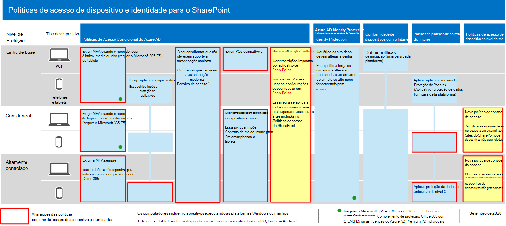
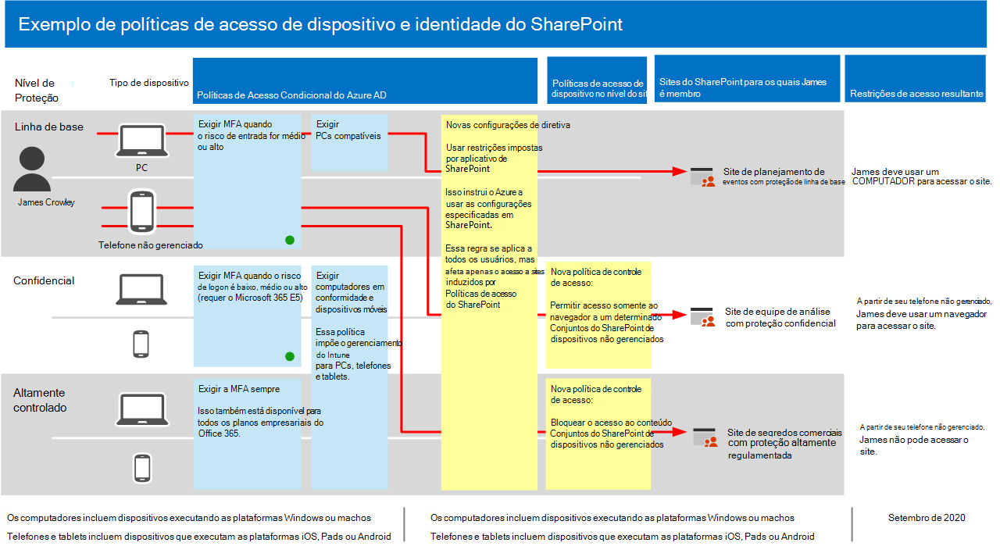

# Recomendações de política para proteger sites e arquivos do SharePointPolicy recommendations for securing SharePoint sites and files

**Aplica-se a****Applies to**
- [Proteção do Exchange OnlineExchange Online Protection](exchange-online-protection-overview.md)
- [Plano 1 e plano 2 do Microsoft Defender para Office 365Microsoft Defender for Office 365 plan 1 and plan 2](defender-for-office-365.md)
- SharePoint OnlineSharePoint Online 

Este artigo descreve como implementar as políticas recomendadas de identidade e acesso a dispositivos para proteger o SharePoint e o OneDrive for Business.This article describes how to implement the recommended identity and device-access policies to protect SharePoint and OneDrive for Business. Essa orientação se baseia nas políticas [comuns de identidade e acesso a dispositivos.](identity-access-policies.md)This guidance builds on the [common identity and device access policies](identity-access-policies.md).

Essas recomendações se baseiam em três camadas diferentes de segurança e proteção para arquivos do SharePoint que podem ser aplicadas com base na granularidade de suas **necessidades:** linha de **base,** sensível e altamente **regulamentada.**These recommendations are based on three different tiers of security and protection for SharePoint files that can be applied based on the granularity of your needs: **baseline**, **sensitive**, and **highly regulated**. Você pode saber mais sobre essas camadas de segurança e os sistemas operacionais cliente recomendados, referenciados por essas recomendações [na visão geral](microsoft-365-policies-configurations.md).You can learn more about these security tiers, and the recommended client operating systems, referenced by these recommendations in [the overview](microsoft-365-policies-configurations.md).

Além de implementar essas diretrizes, configure os sites do SharePoint com a quantidade certa de proteção, incluindo a definição de permissões apropriadas para conteúdos confidenciais e altamente regulamentados.In addition to implementing this guidance, be sure to configure SharePoint sites with the right amount of protection, including setting appropriate permissions for sensitive and highly-regulated content.

## Atualizando políticas comuns para incluir o SharePoint e o OneDrive for BusinessUpdating common policies to include SharePoint and OneDrive for Business

Para proteger arquivos no SharePoint e no OneDrive, o diagrama a seguir ilustra quais políticas atualizar das políticas comuns de identidade e acesso a dispositivos.To protect files in SharePoint and OneDrive, the following diagram illustrates which policies to update from the the common identity and device access policies.

Se você incluiu o SharePoint ao criar as políticas comuns, só precisará criar as novas políticas.If you included SharePoint when you created the common policies, you only need to create the new policies. Para políticas de Acesso Condicional, o SharePoint inclui o OneDrive.For Conditional Access policies, SharePoint includes OneDrive.

As novas políticas implementam a proteção de dispositivos para conteúdos confidenciais e altamente regulamentados aplicando requisitos de acesso específicos aos sites do SharePoint especificados.The new policies implement device protection for sensitive and highly-regulated content by applying specific access requirements to SharePoint sites that you specify.

A tabela a seguir lista as políticas que você precisa revisar e atualizar ou criar novas para o SharePoint.The following table lists the policies you either need to review and update or create new for SharePoint. As políticas comuns vinculam-se às instruções de configuração associadas no [artigo Common identity and device access policies.](identity-access-policies.md)The common policies link to the associated configuration instructions in the [Common identity and device access policies](identity-access-policies.md) article.

|Nível de ProteçãoProtection level|PolíticasPolicies|Mais informaçõesMore information|
|---|---|---|
|**Baseline****Baseline**|[Exigir MFA quando o risco de entrar é *médio* ou *alto*Require MFA when sign-in risk is *medium* or *high*](identity-access-policies.md#require-mfa-based-on-sign-in-risk)|Inclua o SharePoint na atribuição de aplicativos de nuvem.Include SharePoint in the assignment of cloud apps.|
||[Bloquear clientes sem suporte para a autenticação modernaBlock clients that don't support modern authentication](identity-access-policies.md#block-clients-that-dont-support-multi-factor)|Inclua o SharePoint na atribuição de aplicativos de nuvem.Include SharePoint in the assignment of cloud apps.|
||[Aplicar políticas de proteção de dados do APPApply APP data protection policies](identity-access-policies.md#apply-app-data-protection-policies)|Certifique-se de que todos os aplicativos recomendados estão incluídos na lista de aplicativos.Be sure all recommended apps are included in the list of apps. Certifique-se de atualizar a política para cada plataforma (iOS, Android, Windows).Be sure to update the policy for each platform (iOS, Android, Windows).|
||[Exigir PCs compatíveisRequire compliant PCs](identity-access-policies.md#require-compliant-pcs-but-not-compliant-phones-and-tablets)|Inclua o SharePoint na lista de aplicativos de nuvem.Include SharePoint in list of cloud apps.|
||[Usar restrições impostas pelo aplicativo no SharePointUse app enforced restrictions in SharePoint](#use-app-enforced-restrictions-in-sharepoint)|Adicione essa nova política.Add this new policy. Isso diz ao Azure Active Directory (Azure AD) para usar as configurações especificadas no SharePoint.This tells Azure Active Directory (Azure AD) to use the settings specified in SharePoint. Essa política se aplica a todos os usuários, mas afeta apenas o acesso aos sites incluídos nas políticas de acesso do SharePoint.This policy applies to all users, but only affects access to sites included in SharePoint access policies.|
|**Confidencial****Sensitive**|[Exigir MFA quando o risco de entrar é *baixo,* *médio* ou *alto*Require MFA when sign-in risk is *low*, *medium* or *high*](identity-access-policies.md#require-mfa-based-on-sign-in-risk)|Inclua o SharePoint nas atribuições de aplicativos de nuvem.Include SharePoint in the assignments of cloud apps.|
||[Exigir PCs e *dispositivos* móveis compatíveisRequire compliant PCs *and* mobile devices](identity-access-policies.md#require-compliant-pcs-and-mobile-devices)|Inclua o SharePoint na lista de aplicativos de nuvem.Include SharePoint in the list of cloud apps.|
||[Política de controle de acesso do SharePoint](#sharepoint-access-control-policies): Permitir acesso somente de navegador a sites específicos do SharePoint de dispositivos não controlados.[SharePoint access control policy](#sharepoint-access-control-policies): Allow browser-only access to specific SharePoint sites from unmanaged devices.|Isso impede a edição e o download de arquivos.This prevents edit and download of files. Use o PowerShell para especificar sites.Use PowerShell to specify sites.|
|**Altamente controlado****Highly regulated**|[*Sempre* exigir MFA*Always* require MFA](identity-access-policies.md#require-mfa-based-on-sign-in-risk)|Inclua o SharePoint na atribuição de aplicativos de nuvem.Include SharePoint in the assignment of cloud apps.|
||[Política de controle de acesso do SharePoint](#use-app-enforced-restrictions-in-sharepoint): Bloquear o acesso a sites específicos do SharePoint de dispositivos não controlados.[SharePoint access control policy](#use-app-enforced-restrictions-in-sharepoint): Block access to specific SharePoint sites from unmanaged devices.|Use o PowerShell para especificar sites.Use PowerShell to specify sites.|
|

## Usar restrições impostas pelo aplicativo no SharePointUse app-enforced restrictions in SharePoint

Se você implementar controles de acesso no SharePoint, deverá criar essa política de Acesso Condicional no Azure AD para dizer ao Azure AD para impor as políticas configuradas no SharePoint.If you implement access controls in SharePoint, you must create this Conditional Access policy in Azure AD to tell Azure AD to enforce the policies you configure in SharePoint. Essa política se aplica a todos os usuários, mas afeta apenas o acesso aos sites que você especificar usando o PowerShell ao criar os controles de acesso no SharePoint.This policy applies to all users, but only affects access to the sites you specify using PowerShell when you create the access controls in SharePoint.

Para configurar essa política, consulte "Bloquear ou limitar o acesso a coleções de sites específicas do SharePoint ou contas do OneDrive" em Controle de acesso de dispositivos não [controlados](/sharepoint/control-access-from-unmanaged-devices).To configure this policy see "Block or limit access to specific SharePoint site collections or OneDrive accounts" in [Control access from unmanaged devices](/sharepoint/control-access-from-unmanaged-devices).

## Políticas de controle de acesso do SharePointSharePoint access control policies

A Microsoft recomenda que você proteja o conteúdo em sites do SharePoint com conteúdo altamente regulamentado e confidenciais com controles de acesso ao dispositivo.Microsoft recommends you protect content in SharePoint sites with sensitive and highly-regulated content with device access controls. Você faz isso criando uma política que especifica o nível de proteção e os sites aos que aplicar a proteção.You do this by creating a policy that specifies the level of protection and the sites to apply the protection to.

- Sites confidenciais: Permitir acesso somente ao navegador.Sensitive sites: Allow browser-only access. Isso impede que os usuários editem e baixem arquivos.This prevents users from editing and downloading files.
- Sites altamente regulamentados: Bloqueie o acesso de dispositivos não autorizados.Highly regulated sites: Block access from unmanaged devices.

Consulte "Bloquear ou limitar o acesso a coleções de sites específicas do SharePoint ou contas do OneDrive" em Controle de acesso de dispositivos não [controlados.](/sharepoint/control-access-from-unmanaged-devices)See "Block or limit access to specific SharePoint site collections or OneDrive accounts" in [Control access from unmanaged devices](/sharepoint/control-access-from-unmanaged-devices).

## Como essas políticas funcionam em conjuntoHow these policies work together

É importante entender que as permissões de site do SharePoint geralmente se baseiam na necessidade comercial de acesso a sites.It's important to understand that SharePoint site permissions are typically based on business need for access to sites. Essas permissões são gerenciadas por proprietários de sites e podem ser altamente dinâmicas.These permissions are managed by site owners and can be highly dynamic. O uso de políticas de acesso a dispositivos do SharePoint garante proteção a esses sites, independentemente de os usuários ser atribuídos a um grupo do Azure AD associado à proteção de linha de base, confidenciais ou altamente regulamentadas.Using SharePoint device access policies ensures protection to these sites, regardless of whether users are assigned to an Azure AD group associated with baseline, sensitive, or highly regulated protection.

A ilustração a seguir fornece um exemplo de como as políticas de acesso a dispositivos do SharePoint protegem o acesso a sites para um usuário.The following illustration provides an example of how SharePoint device access policies protect access to sites for a user.

[Consulte uma versão maior dessa imagemSee a larger version of this image](https://github.com/MicrosoftDocs/microsoft-365-docs/raw/public/microsoft-365/media/microsoft-365-policies-configurations/SharePoint-rules-scenario.png)

O James tem políticas de Acesso Condicional da linha de base atribuídas, mas ele pode ter acesso a sites do SharePoint com proteção sensível ou altamente regulamentada.James has baseline Conditional Access policies assigned, but he can be given access to SharePoint sites with sensitive or highly-regulated protection.

- Se Tiago acessar um site sensível ou altamente regulamentado, ele será membro do uso de seu computador, seu acesso será concedido desde que seu computador seja compatível.If James accesses a sensitive or highly-regulated site he is a member of using his PC, his access is granted as long as his PC is compliant.
- Se o James acessar um site sensível, ele é membro do uso de seu telefone não autorizado, o que é permitido para usuários de linha de base, ele receberá acesso somente do navegador ao site sensível devido à política de acesso ao dispositivo configurada para este site.If James accesses a sensitive site he is a member of using his unmanaged phone, which is allowed for baseline users, he will receive browser-only access to the sensitive site due to the device access policy configured for this site.
- Se o James acessar um site altamente regulamentado, ele é membro do uso de seu telefone não autorizado, ele será bloqueado devido à política de acesso configurada para este site.If James accesses a highly regulated site he is a member of using his unmanaged phone, he will be blocked due to the access policy configured for this site. Ele só pode acessar esse site usando seu computador gerenciado e compatível.He can only access this site using his managed and compliant PC.

## Próxima etapaNext step

Configurar políticas de Acesso Condicional para:Configure Conditional Access policies for:

- [Microsoft TeamsMicrosoft Teams](teams-access-policies.md)
- [Exchange OnlineExchange Online](secure-email-recommended-policies.md)