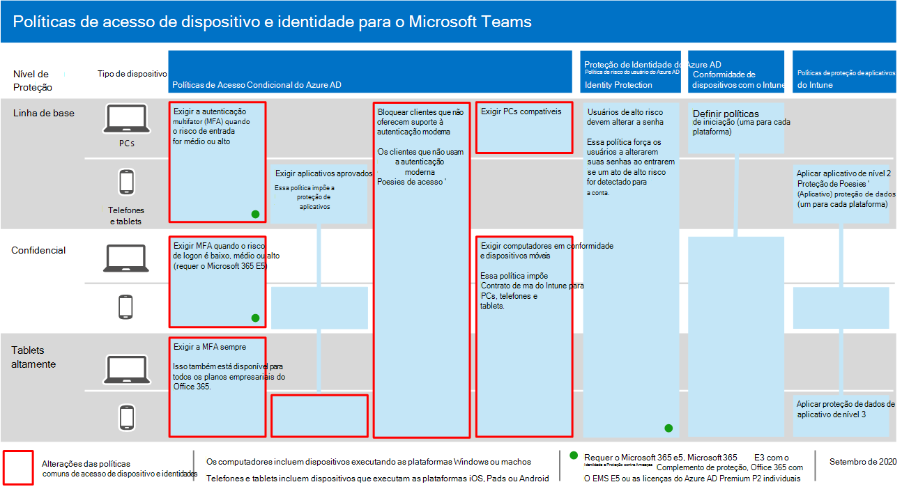
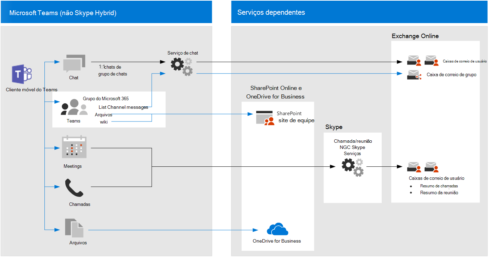

# Recomendações de política para proteger chats, grupos e arquivos do TeamsPolicy recommendations for securing Teams chats, groups, and files

Este artigo descreve como implementar as políticas de acesso a dispositivos e identidade recomendadas para proteger chats, grupos e conteúdos do Microsoft Teams, como arquivos e calendários.This article describes how to implement the recommended identity and device-access policies to protect Microsoft Teams chats, groups, and content such as files and calendars. Essas diretrizes se baseam nas políticas [comuns](identity-access-policies.md)de acesso a identidades e dispositivos, com informações adicionais específicas do Teams.This guidance builds on the [common identity and device access policies](identity-access-policies.md), with additional information that's Teams-specific. Como o Teams se integra a outros produtos, consulte também recomendações de política para proteger arquivos e sites do [SharePoint](sharepoint-file-access-policies.md) e recomendações de política para [proteger emails.](secure-email-recommended-policies.md)Because Teams integrates with our other products, also see [Policy recommendations for securing SharePoint sites and files](sharepoint-file-access-policies.md) and [Policy recommendations for securing email](secure-email-recommended-policies.md).

Essas recomendações são baseadas em três camadas diferentes de segurança e proteção para o Teams que podem ser aplicadas com base na granularidade de suas necessidades: linha de base, sensível e altamente controlada.These recommendations are based on three different tiers of security and protection for Teams that can be applied based on the granularity of your needs: baseline, sensitive, and highly regulated. Você pode saber mais sobre essas camadas de segurança e as políticas recomendadas referenciadas por essas recomendações nas configurações de acesso de dispositivo e [identidade.](microsoft-365-policies-configurations.md)You can learn more about these security tiers and the recommended policies referenced by these recommendations in the [Identity and device access configurations](microsoft-365-policies-configurations.md).

Recomendações adicionais específicas para a implantação do Teams estão incluídas neste artigo para abranger circunstâncias de autenticação específicas, inclusive para usuários de fora da sua organização.Additional recommendations specific to Teams deployment are included in this article to cover specific authentication circumstances, including for users outside your organization. Você precisará seguir essas orientações para obter uma experiência de segurança completa.You will need to follow this guidance for a complete security experience.

## Começar a trabalhar com o Teams antes de outros serviços dependentesGetting started with Teams before other dependent services

Você não precisa habilitar serviços dependentes para começar a trabalhar com o Microsoft Teams.You don't need to enable dependent services to get started with Microsoft Teams. Todas elas funcionarão "apenas".These will all "just work." No entanto, você precisa estar preparado para gerenciar o seguinte:However, you do need to be prepared to manage the following:

- Grupos do Microsoft 365Microsoft 365 groups
- Sites de equipe do SharePointSharePoint team sites
- OneDrive for BusinessOneDrive for Business
- Caixas de correio do ExchangeExchange mailboxes
- Vídeos do Stream e planos do Planner (se esses serviços estão habilitados)Stream videos and Planner plans (if these services are enabled)

## Atualizando políticas comuns para incluir o TeamsUpdating common policies to include Teams

Para proteger o chat, grupos e conteúdo no Teams, o diagrama a seguir ilustra quais políticas atualizar a partir das políticas comuns de identidade e acesso a dispositivos.To protect chat, groups and content in Teams, the following diagram illustrates which policies to update from the the common identity and device access policies. Para que cada política seja atualizada, certifique-se de que o Teams e os serviços dependentes sejam incluídos na atribuição de aplicativos de nuvem.For each policy to update, make sure that Teams and dependent services are included in the assignment of cloud apps.

[Ver uma versão maior desta imagemSee a larger version of this image](https://github.com/MicrosoftDocs/microsoft-365-docs/raw/public/microsoft-365/media/microsoft-365-policies-configurations/identity-access-ruleset-teams.png)

Estes são os serviços dependentes a incluir na atribuição de aplicativos de nuvem para o Teams:These are the dependent services to include in the assignment of cloud apps for Teams:

- Microsoft TeamsMicrosoft Teams
- SharePoint e OneDrive for BusinessSharePoint and OneDrive for Business
- Exchange OnlineExchange Online
- Skype for Business OnlineSkype for Business Online
- Microsoft Stream (gravações de reunião)Microsoft Stream (meeting recordings)
- Microsoft Planner (tarefas do Planner e dados de planejamento)Microsoft Planner (Planner tasks and plan data)

Esta tabela lista as políticas que precisam ser revisadas e links para cada política nas políticas comuns de identidade e acesso a [dispositivos,](identity-access-policies.md)que tem a política mais ampla definida para todos os aplicativos do Office.This table lists the policies that need to be revisited and links to each policy in the [common identity and device access policies](identity-access-policies.md), which has the wider policy set for all Office applications.

|Nível de ProteçãoProtection level|PolíticasPolicies|Mais informações sobre a implementação do TeamsFurther information for Teams implementation|
|---|---|---|
|**Baseline****Baseline**|[Exigir MFA quando o risco de login for *médio* ou *alto*Require MFA when sign-in risk is *medium* or *high*](identity-access-policies.md#require-mfa-based-on-sign-in-risk)|Certifique-se de que o Teams e os serviços dependentes estão incluídos na lista de aplicativos.Be sure Teams and dependent services are included in the list of apps. O Teams também tem regras de Acesso para Convidado e Acesso Externo a considerar. Você aprenderá mais sobre isso mais adiante neste artigo.Teams has Guest Access and External Access rules to consider as well, you'll learn more about these later in this article.|
||[Bloquear clientes sem suporte para a autenticação modernaBlock clients that don't support modern authentication](identity-access-policies.md#block-clients-that-dont-support-modern-authentication)|Inclua o Teams e serviços dependentes na atribuição de aplicativos de nuvem.Include Teams and dependent services in the assignment of cloud apps.|
||[Usuários de alto risco devem alterar a senhaHigh risk users must change password](identity-access-policies.md#high-risk-users-must-change-password)|Força os usuários do Teams a alterarem a senha ao entrar se atividades de alto risco são detectadas para sua conta.Forces Teams users to change their password when signing in if high-risk activity is detected for their account. Certifique-se de que o Teams e os serviços dependentes estão incluídos na lista de aplicativos.Be sure Teams and dependent services are included in the list of apps.|
||[Aplicar políticas de proteção de dados appApply APP data protection policies](identity-access-policies.md#apply-app-data-protection-policies)|Certifique-se de que o Teams e os serviços dependentes estão incluídos na lista de aplicativos.Be sure Teams and dependent services are included in the list of apps. Atualize a política para cada plataforma (iOS, Android, Windows).Update the policy for each platform (iOS, Android, Windows).|
||[Definir políticas de conformidade do dispositivoDefine device compliance policies](identity-access-policies.md#define-device-compliance-policies)|Inclua o Teams e os serviços dependentes nesta política.Include Teams and dependent services in this policy.|
||[Exigir PCs compatíveisRequire compliant PCs](identity-access-policies.md#require-compliant-pcs-but-not-compliant-phones-and-tablets)|Inclua o Teams e os serviços dependentes nesta política.Include Teams and dependent services in this policy.|
|**Confidencial****Sensitive**|[Exigir MFA quando o risco de login for *baixo,* *médio* ou *alto*Require MFA when sign-in risk is *low*, *medium* or *high*](identity-access-policies.md#require-mfa-based-on-sign-in-risk)|O Teams também tem regras de Acesso para Convidado e Acesso Externo a considerar. Você aprenderá mais sobre isso mais adiante neste artigo.Teams has Guest Access and External Access rules to consider as well, you'll learn more about these later in this article. Inclua o Teams e os serviços dependentes nesta política.Include Teams and dependent services in this policy.|
||[Exigir PCs e dispositivos *móveis compatíveis*Require compliant PCs *and* mobile devices](identity-access-policies.md#require-compliant-pcs-and-mobile-devices)|Inclua o Teams e os serviços dependentes nesta política.Include Teams and dependent services in this policy.|
|**Altamente controlado****Highly regulated**|[*Sempre* exigir MFA*Always* require MFA](identity-access-policies.md#require-mfa-based-on-sign-in-risk)|Independentemente da identidade do usuário, a MFA será usada por sua organização.Regardless of user identity, MFA will be used by your organization. Inclua o Teams e os serviços dependentes nesta política.Include Teams and dependent services in this policy. |
|

## Arquitetura de serviços dependentes do TeamsTeams dependent services architecture

Como referência, o diagrama a seguir ilustra os serviços dos quais o Teams depende.For reference, the following diagram illustrates the services Teams relies on. Para obter mais informações e ilustrações adicionais, consulte o Microsoft Teams e os serviços de produtividade relacionados no [Microsoft 365 para arquitetos de IT.](../../solutions/productivity-illustrations.md)For more information and additional illustrations, see [Microsoft Teams and related productivity services in Microsoft 365 for IT architects](../../solutions/productivity-illustrations.md).

[Ver uma versão maior desta imagemSee a larger version of this image](https://github.com/MicrosoftDocs/microsoft-365-docs/raw/public/microsoft-365/media/microsoft-365-policies-configurations/identity-access-logical-architecture-teams.png)

## Acesso de convidado e externo para o TeamsGuest and external access for Teams

O Microsoft Teams define o seguinte:Microsoft Teams defines the following:

-  O acesso de convidados usa uma conta B2B do Azure AD para um convidado ou usuário externo que pode ser adicionado como membro de uma equipe e tem acesso total à comunicação e aos recursos da equipe.**Guest access** uses an Azure AD B2B account for a guest or external user that can be added as a member of a team and have all permissioned access to the communication and resources of the team.

- **O acesso** externo é para um usuário externo que não tem uma conta do Azure AD B2B.**External access** is for an external user that does not have an Azure AD B2B account. O acesso externo pode incluir convites e participação em chamadas, chats e reuniões, mas não inclui a associação à equipe e o acesso aos recursos da equipe.External access can include invitations and participation in calls, chats, and meetings, but does not include team membership and access to the resources of the team.

As políticas de Acesso Condicional só se aplicam ao acesso de convidados no Teams porque há uma conta B2B do Azure AD correspondente.Conditional Access policies only apply to guest access in Teams because there is a corresponding Azure AD B2B account.

<!--
In Azure AD, guest and external users are the same. The user type for both of these is Guest. Guest users are B2B users. Microsoft Teams differentiates between guest users and external users in the app. While it's important to understand how each of these are treated in Teams, both types of users are B2B users in Azure AD and the recommended policies for B2B users apply to both.

-->

Para políticas recomendadas para permitir acesso a usuários convidados e externos com uma conta B2B do Azure AD, consulte Políticas para permitir acesso a contas [B2B](identity-access-policies-guest-access.md)externas e de convidado.For recommended policies to allow access for guest and external users with an Azure AD B2B account, see [Policies for allowing guest and external B2B account access](identity-access-policies-guest-access.md).

### Acesso de convidado ao TeamsGuest access in Teams

Além das políticas para usuários internos de sua empresa ou organização, os administradores podem habilitar o acesso de convidados para permitir, por usuário, que pessoas externas à sua empresa ou organização acessem os recursos do Teams e interajam com pessoas internas para coisas como conversas em grupo, bate-papo e reuniões.In addition to the policies for users who are internal to your business or organization, administrators may enable guest access to allow, on a user-by-user basis, people who are external to your business or organization to access Teams resources and interact with internal people for things like group conversations, chat, and meetings.

Para obter mais informações sobre o acesso de convidados e como implementá-lo, confira [o acesso de convidados do Teams.](https://docs.microsoft.com/microsoftteams/guest-access)For more information about guest access and how to implement it, see  [Teams guest access](https://docs.microsoft.com/microsoftteams/guest-access).

### Acesso externo no TeamsExternal access in Teams

O acesso externo às vezes é confundido com o acesso de convidados, portanto, é importante deixar claro que esses dois mecanismos de acesso não internos são realmente bem diferentes.External access is sometimes confused with guest access, so it's important to be clear that these two non-internal access mechanisms are actually quite different.

O acesso externo é uma maneira dos usuários do Teams de um domínio externo inteiro encontrar, ligar, conversar e configurar reuniões com seus usuários no Teams.External access is a way for Teams users from an entire external domain to find, call, chat, and set up meetings with your users in Teams. Os administradores do Teams configuram o acesso externo no nível da organização.Teams administrators configure external access at the organization level. Para saber mais, confira [Gerenciar o acesso externo no Microsoft Teams.](https://docs.microsoft.com/microsoftteams/manage-external-access)For more information, see [Manage external access in Microsoft Teams](https://docs.microsoft.com/microsoftteams/manage-external-access).

Os usuários de acesso externo têm menos acesso e funcionalidade do que uma pessoa que foi adicionada por meio do acesso de convidado.External access users have less access and functionality than an individual who's been added via guest access. Por exemplo, os usuários de acesso externo podem conversar com seus usuários internos com o Teams, mas não podem acessar canais de equipe, arquivos ou outros recursos.For example, external access users can chat with your internal users with Teams but cannot access team channels, files, or other resources.

O acesso externo não usa contas de usuário B2B do Azure AD e, portanto, não usa políticas de Acesso Condicional.External access does not use Azure AD B2B user accounts and therefore does not use Conditional Access policies.

## Políticas do TeamsTeams policies

Fora das políticas comuns listadas acima, há políticas específicas do Teams que podem e devem ser configuradas para gerenciar várias funcionalidades do Teams.Outside of the common policies listed above, there are Teams-specific policies that can and should be configured to manage various Teams functionalities.

### Políticas de equipes e canaisTeams and channels policies

Equipes e canais são dois elementos comumente usados no Microsoft Teams, e há políticas que você pode colocar em prática para controlar o que os usuários podem ou não fazer ao usar equipes e canais.Teams and channels are two commonly used elements in Microsoft Teams, and there are policies you can put in place to control what users can and cannot do when using teams and channels. Embora você possa criar uma equipe global, se sua organização tiver 5.000 usuários ou menos, provavelmente será útil ter equipes e canais menores para finalidades específicas, de acordo com suas necessidades organizacionais.While you can create a global team, if your organization has 5000 users or less, you are likely to find it helpful to have smaller teams and channels for specific purposes, in-line with your organizational needs.

Alterar a política padrão ou criar políticas personalizadas seria recomendável, e você pode saber mais sobre como gerenciar suas políticas neste link: Gerenciar políticas de [equipes no Microsoft Teams.](https://docs.microsoft.com/microsoftteams/teams-policies)Changing the default policy or creating custom policies would be recommended, and you can learn more about managing your policies at this link: [Manage teams policies in Microsoft Teams](https://docs.microsoft.com/microsoftteams/teams-policies).

### Políticas de mensagensMessaging policies

Mensagens ou chats também podem ser gerenciados por meio da política global padrão ou por meio de políticas personalizadas, e isso pode ajudar os usuários a se comunicarem entre si de maneira apropriada para sua organização.Messaging, or chat, can also be managed through the default global policy, or through custom policies, and this can help your users communicate with one another in a way that's appropriate for your organization. Essas informações podem ser revisadas no [Gerenciamento de políticas de mensagens no Teams.](https://docs.microsoft.com/microsoftteams/messaging-policies-in-teams)This information can be reviewed at [Managing messaging policies in Teams](https://docs.microsoft.com/microsoftteams/messaging-policies-in-teams).

### Políticas de reuniãoMeeting policies

Nenhuma discussão sobre o Teams seria concluída sem o planejamento e a implementação de políticas em torno de reuniões do Teams.No discussion of Teams would be complete without planning and implementing policies around Teams meetings. As reuniões são um componente essencial do Teams, permitindo que as pessoas formalmente se apresentem e se apresentem a vários usuários ao mesmo tempo, bem como compartilhem conteúdo relevante para a reunião.Meetings are an essential component of Teams, allowing people to formally meet and present to many users at once, as well as share content relevant to the meeting. Definir as políticas certas para sua organização em torno de reuniões é essencial.Setting the right policies for your organization around meetings is essential.

Consulte Gerenciar [políticas de reunião no Teams](https://docs.microsoft.com/microsoftteams/meeting-policies-in-teams) para obter mais informações.Please review [Manage meeting policies in Teams](https://docs.microsoft.com/microsoftteams/meeting-policies-in-teams) for more information.

### Políticas de permissão de aplicativoApp permission policies

O Teams também permite que você use aplicativos em vários lugares, como canais ou chats pessoais.Teams also allows you to use apps in various places, such as channels or personal chats. Ter políticas em torno de quais aplicativos podem ser adicionados e usados, e onde, é essencial para manter um ambiente de conteúdo rico que também é seguro.Having policies around what apps can be added and used, and where, is essential to maintaining a content-rich environment that is also secure.

Para saber mais sobre políticas de permissão de aplicativo, confira [Gerenciar políticas de permissão de aplicativo no Microsoft Teams.](https://docs.microsoft.com/microsoftteams/teams-app-permission-policies)For more reading about App Permission Policies, check out [Manage app permission policies in Microsoft Teams](https://docs.microsoft.com/microsoftteams/teams-app-permission-policies).

## Próximas etapasNext steps

Configurar políticas de Acesso Condicional para:Configure Conditional Access policies for:

- [Exchange OnlineExchange Online](secure-email-recommended-policies.md)
- [SharePointSharePoint](sharepoint-file-access-policies.md)
